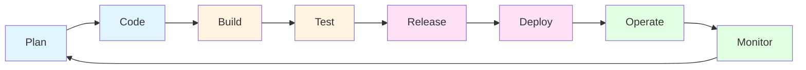
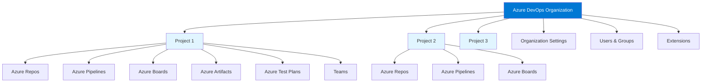

# Module 1: Introduction to Azure DevOps

## 1.1 What is Azure DevOps?

### Understanding DevOps Principles

DevOps is a cultural and technical movement that bridges the gap between software development and IT operations. The term combines "Development" and "Operations" to emphasize the need for collaboration between these traditionally separate teams. At its core, DevOps aims to shorten the software development lifecycle while delivering features, fixes, and updates frequently and reliably. The fundamental principles of DevOps include continuous integration, continuous delivery, infrastructure as code, monitoring and logging, and communication and collaboration.

The DevOps philosophy is built on several key pillars: automation, measurement, and sharing. Automation reduces manual work and human error, making processes more reliable and repeatable. Measurement involves collecting metrics and feedback at every stage of the development lifecycle to understand performance and identify bottlenecks. Sharing refers to the open communication and knowledge transfer between team members, breaking down silos that traditionally existed between development and operations teams.

DevOps practices have evolved to address the challenges of modern software development, where applications need to be deployed rapidly, scaled dynamically, and updated frequently. By implementing DevOps, organizations can achieve faster time-to-market, improved deployment frequency, lower failure rates, shortened lead times, and faster recovery from failures. The cultural shift required for DevOps adoption is often as important as the technical implementation, requiring changes in mindset, processes, and organizational structure.

### Overview of Azure DevOps Platform

Azure DevOps is Microsoft's comprehensive cloud-based platform that provides a complete set of tools for software development teams to plan, develop, test, and deploy applications. It is a Software as a Service (SaaS) offering that brings together five core services: Azure Repos for version control, Azure Pipelines for CI/CD, Azure Boards for work management, Azure Artifacts for package management, and Azure Test Plans for testing. These services work together seamlessly to provide an integrated DevOps solution.

The platform is designed to support teams of all sizes, from small startups to large enterprises, and can handle projects ranging from simple applications to complex, multi-team initiatives. Azure DevOps provides both cloud-hosted services (Azure DevOps Services) and on-premises options (Azure DevOps Server), giving organizations flexibility in how they deploy and manage their DevOps infrastructure. The platform integrates deeply with Microsoft's ecosystem, including Azure cloud services, Visual Studio, and Microsoft Teams, while also supporting open-source tools and third-party integrations.

Azure DevOps offers a unified experience through a web-based portal that provides access to all services, along with rich REST APIs that enable automation and integration with external tools. The platform supports multiple programming languages, frameworks, and deployment targets, making it suitable for diverse technology stacks. With features like unlimited private Git repositories, cloud-hosted build agents, and comprehensive reporting capabilities, Azure DevOps provides enterprise-grade functionality while maintaining ease of use for teams of all skill levels.

### Azure DevOps vs. Azure DevOps Server (On-Premises)

Azure DevOps Services is the cloud-hosted version of the platform, running on Microsoft's Azure infrastructure. It offers automatic updates, high availability, global scalability, and requires no infrastructure management from the organization. Teams can get started immediately without setting up servers, databases, or maintaining the underlying infrastructure. Azure DevOps Services is ideal for teams that want to focus on development rather than infrastructure management, and it provides built-in disaster recovery and backup capabilities.

Azure DevOps Server, formerly known as Team Foundation Server (TFS), is the on-premises version that organizations can install and manage on their own infrastructure. This option provides complete control over data, compliance with specific regulatory requirements, and the ability to work in air-gapped environments. Organizations choose Azure DevOps Server when they have strict data residency requirements, need to comply with specific security policies, or want to integrate with on-premises systems that cannot be exposed to the internet.

The choice between Azure DevOps Services and Azure DevOps Server depends on several factors including data sovereignty requirements, network connectivity, compliance needs, and organizational preferences. Both platforms offer similar functionality, but Azure DevOps Services receives updates more frequently and automatically, while Azure DevOps Server requires manual upgrades. Many organizations use a hybrid approach, with some projects in the cloud and others on-premises, and Azure DevOps supports this mixed deployment model.

#### Comparison Table: Azure DevOps Services vs. Azure DevOps Server

| Feature | Azure DevOps Services | Azure DevOps Server |
|---------|----------------------|-------------------|
| **Deployment** | Cloud-hosted (SaaS) | On-premises |
| **Infrastructure Management** | None required | Full management required |
| **Updates** | Automatic and frequent | Manual upgrades required |
| **Scalability** | Global, automatic scaling | Manual scaling required |
| **High Availability** | Built-in, managed by Microsoft | Must be configured manually |
| **Data Location** | Microsoft Azure data centers | Your own infrastructure |
| **Compliance** | Microsoft compliance certifications | Your own compliance responsibility |
| **Internet Required** | Yes | No (can work air-gapped) |
| **Initial Setup** | Immediate | Requires installation and configuration |
| **Cost Model** | Subscription-based | License + infrastructure costs |
| **Integration with Azure** | Native, seamless | Requires configuration |
| **Disaster Recovery** | Built-in, managed | Must be configured manually |
| **Maintenance** | None | Ongoing maintenance required |
| **Best For** | Most organizations, cloud-first | Strict data residency, air-gapped environments |

### Key Benefits and Use Cases

Azure DevOps provides numerous benefits that make it an attractive choice for development teams. One of the primary advantages is the integrated toolchain that eliminates the need to manage multiple separate tools and the complexity of integrating them. Teams can work within a single platform that handles everything from source control to deployment, reducing context switching and improving productivity. The platform's scalability means it can grow with your organization, supporting everything from small teams to enterprise-scale deployments with thousands of developers.

The platform excels in several key use cases. For organizations adopting Agile or Scrum methodologies, Azure Boards provides comprehensive work management capabilities with backlogs, sprints, and burndown charts. For teams implementing CI/CD, Azure Pipelines offers powerful automation capabilities that can build, test, and deploy applications to various platforms including Azure, AWS, and on-premises infrastructure. Organizations managing multiple projects can benefit from Azure DevOps's project and team organization features, allowing for proper isolation and access control.

Azure DevOps is particularly valuable for organizations already invested in the Microsoft ecosystem, as it provides seamless integration with Azure cloud services, Visual Studio, and Office 365. However, it also supports open-source technologies and can integrate with tools like Jenkins, GitHub, and Slack. The platform's REST APIs and extensibility through the marketplace make it adaptable to various workflows and requirements. Whether you're building web applications, mobile apps, microservices, or deploying infrastructure, Azure DevOps provides the tools and capabilities needed to support modern software development practices.

### DevOps Lifecycle and Practices

The DevOps lifecycle encompasses the entire journey from initial code commit to production deployment and monitoring. It typically includes stages such as plan, code, build, test, release, deploy, operate, and monitor. Each stage has specific practices and tools that support the overall goal of delivering software quickly and reliably. Azure DevOps provides capabilities that support each stage of this lifecycle, creating a seamless flow from planning to monitoring.

#### DevOps Lifecycle Flow Diagram

In the planning stage, teams use Azure Boards to create work items, manage backlogs, and plan sprints. The coding stage leverages Azure Repos for version control, with features like pull requests and code reviews ensuring code quality. The build stage uses Azure Pipelines to compile code, run tests, and create artifacts. Testing is integrated throughout the pipeline, with Azure Test Plans providing comprehensive test management capabilities. The release and deployment stages use Azure Pipelines to automate deployments to various environments, with approval gates and deployment strategies ensuring safe releases.

The operate and monitor stages involve running applications in production and gathering feedback. While Azure DevOps doesn't directly provide application monitoring, it integrates with Azure Monitor, Application Insights, and other monitoring tools to provide visibility into application health and performance. The feedback from monitoring feeds back into the planning stage, creating a continuous loop of improvement. This lifecycle approach ensures that teams can iterate quickly, respond to issues promptly, and continuously improve their software delivery process.

---

## 1.2 Azure DevOps Services Overview

### Azure DevOps Organization Structure

An Azure DevOps organization is the top-level container that holds all your projects, users, and resources. When you sign up for Azure DevOps, you create an organization that becomes the foundation for all your DevOps activities. The organization name becomes part of your Azure DevOps URL (e.g., `https://dev.azure.com/YourOrganization`), making it easy to identify and access your resources. Organizations can be associated with an Azure Active Directory (Azure AD) tenant, which provides enhanced security features, single sign-on capabilities, and centralized user management.

#### Azure DevOps Organization Structure

Within an organization, you can create multiple projects, each serving as a container for related work items, repositories, pipelines, and other resources. This structure allows large enterprises to organize their work logically, with separate projects for different products, teams, or business units. Organizations can have different billing models, including free tiers for small teams and paid plans for larger organizations that need additional features or build minutes. The organization settings allow administrators to configure policies, manage extensions, set up billing, and control various aspects of how Azure DevOps is used across all projects.

The organization structure also supports enterprise scenarios where you might need multiple organizations for different divisions, compliance requirements, or geographic regions. Each organization operates independently with its own users, projects, and settings, but users can be members of multiple organizations. This flexibility allows organizations to scale their DevOps adoption while maintaining proper boundaries and access controls.

### Understanding Projects and Teams

Projects in Azure DevOps are containers that hold all the work items, code repositories, build pipelines, and other resources related to a specific initiative or product. Each project can have its own security settings, area paths, iteration paths, and process template, allowing teams to work independently while still being part of the larger organization. Projects provide isolation between different initiatives, ensuring that teams working on different products don't interfere with each other's work.

Within a project, you can create multiple teams, which are groups of users who work together on related work items. Teams have their own backlogs, boards, and dashboards, allowing different teams within the same project to have customized views and workflows. This structure is particularly useful for large projects where multiple teams work on different features or components. Teams can be organized by feature area, component, or any other logical grouping that makes sense for your organization.

The project and team structure in Azure DevOps supports various organizational models, from small teams working on a single project to large enterprises with hundreds of teams across multiple projects. Teams can have their own area paths and iteration paths, allowing for flexible sprint planning and work organization. The hierarchical structure of organization → project → team provides a scalable model that can grow with your organization while maintaining clear boundaries and responsibilities.

### Service Connections and Service Hooks

Service connections in Azure DevOps are secure, reusable connections to external services that your pipelines and other Azure DevOps features need to access. These connections store authentication information securely, allowing pipelines to interact with services like Azure subscriptions, Docker registries, GitHub, Jenkins, and many others without exposing credentials in your pipeline code. Service connections are configured at the project or organization level and can be shared across multiple pipelines, reducing duplication and simplifying management.

When you create a service connection, Azure DevOps handles the authentication details, whether it's using service principals, managed identities, personal access tokens, or other authentication methods. This abstraction makes it easy to update credentials when they expire or rotate, without having to modify every pipeline that uses the connection. Service connections support various authentication types depending on the target service, and Azure DevOps provides built-in support for many common services while also allowing custom service connections for other services.

Service hooks provide a way to integrate Azure DevOps with external services by sending notifications when events occur in Azure DevOps. For example, you can configure service hooks to send messages to Slack when a work item is updated, create a card in Trello when a build completes, or trigger a webhook in your custom application when code is pushed to a repository. Service hooks support a wide variety of services out of the box, and you can also create custom webhooks to integrate with any service that accepts HTTP POST requests. This extensibility allows you to integrate Azure DevOps into your existing toolchain and workflows.

### Azure DevOps REST API Overview

The Azure DevOps REST API provides programmatic access to almost all functionality available through the web interface. This API enables automation, integration with external tools, custom reporting, and the creation of custom applications that interact with Azure DevOps. The API follows RESTful principles and uses standard HTTP methods (GET, POST, PATCH, DELETE) to perform operations on resources. All API endpoints are versioned, allowing you to use specific API versions while Microsoft continues to evolve the platform.

The REST API covers all major Azure DevOps services, including work items, builds, releases, repositories, test plans, and more. Each service has its own set of API endpoints, and the API documentation provides detailed information about available operations, required parameters, and response formats. The API uses OAuth 2.0 and personal access tokens (PATs) for authentication, making it easy to integrate with various tools and scripts. Many Azure DevOps features, including the web interface itself, use these same REST APIs under the hood.

The REST API is particularly valuable for automation scenarios, such as bulk operations on work items, custom reporting and analytics, integration with external systems, and creating custom tools that extend Azure DevOps functionality. The API supports both JSON and XML response formats, and Microsoft provides client libraries for .NET, Node.js, Python, and other languages to simplify API usage. The comprehensive REST API makes Azure DevOps highly extensible and allows organizations to integrate it deeply into their development workflows and toolchains.

---

## 1.3 Getting Started

### Creating an Azure DevOps Account

Getting started with Azure DevOps begins with creating a Microsoft account or using an existing one. If you don't have a Microsoft account, you can create one for free at account.microsoft.com. Once you have a Microsoft account, you can sign up for Azure DevOps by visiting dev.azure.com and clicking the "Start free" button. The signup process is straightforward and doesn't require a credit card for the free tier, making it easy for individuals and small teams to get started.

During the signup process, you'll be asked to create an organization name, which will become part of your Azure DevOps URL. Choose a name that represents your organization, team, or project, as this URL will be used to access all your Azure DevOps resources. The organization name must be globally unique, so you may need to try a few variations if your preferred name is already taken. After creating your organization, you'll have access to the free tier, which includes unlimited private Git repositories, up to five users with Basic access, and 1,800 build minutes per month.

The free tier is generous enough for small teams to get started and evaluate Azure DevOps. As your needs grow, you can upgrade to paid plans that provide additional features, more build minutes, and support for more users. The signup process also allows you to associate your organization with an Azure Active Directory tenant if your organization uses Azure AD, which provides enhanced security and user management capabilities.

### Setting up an Organization

After creating your Azure DevOps account, the next step is to configure your organization settings. The organization settings page allows you to manage users, configure security policies, set up billing, manage extensions, and configure various organization-wide settings. One of the first things you should do is invite team members to your organization by adding their email addresses. You can assign them appropriate access levels (Stakeholder, Basic, Basic + Test Plans, or Visual Studio) based on their role and needs.

Organization settings also allow you to configure security policies, such as requiring two-factor authentication, setting up conditional access policies if you're using Azure AD, and configuring IP restrictions. You can set up billing if you need paid features or additional build minutes, and you can manage the extensions installed in your organization. The organization settings provide a centralized place to manage all aspects of your Azure DevOps organization, ensuring consistent policies and configurations across all projects.

If your organization uses Azure Active Directory, you can connect your Azure DevOps organization to your Azure AD tenant. This integration provides several benefits, including single sign-on, centralized user management, conditional access policies, and the ability to use Azure AD groups for permissions. The integration also allows you to see Azure AD users in your organization's user list and manage their access through Azure AD rather than individually in Azure DevOps.

### Creating your First Project

Creating your first project in Azure DevOps is a simple process that takes just a few minutes. From your organization homepage, click the "New project" button, and you'll be presented with a form to enter project details. You'll need to provide a project name, which should be descriptive and help identify the project's purpose. You can also add an optional description to provide more context about the project.

During project creation, you'll choose a visibility setting (private or public) and select a process template. The process template determines the work item types, workflow states, and other process-related configurations available in your project. Azure DevOps provides three built-in process templates: Basic (for simple workflows), Agile (for Agile teams), and Scrum (for Scrum teams). You can also use inherited processes if your organization has customized process templates. The choice of process template affects how you'll manage work items and plan sprints, so choose one that matches your team's methodology.

After creating the project, you'll have access to all Azure DevOps services within that project context. You can create repositories, set up pipelines, create work items, and configure project-specific settings. The project dashboard provides an overview of recent activity, and you can customize it with widgets that show information relevant to your team. Creating your first project is the gateway to using all of Azure DevOps's features, and you can create additional projects as needed to organize different initiatives or products.

### Navigating the Azure DevOps Portal

The Azure DevOps portal provides a unified web interface for accessing all services and features. The portal is organized into several main areas, each accessible through the left navigation menu. The "Overview" section provides project dashboards and summaries, while "Boards" gives access to work items, backlogs, and boards. "Repos" provides access to your Git repositories, "Pipelines" shows your build and release pipelines, "Test Plans" provides test management features, and "Artifacts" shows your package feeds.

The top navigation bar provides quick access to search functionality, notifications, user settings, and help. The search feature is particularly powerful, allowing you to search across work items, code, pipelines, and other resources. The portal is responsive and works well on various screen sizes, though the full feature set is best experienced on desktop browsers. The interface is customizable, allowing you to pin frequently used items and configure dashboards to show the information most relevant to your work.

Each service area has its own interface optimized for its specific purpose. For example, the Boards area provides Kanban boards and backlogs optimized for work management, while the Repos area provides a code browser and pull request interface optimized for code review. The Pipelines area shows pipeline runs and allows you to create and edit pipelines. Despite the different interfaces, the overall navigation remains consistent, making it easy to move between different areas of Azure DevOps.

### User Interface Overview

The Azure DevOps user interface is designed to be intuitive and efficient, with consistent patterns across all service areas. The interface uses a modern, clean design that focuses on content and reduces visual clutter. Key interface elements include the top navigation bar for global navigation, the left sidebar for service-specific navigation, and the main content area that displays the current view. The interface supports keyboard shortcuts for common operations, improving productivity for power users.

The interface is highly customizable, allowing users to configure dashboards, board views, and other elements to match their workflow preferences. Widgets can be added to dashboards to show charts, queries, and other information. Board views can be customized with different columns, swimlanes, and card styles. This customization capability ensures that teams can adapt Azure DevOps to their specific needs and preferences rather than being forced into a one-size-fits-all approach.

The user interface also provides contextual help and tooltips throughout, making it easier for new users to understand features and for experienced users to discover advanced capabilities. The interface is accessible and follows web accessibility standards, ensuring that users with disabilities can effectively use the platform. Overall, the Azure DevOps user interface strikes a balance between power and simplicity, providing advanced features when needed while maintaining an approachable interface for everyday use.

---

## Quick Reference

### Azure DevOps Services
- **Azure Repos**: Version control (Git, TFVC)
- **Azure Pipelines**: CI/CD automation
- **Azure Boards**: Work management
- **Azure Artifacts**: Package management
- **Azure Test Plans**: Test management

### Key Concepts
- **Organization**: Top-level container
- **Project**: Container for resources
- **Team**: Group of users working together
- **Service Connection**: Secure external service access

---

## Common Pitfalls

### Pitfall 1: Not Understanding Organization Structure
**Problem**: Confusion about organization vs. project vs. team
**Solution**: Study organization hierarchy
**Prevention**: Understand structure before creating resources

### Pitfall 2: Choosing Wrong Process Template
**Problem**: Work item types don't match workflow
**Solution**: Choose appropriate template (Basic, Agile, Scrum)
**Prevention**: Understand process templates before project creation

### Pitfall 3: Not Securing Organization
**Problem**: Security vulnerabilities, unauthorized access
**Solution**: Configure security policies, use Azure AD
**Prevention**: Secure organization from the start

---

## Best Practices

1. **Plan Organization Structure**: Design before creating
2. **Use Appropriate Process Template**: Match your methodology
3. **Secure Organization**: Enable security features
4. **Organize with Projects**: Logical project structure
5. **Use Teams**: Organize users into teams
6. **Configure Service Connections**: Secure external access
7. **Use Azure AD Integration**: Enhanced security
8. **Document Structure**: Clear documentation
9. **Monitor Usage**: Track organization usage
10. **Review Regularly**: Optimize organization structure

---

## Further Reading

### Official Documentation
- [Azure DevOps Documentation](https://docs.microsoft.com/azure/devops/)
- [Getting Started](https://docs.microsoft.com/azure/devops/get-started/)
- [Organization Management](https://docs.microsoft.com/azure/devops/organizations/)

### Related Topics
- Azure Repos (Module 2)
- Azure Pipelines (Module 3)
- Azure Boards (Module 4)

---

*This module provides a comprehensive introduction to Azure DevOps, covering its purpose, architecture, and getting started. Understanding these fundamentals is essential for effectively using Azure DevOps for DevOps automation.*

