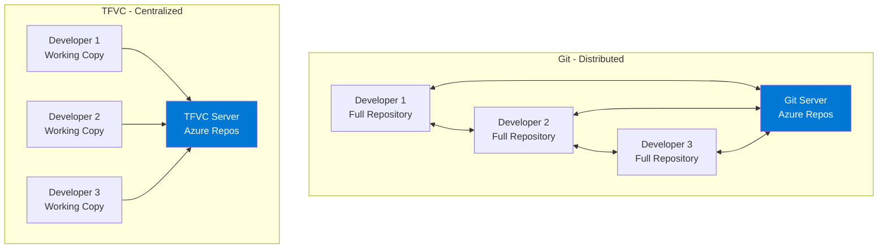
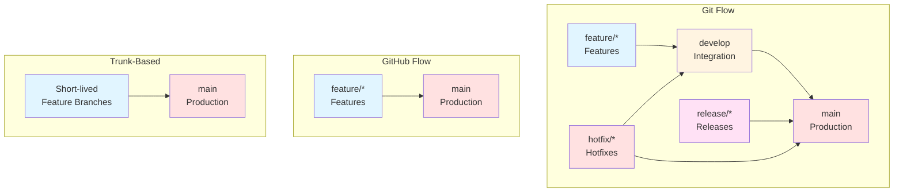
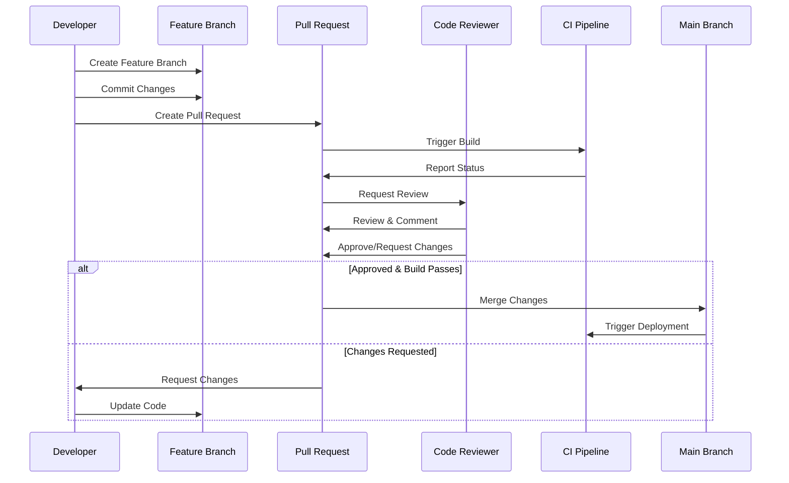

# Module 2: Azure Repos (Version Control)

## 2.1 Introduction to Version Control

### Version Control Concepts

Version control, also known as source control or revision control, is a system that tracks changes to files over time, allowing you to recall specific versions later. It is an essential tool for software development that enables multiple developers to work on the same codebase simultaneously without conflicts, maintains a complete history of all changes, and provides the ability to revert to previous versions when needed. Version control systems solve the problem of managing changes to code, documentation, and other files in a collaborative environment.

The fundamental concept of version control is the repository, which is a database that stores all versions of files along with metadata about changes, who made them, and when. When you make changes to files, you commit them to the repository, creating a new version. Each commit represents a snapshot of your files at a specific point in time, and you can view the history of commits to see how your project evolved. This history is invaluable for understanding why changes were made, debugging issues, and maintaining code quality.

Version control systems also support branching, which allows you to create separate lines of development. You can work on new features in a branch without affecting the main codebase, and then merge your changes back when ready. This enables parallel development, experimentation, and the ability to maintain multiple versions of your software simultaneously. Modern version control systems like Git have made branching and merging fast and efficient, enabling workflows that were impractical with earlier systems.

### Git vs. Team Foundation Version Control (TFVC)

Azure Repos supports two version control systems: Git and Team Foundation Version Control (TFVC). Git is a distributed version control system that has become the industry standard for most software development projects. In Git, every developer has a complete copy of the repository on their local machine, including the full history. This distributed nature makes Git fast, allows offline work, and provides redundancy. Git's branching and merging capabilities are extremely powerful, making it ideal for modern development workflows that involve feature branches, pull requests, and code reviews.

Team Foundation Version Control (TFVC) is a centralized version control system where the repository exists on a server, and developers check out files to work on them locally. TFVC uses a "checkout-edit-checkin" model where files are locked during editing, preventing conflicts but potentially creating bottlenecks. TFVC is better suited for teams that prefer a more controlled, centralized workflow and for projects with very large binary files. However, Git has largely replaced TFVC in most modern development scenarios due to its flexibility, performance, and industry adoption.

The choice between Git and TFVC depends on your team's preferences, workflow requirements, and the nature of your project. Git is generally recommended for new projects due to its flexibility, strong community support, and integration with modern development tools. TFVC may still be appropriate for teams with existing TFVC repositories or specific requirements that favor centralized version control. Azure Repos supports both systems, allowing teams to choose the one that best fits their needs.

#### Comparison Table: Git vs. TFVC

| Feature | Git | TFVC |
|---------|-----|------|
| **Architecture** | Distributed | Centralized |
| **Local Repository** | Full copy with history | Working copy only |
| **Offline Work** | Full support | Limited |
| **Branching** | Fast, lightweight | Slower, heavier |
| **Merging** | Advanced, automatic | Basic, manual |
| **File Locking** | No | Yes (optional) |
| **Binary Files** | Not optimized | Better support |
| **Industry Adoption** | Industry standard | Declining |
| **Learning Curve** | Moderate | Easier for beginners |
| **Best For** | Most modern projects | Legacy projects, large binaries |
| **Recommended** | Yes (for new projects) | Only for specific needs |

#### Git vs. TFVC Architecture Diagram



### Choosing the Right Version Control System

When choosing between Git and TFVC, consider several factors including your team size, workflow preferences, file types, and integration requirements. Git is ideal for teams that want flexibility in their workflow, need to work offline frequently, or want to leverage the extensive ecosystem of Git-based tools and services. Git's distributed nature makes it resilient to server failures and allows for more experimentation without affecting the central repository.

TFVC may be better for teams that prefer a more structured, controlled workflow with explicit file locking and a clear central authority. However, the industry trend strongly favors Git, and most modern tools, services, and best practices are built around Git. If you're starting a new project, Git is almost always the right choice. If you have existing TFVC repositories, you can migrate them to Git, and Azure DevOps provides tools to help with this migration.

The decision also depends on the types of files in your repository. Git works best with text-based files like source code, configuration files, and documentation. While Git can handle binary files, it's not optimized for them, and large binary files can make repositories slow and unwieldy. TFVC handles large binary files better, but even then, it's often better to use external artifact repositories for binaries. For most software development projects, Git is the clear choice, and Azure Repos provides excellent Git support with features like pull requests, branch policies, and integration with other Azure DevOps services.

### Git Fundamentals (Commits, Branches, Merges)

Understanding Git fundamentals is essential for effective version control. A commit in Git is a snapshot of your repository at a specific point in time, along with metadata including the author, timestamp, and a commit message describing the changes. Commits are identified by unique SHA-1 hashes, making them immutable and allowing Git to efficiently track changes. When you commit changes, you're creating a new version of your repository that you can always return to.

Branches in Git are lightweight pointers to specific commits, allowing you to create separate lines of development. The default branch is typically called "main" or "master," and you create new branches to work on features, bug fixes, or experiments. Creating a branch is fast and doesn't duplicate files; it just creates a new pointer. You can switch between branches easily, and Git tracks which branch you're currently on. This branching model enables workflows like Git Flow, where you have long-lived branches for different purposes (main, develop, feature branches, etc.).

Merging combines changes from one branch into another. Git's merge algorithm is sophisticated and can automatically combine changes from different branches when they don't conflict. When conflicts occur, Git marks them in the files, and you resolve them manually. Git also supports rebasing, which replays commits from one branch onto another, creating a linear history. Understanding when to merge vs. rebase is important for maintaining a clean project history. These fundamental Git concepts form the foundation for all advanced Git workflows and are essential knowledge for any developer using version control.

---

## 2.2 Working with Azure Repos

### Creating and Managing Repositories

Creating a repository in Azure Repos is straightforward and can be done through the web interface or using Git commands. When you create a new repository, you can choose between Git and TFVC, set the initial branch name, add a README file, and configure a .gitignore file appropriate for your project type. The repository is created within your Azure DevOps project and is immediately available for use. You can create multiple repositories within a project, allowing you to organize code for different components or services.

Managing repositories involves configuring settings like branch policies, permissions, security settings, and integration with other Azure DevOps services. The repository settings allow you to control who can access the repository, what they can do (read, write, administer), and configure policies that enforce code quality and review requirements. You can also configure webhooks to trigger external services when code is pushed, set up service connections for integrations, and manage repository-level settings that affect how the repository behaves.

Repository management also includes maintenance tasks like cleaning up old branches, managing large files, and configuring retention policies. Azure Repos provides tools to help identify and remove unused branches, and you can use Git LFS (Large File Storage) for large binary files. The repository settings provide a centralized place to manage all aspects of your repository, ensuring that it's configured correctly for your team's needs and workflow requirements.

### Cloning Repositories

Cloning a repository creates a local copy on your machine, including the complete history and all branches. In Azure Repos, you can clone a repository using HTTPS or SSH, and the web interface provides the exact command you need to run. Cloning is typically the first step when starting work on a project, giving you a local copy that you can work with offline and commit changes to before pushing them back to the server.

The clone command downloads all the repository data, which can take time for large repositories with long histories. Once cloned, you have a fully functional local repository that you can work with using standard Git commands. You can create branches, make commits, and perform all Git operations locally. When you're ready to share your changes, you push them to the remote repository in Azure Repos. This distributed workflow is one of Git's key advantages, allowing developers to work independently and synchronize when ready.

Azure Repos also supports shallow cloning, which downloads only recent history, and partial cloning, which downloads only specific parts of the repository. These options can be useful for very large repositories or when you only need recent history. The clone URL provided by Azure Repos includes authentication information, and you can configure credential managers to store your credentials securely, avoiding the need to enter them repeatedly.

### Branching Strategies (Git Flow, GitHub Flow, Trunk-based)

Branching strategies define how teams use branches to organize their work and manage releases. Git Flow is a branching model that uses long-lived branches for different purposes: main for production releases, develop for integration, feature branches for new features, release branches for preparing releases, and hotfix branches for urgent production fixes. This model provides clear separation between different types of work and is well-suited for projects with scheduled releases and multiple versions in maintenance.

GitHub Flow is a simpler branching strategy that uses only two types of branches: main (for production-ready code) and feature branches (for all development work). Feature branches are created from main, developed, and then merged back via pull requests. This model is ideal for projects with continuous deployment where code in main is always deployable. It's simpler than Git Flow and works well for teams that deploy frequently and don't need to maintain multiple release versions.

Trunk-based development is a branching strategy where developers work directly on the main branch or create very short-lived feature branches that are merged quickly. This approach minimizes merge conflicts and integration issues by keeping branches short-lived and ensuring frequent integration. It requires strong testing and CI/CD practices to ensure that main is always in a deployable state. Trunk-based development is often used by teams practicing continuous deployment and is considered a best practice for high-performing teams.

The choice of branching strategy depends on your team size, release cadence, and workflow preferences. Azure Repos supports all these strategies and provides features like branch policies that can enforce your chosen strategy. You can also mix strategies or adapt them to your specific needs, as Azure Repos is flexible enough to support various workflows.

#### Branching Strategies Comparison



#### Branching Strategies Comparison Table

| Strategy | Complexity | Release Cadence | Best For | Branch Types |
|---------|-----------|----------------|----------|--------------|
| **Git Flow** | High | Scheduled releases | Multiple versions, complex projects | main, develop, feature, release, hotfix |
| **GitHub Flow** | Low | Continuous deployment | Simple projects, frequent releases | main, feature |
| **Trunk-Based** | Very Low | Continuous deployment | High-performing teams, CI/CD mature | main, short-lived features |

### Branch Policies and Protection Rules

Branch policies in Azure Repos enforce code quality and review requirements before code can be merged into protected branches. These policies help maintain code quality, ensure that code is reviewed, and prevent direct pushes to important branches. Common branch policies include requiring pull requests for all changes, requiring a minimum number of reviewers, requiring that builds pass before merging, and requiring that work items be linked to pull requests.

When you configure branch policies, you can specify which branches they apply to, typically protecting main and other important branches. The policies are enforced automatically when someone tries to merge code, preventing merges that don't meet the requirements. This automation ensures consistent application of your team's standards and reduces the burden on team leads who would otherwise need to manually enforce these rules.

Branch policies can also include status checks that verify external conditions, such as builds in Azure Pipelines, security scans, or other automated checks. These status checks must pass before a pull request can be completed, ensuring that code meets all quality gates. Branch policies are a key feature for maintaining code quality in collaborative environments and are essential for any serious software development project.

### Pull Requests and Code Reviews

Pull requests (PRs) are a mechanism for proposing changes to a repository and requesting that they be reviewed and merged. In Azure Repos, pull requests provide a rich interface for code review, discussion, and collaboration. When you create a pull request, you're asking team members to review your changes before they're merged into the target branch. Pull requests show the differences between branches, allow reviewers to comment on specific lines of code, and provide a discussion thread for the entire change.

#### Pull Request Workflow



The pull request interface in Azure Repos is designed to make code review efficient and thorough. Reviewers can see all changes in a unified diff view, comment on specific lines or sections, suggest changes, and approve or reject the pull request. The interface also shows build status, test results, and other automated checks, giving reviewers confidence that the code works correctly. Pull requests can be linked to work items, providing traceability between code changes and requirements or bugs.

Code review through pull requests is a best practice that improves code quality, shares knowledge across the team, and catches bugs before they reach production. Azure Repos makes the review process smooth with features like inline comments, file-level comments, and the ability to resolve discussions. Reviewers can request changes, which blocks the merge until the author addresses the feedback. This collaborative process ensures that code meets team standards and that multiple people understand the changes being made.

### Merge Strategies and Conflict Resolution

When merging branches in Git, you can use different merge strategies depending on your needs. The default merge strategy creates a merge commit that combines the histories of both branches, preserving the complete development history. This is useful when you want to maintain a record of when branches were merged and keep the branch structure visible in the history. Fast-forward merges are possible when the target branch hasn't diverged, creating a linear history without a merge commit.

Rebasing is an alternative to merging that replays commits from one branch onto another, creating a linear history. Rebasing can make the project history cleaner and easier to understand, but it rewrites commit history, which can be problematic if others are working with the same branches. Azure Repos supports both merge and rebase strategies, and you can configure which strategy to use for pull requests. Squash merging is another option that combines all commits from a branch into a single commit when merging, useful for keeping the main branch history clean.

Conflict resolution is necessary when Git cannot automatically merge changes because the same parts of files were modified in both branches. Azure Repos provides tools to help resolve conflicts, including a web-based conflict resolution interface. When conflicts occur, you can see both versions of the conflicting sections and choose which changes to keep, or manually edit to combine changes. Resolving conflicts requires understanding the changes in both branches and making informed decisions about how to combine them. Good communication between developers and clear coding practices can minimize conflicts, but they're an inevitable part of collaborative development.

---

## 2.3 Advanced Git Operations

### Git Hooks and Automation

Git hooks are scripts that run automatically at certain points in the Git workflow, such as before commits, after commits, before pushes, and after merges. These hooks allow you to automate tasks, enforce policies, and integrate Git with other tools. Azure Repos supports server-side hooks that run on the Azure DevOps servers, allowing you to enforce organization-wide policies and automate processes. While you can't directly install hooks in Azure Repos like you can in a local Git repository, you can achieve similar automation through branch policies, pipeline triggers, and service hooks.

Client-side hooks run on developers' local machines and can be used for tasks like running tests before commits, checking code style, or validating commit messages. These hooks are part of the Git repository and are cloned along with the code, but they require developers to have them enabled. While client-side hooks can improve individual developer workflows, they shouldn't be relied upon for enforcement since they can be bypassed.

Azure DevOps provides alternative mechanisms for automation that serve similar purposes to Git hooks. Branch policies can enforce requirements before code is merged, pipelines can run automated checks, and service hooks can trigger external processes. These mechanisms are more reliable than client-side hooks because they run on the server and cannot be bypassed. Understanding how to use these Azure DevOps features to achieve the automation goals that Git hooks would provide is important for effective repository management.

### Large File Storage (Git LFS)

Git Large File Storage (LFS) is an extension to Git that handles large files efficiently by storing them outside the main Git repository and downloading them only when needed. Regular Git repositories can become slow and unwieldy when they contain large binary files like images, videos, compiled binaries, or datasets. Git LFS solves this problem by replacing large files with text pointers in the repository and storing the actual files in a separate LFS server.

Azure Repos has built-in support for Git LFS, allowing you to use it without additional configuration. When you enable Git LFS for a repository and track certain file types, those files are automatically handled by LFS. The files are stored efficiently, and only the pointers are included in the repository history, keeping the repository fast and manageable. When you clone the repository or check out a branch, Git LFS downloads the actual files as needed.

Using Git LFS is recommended for any files larger than a few megabytes, especially binary files that don't benefit from Git's text-based diff algorithms. Common use cases include game assets, design files, compiled binaries, and datasets. Azure Repos provides generous LFS storage quotas, and you can monitor LFS usage through the repository settings. Understanding when and how to use Git LFS is important for maintaining repository performance and avoiding issues with large files.

### Submodules and Subtrees

Git submodules allow you to include one Git repository as a subdirectory of another repository. This is useful when you want to include code from another project while keeping the repositories separate. Submodules maintain a link to a specific commit in the external repository, allowing you to track when the external code changes and update to newer versions when desired. However, submodules can be complex to work with and require developers to understand how to initialize and update them.

Subtrees are an alternative to submodules that merge an external repository's history into your repository. Unlike submodules, subtrees don't require special commands to work with the included code; it's just part of your repository. However, updating subtrees can be more complex than updating submodules, and the history can become messy if not managed carefully.

Both submodules and subtrees have their use cases, but they add complexity to repository management. In many cases, it's better to use package managers (like npm, NuGet, or Maven) to manage dependencies rather than including external repositories directly. However, when you need to include and potentially modify external code, submodules or subtrees can be appropriate solutions. Azure Repos supports both, and you should choose based on your specific needs and team's comfort with the added complexity.

### Tagging and Releases

Tags in Git are references to specific commits, typically used to mark release points in your project's history. Unlike branches, tags are immutable and don't change once created, making them perfect for marking versions. Azure Repos supports both lightweight tags (just a pointer to a commit) and annotated tags (with metadata like author and message). Tags are commonly used to mark releases, with version numbers like v1.0.0, v2.1.3, etc.

Azure DevOps integrates tags with the release management features, allowing you to create releases from tags and track which code is deployed to which environments. You can create tags through the web interface or using Git commands, and they're visible in the repository history. Tags help you identify specific versions of your code and are essential for managing releases and maintaining multiple versions of your software.

Releases in Azure DevOps are more than just tags; they represent a complete deployment package including the code, build artifacts, and deployment configuration. However, tags are often used as the starting point for releases, providing a clear link between the source code and what was deployed. Understanding how to use tags effectively helps you manage your project's version history and track what code is running in production.

### Git Aliases and Shortcuts

Git aliases allow you to create shortcuts for Git commands, making common operations faster and easier to remember. For example, you can create an alias "co" for "checkout" or "st" for "status", reducing typing and making Git more efficient to use. Aliases can be simple command substitutions or complex shell scripts that combine multiple Git operations. They're stored in your Git configuration and are available in all your repositories.

While Git aliases are a local configuration and not part of Azure Repos itself, they're an important tool for developers working with Git. Popular aliases include shortcuts for common operations like viewing logs, checking status, and switching branches. Some teams even share aliases through documentation or configuration files to ensure consistency across the team.

Azure Repos doesn't provide its own aliasing system, but the web interface provides shortcuts and the ability to bookmark frequently used views. Understanding how to use Git aliases effectively can significantly improve your productivity when working with Git repositories, whether they're in Azure Repos or elsewhere.

### Repository Security and Permissions

Repository security in Azure Repos is managed through Azure DevOps's permission system, which provides fine-grained control over who can do what with your repositories. Permissions can be set at the organization, project, and repository levels, with more specific settings overriding more general ones. You can control who can read the repository, who can contribute code, who can administer the repository, and various other permissions.

Repository permissions work in conjunction with branch policies to provide comprehensive security. Even if someone has write access to a repository, branch policies can prevent them from pushing directly to protected branches, requiring pull requests instead. This two-layer approach (permissions + policies) provides both flexibility and security, allowing you to give developers the access they need while protecting important branches.

Azure Repos also supports repository-level security features like requiring two-factor authentication for certain operations, IP restrictions, and integration with Azure Active Directory for centralized user management. Understanding how to configure repository permissions and security settings is essential for maintaining the security of your codebase while allowing your team to work effectively.

---

## 2.4 Code Review Best Practices

### Pull Request Templates

Pull request templates are predefined templates that guide developers in providing consistent, useful information when creating pull requests. A good template prompts for a description of changes, related work items, testing performed, and any breaking changes. Templates ensure that pull requests include all the information reviewers need to understand and evaluate the changes, making the review process more efficient and thorough.

Azure Repos supports pull request templates through markdown files in your repository. When you create a pull request, the template is automatically included, and you fill in the relevant sections. Templates can be customized per repository and can include checkboxes, sections for different types of information, and links to relevant documentation. Having a standard template ensures consistency across all pull requests and helps maintain high-quality reviews.

Well-designed templates strike a balance between being comprehensive and not being too burdensome. They should prompt for essential information without requiring excessive detail for simple changes. Teams often evolve their templates over time based on what information proves most useful during reviews. Templates are a simple but effective way to improve the code review process and ensure that important information isn't overlooked.

### Code Review Policies

Code review policies in Azure Repos are configured through branch policies and define requirements that must be met before code can be merged. These policies can require a minimum number of approvals, require specific reviewers for certain areas of code, require that all comments are resolved, and prevent authors from approving their own changes. Policies are enforced automatically, ensuring consistent application of your team's review standards.

Effective code review policies balance thoroughness with efficiency. Requiring too many approvals or too strict policies can slow down development, while too lenient policies may not catch issues. Common practices include requiring at least one approval for most changes, requiring multiple approvals for sensitive areas, and requiring that builds pass before merging. The policies should reflect your team's needs and can be adjusted as your team and project evolve.

Code review policies work best when combined with a culture that values constructive feedback and learning. Policies can enforce the process, but the quality of reviews depends on reviewers taking the time to understand changes and provide helpful feedback. Training team members on effective code review practices and creating an environment where feedback is welcomed and acted upon are essential for getting the most value from code review policies.

### Required Reviewers

Azure Repos allows you to specify required reviewers for pull requests, either through branch policies or by assigning reviewers when creating the pull request. Required reviewers must approve the pull request before it can be completed, ensuring that specific people or teams review certain types of changes. This is particularly useful for ensuring that subject matter experts review changes in their areas or that security teams review security-sensitive changes.

You can configure required reviewers based on the files changed, the area path of linked work items, or other criteria. For example, you might require that database changes be reviewed by a database administrator, or that security-related changes be reviewed by the security team. This targeted review approach ensures that the right people see the right changes, improving review quality without requiring everyone to review everything.

Required reviewers can be individuals or groups, and you can require multiple reviewers for particularly important changes. The system tracks who has reviewed and approved, making it clear when all requirements are met. This feature helps ensure that critical changes receive appropriate scrutiny while allowing routine changes to flow through more quickly.

### Build Validation in Pull Requests

Build validation is a branch policy that requires that automated builds pass before a pull request can be completed. This ensures that code compiles, tests pass, and other automated checks succeed before code is merged. Build validation is one of the most important branch policies, as it prevents broken code from entering your main branch and maintains the stability of your codebase.

When you configure build validation, you specify which pipeline should run, and Azure DevOps automatically triggers that pipeline whenever a pull request is created or updated. The build status is displayed in the pull request, and the merge is blocked until the build succeeds. This automated gate prevents many common issues and gives reviewers confidence that the code works correctly.

Build validation should be fast to provide quick feedback to developers. Long-running builds can slow down the development process, so it's important to optimize your validation builds to run only essential checks. You might have a quick build for pull request validation and a more comprehensive build for releases. The goal is to catch issues early without creating bottlenecks in the development workflow.

### Status Checks and Branch Policies

Status checks are automated validations that must pass before a pull request can be completed. These can include builds, tests, security scans, code analysis, and other automated checks. Azure DevOps displays the status of all checks in the pull request, making it clear what needs to pass before merging. Status checks provide confidence that code meets quality standards and help prevent issues from reaching production.

Branch policies can require that specific status checks pass, creating quality gates that cannot be bypassed. You can configure different policies for different branches, applying stricter requirements to more important branches. For example, you might require only that builds pass for feature branches, but require builds, tests, security scans, and code coverage for the main branch.

The combination of status checks and branch policies creates a robust quality assurance system that runs automatically and consistently. This automation reduces the burden on human reviewers and ensures that all code meets minimum quality standards. However, automated checks should complement, not replace, human code review, as they catch different types of issues. The best approach combines automated validation with thorough human review.

---

## Quick Reference

### Version Control Systems
- **Git**: Distributed version control (recommended)
- **TFVC**: Centralized version control (legacy)

### Common Git Commands
```bash
# Clone repository
git clone https://dev.azure.com/org/project/_git/repo

# Create branch
git checkout -b feature-branch

# Commit changes
git add .
git commit -m "Message"
git push
```

### Branch Strategies
- **Git Flow**: Feature, develop, main branches
- **GitHub Flow**: Feature branches to main
- **Trunk-Based**: Short-lived feature branches

---

## Common Pitfalls

### Pitfall 1: Not Using Branch Policies
**Problem**: Code merged without review, quality issues
**Solution**: Configure branch policies for all branches
**Prevention**: Set up policies from the start

### Pitfall 2: Large Binary Files in Git
**Problem**: Repository bloat, slow performance
**Solution**: Use Git LFS or TFVC for large binaries
**Prevention**: Plan file storage strategy

### Pitfall 3: Not Using Pull Requests
**Problem**: Direct commits to main, no code review
**Solution**: Require pull requests for all changes
**Prevention**: Configure branch policies

---

## Best Practices

1. **Use Git**: Prefer Git over TFVC for new projects
2. **Use Branch Policies**: Protect important branches
3. **Require Pull Requests**: Code review for all changes
4. **Use Meaningful Commits**: Clear commit messages
5. **Keep Branches Short-Lived**: Merge frequently
6. **Use .gitignore**: Exclude unnecessary files
7. **Document Workflows**: Clear branching strategy
8. **Use Status Checks**: Automated quality gates
9. **Review Regularly**: Code review best practices
10. **Monitor Repository**: Track repository health

---

## Further Reading

### Official Documentation
- [Azure Repos](https://docs.microsoft.com/azure/devops/repos/)
- [Git Workflows](https://docs.microsoft.com/azure/devops/repos/git/gitworkflow)
- [Branch Policies](https://docs.microsoft.com/azure/devops/repos/git/branch-policies)

### Related Topics
- Introduction to Azure DevOps (Module 1)
- Azure Pipelines (Module 3)
- Best Practices and Patterns (Module 10)

---

*This module covers Azure Repos and version control in detail. Understanding version control is essential for collaborative software development, and Azure Repos provides powerful Git and TFVC capabilities that support modern development workflows.*

