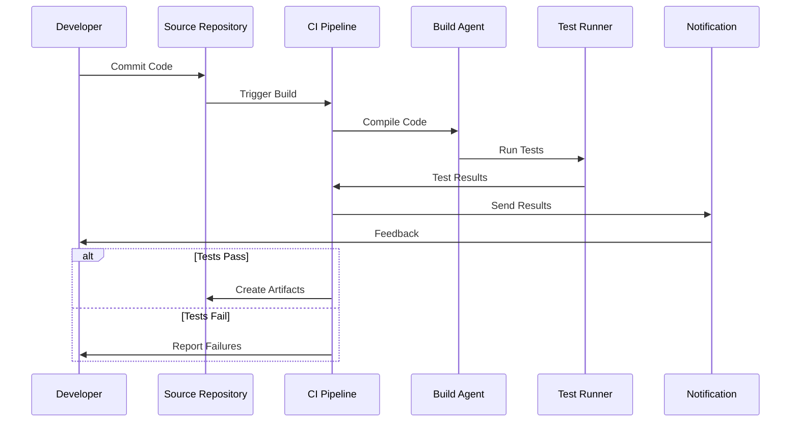
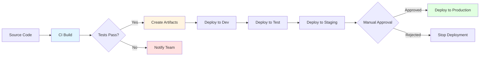
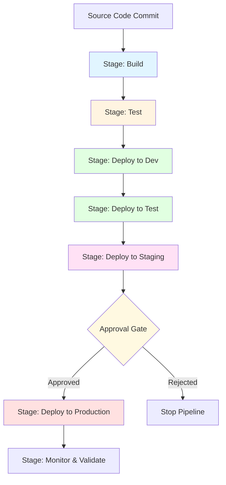
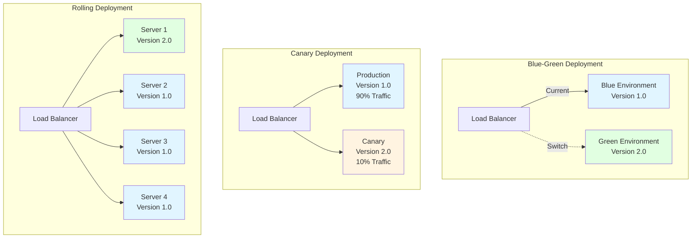

# Module 3: Azure Pipelines (CI/CD)

## 3.1 Introduction to CI/CD

### Continuous Integration (CI) Concepts

Continuous Integration (CI) is a development practice where developers frequently integrate their code changes into a shared repository, and automated builds and tests are run to detect integration errors as quickly as possible. The goal of CI is to catch bugs early, reduce integration problems, and provide rapid feedback to developers about the quality of their code. In a CI environment, every code commit triggers an automated build process that compiles the code, runs tests, and performs various quality checks.

#### Continuous Integration Flow

The fundamental principle of CI is that integration should happen frequently—ideally, every time a developer commits code. This frequent integration means that problems are discovered quickly, when they're easiest to fix, rather than accumulating and causing major issues later. CI requires a robust automated build system that can compile code, run tests, and provide feedback quickly. The build process should be fast enough that developers get feedback within minutes of committing code, allowing them to fix issues immediately while the context is still fresh in their minds.

CI practices have evolved to include not just compilation and basic testing, but also code analysis, security scanning, dependency checking, and other quality gates. Modern CI systems like Azure Pipelines can run these checks in parallel, providing comprehensive feedback quickly. The CI process creates artifacts that are ready for deployment, ensuring that the code that passes CI is in a deployable state. This foundation makes it possible to implement continuous delivery and deployment practices.

### Continuous Delivery (CD) Concepts

Continuous Delivery (CD) extends CI by ensuring that code is always in a deployable state and can be released to production at any time with minimal manual intervention. The key difference between CI and CD is that CD includes the deployment process, automatically deploying code to staging or pre-production environments after successful CI. CD requires that the entire process from code commit to deployment be automated, reliable, and repeatable.

#### Continuous Delivery Pipeline Flow

In a CD pipeline, code that passes CI is automatically deployed to one or more environments, typically starting with development, then test, staging, and finally production. Each environment deployment may require manual approval, especially for production, but the deployment process itself is automated. This automation ensures consistency across environments and reduces the risk of human error during deployment. CD pipelines also typically include automated testing in each environment to verify that deployments are successful.

The goal of CD is to make releases routine, low-risk events that can be performed on demand. By automating deployments and ensuring code is always deployable, teams can release software more frequently, respond to market demands faster, and reduce the stress and risk associated with manual deployments. CD doesn't mean that every change goes to production automatically; it means that the process is automated and code is always ready for production release when the business decides to deploy it.

### Continuous Deployment Concepts

Continuous Deployment takes CD one step further by automatically deploying every change that passes the automated tests to production, without requiring manual approval. This practice is the most aggressive form of automation and requires extremely high confidence in the automated testing and quality gates. Not all organizations or applications are suitable for continuous deployment, as it requires robust testing, monitoring, and the ability to quickly roll back if issues are detected.

Continuous deployment is most successful when combined with feature flags, canary deployments, and other techniques that allow new features to be deployed gradually and controlled. Even with continuous deployment, teams often use techniques like blue-green deployments or canary releases to minimize risk. The key is having such confidence in the automated quality gates that manual approval becomes unnecessary, and having such good monitoring and rollback capabilities that issues can be detected and addressed immediately.

The benefits of continuous deployment include the fastest possible feedback loop, the ability to release features as soon as they're ready, and the elimination of deployment bottlenecks. However, it requires significant investment in automation, testing, and monitoring infrastructure. Many organizations practice continuous delivery (automated deployment to pre-production with manual approval for production) rather than continuous deployment, which provides many of the benefits with less risk.

### Benefits of Automation

Automation in CI/CD pipelines provides numerous benefits that make it essential for modern software development. The most obvious benefit is speed—automated processes run much faster than manual processes and can run in parallel, providing feedback in minutes rather than hours or days. This speed enables rapid iteration and allows developers to fix issues immediately while the context is fresh. Automation also eliminates human error, which is a significant source of deployment failures and inconsistencies.

Consistency is another major benefit of automation. Automated processes perform the same steps in the same way every time, ensuring that builds and deployments are reproducible. This consistency is crucial for debugging issues, as you can be confident that the process itself isn't introducing variability. Automation also provides auditability, as every step is logged and can be reviewed to understand what happened during a build or deployment.

Automation scales much better than manual processes. An automated pipeline can handle hundreds of builds per day without additional human effort, while manual processes require proportional increases in human resources. This scalability is essential for large teams and organizations. Automation also frees up developers and operations staff to focus on higher-value work rather than repetitive manual tasks. The investment in automation pays dividends in improved quality, faster delivery, and reduced costs.

### Pipeline Types (Classic vs. YAML)

Azure Pipelines supports two types of pipelines: Classic pipelines and YAML pipelines. Classic pipelines are created and configured through a visual designer in the Azure DevOps web interface. They're easy to get started with and don't require learning YAML syntax. Classic pipelines are well-suited for teams new to CI/CD or for simple pipelines that don't need version control. However, they're stored in Azure DevOps and aren't easily versioned alongside your code.

YAML pipelines are defined in YAML files that are stored in your repository alongside your code. This approach provides several advantages: pipelines are versioned with your code, changes go through the same review process as code changes, and pipelines can be easily shared and reused across projects. YAML pipelines are the recommended approach for most scenarios, as they provide better integration with source control and enable infrastructure-as-code practices for your CI/CD pipelines.

YAML pipelines require learning YAML syntax, but the syntax is straightforward and well-documented. The ability to version pipelines with code, review pipeline changes through pull requests, and reuse pipeline templates makes YAML pipelines the better choice for most teams. However, Classic pipelines remain useful for quick prototypes, one-off tasks, or teams that prefer visual configuration. Many teams start with Classic pipelines to learn the concepts and then migrate to YAML pipelines as they become more comfortable with CI/CD practices.

#### Comparison Table: Classic vs. YAML Pipelines

| Feature | Classic Pipelines | YAML Pipelines |
|---------|------------------|----------------|
| **Configuration Method** | Visual designer (UI) | YAML files in repository |
| **Version Control** | Stored in Azure DevOps | Stored with code in repository |
| **Code Review** | Not easily reviewable | Full PR review support |
| **Reusability** | Limited | High (templates, includes) |
| **Learning Curve** | Low (visual) | Medium (YAML syntax) |
| **Portability** | Low | High (can be moved easily) |
| **Best For** | Quick prototypes, simple pipelines | Production pipelines, complex workflows |
| **Maintenance** | Manual updates in UI | Automated through code changes |
| **Sharing** | Difficult | Easy (via repository) |
| **Infrastructure as Code** | Not supported | Fully supported |
| **Template Support** | Limited | Extensive |
| **Recommended** | For learning | For production use |

---

## 3.2 Building Pipelines

### Creating your First Pipeline

Creating your first pipeline in Azure DevOps is a straightforward process designed to get you started quickly. The pipeline creation wizard guides you through selecting your repository, choosing a template or starting from scratch, and configuring basic settings. Azure DevOps provides templates for common project types (ASP.NET, Node.js, Python, Java, etc.) that include sensible defaults for building and testing those types of applications. These templates are a great starting point that you can customize to meet your specific needs.

When creating a pipeline, you first connect it to your source repository, which can be Azure Repos, GitHub, Bitbucket, or other Git repositories. The pipeline then analyzes your repository to suggest appropriate templates based on the files it finds. For example, if it finds a package.json file, it will suggest Node.js templates. You can choose a template or start with an empty pipeline and build it from scratch. The wizard then helps you configure the pipeline, showing a preview of the YAML that will be created.

After creating the pipeline, you can run it immediately to see it in action. The first run helps you identify any issues with the configuration and ensures that the pipeline can access your code and build tools. You can then iterate on the pipeline, adding steps, configuring variables, and refining the process. The ability to run pipelines immediately and see results helps you learn and adjust quickly, making the pipeline creation process interactive and educational.

### Pipeline Structure and Syntax

YAML pipelines in Azure DevOps follow a hierarchical structure that defines triggers, variables, stages, jobs, and steps. At the top level, you define when the pipeline should run (triggers), what variables are available, and what stages the pipeline contains. Stages represent major phases of your pipeline, such as build, test, and deploy. Each stage contains one or more jobs, which define the agent pool and execution context. Jobs contain steps, which are the individual tasks that perform work like compiling code, running tests, or deploying applications.

The YAML syntax is declarative, meaning you describe what you want to happen rather than writing imperative code. This makes pipelines easier to read, understand, and maintain. The syntax supports expressions for conditional logic, loops, and template references, providing flexibility while maintaining readability. Understanding the pipeline structure is essential for creating effective pipelines, as it determines how work is organized and executed.

Pipeline syntax also includes features for reusability, such as templates that allow you to define common patterns once and reuse them across multiple pipelines. This reduces duplication and makes it easier to maintain consistent practices across projects. The syntax supports parameters, allowing templates to be customized for different use cases. Learning the pipeline structure and syntax is the foundation for creating sophisticated CI/CD pipelines that automate your entire software delivery process.

### YAML Pipeline Basics

YAML pipeline basics include understanding the fundamental elements: triggers, variables, stages, jobs, and steps. Triggers define when the pipeline runs, such as on every commit to main, on pull requests, or on a schedule. Variables store values that can be used throughout the pipeline, such as build numbers, configuration settings, or secrets. Stages organize your pipeline into logical phases, with each stage typically representing an environment or major activity.

Jobs run on agents and contain the steps that perform work. A job defines the agent pool to use, any dependencies on other jobs, and the steps to execute. Steps are the individual tasks, which can be built-in tasks (like running a script or publishing test results), task groups, or references to template files. Understanding how these elements work together is essential for creating effective pipelines.

YAML pipelines support expressions and functions for dynamic behavior, such as conditionally running steps based on branch names or variable values. They also support matrix strategies for running the same job with different parameters, useful for testing against multiple versions or platforms. Learning these basics provides the foundation for creating pipelines that automate your build, test, and deployment processes effectively.

### Classic Pipeline Editor

The Classic pipeline editor provides a visual interface for creating and configuring pipelines without writing YAML. It's particularly useful for teams new to CI/CD or for creating simple pipelines quickly. The editor presents pipeline configuration as a series of stages and tasks that you can add, remove, and configure through a graphical interface. Each task has properties that you can set through forms, making it easy to configure common scenarios without understanding the underlying YAML.

The Classic editor is intuitive and provides helpful descriptions and examples for each task. It's a good way to learn about available tasks and understand what pipelines can do. However, Classic pipelines are stored in Azure DevOps and aren't versioned with your code, which makes them harder to review, share, and maintain. They also don't support some advanced features that are available in YAML pipelines.

For most teams, YAML pipelines are the better long-term choice, but the Classic editor can be useful for learning, prototyping, or handling one-off tasks. Some teams use Classic pipelines for simple scenarios and YAML pipelines for more complex ones. Understanding both approaches gives you flexibility to choose the right tool for each situation.

### Pipeline Triggers (CI, PR, Scheduled)

Pipeline triggers determine when your pipeline runs automatically. Continuous Integration (CI) triggers run the pipeline whenever code is pushed to specified branches. This provides immediate feedback on every change and is the foundation of CI practices. You can configure CI triggers to run on all branches, specific branches, or branches matching patterns. CI triggers ensure that every change is validated automatically, catching issues early.

Pull Request (PR) triggers run pipelines when pull requests are created or updated. These pipelines typically run a subset of tests and checks to validate the proposed changes before they're merged. PR pipelines are essential for maintaining code quality, as they ensure that code meets quality standards before it enters the main branch. You can configure PR triggers to run on PRs targeting specific branches, and you can require that PR pipelines pass before allowing merges.

Scheduled triggers run pipelines on a schedule, such as nightly builds, weekly deployments, or regular maintenance tasks. Scheduled pipelines are useful for tasks that need to run periodically regardless of code changes, such as generating reports, running comprehensive test suites, or performing maintenance operations. Understanding how to configure and use different trigger types allows you to automate your workflows effectively and ensure that the right pipelines run at the right times.

### Multi-Stage Pipelines

Multi-stage pipelines organize your CI/CD process into distinct phases, typically representing different environments or major activities. A common pattern is to have stages for build, test, deploy to dev, deploy to test, deploy to staging, and deploy to production. Each stage can have conditions that determine when it runs, such as only running deployment stages on the main branch or requiring manual approval before production deployment.

#### Multi-Stage Pipeline Architecture

Stages provide logical separation and allow you to control the flow of your pipeline. You can configure stages to run in parallel (for independent activities) or sequentially (when one stage depends on another). Stages can also have approval gates, requiring manual approval before proceeding, which is essential for production deployments. The multi-stage approach makes pipelines easier to understand and maintain, as each stage has a clear purpose and responsibility.

Multi-stage pipelines also enable better control over resource usage and costs. You can configure stages to run on different agent pools, use different variable values, and have different timeout and retry policies. This flexibility allows you to optimize your pipeline for speed, cost, and reliability. Understanding how to design and implement multi-stage pipelines is essential for creating production-ready CI/CD processes.

---

## 3.3 Pipeline Tasks and Jobs

### Understanding Tasks and Agents

Tasks are the individual units of work in a pipeline, such as running a script, compiling code, running tests, or publishing artifacts. Azure DevOps provides hundreds of built-in tasks for common operations, and you can also create custom tasks or use tasks from the marketplace. Tasks are configured with inputs that specify what they should do, such as which script to run or which files to publish. Understanding the available tasks and how to use them is essential for building effective pipelines.

Agents are the machines that run your pipeline tasks. Azure DevOps provides Microsoft-hosted agents that are pre-configured with common tools and are ready to use immediately. You can also set up self-hosted agents on your own machines for more control, custom software, or to avoid using build minutes. Agents pull work from Azure DevOps, run the assigned tasks, and report results back. Understanding how agents work helps you optimize your pipelines and troubleshoot issues.

The relationship between tasks and agents is that tasks define what work to do, and agents provide the execution environment. Tasks are portable and can run on any agent that has the required capabilities. Agents can run multiple jobs in parallel (if configured to do so), allowing you to scale your build capacity. Understanding this relationship helps you design pipelines that use resources efficiently and run reliably.

### Microsoft-Hosted Agents vs. Self-Hosted Agents

Microsoft-hosted agents are virtual machines managed by Microsoft that are available on-demand for running your pipelines. They come pre-installed with a wide variety of tools and are automatically updated, so you always have access to the latest versions. Microsoft-hosted agents are convenient because they require no setup or maintenance, but they consume build minutes from your Azure DevOps subscription and have limitations on what software can be installed.

Self-hosted agents are machines that you configure and manage yourself. They give you complete control over the software and configuration, allowing you to install custom tools, access on-premises resources, or use specific versions of software. Self-hosted agents don't consume build minutes (except for parallel jobs), making them cost-effective for high-volume scenarios. However, they require setup, maintenance, and you're responsible for keeping them updated and secure.

#### Comparison Table: Microsoft-Hosted vs. Self-Hosted Agents

| Feature | Microsoft-Hosted Agents | Self-Hosted Agents |
|---------|------------------------|-------------------|
| **Setup Required** | None | Manual installation and configuration |
| **Maintenance** | Managed by Microsoft | Your responsibility |
| **Cost** | Build minutes consumed | No build minutes (except parallel jobs) |
| **Tool Availability** | Pre-installed tools only | Any tools you install |
| **Customization** | Limited | Complete control |
| **On-Premises Access** | No | Yes |
| **Software Versions** | Latest (auto-updated) | Your choice |
| **Security Updates** | Automatic | Manual |
| **Scalability** | Automatic | Manual configuration |
| **Best For** | Most scenarios, getting started | Custom tools, on-premises resources, high volume |
| **Isolation** | Shared infrastructure | Your own infrastructure |

The choice between Microsoft-hosted and self-hosted agents depends on your needs. Microsoft-hosted agents are ideal for most scenarios, especially when getting started or when you don't have specific requirements. Self-hosted agents are better when you need custom software, want to avoid build minute costs, need to access on-premises resources, or have specific security or compliance requirements. Many organizations use a combination, with Microsoft-hosted agents for most work and self-hosted agents for specific scenarios.

### Agent Pools and Capabilities

Agent pools are collections of agents that can run your pipeline jobs. You can organize agents into pools based on their capabilities, location, or purpose. For example, you might have a pool for Windows agents, a pool for Linux agents, and a pool for agents with specific software installed. When a job runs, it specifies which agent pool to use, and Azure DevOps selects an available agent from that pool.

Agent capabilities are properties that describe what an agent can do, such as what operating system it runs, what software is installed, or what tools are available. Jobs can specify required capabilities, and Azure DevOps will only assign the job to agents that have those capabilities. This system allows you to ensure that jobs run on appropriate agents without having to manually manage which jobs run on which agents.

Understanding agent pools and capabilities is important for organizing your build infrastructure and ensuring that jobs run on appropriate agents. You can configure agents with custom capabilities to support specialized scenarios, and you can use demands in your jobs to specify exactly what capabilities are required. This flexibility allows you to optimize your build infrastructure for your specific needs.

### Job Dependencies and Conditions

Jobs can depend on other jobs, creating an execution order where dependent jobs wait for their dependencies to complete successfully. This is essential for multi-stage pipelines where you need to build before testing, and test before deploying. Job dependencies are declared explicitly, making the pipeline structure clear and ensuring that work happens in the correct order.

Jobs can also have conditions that determine whether they run. Conditions can check variable values, previous job status, branch names, or other factors. For example, you might only run deployment jobs on the main branch, or only run certain tests if a specific variable is set. Conditions allow you to create pipelines that adapt to different scenarios without duplicating pipeline definitions.

Understanding job dependencies and conditions is essential for creating pipelines that work correctly in all scenarios. Dependencies ensure that work happens in the right order, while conditions allow you to skip unnecessary work or adapt behavior based on context. Together, they enable you to create efficient, flexible pipelines that handle various scenarios appropriately.

### Parallel and Matrix Strategies

Parallel strategies allow you to run the same job multiple times simultaneously with different parameters. This is useful for testing against multiple versions, platforms, or configurations. For example, you might run tests against multiple versions of Node.js or test on Windows, Linux, and macOS simultaneously. Parallel execution speeds up your pipeline by running work concurrently rather than sequentially.

Matrix strategies are a specific type of parallel strategy that runs a job with a matrix of parameter combinations. You define the matrix with the different values for each parameter, and Azure DevOps creates a job for each combination. This is particularly useful for cross-platform testing or when you need to test multiple combinations of parameters. Matrix strategies make it easy to ensure comprehensive testing without manually creating multiple jobs.

Understanding parallel and matrix strategies allows you to create pipelines that are both comprehensive and fast. By running tests in parallel, you can validate your code against multiple scenarios without significantly increasing pipeline duration. This is essential for maintaining fast feedback while ensuring thorough validation.

### Timeouts and Retries

Timeouts prevent jobs from running indefinitely if something goes wrong. You can configure timeouts at the job or stage level, and jobs will be cancelled if they exceed the timeout. This prevents resource waste and ensures that issues are detected promptly. Timeouts should be set based on how long jobs typically take, with some buffer for variability, but not so long that real issues go undetected for too long.

Retries allow jobs to automatically retry if they fail, which is useful for handling transient failures like network issues or temporary service unavailability. You can configure how many times to retry and whether to retry on specific types of failures. Retries help make pipelines more resilient to temporary issues without requiring manual intervention.

Understanding timeouts and retries helps you create pipelines that are both reliable and efficient. Timeouts ensure that problems are detected quickly, while retries handle transient issues automatically. Together, they improve pipeline reliability and reduce the need for manual intervention when issues occur.

---

## 3.4 Build and Compile Tasks

### .NET Build Tasks

Azure Pipelines provides comprehensive support for building .NET applications, with tasks for various .NET versions and project types. The .NET Core task can restore NuGet packages, build projects, run tests, and publish applications. It supports .NET Core, .NET 5+, and .NET Framework projects, automatically detecting the appropriate SDK version. The task is highly configurable, allowing you to specify project files, build configurations, target frameworks, and output directories.

For .NET Framework projects, Azure Pipelines also provides MSBuild tasks that work with Visual Studio solutions and projects. MSBuild tasks can compile code, run code analysis, create deployment packages, and perform other build operations. These tasks integrate with Visual Studio build configurations and can handle complex solution structures with multiple projects and dependencies.

The .NET build ecosystem in Azure Pipelines supports modern practices like multi-targeting (building for multiple frameworks), code analysis, and package creation. Build tasks can publish test results, code coverage, and build artifacts automatically. Understanding how to configure .NET build tasks allows you to create pipelines that compile your code correctly, run tests, and produce deployable artifacts efficiently.

### Node.js and npm Tasks

Node.js applications are built using npm (Node Package Manager) or yarn, and Azure Pipelines provides tasks specifically designed for Node.js development. The npm task can install dependencies, run scripts defined in package.json, publish packages, and perform other npm operations. It automatically detects the Node.js version specified in your project or allows you to specify a version explicitly.

Azure Pipelines also provides a Node.js tool installer task that can install specific versions of Node.js on the build agent. This ensures that your builds use the correct Node.js version, regardless of what's pre-installed on the agent. The combination of tool installer and npm tasks provides complete control over the Node.js build environment.

Node.js build tasks support common workflows like installing dependencies, running linting, executing tests, and building production bundles. The tasks can publish test results and code coverage, and they integrate with popular Node.js testing frameworks. Understanding Node.js build tasks enables you to create pipelines that handle the full Node.js development lifecycle from dependency installation to artifact creation.

### Java and Maven Tasks

Java applications built with Maven are supported through dedicated Maven tasks in Azure Pipelines. The Maven task can run Maven goals like compile, test, package, and deploy. It automatically handles Maven's dependency resolution and can work with Maven repositories including Azure Artifacts. The task supports Maven wrapper (mvnw) and can use specific Maven versions.

For projects using Gradle instead of Maven, Azure Pipelines provides Gradle tasks with similar functionality. Gradle tasks can run Gradle tasks, publish artifacts, and integrate with Gradle's dependency management. Both Maven and Gradle tasks support multi-module projects and can handle complex build scenarios.

Java build tasks integrate with Java testing frameworks like JUnit and TestNG, automatically publishing test results. They can also publish code coverage reports and build artifacts. Understanding Java build tasks allows you to create pipelines that compile Java code, run tests, and produce JAR or WAR files ready for deployment.

### Python Tasks

Python applications are built and tested using Python-specific tasks in Azure Pipelines. The Python task can install packages from pip or conda, run Python scripts, execute tests using pytest or unittest, and publish test results. Azure Pipelines provides Python version management, allowing you to specify which Python version to use for your builds.

Python build tasks support virtual environments, allowing you to isolate dependencies for different projects. They can install requirements from requirements.txt files and handle Python package dependencies. The tasks integrate with popular Python testing frameworks and can publish test results and code coverage.

Python tasks also support building and publishing Python packages to package repositories. Understanding Python build tasks enables you to create pipelines that handle Python development workflows, from dependency installation to package creation and testing.

### Docker Build and Push

Docker support in Azure Pipelines allows you to build container images and push them to container registries. The Docker task can build images from Dockerfiles, tag them appropriately, and push them to registries like Azure Container Registry, Docker Hub, or other registries. Docker builds can use build arguments, cache layers for faster builds, and create multi-stage builds.

The Docker task integrates with Azure Container Registry seamlessly, using service connections for authentication. It can also work with other registries by configuring authentication appropriately. Docker builds can be part of a larger pipeline that includes testing, security scanning, and deployment.

Understanding Docker build tasks is essential for containerized applications. These tasks enable you to create pipelines that build container images as part of your CI/CD process, ensuring that your containers are built consistently and stored in a registry ready for deployment.

### Multi-Platform Builds

Multi-platform builds allow you to build applications for multiple operating systems or architectures simultaneously. Azure Pipelines supports this through matrix strategies that run the same build job with different parameters, such as different operating systems or target platforms. This is essential for applications that need to run on Windows, Linux, and macOS, or for different CPU architectures.

Multi-platform builds can use different agent pools for different platforms, ensuring that builds run on native environments. They can also use Docker to build for different platforms from a single agent. The choice depends on your specific requirements and the tools you're using.

Understanding multi-platform builds enables you to create pipelines that validate your code across all target platforms, ensuring that your applications work correctly everywhere they need to run. This is particularly important for cross-platform applications and libraries.

---

## 3.5 Testing in Pipelines

### Unit Testing Frameworks

Unit testing is a critical part of CI/CD pipelines, and Azure Pipelines supports a wide variety of unit testing frameworks across different programming languages. For .NET applications, it supports MSTest, NUnit, and xUnit. For Node.js, it supports Jest, Mocha, and other frameworks. For Python, it supports pytest and unittest. For Java, it supports JUnit and TestNG. The pipeline tasks automatically detect and run tests using these frameworks.

Test tasks can discover tests automatically or use specific test files or patterns. They can filter tests to run only specific subsets, which is useful for large test suites. Test tasks publish results in standard formats that Azure DevOps can display, providing visibility into test outcomes and trends over time.

Understanding how to configure unit testing in pipelines ensures that every code change is validated automatically. This catches regressions early and provides confidence that code changes don't break existing functionality. Unit tests should run quickly to provide fast feedback, and they should be reliable to avoid false positives that slow down development.

### Test Result Publishing

Test result publishing makes test outcomes visible in Azure DevOps, allowing teams to see which tests passed or failed, view test execution history, and track test trends over time. Azure Pipelines automatically publishes test results when you use built-in test tasks, but you can also publish results manually from custom scripts or tools.

Published test results appear in the pipeline run summary, showing test counts, pass/fail status, and execution time. You can drill down into individual test results to see details, error messages, and stack traces for failures. This visibility is essential for understanding why builds failed and for tracking test health over time.

Test result publishing also enables test reporting features like test trends, which show how test results change over time, and test impact analysis, which identifies which tests are affected by code changes. Understanding how to publish and use test results effectively helps teams maintain high code quality and catch issues quickly.

### Code Coverage Reports

Code coverage measures how much of your code is exercised by tests, providing insight into test completeness. Azure Pipelines can collect code coverage during test execution and publish coverage reports that show which lines, branches, and functions are covered by tests. Coverage reports help identify untested code and guide test writing efforts.

Coverage collection is supported for most major languages and testing frameworks. The coverage data is published to Azure DevOps, where it's displayed alongside test results. You can view coverage trends over time and set coverage thresholds that cause builds to fail if coverage drops below a certain level.

Understanding code coverage helps teams ensure that their tests adequately validate their code. While high coverage doesn't guarantee code quality, low coverage indicates areas that may need more testing. Coverage reports provide actionable information for improving test suites and code quality.

### Test Impact Analysis

Test impact analysis identifies which tests are likely to be affected by code changes, allowing you to run only relevant tests instead of the entire test suite. This can significantly speed up pipelines for large projects with extensive test suites. Azure DevOps uses code analysis to determine which tests exercise which code paths, then identifies tests that need to run based on what code changed.

Test impact analysis requires that tests be instrumented to collect coverage data, which is then used to build a map of which tests cover which code. When code changes, the system identifies tests that cover the changed code and recommends running those tests. This intelligent test selection can reduce test execution time while maintaining confidence that relevant tests are run.

Understanding test impact analysis helps you optimize pipeline performance for large projects. By running only relevant tests, you can get faster feedback without sacrificing test coverage. This is particularly valuable for projects with test suites that take a long time to run completely.

### Flaky Test Detection

Flaky tests are tests that sometimes pass and sometimes fail without code changes, often due to timing issues, race conditions, or external dependencies. Flaky tests are problematic because they reduce confidence in test results and can mask real issues. Azure DevOps can detect flaky tests by analyzing test results over time and identifying tests with inconsistent outcomes.

Flaky test detection helps teams identify and fix unreliable tests. Once identified, teams can investigate why tests are flaky and either fix the underlying issues or remove or modify the tests. Addressing flaky tests improves pipeline reliability and developer confidence in test results.

Understanding flaky test detection helps teams maintain high-quality test suites. By identifying and addressing flaky tests, teams can ensure that test failures indicate real problems rather than test reliability issues. This improves the overall effectiveness of the testing process.

### Test Reporting and Dashboards

Test reporting in Azure DevOps provides comprehensive visibility into test execution and results. Test results are displayed in pipeline run summaries, and you can view detailed test execution history, trends, and analytics. Dashboards can be configured to show test metrics, trends, and status, providing at-a-glance visibility into test health.

Test reporting includes features like test trends, which show how test counts and outcomes change over time, and test analytics, which provide insights into test execution patterns. You can create custom queries and reports to analyze test data and identify areas for improvement.

Understanding test reporting helps teams monitor test health and make data-driven decisions about testing strategies. Good test reporting provides visibility into test coverage, execution time, and reliability, enabling teams to optimize their testing processes and maintain high code quality.

---

## 3.6 Deployment Pipelines

### Deployment Groups

Deployment groups are collections of servers or virtual machines that you deploy to. They allow you to organize deployment targets logically, such as by environment (dev, test, production) or by role (web servers, database servers). Deployment groups can include both Azure VMs and on-premises machines, providing flexibility in where you deploy applications.

Agents installed on deployment group machines can run deployment tasks, allowing you to deploy to those machines from Azure Pipelines. The agents report their capabilities, such as operating system, installed software, and custom capabilities, enabling you to target specific machines for specific deployments.

Understanding deployment groups helps you organize your deployment infrastructure and target deployments appropriately. They provide a way to manage deployment targets at scale and ensure that deployments go to the right machines in the right environments.

### Deployment Targets

Deployment targets are the specific machines, services, or platforms where you deploy applications. In Azure Pipelines, deployment targets can be Azure services (like App Service, AKS, or Functions), on-premises servers, cloud VMs, or container registries. Each type of target requires specific configuration and tasks to deploy successfully.

Azure services are often the easiest targets because they integrate directly with Azure DevOps and support deployment tasks out of the box. On-premises and cloud VMs require agents to be installed and configured. Container deployments target container registries and orchestrators like Kubernetes.

Understanding different deployment targets and how to configure them enables you to create pipelines that deploy to your specific infrastructure. The choice of targets depends on your architecture, requirements, and constraints, and Azure Pipelines supports a wide variety of deployment scenarios.

### Environments and Approvals

Environments in Azure Pipelines represent deployment targets like development, test, staging, and production. They provide a way to organize deployments and apply environment-specific configurations and approvals. Environments can have approval gates that require manual approval before deployments proceed, which is essential for production deployments.

Approval gates can require specific people or groups to approve deployments, and they can have timeouts to ensure that deployments aren't blocked indefinitely. Approvals can be configured per environment, allowing you to have different approval requirements for different environments. For example, production might require multiple approvals, while development might not require any.

Understanding environments and approvals helps you create deployment pipelines that match your organization's processes and requirements. They provide control over when and how deployments happen, ensuring that important deployments receive appropriate scrutiny while allowing faster deployments to less critical environments.

### Deployment Strategies (Blue-Green, Canary, Rolling)

Deployment strategies control how new versions are rolled out to minimize risk and downtime. Blue-green deployment maintains two identical production environments (blue and green). One runs the current version while the other is updated with the new version. Once the new version is validated, traffic is switched to it, and the old environment is kept as a fallback.

#### Deployment Strategies Comparison

#### Deployment Strategies Comparison Table

| Strategy | Risk Level | Downtime | Rollback Speed | Resource Usage | Best For |
|---------|-----------|----------|---------------|----------------|----------|
| **Blue-Green** | Low | Zero | Instant | 2x resources | Critical applications |
| **Canary** | Very Low | Zero | Fast | Minimal extra | Large user bases |
| **Rolling** | Medium | Minimal | Gradual | Normal | Stateless applications |

Canary deployment gradually rolls out new versions to a small subset of users or servers first. If the canary deployment is successful, the rollout expands to more users. If issues are detected, the rollout can be stopped and rolled back. This strategy minimizes the impact of problems by limiting exposure initially.

Rolling deployment updates servers incrementally, taking some servers offline, updating them, and bringing them back online before updating the next batch. This ensures that some servers are always available to handle traffic. The strategy balances risk and availability, allowing gradual rollout while maintaining service.

Understanding deployment strategies helps you choose the right approach for your applications and risk tolerance. Each strategy has trade-offs in terms of complexity, resource usage, and risk mitigation, and the best choice depends on your specific requirements.

### Infrastructure as Code (IaC) Deployments

Infrastructure as Code (IaC) treats infrastructure configuration as code, allowing you to version, test, and deploy infrastructure changes through the same processes as application code. Azure Pipelines can deploy infrastructure using tools like ARM templates, Terraform, Bicep, or Ansible. This enables you to manage infrastructure changes through CI/CD pipelines, ensuring consistency and repeatability.

IaC deployments can create, update, or destroy infrastructure resources based on configuration files. They can validate infrastructure before applying changes and can roll back changes if problems occur. IaC deployments are essential for modern cloud-native applications that require dynamic infrastructure.

Understanding IaC deployments enables you to create pipelines that manage both application and infrastructure deployments. This provides complete automation of the deployment process and ensures that infrastructure changes are tracked, reviewed, and applied consistently.

### Azure Resource Manager (ARM) Templates

ARM templates are JSON files that define Azure infrastructure declaratively. Azure Pipelines provides tasks to deploy ARM templates, creating or updating Azure resources based on template definitions. ARM template deployments can be validated before execution, and they support parameters and variables for flexibility.

ARM template deployments integrate with Azure Pipelines seamlessly, using service connections for authentication. They can create complex infrastructure with dependencies between resources, and they support template linking for modularity. ARM templates are the native way to deploy Azure infrastructure and are well-integrated with Azure DevOps.

Understanding ARM template deployment enables you to automate Azure infrastructure provisioning as part of your CI/CD process. This ensures that infrastructure is created consistently and can be versioned and reviewed like code.

### Terraform Integration

Terraform is a popular IaC tool that supports multiple cloud providers and on-premises infrastructure. Azure Pipelines can run Terraform commands to plan, validate, and apply infrastructure changes. Terraform deployments can be integrated into pipelines alongside application deployments, providing complete automation.

Terraform integration requires configuring authentication and state management. Terraform state tracks the current infrastructure and is essential for managing changes. State can be stored in Azure Storage or other backends, and pipelines must be configured to access it appropriately.

Understanding Terraform integration enables you to use Terraform for infrastructure management within Azure Pipelines. This provides flexibility to use Terraform's features and ecosystem while leveraging Azure Pipelines for orchestration and automation.

---

## 3.7 Release Management

### Creating Release Pipelines

Release pipelines in Azure DevOps manage the deployment of applications to various environments. While YAML pipelines can handle deployments, Classic release pipelines provide a visual interface specifically designed for multi-environment deployments with approvals and gates. Release pipelines are created through the Releases section of Azure DevOps and can be triggered automatically from build pipelines or manually.

Release pipelines define stages that represent environments, and each stage contains tasks that deploy applications. Stages can have conditions, approvals, and gates that control when and how deployments proceed. Release pipelines provide a comprehensive view of what's deployed where, making it easy to track application versions across environments.

Understanding release pipelines helps you manage complex deployment scenarios with multiple environments and approval requirements. They provide visibility and control over the deployment process, ensuring that deployments happen in the right order with appropriate approvals.

### Artifacts and Artifact Sources

Artifacts are the deployable outputs from build pipelines, such as compiled applications, Docker images, or infrastructure templates. Release pipelines consume artifacts from build pipelines or other sources, deploying them to target environments. Artifacts can come from Azure Pipelines builds, Jenkins builds, or other CI systems.

Artifact sources define where artifacts come from and how to access them. Azure Pipelines artifacts are automatically available, while external artifacts require configuration. Artifacts are versioned, allowing you to deploy specific versions to different environments and track what version is deployed where.

Understanding artifacts and artifact sources enables you to connect build and release pipelines effectively. This ensures that the right versions of applications are deployed to the right environments and that you can track deployments back to the source builds.

### Release Stages and Environments

Release stages represent environments in release pipelines, such as development, test, staging, and production. Each stage contains deployment tasks and can have its own configuration, approvals, and gates. Stages can run sequentially or in parallel, depending on your requirements, and they can have conditions that determine when they run.

Environments are reusable definitions that can be shared across multiple release pipelines. They define deployment targets, approval requirements, and other environment-specific settings. Using environments provides consistency across pipelines and makes it easier to manage deployment infrastructure.

Understanding release stages and environments helps you organize deployments logically and apply consistent processes across different release pipelines. They provide structure and control over the deployment process, ensuring that deployments follow your organization's practices.

### Approval Gates and Manual Interventions

Approval gates require specific people or groups to approve deployments before they proceed. They're essential for production deployments and other critical environments where you want human oversight. Approval gates can be configured with timeouts, multiple approvers, and automatic approval in certain conditions.

Manual intervention tasks allow you to pause a deployment and require manual action, such as running a script or performing a manual verification. They're useful for scenarios that can't be fully automated or that require human judgment. Manual interventions can be configured to require specific people and can have timeouts.

Understanding approval gates and manual interventions helps you balance automation with control. They provide safety mechanisms for important deployments while still allowing automation for routine tasks. The key is using them appropriately to ensure safety without creating unnecessary bottlenecks.

### Deployment Conditions

Deployment conditions control when stages run based on various criteria. Conditions can check the success of previous stages, branch names, variable values, or other factors. They allow you to create flexible deployment pipelines that adapt to different scenarios without duplicating pipeline definitions.

Conditions enable scenarios like only deploying to production from the main branch, skipping certain stages for specific types of changes, or running additional validation for high-risk deployments. They make pipelines more intelligent and efficient by running only necessary steps.

Understanding deployment conditions helps you create pipelines that are both comprehensive and efficient. They enable you to handle multiple scenarios with a single pipeline definition, reducing maintenance and ensuring consistency.

### Release Gates and Monitoring

Release gates are automated checks that must pass before a deployment proceeds. They can check application health, run smoke tests, verify external dependencies, or perform other validations. Gates run periodically and can be configured to require success for a certain duration before allowing the deployment to continue.

Gates integrate with monitoring systems, application insights, and other tools to validate that deployments are successful and applications are healthy. They provide automated validation that complements manual approvals, ensuring that deployments meet quality standards before proceeding.

Understanding release gates helps you create deployment pipelines that automatically validate deployments. They provide confidence that deployments are successful and applications are working correctly, reducing the need for manual verification and catching issues early.

### Release Notifications

Release notifications keep stakeholders informed about deployment status and outcomes. They can be sent via email, Slack, Microsoft Teams, or other channels when releases start, succeed, or fail. Notifications help teams stay informed about deployments and can alert them to issues that need attention.

Notifications can be configured per environment, allowing you to notify different people for different types of deployments. For example, production deployments might notify a wider audience than development deployments. Notifications can include details about what was deployed, who approved it, and the deployment status.

Understanding release notifications helps you keep teams informed about deployments. They provide visibility into the deployment process and ensure that relevant people are aware of deployment activities and outcomes.

---

## 3.8 Advanced Pipeline Topics

### Pipeline Variables and Parameters

Variables in Azure Pipelines store values that can be used throughout the pipeline, such as configuration settings, file paths, or computed values. Variables can be defined at the pipeline, stage, or job level, with more specific scopes overriding more general ones. Variables can be set in YAML, through the pipeline UI, or through variable groups.

Parameters allow pipelines to accept input when they're run, making pipelines more flexible and reusable. Parameters can have default values and can be of various types (string, number, boolean, etc.). They're particularly useful for templates and reusable pipeline components.

Understanding variables and parameters enables you to create flexible, reusable pipelines that can be customized for different scenarios. They allow you to avoid hard-coding values and make pipelines adaptable to different environments and requirements.

### Variable Groups and Library

Variable groups are collections of variables that can be shared across multiple pipelines. They're stored in the Azure DevOps library and can be secured with different access levels. Variable groups are particularly useful for storing environment-specific configuration or secrets that need to be managed centrally.

The library also stores secure files that can be used in pipelines, such as certificates, configuration files, or scripts. Secure files are encrypted and can only be accessed by pipelines that have permission. The library provides a centralized way to manage shared resources used across pipelines.

Understanding variable groups and the library helps you manage shared configuration and resources effectively. They reduce duplication and make it easier to maintain consistent configuration across multiple pipelines.

### Secure Files and Secrets

Secrets in Azure Pipelines are sensitive values like passwords, API keys, or connection strings that must be kept secure. Azure DevOps provides several ways to store and use secrets securely, including pipeline variables marked as secret, variable groups with secret variables, and Azure Key Vault integration. Secrets are never displayed in logs or UI, and they're encrypted at rest and in transit.

Secure files are files that contain sensitive information and need to be available in pipelines. They're stored encrypted in the library and can be downloaded to agents during pipeline execution. Secure files are useful for certificates, configuration files with secrets, or other sensitive files.

Understanding secure files and secrets is essential for maintaining security in CI/CD pipelines. They ensure that sensitive information is handled appropriately and isn't exposed in logs, code, or configuration files. Proper secret management is a critical security practice.

### Pipeline Templates and Reusable Components

Pipeline templates allow you to define reusable pipeline logic that can be shared across multiple pipelines. Templates can define stages, jobs, steps, or entire pipelines, and they can accept parameters for customization. Templates reduce duplication and make it easier to maintain consistent practices across projects.

Templates can be stored in the same repository as the pipelines that use them, or in separate template repositories. Template repositories allow you to create a library of reusable pipeline components that can be shared across an organization. This enables teams to leverage best practices and standard patterns.

Understanding pipeline templates helps you create maintainable, reusable pipeline definitions. They enable you to define best practices once and apply them consistently, reducing maintenance effort and ensuring that all pipelines follow the same patterns and standards.

### Pipeline Decorators

Pipeline decorators are extensions that can inject tasks into all pipelines automatically. They're useful for organization-wide requirements like security scanning, compliance checks, or logging. Decorators run on every pipeline without requiring individual pipelines to include them, ensuring consistent application of policies.

Decorators are typically created by administrators and applied at the organization level. They can add tasks at the beginning or end of jobs or stages, and they can be configured with parameters. Decorators provide a way to enforce organizational standards without requiring every pipeline to be updated.

Understanding pipeline decorators helps you implement organization-wide requirements consistently. They enable you to add mandatory steps to all pipelines, ensuring that important checks or processes are never skipped.

### Pipeline Caching

Pipeline caching stores build outputs and dependencies so they can be reused in subsequent pipeline runs, significantly speeding up builds. Caches can store npm packages, NuGet packages, Docker layers, or any other files that don't change frequently. When a pipeline runs, it checks for cached content and uses it if available, only downloading or building what's new or changed.

Caching is particularly valuable for builds that download many dependencies or perform expensive compilation steps. It can reduce build times from minutes to seconds for scenarios where dependencies haven't changed. Azure Pipelines provides built-in caching tasks for common scenarios, and you can also implement custom caching.

Understanding pipeline caching helps you optimize pipeline performance. By caching dependencies and build outputs, you can significantly reduce build times and improve developer productivity. Caching is especially important for large projects with many dependencies or long build times.

### Pipeline Performance Optimization

Pipeline performance optimization involves identifying and addressing bottlenecks that slow down pipelines. Common optimization techniques include parallelizing jobs, using caching, optimizing test execution, and using faster agents. Performance optimization is important because faster pipelines provide quicker feedback, improving developer productivity and enabling faster iteration.

Performance optimization requires measuring pipeline execution times and identifying slow steps. Azure DevOps provides timing information for each step, making it easy to identify bottlenecks. Once identified, you can optimize slow steps, parallelize work, or use caching to improve performance.

Understanding pipeline performance optimization helps you create pipelines that provide fast feedback without sacrificing quality or coverage. Fast pipelines are essential for maintaining developer productivity and enabling rapid iteration cycles.

---

## 3.9 Integration with Cloud Platforms

### Azure App Service Deployments

Azure App Service is a platform for hosting web applications, and Azure Pipelines provides dedicated tasks for deploying to App Service. The deployment tasks can deploy web applications, API apps, or function apps, and they support various deployment methods including ZIP deployment, container deployment, and slot swapping. App Service deployments integrate seamlessly with Azure DevOps, using service connections for authentication.

App Service supports deployment slots that allow you to deploy to a staging slot, validate the deployment, and then swap it to production with zero downtime. This blue-green deployment capability is built into App Service and works well with Azure Pipelines. Deployment tasks can also manage App Service settings, connection strings, and other configuration.

Understanding Azure App Service deployments enables you to create pipelines that deploy web applications reliably and efficiently. The integration between Azure Pipelines and App Service provides a smooth deployment experience with built-in support for best practices like slot swapping and configuration management.

### Azure Container Instances (ACI) Deployments

Azure Container Instances (ACI) provides a simple way to run containers in Azure without managing virtual machines or orchestrators. Azure Pipelines can deploy containers to ACI, making it easy to run containerized applications. ACI deployments are useful for simple scenarios, development environments, or workloads that don't need the full features of Kubernetes.

ACI deployments from Azure Pipelines can create new container instances or update existing ones. They can configure container settings like CPU, memory, environment variables, and networking. ACI is particularly useful for quick deployments or scenarios where you don't need orchestration features.

Understanding ACI deployments provides a simple option for containerized applications. While ACI doesn't provide all the features of Kubernetes, it's easier to use and sufficient for many scenarios. ACI deployments from Azure Pipelines enable you to deploy containers quickly and easily.

### Azure Kubernetes Service (AKS) Deployments

Azure Kubernetes Service (AKS) is a managed Kubernetes service, and Azure Pipelines provides comprehensive support for deploying to AKS. AKS deployments can use kubectl, Helm charts, or other Kubernetes tools to deploy applications. The pipeline tasks can authenticate to AKS clusters, apply manifests, install Helm charts, and manage Kubernetes resources.

AKS deployments support advanced scenarios like blue-green deployments, canary releases, and rolling updates. They can manage multiple environments, namespaces, and configurations. AKS integration with Azure Pipelines enables you to implement sophisticated deployment strategies for containerized applications.

Understanding AKS deployments enables you to create pipelines for modern, containerized applications running on Kubernetes. The integration provides the tools needed to deploy and manage applications in AKS, supporting both simple and complex deployment scenarios.

### Azure Functions Deployments

Azure Functions is a serverless compute service, and Azure Pipelines can deploy function apps to Azure Functions. Function deployments can deploy code, configuration, and dependencies, and they support various programming languages and deployment methods. Function deployments integrate with Azure DevOps service connections for authentication.

Azure Functions deployments can manage function app settings, connection strings, and other configuration. They support deployment slots for blue-green deployments and can manage function app scaling and other settings. Function deployments are typically fast and straightforward, making them well-suited for serverless applications.

Understanding Azure Functions deployments enables you to create pipelines for serverless applications. The integration between Azure Pipelines and Azure Functions provides a smooth deployment experience for function apps, supporting modern serverless development practices.

### Azure Virtual Machines

Azure Pipelines can deploy applications to Azure Virtual Machines using various methods. Deployment groups can include Azure VMs, allowing you to deploy to them using standard deployment tasks. You can also use SSH, WinRM, or other protocols to deploy to VMs, and you can use configuration management tools like Ansible or Chef.

VM deployments can install applications, update configuration, run scripts, and perform other operations. They can target specific VMs or groups of VMs, and they can handle both Windows and Linux VMs. VM deployments provide flexibility for scenarios that don't fit into platform-as-a-service offerings.

Understanding Azure VM deployments enables you to create pipelines for applications that run on virtual machines. While VMs require more management than platform services, they provide more control and flexibility for specific requirements.

### Multi-Cloud Deployments (AWS, GCP)

Azure Pipelines can deploy to cloud platforms other than Azure, including AWS and Google Cloud Platform (GCP). This multi-cloud capability enables you to use Azure DevOps for CI/CD even if your applications run on other clouds. Multi-cloud deployments use service connections and tasks specific to each cloud platform.

AWS deployments can use AWS-specific tasks to deploy to services like EC2, ECS, Lambda, or S3. GCP deployments can use GCP tasks to deploy to services like Compute Engine, Cloud Run, or App Engine. These deployments work similarly to Azure deployments but use each platform's specific tools and APIs.

Understanding multi-cloud deployments enables you to use Azure Pipelines as a unified CI/CD platform even when your infrastructure spans multiple clouds. This provides consistency in your CI/CD processes while allowing you to use the best services from each cloud provider.

---

## Quick Reference

### Pipeline Types
- **YAML Pipelines**: Code-based, version controlled
- **Classic Pipelines**: UI-based, easier for beginners

### Pipeline Stages
- **Build**: Compile, test, create artifacts
- **Release**: Deploy to environments
- **Multi-Stage**: Combined build and release

### Common Tasks
- **Build**: Compile code
- **Test**: Run tests
- **Publish**: Publish artifacts
- **Deploy**: Deploy to targets

---

## Common Pitfalls

### Pitfall 1: Not Using YAML Pipelines
**Problem**: Hard to version control, less maintainable
**Solution**: Use YAML pipelines for modern workflows
**Prevention**: Prefer YAML from the start

### Pitfall 2: Not Testing Pipelines
**Problem**: Broken deployments, production issues
**Solution**: Test pipelines in development first
**Prevention**: Validate pipelines before production

### Pitfall 3: Not Using Approval Gates
**Problem**: Unauthorized deployments, production issues
**Solution**: Configure approval gates for production
**Prevention**: Set up gates from the start

---

## Best Practices

1. **Use YAML Pipelines**: Prefer YAML over Classic
2. **Version Control Pipelines**: Store in Git
3. **Use Multi-Stage Pipelines**: Combined workflows
4. **Configure Approval Gates**: For production deployments
5. **Use Service Connections**: Secure external access
6. **Test Thoroughly**: Comprehensive testing
7. **Monitor Pipeline Health**: Track pipeline metrics
8. **Use Templates**: Reuse pipeline code
9. **Document Pipelines**: Clear comments
10. **Review Regularly**: Optimize pipeline performance

---

## Further Reading

### Official Documentation
- [Azure Pipelines](https://docs.microsoft.com/azure/devops/pipelines/)
- [YAML Pipeline Reference](https://docs.microsoft.com/azure/devops/pipelines/yaml-schema)
- [Pipeline Tasks](https://docs.microsoft.com/azure/devops/pipelines/tasks/)

### Related Topics
- Azure Repos (Module 2)
- Azure Boards (Module 4)
- Best Practices and Patterns (Module 10)

---

*This module covers Azure Pipelines and CI/CD in detail. Understanding CI/CD is essential for modern software delivery, and Azure Pipelines provides powerful automation capabilities that support continuous integration and continuous deployment practices.*

