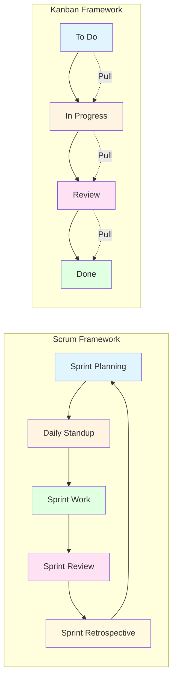
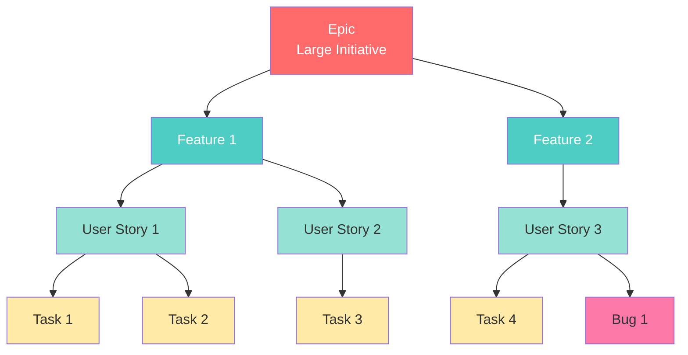

# Module 4: Azure Boards (Work Management)

## 4.1 Introduction to Work Management

### Agile Methodologies Overview

Agile methodologies are iterative and incremental approaches to software development that emphasize collaboration, customer feedback, and rapid response to change. Unlike traditional waterfall methods that follow a linear sequence, Agile breaks work into small, manageable increments called iterations or sprints. Each iteration typically lasts one to four weeks and results in a potentially shippable product increment. The core principles of Agile include valuing individuals and interactions over processes and tools, working software over comprehensive documentation, customer collaboration over contract negotiation, and responding to change over following a plan.

The Agile Manifesto, created in 2001, outlines these values and principles that guide Agile development. Agile methodologies have evolved into various frameworks and practices, with Scrum and Kanban being among the most popular. Agile emphasizes continuous improvement through regular retrospectives, where teams reflect on their processes and make adjustments. This adaptive approach allows teams to respond quickly to changing requirements and market conditions, making Agile particularly well-suited for software development where requirements often evolve.

Azure Boards supports Agile methodologies by providing tools for managing backlogs, planning sprints, tracking progress, and facilitating collaboration. The platform is designed around Agile concepts like user stories, tasks, sprints, and iterations, making it easy for teams to adopt and practice Agile methodologies. Understanding Agile principles is essential for effectively using Azure Boards, as the tool is built to support Agile workflows and practices.

### Scrum and Kanban Frameworks

Scrum is an Agile framework that structures work into time-boxed iterations called sprints, typically lasting two to four weeks. Scrum defines specific roles (Product Owner, Scrum Master, Development Team), events (Sprint Planning, Daily Standup, Sprint Review, Sprint Retrospective), and artifacts (Product Backlog, Sprint Backlog, Increment). The framework emphasizes transparency, inspection, and adaptation, with regular ceremonies that provide opportunities for planning, coordination, and improvement.

In Scrum, work is organized into a Product Backlog that the Product Owner prioritizes. During Sprint Planning, the team selects items from the backlog to work on during the sprint, creating a Sprint Backlog. The team works on these items throughout the sprint, meeting daily for brief standup meetings to coordinate. At the end of the sprint, the team demonstrates completed work in a Sprint Review and reflects on their process in a Sprint Retrospective.

Kanban is a flow-based Agile framework that visualizes work on a board with columns representing different stages of the workflow. Unlike Scrum's time-boxed sprints, Kanban focuses on continuous flow and limiting work in progress (WIP). Teams pull work through the system as capacity becomes available, and the board makes bottlenecks and workflow issues visible. Kanban emphasizes incremental, evolutionary change and doesn't prescribe specific roles or ceremonies.

Azure Boards supports both Scrum and Kanban frameworks. Teams can use Scrum features like sprints, capacity planning, and burndown charts, or they can use Kanban boards for continuous flow. Teams can also combine elements of both frameworks, using Kanban boards within Scrum sprints or adapting the tools to their specific needs. Understanding both frameworks helps teams choose the approach that best fits their context and workflow.

#### Scrum vs. Kanban Comparison

#### Scrum vs. Kanban Comparison Table

| Aspect | Scrum | Kanban |
|--------|-------|--------|
| **Time-boxing** | Fixed sprints (2-4 weeks) | Continuous flow |
| **Roles** | Product Owner, Scrum Master, Team | No prescribed roles |
| **Ceremonies** | Sprint Planning, Daily Standup, Review, Retrospective | No required ceremonies |
| **Work Items** | Sprint Backlog | Continuous from backlog |
| **WIP Limits** | Implicit (sprint capacity) | Explicit (per column) |
| **Change During Sprint** | Discouraged | Allowed anytime |
| **Metrics** | Velocity, Burndown | Cycle time, Lead time |
| **Best For** | Projects with defined goals | Ongoing maintenance, support |
| **Commitment** | Sprint commitment | No commitment required |

### Work Items and Work Item Types

Work items in Azure Boards are the fundamental units of work that teams track and manage. They represent anything that needs to be done, from large features to small bug fixes. Work items contain information like title, description, status, assignee, and various other fields that help teams understand and track the work. Work items can be linked to each other, creating relationships that show how work is organized and connected.

Work item types define the different kinds of work that teams track. Common work item types include Epics (large bodies of work), Features (significant functionality), User Stories (user-facing functionality), Tasks (work needed to complete stories), and Bugs (defects that need to be fixed). Different process templates (Basic, Agile, Scrum) provide different sets of work item types, and organizations can customize these to match their specific needs.

Work items flow through states that represent their progress, such as New, Active, Resolved, and Closed. The states and transitions between them are defined by the work item type and process template. Understanding work items and work item types is fundamental to using Azure Boards effectively, as they're the building blocks for all work management in the platform.

#### Work Item Hierarchy

#### Work Item Types Comparison Table

| Work Item Type | Scope | Duration | Purpose | Example |
|---------------|-------|----------|---------|---------|
| **Epic** | Very Large | Multiple sprints/releases | Large initiatives, strategic goals | "Redesign user authentication system" |
| **Feature** | Large | 1-3 sprints | Significant functionality | "Two-factor authentication" |
| **User Story** | Medium | 1 sprint | User-facing functionality | "As a user, I want to enable 2FA" |
| **Task** | Small | Hours to days | Technical work | "Implement SMS verification" |
| **Bug** | Variable | Variable | Defects to fix | "Login fails with special characters" |

### Backlogs and Boards

Backlogs in Azure Boards are prioritized lists of work items that teams plan to complete. The Product Backlog contains all work items for a product or project, prioritized by value or importance. Teams can organize backlogs by area, iteration, or other criteria, and they can filter and sort items to focus on specific work. Backlogs provide a view of all work that needs to be done and help teams plan and prioritize.

Boards provide a visual representation of work items as they flow through different states. Kanban boards show work items in columns representing workflow states, making it easy to see what's in progress, what's blocked, and where bottlenecks might be. Task boards show work items organized by sprint and assignment, helping teams coordinate work during sprints. Boards are interactive, allowing team members to drag items between states and update work as it progresses.

Backlogs and boards work together to provide different views of the same work. Backlogs are useful for planning and prioritizing, while boards are useful for tracking progress and managing workflow. Teams typically use backlogs during planning and boards during execution, switching between views as needed. Understanding how backlogs and boards relate helps teams use Azure Boards effectively for both planning and execution.

### Sprints and Iterations

Sprints (in Scrum) or iterations (in Agile) are time-boxed periods during which teams commit to completing a set of work items. Sprints typically last one to four weeks and provide a rhythm for planning, execution, and review. During sprint planning, teams select items from the backlog to work on during the sprint, breaking them down into tasks and estimating the effort required. The sprint provides focus and a clear goal for the team.

Sprints create a cadence that helps teams deliver value regularly and provides opportunities for feedback and adjustment. At the end of each sprint, teams review completed work, reflect on their process, and plan the next sprint. This regular cycle of planning, execution, and reflection enables continuous improvement and helps teams maintain momentum.

Azure Boards supports sprints and iterations through iteration paths that define the time periods teams work in. Teams can configure multiple iteration paths for different cadences or planning horizons. Sprint planning features help teams select and organize work for sprints, and sprint tracking features like burndown charts help teams monitor progress. Understanding sprints and iterations is essential for teams practicing Scrum or time-boxed Agile approaches.

---

## 4.2 Work Items

### Creating and Managing Work Items

Creating work items in Azure Boards is straightforward and can be done from backlogs, boards, or queries. When creating a work item, you provide essential information like title, description, and initial state. Work items can be created quickly with minimal information and then updated with more details as work progresses. This allows teams to capture work items rapidly during planning or as they're discovered.

Managing work items involves updating their fields, changing their state, assigning them to team members, and linking them to other work items. Work items can be updated individually or in bulk, and Azure Boards provides various views and tools for managing work items efficiently. Work items can be organized by area path, iteration path, tags, or other criteria, making it easy to filter and find relevant work.

Work items support rich text descriptions, attachments, and discussions, allowing teams to capture and share detailed information. They can be linked to code changes, builds, and other Azure DevOps artifacts, providing traceability from requirements to implementation. Understanding how to create and manage work items effectively is fundamental to using Azure Boards for work management.

### Work Item Types (User Story, Task, Bug, Epic, Feature)

User Stories are work items that describe functionality from an end-user perspective. They typically follow the format "As a [user type], I want [functionality] so that [benefit]." User stories are the primary unit of work in Agile and Scrum, representing small, valuable pieces of functionality that can be completed within a sprint. They're often broken down into tasks that represent the technical work needed to implement the story.

Tasks are work items that represent the specific work needed to complete a user story or other work item. Tasks are typically smaller and more technical than user stories, representing activities like coding, testing, or documentation. Tasks help teams break down larger work items into manageable pieces and track progress at a detailed level.

Bugs are work items that represent defects or issues that need to be fixed. They can be linked to user stories or features to show what functionality is affected, and they follow a similar workflow to other work items. Bugs can be prioritized and planned like other work, and they're often tracked separately to understand quality trends.

Epics are large bodies of work that span multiple sprints or releases. They represent significant initiatives or features that are too large to complete in a single sprint. Epics are typically broken down into features or user stories that can be planned and completed in sprints. Epics help teams organize and track large initiatives over longer time horizons.

Features are significant pieces of functionality that deliver value to users. They're larger than user stories but smaller than epics, typically spanning one or more sprints. Features are often used to group related user stories and provide a mid-level view of work between epics and stories. Understanding these work item types and when to use each helps teams organize work effectively.

### Work Item Fields and Customization

Work items contain various fields that store information about the work, such as title, description, state, assignee, priority, effort, and many others. Different work item types have different sets of fields, and fields can be required, optional, or read-only depending on the work item type and process template. Fields help teams capture and track all the information needed to understand and complete work.

Azure Boards allows extensive customization of work item fields. Organizations can add custom fields to capture information specific to their needs, modify field properties like labels and help text, and control which fields are required or visible. Custom fields can be of various types including text, number, date, picklist, and others, providing flexibility to capture different kinds of information.

Field customization enables organizations to adapt Azure Boards to their specific processes and requirements. Custom fields can track information like customer impact, technical debt, compliance requirements, or any other data that teams need to manage work effectively. Understanding work item fields and customization options helps teams configure Azure Boards to match their workflows and information needs.

### Work Item Links and Hierarchies

Work items can be linked to each other to show relationships and create hierarchies. Common link types include parent-child relationships (where a parent work item contains child work items), related links (where work items are related but not in a hierarchy), and dependency links (where one work item depends on another). Links help teams understand how work items relate to each other and track dependencies.

Hierarchies are created through parent-child links, allowing teams to organize work from large epics down to small tasks. Epic → Feature → User Story → Task is a common hierarchy that helps teams break down large initiatives into manageable pieces. Hierarchies enable rollup of effort, progress, and other metrics from child items to parent items, providing visibility into progress at different levels.

Work item links also support traceability, allowing teams to link work items to code changes, builds, test cases, and other artifacts. This creates a complete picture of how requirements flow through development to deployment. Understanding work item links and hierarchies helps teams organize work effectively and maintain traceability throughout the development process.

### Work Item Queries

Work item queries allow teams to find and list work items based on specific criteria. Queries can filter work items by any field, such as state, assignee, area path, iteration path, tags, or custom fields. Queries can be saved and shared, making it easy for teams to create views of work that are relevant to their needs. Queries are essential for finding specific work items and creating custom views of work.

Azure Boards provides several built-in queries, and teams can create their own using the query editor. Queries support complex criteria with AND/OR logic, allowing teams to find work items that meet multiple conditions. Queries can be used in dashboards, emailed as reports, or exported for analysis. They're a powerful tool for filtering and organizing work items.

Understanding work item queries helps teams find and organize work efficiently. Queries enable teams to create custom views that match their specific needs, such as "all bugs assigned to me" or "all high-priority items in the current sprint." This flexibility makes Azure Boards adaptable to various workflows and information needs.

### Work Item Templates

Work item templates are predefined work items with common fields pre-filled, making it faster to create similar work items. Templates can include default values for fields, standard descriptions, and common links. They're particularly useful for work items that follow consistent patterns, such as bug reports with standard information or user stories with common acceptance criteria.

Templates can be created for any work item type and can be shared across teams or kept private. They help teams maintain consistency in how work items are created and ensure that important information isn't overlooked. Templates can be used when creating work items from backlogs, boards, or queries, making them easily accessible.

Understanding work item templates helps teams create work items more efficiently and consistently. Templates reduce the time needed to create work items and help ensure that all necessary information is captured. They're particularly valuable for teams that create many similar work items or that want to standardize how work is documented.

---

## 4.3 Backlogs and Boards

### Product Backlog Management

The Product Backlog is a prioritized list of all work items that represent work to be done for a product or project. It's the single source of truth for what the team plans to work on, and it's continuously refined and reprioritized as requirements evolve and new work is discovered. The Product Backlog is owned by the Product Owner, who is responsible for prioritizing items based on value, risk, dependencies, and other factors.

Backlog management involves adding new items, refining existing items with more detail, prioritizing items, and removing items that are no longer needed. Backlogs can be organized by area path, iteration path, or other criteria, and they can be filtered to show specific subsets of work. Effective backlog management ensures that the most valuable work is always at the top and ready to be planned into sprints.

Azure Boards provides tools for managing backlogs, including drag-and-drop prioritization, bulk editing, and filtering. Teams can view backlogs at different levels (epic, feature, story) and drill down to see details. Backlog management is an ongoing activity that happens throughout the project, not just during sprint planning. Understanding product backlog management helps teams maintain a healthy, prioritized backlog that guides their work.

### Sprint Planning

Sprint planning is a ceremony where teams select work items from the Product Backlog to work on during the upcoming sprint. The team reviews the backlog, discusses items, estimates effort, and commits to completing a set of work items. Sprint planning typically lasts a few hours and results in a Sprint Backlog containing the work items and tasks the team plans to complete.

During sprint planning, teams break down selected work items into tasks, estimate the effort required, and assign work to team members. The team considers their capacity, dependencies, and risks when selecting work, ensuring that the sprint goal is achievable. Sprint planning is collaborative, involving the entire team in decisions about what work to take on.

Azure Boards supports sprint planning with features like sprint backlogs, capacity planning, and task breakdown. Teams can drag items from the product backlog to the sprint backlog, create tasks, and assign work. Capacity planning helps teams understand how much work they can commit to, and sprint tracking features help monitor progress. Understanding sprint planning helps teams use Azure Boards effectively for planning and committing to sprint work.

### Kanban Boards

Kanban boards provide a visual representation of work items as they flow through workflow states. Work items are displayed as cards in columns representing different states, such as To Do, In Progress, and Done. Teams can see at a glance what work is in each state, identify bottlenecks, and understand workflow issues. Kanban boards support continuous flow, allowing teams to pull work as capacity becomes available rather than working in time-boxed sprints.

Kanban boards are interactive, allowing team members to drag cards between columns to update work item states. Cards show key information like title, assignee, and tags, and they can be customized to show additional details. Kanban boards support WIP (Work In Progress) limits that help teams focus and identify bottlenecks. When a column reaches its WIP limit, teams know they need to complete work before starting new work.

Azure Boards provides powerful Kanban board features including swimlanes, custom columns, card customization, and WIP limits. Teams can configure boards to match their specific workflows and visualize work in ways that make sense for their context. Understanding Kanban boards helps teams use visual management to improve workflow and identify opportunities for improvement.

### Task Board

Task boards show work items organized by sprint and assignment, providing a view that helps teams coordinate work during sprints. Task boards display work items in a grid with rows representing team members or work items and columns representing workflow states. This view makes it easy to see who's working on what and identify coordination opportunities or potential bottlenecks.

Task boards are particularly useful during daily standups, where teams can see the current state of work and coordinate activities. They help teams understand dependencies, identify blocked work, and see how work is distributed across team members. Task boards complement other views like backlogs and Kanban boards, providing a different perspective on the same work.

Azure Boards task boards are interactive and can be customized to show different information. They integrate with sprint planning and tracking, making it easy to see how sprint work is progressing. Understanding task boards helps teams coordinate work effectively during sprints and maintain visibility into who's doing what.

### Board Customization

Azure Boards allows extensive customization of boards to match team workflows and preferences. Boards can be customized with additional columns representing custom workflow states, swimlanes for organizing work by different criteria, and card styles that highlight important information. Customization enables teams to adapt boards to their specific needs and make them more useful for their context.

Column customization allows teams to add workflow states that match their process, such as "In Review" or "Blocked" states that aren't in the default workflow. Swimlanes can organize work by priority, feature area, or other criteria, providing additional structure to boards. Card customization allows teams to show different fields, colors, or styles that help identify important information at a glance.

Board customization should balance flexibility with simplicity. Overly complex boards can be confusing and slow down work, while overly simple boards might not provide enough information. Understanding board customization helps teams create boards that are both useful and maintainable, supporting their specific workflows without unnecessary complexity.

### Swimlanes and Columns

Swimlanes are horizontal divisions on boards that organize work items by different criteria, such as priority, feature area, or work item type. They provide an additional dimension for organizing work beyond the state columns, making it easier to see patterns and organize work visually. Swimlanes help teams focus on specific subsets of work or understand how work is distributed across different categories.

Columns on boards represent workflow states, showing where work items are in their lifecycle. Teams can add custom columns for additional states, reorder columns to match their workflow, and configure column policies that enforce rules or requirements. Columns make the workflow visible and help teams understand how work moves through the process.

Swimlanes and columns work together to provide a two-dimensional view of work that helps teams organize and track work effectively. Understanding how to use swimlanes and columns helps teams create boards that provide the right level of detail and organization for their needs.

### Card Customization

Cards on boards represent work items and can be customized to show different information, colors, or styles. Card customization allows teams to highlight important information, make cards easier to read, and draw attention to specific types of work. Cards can show different fields, use colors to indicate priority or type, and include badges or tags that provide quick information.

Card customization should make boards more useful without making them cluttered. Teams should choose to display information that's most relevant for their workflow and that helps them make decisions quickly. Too much information on cards can make boards hard to read, while too little information might require clicking on cards to see details.

Understanding card customization helps teams create boards that are both informative and easy to use. Well-customized cards provide the right amount of information at a glance, enabling teams to work efficiently with boards and make decisions quickly.

---

## 4.4 Sprints and Iterations

### Sprint Planning

Sprint planning is a collaborative ceremony where teams select work from the Product Backlog to commit to completing during the upcoming sprint. The team reviews prioritized backlog items, discusses requirements and implementation approaches, breaks down work into tasks, estimates effort, and commits to a sprint goal. Sprint planning typically involves the entire team and results in a clear plan for the sprint.

Effective sprint planning requires understanding team capacity, considering dependencies and risks, and ensuring that the selected work aligns with the sprint goal. Teams use capacity planning to understand how much work they can realistically commit to, and they break down work items into tasks that can be tracked and completed. Sprint planning sets the team up for success by ensuring that work is well-understood and achievable.

Azure Boards supports sprint planning with sprint backlogs, capacity planning tools, and task breakdown features. Teams can drag items from the product backlog to the sprint backlog, create and assign tasks, and set capacity to understand how much work they can take on. Understanding sprint planning helps teams use Azure Boards effectively to plan and commit to sprint work.

### Sprint Burndown Charts

Sprint burndown charts show how much work remains in a sprint over time, helping teams track progress toward completing sprint work. The chart plots remaining work (typically in hours or story points) against time, showing whether the team is on track to complete all sprint work by the end of the sprint. Burndown charts make it easy to see if the team is ahead of or behind schedule and identify when adjustments might be needed.

Burndown charts are updated as work items are completed and tasks are finished, providing real-time visibility into sprint progress. Teams can use burndown charts during daily standups to discuss progress and during sprint reviews to understand what was accomplished. The charts help teams identify issues early and make adjustments to ensure sprint goals are met.

Azure Boards automatically generates burndown charts for sprints based on work item states and effort estimates. Teams can view burndown charts on dashboards and in sprint views, making progress visible to everyone. Understanding sprint burndown charts helps teams track progress and make data-driven decisions about sprint work.

### Sprint Retrospectives

Sprint retrospectives are ceremonies where teams reflect on their process and identify improvements for future sprints. Teams discuss what went well, what didn't go well, and what they want to change, creating action items to improve their process. Retrospectives are essential for continuous improvement and help teams adapt their practices over time.

Effective retrospectives create a safe environment where team members can share honest feedback and work together to identify improvements. Teams use various techniques to facilitate retrospectives, such as "Start, Stop, Continue" or "Mad, Sad, Glad" exercises. The goal is to identify concrete, actionable improvements that the team can implement in the next sprint.

While Azure Boards doesn't have specific retrospective features, work items can be used to track retrospective action items, and teams can use boards or backlogs to visualize and manage improvement work. Understanding sprint retrospectives helps teams use Azure Boards to track and implement improvements identified during retrospectives.

### Capacity Planning

Capacity planning helps teams understand how much work they can commit to during a sprint. Teams set capacity for each team member based on available hours, accounting for time off, meetings, and other commitments. Capacity planning ensures that teams don't overcommit and helps them make realistic commitments during sprint planning.

Azure Boards provides capacity planning tools that allow teams to set individual and team capacity, view capacity across the sprint, and see how committed work compares to available capacity. Capacity views help teams identify when they're overcommitted or undercommitted and make adjustments during sprint planning. Capacity planning is essential for realistic sprint commitments and successful sprints.

Understanding capacity planning helps teams use Azure Boards to set appropriate sprint commitments and track capacity throughout the sprint. It enables teams to make data-driven decisions about how much work to take on and helps prevent overcommitment that leads to missed sprint goals.

### Velocity Tracking

Velocity is a measure of how much work a team completes in a sprint, typically measured in story points or completed work items. Tracking velocity over multiple sprints helps teams understand their capacity and make more accurate commitments in future sprints. Velocity provides a data-driven basis for sprint planning and helps teams improve their estimation and planning accuracy.

Velocity can vary from sprint to sprint due to various factors like team changes, complexity of work, or external dependencies. However, over time, teams typically establish a consistent velocity that they can use for planning. Velocity tracking helps teams understand their performance trends and identify factors that affect their ability to complete work.

Azure Boards tracks velocity automatically based on completed work items and can display velocity charts that show velocity trends over time. Teams can use velocity data during sprint planning to make realistic commitments and during retrospectives to understand performance. Understanding velocity tracking helps teams use data to improve their planning and delivery predictability.

### Iteration Paths Configuration

Iteration paths define the time periods (sprints or iterations) that teams work in. Teams can configure multiple iteration paths for different planning horizons, such as current sprint, next sprint, and future sprints. Iteration paths help organize work by time period and enable sprint planning and tracking features.

Configuration of iteration paths involves creating the path structure, setting start and end dates for each iteration, and assigning iterations to teams. Teams can have different iteration cadences or align all teams to the same iteration schedule. Iteration paths can be nested to represent different planning levels, such as releases containing multiple sprints.

Azure Boards uses iteration paths to organize work for sprint planning, track sprint progress, and generate sprint reports. Understanding iteration path configuration helps teams set up Azure Boards to match their sprint cadence and planning structure, enabling effective sprint planning and tracking.

---

## 4.5 Dashboards and Reporting

### Creating Custom Dashboards

Dashboards in Azure DevOps provide customizable views that display information relevant to teams, projects, or organizations. Teams can create multiple dashboards for different purposes, such as sprint dashboards, release dashboards, or team health dashboards. Dashboards are composed of widgets that display charts, queries, build status, and other information.

Creating effective dashboards requires understanding what information is most valuable to display and choosing widgets that provide that information clearly. Dashboards should be focused and not cluttered, showing the most important metrics and information at a glance. Teams can create dashboards for different audiences, such as team dashboards for daily use or executive dashboards for high-level status.

Azure Boards provides many built-in widgets and supports custom widgets through extensions. Teams can arrange widgets on dashboards, resize them, and configure them to show the right information. Understanding how to create custom dashboards helps teams build views that support their specific information needs and workflows.

### Widgets and Charts

Widgets are the building blocks of dashboards, displaying specific information like work item queries, charts, build status, or test results. Azure DevOps provides many built-in widgets for common scenarios, and teams can add widgets from the marketplace or create custom widgets. Widgets can be configured to show specific data, filter information, and update automatically.

Charts are a type of widget that visualize data, such as burndown charts, velocity charts, or pie charts showing work item distribution. Charts help teams understand trends, patterns, and current status at a glance. Effective use of charts makes dashboards more informative and helps teams make data-driven decisions.

Understanding widgets and charts helps teams create dashboards that provide valuable insights. Choosing the right widgets and configuring them appropriately enables teams to build dashboards that support their specific information needs and help them work more effectively.

### Velocity Charts

Velocity charts show how much work teams complete over multiple sprints, helping teams understand their delivery capacity and trends. Velocity is typically measured in story points or completed work items, and velocity charts display this data over time. Teams can use velocity charts to see if their velocity is increasing, decreasing, or stable, and to identify factors that affect delivery.

Velocity charts help teams make more accurate commitments during sprint planning by providing historical data about their capacity. They also help teams identify trends and understand how changes to their process or team composition affect their ability to deliver work. Velocity charts are essential for teams practicing Scrum or time-boxed Agile approaches.

Azure Boards automatically generates velocity charts based on completed work items, and teams can view them on dashboards or in analytics views. Understanding velocity charts helps teams use data to improve their planning accuracy and delivery predictability.

### Burndown and Burnup Charts

Burndown charts show how much work remains over time, typically used for sprints or releases. They help teams see if they're on track to complete all planned work by the target date. Burndown charts plot remaining work against time, with an ideal line showing the expected progress and an actual line showing real progress. Teams can see if they're ahead of or behind schedule and adjust accordingly.

Burnup charts show how much work has been completed over time, providing a different perspective on progress. While burndown charts focus on remaining work, burnup charts focus on completed work, making it easier to see accomplishments and progress. Both chart types provide valuable insights into progress, and teams often use both to get a complete picture.

Azure Boards provides burndown and burnup charts for sprints and can generate them for custom time periods. These charts are automatically updated as work items are completed, providing real-time visibility into progress. Understanding burndown and burnup charts helps teams track progress and make data-driven decisions about their work.

### Cumulative Flow Diagrams (CFD)

Cumulative Flow Diagrams (CFD) show how work items flow through workflow states over time, helping teams identify bottlenecks and understand workflow efficiency. CFDs display the number of work items in each state over time, with different colored areas representing different states. The width of each area shows how many items are in that state, and changes in width over time show how work is flowing.

CFDs help teams identify bottlenecks by showing where work items accumulate. If one state's area is consistently wide, it indicates a bottleneck that's slowing down work flow. CFDs also show cycle time (how long items take to flow through the system) and help teams understand workflow efficiency.

Azure Boards can generate CFDs based on work item state changes over time, and teams can view them in analytics views or on dashboards. Understanding CFDs helps teams identify workflow issues and optimize their processes to improve flow and reduce cycle time.

### Analytics Views

Analytics views in Azure DevOps provide powerful reporting capabilities based on the Analytics service, which stores work item data in a data warehouse optimized for reporting. Analytics views support complex queries, aggregations, and visualizations that aren't possible with standard work item queries. They provide insights into work item trends, patterns, and metrics over time.

Analytics views can display data in tables, charts, or other visualizations, and they can be used in dashboards or exported for further analysis. They support filtering, grouping, and aggregation, making it easy to analyze work item data in various ways. Analytics views are particularly useful for understanding trends and patterns over longer time periods.

Understanding analytics views helps teams create sophisticated reports and gain deeper insights into their work. Analytics views complement standard queries and charts, providing additional analytical capabilities that support data-driven decision making.

### Power BI Integration

Azure DevOps integrates with Power BI, Microsoft's business intelligence platform, allowing teams to create sophisticated reports and visualizations using work item data. Power BI can connect to Azure DevOps Analytics, enabling teams to build custom reports, dashboards, and data models that provide insights beyond what's available in Azure DevOps itself.

Power BI integration enables organizations to combine Azure DevOps data with other data sources, create executive-level reports, and perform advanced analytics. Teams can build custom visualizations, create data models, and share reports across the organization. This integration is particularly valuable for organizations that need comprehensive reporting and analytics capabilities.

Understanding Power BI integration helps organizations leverage Azure DevOps data for advanced reporting and analytics. It enables teams to create custom reports that meet specific business needs and combine DevOps data with other organizational data for comprehensive insights.

---

## 4.6 Advanced Board Features

### Custom Work Item Types

Azure Boards allows organizations to create custom work item types that match their specific processes and terminology. Custom work item types can have their own fields, states, and workflows, enabling organizations to adapt Azure Boards to their unique needs. This customization is particularly valuable for organizations with specialized processes or industry-specific requirements.

Creating custom work item types requires using inherited processes (for cloud) or Hosted XML processes (for on-premises), which provide more customization options than the basic process templates. Custom work item types can extend or replace the standard types, and they can be configured with custom fields, states, and rules. This flexibility enables organizations to use Azure Boards for various types of work beyond software development.

Understanding custom work item types helps organizations adapt Azure Boards to their specific needs. While customization adds complexity, it enables organizations to use Azure Boards for their unique processes and requirements, making it a more valuable tool for their context.

### Custom Fields and Process Customization

Azure Boards allows extensive customization of work item fields, enabling organizations to capture information specific to their needs. Custom fields can be added to work item types, existing fields can be modified, and field properties like labels, help text, and requirements can be configured. This customization enables organizations to track information that's important to their specific context.

Process customization goes beyond fields to include states, transitions, rules, and workflows. Organizations can modify how work items flow through states, add validation rules, and automate field updates based on state changes. This level of customization enables organizations to implement their specific processes within Azure Boards.

Understanding custom fields and process customization helps organizations adapt Azure Boards to their needs. While customization should be balanced with simplicity and maintainability, it enables organizations to use Azure Boards effectively for their specific processes and requirements.

### Inherited vs. Hosted XML Processes

Azure DevOps supports different process models with varying levels of customization. Inherited processes (available in Azure DevOps Services) allow customization through the web interface, providing a good balance between flexibility and ease of use. Organizations can customize fields, states, and workflows without writing XML, making it accessible to more users.

Hosted XML processes (available in Azure DevOps Services) and On-premises XML processes (available in Azure DevOps Server) provide more extensive customization options but require working with XML process definition files. These processes support advanced customization like custom work item types, complex rules, and custom controls, but they're more complex to create and maintain.

The choice between inherited and Hosted XML processes depends on customization needs and technical capabilities. Inherited processes are easier to use and maintain but have some limitations, while XML processes provide more flexibility but require more technical expertise. Understanding these options helps organizations choose the right process model for their needs.

### Work Item Rules and Automation

Work item rules can automatically update fields, change states, or perform other actions based on conditions. For example, rules can automatically assign work items when they enter a specific state, update fields when other fields change, or send notifications when certain conditions are met. Rules help automate routine work item management tasks and ensure consistency.

Azure Boards supports rules through process customization, and organizations can create rules that apply to specific work item types or all work items. Rules can be simple (like setting a default value) or complex (like implementing custom workflows with multiple conditions). Rules help reduce manual work and ensure that work items are managed consistently.

Understanding work item rules and automation helps organizations streamline work item management and ensure consistency. Well-designed rules can significantly reduce manual effort and help teams focus on value-added work rather than administrative tasks.

### Portfolio Management

Portfolio management in Azure Boards involves managing work at multiple levels, from large initiatives (epics) down to detailed tasks. Portfolio backlogs allow organizations to view and manage work at different levels, with rollup of effort, progress, and other metrics from child items to parent items. This hierarchical view helps organizations understand how detailed work contributes to larger goals.

Portfolio management features enable organizations to plan and track work across multiple teams, products, or business units. Epics and features can be organized and prioritized at the portfolio level, while detailed planning happens at the team level. This multi-level approach enables organizations to align detailed work with strategic objectives.

Azure Boards provides portfolio backlogs, rollup capabilities, and multi-level planning features that support portfolio management. Understanding portfolio management helps organizations use Azure Boards to manage work at scale and ensure that detailed work aligns with strategic goals.

### Epic and Feature Rollup

Epic and feature rollup automatically aggregates metrics from child work items to parent epics and features. For example, the effort for an epic is calculated by summing the effort of its child features and stories, and the progress of an epic is determined by the completion status of its children. Rollup provides visibility into progress and effort at higher levels without manual calculation.

Rollup works through the parent-child relationships between work items, automatically updating as child items are completed or updated. This provides real-time visibility into progress at the epic and feature levels, helping organizations understand how detailed work contributes to larger goals. Rollup is essential for portfolio management and strategic planning.

Azure Boards automatically performs rollup for epics and features based on their child work items, and this information is displayed in portfolio backlogs and reports. Understanding epic and feature rollup helps organizations track progress at multiple levels and ensure that detailed work aligns with strategic objectives.

---

## Quick Reference

### Work Item Types
- **Epic**: Large initiatives
- **Feature**: Major functionality
- **User Story**: User requirements
- **Task**: Work items
- **Bug**: Defects

### Board Types
- **Kanban Board**: Continuous flow
- **Task Board**: Sprint-based
- **Backlog**: Prioritized list

---

## Common Pitfalls

### Pitfall 1: Not Using Work Item Hierarchy
**Problem**: Disorganized work, poor visibility
**Solution**: Use Epic → Feature → Story → Task hierarchy
**Prevention**: Plan work item structure

### Pitfall 2: Over-Complicating Process
**Problem**: Difficult to use, low adoption
**Solution**: Start simple, add complexity gradually
**Prevention**: Use standard process templates initially

### Pitfall 3: Not Updating Work Items
**Problem**: Outdated information, poor tracking
**Solution**: Regular updates, automation
**Prevention**: Make updates part of workflow

---

## Best Practices

1. **Use Work Item Hierarchy**: Epic → Feature → Story → Task
2. **Keep Work Items Updated**: Regular status updates
3. **Use Appropriate Types**: Right work item for right purpose
4. **Configure Boards**: Customize for team workflow
5. **Link Related Items**: Create relationships
6. **Use Tags**: Organize and filter work items
7. **Plan Sprints**: Use sprint planning features
8. **Track Metrics**: Use burndown charts and reports
9. **Review Regularly**: Sprint retrospectives
10. **Document Processes**: Clear workflow documentation

---

## Further Reading

### Official Documentation
- [Azure Boards](https://docs.microsoft.com/azure/devops/boards/)
- [Work Items](https://docs.microsoft.com/azure/devops/boards/work-items/)
- [Agile Tools](https://docs.microsoft.com/azure/devops/boards/get-started/what-is-azure-boards)

### Related Topics
- Introduction to Azure DevOps (Module 1)
- Azure Pipelines (Module 3)
- Best Practices and Patterns (Module 10)

---

*This module covers Azure Boards and work management in detail. Understanding work management is essential for Agile and Scrum teams, and Azure Boards provides comprehensive tools for planning, tracking, and managing work throughout the development lifecycle.*

