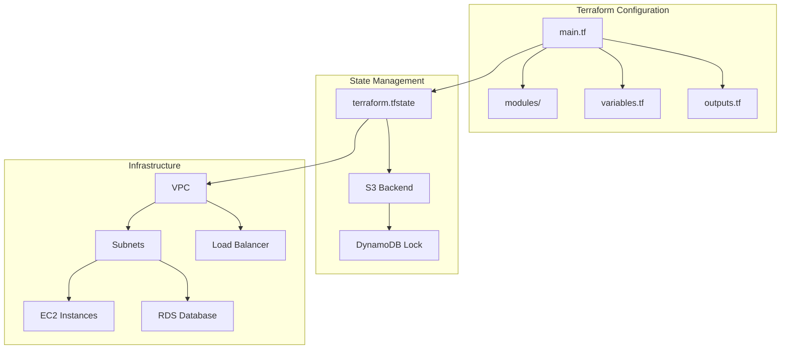
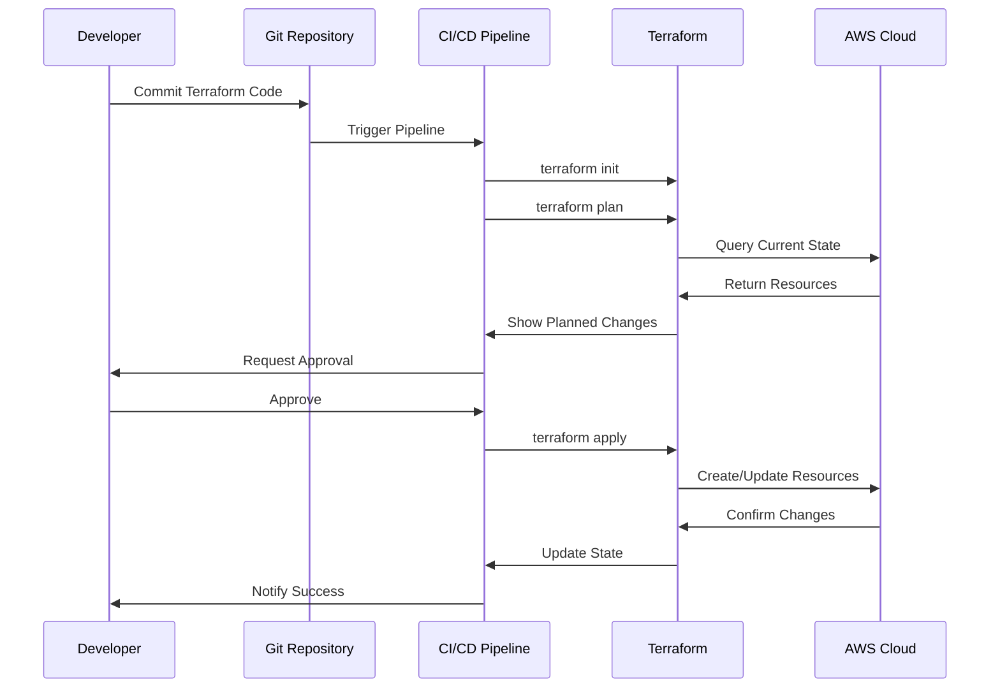
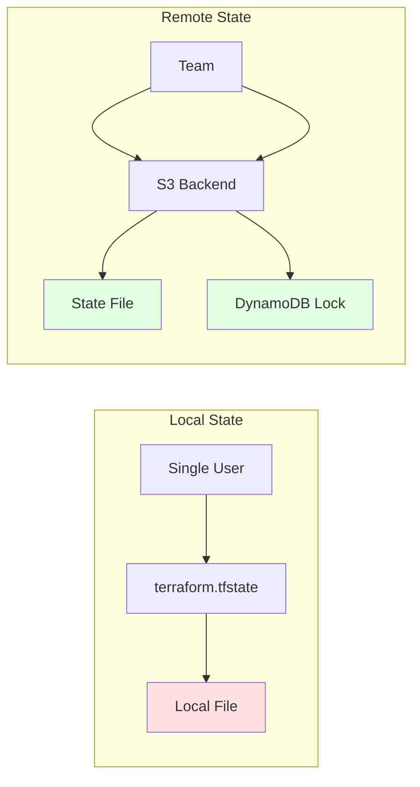
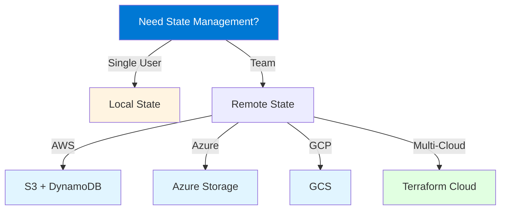

# Terraform Modules - Comprehensive Improvement Guide

This document provides detailed improvement suggestions for all Terraform module files to enhance their educational value, completeness, and practical utility.

## 📋 Table of Contents
1. [Content Depth & Completeness](#content-depth--completeness)
2. [Code Examples & Practical Scenarios](#code-examples--practical-scenarios)
3. [Visual Enhancements](#visual-enhancements)
4. [Structure & Organization](#structure--organization)
5. [Learning Aids](#learning-aids)
6. [Real-World Context](#real-world-context)
7. [Module-Specific Improvements](#module-specific-improvements)

---

## 1. Content Depth & Completeness

### ✅ Current Strengths
- Good foundational explanations
- Clear structure with sections and subsections
- Code examples included

### 🔧 Improvement Suggestions

#### 1.1 Add "Common Pitfalls" Sections
**Add to each module:**
```markdown
### Common Pitfalls and How to Avoid Them

**Pitfall 1: [Specific Issue]**
- **Problem**: Description of the issue
- **Why it happens**: Root cause explanation
- **Solution**: How to fix it
- **Prevention**: Best practices to avoid

**Example:**
```hcl
# ❌ Bad - Missing dependency
resource "aws_instance" "web" {
  subnet_id = aws_subnet.public.id  # Subnet might not exist yet
}

# ✅ Good - Explicit dependency
resource "aws_instance" "web" {
  subnet_id = aws_subnet.public.id
  
  depends_on = [aws_subnet.public]
}
```
```

#### 1.2 Add "When to Use vs. When Not to Use" Sections
For each concept, add guidance on when it's appropriate:
```markdown
### When to Use [Concept]
- Scenario 1: Description
- Scenario 2: Description
- Scenario 3: Description

### When NOT to Use [Concept]
- Anti-pattern 1: Description and why
- Anti-pattern 2: Description and why
```

#### 1.3 Add "Troubleshooting" Subsections
Within each major section, add troubleshooting guidance:
```markdown
### Troubleshooting [Topic]

**Issue**: Common problem description
**Symptoms**: How to identify the issue
**Diagnosis**: How to diagnose
**Solution**: Step-by-step fix
**Prevention**: How to avoid in future
```

#### 1.4 Add "Performance Considerations"
For resource-heavy topics:
```markdown
### Performance Considerations
- **Impact**: How this affects performance
- **Optimization**: Ways to optimize
- **Trade-offs**: Performance vs. other factors
- **Monitoring**: What to monitor
```

---

## 2. Code Examples & Practical Scenarios

### ✅ Current Strengths
- Basic examples provided
- Code snippets are clear

### 🔧 Improvement Suggestions

#### 2.1 Add Complete Working Examples
**Replace simple snippets with complete, runnable examples:**

```markdown
### Complete Example: Web Application Infrastructure

This example demonstrates a complete, production-ready setup:

```hcl
# variables.tf
variable "environment" {
  description = "Environment name (dev, staging, prod)"
  type        = string
  validation {
    condition     = contains(["dev", "staging", "prod"], var.environment)
    error_message = "Environment must be dev, staging, or prod."
  }
}

variable "instance_count" {
  description = "Number of instances"
  type        = number
  default     = 2
}

# main.tf
terraform {
  required_version = ">= 1.0"
  
  required_providers {
    aws = {
      source  = "hashicorp/aws"
      version = "~> 5.0"
    }
  }
  
  backend "s3" {
    bucket         = "my-terraform-state"
    key            = "web-app/${var.environment}/terraform.tfstate"
    region         = "us-west-2"
    encrypt        = true
    dynamodb_table = "terraform-locks"
  }
}

provider "aws" {
  region = var.aws_region
  
  default_tags {
    tags = {
      Environment   = var.environment
      ManagedBy     = "Terraform"
      Project       = "WebApplication"
      LastModified  = timestamp()
    }
  }
}

# VPC Module
module "vpc" {
  source = "./modules/vpc"
  
  environment = var.environment
  cidr_block  = "10.0.0.0/16"
  
  availability_zones = ["us-west-2a", "us-west-2b"]
  
  enable_nat_gateway = var.environment != "dev"
  single_nat_gateway = var.environment == "dev"
}

# Security Groups
resource "aws_security_group" "web" {
  name_prefix = "${var.environment}-web-"
  vpc_id      = module.vpc.vpc_id
  description = "Security group for web servers"
  
  ingress {
    description = "HTTP"
    from_port   = 80
    to_port     = 80
    protocol    = "tcp"
    cidr_blocks = ["0.0.0.0/0"]
  }
  
  ingress {
    description     = "HTTPS"
    from_port       = 443
    to_port         = 443
    protocol        = "tcp"
    cidr_blocks     = ["0.0.0.0/0"]
    security_groups = [aws_security_group.alb.id]
  }
  
  egress {
    description = "All outbound"
    from_port   = 0
    to_port     = 0
    protocol    = "-1"
    cidr_blocks = ["0.0.0.0/0"]
  }
  
  lifecycle {
    create_before_destroy = true
  }
  
  tags = {
    Name = "${var.environment}-web-sg"
  }
}

# Application Load Balancer
resource "aws_lb" "web" {
  name               = "${var.environment}-web-alb"
  internal           = false
  load_balancer_type = "application"
  security_groups    = [aws_security_group.alb.id]
  subnets            = module.vpc.public_subnet_ids
  
  enable_deletion_protection = var.environment == "prod"
  enable_http2              = true
  enable_cross_zone_load_balancing = true
  
  access_logs {
    bucket  = aws_s3_bucket.alb_logs.id
    enabled = true
    prefix  = "alb"
  }
  
  tags = {
    Name = "${var.environment}-web-alb"
  }
}

# EC2 Instances
resource "aws_instance" "web" {
  count = var.instance_count
  
  ami           = data.aws_ami.ubuntu.id
  instance_type = var.environment == "prod" ? "t3.medium" : "t3.micro"
  
  vpc_security_group_ids = [aws_security_group.web.id]
  subnet_id              = module.vpc.private_subnet_ids[count.index % length(module.vpc.private_subnet_ids)]
  
  user_data = base64encode(templatefile("${path.module}/userdata.sh", {
    environment = var.environment
  }))
  
  root_block_device {
    volume_type = "gp3"
    volume_size = var.environment == "prod" ? 50 : 20
    encrypted   = true
  }
  
  tags = {
    Name = "${var.environment}-web-${count.index + 1}"
  }
}

# outputs.tf
output "alb_dns_name" {
  description = "DNS name of the load balancer"
  value       = aws_lb.web.dns_name
}

output "instance_ips" {
  description = "Private IP addresses of web instances"
  value       = aws_instance.web[*].private_ip
  sensitive   = false
}
```

**Deployment Steps:**
1. Initialize: `terraform init`
2. Plan: `terraform plan -var-file="environments/prod.tfvars"`
3. Apply: `terraform apply -var-file="environments/prod.tfvars"`
```

#### 2.2 Add "Before and After" Examples
Show evolution from simple to complex:
```markdown
### Evolution: Simple to Production-Ready

**Stage 1: Basic (Learning)**
```hcl
resource "aws_instance" "web" {
  ami           = "ami-12345"
  instance_type = "t2.micro"
}
```

**Stage 2: Improved (Development)**
```hcl
resource "aws_instance" "web" {
  ami           = var.ami_id
  instance_type = var.instance_type
  
  tags = {
    Name = "web-server"
  }
}
```

**Stage 3: Production-Ready**
```hcl
# Full production example with all best practices
[Complete example]
```
```

#### 2.3 Add Error Examples and Solutions
```markdown
### Common Errors and Solutions

**Error 1: State Lock Error**
```
Error: Error acquiring the state lock

Reason: The state is locked by another process
```

**Solution:**
```bash
# Check who has the lock
terraform force-unlock <LOCK_ID>

# Or wait for the lock to be released
# Or use remote state with proper locking
```

**Error 2: Provider Authentication Error**
```
Error: No valid credential sources found
```

**Solution:**
```bash
# AWS
aws configure
export AWS_PROFILE=production

# Or use IAM roles
# Or use environment variables
export AWS_ACCESS_KEY_ID=...
export AWS_SECRET_ACCESS_KEY=...
```
```

---

## 3. Visual Enhancements

### ✅ Current Strengths
- Mermaid diagrams included
- Good use of flowcharts

### 🔧 Improvement Suggestions

#### 3.1 Add More Diagram Types

**Add Architecture Diagrams:**


**Add Sequence Diagrams for Complex Flows:**


**Add Comparison Diagrams:**


#### 3.2 Add Visual Code Comparisons
Use side-by-side comparisons:
```markdown
| ❌ Anti-Pattern | ✅ Best Practice |
|----------------|-----------------|
| ```hcl<br>resource "aws_instance" "web" {<br>  ami = "ami-12345"<br>}<br>``` | ```hcl<br>resource "aws_instance" "web" {<br>  ami = data.aws_ami.ubuntu.id<br>  instance_type = var.instance_type<br>  tags = local.common_tags<br>}<br>``` |
| Hard-coded values | Uses variables and data sources |
| No tags | Consistent tagging |
```

#### 3.3 Add Decision Trees


---

## 4. Structure & Organization

### 🔧 Improvement Suggestions

#### 4.1 Add Table of Contents
At the start of each module:
```markdown
## Table of Contents
- [1.1 Topic Name](#11-topic-name)
  - [Subsection](#subsection)
- [1.2 Topic Name](#12-topic-name)
- [Quick Reference](#quick-reference)
- [Practice Exercises](#practice-exercises)
- [Further Reading](#further-reading)
```

#### 4.2 Add "Quick Reference" Sections
At the end of each module:
```markdown
## Quick Reference

### Key Commands
```bash
# Command 1
terraform init

# Command 2
terraform plan

# Command 3
terraform apply
```

### Key Concepts
- **Concept 1**: Brief definition
- **Concept 2**: Brief definition
- **Concept 3**: Brief definition

### Common Patterns
- Pattern 1: When to use
- Pattern 2: When to use
```

#### 4.3 Add "Check Your Understanding" Sections
```markdown
## Check Your Understanding

### Questions
1. What is the purpose of [concept]?
2. When would you use [feature] vs [alternative]?
3. How does [concept] relate to [other concept]?

### Exercises
1. **Exercise 1**: Create a [resource] with [requirements]
2. **Exercise 2**: Modify [example] to [goal]
3. **Exercise 3**: Troubleshoot [scenario]
```

#### 4.4 Add "Prerequisites" Section
At the start of each module:
```markdown
## Prerequisites

Before starting this module, you should:
- ✅ Understand [previous concept]
- ✅ Have completed [previous module]
- ✅ Be familiar with [related topic]
- ✅ Have [tool] installed

**Estimated Time**: 2-3 hours
**Difficulty Level**: Beginner/Intermediate/Advanced
```

---

## 5. Learning Aids

### 🔧 Improvement Suggestions

#### 5.1 Add "Learning Path" Indicators
```markdown
> **📚 Learning Path**: This module is part of the [Topic] learning path.
> 
> **Previous**: [Module X] → **Current**: [This Module] → **Next**: [Module Y]
> 
> **Related Modules**: [Module A], [Module B]
```

#### 5.2 Add "Real-World Scenarios"
```markdown
## Real-World Scenario: E-Commerce Platform

**Context**: You need to provision infrastructure for an e-commerce platform that:
- Handles 1M+ daily users
- Requires high availability (99.9% uptime)
- Needs to scale automatically
- Must comply with PCI-DSS

**Requirements**:
- Multi-AZ deployment
- Auto-scaling groups
- Load balancers
- Database with read replicas
- CDN for static assets

**Solution Approach**:
[Step-by-step solution using concepts from this module]
```

#### 5.3 Add "Tips & Tricks" Sections
```markdown
## 💡 Tips & Tricks

### Tip 1: [Title]
**What**: Brief description
**Why**: Benefit explanation
**How**: Implementation
**Example**: Code snippet

### Tip 2: [Title]
[Similar structure]
```

#### 5.4 Add "Common Questions" (FAQ)
```markdown
## Frequently Asked Questions

**Q: When should I use modules vs. direct resources?**
A: Use modules when you have reusable patterns or want to abstract complexity. Use direct resources for one-off configurations.

**Q: How do I handle secrets in Terraform?**
A: Never hard-code secrets. Use:
- Environment variables
- Secret management tools (Vault, AWS Secrets Manager)
- Terraform Cloud variables (marked as sensitive)
- External data sources

**Q: Can I use Terraform with existing infrastructure?**
A: Yes, use `terraform import` to bring existing resources under Terraform management.
```

---

## 6. Real-World Context

### 🔧 Improvement Suggestions

#### 6.1 Add "Industry Use Cases"
```markdown
## Industry Use Cases

### Use Case 1: Startup MVP
**Scenario**: Rapid infrastructure setup for MVP
**Terraform Solution**: Simple, single-environment setup
**Key Benefits**: Fast iteration, cost-effective

### Use Case 2: Enterprise Multi-Cloud
**Scenario**: Large organization with multiple cloud providers
**Terraform Solution**: Multi-provider configuration with modules
**Key Benefits**: Consistency, vendor independence

### Use Case 3: Compliance-Heavy Industry
**Scenario**: Financial services with strict compliance
**Terraform Solution**: Policy-as-code, audit trails
**Key Benefits**: Compliance automation, auditability
```

#### 6.2 Add "Cost Considerations"
```markdown
## Cost Considerations

### Cost Impact
- **Factor 1**: How this affects costs
- **Factor 2**: Cost optimization strategies
- **Factor 3**: Hidden costs to watch

### Cost Optimization Tips
1. Tip 1 with example
2. Tip 2 with example
3. Tip 3 with example

### Cost Estimation
```bash
# Use Terraform Cloud cost estimation
# Or use infracost
infracost breakdown --path .
```
```

#### 6.3 Add "Security Considerations"
```markdown
## Security Considerations

### Security Best Practices
- Practice 1: Description and implementation
- Practice 2: Description and implementation
- Practice 3: Description and implementation

### Common Security Mistakes
- Mistake 1: What it is and how to avoid
- Mistake 2: What it is and how to avoid

### Security Scanning
```bash
# Use tfsec
tfsec .

# Use checkov
checkov -d .
```
```

---

## 7. Module-Specific Improvements

### Module 1: Introduction
- ✅ Add "Getting Started Checklist"
- ✅ Add "Installation Troubleshooting"
- ✅ Add "First Terraform Project Walkthrough"

### Module 2: HCL
- ✅ Add "HCL Style Guide"
- ✅ Add "Common Syntax Errors"
- ✅ Add "HCL vs. JSON Comparison"

### Module 3: Providers
- ✅ Add "Provider Version Management"
- ✅ Add "Provider Authentication Troubleshooting"
- ✅ Add "Multi-Provider Patterns"

### Module 4: Resources
- ✅ Add "Resource Lifecycle Deep Dive"
- ✅ Add "Resource Import Workflow"
- ✅ Add "Resource Replacement Strategies"

### Module 5: State Management
- ✅ Add "State Migration Guide"
- ✅ Add "State Corruption Recovery"
- ✅ Add "State File Size Optimization"

### Module 6: Modules
- ✅ Add "Module Design Patterns"
- ✅ Add "Module Testing Strategies"
- ✅ Add "Module Versioning Best Practices"

### Module 7: Workspaces
- ✅ Add "Workspace vs. Directory Decision Guide"
- ✅ Add "Workspace Migration Strategies"

### Module 8: Data Sources
- ✅ Add "Data Source Performance Optimization"
- ✅ Add "Data Source Caching Strategies"

### Module 9: Functions
- ✅ Add "Function Performance Tips"
- ✅ Add "Complex Expression Examples"

### Module 10: Advanced Features
- ✅ Add "When to Use Provisioners (Rare Cases)"
- ✅ Add "Dynamic Block Performance"

### Module 11: Cloud & Enterprise
- ✅ Add "Terraform Cloud Migration Guide"
- ✅ Add "Enterprise Feature Comparison"

### Module 12: Best Practices
- ✅ Add "Code Review Checklist"
- ✅ Add "Terraform Linting Rules"

### Module 13: CI/CD
- ✅ Add "Pipeline Failure Recovery"
- ✅ Add "Approval Workflow Patterns"

### Module 14: Troubleshooting
- ✅ Add "Debugging Workflow"
- ✅ Add "Common Error Solutions Database"

### Module 15: Kubernetes
- ✅ Add "Terraform vs. Helm Decision Guide"
- ✅ Add "Kubernetes Resource Import"

### Module 16: Advanced Patterns
- ✅ Add "Pattern Selection Guide"
- ✅ Add "Pattern Anti-Patterns"

---

## 8. Additional Enhancements

### 8.1 Add "Practice Labs"
```markdown
## Practice Labs

### Lab 1: Basic Infrastructure
**Objective**: Create a simple VPC with EC2 instance
**Time**: 30 minutes
**Difficulty**: Beginner

**Steps**:
1. Create VPC configuration
2. Create subnet
3. Create security group
4. Create EC2 instance
5. Verify deployment

**Solution**: [Link to solution]

### Lab 2: Multi-Environment Setup
[Similar structure]
```

### 8.2 Add "Further Reading"
```markdown
## Further Reading

### Official Documentation
- [Terraform Documentation](https://www.terraform.io/docs)
- [Provider Documentation](https://registry.terraform.io/)

### Community Resources
- [Terraform Best Practices](https://www.terraform.io/docs/cloud/guides/recommended-practices/)
- [Awesome Terraform](https://github.com/shuaibiyy/awesome-terraform)

### Related Topics
- Infrastructure as Code Principles
- DevOps Practices
- Cloud Architecture Patterns
```

### 8.3 Add "Version Information"
```markdown
> **Module Version**: 1.0
> **Last Updated**: 2024-01-15
> **Terraform Version**: Tested with 1.6.0+
> **Provider Versions**: AWS ~> 5.0, Azure ~> 3.0, GCP ~> 5.0
```

### 8.4 Add "Contributing" Section
```markdown
## Contributing

Found an error or have a suggestion? 
- Report issues: [Link]
- Suggest improvements: [Link]
- Submit corrections: [Link]
```

---

## 9. Implementation Priority

### High Priority (Do First)
1. ✅ Add complete working examples
2. ✅ Add common pitfalls sections
3. ✅ Add troubleshooting subsections
4. ✅ Add quick reference sections
5. ✅ Add error examples and solutions

### Medium Priority (Do Next)
1. ✅ Add more visual diagrams
2. ✅ Add practice exercises
3. ✅ Add real-world scenarios
4. ✅ Add cost considerations
5. ✅ Add security considerations

### Low Priority (Nice to Have)
1. ✅ Add FAQ sections
2. ✅ Add learning path indicators
3. ✅ Add version information
4. ✅ Add contributing sections
5. ✅ Add further reading

---

## 10. Quality Checklist

Before considering a module "complete", ensure:

- [ ] All concepts have detailed explanations
- [ ] Code examples are complete and runnable
- [ ] Common pitfalls are documented
- [ ] Troubleshooting guidance is included
- [ ] Visual diagrams enhance understanding
- [ ] Real-world scenarios are provided
- [ ] Best practices are highlighted
- [ ] Security considerations are addressed
- [ ] Performance tips are included
- [ ] Practice exercises are available
- [ ] Quick reference is provided
- [ ] Further reading is suggested

---

**Last Updated**: 2024-01-15
**Maintained By**: [Your Name/Team]

