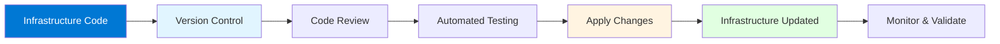
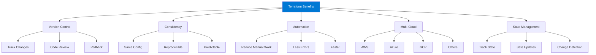
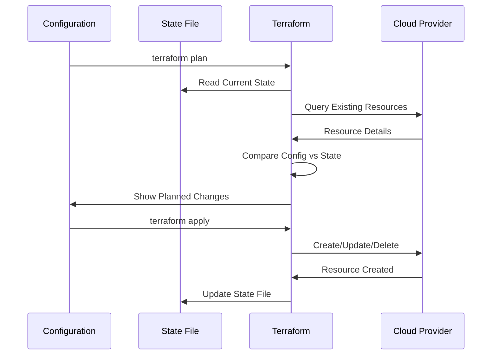
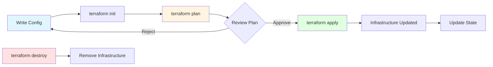

# Module 1: Introduction to Terraform

## 1.1 What is Terraform?

### Infrastructure as Code (IaC) Concepts

Infrastructure as Code (IaC) is the practice of managing and provisioning infrastructure through machine-readable definition files rather than through manual processes or interactive configuration tools. IaC treats infrastructure configuration as code, enabling it to be versioned, reviewed, tested, and automated just like application code. This approach provides numerous benefits including consistency, repeatability, version control, and automation.

The fundamental principle of IaC is that infrastructure should be defined declaratively - you describe the desired state of your infrastructure, and tools ensure that the actual state matches the desired state. This contrasts with imperative approaches where you specify the exact steps to achieve a state. Declarative IaC tools like Terraform automatically determine what changes are needed to reach the desired state, making infrastructure management more predictable and less error-prone.

IaC has become essential in modern DevOps practices because it enables teams to manage complex infrastructure at scale. With IaC, infrastructure changes go through the same code review processes as application code, reducing the risk of configuration drift and human error. Infrastructure can be provisioned consistently across different environments (development, staging, production), and changes can be tested before being applied to production. Understanding IaC concepts is fundamental to working with Terraform effectively.

#### Infrastructure as Code Workflow



### Terraform Overview and History

Terraform is an open-source Infrastructure as Code tool created by HashiCorp. It was first released in 2014 and has since become one of the most popular IaC tools in the industry. Terraform enables you to define and provision infrastructure across multiple cloud providers and on-premises systems using a single, consistent workflow.

Terraform's key innovation is its provider-based architecture, which allows it to work with virtually any infrastructure platform through provider plugins. This multi-cloud capability sets Terraform apart from cloud-specific tools, enabling organizations to manage infrastructure across AWS, Azure, Google Cloud, and hundreds of other services using the same tool and language. Terraform uses HashiCorp Configuration Language (HCL), which is designed to be human-readable and machine-friendly.

Since its release, Terraform has evolved significantly, adding features like workspaces, modules, remote state backends, and Terraform Cloud for team collaboration. The tool has a large and active community, with thousands of providers available in the Terraform Registry. Understanding Terraform's history and evolution helps you appreciate its design decisions and current capabilities.

### Terraform vs. Other IaC Tools

Terraform competes with several Infrastructure as Code tools, each with different strengths and use cases. **AWS CloudFormation** is tightly integrated with AWS but only works with AWS services. **Azure Resource Manager (ARM) templates** work with Azure but lack multi-cloud support. **Google Cloud Deployment Manager** is GCP-specific. **Ansible** is primarily a configuration management tool but can also provision infrastructure. **Pulumi** uses general-purpose programming languages instead of a domain-specific language.

Terraform's primary advantages include: **multi-cloud support** (works with any provider), **declarative syntax** (HCL is easy to read and write), **large ecosystem** (thousands of providers and modules), **state management** (tracks infrastructure state), **planning capability** (shows changes before applying), and **strong community** (extensive documentation and support). However, Terraform has a learning curve, and state management can be complex for large infrastructures.

#### Comparison Table: Infrastructure as Code Tools

| Feature | Terraform | CloudFormation | ARM Templates | Ansible | Pulumi |
|---------|-----------|----------------|--------------|---------|--------|
| **Multi-Cloud** | Yes | No (AWS only) | No (Azure only) | Yes | Yes |
| **Language** | HCL | JSON/YAML | JSON | YAML/Python | Python/TypeScript/etc. |
| **State Management** | Built-in | AWS managed | Azure managed | Agent-based | Built-in |
| **Learning Curve** | Medium | Low | Medium | Medium | High |
| **Provider Ecosystem** | Very Large | AWS only | Azure only | Large | Growing |
| **Best For** | Multi-cloud, complex | AWS-only | Azure-only | Configuration + IaC | Developers |

### Key Benefits and Use Cases

Terraform provides numerous benefits that make it valuable for infrastructure management. **Version control** enables infrastructure changes to be tracked, reviewed, and rolled back like code. **Consistency** ensures the same infrastructure can be provisioned identically across environments. **Automation** reduces manual work and human error. **Multi-cloud support** allows managing infrastructure across different cloud providers with one tool. **State management** tracks infrastructure state and enables safe updates.

**Planning** shows what changes will be made before applying them, reducing risk. **Modularity** enables reusable infrastructure components. **Collaboration** supports team workflows through remote state and Terraform Cloud. **Documentation** is built into code, making infrastructure self-documenting. Understanding these benefits helps you appreciate Terraform's value.

Terraform use cases include: **cloud infrastructure provisioning** (VMs, networks, storage), **multi-cloud deployments** (infrastructure across providers), **infrastructure automation** (automated provisioning and updates), **environment management** (dev, test, prod environments), **disaster recovery** (reproducible infrastructure), and **compliance** (infrastructure as auditable code). Understanding use cases helps you identify when Terraform is the right tool.

#### Terraform Benefits Overview



### Terraform Ecosystem

The Terraform ecosystem consists of tools, services, and resources that extend and complement Terraform. The ecosystem includes: **Terraform Registry** (public and private module registries), **Terraform Cloud** (HashiCorp's managed service), **Terraform Enterprise** (self-hosted enterprise solution), **Providers** (thousands of provider plugins), **Modules** (reusable infrastructure components), and **Community tools** (terraform-docs, tfsec, checkov).

The ecosystem also includes: **HashiCorp Learn** (tutorials and documentation), **Terraform GitHub** (source code and issues), **Community modules** (pre-built infrastructure patterns), and **Third-party tools** (testing frameworks, security scanners). Understanding the Terraform ecosystem helps you leverage the full power of Terraform and find solutions to common problems.

---

## 1.2 Terraform Core Concepts

### Declarative vs. Imperative Configuration

Terraform uses a declarative approach to infrastructure management. In declarative configuration, you describe the desired end state of your infrastructure, and Terraform determines the steps needed to achieve that state. This contrasts with imperative approaches where you specify the exact commands or steps to execute.

Declarative benefits include: **idempotency** (running the same configuration multiple times produces the same result), **simplicity** (you describe what you want, not how to get it), **safety** (Terraform shows changes before applying), and **consistency** (same configuration always produces the same infrastructure). Understanding declarative configuration is fundamental to using Terraform effectively.

Example of declarative approach:
```hcl
resource "aws_instance" "web" {
  ami           = "ami-0c55b159cbfafe1f0"
  instance_type = "t2.micro"
}
```

This declares "I want an EC2 instance with these properties" rather than "run these commands to create an instance."

### State Management

Terraform state is a file that tracks the mapping between your configuration and the real-world infrastructure. State enables Terraform to: **track resource relationships** (dependencies between resources), **determine changes** (what needs to be created, updated, or destroyed), **manage resource metadata** (attributes that aren't available from the provider), and **prevent conflicts** (state locking prevents concurrent modifications).

State is critical because Terraform needs to know what infrastructure already exists to determine what changes are needed. Without state, Terraform would try to create resources that already exist. State can be stored locally (default) or remotely (recommended for teams). Understanding state management is essential for effective Terraform usage.

#### State Management Flow



### Providers and Resources

Providers are plugins that Terraform uses to interact with APIs of cloud providers, SaaS providers, and other services. Providers translate Terraform configuration into API calls. Each provider offers resources (things you can create and manage) and data sources (information you can query).

Resources are the most important element in Terraform - they represent infrastructure objects like virtual machines, networks, databases, etc. Each resource has a type (like `aws_instance`) and a name (like `web`). Resources have arguments (configuration) and attributes (output values). Understanding providers and resources is fundamental to writing Terraform configurations.

Example:
```hcl
provider "aws" {
  region = "us-west-2"
}

resource "aws_instance" "web" {
  ami           = "ami-0c55b159cbfafe1f0"
  instance_type = "t2.micro"
}
```

### Modules and Reusability

Modules are containers for multiple resources that are used together. Modules enable you to package and reuse infrastructure components. A module can be a single directory with Terraform files, or it can be sourced from the Terraform Registry, Git, or other locations.

Modules provide: **reusability** (use the same infrastructure pattern multiple times), **organization** (group related resources), **abstraction** (hide complexity behind simple interfaces), **versioning** (pin to specific module versions), and **sharing** (publish modules for others to use). Understanding modules helps you create maintainable, reusable infrastructure code.

### Terraform Workflow

The Terraform workflow consists of several steps: **Write** (create or modify Terraform configuration files), **Initialize** (`terraform init` - download providers and modules), **Plan** (`terraform plan` - preview changes), **Apply** (`terraform apply` - create or update infrastructure), and **Destroy** (`terraform destroy` - remove infrastructure when no longer needed).

The workflow is designed to be safe and predictable. The plan step shows exactly what will change before any changes are made, allowing you to review and approve changes. Understanding the workflow helps you use Terraform effectively and safely.

#### Terraform Workflow Diagram



---

## 1.3 Getting Started with Terraform

### Installing Terraform

Terraform can be installed on various operating systems. Installation methods include: **package managers** (Homebrew on macOS, Chocolatey on Windows, apt/yum on Linux), **direct download** (binary from HashiCorp website), **Terraform version managers** (tfenv, tfswitch), and **container images** (Docker images with Terraform).

Installation examples:
```bash
# macOS (Homebrew)
brew install terraform

# Linux (direct download)
wget https://releases.hashicorp.com/terraform/1.6.0/terraform_1.6.0_linux_amd64.zip
unzip terraform_1.6.0_linux_amd64.zip
sudo mv terraform /usr/local/bin/

# Windows (Chocolatey)
choco install terraform

# Verify installation
terraform version
```

Understanding installation helps you get Terraform running on your system.

### Setting up Your First Configuration

Your first Terraform configuration typically includes: **provider configuration** (which cloud provider to use), **resource definitions** (what infrastructure to create), and **output values** (what information to display). A minimal example creates a simple resource like an S3 bucket or a virtual machine.

Example first configuration:
```hcl
# main.tf
terraform {
  required_providers {
    aws = {
      source  = "hashicorp/aws"
      version = "~> 5.0"
    }
  }
}

provider "aws" {
  region = "us-west-2"
}

resource "aws_s3_bucket" "my_bucket" {
  bucket = "my-unique-bucket-name-12345"
}

output "bucket_name" {
  value = aws_s3_bucket.my_bucket.id
}
```

Understanding basic configuration helps you get started with Terraform.

### Basic Terraform Commands

Essential Terraform commands include: **terraform init** (initialize working directory), **terraform plan** (create execution plan), **terraform apply** (apply changes), **terraform destroy** (destroy infrastructure), **terraform validate** (validate configuration), **terraform fmt** (format configuration files), and **terraform show** (show current state).

Command examples:
```bash
# Initialize
terraform init

# Validate configuration
terraform validate

# Format files
terraform fmt

# Plan changes
terraform plan

# Apply changes
terraform apply

# Show state
terraform show

# Destroy infrastructure
terraform destroy
```

Understanding basic commands is essential for using Terraform.

### Understanding Terraform Files

Terraform configuration files use the `.tf` extension. Common file patterns include: **main.tf** (primary configuration), **variables.tf** (variable declarations), **outputs.tf** (output definitions), **terraform.tfvars** (variable values), **versions.tf** (provider version constraints), and **backend.tf** (state backend configuration).

File organization example:
```
project/
├── main.tf          # Main configuration
├── variables.tf     # Variable declarations
├── outputs.tf       # Output definitions
├── terraform.tfvars # Variable values
└── versions.tf      # Provider versions
```

Understanding file organization helps you structure Terraform projects effectively.

### Terraform CLI Overview

The Terraform CLI provides commands for managing infrastructure. CLI features include: **command completion** (tab completion for commands and resources), **workspace management** (multiple state environments), **state management** (inspect and modify state), **debugging** (verbose logging), and **plugin management** (provider and module management).

CLI help:
```bash
# General help
terraform help

# Command-specific help
terraform plan -help

# List all commands
terraform -help
```

Understanding the CLI helps you use Terraform effectively.

---

## Quick Reference

### Terraform Commands
```bash
# Initialize
terraform init

# Plan
terraform plan

# Apply
terraform apply

# Destroy
terraform destroy

# Format
terraform fmt

# Validate
terraform validate
```

### Key Concepts
- **IaC**: Infrastructure as Code
- **HCL**: HashiCorp Configuration Language
- **State**: Tracks infrastructure
- **Providers**: Cloud platform plugins
- **Resources**: Infrastructure objects

---

## Common Pitfalls

### Pitfall 1: Not Understanding State
**Problem**: State corruption, lost infrastructure tracking
**Solution**: Understand state management, use remote state
**Prevention**: Learn state concepts early

### Pitfall 2: Skipping Plan Review
**Problem**: Unexpected changes applied
**Solution**: Always review terraform plan output
**Prevention**: Make plan review mandatory

### Pitfall 3: Not Version Controlling Code
**Problem**: Lost configurations, no history
**Solution**: Store all Terraform code in Git
**Prevention**: Version control from start

---

## Best Practices

1. **Version Control**: Store all code in Git
2. **Review Plans**: Always review before applying
3. **Use Remote State**: For teams and production
4. **Modularize**: Use modules for reusability
5. **Document**: Explain complex configurations
6. **Test Changes**: In development first
7. **Backup State**: Regular state backups
8. **Use Workspaces**: For environment management
9. **Validate**: Use terraform validate
10. **Format Code**: Use terraform fmt

---

## Further Reading

### Official Documentation
- [Terraform Documentation](https://www.terraform.io/docs)
- [Getting Started Guide](https://learn.hashicorp.com/terraform)
- [Terraform Registry](https://registry.terraform.io/)

### Related Topics
- HCL Configuration Language (Module 2)
- Providers (Module 3)
- Resources (Module 4)

---

*This module provides a comprehensive introduction to Terraform, covering its purpose, core concepts, and getting started. Understanding these fundamentals is essential for effectively using Terraform for infrastructure automation.*

