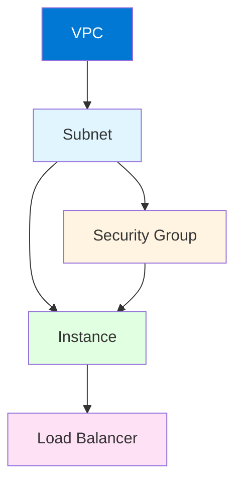

# Module 4: Terraform Resources

## 4.1 Resource Basics

### Resource Syntax

Resources are the most important element in Terraform - they represent infrastructure objects. Resource syntax includes: **resource type** (like `aws_instance`), **resource name** (local identifier), **configuration block** (arguments and attributes).

Resource syntax:
```hcl
resource "resource_type" "resource_name" {
  argument1 = "value1"
  argument2 = "value2"
  
  nested_block {
    nested_argument = "value"
  }
}
```

Example:
```hcl
resource "aws_instance" "web" {
  ami           = "ami-0c55b159cbfafe1f0"
  instance_type = "t2.micro"
  
  tags = {
    Name = "Web Server"
  }
}
```

### Resource Arguments and Attributes

**Arguments** are input values you provide to configure the resource. **Attributes** are output values from the resource that you can reference. Arguments configure resources, attributes provide information about created resources.

Example:
```hcl
resource "aws_instance" "web" {
  # Arguments (inputs)
  ami           = "ami-0c55b159cbfafe1f0"
  instance_type = "t2.micro"
  
  # After creation, these become attributes
  # aws_instance.web.id
  # aws_instance.web.public_ip
  # aws_instance.web.private_ip
}

# Reference attributes
output "instance_id" {
  value = aws_instance.web.id
}
```

### Resource Dependencies

Resources can depend on other resources. Dependencies are: **implicit** (automatic from references), **explicit** (using `depends_on`). Terraform automatically determines dependencies from resource references.

Dependency example:
```hcl
resource "aws_vpc" "main" {
  cidr_block = "10.0.0.0/16"
}

resource "aws_subnet" "public" {
  vpc_id     = aws_vpc.main.id  # Implicit dependency
  cidr_block = "10.0.0.0/24"
}

resource "aws_instance" "web" {
  subnet_id = aws_subnet.public.id
  
  depends_on = [aws_subnet.public]  # Explicit dependency (usually not needed)
}
```

### Resource Lifecycle

Resource lifecycle includes: **create** (provision resource), **read** (refresh state), **update** (modify resource), **delete** (destroy resource). Terraform manages the full lifecycle automatically.

### Resource Meta-Arguments

Meta-arguments control resource behavior: **depends_on** (explicit dependencies), **count** (create multiple instances), **for_each** (create instances from map/set), **provider** (which provider to use), **lifecycle** (lifecycle customization), **provisioner** (local/remote exec).

Meta-argument example:
```hcl
resource "aws_instance" "web" {
  count = 3  # Create 3 instances
  
  ami           = "ami-0c55b159cbfafe1f0"
  instance_type = "t2.micro"
  
  lifecycle {
    create_before_destroy = true
    prevent_destroy      = false
    ignore_changes       = [tags]
  }
}
```

---

## 4.2 Common Resource Patterns

### Virtual Machines

Virtual machine resources create compute instances. Patterns include: **basic VM** (minimal configuration), **VM with networking** (VPC, subnets, security groups), **VM with storage** (volumes, snapshots), **VM with user data** (initialization scripts).

VM example:
```hcl
resource "aws_instance" "web" {
  ami           = data.aws_ami.ubuntu.id
  instance_type = "t3.micro"
  
  vpc_security_group_ids = [aws_security_group.web.id]
  subnet_id              = aws_subnet.public.id
  
  user_data = <<-EOF
    #!/bin/bash
    apt-get update
    apt-get install -y nginx
    systemctl start nginx
  EOF
  
  tags = {
    Name = "Web Server"
  }
}
```

### Networking Resources

Networking resources create network infrastructure: **VPCs/VNets** (virtual networks), **subnets** (network segments), **route tables** (routing), **internet gateways** (internet access), **NAT gateways** (outbound internet), **security groups/NSGs** (firewalls).

Networking example:
```hcl
resource "aws_vpc" "main" {
  cidr_block = "10.0.0.0/16"
  
  tags = {
    Name = "Main VPC"
  }
}

resource "aws_subnet" "public" {
  vpc_id            = aws_vpc.main.id
  cidr_block        = "10.0.1.0/24"
  availability_zone = "us-west-2a"
  
  map_public_ip_on_launch = true
  
  tags = {
    Name = "Public Subnet"
  }
}

resource "aws_security_group" "web" {
  name        = "web-sg"
  description = "Security group for web servers"
  vpc_id      = aws_vpc.main.id
  
  ingress {
    from_port   = 80
    to_port     = 80
    protocol    = "tcp"
    cidr_blocks = ["0.0.0.0/0"]
  }
  
  egress {
    from_port   = 0
    to_port     = 0
    protocol    = "-1"
    cidr_blocks = ["0.0.0.0/0"]
  }
}
```

### Storage Resources

Storage resources create storage infrastructure: **block storage** (EBS, Azure Disks, GCE Persistent Disks), **object storage** (S3, Azure Blob, GCS), **file storage** (EFS, Azure Files, GCE Filestore).

Storage example:
```hcl
resource "aws_s3_bucket" "data" {
  bucket = "my-unique-bucket-name"
  
  versioning {
    enabled = true
  }
  
  server_side_encryption_configuration {
    rule {
      apply_server_side_encryption_by_default {
        sse_algorithm = "AES256"
      }
    }
  }
  
  tags = {
    Environment = "production"
  }
}

resource "aws_ebs_volume" "data" {
  availability_zone = aws_instance.web.availability_zone
  size              = 100
  type              = "gp3"
  
  tags = {
    Name = "Data Volume"
  }
}
```

### Security Groups and Firewalls

Security groups and firewalls control network traffic: **security groups** (AWS, stateful), **network security groups** (Azure, stateless), **firewall rules** (GCP). These resources define ingress and egress rules.

Security group example:
```hcl
resource "aws_security_group" "web" {
  name        = "web-sg"
  description = "Allow HTTP and HTTPS"
  vpc_id      = aws_vpc.main.id
  
  ingress {
    description = "HTTP"
    from_port   = 80
    to_port     = 80
    protocol    = "tcp"
    cidr_blocks = ["0.0.0.0/0"]
  }
  
  ingress {
    description = "HTTPS"
    from_port   = 443
    to_port     = 443
    protocol    = "tcp"
    cidr_blocks = ["0.0.0.0/0"]
  }
  
  ingress {
    description     = "SSH"
    from_port       = 22
    to_port         = 22
    protocol        = "tcp"
    security_groups = [aws_security_group.bastion.id]
  }
  
  egress {
    from_port   = 0
    to_port     = 0
    protocol    = "-1"
    cidr_blocks = ["0.0.0.0/0"]
  }
}
```

### Load Balancers

Load balancers distribute traffic: **application load balancers** (layer 7), **network load balancers** (layer 4), **classic load balancers** (legacy). Load balancers provide high availability and scalability.

Load balancer example:
```hcl
resource "aws_lb" "web" {
  name               = "web-alb"
  internal           = false
  load_balancer_type = "application"
  security_groups    = [aws_security_group.alb.id]
  subnets            = [aws_subnet.public[0].id, aws_subnet.public[1].id]
  
  enable_deletion_protection = false
  
  tags = {
    Environment = "production"
  }
}

resource "aws_lb_target_group" "web" {
  name     = "web-tg"
  port     = 80
  protocol = "HTTP"
  vpc_id   = aws_vpc.main.id
  
  health_check {
    enabled             = true
    healthy_threshold   = 2
    unhealthy_threshold = 2
    timeout             = 5
    interval            = 30
    path                = "/"
    matcher             = "200"
  }
}

resource "aws_lb_listener" "web" {
  load_balancer_arn = aws_lb.web.arn
  port              = "80"
  protocol          = "HTTP"
  
  default_action {
    type             = "forward"
    target_group_arn = aws_lb_target_group.web.arn
  }
}
```

---

## 4.3 Resource Dependencies

### Implicit Dependencies

Implicit dependencies are automatically detected from resource references. When one resource references another, Terraform creates a dependency automatically. Implicit dependencies are preferred because they're clear and maintainable.

Implicit dependency example:
```hcl
resource "aws_vpc" "main" {
  cidr_block = "10.0.0.0/16"
}

resource "aws_subnet" "public" {
  vpc_id = aws_vpc.main.id  # Implicit dependency - subnet depends on VPC
}

resource "aws_instance" "web" {
  subnet_id = aws_subnet.public.id  # Implicit dependency - instance depends on subnet
}
```

### Explicit Dependencies (depends_on)

Explicit dependencies use `depends_on` when dependencies aren't clear from references. Use `depends_on` sparingly - prefer implicit dependencies. `depends_on` is useful for: **side effects** (resources that affect others indirectly), **timing** (ensure order), **provider limitations** (when references don't work).

Explicit dependency example:
```hcl
resource "aws_instance" "web" {
  ami           = "ami-0c55b159cbfafe1f0"
  instance_type = "t2.micro"
  
  depends_on = [aws_iam_role_policy.example]  # Explicit dependency
}

resource "aws_iam_role_policy" "example" {
  # Policy that affects instance behavior
}
```

### Data Source Dependencies

Data sources can create dependencies. When resources use data source outputs, they depend on the data source. Data source dependencies ensure data is fetched before resources are created.

Data source dependency example:
```hcl
data "aws_ami" "ubuntu" {
  most_recent = true
  owners      = ["099720109477"]
  
  filter {
    name   = "name"
    values = ["ubuntu/images/hvm-ssd/ubuntu-jammy-22.04-amd64-server-*"]
  }
}

resource "aws_instance" "web" {
  ami           = data.aws_ami.ubuntu.id  # Depends on data source
  instance_type = "t2.micro"
}
```

### Dependency Graphs

Terraform builds dependency graphs to determine execution order. Dependencies form a directed acyclic graph (DAG). Terraform executes resources in dependency order, creating dependencies before dependents.

#### Dependency Graph Example



### Managing Dependencies

Dependency management best practices: **prefer implicit** (use references), **minimize explicit** (use `depends_on` only when needed), **understand order** (know execution sequence), **test changes** (verify dependencies work), **document complex** (explain non-obvious dependencies).

---

## 4.4 Resource Lifecycle

### Create, Read, Update, Delete (CRUD)

Terraform manages full resource lifecycle: **Create** (provision new resources), **Read** (refresh state from provider), **Update** (modify existing resources), **Delete** (destroy resources). Terraform automatically determines which operations are needed.

CRUD operations:
```bash
# Create
terraform apply  # Creates resources

# Read (refresh)
terraform refresh  # Updates state from provider

# Update
terraform apply  # Updates changed resources

# Delete
terraform destroy  # Removes resources
```

### Lifecycle Blocks

Lifecycle blocks customize resource lifecycle behavior. Lifecycle options: **create_before_destroy** (create new before destroying old), **prevent_destroy** (prevent accidental deletion), **ignore_changes** (ignore changes to specific attributes), **replace_triggered_by** (force replacement).

Lifecycle example:
```hcl
resource "aws_instance" "web" {
  ami           = "ami-0c55b159cbfafe1f0"
  instance_type = "t2.micro"
  
  lifecycle {
    create_before_destroy = true  # Create new before destroying old
    prevent_destroy       = false # Allow destruction
    ignore_changes        = [tags, user_data]  # Ignore changes to these
  }
}
```

### create_before_destroy

`create_before_destroy` creates new resources before destroying old ones, reducing downtime. Useful for: **stateful resources** (databases, file systems), **zero-downtime updates** (load balancers), **critical resources** (production systems).

Example:
```hcl
resource "aws_instance" "web" {
  lifecycle {
    create_before_destroy = true  # New instance created before old destroyed
  }
}
```

### prevent_destroy

`prevent_destroy` prevents accidental resource deletion. Useful for: **critical resources** (production databases), **stateful resources** (data storage), **shared resources** (VPCs, networks). Use carefully - can prevent necessary changes.

Example:
```hcl
resource "aws_db_instance" "production" {
  lifecycle {
    prevent_destroy = true  # Cannot be destroyed
  }
}
```

### ignore_changes

`ignore_changes` tells Terraform to ignore changes to specific attributes. Useful for: **external modifications** (changes made outside Terraform), **drift tolerance** (allow some changes), **managed externally** (attributes managed by other tools).

Example:
```hcl
resource "aws_instance" "web" {
  ami           = "ami-0c55b159cbfafe1f0"
  instance_type = "t2.micro"
  
  lifecycle {
    ignore_changes = [
      tags,           # Ignore tag changes
      user_data,      # Ignore user data changes
      security_groups # Ignore security group changes
    ]
  }
}
```

---

## Quick Reference

### Resource Syntax
```hcl
resource "resource_type" "resource_name" {
  argument = "value"
}
```

### Common Meta-Arguments
- `count` - Create multiple instances
- `for_each` - Create from map/set
- `depends_on` - Explicit dependencies
- `lifecycle` - Lifecycle customization
- `provider` - Specify provider

### Lifecycle Options
- `create_before_destroy` - Reduce downtime
- `prevent_destroy` - Protect resources
- `ignore_changes` - Ignore attribute changes

---

## Common Pitfalls

### Pitfall 1: Circular Dependencies
**Problem**: Resources depend on each other creating cycles
**Solution**: Refactor to break cycles, use data sources
**Prevention**: Review dependency graph

### Pitfall 2: Overusing depends_on
**Problem**: Unnecessary explicit dependencies, harder to maintain
**Solution**: Use implicit dependencies (references) when possible
**Prevention**: Only use depends_on when truly needed

### Pitfall 3: Not Using Lifecycle Blocks
**Problem**: Unnecessary downtime, accidental deletions
**Solution**: Use lifecycle blocks appropriately
**Prevention**: Review resource lifecycle needs

---

## Best Practices

1. **Use Implicit Dependencies**: Prefer references over depends_on
2. **Set Lifecycle Rules**: Use lifecycle blocks appropriately
3. **Use Meta-Arguments Wisely**: count/for_each for multiple instances
4. **Document Resources**: Add comments for complex resources
5. **Validate Before Apply**: Use terraform validate and plan
6. **Test Lifecycle Changes**: Verify lifecycle rules work
7. **Review Dependencies**: Understand execution order
8. **Use Resource Tags**: Consistent tagging strategy
9. **Handle Resource Deletion**: Plan for resource removal
10. **Monitor Resource Changes**: Track infrastructure changes

---

## Further Reading

### Official Documentation
- [Terraform Resources](https://www.terraform.io/docs/language/resources/index.html)
- [Resource Dependencies](https://www.terraform.io/docs/language/resources/dependencies.html)
- [Resource Lifecycle](https://www.terraform.io/docs/language/meta-arguments/lifecycle.html)

### Related Topics
- Providers (Module 3)
- State Management (Module 5)
- Modules (Module 6)

---

*This module covers Terraform resources in detail. Understanding resources is fundamental to creating infrastructure with Terraform, as resources represent the actual infrastructure objects you want to manage.*

