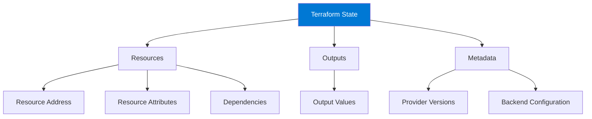

# Module 5: Terraform State Management

## 5.1 Understanding Terraform State

### What is Terraform State?

Terraform state is a file that tracks the mapping between your configuration and real-world infrastructure. State stores: **resource metadata** (IDs, attributes), **dependency information** (resource relationships), **provider-specific data** (data not available from APIs), **output values** (computed outputs). State enables Terraform to determine what changes are needed.

State is critical because: **Terraform needs to know what exists** (to avoid creating duplicates), **some attributes aren't queryable** (stored in state), **dependencies are tracked** (execution order), **changes are computed** (compare desired vs. actual). Understanding state is essential for effective Terraform usage.

#### State File Structure



### Why State is Needed

State is needed because: **APIs don't track everything** (some attributes only in state), **dependency tracking** (knows resource relationships), **change detection** (compares desired vs. actual), **performance** (avoids querying all resources), **drift detection** (detects external changes). Without state, Terraform couldn't manage infrastructure effectively.

### State File Structure

State file structure (JSON format): **version** (state format version), **terraform_version** (Terraform version), **resources** (resource instances), **outputs** (output values), **metadata** (backend, provider info). State files are JSON but shouldn't be edited manually.

State file example structure:
```json
{
  "version": 4,
  "terraform_version": "1.6.0",
  "resources": [
    {
      "mode": "managed",
      "type": "aws_instance",
      "name": "web",
      "provider": "provider[\"registry.terraform.io/hashicorp/aws\"]",
      "instances": [
        {
          "attributes": {
            "id": "i-1234567890abcdef0",
            "ami": "ami-0c55b159cbfafe1f0",
            "instance_type": "t2.micro"
          }
        }
      ]
    }
  ],
  "outputs": {},
  "metadata": {
    "backend": {
      "type": "local"
    }
  }
}
```

### State Locking

State locking prevents concurrent modifications that could corrupt state. When Terraform runs, it locks state to prevent other operations. Locking mechanisms vary by backend: **local backend** (file-based locking), **remote backends** (backend-specific locking like DynamoDB for S3). State locking ensures consistency.

### State Backends

State backends determine where state is stored: **local backend** (default, state in file), **remote backends** (S3, Azure Storage, GCS, Terraform Cloud). Backends are configured in `terraform` blocks. Understanding backends helps you choose appropriate state storage.

---

## 5.2 Local State

### Default State Behavior

By default, Terraform stores state locally in `terraform.tfstate` file. Local state is: **simple** (no setup required), **fast** (no network calls), **suitable for single users** (not for teams), **risky for teams** (conflicts, loss). Local state is fine for learning and single-user scenarios.

### State File Location

Local state is stored in: **terraform.tfstate** (current state), **terraform.tfstate.backup** (backup of previous state). State files are in the working directory. State files contain sensitive data and should be protected.

### State File Security

State files contain sensitive information: **resource IDs**, **IP addresses**, **sometimes secrets** (if stored in resources). Security practices: **don't commit to version control** (use .gitignore), **encrypt at rest** (if storing), **restrict access** (file permissions), **use remote state** (for teams). Understanding security helps protect sensitive data.

### Local State Limitations

Local state limitations: **no team collaboration** (conflicts when multiple users), **no locking** (concurrent modifications possible), **risk of loss** (file deletion), **no history** (limited backup), **manual backup** (you must backup yourself). For teams, use remote state.

### When to Use Local State

Use local state for: **learning** (getting started), **single-user projects** (personal projects), **development** (local testing), **small projects** (simple infrastructure), **prototyping** (quick experiments). For production or teams, use remote state.

---

## 5.3 Remote State

### Remote State Backends

Remote state backends store state in remote systems: **S3** (AWS), **Azure Storage** (Azure), **GCS** (Google Cloud), **Terraform Cloud** (HashiCorp), **Consul** (HashiCorp), **HTTP** (REST API). Remote state enables: **team collaboration** (shared state), **state locking** (prevent conflicts), **state history** (versioning), **security** (access control).

### Backend Configuration

Backends are configured in `terraform` blocks. Backend configuration includes: **backend type** (s3, azurerm, gcs, etc.), **backend-specific settings** (bucket name, region, etc.), **credentials** (authentication). Backend configuration can be migrated.

Backend example:
```hcl
terraform {
  backend "s3" {
    bucket         = "my-terraform-state"
    key            = "path/to/state"
    region         = "us-west-2"
    encrypt        = true
    dynamodb_table = "terraform-state-lock"
  }
}
```

### State Storage Options

State storage options: **S3 + DynamoDB** (AWS, locking with DynamoDB), **Azure Storage** (Azure, blob storage), **GCS** (Google Cloud, object storage), **Terraform Cloud** (managed service), **Consul** (key-value store), **HTTP** (REST API). Choose based on cloud provider and requirements.

### State Locking Mechanisms

State locking prevents concurrent modifications: **DynamoDB** (for S3 backend), **Azure Blob** (native locking), **GCS** (native locking), **Terraform Cloud** (managed locking), **Consul** (session-based). Locking ensures only one Terraform operation at a time.

### Remote State Best Practices

Remote state best practices: **use for teams** (always for collaboration), **enable encryption** (encrypt at rest), **enable versioning** (state history), **use locking** (prevent conflicts), **separate by environment** (different state per environment), **backup regularly** (disaster recovery), **restrict access** (least privilege).

---

## 5.4 State Backends

### S3 Backend

S3 backend stores state in AWS S3 with optional DynamoDB locking. S3 backend provides: **durability** (S3 99.999999999% durability), **versioning** (state history), **encryption** (server-side encryption), **locking** (with DynamoDB), **access control** (IAM policies).

S3 backend configuration:
```hcl
terraform {
  backend "s3" {
    bucket         = "my-terraform-state-bucket"
    key            = "environments/prod/terraform.tfstate"
    region         = "us-west-2"
    encrypt        = true
    dynamodb_table = "terraform-state-lock"
    profile        = "production"
  }
}
```

### Azure Storage Backend

Azure Storage backend stores state in Azure Blob Storage. Provides: **durability** (Azure Storage reliability), **versioning** (blob versioning), **encryption** (storage encryption), **locking** (native blob locking), **access control** (RBAC).

Azure Storage backend:
```hcl
terraform {
  backend "azurerm" {
    resource_group_name  = "terraform-state-rg"
    storage_account_name = "terraformstate"
    container_name       = "tfstate"
    key                  = "prod.terraform.tfstate"
  }
}
```

### Google Cloud Storage Backend

GCS backend stores state in Google Cloud Storage. Provides: **durability** (GCS reliability), **versioning** (object versioning), **encryption** (GCS encryption), **locking** (native locking), **access control** (IAM).

GCS backend:
```hcl
terraform {
  backend "gcs" {
    bucket  = "terraform-state-bucket"
    prefix  = "environments/prod"
    project = "my-gcp-project"
  }
}
```

### Terraform Cloud Backend

Terraform Cloud backend stores state in HashiCorp's managed service. Provides: **managed service** (no infrastructure to manage), **state management** (automatic), **locking** (automatic), **history** (state versions), **UI** (web interface), **pricing** (free tier available).

Terraform Cloud backend:
```hcl
terraform {
  cloud {
    organization = "my-org"
    workspaces {
      name = "production"
    }
  }
}
```

### Consul Backend

Consul backend stores state in HashiCorp Consul. Provides: **key-value store** (Consul KV), **locking** (session-based), **service discovery** (Consul features), **on-premises** (can run on-prem). Less common than cloud storage backends.

---

## 5.5 State Operations

### terraform state list

`terraform state list` shows all resources in state. Useful for: **inspecting state** (see what's tracked), **verifying resources** (check if resource is in state), **debugging** (understand state contents).

Command:
```bash
terraform state list
# Output:
# aws_instance.web
# aws_s3_bucket.data
# aws_vpc.main
```

### terraform state show

`terraform state show` displays detailed information about a specific resource. Shows: **resource attributes** (all attributes), **resource metadata** (provider, dependencies), **current values** (actual state).

Command:
```bash
terraform state show aws_instance.web
```

### terraform state mv

`terraform state mv` moves resources in state (renames). Useful for: **refactoring** (rename resources), **moving between modules** (reorganize), **fixing mistakes** (correct state). Doesn't modify actual infrastructure, only state.

Command:
```bash
terraform state mv aws_instance.web aws_instance.webserver
```

### terraform state rm

`terraform state rm` removes resources from state without destroying them. Useful for: **importing elsewhere** (move to different state), **removing from management** (stop managing resource), **fixing state** (remove corrupted entries). Use carefully - resource still exists.

Command:
```bash
terraform state rm aws_instance.web
```

### terraform state pull/push

`terraform state pull` downloads state as JSON. `terraform state push` uploads state JSON. Useful for: **backup** (save state), **migration** (move state), **inspection** (examine state), **recovery** (restore state). Use with caution - can corrupt state if misused.

Commands:
```bash
# Pull state
terraform state pull > state.json

# Push state (dangerous - use carefully)
terraform state push state.json
```

---

## Quick Reference

### State Commands
```bash
# List resources
terraform state list

# Show resource
terraform state show <resource>

# Move resource
terraform state mv <old> <new>

# Remove resource
terraform state rm <resource>

# Pull/push state
terraform state pull
terraform state push
```

### Backend Types
- `local` - Local file (default)
- `s3` - AWS S3
- `azurerm` - Azure Storage
- `gcs` - Google Cloud Storage
- `cloud` - Terraform Cloud

---

## Common Pitfalls

### Pitfall 1: Committing State to Git
**Problem**: State files contain sensitive data, conflicts
**Solution**: Use .gitignore, remote state
**Prevention**: Always use remote state for teams

### Pitfall 2: No State Locking
**Problem**: Concurrent modifications corrupt state
**Solution**: Use remote backends with locking
**Prevention**: Configure locking from start

### Pitfall 3: Not Backing Up State
**Problem**: Lost state means lost infrastructure tracking
**Solution**: Regular backups, versioning
**Prevention**: Automated backup procedures

---

## Best Practices

1. **Use Remote State**: Always for teams, recommended for production
2. **Enable State Locking**: Prevent concurrent modifications
3. **Backup State Regularly**: Disaster recovery capability
4. **Version State**: Enable versioning in storage
5. **Encrypt State**: Protect sensitive data
6. **Separate by Environment**: Different state per environment
7. **Restrict Access**: Least privilege for state access
8. **Monitor State Size**: Large state files can be slow
9. **Document State Location**: Team awareness
10. **Test State Operations**: Verify backup/restore

---

## Further Reading

### Official Documentation
- [Terraform State](https://www.terraform.io/docs/state/index.html)
- [State Backends](https://www.terraform.io/docs/language/settings/backends/index.html)
- [State Operations](https://www.terraform.io/docs/cli/commands/state/index.html)

### Related Topics
- Resources (Module 4)
- Workspaces (Module 7)
- Troubleshooting (Module 14)

---

*This module covers Terraform state management in detail. Understanding state is critical for effective Terraform usage, as state enables Terraform to track infrastructure and determine what changes are needed.*

