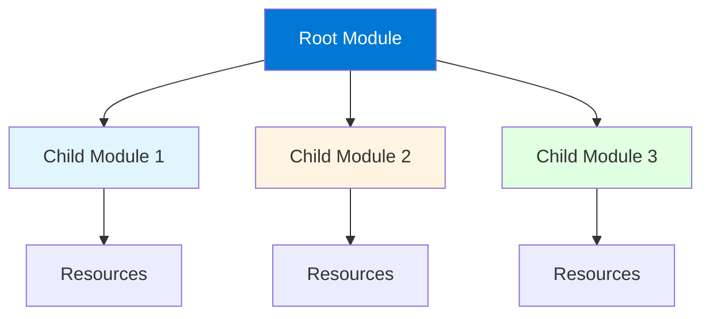

# Module 6: Terraform Modules

## 6.1 Module Basics

### What are Modules?

Modules are containers for multiple resources used together. Modules enable: **reusability** (use same infrastructure pattern multiple times), **organization** (group related resources), **abstraction** (hide complexity behind simple interface), **versioning** (pin to specific versions), **sharing** (publish for others). Understanding modules helps you create maintainable, reusable infrastructure code.

#### Module Structure



### Module Structure

Module structure includes: **main.tf** (primary resources), **variables.tf** (input variables), **outputs.tf** (output values), **versions.tf** (provider requirements), **README.md** (documentation). Modules can be simple (single directory) or complex (nested modules).

Example module structure:
```
modules/
└── web-server/
    ├── main.tf
    ├── variables.tf
    ├── outputs.tf
    ├── versions.tf
    └── README.md
```

### Module Sources

Modules can be sourced from: **local paths** (`./modules/web`), **Git repositories** (`git::https://github.com/...`), **Terraform Registry** (`hashicorp/aws/...`), **HTTP URLs** (`https://...`), **S3 buckets** (`s3://bucket/key`). Source determines where Terraform finds the module.

Module source examples:
```hcl
# Local path
module "web" {
  source = "./modules/web-server"
}

# Git repository
module "vpc" {
  source = "git::https://github.com/terraform-aws-modules/terraform-aws-vpc.git"
}

# Terraform Registry
module "s3" {
  source  = "terraform-aws-modules/s3-bucket/aws"
  version = "~> 3.0"
}
```

### Module Versions

Module versions enable pinning to specific versions. Version constraints: **exact** (`= 1.0.0`), **greater than** (`>= 1.0.0`), **pessimistic** (`~> 1.0` means `>= 1.0, < 2.0`). Versioning ensures stability and reproducibility.

Version example:
```hcl
module "vpc" {
  source  = "terraform-aws-modules/vpc/aws"
  version = "~> 5.0"  # Use version 5.x
}
```

### Using Modules

Using modules involves: **declaring module** (module block), **providing inputs** (variable values), **using outputs** (reference module outputs), **versioning** (specify versions). Modules abstract complexity behind simple interfaces.

Module usage example:
```hcl
module "web_server" {
  source = "./modules/web-server"
  
  instance_type = "t3.micro"
  ami_id        = "ami-0c55b159cbfafe1f0"
  environment   = "production"
  
  tags = {
    Project = "WebApp"
  }
}

# Use module output
output "server_ip" {
  value = module.web_server.instance_public_ip
}
```

---

## 6.2 Creating Modules

### Module Organization

Module organization should be: **focused** (single purpose), **well-documented** (clear README), **parameterized** (configurable via variables), **tested** (validated to work), **versioned** (tagged releases). Good organization makes modules reusable and maintainable.

### Module Inputs (Variables)

Module inputs are defined in `variables.tf`. Inputs should be: **well-documented** (descriptions), **typed** (specific types), **validated** (validation rules), **defaulted** (when appropriate). Inputs make modules flexible and reusable.

Module variables example:
```hcl
# modules/web-server/variables.tf
variable "instance_type" {
  description = "EC2 instance type"
  type        = string
  default     = "t2.micro"
  
  validation {
    condition     = can(regex("^t[23]\\.[a-z]+$", var.instance_type))
    error_message = "Instance type must be t2 or t3 family."
  }
}

variable "ami_id" {
  description = "AMI ID to use"
  type        = string
}

variable "environment" {
  description = "Environment name"
  type        = string
}

variable "tags" {
  description = "Tags to apply to resources"
  type        = map(string)
  default     = {}
}
```

### Module Outputs

Module outputs expose values from modules. Outputs should be: **useful** (provide needed information), **documented** (clear descriptions), **sensitive** (marked when appropriate). Outputs enable modules to provide information to calling modules.

Module outputs example:
```hcl
# modules/web-server/outputs.tf
output "instance_id" {
  description = "ID of the EC2 instance"
  value       = aws_instance.web.id
}

output "instance_public_ip" {
  description = "Public IP address"
  value       = aws_instance.web.public_ip
}

output "instance_private_ip" {
  description = "Private IP address"
  value       = aws_instance.web.private_ip
  sensitive   = true
}
```

### Module Documentation

Module documentation explains: **purpose** (what module does), **usage** (how to use), **inputs** (required/optional variables), **outputs** (what module provides), **examples** (usage examples), **requirements** (prerequisites). Good documentation enables module adoption.

README example:
```markdown
# Web Server Module

Creates an EC2 instance configured as a web server.

## Usage

```hcl
module "web" {
  source = "./modules/web-server"
  
  instance_type = "t3.micro"
  ami_id        = "ami-0c55b159cbfafe1f0"
}
```

## Inputs

| Name | Description | Type | Default | Required |
|------|-------------|------|---------|----------|
| instance_type | EC2 instance type | string | "t2.micro" | no |
| ami_id | AMI ID | string | n/a | yes |

## Outputs

| Name | Description |
|------|-------------|
| instance_id | EC2 instance ID |
| instance_public_ip | Public IP address |
```

### Module Best Practices

Module best practices: **single responsibility** (one purpose), **parameterized** (configurable), **documented** (clear docs), **tested** (validated), **versioned** (tagged), **backward compatible** (when possible), **follow conventions** (naming, structure). Following best practices ensures modules are useful and maintainable.

---

## 6.3 Module Patterns

### Root Modules

Root modules are the top-level configuration that calls other modules. Root modules: **orchestrate** (coordinate child modules), **provide values** (pass inputs to modules), **consume outputs** (use module outputs), **organize** (structure infrastructure). Root modules are your main Terraform configuration.

Root module example:
```hcl
# Root module (main.tf)
module "network" {
  source = "./modules/network"
  
  vpc_cidr = "10.0.0.0/16"
  environment = var.environment
}

module "compute" {
  source = "./modules/compute"
  
  subnet_id = module.network.public_subnet_id
  vpc_id    = module.network.vpc_id
}
```

### Child Modules

Child modules are called by root or other modules. Child modules: **encapsulate** (group related resources), **abstract** (hide complexity), **reuse** (used multiple times), **compose** (build complex infrastructure). Child modules enable code reuse.

### Reusable Modules

Reusable modules are designed for multiple uses. Characteristics: **generic** (not environment-specific), **configurable** (many options), **well-documented** (easy to use), **tested** (proven to work), **versioned** (stable releases). Reusable modules enable infrastructure patterns.

### Module Composition

Module composition combines multiple modules to build complex infrastructure. Composition patterns: **layered** (modules call other modules), **hierarchical** (parent-child relationships), **modular** (independent modules combined). Composition enables building complex systems from simple modules.

### Module Registry

Terraform Registry hosts public and private modules. Registry provides: **discovery** (find modules), **documentation** (auto-generated docs), **versioning** (module versions), **sharing** (publish modules). Registry enables module sharing and discovery.

---

## 6.4 Terraform Registry

### Public Module Registry

Public Terraform Registry hosts community modules. Features: **search** (find modules), **browse** (explore modules), **documentation** (auto-generated), **versioning** (module versions), **ratings** (community feedback). Public registry provides thousands of pre-built modules.

### Private Module Registry

Private module registries host organization-specific modules. Features: **access control** (restricted access), **internal modules** (organization modules), **compliance** (meet requirements), **customization** (organization needs). Private registries enable internal module sharing.

### Publishing Modules

Publishing modules to registry: **Git repository** (host module in Git), **tag releases** (version tags), **documentation** (README, inputs, outputs), **follow conventions** (naming, structure), **test** (ensure modules work). Publishing enables module sharing.

### Module Versioning

Module versioning uses Git tags: **semantic versioning** (major.minor.patch), **tags** (v1.0.0, v1.1.0), **stability** (versions are immutable), **changelog** (document changes). Versioning ensures reproducible infrastructure.

### Module Documentation Standards

Module documentation standards: **README.md** (purpose, usage, examples), **inputs** (variable descriptions), **outputs** (output descriptions), **requirements** (prerequisites), **examples** (usage examples), **changelog** (version history). Standards ensure consistent documentation.

---

## 6.5 Advanced Module Techniques

### Module Composition

Advanced composition patterns: **nested modules** (modules calling modules), **conditional modules** (use based on conditions), **dynamic modules** (create modules dynamically), **module dependencies** (modules depending on others). Advanced composition enables complex infrastructure.

### Conditional Module Usage

Conditional module usage creates modules based on conditions: **count** (create 0 or 1 module), **for_each** (create modules from map), **conditional logic** (if/else patterns). Conditional usage enables flexible infrastructure.

Conditional example:
```hcl
module "monitoring" {
  count = var.enable_monitoring ? 1 : 0
  
  source = "./modules/monitoring"
  # ...
}
```

### Dynamic Module Blocks

Dynamic module blocks (not directly supported, but patterns exist): **for_each with modules** (create multiple module instances), **conditional creation** (create based on conditions). Dynamic patterns enable flexible module usage.

### Module Testing

Module testing validates modules work correctly: **terraform validate** (syntax validation), **terraform plan** (dry-run), **terraform apply** (actual testing), **test frameworks** (Terratest, kitchen-terraform), **CI/CD** (automated testing). Testing ensures module quality.

### Module Versioning Strategies

Versioning strategies: **semantic versioning** (major.minor.patch), **branch-based** (main, develop), **tag-based** (v1.0.0), **pinning** (exact versions), **ranges** (version constraints). Strategies balance stability and updates.

---

## Quick Reference

### Module Syntax
```hcl
module "name" {
  source = "./modules/path"
  version = "~> 1.0"
  
  variable = "value"
}

# Use output
output "value" {
  value = module.name.output_name
}
```

### Module Sources
- Local: `./modules/path`
- Git: `git::https://github.com/...`
- Registry: `terraform-aws-modules/vpc/aws`
- HTTP: `https://...`

---

## Common Pitfalls

### Pitfall 1: Not Versioning Modules
**Problem**: Breaking changes, unpredictable updates
**Solution**: Pin module versions
**Prevention**: Always specify version constraints

### Pitfall 2: Over-Complex Modules
**Problem**: Hard to use, maintain, and test
**Solution**: Keep modules focused and simple
**Prevention**: Single responsibility principle

### Pitfall 3: Poor Documentation
**Problem**: Modules hard to use and understand
**Solution**: Comprehensive README and docs
**Prevention**: Document all inputs/outputs

---

## Best Practices

1. **Version Modules**: Use semantic versioning
2. **Document Thoroughly**: README, inputs, outputs
3. **Keep Focused**: Single responsibility
4. **Test Modules**: Validate before sharing
5. **Use Variables**: Make modules configurable
6. **Provide Outputs**: Expose useful information
7. **Follow Conventions**: Standard structure
8. **Review Changes**: Code review for modules
9. **Maintain Backward Compatibility**: When possible
10. **Share Modules**: Use registries for sharing

---

## Further Reading

### Official Documentation
- [Terraform Modules](https://www.terraform.io/docs/language/modules/index.html)
- [Module Registry](https://registry.terraform.io/)
- [Module Composition](https://www.terraform.io/docs/language/modules/develop/composition.html)

### Related Topics
- Resources (Module 4)
- Variables (Module 2)
- Best Practices (Module 12)

---

*This module covers Terraform modules in detail. Understanding modules is essential for creating reusable, maintainable infrastructure code that can be shared and composed into complex systems.*

