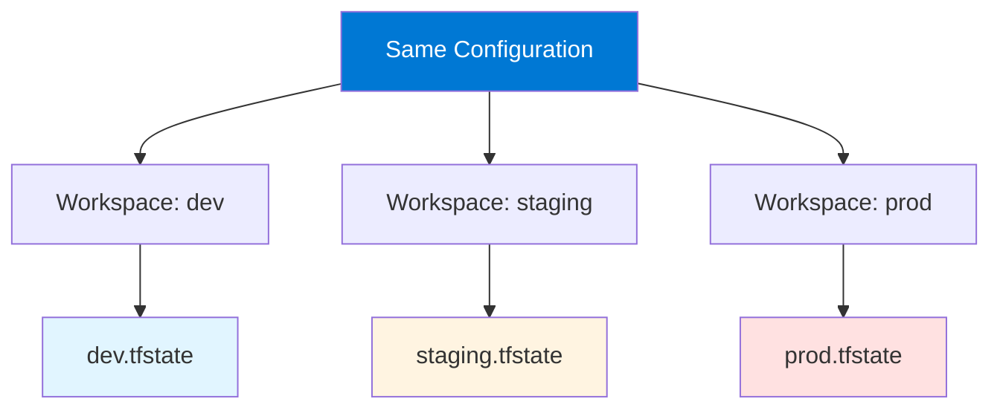

# Module 7: Terraform Workspaces

## 7.1 Workspace Concepts

### What are Workspaces?

Terraform workspaces allow you to manage multiple distinct state files within the same working directory. Each workspace has its own state file, enabling you to use the same configuration for different environments (dev, staging, prod) without code duplication. Workspaces provide state isolation while sharing the same configuration code.

Workspaces are useful for: **environment management** (different environments with same config), **feature branches** (testing changes), **multi-tenant** (different customers/tenants), **experimentation** (testing without affecting production). Understanding workspaces helps you manage multiple environments efficiently.

#### Workspace State Isolation



### Workspace vs. Directories

Workspaces vs. directories: **workspaces** (same directory, different state files, easier switching), **directories** (different directories, separate state files, clearer separation). Workspaces are simpler for environment management, directories provide more isolation.

### Workspace State Isolation

Each workspace maintains separate state, ensuring: **no conflicts** (changes in one workspace don't affect others), **parallel work** (different environments simultaneously), **state safety** (isolated state prevents accidents), **easy switching** (switch between environments quickly). State isolation is the key benefit of workspaces.

### Workspace Use Cases

Workspace use cases: **environment management** (dev/staging/prod), **feature testing** (test branches), **multi-tenant** (different tenants), **experimentation** (try changes safely), **disaster recovery** (recovery environments). Understanding use cases helps you apply workspaces effectively.

### Workspace Limitations

Workspace limitations: **shared configuration** (same code for all workspaces), **variable management** (must handle different values), **backend configuration** (shared backend), **state file naming** (workspace name in state key). Understanding limitations helps you decide when to use workspaces vs. directories.

---

## 7.2 Managing Workspaces

### Creating Workspaces

Creating workspaces uses `terraform workspace new`. Workspaces are created locally and can use remote state. Workspace names should be descriptive and follow conventions.

Creating workspaces:
```bash
# Create new workspace
terraform workspace new dev

# Create and switch
terraform workspace new staging

# Default workspace is "default"
```

### Selecting Workspaces

Selecting workspaces uses `terraform workspace select`. Switching workspaces changes which state file is active. Only one workspace is active at a time.

Selecting workspaces:
```bash
# List workspaces
terraform workspace list

# Select workspace
terraform workspace select dev

# Show current workspace
terraform workspace show
```

### Listing Workspaces

Listing workspaces shows all available workspaces and indicates the current one. Listing helps you see available environments and current selection.

Listing workspaces:
```bash
terraform workspace list
# Output:
#   default
# * dev
#   staging
#   prod
# (* indicates current)
```

### Deleting Workspaces

Deleting workspaces removes workspace state. Deletion requires: **workspace must be empty** (no resources), **use with caution** (permanent deletion). Deletion is useful for cleanup.

Deleting workspaces:
```bash
# Select different workspace first
terraform workspace select default

# Delete workspace
terraform workspace delete dev
```

### Workspace Best Practices

Workspace best practices: **use for environments** (dev/staging/prod), **naming conventions** (clear, consistent names), **document usage** (which workspace for what), **state management** (use remote state), **variable management** (different values per workspace), **testing** (test workspace changes). Following best practices ensures effective workspace usage.

---

## 7.3 Workspace Patterns

### Environment Management

Environment management uses workspaces for different environments. Pattern: **same configuration** (shared code), **different state** (isolated state per environment), **different variables** (environment-specific values), **promotion** (dev → staging → prod). This pattern enables consistent infrastructure across environments.

Environment pattern example:
```hcl
# Use workspace name in configuration
locals {
  environment = terraform.workspace
}

resource "aws_instance" "web" {
  instance_type = local.environment == "prod" ? "t3.large" : "t3.micro"
  
  tags = {
    Environment = local.environment
  }
}
```

### Feature Branch Workspaces

Feature branch workspaces test changes in isolation. Pattern: **create workspace per feature** (feature-xyz workspace), **test changes** (apply without affecting others), **delete when done** (cleanup after merge). This pattern enables safe experimentation.

### Multi-Tenant Patterns

Multi-tenant patterns use workspaces for different tenants. Pattern: **workspace per tenant** (tenant-1, tenant-2), **isolated state** (each tenant's state separate), **shared configuration** (same infrastructure pattern). This pattern enables multi-tenant infrastructure.

### Workspace Organization

Workspace organization should be: **consistent naming** (follow conventions), **documented** (explain workspace purpose), **managed** (regular cleanup), **versioned** (workspace state in version control via backend). Organization ensures workspace management stays manageable.

### Workspace Naming Conventions

Naming conventions should be: **descriptive** (clear purpose), **consistent** (follow patterns), **environment-based** (dev, staging, prod), **feature-based** (feature-xyz), **tenant-based** (tenant-abc). Conventions ensure workspaces are easy to understand and manage.

---

## Quick Reference

### Workspace Commands
```bash
# Create workspace
terraform workspace new <name>

# List workspaces
terraform workspace list

# Select workspace
terraform workspace select <name>

# Show current
terraform workspace show

# Delete workspace
terraform workspace delete <name>
```

### Workspace Usage
```hcl
# Use workspace name
locals {
  environment = terraform.workspace
}
```

---

## Common Pitfalls

### Pitfall 1: Applying to Wrong Workspace
**Problem**: Changes applied to wrong environment
**Solution**: Always verify current workspace
**Prevention**: Check workspace before applying

### Pitfall 2: Shared Configuration Issues
**Problem**: Configuration doesn't work for all workspaces
**Solution**: Use conditional logic, variables
**Prevention**: Test in all workspaces

### Pitfall 3: No Workspace Naming Convention
**Problem**: Confusing workspace names
**Solution**: Follow naming conventions
**Prevention**: Document naming standards

---

## Best Practices

1. **Use for Environments**: dev, staging, prod
2. **Naming Conventions**: Clear, consistent names
3. **Verify Workspace**: Check before applying
4. **Use Remote State**: For team collaboration
5. **Document Purpose**: Explain workspace usage
6. **Test Changes**: In dev first
7. **Clean Up**: Remove unused workspaces
8. **Separate State**: Each workspace has own state
9. **Use Variables**: Handle workspace differences
10. **Monitor Usage**: Track workspace activity

---

## Further Reading

### Official Documentation
- [Terraform Workspaces](https://www.terraform.io/docs/state/workspaces.html)
- [Workspace Commands](https://www.terraform.io/docs/cli/commands/workspace/index.html)

### Related Topics
- State Management (Module 5)
- Advanced Patterns (Module 16)

---

*This module covers Terraform workspaces in detail. Understanding workspaces helps you manage multiple environments efficiently using the same configuration code with isolated state files.*

