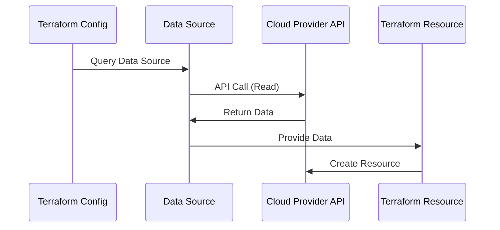

# Module 8: Terraform Data Sources

## 8.1 Understanding Data Sources

### What are Data Sources?

Data sources fetch information from providers without creating resources. Data sources are read-only operations that query existing infrastructure or external systems. Unlike resources, data sources don't create, update, or delete anything - they only read information.

Data sources are useful for: **referencing existing resources** (resources created outside Terraform), **querying provider information** (available AMIs, regions), **reading external data** (HTTP APIs, files), **getting current context** (current region, account). Understanding data sources enables you to work with existing infrastructure and external systems.

#### Data Source Flow



### Data Source vs. Resources

Data sources vs. resources: **data sources** (read-only, fetch information, don't create anything), **resources** (create/manage infrastructure, modify state). Data sources complement resources by providing information needed for resource creation.

### Read-Only Operations

Data sources perform read-only operations: **no state changes** (don't modify infrastructure), **no resource creation** (only query information), **idempotent** (same query, same result), **refreshable** (can be refreshed). Understanding read-only nature helps you use data sources appropriately.

### Data Source Lifecycle

Data source lifecycle: **plan phase** (query during plan), **apply phase** (refresh if needed), **refresh** (update values if changed externally). Data sources are refreshed when configuration changes or during refresh operations.

### Common Data Sources

Common data sources include: **aws_ami** (query AMIs), **aws_availability_zones** (list AZs), **aws_vpc** (get VPC info), **azurerm_resource_group** (get resource group), **google_compute_image** (get GCE images), **http** (HTTP requests), **local_file** (read files). Understanding common data sources helps you find existing resources.

---

## 8.2 Using Data Sources

### Data Source Syntax

Data source syntax is similar to resources but uses `data` block:

```hcl
data "data_source_type" "data_source_name" {
  argument1 = "value1"
  argument2 = "value2"
  
  filter {
    name   = "filter-name"
    values = ["value1", "value2"]
  }
}
```

Data source example:
```hcl
data "aws_ami" "ubuntu" {
  most_recent = true
  owners      = ["099720109477"]
  
  filter {
    name   = "name"
    values = ["ubuntu/images/hvm-ssd/ubuntu-jammy-22.04-amd64-server-*"]
  }
  
  filter {
    name   = "virtualization-type"
    values = ["hvm"]
  }
}
```

### Data Source Arguments

Data source arguments specify what to query: **identifiers** (IDs, names), **filters** (search criteria), **query parameters** (provider-specific options). Arguments vary by data source type. Understanding arguments helps you query data effectively.

### Data Source Outputs

Data source outputs provide queried information. Outputs are referenced using `data.data_source_type.data_source_name.attribute`. Outputs provide information used by resources or outputs.

Using data source outputs:
```hcl
data "aws_vpc" "existing" {
  id = "vpc-12345678"
}

resource "aws_subnet" "public" {
  vpc_id     = data.aws_vpc.existing.id  # Use data source output
  cidr_block = "10.0.1.0/24"
}

output "vpc_cidr" {
  value = data.aws_vpc.existing.cidr_block
}
```

### Data Source Dependencies

Data sources create dependencies when resources use their outputs. Terraform ensures data sources are queried before dependent resources. Dependencies ensure data is available when needed.

### Data Source Best Practices

Data source best practices: **use for existing resources** (reference infrastructure), **document queries** (explain why), **handle errors** (data may not exist), **optimize queries** (use filters efficiently), **refresh when needed** (update stale data). Following best practices ensures effective data source usage.

---

## 8.3 Common Data Source Patterns

### Fetching Existing Resources

Fetching existing resources references infrastructure created outside Terraform: **import workflow** (use data source to reference, then import), **hybrid management** (some resources in Terraform, some not), **migration** (gradual migration to Terraform).

Fetching example:
```hcl
data "aws_vpc" "existing" {
  id = "vpc-12345678"  # Existing VPC created manually
}

resource "aws_subnet" "new" {
  vpc_id     = data.aws_vpc.existing.id
  cidr_block = "10.0.1.0/24"
}
```

### Querying External APIs

Querying external APIs fetches data from HTTP endpoints: **http data source** (REST APIs), **external data source** (shell scripts), **custom data** (any external system). This enables integration with external systems.

HTTP data source example:
```hcl
data "http" "example" {
  url = "https://api.example.com/data"
  
  request_headers = {
    Authorization = "Bearer ${var.api_token}"
  }
}

locals {
  api_data = jsondecode(data.http.example.body)
}
```

### Reading Configuration Files

Reading configuration files loads data from files: **local_file data source** (read files), **template_file** (template files), **external** (shell scripts). This enables loading configuration from files.

File reading example:
```hcl
data "local_file" "config" {
  filename = "${path.module}/config.json"
}

locals {
  config = jsondecode(data.local_file.config.content)
}
```

### Getting Current Context

Getting current context provides information about current execution: **current region** (aws_region), **current caller identity** (aws_caller_identity), **current partition** (aws_partition). This enables dynamic configuration based on context.

Context example:
```hcl
data "aws_region" "current" {}
data "aws_caller_identity" "current" {}

resource "aws_instance" "web" {
  # Use current region
  ami = data.aws_ami.ubuntu.id
  
  tags = {
    AccountId = data.aws_caller_identity.current.account_id
    Region    = data.aws_region.current.name
  }
}
```

### Cross-Resource References

Cross-resource references use data sources to reference resources in other configurations: **remote state** (read other state files), **cross-stack** (reference resources in other stacks), **modular** (modules referencing each other). This enables composition across configurations.

Remote state data source:
```hcl
data "terraform_remote_state" "network" {
  backend = "s3"
  
  config = {
    bucket = "terraform-state"
    key    = "network/terraform.tfstate"
    region = "us-west-2"
  }
}

resource "aws_instance" "web" {
  subnet_id = data.terraform_remote_state.network.outputs.public_subnet_id
}
```

---

## Quick Reference

### Data Source Syntax
```hcl
data "data_source_type" "name" {
  argument = "value"
}

# Use output
resource "type" "name" {
  attr = data.data_source_type.name.attribute
}
```

### Common Data Sources
- `aws_ami` - Query AMIs
- `aws_vpc` - Get VPC info
- `aws_region` - Current region
- `http` - HTTP requests
- `local_file` - Read files

---

## Common Pitfalls

### Pitfall 1: Data Source Not Found
**Problem**: Data source query fails, resource creation fails
**Solution**: Verify data exists, handle errors
**Prevention**: Test data source queries

### Pitfall 2: Stale Data
**Problem**: Data source returns outdated information
**Solution**: Refresh state, update queries
**Prevention**: Regular state refresh

### Pitfall 3: Overusing Data Sources
**Problem**: Too many API calls, slow plans
**Solution**: Cache results, use efficiently
**Prevention**: Optimize data source usage

---

## Best Practices

1. **Use for Existing Resources**: Reference infrastructure
2. **Document Queries**: Explain why data source is used
3. **Handle Errors**: Data may not exist
4. **Optimize Queries**: Use filters efficiently
5. **Refresh When Needed**: Update stale data
6. **Cache Results**: Avoid repeated queries
7. **Test Queries**: Verify data sources work
8. **Use Filters**: Narrow down results
9. **Validate Data**: Ensure data is correct
10. **Monitor Performance**: Track query times

---

## Further Reading

### Official Documentation
- [Terraform Data Sources](https://www.terraform.io/docs/language/data-sources/index.html)
- [Data Source Lifecycle](https://www.terraform.io/docs/language/data-sources/index.html#data-source-lifecycle)

### Related Topics
- Resources (Module 4)
- Providers (Module 3)

---

*This module covers Terraform data sources in detail. Understanding data sources enables you to query existing infrastructure, external systems, and configuration files, making Terraform configurations more flexible and integrated.*

