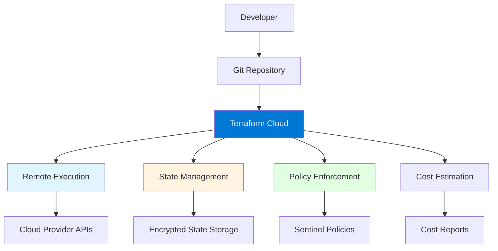
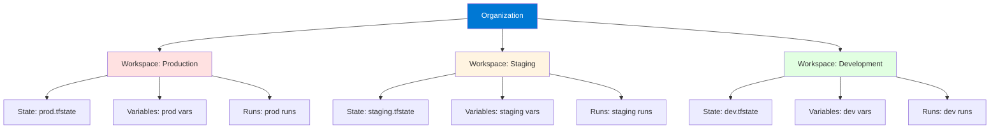
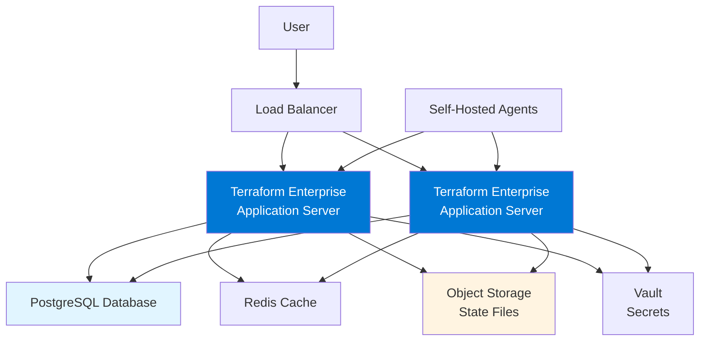
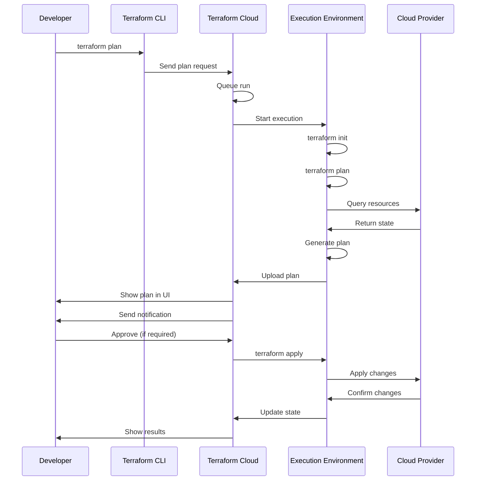

# Module 11: Terraform Cloud and Enterprise

## Table of Contents
- [11.1 Terraform Cloud Overview](#111-terraform-cloud-overview)
- [11.2 Terraform Cloud Workspaces](#112-terraform-cloud-workspaces)
- [11.3 Terraform Enterprise](#113-terraform-enterprise)
- [11.4 Remote Operations](#114-remote-operations)
- [Quick Reference](#quick-reference)
- [Common Pitfalls](#common-pitfalls)
- [Best Practices](#best-practices)
- [Further Reading](#further-reading)

---

## 11.1 Terraform Cloud Overview

### What is Terraform Cloud?

Terraform Cloud is HashiCorp's fully managed service that provides a collaborative infrastructure-as-code platform built on top of Terraform. It eliminates the need to manage your own infrastructure for running Terraform, storing state, and coordinating team workflows. Terraform Cloud is designed to be the central hub for all Terraform operations, providing a web-based interface, API, and CLI integration for managing infrastructure at scale.

Terraform Cloud addresses common challenges faced by teams using Terraform: **state management complexity** (no need to set up S3, DynamoDB, or other backends), **team collaboration** (shared workspaces, run history, and notifications), **security and compliance** (encrypted state, audit logs, policy enforcement), **cost visibility** (cost estimation before applying changes), and **workflow automation** (VCS integration, automatic runs, approval gates). Understanding Terraform Cloud helps you leverage a managed platform for infrastructure automation.

#### Terraform Cloud Architecture



### Key Features and Benefits

Terraform Cloud provides numerous features that enhance Terraform workflows:

**Remote State Management**: Terraform Cloud automatically manages state files with encryption at rest and in transit. State is versioned, allowing you to view history and roll back if needed. State locking is automatic, preventing concurrent modifications that could corrupt state. This eliminates the need to configure and maintain S3 buckets, DynamoDB tables, or other state backends.

**Remote Operations**: Terraform runs execute in Terraform Cloud's infrastructure, ensuring consistent execution environments. This eliminates "works on my machine" problems and ensures all team members use the same Terraform and provider versions. Remote operations provide detailed logs, execution history, and the ability to cancel long-running operations.

**Team Collaboration**: Multiple team members can work together seamlessly. Workspaces provide shared state, run history shows who made what changes, and notifications keep the team informed. Access controls ensure only authorized users can make changes, and approval workflows provide governance for production deployments.

**Version Control Integration**: Terraform Cloud integrates with GitHub, GitLab, Bitbucket, and Azure DevOps. When code is pushed, Terraform Cloud can automatically trigger runs. Pull requests can trigger plan-only runs, showing what would change without applying. This integration enables GitOps workflows where infrastructure changes flow through the same review process as application code.

**Policy as Code**: Terraform Cloud supports Sentinel policies, allowing you to enforce organizational policies automatically. Policies can prevent dangerous changes (like deleting production databases), enforce naming conventions, require specific tags, or validate resource configurations. Policies run automatically on every plan, catching issues before they're applied.

**Cost Estimation**: Before applying changes, Terraform Cloud estimates the cost impact. This helps teams understand the financial implications of infrastructure changes and catch expensive mistakes before they're deployed. Cost estimates are shown in the UI and can be included in notifications.

**Private Module Registry**: Teams can publish and share modules internally through Terraform Cloud's private registry. This promotes code reuse, ensures consistency, and provides versioning for internal modules. The registry integrates with workspaces, making it easy to use approved modules.

### Terraform Cloud vs. CLI

Understanding when to use Terraform Cloud versus the CLI is important:

**Use Terraform Cloud when**:
- Working in a team environment (shared state, collaboration)
- Need policy enforcement (Sentinel policies)
- Want automatic runs from VCS (GitOps workflows)
- Require audit logging and compliance (enterprise requirements)
- Need cost estimation (financial visibility)
- Want managed state (no backend setup)

**Use CLI when**:
- Working solo or in small teams (local development)
- Need full control over execution environment
- Working in air-gapped environments (no internet access)
- Have existing CI/CD pipelines (don't want to change)
- Prefer local state management (simple projects)

#### Comparison: Terraform Cloud vs. CLI

| Feature | Terraform Cloud | Terraform CLI |
|---------|----------------|---------------|
| **State Management** | Automatic, encrypted | Manual setup required |
| **Team Collaboration** | Built-in workspaces | Requires remote backend |
| **Policy Enforcement** | Sentinel policies | Manual review |
| **Cost Estimation** | Automatic | Requires third-party tools |
| **VCS Integration** | Native integration | Manual webhook setup |
| **Execution Environment** | Managed, consistent | Local machine dependent |
| **Audit Logging** | Automatic | Manual logging |
| **Setup Complexity** | Low (sign up and go) | Medium (backend config) |
| **Cost** | Free tier + paid plans | Free (infrastructure costs) |
| **Best For** | Teams, production | Solo, development |

### Pricing Tiers

Terraform Cloud offers several pricing tiers:

**Free Tier**: Suitable for small teams and learning. Includes: up to 5 users, unlimited workspaces, remote state management, VCS integration, and community support. Limited to 500 resources per month.

**Team Tier**: For growing teams. Includes: everything in Free, unlimited users, team management, policy enforcement (limited), cost estimation, and priority support. Pricing is per user per month.

**Business Tier**: For organizations. Includes: everything in Team, advanced policy enforcement, audit logging, SSO integration, private module registry, and dedicated support.

**Enterprise Tier**: For large enterprises. Includes: everything in Business, self-hosted option (Terraform Enterprise), advanced security features, compliance certifications, and dedicated account management.

Understanding pricing helps you choose the right tier for your needs.

### Getting Started with Terraform Cloud

Getting started with Terraform Cloud involves several steps:

1. **Create Account**: Sign up at terraform.io/cloud
2. **Create Organization**: Organizations group workspaces and users
3. **Connect VCS**: Link GitHub, GitLab, or Bitbucket account
4. **Create Workspace**: Set up a workspace for your configuration
5. **Configure Variables**: Add Terraform and environment variables
6. **Run Terraform**: Trigger runs manually or automatically

Example setup process:
```bash
# Install Terraform Cloud CLI
# No separate CLI needed - use terraform login

# Login to Terraform Cloud
terraform login

# Configure backend
terraform {
  cloud {
    organization = "my-org"
    workspaces {
      name = "production"
    }
  }
}

# Initialize (connects to Terraform Cloud)
terraform init

# Plan and apply (runs in Terraform Cloud)
terraform plan
terraform apply
```

---

## 11.2 Terraform Cloud Workspaces

### Understanding Cloud Workspaces

Terraform Cloud workspaces are fundamentally different from CLI workspaces. A Terraform Cloud workspace represents a collection of infrastructure managed by a single Terraform configuration. Each workspace has its own state, variables, run history, and settings. Workspaces in Terraform Cloud are more like "projects" or "environments" - they're the primary unit of organization.

Cloud workspaces provide: **state isolation** (each workspace has separate state), **configuration management** (Terraform code location and version), **variable management** (workspace-specific variables), **run history** (complete audit trail), **notifications** (alerts on run status), and **access control** (who can view/modify). Understanding cloud workspaces is essential for organizing infrastructure in Terraform Cloud.

#### Workspace Structure



### Workspace Configuration

Workspaces can be configured in several ways:

**VCS-Driven Workspaces**: Connected to a Git repository. Terraform Cloud automatically triggers runs when code is pushed. Configuration is pulled from the repository, ensuring the workspace always uses the latest code. This is the recommended approach for most use cases.

**CLI-Driven Workspaces**: Managed via the Terraform CLI. You run Terraform locally, but state is stored in Terraform Cloud. Useful for local development or when you don't want automatic runs from VCS.

**API-Driven Workspaces**: Managed entirely through the Terraform Cloud API. Useful for automation, custom workflows, or integration with other tools.

VCS-driven workspace setup:
1. Connect VCS provider (GitHub, GitLab, etc.)
2. Select repository
3. Choose working directory (if not root)
4. Configure Terraform version
5. Set up variables
6. Configure run triggers

### Variable Management

Terraform Cloud provides sophisticated variable management:

**Terraform Variables**: Standard Terraform input variables. Can be marked as sensitive (hidden in UI and logs). Can have descriptions and default values. Variables can be set at workspace level or organization level (shared across workspaces).

**Environment Variables**: Standard environment variables (like AWS_ACCESS_KEY_ID). Always treated as sensitive. Useful for provider authentication and tool configuration.

**Variable Sets**: Groups of variables that can be shared across multiple workspaces. Useful for common variables like provider credentials or organization-wide settings. Variable sets can be applied to workspaces automatically.

Variable management example:
```hcl
# In Terraform Cloud UI or via API:
# Terraform Variables:
# - instance_type (string, default: "t2.micro")
# - environment (string, required)
# - enable_monitoring (bool, default: true, sensitive: false)

# Environment Variables:
# - AWS_ACCESS_KEY_ID (sensitive)
# - AWS_SECRET_ACCESS_KEY (sensitive)
# - AWS_DEFAULT_REGION (sensitive: false)

# Variable Sets:
# - "production-credentials" (applied to prod workspaces)
#   - AWS_PROFILE
#   - TF_VAR_db_password
```

### Run Triggers

Run triggers automatically start runs based on events:

**VCS Triggers**: Automatically trigger runs when code is pushed to specific branches. Can be configured to run on all branches, specific branches, or exclude certain branches. Pull requests typically trigger plan-only runs.

**Workspace Triggers**: One workspace can trigger runs in another workspace. Useful for dependency chains - when infrastructure in one workspace changes, dependent workspaces can be updated automatically.

**API Triggers**: External systems can trigger runs via the Terraform Cloud API. Useful for custom automation or integration with other tools.

Run trigger configuration example:
- **Source Workspace**: "network" (VPC, subnets)
- **Target Workspace**: "application" (depends on network)
- **Trigger**: When "network" workspace applies successfully, trigger plan in "application" workspace

### Workspace Settings

Workspace settings control behavior:

**Execution Mode**: 
- **Remote**: Runs execute in Terraform Cloud (recommended)
- **Local**: Runs execute on your machine, state stored in cloud
- **Agent**: Runs execute on self-hosted agents (Enterprise)

**Terraform Version**: Which Terraform version to use. Can be pinned to specific version or use latest. Different workspaces can use different versions.

**Working Directory**: Subdirectory within repository containing Terraform files. Useful for monorepos with multiple configurations.

**Auto-Apply**: Automatically apply changes after successful plan. Useful for development environments, dangerous for production.

**Queue All Runs**: Whether to queue runs or cancel queued runs when new runs are triggered. Prevents multiple simultaneous runs.

### Workspace Best Practices

Best practices for workspace management:

**One Workspace Per Environment**: Create separate workspaces for dev, staging, and production. This provides isolation and allows different settings per environment.

**Consistent Naming**: Use clear, consistent naming conventions. Examples: `project-env` (webapp-prod), `env-resource` (prod-database), `team-project-env` (backend-api-prod).

**Use Variable Sets**: Share common variables (like provider credentials) via variable sets rather than duplicating in each workspace.

**Enable Auto-Apply Carefully**: Only enable auto-apply for non-production workspaces. Production should always require manual approval.

**Use Run Triggers Wisely**: Be careful with workspace triggers to avoid cascading runs. Test trigger configurations thoroughly.

**Monitor Run History**: Regularly review run history to understand infrastructure changes and catch issues early.

---

## 11.3 Terraform Enterprise

### What is Terraform Enterprise?

Terraform Enterprise is the self-hosted version of Terraform Cloud, designed for organizations with strict security, compliance, or data residency requirements. It provides all the features of Terraform Cloud but runs in your own infrastructure, giving you complete control over data, network access, and deployment architecture.

Terraform Enterprise is suitable for organizations that need: **air-gapped deployments** (no internet connectivity), **data residency** (data must stay in specific regions), **compliance requirements** (HIPAA, PCI-DSS, SOC 2), **custom integrations** (on-premises systems), or **high availability** (clustering for redundancy). Understanding Terraform Enterprise helps you determine if self-hosting is right for your organization.

#### Terraform Enterprise Architecture



### Enterprise Features

Terraform Enterprise includes all Terraform Cloud features plus:

**Self-Hosted Deployment**: Complete control over where and how Terraform Enterprise runs. Can be deployed on-premises, in private clouds, or in air-gapped environments. Supports various deployment methods including Docker, Kubernetes, and virtual machines.

**High Availability**: Supports clustering for redundancy and high availability. Multiple application servers can run behind a load balancer, with shared database and storage. Automatic failover ensures service continuity.

**Single Sign-On (SSO)**: Integration with identity providers (SAML, OIDC, LDAP) for centralized authentication. Users authenticate through your existing identity system, providing seamless access and centralized user management.

**Advanced Audit Logging**: Comprehensive audit logs of all operations. Logs include who did what, when, and from where. Logs can be exported to SIEM systems for compliance and security monitoring.

**Private Module Registry**: Internal module registry for sharing modules within your organization. Modules can be versioned, documented, and access-controlled. Promotes code reuse and consistency.

**Sentinel Policy as Code**: Advanced policy enforcement using Sentinel. Policies can be complex, checking multiple conditions and enforcing organizational standards. Policy sets can be applied to workspaces automatically.

**Custom Agents**: Self-hosted agents for running Terraform in your own infrastructure. Useful for accessing private networks, on-premises resources, or air-gapped environments. Agents connect to Terraform Enterprise and execute runs on your infrastructure.

**Air-Gapped Support**: Can operate completely disconnected from the internet. All updates, modules, and providers can be installed via offline methods. Critical for highly secure environments.

### Deployment Options

Terraform Enterprise can be deployed in several ways:

**Standard Installation**: Traditional installation on virtual machines or physical servers. Includes application server, database, and supporting services. Suitable for most on-premises deployments.

**Kubernetes Deployment**: Deployed as containers in Kubernetes. Provides better scalability and management. Suitable for organizations already using Kubernetes.

**Docker Deployment**: Containerized deployment using Docker Compose. Simpler than Kubernetes but less scalable. Good for smaller deployments or testing.

**Cloud Deployment**: Deployed in private cloud environments (AWS VPC, Azure VNet, GCP VPC). Provides cloud benefits while maintaining control. Suitable for organizations wanting cloud infrastructure with data control.

### Enterprise vs. Cloud

Understanding the differences helps you choose:

**Choose Terraform Enterprise when**:
- Data must stay on-premises (compliance, regulations)
- Air-gapped environment (no internet)
- Need custom integrations (on-premises systems)
- Want complete control (security, network)
- Have infrastructure team (to manage deployment)

**Choose Terraform Cloud when**:
- Want managed service (no infrastructure to manage)
- Internet connectivity available
- Standard compliance sufficient
- Want fastest setup (sign up and go)
- Prefer cloud-native (SaaS model)

### Enterprise Setup Considerations

Setting up Terraform Enterprise requires planning:

**Infrastructure Requirements**: Minimum hardware specifications, network requirements, storage needs. Plan for growth and high availability.

**Database Setup**: PostgreSQL database for application data. Can use managed database service or self-hosted. Requires backups and monitoring.

**Storage Configuration**: Object storage for state files and artifacts. Can use S3-compatible storage, Azure Blob, or GCS. Requires encryption and access controls.

**Network Configuration**: Network access, firewall rules, load balancer setup. Consider security zones and network segmentation.

**Backup Strategy**: Regular backups of database and state files. Test restore procedures. Plan for disaster recovery.

**Monitoring and Logging**: Application monitoring, performance metrics, log aggregation. Integration with existing monitoring systems.

---

## 11.4 Remote Operations

### Understanding Remote Operations

Remote operations execute Terraform runs in Terraform Cloud's infrastructure instead of on your local machine. When you run `terraform plan` or `terraform apply` with a Terraform Cloud backend, the commands are sent to Terraform Cloud, which executes them in a consistent, managed environment. This provides numerous benefits over local execution.

Remote operations ensure: **consistent environments** (same Terraform version, same provider versions for all team members), **no local dependencies** (don't need Terraform installed locally), **team visibility** (all runs visible to team in web UI), **automatic state management** (state stored and locked automatically), **policy enforcement** (Sentinel policies run automatically), and **cost estimation** (automatic cost analysis). Understanding remote operations helps you leverage Terraform Cloud effectively.

#### Remote Operation Flow



### Remote vs. Local Execution

Understanding when runs execute remotely vs. locally:

**Remote Execution** (default with Terraform Cloud backend):
- Runs execute in Terraform Cloud
- State stored in Terraform Cloud
- Full feature access (policies, cost estimation)
- Requires internet connection
- Team can see all runs

**Local Execution** (with `-refresh=false` or specific settings):
- Runs execute on your machine
- State still stored in Terraform Cloud
- Limited feature access
- Can work offline (after init)
- Only you see the run

Choosing execution mode:
```hcl
# Remote execution (default)
terraform {
  cloud {
    organization = "my-org"
    workspaces {
      name = "production"
    }
  }
}

# Force local execution (state in cloud, run locally)
# Use environment variable or workspace setting
export TF_CLI_ARGS="-refresh=false"
```

### Run States and Lifecycle

Terraform Cloud runs go through several states:

**Pending**: Run is queued, waiting for execution
**Planning**: Terraform plan is executing
**Planned**: Plan completed, waiting for approval (if required)
**Applying**: Terraform apply is executing
**Applied**: Apply completed successfully
**Errored**: Run failed with error
**Canceled**: Run was canceled by user
**Discarded**: Plan was discarded without applying

Understanding run states helps you track infrastructure changes and troubleshoot issues.

### Policy Checks

Sentinel policies run automatically on every plan:

**Policy Checks**: After plan completes, policies are evaluated. Policies can:
- **Pass**: No issues found, run can proceed
- **Advisory**: Warnings but run can proceed
- **Soft Mandatory**: Must pass or be overridden by authorized user
- **Hard Mandatory**: Must pass, cannot be overridden

Policy enforcement example:
```hcl
# Sentinel policy prevents dangerous changes
import "tfplan"

main = rule {
  all tfplan.resource_changes as _, rc {
    rc.type is not "aws_db_instance" or
    rc.change.actions is not ["delete"]
  }
}
# This policy prevents deleting RDS instances
```

### Cost Estimation

Terraform Cloud automatically estimates costs for planned changes:

**Cost Estimation**: After plan, Terraform Cloud analyzes resources and estimates monthly costs. Shows:
- Cost of new resources
- Cost changes from modifications
- Cost savings from deletions
- Total estimated monthly cost

**Cost Visibility**: Cost estimates visible in UI, included in notifications, and can be exported. Helps teams understand financial impact before applying changes.

**Cost Optimization**: Use cost estimates to:
- Catch expensive mistakes before deployment
- Compare infrastructure options
- Track cost trends over time
- Justify infrastructure changes

### Run Notifications

Terraform Cloud can send notifications for run events:

**Notification Types**: 
- Run started
- Plan completed
- Policy checks completed
- Apply started
- Apply completed
- Run errored

**Notification Channels**:
- Email
- Slack
- Microsoft Teams
- Webhooks (custom integrations)
- PagerDuty (for critical alerts)

**Notification Configuration**: Configure per workspace or organization-wide. Set different notifications for different run outcomes.

---

## Quick Reference

### Key Commands
```bash
# Login to Terraform Cloud
terraform login

# Initialize with Terraform Cloud backend
terraform init

# Plan (runs remotely)
terraform plan

# Apply (runs remotely)
terraform apply

# View runs in UI
# Navigate to app.terraform.io
```

### Key Concepts
- **Organization**: Top-level container for workspaces and users
- **Workspace**: Collection of infrastructure with shared state
- **Run**: Single execution of terraform plan/apply
- **Remote Operations**: Runs execute in Terraform Cloud
- **Policy Checks**: Automatic validation via Sentinel

### Common Patterns
- **VCS-Driven Workspace**: Automatic runs from Git
- **CLI-Driven Workspace**: Manual runs, cloud state
- **Workspace Triggers**: Cascade runs between workspaces
- **Variable Sets**: Share variables across workspaces

---

## Common Pitfalls

### Pitfall 1: Confusing Cloud and CLI Workspaces
**Problem**: Terraform Cloud workspaces are different from `terraform workspace` command. Cloud workspaces are like projects, CLI workspaces are state environments.

**Solution**: Use Terraform Cloud workspaces for different projects/environments. Don't use `terraform workspace` command with Terraform Cloud.

### Pitfall 2: Not Using Remote State Properly
**Problem**: Running Terraform locally but state is in cloud, causing state drift.

**Solution**: Always run Terraform commands that will use cloud state, or ensure local and cloud are in sync.

### Pitfall 3: Auto-Apply in Production
**Problem**: Enabling auto-apply for production workspaces, causing automatic deployments without review.

**Solution**: Never enable auto-apply for production. Always require manual approval for production changes.

### Pitfall 4: Ignoring Policy Failures
**Problem**: Policies fail but changes are applied anyway, violating organizational standards.

**Solution**: Configure policies as hard mandatory for critical rules. Review and fix policy violations before applying.

### Pitfall 5: Not Monitoring Cost Estimates
**Problem**: Applying expensive changes without reviewing cost estimates.

**Solution**: Always review cost estimates before applying. Set up notifications for high-cost changes.

---

## Best Practices

1. **Use VCS-Driven Workspaces**: Connect workspaces to Git for automatic runs and version control
2. **Separate Workspaces Per Environment**: One workspace for dev, staging, prod
3. **Use Variable Sets**: Share common variables across workspaces
4. **Enable Policy Enforcement**: Use Sentinel policies to enforce standards
5. **Review Cost Estimates**: Always check costs before applying
6. **Require Approvals for Production**: Never auto-apply production changes
7. **Monitor Run History**: Regularly review runs to understand changes
8. **Use Run Triggers Wisely**: Be careful with cascading triggers
9. **Secure Variables**: Mark sensitive variables as sensitive
10. **Document Workspaces**: Add descriptions explaining workspace purpose

---

## Further Reading

### Official Documentation
- [Terraform Cloud Documentation](https://www.terraform.io/cloud-docs)
- [Terraform Enterprise Documentation](https://www.terraform.io/enterprise)
- [Sentinel Policy Language](https://docs.hashicorp.com/sentinel)

### Related Topics
- Remote State Management (Module 5)
- Workspaces (Module 7)
- Best Practices (Module 12)

---

*This module covers Terraform Cloud and Enterprise in detail. These managed services provide team collaboration, remote execution, and enterprise features that significantly enhance Terraform workflows for organizations of all sizes.*

