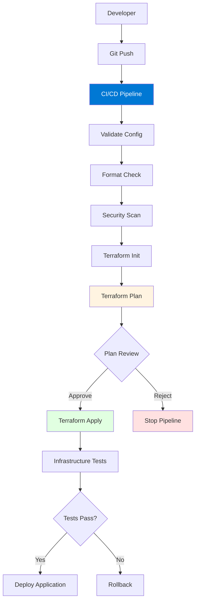
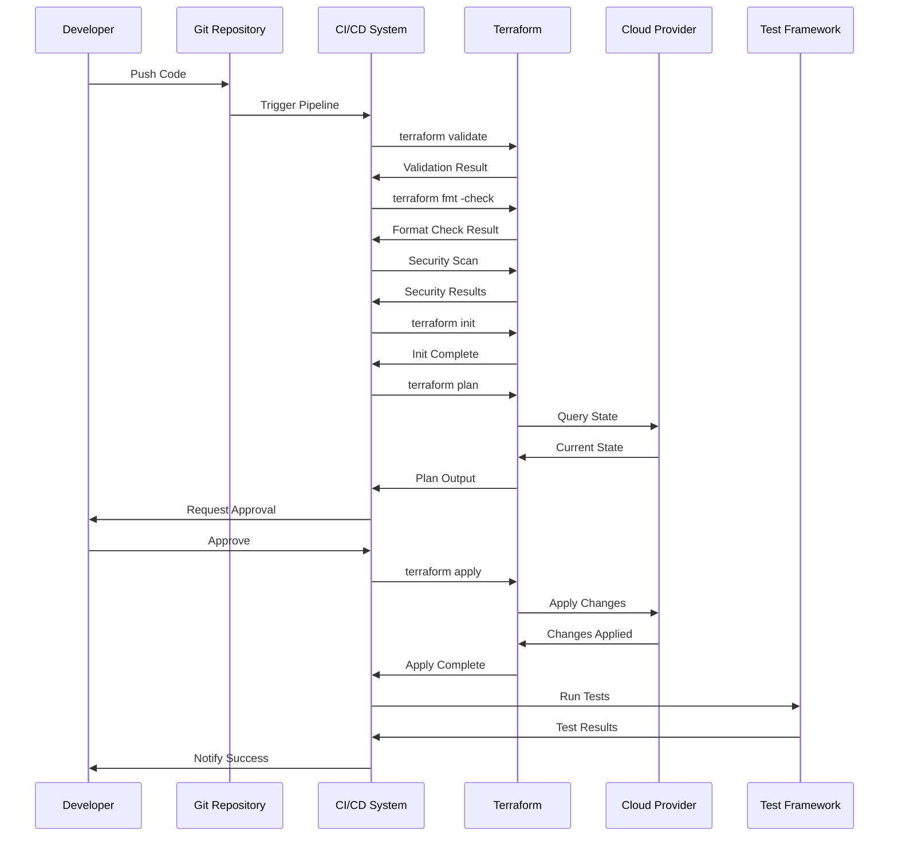

# Module 13: Terraform with CI/CD

## Table of Contents
- [13.1 Terraform in CI/CD Pipelines](#131-terraform-in-cicd-pipelines)
- [13.2 Azure DevOps Integration](#132-azure-devops-integration)
- [13.3 GitHub Actions Integration](#133-github-actions-integration)
- [13.4 Jenkins Integration](#134-jenkins-integration)
- [13.5 GitLab CI/CD Integration](#135-gitlab-cicd-integration)
- [13.6 CircleCI Integration](#136-circleci-integration)
- [13.7 AWS CodePipeline Integration](#137-aws-codepipeline-integration)
- [13.8 Advanced CI/CD Topics](#138-advanced-cicd-topics)
- [13.9 Troubleshooting CI/CD Issues](#139-troubleshooting-cicd-issues)
- [13.10 Migrating to CI/CD](#1310-migrating-to-cicd)
- [Quick Reference](#quick-reference)
- [Common Pitfalls](#common-pitfalls)
- [Best Practices](#best-practices)
- [Further Reading](#further-reading)

---

## 13.1 Terraform in CI/CD Pipelines

### Why Integrate Terraform with CI/CD?

Integrating Terraform with CI/CD pipelines automates infrastructure provisioning, updates, and management as part of your software delivery process. This integration brings infrastructure changes into the same automated workflow as application code, ensuring infrastructure evolves alongside applications in a controlled, auditable manner.

CI/CD integration provides numerous benefits: **automated validation** (catch errors before deployment), **consistent deployments** (same process every time), **audit trails** (who changed what, when), **faster delivery** (automated vs. manual), **risk reduction** (approval gates, testing), and **infrastructure as code** (treat infrastructure like application code). Understanding CI/CD integration helps you build reliable, automated infrastructure workflows.

#### CI/CD Pipeline Architecture



### Pipeline Stages

A typical Terraform CI/CD pipeline includes several stages:

**Validation Stage**: Validates Terraform configuration syntax and structure. Catches syntax errors, missing variables, and configuration issues early. Uses `terraform validate` and `terraform fmt -check`. Failing validation stops the pipeline immediately.

**Security Scanning Stage**: Scans Terraform code for security issues, misconfigurations, and compliance violations. Tools like `tfsec`, `checkov`, or `Terrascan` identify security risks before deployment. Security scans should fail the pipeline for critical issues.

**Initialization Stage**: Downloads providers and modules, initializes backend configuration. Uses `terraform init`. This stage ensures all dependencies are available before planning. Can cache providers and modules for faster subsequent runs.

**Planning Stage**: Generates execution plan showing what will change. Uses `terraform plan -out=tfplan`. Plan output is saved for review and later application. Plan stage is critical for understanding changes before they're applied.

**Review Stage**: Human review of the plan. Reviewers check changes, verify they're expected, and approve or reject. Can be automated for non-production environments. Production should always require manual approval.

**Application Stage**: Applies the approved plan. Uses `terraform apply tfplan`. This stage actually creates, updates, or destroys infrastructure. Should only run after approval and in appropriate environments.

**Testing Stage**: Validates deployed infrastructure. Tests connectivity, functionality, and configuration. Can include smoke tests, integration tests, or compliance checks. Failed tests may trigger rollback.

**Notification Stage**: Notifies team of pipeline results. Sends success/failure notifications via email, Slack, Teams, or other channels. Keeps team informed of infrastructure changes.

### Pipeline Best Practices

Best practices for Terraform CI/CD pipelines:

**Separate Plans and Applies**: Run plan on every commit, apply only on merge to main. This provides visibility into all changes while controlling when they're deployed.

**Use Plan Artifacts**: Save plan files as artifacts, use them for apply. This ensures apply uses the exact plan that was reviewed, preventing drift.

**Environment Separation**: Use different pipelines or stages for dev, staging, and production. Each environment should have appropriate approval gates and testing.

**State Management**: Use remote state backends (S3, Azure Storage, GCS) with proper locking. Never use local state in CI/CD pipelines.

**Secrets Management**: Store secrets in CI/CD secret stores (Azure Key Vault, AWS Secrets Manager, GitHub Secrets). Never hard-code secrets in pipeline files.

**Parallel Execution**: Run validation, formatting, and security scans in parallel for faster pipelines. Only plan and apply need to run sequentially.

**Rollback Strategy**: Have a plan for rolling back infrastructure changes. Can use Terraform to revert to previous state or have manual procedures.

### Pipeline Security Considerations

Security is critical in CI/CD pipelines:

**Credential Management**: Use service principals, IAM roles, or managed identities. Never store credentials in pipeline files or logs. Rotate credentials regularly.

**Least Privilege**: CI/CD service accounts should have minimum necessary permissions. Use separate accounts for different environments. Review permissions regularly.

**State File Security**: Encrypt state files at rest and in transit. Restrict access to state storage. Use state locking to prevent concurrent modifications.

**Approval Gates**: Require manual approval for production changes. Use different approvers for different types of changes. Log all approvals for audit.

**Audit Logging**: Log all pipeline executions, approvals, and changes. Export logs to SIEM systems. Retain logs per compliance requirements.

**Network Security**: Run pipelines in secure networks. Use private agents when possible. Restrict outbound network access.

### Pipeline Example Flow

Complete pipeline flow example:



## 13.2 Azure DevOps Integration

### Azure Pipelines Overview

Azure Pipelines provides native Terraform integration through marketplace tasks, making it easy to incorporate Terraform into your CI/CD workflows. Azure Pipelines is particularly well-suited for organizations already using Azure services, as it provides seamless integration with Azure resources, service connections, and Azure DevOps features like environments, approvals, and variable groups.

Azure Pipelines with Terraform offers: **native Terraform tasks** (TerraformInstaller, TerraformTask), **Azure integration** (service connections, managed identities), **state management** (Azure Storage backend), **approval gates** (environment approvals), **variable management** (variable groups, library variables), and **artifact management** (plan files as artifacts). Understanding Azure Pipelines integration helps you build robust Terraform workflows in Microsoft-centric environments.

### Terraform Tasks

Azure Pipelines provides two main Terraform tasks:

**TerraformInstaller@0**: Installs specified Terraform version on the agent. Ensures consistent Terraform versions across pipeline runs. Can install any Terraform version, allowing you to pin versions or use latest.

**TerraformTaskV4@4**: Executes Terraform commands (init, validate, plan, apply, destroy). Supports all Terraform operations with comprehensive configuration options. Handles backend configuration, variable passing, and output capture.

Task configuration example:
```yaml
# Install Terraform
- task: TerraformInstaller@0
  displayName: 'Install Terraform'
  inputs:
    terraformVersion: '1.6.0'

# Initialize Terraform
- task: TerraformTaskV4@4
  displayName: 'Terraform Init'
  inputs:
    provider: 'azurerm'
    command: 'init'
    backendServiceArm: 'Azure-ServiceConnection'
    backendAzureRmResourceGroupName: 'terraform-state-rg'
    backendAzureRmStorageAccountName: 'terraformstate'
    backendAzureRmContainerName: 'tfstate'
    backendAzureRmKey: 'prod.terraform.tfstate'
```

### Complete Azure Pipeline Example

Complete production-ready Azure Pipeline:

```yaml
trigger:
  branches:
    include:
    - main
    - develop
  paths:
    include:
    - terraform/*

variables:
  - group: terraform-variables
  - name: terraformVersion
    value: '1.6.0'
  - name: environment
    value: ${{ parameters.environment }}

stages:
- stage: Validate
  displayName: 'Validate Terraform'
  jobs:
  - job: Validate
    displayName: 'Validate Configuration'
    pool:
      vmImage: 'ubuntu-latest'
    steps:
    - task: TerraformInstaller@0
      displayName: 'Install Terraform'
      inputs:
        terraformVersion: $(terraformVersion)
    
    - task: TerraformTaskV4@4
      displayName: 'Terraform Validate'
      inputs:
        provider: 'azurerm'
        command: 'validate'
        workingDirectory: '$(System.DefaultWorkingDirectory)/terraform'
    
    - task: TerraformTaskV4@4
      displayName: 'Terraform Format Check'
      inputs:
        provider: 'azurerm'
        command: 'custom'
        customCommand: 'fmt -check -recursive'
        workingDirectory: '$(System.DefaultWorkingDirectory)/terraform'
    
    - task: TerraformTaskV4@4
      displayName: 'Security Scan'
      inputs:
        provider: 'azurerm'
        command: 'custom'
        customCommand: 'init'
        workingDirectory: '$(System.DefaultWorkingDirectory)/terraform'
      continueOnError: true
    
    - script: |
        # Run tfsec or checkov
        checkov -d $(System.DefaultWorkingDirectory)/terraform
      displayName: 'Security Scan'
      continueOnError: false

- stage: Plan
  displayName: 'Terraform Plan'
  dependsOn: Validate
  jobs:
  - job: Plan
    displayName: 'Generate Plan'
    pool:
      vmImage: 'ubuntu-latest'
    steps:
    - task: TerraformInstaller@0
      displayName: 'Install Terraform'
      inputs:
        terraformVersion: $(terraformVersion)
    
    - task: TerraformTaskV4@4
      displayName: 'Terraform Init'
      inputs:
        provider: 'azurerm'
        command: 'init'
        backendServiceArm: 'Azure-ServiceConnection'
        backendAzureRmResourceGroupName: 'terraform-state-rg'
        backendAzureRmStorageAccountName: 'terraformstate'
        backendAzureRmContainerName: 'tfstate'
        backendAzureRmKey: '$(environment).terraform.tfstate'
        workingDirectory: '$(System.DefaultWorkingDirectory)/terraform'
    
    - task: TerraformTaskV4@4
      displayName: 'Terraform Plan'
      inputs:
        provider: 'azurerm'
        command: 'plan'
        commandOptions: '-out=tfplan'
        environmentServiceNameAzureRM: 'Azure-ServiceConnection'
        workingDirectory: '$(System.DefaultWorkingDirectory)/terraform'
    
    - task: PublishBuildArtifacts@1
      displayName: 'Publish Plan'
      inputs:
        pathToPublish: '$(System.DefaultWorkingDirectory)/terraform/tfplan'
        artifactName: 'terraform-plan-$(Build.BuildId)'

- stage: Apply
  displayName: 'Terraform Apply'
  dependsOn: Plan
  condition: and(succeeded(), eq(variables['Build.SourceBranch'], 'refs/heads/main'))
  jobs:
  - deployment: Apply
    displayName: 'Apply Changes'
    pool:
      vmImage: 'ubuntu-latest'
    environment: 'Production'  # Requires approval
    strategy:
      runOnce:
        deploy:
          steps:
          - task: TerraformInstaller@0
            displayName: 'Install Terraform'
            inputs:
              terraformVersion: $(terraformVersion)
          
          - task: TerraformTaskV4@4
            displayName: 'Terraform Init'
            inputs:
              provider: 'azurerm'
              command: 'init'
              backendServiceArm: 'Azure-ServiceConnection'
              backendAzureRmResourceGroupName: 'terraform-state-rg'
              backendAzureRmStorageAccountName: 'terraformstate'
              backendAzureRmContainerName: 'tfstate'
              backendAzureRmKey: '$(environment).terraform.tfstate'
              workingDirectory: '$(System.DefaultWorkingDirectory)/terraform'
          
          - task: DownloadBuildArtifacts@0
            displayName: 'Download Plan'
            inputs:
              buildType: 'current'
              downloadType: 'specific'
              itemPattern: 'terraform-plan-*/tfplan'
              downloadPath: '$(System.DefaultWorkingDirectory)/terraform'
          
          - task: TerraformTaskV4@4
            displayName: 'Terraform Apply'
            inputs:
              provider: 'azurerm'
              command: 'apply'
              commandOptions: 'tfplan'
              environmentServiceNameAzureRM: 'Azure-ServiceConnection'
              workingDirectory: '$(System.DefaultWorkingDirectory)/terraform'
```

### Service Connections

Service connections authenticate Azure Pipelines to Azure:

**Service Principal**: Create service principal with appropriate permissions. Grant minimum necessary permissions (Contributor for resource management, Storage Blob Data Contributor for state). Use separate service principals for different environments.

**Managed Identity**: Use system-assigned or user-assigned managed identity when running on Azure-hosted agents. More secure than service principals, no credentials to manage.

Service connection setup:
1. Go to Project Settings → Service Connections
2. Create new Azure Resource Manager connection
3. Choose authentication method (Service Principal, Managed Identity)
4. Configure subscription and resource group access
5. Test connection
6. Use in Terraform tasks via `backendServiceArm` or `environmentServiceNameAzureRM`

### State Management in Azure Pipelines

State management best practices:

**Azure Storage Backend**: Use Azure Storage for state files. Configure backend in Terraform tasks. Enable versioning and soft delete for state files. Use separate storage accounts or containers per environment.

**State Locking**: Azure Storage backend provides automatic locking. Ensure proper permissions for state access. Use separate service connections with appropriate permissions.

**State Security**: Encrypt state files at rest (Azure Storage encryption). Restrict access to state storage. Use private endpoints for state access. Enable audit logging for state access.

### Variable Management

Azure Pipelines provides several variable management options:

**Variable Groups**: Store variables in variable groups, share across pipelines. Can link to Azure Key Vault for secrets. Useful for environment-specific variables.

**Library Variables**: Define variables in pipeline libraries. Can be scoped to specific pipelines or environments.

**Pipeline Variables**: Define variables in pipeline YAML. Good for pipeline-specific values.

**Secret Variables**: Mark variables as secret (hidden in logs). Use for credentials, API keys, passwords.

Variable group example:
```yaml
variables:
- group: terraform-common-vars
- group: terraform-prod-vars
- name: customVar
  value: 'value'
```

### Approval Gates

Azure DevOps environments provide approval gates:

**Environment Setup**: Create environments (Dev, Staging, Production) in Azure DevOps. Configure approval requirements per environment. Add approvers (users or groups).

**Approval Workflow**: When pipeline reaches environment stage, approvers are notified. Approvers review and approve/reject. Pipeline continues after approval.

**Multi-Stage Approvals**: Require multiple approvers for production. Sequential or parallel approvals. Timeout for approvals.

### Azure DevOps Best Practices

Best practices for Azure DevOps integration:

1. **Use Environments**: Create separate environments for dev, staging, prod
2. **Require Approvals**: Always require approvals for production
3. **Use Variable Groups**: Store variables in groups, link to Key Vault
4. **Separate Plans and Applies**: Plan on all branches, apply only on main
5. **Publish Plan Artifacts**: Save plan files, use for apply
6. **Use Service Connections**: Never hard-code credentials
7. **Enable Branch Policies**: Require PR reviews before merge
8. **Monitor Pipeline Runs**: Set up alerts for failures
9. **Use YAML Pipelines**: Version control pipeline definitions
10. **Test in Dev First**: Always test changes in dev before production

## 13.3 GitHub Actions Integration

### GitHub Actions Overview

GitHub Actions provides native CI/CD capabilities directly in GitHub repositories, making it an excellent choice for Terraform workflows when using GitHub for version control. GitHub Actions workflows are defined in YAML files stored in the repository, enabling version-controlled, collaborative CI/CD pipelines.

GitHub Actions with Terraform offers: **native GitHub integration** (triggers on push, PR, schedule), **Terraform setup action** (easy Terraform installation), **secrets management** (GitHub Secrets for credentials), **matrix builds** (test multiple Terraform versions), **workflow artifacts** (store plan files), and **PR comments** (automated plan output in PRs). Understanding GitHub Actions integration helps you build modern, cloud-native Terraform workflows.

### Terraform Setup Action

The `hashicorp/setup-terraform` action installs Terraform and configures the CLI:

**Features**: Installs specified Terraform version, configures Terraform Cloud/Enterprise CLI, sets up wrapper script for plan output, supports multiple Terraform versions via matrix.

Setup action example:
```yaml
- name: Setup Terraform
  uses: hashicorp/setup-terraform@v2
  with:
    terraform_version: 1.6.0
    terraform_wrapper: true  # Enables plan output in PR comments
```

### Complete GitHub Actions Workflow

Complete production-ready GitHub Actions workflow:

```yaml
name: 'Terraform'

on:
  push:
    branches:
      - main
      - develop
    paths:
      - 'terraform/**'
  pull_request:
    branches:
      - main
    paths:
      - 'terraform/**'
  workflow_dispatch:
    inputs:
      environment:
        description: 'Environment to deploy'
        required: true
        type: choice
        options:
          - dev
          - staging
          - prod

env:
  TF_VERSION: '1.6.0'
  AWS_REGION: 'us-west-2'

jobs:
  terraform-validate:
    name: 'Validate Terraform'
    runs-on: ubuntu-latest
    steps:
      - name: Checkout
        uses: actions/checkout@v4
      
      - name: Setup Terraform
        uses: hashicorp/setup-terraform@v2
        with:
          terraform_version: ${{ env.TF_VERSION }}
      
      - name: Terraform Format Check
        id: fmt
        run: terraform fmt -check -recursive
        working-directory: ./terraform
        continue-on-error: true
      
      - name: Terraform Init
        id: init
        run: terraform init
        working-directory: ./terraform
      
      - name: Terraform Validate
        id: validate
        run: terraform validate -no-color
        working-directory: ./terraform
      
      - name: Security Scan
        uses: aquasecurity/tfsec-action@v1.0.0
        with:
          working_directory: ./terraform
        continue-on-error: true
      
      - name: Checkov Scan
        uses: bridgecrewio/checkov-action@master
        with:
          directory: ./terraform
          framework: terraform
        continue-on-error: true

  terraform-plan:
    name: 'Terraform Plan'
    runs-on: ubuntu-latest
    needs: terraform-validate
    if: github.event_name == 'pull_request'
    defaults:
      run:
        working-directory: ./terraform
    steps:
      - name: Checkout
        uses: actions/checkout@v4
      
      - name: Setup Terraform
        uses: hashicorp/setup-terraform@v2
        with:
          terraform_version: ${{ env.TF_VERSION }}
          terraform_wrapper: true
      
      - name: Configure AWS Credentials
        uses: aws-actions/configure-aws-credentials@v4
        with:
          aws-access-key-id: ${{ secrets.AWS_ACCESS_KEY_ID }}
          aws-secret-access-key: ${{ secrets.AWS_SECRET_ACCESS_KEY }}
          aws-region: ${{ env.AWS_REGION }}
      
      - name: Terraform Init
        run: terraform init
      
      - name: Terraform Plan
        id: plan
        run: terraform plan -no-color -out=tfplan
        env:
          TF_VAR_environment: ${{ github.head_ref || 'dev' }}
        continue-on-error: true
      
      - name: Comment PR
        uses: actions/github-script@v7
        if: github.event_name == 'pull_request'
        env:
          PLAN: ${{ steps.plan.outputs.stdout }}
        with:
          github-token: ${{ secrets.GITHUB_TOKEN }}
          script: |
            const output = `#### Terraform Format and Style 🖌\`${{ steps.fmt.outcome }}\`
            #### Terraform Initialization ⚙️\`${{ steps.init.outcome }}\`
            #### Terraform Validation 🤖\`${{ steps.validate.outcome }}\`
            #### Terraform Plan 📖\`${{ steps.plan.outcome }}\`
            
            <details><summary>Show Plan</summary>
            
            \`\`\`terraform
            ${process.env.PLAN}
            \`\`\`
            
            </details>
            
            *Pusher: @${{ github.actor }}, Action: \`${{ github.event_name }}\`, Working Directory: \`terraform\`, Workflow: \`${{ github.workflow }}\`*`;
            
            github.rest.issues.createComment({
              issue_number: context.issue.number,
              owner: context.repo.owner,
              repo: context.repo.repo,
              body: output
            })
      
      - name: Upload Plan
        uses: actions/upload-artifact@v3
        if: steps.plan.outcome == 'success'
        with:
          name: terraform-plan
          path: ./terraform/tfplan

  terraform-apply:
    name: 'Terraform Apply'
    runs-on: ubuntu-latest
    needs: terraform-validate
    if: github.ref == 'refs/heads/main' && github.event_name == 'push'
    environment:
      name: ${{ github.event.inputs.environment || 'production' }}
    defaults:
      run:
        working-directory: ./terraform
    steps:
      - name: Checkout
        uses: actions/checkout@v4
      
      - name: Setup Terraform
        uses: hashicorp/setup-terraform@v2
        with:
          terraform_version: ${{ env.TF_VERSION }}
      
      - name: Configure AWS Credentials
        uses: aws-actions/configure-aws-credentials@v4
        with:
          aws-access-key-id: ${{ secrets.AWS_ACCESS_KEY_ID }}
          aws-secret-access-key: ${{ secrets.AWS_SECRET_ACCESS_KEY }}
          aws-region: ${{ env.AWS_REGION }}
      
      - name: Terraform Init
        run: terraform init
      
      - name: Terraform Plan
        run: terraform plan -no-color -out=tfplan
        env:
          TF_VAR_environment: ${{ github.event.inputs.environment || 'production' }}
      
      - name: Terraform Apply
        run: terraform apply -auto-approve -no-color tfplan
      
      - name: Terraform Output
        id: output
        run: terraform output -json > output.json
      
      - name: Upload Output
        uses: actions/upload-artifact@v3
        with:
          name: terraform-output
          path: ./terraform/output.json
```

### GitHub Secrets Management

GitHub Secrets store sensitive data securely:

**Secret Types**: Repository secrets (scoped to repository), environment secrets (scoped to environments), organization secrets (shared across repositories). Secrets are encrypted and never exposed in logs.

**Using Secrets**: Reference secrets in workflows via `${{ secrets.SECRET_NAME }}`. Secrets are masked in logs automatically. Never print secrets directly.

Secret management example:
```yaml
env:
  AWS_ACCESS_KEY_ID: ${{ secrets.AWS_ACCESS_KEY_ID }}
  AWS_SECRET_ACCESS_KEY: ${{ secrets.AWS_SECRET_ACCESS_KEY }}
  TF_VAR_db_password: ${{ secrets.DB_PASSWORD }}
```

### Pull Request Integration

GitHub Actions can comment on pull requests with plan output:

**Plan Comments**: Automatically post Terraform plan output as PR comments. Helps reviewers understand infrastructure changes. Can include formatted output, warnings, and errors.

**Status Checks**: Use status checks to require successful Terraform validation before merging. Prevents merging broken configurations. Can require specific checks to pass.

### GitHub Actions Best Practices

Best practices for GitHub Actions:

1. **Use Workflow Files**: Store workflows in `.github/workflows/`
2. **Pin Action Versions**: Use specific versions, not `@latest`
3. **Separate Jobs**: Separate validate, plan, and apply into different jobs
4. **Use Environments**: Create environments for approval gates
5. **Store Secrets Properly**: Use GitHub Secrets, never hard-code
6. **Cache Dependencies**: Cache Terraform providers for faster runs
7. **Matrix Testing**: Test with multiple Terraform versions
8. **Conditional Execution**: Only apply on main branch, plan on PRs
9. **Artifact Management**: Save plan files as artifacts
10. **Notifications**: Set up notifications for workflow failures

---

## 13.4 Jenkins Integration

### Jenkins Overview

Jenkins is a popular open-source automation server that provides extensive plugin ecosystem and flexibility for building custom CI/CD pipelines. Jenkins is particularly useful for organizations with existing Jenkins infrastructure or those needing highly customized workflows.

Jenkins with Terraform offers: **flexible pipelines** (Declarative or Scripted), **extensive plugins** (Terraform plugin, credentials plugin), **self-hosted agents** (full control over execution environment), **custom workflows** (complex approval processes), and **integration** (with many tools and services). Understanding Jenkins integration helps you leverage existing Jenkins infrastructure for Terraform workflows.

### Terraform Plugin

The Terraform plugin simplifies Terraform operations in Jenkins:

**Features**: Installs Terraform automatically, executes Terraform commands, manages Terraform versions, integrates with credentials, provides build steps.

Plugin installation:
1. Go to Jenkins → Manage Jenkins → Manage Plugins
2. Search for "Terraform"
3. Install "HashiCorp Terraform Plugin"
4. Restart Jenkins

### Complete Jenkinsfile Example

Complete production-ready Jenkinsfile:

```groovy
pipeline {
    agent any
    
    options {
        timestamps()
        ansiColor('xterm')
        timeout(time: 1, unit: 'HOURS')
    }
    
    environment {
        TF_VERSION = '1.6.0'
        AWS_REGION = 'us-west-2'
        ENVIRONMENT = "${params.ENVIRONMENT ?: 'dev'}"
    }
    
    parameters {
        choice(
            name: 'ENVIRONMENT',
            choices: ['dev', 'staging', 'prod'],
            description: 'Target environment'
        )
        choice(
            name: 'ACTION',
            choices: ['plan', 'apply', 'destroy'],
            description: 'Terraform action to perform'
        )
        booleanParam(
            name: 'AUTO_APPROVE',
            defaultValue: false,
            description: 'Auto-approve apply (dev only)'
        )
    }
    
    stages {
        stage('Checkout') {
            steps {
                checkout scm
                script {
                    env.GIT_COMMIT_SHORT = sh(
                        script: 'git rev-parse --short HEAD',
                        returnStdout: true
                    ).trim()
                }
            }
        }
        
        stage('Validate') {
            steps {
                script {
                    def tf = tool name: 'Terraform', type: 'com.cloudbees.jenkins.plugins.customtools.CustomTool'
                    env.PATH = "${tf}/bin:${env.PATH}"
                }
                
                dir('terraform') {
                    sh '''
                        terraform version
                        terraform fmt -check -recursive || exit 1
                        terraform init -backend=false
                        terraform validate
                    '''
                }
            }
        }
        
        stage('Security Scan') {
            steps {
                dir('terraform') {
                    script {
                        // Install tfsec if not available
                        sh '''
                            if ! command -v tfsec &> /dev/null; then
                                curl -s https://raw.githubusercontent.com/aquasecurity/tfsec/master/scripts/install_linux.sh | bash
                            fi
                            tfsec .
                        '''
                    }
                }
            }
        }
        
        stage('Terraform Init') {
            steps {
                dir('terraform') {
                    withCredentials([
                        aws(
                            credentialsId: 'aws-credentials',
                            accessKeyVariable: 'AWS_ACCESS_KEY_ID',
                            secretKeyVariable: 'AWS_SECRET_ACCESS_KEY'
                        )
                    ]) {
                        sh '''
                            terraform init \
                                -backend-config="bucket=terraform-state-bucket" \
                                -backend-config="key=${ENVIRONMENT}/terraform.tfstate" \
                                -backend-config="region=${AWS_REGION}"
                        '''
                    }
                }
            }
        }
        
        stage('Terraform Plan') {
            when {
                anyOf {
                    params.ACTION == 'plan'
                    params.ACTION == 'apply'
                }
            }
            steps {
                dir('terraform') {
                    withCredentials([
                        aws(
                            credentialsId: 'aws-credentials',
                            accessKeyVariable: 'AWS_ACCESS_KEY_ID',
                            secretKeyVariable: 'AWS_SECRET_ACCESS_KEY'
                        )
                    ]) {
                        sh '''
                            terraform plan \
                                -out=tfplan \
                                -var="environment=${ENVIRONMENT}" \
                                -var-file="environments/${ENVIRONMENT}.tfvars"
                        '''
                    }
                }
            }
        }
        
        stage('Save Plan') {
            when {
                anyOf {
                    params.ACTION == 'plan'
                    params.ACTION == 'apply'
                }
            }
            steps {
                archiveArtifacts artifacts: 'terraform/tfplan', fingerprint: true
            }
        }
        
        stage('Approval') {
            when {
                allOf {
                    params.ACTION == 'apply'
                    params.ENVIRONMENT == 'prod'
                    params.AUTO_APPROVE == false
                }
            }
            steps {
                script {
                    def approvers = input(
                        message: 'Approve Terraform apply to production?',
                        parameters: [
                            text(
                                name: 'Approver',
                                description: 'Your name',
                                defaultValue: env.USER
                            ),
                            text(
                                name: 'Reason',
                                description: 'Reason for deployment'
                            )
                        ],
                        submitterParameter: 'submitter'
                    )
                    echo "Approved by: ${approvers}"
                }
            }
        }
        
        stage('Terraform Apply') {
            when {
                allOf {
                    params.ACTION == 'apply'
                    anyOf {
                        params.AUTO_APPROVE == true
                        params.ENVIRONMENT != 'prod'
                        params.ENVIRONMENT == 'prod'
                    }
                }
            }
            steps {
                dir('terraform') {
                    withCredentials([
                        aws(
                            credentialsId: 'aws-credentials',
                            accessKeyVariable: 'AWS_ACCESS_KEY_ID',
                            secretKeyVariable: 'AWS_SECRET_ACCESS_KEY'
                        )
                    ]) {
                        sh 'terraform apply -auto-approve tfplan'
                    }
                }
            }
        }
        
        stage('Terraform Destroy') {
            when {
                params.ACTION == 'destroy'
            }
            steps {
                script {
                    if (params.ENVIRONMENT == 'prod') {
                        error('Cannot destroy production environment!')
                    }
                }
                dir('terraform') {
                    withCredentials([
                        aws(
                            credentialsId: 'aws-credentials',
                            accessKeyVariable: 'AWS_ACCESS_KEY_ID',
                            secretKeyVariable: 'AWS_SECRET_ACCESS_KEY'
                        )
                    ]) {
                        input message: "Are you sure you want to destroy ${params.ENVIRONMENT}?"
                        sh '''
                            terraform destroy \
                                -var="environment=${ENVIRONMENT}" \
                                -var-file="environments/${ENVIRONMENT}.tfvars" \
                                -auto-approve
                        '''
                    }
                }
            }
        }
        
        stage('Infrastructure Tests') {
            when {
                params.ACTION == 'apply'
            }
            steps {
                script {
                    // Run infrastructure tests
                    sh '''
                        # Example: Test connectivity
                        # curl -f https://${ENVIRONMENT}.example.com/health || exit 1
                        echo "Infrastructure tests passed"
                    '''
                }
            }
        }
    }
    
    post {
        always {
            dir('terraform') {
                sh 'terraform version'
            }
            cleanWs()
        }
        success {
            emailext(
                subject: "Terraform ${params.ACTION} succeeded: ${env.JOB_NAME} #${env.BUILD_NUMBER}",
                body: "Terraform ${params.ACTION} completed successfully for ${params.ENVIRONMENT} environment.",
                to: "${env.CHANGE_AUTHOR_EMAIL ?: 'devops@example.com'}"
            )
        }
        failure {
            emailext(
                subject: "Terraform ${params.ACTION} failed: ${env.JOB_NAME} #${env.BUILD_NUMBER}",
                body: "Terraform ${params.ACTION} failed for ${params.ENVIRONMENT} environment. Check Jenkins for details.",
                to: "${env.CHANGE_AUTHOR_EMAIL ?: 'devops@example.com'}"
            )
        }
    }
}
```

### Jenkins Credentials Management

Jenkins credentials plugin manages secrets:

**Credential Types**: Username/password, secret text, secret file, SSH keys, certificates. Credentials are encrypted and stored securely.

**Using Credentials**: Reference credentials in pipelines via `withCredentials` block. Credentials are masked in console output.

Credential example:
```groovy
withCredentials([
    aws(
        credentialsId: 'aws-credentials',
        accessKeyVariable: 'AWS_ACCESS_KEY_ID',
        secretKeyVariable: 'AWS_SECRET_ACCESS_KEY'
    ),
    string(
        credentialsId: 'db-password',
        variable: 'TF_VAR_db_password'
    )
]) {
    sh 'terraform apply'
}
```

### Jenkins Best Practices

Best practices for Jenkins integration:

1. **Use Declarative Pipelines**: Prefer declarative over scripted for readability
2. **Manage Credentials Properly**: Use credentials plugin, never hard-code
3. **Use Parameters**: Make pipelines configurable via parameters
4. **Add Approval Gates**: Require approvals for production
5. **Archive Artifacts**: Save plan files and outputs
6. **Clean Workspace**: Clean workspace after builds
7. **Set Timeouts**: Prevent hanging builds
8. **Use Notifications**: Email/Slack notifications for results
9. **Version Control**: Store Jenkinsfiles in Git
10. **Test Pipelines**: Test pipeline changes in dev first

---

## 13.5 GitLab CI/CD Integration

### GitLab CI/CD Overview

GitLab CI/CD provides built-in continuous integration and deployment capabilities directly within GitLab repositories. GitLab CI/CD uses a `.gitlab-ci.yml` file to define pipelines, making it easy to version control your CI/CD configuration alongside your Terraform code.

GitLab CI/CD with Terraform offers: **native GitLab integration** (triggers on push, merge requests, schedules), **Docker-based runners** (consistent execution environments), **variables and secrets** (CI/CD variables, masked variables), **artifacts management** (store plan files), **merge request integration** (plan output in MRs), and **multi-stage pipelines** (validate, plan, apply stages). Understanding GitLab CI/CD integration helps you leverage GitLab's comprehensive DevOps platform for Terraform workflows.

### GitLab CI/CD Configuration

GitLab CI/CD pipelines are defined in `.gitlab-ci.yml`:

**Pipeline Structure**: Define stages, jobs, and execution rules. Jobs run in parallel within stages, stages run sequentially. Use `only`/`except` or `rules` to control when jobs run.

**Runners**: GitLab runners execute jobs. Can use shared runners (GitLab.com) or self-hosted runners. Configure runners with appropriate tools and permissions.

### Complete GitLab CI/CD Pipeline Example

Complete production-ready GitLab CI/CD pipeline:

```yaml
stages:
  - validate
  - plan
  - apply
  - destroy

variables:
  TF_VERSION: "1.6.0"
  TF_ROOT: "${CI_PROJECT_DIR}/terraform"
  TF_ADDRESS: "${CI_API_V4_URL}/projects/${CI_PROJECT_ID}/terraform/state/${CI_COMMIT_REF_NAME}"

cache:
  key: "${CI_COMMIT_REF_SLUG}"
  paths:
    - .terraform

before_script:
  - cd ${TF_ROOT}
  - terraform --version
  - terraform init -backend-config="address=${TF_ADDRESS}" -backend-config="lock_address=${TF_ADDRESS}/lock" -backend-config="unlock_address=${TF_ADDRESS}/lock" -backend-config="username=${CI_PROJECT_ID}" -backend-config="password=${CI_JOB_TOKEN}" -backend-config="lock_method=POST" -backend-config="unlock_method=DELETE" -backend-config="retry_wait_min=5"

validate:
  stage: validate
  image: hashicorp/terraform:${TF_VERSION}
  script:
    - terraform fmt -check -recursive
    - terraform init -backend=false
    - terraform validate
  only:
    - merge_requests
    - main
    - develop

security-scan:
  stage: validate
  image: aquasec/tfsec:latest
  script:
    - tfsec ${TF_ROOT}
  allow_failure: true
  only:
    - merge_requests
    - main
    - develop

plan:
  stage: plan
  image: hashicorp/terraform:${TF_VERSION}
  script:
    - terraform plan -out=tfplan -var="environment=${CI_COMMIT_REF_NAME}"
    - terraform show -json tfplan -no-color > tfplan.json
  artifacts:
    name: plan
    paths:
      - ${TF_ROOT}/tfplan
      - ${TF_ROOT}/tfplan.json
    reports:
      terraform: ${TF_ROOT}/tfplan.json
  only:
    - merge_requests
    - main
    - develop

plan-destroy:
  stage: plan
  image: hashicorp/terraform:${TF_VERSION}
  script:
    - terraform plan -destroy -out=tfdestroyplan
  artifacts:
    name: destroy-plan
    paths:
      - ${TF_ROOT}/tfdestroyplan
  when: manual
  only:
    - main
  except:
    - tags

apply:
  stage: apply
  image: hashicorp/terraform:${TF_VERSION}
  dependencies:
    - plan
  script:
    - terraform apply -auto-approve tfplan
  environment:
    name: ${CI_COMMIT_REF_NAME}
    action: start
  when: manual
  only:
    - main
  except:
    - tags

destroy:
  stage: destroy
  image: hashicorp/terraform:${TF_VERSION}
  dependencies:
    - plan-destroy
  script:
    - terraform apply -auto-approve tfdestroyplan
  environment:
    name: ${CI_COMMIT_REF_NAME}
    action: stop
  when: manual
  only:
    - main
  except:
    - tags
```

### GitLab Variables and Secrets

GitLab provides multiple ways to manage variables:

**CI/CD Variables**: Project-level or group-level variables. Can be protected (only available to protected branches) or masked (hidden in logs). Use for non-sensitive configuration.

**Variable Scopes**: Variables can be scoped to environments, jobs, or pipelines. Use environment-specific variables for different deployment targets.

**Secrets Management**: Store sensitive data in CI/CD variables marked as "masked" and "protected". For advanced secrets, integrate with external secret managers (HashiCorp Vault, AWS Secrets Manager).

Variable example:
```yaml
variables:
  TF_VAR_region: "${CI_REGISTRY_IMAGE}"
  TF_VAR_environment: "${CI_COMMIT_REF_NAME}"
  AWS_ACCESS_KEY_ID: "${AWS_ACCESS_KEY_ID}"  # From CI/CD variables
  AWS_SECRET_ACCESS_KEY: "${AWS_SECRET_ACCESS_KEY}"  # Masked variable
```

### GitLab Terraform State Backend

GitLab provides a Terraform state backend:

**GitLab Backend**: Store Terraform state in GitLab. Provides versioning, locking, and access control. Configure via backend configuration in Terraform.

**Backend Configuration**: Use GitLab's HTTP backend. Configure address, lock address, username (project ID), password (CI job token), and lock methods.

Backend configuration example:
```hcl
terraform {
  backend "http" {
    address        = "https://gitlab.com/api/v4/projects/PROJECT_ID/terraform/state/ENVIRONMENT"
    lock_address   = "https://gitlab.com/api/v4/projects/PROJECT_ID/terraform/state/ENVIRONMENT/lock"
    unlock_address = "https://gitlab.com/api/v4/projects/PROJECT_ID/terraform/state/ENVIRONMENT/lock"
    username       = "PROJECT_ID"
    password       = "CI_JOB_TOKEN"
    lock_method    = "POST"
    unlock_method  = "DELETE"
    retry_wait_min = 5
  }
}
```

### Merge Request Integration

GitLab CI/CD integrates with merge requests:

**Plan Output**: Terraform plan output appears in merge request discussions. Use `reports.terraform` to show plan in MR UI. Helps reviewers understand infrastructure changes.

**Status Checks**: Pipeline status appears in merge requests. Require successful validation before merging. Use branch protection rules to enforce.

**Approval Workflows**: Use GitLab's approval rules for production deployments. Require approvals from specific users or groups. Can require multiple approvals.

### GitLab CI/CD Best Practices

Best practices for GitLab CI/CD:

1. **Use GitLab Backend**: Store state in GitLab for integrated state management
2. **Cache Dependencies**: Cache `.terraform` directory for faster runs
3. **Use Artifacts**: Save plan files as artifacts, use in apply jobs
4. **Environment Management**: Use GitLab environments for deployment tracking
5. **Manual Apply**: Always require manual approval for apply jobs
6. **Separate Stages**: Separate validate, plan, and apply into different stages
7. **Use Rules**: Use `rules` instead of `only`/`except` for better control
8. **Protect Variables**: Mark sensitive variables as protected and masked
9. **Use Tags**: Tag runners for specific environments or tools
10. **Monitor Pipelines**: Set up notifications for pipeline failures

---

## 13.6 CircleCI Integration

### CircleCI Overview

CircleCI is a popular cloud-based CI/CD platform that provides flexible configuration options and excellent Docker support. CircleCI offers both cloud-hosted and self-hosted options, making it suitable for organizations with various compliance and security requirements.

CircleCI with Terraform offers: **flexible configuration** (YAML-based config), **Docker support** (consistent execution environments), **orbs** (reusable configuration packages), **workflows** (complex pipeline orchestration), **parallelism** (run jobs in parallel), and **caching** (optimize build times). Understanding CircleCI integration helps you leverage a modern, scalable CI/CD platform for Terraform workflows.

### CircleCI Configuration

CircleCI pipelines are defined in `.circleci/config.yml`:

**Configuration Structure**: Define workflows, jobs, and steps. Workflows orchestrate job execution. Jobs define what runs. Steps define commands to execute.

**Orbs**: Reusable configuration packages. Use Terraform orb for simplified Terraform operations. Can create custom orbs for organization-specific patterns.

### Complete CircleCI Pipeline Example

Complete production-ready CircleCI configuration:

```yaml
version: 2.1

orbs:
  terraform: circleci/terraform@3.0.0
  aws-cli: circleci/aws-cli@3.0.0

workflows:
  terraform:
    jobs:
      - terraform/validate:
          terraform-version: "1.6.0"
          path: ./terraform
          filters:
            branches:
              only:
                - main
                - develop
      
      - terraform/plan:
          terraform-version: "1.6.0"
          path: ./terraform
          workspace: default
          var-file: terraform.tfvars
          filters:
            branches:
              only:
                - main
                - develop
      
      - terraform/apply:
          terraform-version: "1.6.0"
          path: ./terraform
          workspace: default
          requires:
            - terraform/plan
          filters:
            branches:
              only: main
          context: production-approval

jobs:
  terraform-validate:
    docker:
      - image: hashicorp/terraform:1.6.0
    steps:
      - checkout
      - run:
          name: Terraform Format Check
          command: |
            cd terraform
            terraform fmt -check -recursive
      - run:
          name: Terraform Init
          command: |
            cd terraform
            terraform init -backend=false
      - run:
          name: Terraform Validate
          command: |
            cd terraform
            terraform validate

  terraform-security-scan:
    docker:
      - image: aquasec/tfsec:latest
    steps:
      - checkout
      - run:
          name: Security Scan
          command: |
            tfsec ./terraform

  terraform-plan:
    docker:
      - image: hashicorp/terraform:1.6.0
    environment:
      TF_VAR_environment: << pipeline.git.branch >>
    steps:
      - checkout
      - aws-cli/setup:
          aws-access-key-id: AWS_ACCESS_KEY_ID
          aws-secret-access-key: AWS_SECRET_ACCESS_KEY
          aws-region: us-west-2
      - run:
          name: Terraform Init
          command: |
            cd terraform
            terraform init \
              -backend-config="bucket=terraform-state" \
              -backend-config="key=<< pipeline.git.branch >>/terraform.tfstate" \
              -backend-config="region=us-west-2"
      - run:
          name: Terraform Plan
          command: |
            cd terraform
            terraform plan -out=tfplan
      - persist_to_workspace:
          root: terraform
          paths:
            - tfplan

  terraform-apply:
    docker:
      - image: hashicorp/terraform:1.6.0
    environment:
      TF_VAR_environment: production
    steps:
      - checkout
      - aws-cli/setup:
          aws-access-key-id: AWS_ACCESS_KEY_ID
          aws-secret-access-key: AWS_SECRET_ACCESS_KEY
          aws-region: us-west-2
      - attach_workspace:
          at: terraform
      - run:
          name: Terraform Init
          command: |
            cd terraform
            terraform init \
              -backend-config="bucket=terraform-state" \
              -backend-config="key=production/terraform.tfstate" \
              -backend-config="region=us-west-2"
      - run:
          name: Terraform Apply
          command: |
            cd terraform
            terraform apply -auto-approve tfplan
```

### CircleCI Contexts and Secrets

CircleCI provides contexts for managing secrets:

**Contexts**: Group environment variables and secrets. Share across projects. Use different contexts for different environments. Access controlled via teams.

**Environment Variables**: Set at project or context level. Can be masked (hidden in logs). Use for non-sensitive configuration.

**Secrets Management**: Store secrets in contexts. Integrate with external secret managers (AWS Secrets Manager, HashiCorp Vault) for advanced use cases.

Context example:
```yaml
jobs:
  deploy:
    steps:
      - run: terraform apply
    context: production-secrets  # Contains AWS credentials, etc.
```

### CircleCI Workflows

CircleCI workflows orchestrate job execution:

**Sequential Workflows**: Jobs run one after another. Use `requires` to define dependencies. Good for validate → plan → apply flow.

**Parallel Workflows**: Run multiple jobs simultaneously. Use for validation, security scanning, and formatting. Speeds up pipelines.

**Conditional Workflows**: Run jobs conditionally. Use filters or conditions. Only apply on main branch, plan on all branches.

**Manual Approval**: Use `hold` job for manual approval. Pauses workflow until approved. Good for production deployments.

Workflow example:
```yaml
workflows:
  terraform:
    jobs:
      - validate
      - security-scan
      - plan:
          requires:
            - validate
            - security-scan
      - hold-production:
          type: approval
          requires:
            - plan
          filters:
            branches:
              only: main
      - apply:
          requires:
            - hold-production
          filters:
            branches:
              only: main
```

### CircleCI Caching

CircleCI provides caching for performance:

**Dependency Caching**: Cache Terraform providers and modules. Use `save_cache` and `restore_cache` steps. Significantly reduces init time.

**Workspace Persistence**: Use workspaces to share files between jobs. Save plan files in plan job, restore in apply job. Ensures same plan is applied.

Caching example:
```yaml
steps:
  - restore_cache:
      keys:
        - terraform-{{ checksum "terraform/main.tf" }}
  - run: terraform init
  - save_cache:
      paths:
        - .terraform
      key: terraform-{{ checksum "terraform/main.tf" }}
```

### CircleCI Best Practices

Best practices for CircleCI:

1. **Use Orbs**: Leverage Terraform orb for common operations
2. **Use Contexts**: Store secrets in contexts, not in config
3. **Cache Dependencies**: Cache Terraform providers and modules
4. **Use Workflows**: Separate validate, plan, and apply into workflows
5. **Parallel Execution**: Run validation and scanning in parallel
6. **Manual Approval**: Require approval for production applies
7. **Use Workspaces**: Share plan files between jobs via workspaces
8. **Filter Branches**: Only apply on main branch
9. **Monitor Pipelines**: Set up notifications for failures
10. **Version Terraform**: Pin Terraform version for consistency

---

## 13.7 AWS CodePipeline Integration

### AWS CodePipeline Overview

AWS CodePipeline is a fully managed continuous delivery service that integrates seamlessly with other AWS services. CodePipeline is ideal for organizations heavily invested in AWS, providing native integration with AWS services, IAM roles, and AWS-native secret management.

AWS CodePipeline with Terraform offers: **native AWS integration** (IAM roles, service integrations), **CodeBuild integration** (build and test Terraform), **artifact management** (S3 artifact storage), **approval actions** (manual approvals), **event-driven triggers** (CloudWatch Events), and **multi-region support** (deploy across regions). Understanding AWS CodePipeline integration helps you build AWS-native Terraform CI/CD workflows.

### CodePipeline Architecture

CodePipeline consists of:

**Pipeline**: Defines the workflow. Contains stages and actions. Triggered by source changes or events.

**Stages**: Logical divisions (Source, Build, Deploy). Run sequentially. Can have approval actions.

**Actions**: Tasks within stages (Source, Build, Test, Deploy, Approve). Run in parallel within stages.

**Artifacts**: Files passed between stages. Stored in S3. Plan files stored as artifacts.

### Complete CodePipeline Example

Complete production-ready CodePipeline configuration:

```json
{
  "pipeline": {
    "name": "terraform-pipeline",
    "roleArn": "arn:aws:iam::ACCOUNT_ID:role/CodePipelineServiceRole",
    "artifactStore": {
      "type": "S3",
      "location": "terraform-pipeline-artifacts"
    },
    "stages": [
      {
        "name": "Source",
        "actions": [
          {
            "name": "SourceAction",
            "actionTypeId": {
              "category": "Source",
              "owner": "AWS",
              "provider": "CodeCommit",
              "version": "1"
            },
            "outputArtifacts": [
              {
                "name": "SourceOutput"
              }
            ],
            "configuration": {
              "RepositoryName": "terraform-repo",
              "BranchName": "main"
            }
          }
        ]
      },
      {
        "name": "Validate",
        "actions": [
          {
            "name": "TerraformValidate",
            "actionTypeId": {
              "category": "Build",
              "owner": "AWS",
              "provider": "CodeBuild",
              "version": "1"
            },
            "inputArtifacts": [
              {
                "name": "SourceOutput"
              }
            ],
            "outputArtifacts": [
              {
                "name": "ValidateOutput"
              }
            ],
            "configuration": {
              "ProjectName": "terraform-validate"
            }
          }
        ]
      },
      {
        "name": "Plan",
        "actions": [
          {
            "name": "TerraformPlan",
            "actionTypeId": {
              "category": "Build",
              "owner": "AWS",
              "provider": "CodeBuild",
              "version": "1"
            },
            "inputArtifacts": [
              {
                "name": "SourceOutput"
              }
            ],
            "outputArtifacts": [
              {
                "name": "PlanOutput"
              }
            ],
            "configuration": {
              "ProjectName": "terraform-plan"
            }
          }
        ]
      },
      {
        "name": "Approval",
        "actions": [
          {
            "name": "ManualApproval",
            "actionTypeId": {
              "category": "Approval",
              "owner": "AWS",
              "provider": "Manual",
              "version": "1"
            },
            "configuration": {
              "CustomData": "Review Terraform plan before applying to production"
            }
          }
        ]
      },
      {
        "name": "Apply",
        "actions": [
          {
            "name": "TerraformApply",
            "actionTypeId": {
              "category": "Build",
              "owner": "AWS",
              "provider": "CodeBuild",
              "version": "1"
            },
            "inputArtifacts": [
              {
                "name": "SourceOutput"
              },
              {
                "name": "PlanOutput"
              }
            ],
            "configuration": {
              "ProjectName": "terraform-apply"
            }
          }
        ]
      }
    ]
  }
}
```

### CodeBuild Configuration

CodeBuild projects execute Terraform commands:

**Buildspec**: YAML file defining build steps. Similar to CI/CD pipeline configuration. Stored in repository or CodeBuild project.

**Environment**: Docker image or managed image. Use Terraform Docker image. Configure environment variables and secrets.

**IAM Role**: CodeBuild execution role. Needs permissions for Terraform operations. Use least privilege principle.

Buildspec example (`buildspec.yml`):
```yaml
version: 0.2

phases:
  pre_build:
    commands:
      - echo "Installing Terraform"
      - wget https://releases.hashicorp.com/terraform/1.6.0/terraform_1.6.0_linux_amd64.zip
      - unzip terraform_1.6.0_linux_amd64.zip
      - mv terraform /usr/local/bin/
      - terraform version
  build:
    commands:
      - echo "Terraform Init"
      - cd terraform
      - terraform init \
          -backend-config="bucket=${TERRAFORM_STATE_BUCKET}" \
          -backend-config="key=${ENVIRONMENT}/terraform.tfstate" \
          -backend-config="region=${AWS_REGION}"
      - echo "Terraform Plan"
      - terraform plan -out=tfplan
  post_build:
    commands:
      - echo "Saving plan file"
artifacts:
  files:
    - terraform/tfplan
```

### IAM Roles and Permissions

CodePipeline and CodeBuild require IAM roles:

**Pipeline Service Role**: Allows CodePipeline to manage pipeline execution. Needs permissions to start CodeBuild, invoke Lambda, access S3 artifacts.

**CodeBuild Service Role**: Allows CodeBuild to execute builds. Needs permissions for Terraform operations (EC2, S3, IAM, etc.). Use separate roles per environment.

**Least Privilege**: Grant minimum necessary permissions. Review permissions regularly. Use IAM policy conditions for additional security.

IAM policy example:
```json
{
  "Version": "2012-10-17",
  "Statement": [
    {
      "Effect": "Allow",
      "Action": [
        "ec2:*",
        "s3:*",
        "iam:CreateRole",
        "iam:AttachRolePolicy"
      ],
      "Resource": "*",
      "Condition": {
        "StringEquals": {
          "aws:RequestedRegion": "us-west-2"
        }
      }
    }
  ]
}
```

### State Management with S3

Use S3 for Terraform state storage:

**S3 Backend**: Configure Terraform to use S3 backend. Enable versioning and encryption. Use separate buckets or prefixes per environment.

**DynamoDB Locking**: Use DynamoDB table for state locking. Prevents concurrent modifications. Configure in backend configuration.

**State Security**: Encrypt state files at rest (S3 encryption). Use bucket policies to restrict access. Enable access logging.

Backend configuration:
```hcl
terraform {
  backend "s3" {
    bucket         = "terraform-state-bucket"
    key            = "production/terraform.tfstate"
    region         = "us-west-2"
    encrypt        = true
    dynamodb_table = "terraform-state-lock"
  }
}
```

### CodePipeline Best Practices

Best practices for AWS CodePipeline:

1. **Use CodeBuild**: Leverage CodeBuild for Terraform execution
2. **Separate Projects**: Use separate CodeBuild projects per stage
3. **IAM Roles**: Use separate IAM roles per environment
4. **State in S3**: Store state in S3 with DynamoDB locking
5. **Manual Approval**: Require approval for production
6. **Artifact Management**: Store plan files as artifacts
7. **Environment Variables**: Use CodeBuild environment variables
8. **Secrets in Secrets Manager**: Store secrets in AWS Secrets Manager
9. **CloudWatch Logs**: Enable CloudWatch logs for debugging
10. **Pipeline Notifications**: Set up SNS notifications for failures

---

## 13.8 Advanced CI/CD Topics

### Terraform Cloud/Enterprise Integration

Terraform Cloud and Terraform Enterprise provide native CI/CD integration:

**Remote Execution**: Run Terraform in Terraform Cloud instead of CI/CD agents. Provides consistent execution environment, state management, and collaboration features.

**API-Driven Workflow**: Use Terraform Cloud API to trigger runs, check status, and retrieve outputs. CI/CD pipeline triggers Terraform Cloud runs rather than executing Terraform directly.

**Workspace Management**: Create workspaces per environment or application. Use workspace variables for configuration. Trigger runs via API or VCS integration.

Terraform Cloud integration example:
```yaml
# GitHub Actions example
- name: Trigger Terraform Cloud Run
  uses: hashicorp/terraform-cloud-action@v1
  with:
    organization: 'my-org'
    workspace: 'production'
    token: ${{ secrets.TF_CLOUD_TOKEN }}
    action: 'plan'
```

### Multi-Environment Strategies

Managing multiple environments in CI/CD:

**Branch-Based**: Each branch maps to an environment (main → prod, develop → staging). Simple but can cause drift. Use feature flags or variables to control behavior.

**Path-Based**: Different Terraform directories per environment. Separate state files. More isolation but more duplication. Use modules to reduce duplication.

**Workspace-Based**: Use Terraform workspaces for environments. Single codebase, multiple state files. Good for similar environments. Can be confusing with complex configurations.

**Variable-Based**: Use variables to configure environments. Single codebase and state. Flexible but requires careful variable management. Use variable files per environment.

### Infrastructure Testing in CI/CD

Testing infrastructure in pipelines:

**Validation Tests**: Run `terraform validate` and `terraform fmt -check`. Catches syntax errors early. Should always pass before planning.

**Security Scanning**: Use tools like `tfsec`, `checkov`, or `Terrascan`. Scan for security misconfigurations. Fail pipeline on critical findings.

**Cost Estimation**: Use `infracost` to estimate infrastructure costs. Show cost impact in PR comments. Helps with budget planning.

**Compliance Checks**: Use `opa` (Open Policy Agent) for policy compliance. Enforce organizational policies. Fail pipeline on violations.

**Smoke Tests**: After apply, run basic connectivity tests. Verify infrastructure is accessible. Can use simple HTTP checks or Terraform outputs.

Testing example:
```yaml
- name: Cost Estimation
  uses: infracost/actions/comment@v1
  with:
    path: terraform/tfplan.json
    github-token: ${{ secrets.GITHUB_TOKEN }}

- name: Smoke Tests
  run: |
    APP_URL=$(terraform output -raw app_url)
    curl -f ${APP_URL}/health || exit 1
```

### State Locking and Concurrency

Managing concurrent Terraform runs:

**State Locking**: Backends provide state locking. Prevents concurrent modifications. CI/CD should respect locks. Use proper backend configuration.

**Queue Management**: Use CI/CD features to queue runs. Prevent multiple applies simultaneously. Use workspace locks or pipeline concurrency limits.

**Lock Timeouts**: Configure appropriate lock timeouts. Long-running applies need longer timeouts. Balance between safety and usability.

**Lock Cleanup**: Handle stale locks. Some backends auto-cleanup. Others require manual intervention. Have procedures for lock recovery.

### Rollback Strategies

Rolling back infrastructure changes:

**Terraform Rollback**: Use `terraform state` commands to revert changes. Restore previous state file. Can be complex with dependencies.

**Version Control**: Tag Terraform code versions. Deploy specific versions. Use Git tags for releases.

**Blue-Green Deployment**: Maintain two environments. Switch traffic between them. More complex but safer.

**Feature Flags**: Use feature flags to disable features. Rollback by disabling flags. Doesn't rollback infrastructure.

**Backup Strategy**: Regularly backup state files. Can restore from backups. Use versioned state storage.

### Performance Optimization

Optimizing CI/CD pipeline performance:

**Caching**: Cache Terraform providers and modules. Use CI/CD caching features. Significantly reduces init time.

**Parallel Execution**: Run validation, formatting, and scanning in parallel. Only plan and apply need sequential execution.

**Conditional Execution**: Only run expensive operations when needed. Skip apply on non-main branches. Use path filters.

**Provider Caching**: Cache provider plugins. Terraform downloads providers on init. Caching speeds up subsequent runs.

**Module Caching**: Cache Terraform modules. Modules are downloaded on init. Caching reduces network usage.

Caching example:
```yaml
- name: Cache Terraform
  uses: actions/cache@v3
  with:
    path: .terraform
    key: terraform-${{ runner.os }}-${{ hashFiles('**/*.tf') }}
```

### Monitoring and Alerting

Monitoring CI/CD pipelines:

**Pipeline Metrics**: Track pipeline duration, success rates, failure reasons. Use CI/CD platform metrics or external monitoring.

**Infrastructure Metrics**: Monitor infrastructure after deployment. Track resource utilization, errors, costs. Use cloud provider monitoring.

**Alerting**: Set up alerts for pipeline failures. Notify team via email, Slack, PagerDuty. Include relevant context in alerts.

**Dashboards**: Create dashboards for pipeline and infrastructure metrics. Visualize trends and patterns. Helps identify issues early.

### Compliance and Audit

Ensuring compliance in CI/CD:

**Audit Logs**: Log all pipeline executions, approvals, and changes. Export logs to SIEM systems. Retain per compliance requirements.

**Approval Tracking**: Track who approved deployments. Log approval reasons. Require approvals for sensitive changes.

**Change Tracking**: Track all infrastructure changes. Link changes to code commits. Maintain change history.

**Compliance Scanning**: Scan for compliance violations. Use policy-as-code tools. Fail pipeline on violations.

---

## 13.9 Troubleshooting CI/CD Issues

### Common Pipeline Failures

Troubleshooting common CI/CD pipeline issues:

**Init Failures**: Provider download failures, backend configuration errors, network issues. Check backend credentials, network connectivity, provider versions. Use verbose logging (`TF_LOG=DEBUG`).

**Plan Failures**: State file issues, provider errors, variable errors. Check state file access, provider versions, required variables. Review error messages carefully.

**Apply Failures**: Resource conflicts, permission errors, quota limits. Check IAM permissions, resource quotas, existing resources. Review apply logs for specific errors.

**State Lock Errors**: Concurrent runs, stale locks, backend issues. Wait for other runs to complete, manually release locks if needed, check backend connectivity.

**Timeout Errors**: Long-running applies, network issues, resource provisioning delays. Increase timeout values, check resource provisioning times, optimize Terraform configuration.

### Debugging Techniques

Effective debugging strategies:

**Enable Verbose Logging**: Use `TF_LOG=DEBUG` for detailed Terraform output. Shows all operations, API calls, and decisions. Can be verbose but very helpful.

**Check Pipeline Logs**: Review CI/CD platform logs for errors. Look for error messages, stack traces, exit codes. Check both Terraform and platform logs.

**Test Locally**: Reproduce issues locally. Use same Terraform version, same variables, same backend. Helps isolate CI/CD-specific issues.

**State Inspection**: Use `terraform state list` and `terraform state show` to inspect state. Verify resources exist, check resource attributes. Compare with expected state.

**Plan Review**: Review plan output carefully. Look for unexpected changes, destroy operations, resource replacements. Use `terraform plan -detailed-exitcode` for programmatic checks.

Debugging example:
```bash
# Enable verbose logging
export TF_LOG=DEBUG
terraform plan 2>&1 | tee plan.log

# Check state
terraform state list
terraform state show aws_instance.example

# Validate configuration
terraform validate
terraform fmt -check
```

### State File Issues

Troubleshooting state file problems:

**State Not Found**: Backend configuration incorrect, state file doesn't exist, permissions issue. Verify backend config, check state file exists, verify permissions.

**State Locked**: Another process has lock, stale lock, backend issue. Wait for lock release, manually release if stale, check backend connectivity.

**State Drift**: Manual changes, concurrent modifications, state corruption. Use `terraform refresh` to sync, review drift, restore from backup if needed.

**State Corruption**: Invalid state format, incomplete writes, backend issues. Restore from backup, use `terraform state pull` to inspect, validate state structure.

**State Migration**: Moving between backends, changing state structure. Use `terraform state mv` for resource moves, backup before migration, test migration process.

### Authentication Issues

Troubleshooting authentication problems:

**Credential Errors**: Missing credentials, expired credentials, incorrect format. Check credential configuration, verify expiration, validate format.

**Permission Errors**: Insufficient permissions, wrong IAM role, scope issues. Review IAM policies, verify role assignment, check resource-level permissions.

**Service Principal Issues**: Expired secrets, incorrect configuration, rotation issues. Rotate service principal, verify configuration, check expiration dates.

**Managed Identity Issues**: Identity not assigned, wrong identity, scope issues. Verify identity assignment, check scope, review permissions.

### Performance Issues

Optimizing slow pipelines:

**Slow Init**: Large provider downloads, network issues, no caching. Cache providers, use faster networks, optimize provider selection.

**Slow Plan**: Large state files, many resources, complex configurations. Use targeted plans, optimize configuration, consider state splitting.

**Slow Apply**: Resource provisioning delays, API rate limits, dependency chains. Optimize resource dependencies, handle rate limits, use parallel applies where possible.

**Pipeline Queuing**: Too many concurrent runs, resource limits, agent availability. Limit concurrency, use queue management, scale agents.

### Network and Connectivity

Troubleshooting network issues:

**Provider Downloads**: Network timeouts, firewall blocks, DNS issues. Use provider mirrors, check firewall rules, verify DNS resolution.

**Backend Access**: Network restrictions, VPN requirements, private endpoints. Configure network access, use private endpoints, verify connectivity.

**API Access**: Rate limiting, network issues, service availability. Implement retries, check service status, handle rate limits gracefully.

---

## 13.10 Migrating to CI/CD

### Migration Planning

Planning your migration to CI/CD:

**Assessment**: Evaluate current manual processes. Document current workflows, identify pain points, list requirements. Understand what needs to be automated.

**Strategy Selection**: Choose CI/CD platform, define pipeline structure, plan migration phases. Consider team skills, existing tools, budget constraints.

**Risk Assessment**: Identify risks, plan mitigation, define rollback procedures. Consider downtime, data loss, team training needs.

**Timeline**: Define migration phases, set milestones, allocate resources. Start with non-production, gradually expand, allow time for learning.

### Migration Phases

Phased migration approach:

**Phase 1: Validation**: Automate validation only. Run `terraform validate` and `terraform fmt -check` in CI/CD. No applies yet. Low risk, high value.

**Phase 2: Planning**: Add plan stage. Generate plans on every commit. Review plans manually. Still apply manually. Provides visibility.

**Phase 3: Non-Production**: Automate applies for dev/staging. Use manual approval. Test CI/CD processes. Build confidence.

**Phase 4: Production**: Automate production with approvals. Require multiple approvers. Monitor closely. Gradual rollout.

### Setting Up Initial Pipeline

Creating your first pipeline:

**Start Simple**: Begin with basic validate and plan. Add complexity gradually. Focus on getting it working first.

**Use Examples**: Start with provided examples. Customize for your needs. Don't reinvent the wheel.

**Test Thoroughly**: Test in non-production first. Verify all stages work. Check error handling.

**Document Everything**: Document pipeline purpose, configuration, usage. Helps team understand and maintain.

### State Migration

Migrating state to remote backend:

**Backend Selection**: Choose appropriate backend (S3, Azure Storage, GCS). Consider requirements, costs, features.

**Backend Configuration**: Configure backend in Terraform. Test connectivity, verify permissions, enable locking.

**State Migration**: Use `terraform init -migrate-state` to migrate. Backup state first, verify migration, test access.

**Verification**: Verify state access, test operations, check locking. Ensure all team members can access.

### Team Training

Training your team:

**CI/CD Concepts**: Explain CI/CD basics, pipeline stages, approval processes. Ensure team understands workflow.

**Platform Training**: Train on chosen platform. Hands-on exercises, documentation, support. Build confidence.

**Terraform in CI/CD**: Explain Terraform-specific considerations. State management, plan files, approvals. Address concerns.

**Best Practices**: Share best practices, common pitfalls, troubleshooting. Learn from others' experiences.

### Rollout Strategy

Rolling out CI/CD:

**Pilot Project**: Start with one project. Learn and refine. Use as template for others.

**Gradual Expansion**: Expand to more projects. Apply lessons learned. Standardize approach.

**Full Adoption**: Migrate all projects. Retire manual processes. Monitor and optimize.

**Continuous Improvement**: Review and improve. Gather feedback, optimize processes, update documentation.

### Common Migration Challenges

Addressing migration challenges:

**Resistance to Change**: Address concerns, provide training, show benefits. Change management is critical.

**Technical Issues**: Plan for issues, have support, document solutions. Expect some problems.

**State Management**: Plan state migration carefully, test thoroughly, have rollback plan. State is critical.

**Team Adoption**: Provide training, support, documentation. Make it easy to use.

---

## Quick Reference

### Key Commands
```bash
# Validate
terraform validate

# Format check
terraform fmt -check

# Plan
terraform plan -out=tfplan

# Apply
terraform apply tfplan

# Destroy
terraform destroy
```

### Pipeline Stages
1. Validate → Format Check → Security Scan
2. Init → Plan → Review
3. Approve (if required)
4. Apply → Test → Notify

### Common Patterns
- **Plan on PR**: Show changes in pull requests
- **Apply on Merge**: Deploy when merged to main
- **Separate Environments**: Different pipelines/stages per environment
- **Approval Gates**: Require approval for production

---

## Common Pitfalls

### Pitfall 1: Not Saving Plan Files
**Problem**: Plan generated in one stage, applied in another without saving the plan file, causing drift.

**Solution**: Always save plan files as artifacts and use the exact plan file for apply.

### Pitfall 2: Hard-Coding Credentials
**Problem**: Credentials stored in pipeline files, exposed in logs or version control.

**Solution**: Always use secret management (GitHub Secrets, Azure Key Vault, Jenkins Credentials).

### Pitfall 3: Auto-Apply in Production
**Problem**: Automatic applies in production without review, causing unexpected changes.

**Solution**: Always require manual approval for production. Use approval gates or environments.

### Pitfall 4: Not Testing Plans
**Problem**: Applying plans without reviewing, missing dangerous changes.

**Solution**: Always review plan output. Use PR comments or approval workflows.

### Pitfall 5: State File Conflicts
**Problem**: Multiple pipelines running simultaneously, causing state lock errors.

**Solution**: Use proper state locking. Queue runs or use workspace triggers.

---

## Best Practices

1. **Separate Plans and Applies**: Plan on every commit, apply only on merge
2. **Use Plan Artifacts**: Save and reuse plan files
3. **Require Approvals**: Always approve production changes
4. **Test First**: Test in dev before production
5. **Monitor Runs**: Set up alerts for failures
6. **Secure Secrets**: Use proper secret management
7. **Version Control**: Store all pipeline definitions in Git
8. **Document Pipelines**: Document pipeline purpose and usage
9. **Review Regularly**: Review and update pipelines regularly
10. **Automate Testing**: Add infrastructure tests after apply

---

## Further Reading

### Official Documentation
- [Terraform CI/CD Guide](https://www.terraform.io/docs/cloud/guides/recommended-practices/part1.html)
- [Azure Pipelines Terraform Tasks](https://marketplace.visualstudio.com/items?itemName=ms-devlabs.custom-terraform-tasks)
- [GitHub Actions Terraform](https://github.com/hashicorp/setup-terraform)
- [Jenkins Terraform Plugin](https://plugins.jenkins.io/terraform/)
- [GitLab CI/CD Documentation](https://docs.gitlab.com/ee/ci/)
- [CircleCI Documentation](https://circleci.com/docs/)
- [AWS CodePipeline Documentation](https://docs.aws.amazon.com/codepipeline/)
- [AWS CodeBuild Documentation](https://docs.aws.amazon.com/codebuild/)
- [Terraform Cloud API](https://www.terraform.io/cloud-docs/api-docs)
- [Terraform State Backends](https://www.terraform.io/docs/language/settings/backends/index.html)

### Security and Compliance Tools
- [tfsec - Terraform Security Scanner](https://github.com/aquasecurity/tfsec)
- [Checkov - Infrastructure as Code Security](https://www.checkov.io/)
- [Terrascan - Security and Compliance Scanner](https://runterrascan.io/)
- [Infracost - Cloud Cost Estimation](https://www.infracost.io/)
- [Open Policy Agent (OPA)](https://www.openpolicyagent.org/)

### Related Topics
- Terraform State Management (Module 5)
- Terraform Best Practices (Module 12)
- Terraform Cloud (Module 11)
- Terraform Workspaces (Module 4)

---

*This module covers Terraform CI/CD integration in detail. Automating Terraform workflows through CI/CD pipelines ensures consistent, reliable infrastructure deployments with proper review, approval, and testing processes that integrate seamlessly with modern software delivery practices.*

