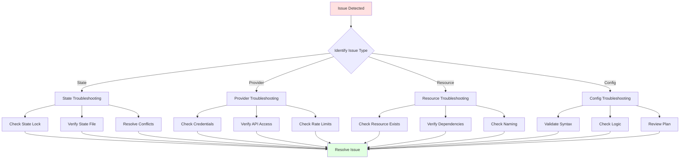

# Module 14: Terraform Troubleshooting and Debugging

## Table of Contents
- [14.1 Common Issues](#141-common-issues)
- [14.2 Debugging Techniques](#142-debugging-techniques)
- [14.3 Error Resolution](#143-error-resolution)
- [Quick Reference](#quick-reference)
- [Common Pitfalls](#common-pitfalls)
- [Best Practices](#best-practices)
- [Further Reading](#further-reading)

---

## 14.1 Common Issues

### Understanding Common Terraform Issues

Terraform troubleshooting is an essential skill for maintaining reliable infrastructure workflows. Despite Terraform's powerful capabilities, various issues can arise during development and operations. Understanding common problems, their causes, and solutions helps you resolve issues quickly and prevent them from recurring.

Common issue categories include: **state management problems** (conflicts, corruption, drift), **provider issues** (authentication, API limits, version conflicts), **resource conflicts** (naming, existence, dependencies), **configuration errors** (syntax, validation, logic), **network problems** (connectivity, timeouts), and **permission issues** (IAM, access control). Each category requires different troubleshooting approaches and solutions.

Effective troubleshooting involves: **systematic diagnosis** (identify root cause), **log analysis** (understand what happened), **state inspection** (verify current state), **incremental testing** (isolate problems), **documentation review** (check official docs), and **community resources** (leverage knowledge base). Understanding troubleshooting techniques helps you maintain reliable infrastructure operations.

#### Troubleshooting Workflow



### State File Conflicts

State file conflicts occur when multiple Terraform operations attempt to modify state simultaneously. This typically happens in team environments where multiple developers run Terraform concurrently, or when automated pipelines trigger overlapping runs.

**Symptoms**: Error messages like "Error acquiring the state lock", "LockID does not match", or "State is locked". Operations fail or hang waiting for lock release. State file shows unexpected changes or corruption.

**Causes**: Multiple `terraform apply` running simultaneously, state locking not configured, stale locks from crashed processes, network issues preventing lock release, or manual state file modifications.

**Solutions**:
- **Enable State Locking**: Use backends that support locking (S3 with DynamoDB, Azure Storage, GCS)
- **Use Remote State**: Store state in shared location with locking
- **Coordinate Team**: Use Terraform Cloud or coordinate manual runs
- **Force Unlock**: Use `terraform force-unlock` for stale locks (carefully!)
- **Check Lock Status**: Verify if lock is legitimate before forcing

State locking example:
```hcl
# S3 backend with DynamoDB locking
terraform {
  backend "s3" {
    bucket         = "terraform-state"
    key            = "prod/terraform.tfstate"
    region         = "us-west-2"
    dynamodb_table = "terraform-locks"  # Enables locking
    encrypt        = true
  }
}
```

Force unlock (use carefully):
```bash
# Check lock status first
terraform force-unlock <lock-id>

# Only use if you're certain the lock is stale
# Get lock ID from error message
```

### Provider Errors

Provider errors are common and can stem from various causes. Understanding provider error types helps diagnose and resolve issues quickly.

**Authentication Failures**: Provider cannot authenticate with cloud service. Symptoms: "Error: authentication failed", "Invalid credentials", "Access denied". Solutions: Verify credentials, check environment variables, validate IAM roles/permissions, test authentication separately.

**API Rate Limits**: Cloud provider throttles requests. Symptoms: "Rate limit exceeded", "Too many requests", "Throttling". Solutions: Implement retry logic, reduce parallel operations, use exponential backoff, contact provider support for limit increases.

**Resource Not Found**: Provider cannot find specified resource. Symptoms: "Resource not found", "404 Not Found", "Resource does not exist". Solutions: Verify resource names/IDs, check region/namespace, ensure resource exists, use data sources to query first.

**Quota Exceeded**: Cloud provider quota limits reached. Symptoms: "Quota exceeded", "Limit reached", "Insufficient capacity". Solutions: Request quota increase, clean up unused resources, use different regions, optimize resource usage.

**Version Conflicts**: Provider version incompatible with Terraform or resources. Symptoms: "Unsupported attribute", "Invalid argument", "Version mismatch". Solutions: Update provider version, check compatibility matrix, pin provider versions, test upgrades incrementally.

Provider error troubleshooting:
```bash
# Enable provider debugging
export TF_LOG=DEBUG
export TF_LOG_PATH=provider.log

# Test provider authentication
terraform init
terraform plan

# Check provider version
terraform version

# Verify provider configuration
terraform providers
```

### Resource Conflicts

Resource conflicts occur when Terraform attempts to create resources that already exist, or when resource names conflict with existing infrastructure.

**Resource Already Exists**: Terraform tries to create resource that exists outside Terraform. Symptoms: "Error: resource already exists", "Conflict", "Duplicate". Solutions: Import existing resource into state, use `terraform import`, or remove existing resource if appropriate.

**Naming Conflicts**: Resource names conflict with existing resources. Symptoms: "Name already in use", "Duplicate name", "Conflict". Solutions: Use unique naming conventions, include environment/region in names, check for existing resources first, use data sources to verify.

**Dependency Violations**: Resources created in wrong order or missing dependencies. Symptoms: "Dependency violation", "Resource not found", "Invalid reference". Solutions: Use explicit `depends_on`, verify implicit dependencies, check dependency graph, fix circular dependencies.

**State Drift**: Actual infrastructure differs from state file. Symptoms: Unexpected changes in plan, resources exist but not in state, state shows resources that don't exist. Solutions: Refresh state with `terraform refresh`, import missing resources, remove non-existent resources from state, investigate drift causes.

Resource conflict resolution:
```bash
# Import existing resource
terraform import aws_instance.web i-1234567890abcdef0

# Check what would be imported
terraform plan -generate-config-out=imported.tf

# Remove resource from state (doesn't delete resource)
terraform state rm aws_instance.old

# Refresh state to detect drift
terraform refresh

# Show state for specific resource
terraform state show aws_instance.web
```

### Dependency Issues

Dependency problems occur when Terraform doesn't understand resource relationships correctly, or when dependencies are circular or missing.

**Implicit Dependencies**: Terraform infers dependencies from resource references, but sometimes misses them. Symptoms: Resources created in wrong order, "resource not found" errors, timing issues. Solutions: Use explicit `depends_on`, verify all references, check dependency graph.

**Circular Dependencies**: Resources depend on each other creating a cycle. Symptoms: "Circular dependency", plan hangs, validation errors. Solutions: Refactor to break cycle, use data sources, combine resources, redesign architecture.

**Missing Dependencies**: Required dependencies not specified. Symptoms: Resources fail to create, "not found" errors, race conditions. Solutions: Add explicit dependencies, verify resource references, use `depends_on` when needed.

**Dependency Graph Analysis**: Understanding dependency relationships helps identify issues. Use `terraform graph` to visualize dependencies, identify cycles, and verify order.

Dependency troubleshooting:
```bash
# Visualize dependency graph
terraform graph | dot -Tsvg > graph.svg

# Show dependencies for resource
terraform state show aws_instance.web

# Plan with detailed output
terraform plan -detailed-exitcode

# Check for circular dependencies
terraform validate
```

### Authentication Problems

Authentication issues prevent Terraform from accessing cloud provider APIs. These problems can be subtle and frustrating to diagnose.

**Credential Configuration**: Credentials not configured correctly. Symptoms: "Authentication failed", "Invalid credentials", "Access denied". Solutions: Verify credential files, check environment variables, validate credential format, test with provider CLI tools.

**IAM Permissions**: Insufficient permissions for operations. Symptoms: "Access denied", "Forbidden", "Permission denied". Solutions: Review IAM policies, grant necessary permissions, use least privilege principle, test permissions separately.

**Environment Variables**: Environment variables not set or incorrect. Symptoms: "Credentials not found", "Missing required variable". Solutions: Check environment variables, verify variable names, use correct variable format, test in clean environment.

**Credential Rotation**: Credentials expired or rotated. Symptoms: "Token expired", "Invalid credentials", sudden authentication failures. Solutions: Update credentials, rotate keys regularly, use managed identities when possible, implement credential rotation procedures.

**Multi-Account Issues**: Working with multiple cloud accounts. Symptoms: Wrong account accessed, resources in unexpected account. Solutions: Use provider aliases, configure multiple provider instances, verify account selection, use separate state files per account.

Authentication troubleshooting:
```bash
# Test AWS credentials
aws sts get-caller-identity

# Test Azure credentials
az account show

# Test GCP credentials
gcloud auth list

# Check Terraform provider authentication
export TF_LOG=DEBUG
terraform init

# Verify environment variables
env | grep AWS
env | grep AZURE
env | grep GOOGLE
```

---

## 14.2 Debugging Techniques

### Terraform Logging

Terraform provides comprehensive logging capabilities for debugging. Understanding log levels and how to use them is essential for troubleshooting complex issues.

**Log Levels**: Terraform supports multiple log levels: **TRACE** (most verbose, all operations), **DEBUG** (detailed debugging info), **INFO** (general information), **WARN** (warnings), **ERROR** (errors only). Choose appropriate level based on issue severity.

**Enabling Logging**: Set `TF_LOG` environment variable to desired level. Use `TF_LOG_PATH` to write logs to file. Logs can be very verbose, especially at TRACE level, so use file output for analysis.

**Log Analysis**: Logs contain provider API calls, state operations, plan generation, and execution details. Search logs for error messages, API responses, and operation sequences. Compare successful and failed operations.

Logging example:
```bash
# Enable debug logging
export TF_LOG=DEBUG
export TF_LOG_PATH=terraform.log

# Run Terraform operation
terraform apply

# View logs
cat terraform.log | grep -i error
cat terraform.log | grep -i "api call"

# Enable trace logging (very verbose)
export TF_LOG=TRACE
terraform plan > trace.log 2>&1
```

### Debug Mode

Terraform's debug mode provides interactive debugging capabilities for complex issues.

**Interactive Debugging**: Use `-debug` flag for step-by-step execution. Terraform pauses at each step, allowing inspection of state and variables. Useful for understanding execution flow and identifying failure points.

**API Call Inspection**: Debug mode shows all provider API calls, requests, and responses. Helps identify API issues, rate limits, and authentication problems. Compare API calls between successful and failed operations.

**State Inspection**: Debug mode allows inspection of state at each step. Verify state changes, check resource attributes, and understand state transitions. Helps identify state-related issues.

Debug mode usage:
```bash
# Run with debug flag
terraform apply -debug

# Debug specific operation
terraform plan -debug

# Combine with logging
export TF_LOG=DEBUG
terraform apply -debug
```

### Plan Analysis

Analyzing Terraform plans helps identify issues before applying changes. Thorough plan review prevents many problems.

**Plan Review Process**: Review all resource changes, verify additions/deletions are expected, check attribute changes, verify dependencies, and ensure no unintended modifications. Plans show exactly what will change.

**Change Interpretation**: Understand plan output format. `+` means create, `-` means destroy, `~` means modify, `+/-` means replace. Review each change carefully, especially replacements which cause downtime.

**Dependency Verification**: Check that resources are created in correct order. Verify implicit dependencies are correct. Ensure no circular dependencies. Use `terraform graph` to visualize dependencies.

**Attribute Changes**: Review all attribute changes. Some changes require resource replacement (force new). Understand which attributes force replacement. Plan for downtime if replacements are necessary.

Plan analysis:
```bash
# Generate detailed plan
terraform plan -out=tfplan

# Review plan output
terraform show tfplan

# Save plan to file for review
terraform plan -out=tfplan > plan.txt

# Validate plan
terraform validate

# Show plan in JSON format
terraform show -json tfplan | jq .
```

### State Inspection

Inspecting Terraform state helps understand current infrastructure and identify issues.

**State Commands**: Use `terraform state list` to see all resources, `terraform state show` to see resource details, `terraform state pull` to get raw state, and `terraform state mv` to reorganize state.

**State File Analysis**: State files are JSON and can be inspected directly. Understand state structure, verify resource attributes, check dependencies, and identify inconsistencies. Be careful not to modify state directly.

**State Validation**: Verify state matches actual infrastructure. Use `terraform refresh` to sync state with reality. Compare state with actual resources. Identify and resolve drift.

**State Backup**: Always backup state before modifications. Use versioning in state storage. Keep state backups for recovery. Test state restore procedures.

State inspection:
```bash
# List all resources in state
terraform state list

# Show specific resource
terraform state show aws_instance.web

# Pull raw state (JSON)
terraform state pull > state.json

# Move resource in state
terraform state mv aws_instance.old aws_instance.new

# Remove resource from state
terraform state rm aws_instance.unwanted

# Backup state
terraform state pull > backup-state-$(date +%Y%m%d).json
```

### Provider Debugging

Debugging provider issues requires understanding provider behavior and capabilities.

**Provider Logging**: Enable provider-specific logging. Each provider may have different logging options. Check provider documentation for logging details. Provider logs show API interactions.

**Version Verification**: Verify provider versions are compatible. Check provider changelogs for breaking changes. Test provider upgrades in development. Pin provider versions for stability.

**API Endpoint Testing**: Test provider API endpoints directly. Use provider CLI tools to verify connectivity. Check network connectivity. Verify API endpoints are accessible.

**Provider Configuration**: Verify provider configuration is correct. Check all required arguments. Validate authentication methods. Test provider initialization separately.

Provider debugging:
```bash
# Check provider versions
terraform version

# List providers
terraform providers

# Show provider requirements
terraform providers schema

# Test provider initialization
terraform init -upgrade

# Provider-specific debugging
# AWS: Check credentials
aws sts get-caller-identity

# Azure: Check authentication
az account show

# GCP: Check authentication
gcloud auth list
```

---

## 14.3 Error Resolution

### Understanding Error Messages

Terraform error messages provide valuable information for troubleshooting. Learning to interpret errors correctly speeds up resolution.

**Error Structure**: Errors typically include: error type (syntax, validation, provider, etc.), affected resource or configuration, error details and context, and sometimes suggested solutions. Read errors carefully and completely.

**Error Categories**: **Syntax errors** (HCL parsing issues), **validation errors** (configuration problems), **provider errors** (API or authentication issues), **state errors** (state file problems), **dependency errors** (resource relationship issues). Each category requires different resolution approaches.

**Error Context**: Errors show file and line numbers, resource names, and configuration context. Use this information to locate and fix issues. Check surrounding configuration for related problems.

**Common Error Patterns**: Learn to recognize common error patterns. Many errors follow similar patterns. Experience helps identify issues quickly. Document common errors and solutions for your team.

Error message analysis:
```bash
# Read error messages carefully
terraform apply

# Save errors for analysis
terraform apply 2>&1 | tee error.log

# Search for specific error patterns
grep -i "error" error.log
grep -i "failed" error.log

# Check error context
# Errors show file:line numbers
# Use this to locate issues
```

### Common Error Patterns

Recognizing common error patterns helps resolve issues quickly.

**"Resource Already Exists"**: Resource exists outside Terraform. **Solution**: Import resource or remove existing resource. **Prevention**: Check for existing resources before creating.

**"Invalid Credentials"**: Authentication failed. **Solution**: Verify credentials, check IAM permissions. **Prevention**: Use managed identities, rotate credentials regularly.

**"Quota Exceeded"**: Cloud provider limit reached. **Solution**: Request quota increase, clean up resources. **Prevention**: Monitor quotas, plan capacity.

**"Dependency Violation"**: Resource dependencies incorrect. **Solution**: Fix dependencies, use `depends_on`. **Prevention**: Review dependency graph, test incrementally.

**"State Locked"**: Another operation holds state lock. **Solution**: Wait for lock release, force unlock if stale. **Prevention**: Use proper locking backends, coordinate operations.

**"Invalid Argument"**: Configuration argument incorrect. **Solution**: Check provider documentation, verify argument syntax. **Prevention**: Use provider documentation, validate configuration.

**"Resource Not Found"**: Referenced resource doesn't exist. **Solution**: Create resource first, fix reference. **Prevention**: Verify all references, use data sources.

### Resolution Strategies

Effective resolution strategies help resolve issues systematically.

**Isolate the Problem**: Narrow down to specific resource or configuration. Use targeted operations (`-target`). Test incrementally. Identify root cause before fixing.

**Check Recent Changes**: Review recent configuration changes. Check Git history. Identify what changed. Test reverting changes.

**Verify Configuration**: Validate configuration syntax. Check provider documentation. Verify all required arguments. Test with minimal configuration.

**Test Incrementally**: Make small changes and test. Use `terraform plan` frequently. Apply changes incrementally. Verify each step works.

**Use Targeted Operations**: Apply changes to specific resources. Isolate problematic resources. Test fixes before full apply. Reduce risk of breaking other resources.

**Roll Back if Needed**: Have rollback plan ready. Backup state before changes. Test rollback procedures. Document rollback steps.

Resolution workflow:
```bash
# Isolate problem with targeted apply
terraform apply -target=aws_instance.problematic

# Test minimal configuration
# Create test.tf with minimal config
terraform init
terraform plan

# Verify recent changes
git log --oneline -10
git diff HEAD~1

# Incremental testing
# Make small change
terraform plan
# Review plan
# Apply if correct
terraform apply
```

### Recovery Procedures

Having recovery procedures ready helps restore infrastructure quickly after issues.

**State Backups**: Always backup state before changes. Use versioned state storage. Keep multiple backups. Test restore procedures regularly.

**State Snapshots**: Create state snapshots at key points. Before major changes. After successful deployments. For disaster recovery.

**Rollback Plans**: Have rollback procedures documented. Test rollback in development. Know how to revert changes. Keep previous configurations available.

**Disaster Recovery**: Plan for complete infrastructure loss. Document recovery procedures. Test recovery regularly. Keep backups off-site.

**Recovery Testing**: Regularly test recovery procedures. Verify backups are valid. Test restore processes. Update procedures based on tests.

Recovery procedures:
```bash
# Backup state
terraform state pull > backup-$(date +%Y%m%d-%H%M%S).json

# Create state snapshot
cp terraform.tfstate terraform.tfstate.backup

# Restore from backup
terraform state push backup-20240101-120000.json

# Rollback configuration
git checkout <previous-commit>
terraform init -upgrade
terraform plan
terraform apply

# Disaster recovery
# Restore from backup state
# Re-apply configuration
terraform init
terraform apply
```

### Prevention Techniques

Preventing issues is better than fixing them. Implement prevention techniques to reduce problems.

**Remote State with Locking**: Use remote state backends with locking. Prevents state conflicts. Enables team collaboration. Provides state versioning.

**Code Review**: Review all Terraform changes. Catch issues before applying. Share knowledge. Maintain quality standards.

**Testing in Development**: Always test in development first. Use separate environments. Test changes thoroughly. Verify before production.

**CI/CD Pipelines**: Automate Terraform operations. Run validation and tests. Enforce standards. Provide audit trail.

**Monitoring**: Monitor infrastructure changes. Track Terraform operations. Alert on failures. Review regularly.

**Documentation**: Document configurations and procedures. Explain complex setups. Keep runbooks updated. Share knowledge.

Prevention checklist:
- [ ] Use remote state with locking
- [ ] Implement code review process
- [ ] Test in development first
- [ ] Use CI/CD pipelines
- [ ] Monitor operations
- [ ] Document procedures
- [ ] Regular backups
- [ ] Team training

---

## Quick Reference

### Debugging Commands
```bash
# Enable logging
export TF_LOG=DEBUG
export TF_LOG_PATH=terraform.log

# Debug mode
terraform apply -debug

# State inspection
terraform state list
terraform state show <resource>
terraform state pull

# Plan analysis
terraform plan -out=tfplan
terraform show tfplan

# Provider debugging
terraform providers
terraform version
```

### Common Error Solutions
- **State locked**: Wait or force-unlock
- **Resource exists**: Import or remove
- **Auth failed**: Check credentials
- **Quota exceeded**: Increase quota
- **Invalid argument**: Check docs
- **Not found**: Verify reference

---

## Common Pitfalls

### Pitfall 1: Not Using State Locking
**Problem**: State conflicts in team environments
**Solution**: Always use remote state with locking
**Prevention**: Configure locking backend from start

### Pitfall 2: Ignoring Plan Output
**Problem**: Unexpected changes applied
**Solution**: Always review plan carefully
**Prevention**: Require plan review in process

### Pitfall 3: No State Backups
**Problem**: Cannot recover from state corruption
**Solution**: Regular state backups
**Prevention**: Automated backup procedures

### Pitfall 4: Force Unlocking Carelessly
**Problem**: State corruption from concurrent operations
**Solution**: Verify lock is stale before forcing
**Prevention**: Coordinate team operations

### Pitfall 5: Not Testing in Dev
**Problem**: Issues discovered in production
**Solution**: Always test in development first
**Prevention**: Enforce dev-first workflow

---

## Best Practices

1. **Use Remote State**: With locking and versioning
2. **Review Plans**: Always review before applying
3. **Backup State**: Regular backups before changes
4. **Test Incrementally**: Small changes, frequent testing
5. **Enable Logging**: For debugging complex issues
6. **Document Issues**: Share solutions with team
7. **Monitor Operations**: Track Terraform runs
8. **Use CI/CD**: Automate and validate
9. **Coordinate Team**: Prevent conflicts
10. **Learn from Errors**: Improve processes

---

## Further Reading

### Official Documentation
- [Terraform Debugging](https://www.terraform.io/docs/internals/debugging.html)
- [Terraform State](https://www.terraform.io/docs/state/index.html)

### Troubleshooting Resources
- [Terraform Community Forums](https://discuss.hashicorp.com/c/terraform-core)
- [Common Terraform Errors](https://www.terraform.io/docs/cli/commands/plan.html)

### Related Topics
- State Management (Module 5)
- Best Practices (Module 12)
- CI/CD Integration (Module 13)

---

*This module covers Terraform troubleshooting and debugging in detail. Understanding common issues, debugging techniques, and resolution strategies helps you maintain reliable Terraform workflows and quickly resolve problems when they occur.*
