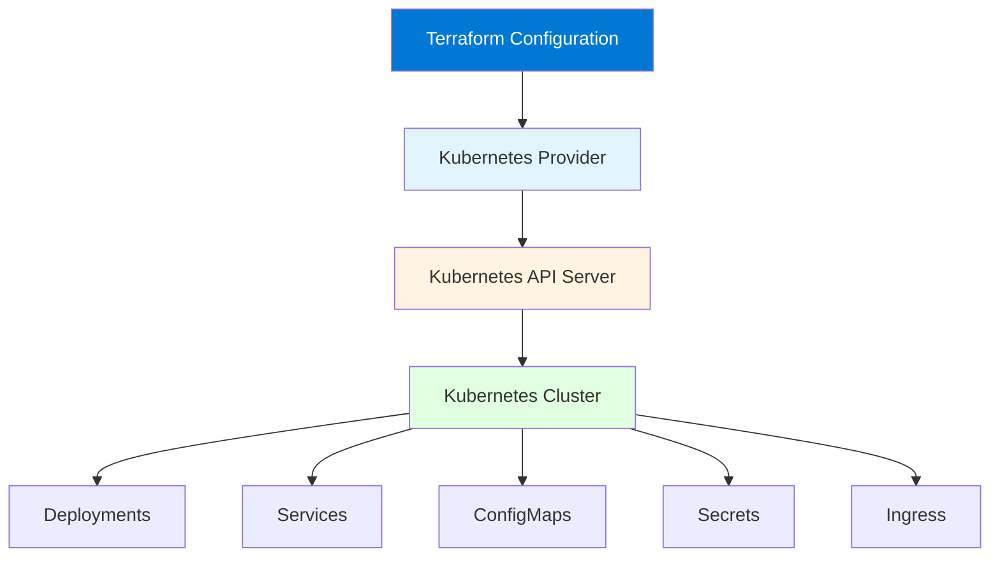

# Module 15: Terraform with Kubernetes

## Table of Contents
- [15.1 Kubernetes Provider](#151-kubernetes-provider)
- [15.2 Managing Kubernetes Resources](#152-managing-kubernetes-resources)
- [15.3 Terraform and Helm](#153-terraform-and-helm)
- [Quick Reference](#quick-reference)
- [Common Pitfalls](#common-pitfalls)
- [Best Practices](#best-practices)
- [Further Reading](#further-reading)

---

## 15.1 Kubernetes Provider

### Understanding the Kubernetes Provider

The Kubernetes provider enables Terraform to manage Kubernetes resources declaratively. This brings Infrastructure as Code practices to Kubernetes, allowing you to version control, review, and automate Kubernetes configurations. The provider translates Terraform configuration into Kubernetes API calls, creating, updating, and deleting Kubernetes resources.

The Kubernetes provider is essential for organizations adopting GitOps practices, where all infrastructure and application configurations are stored in version control and managed through automated workflows. Unlike imperative tools like `kubectl`, Terraform's declarative approach ensures desired state is maintained automatically, with changes tracked and auditable.

Using Terraform with Kubernetes provides: **version control** (all Kubernetes configs in Git), **code review** (changes reviewed before applying), **state management** (Terraform tracks what's deployed), **dependency management** (resources created in correct order), **modularity** (reusable Kubernetes configurations), and **multi-cluster** (manage multiple clusters consistently). Understanding the Kubernetes provider helps you apply Infrastructure as Code to containerized applications.

#### Terraform + Kubernetes Architecture



### Provider Configuration

The Kubernetes provider requires configuration to connect to your cluster. Configuration options include kubeconfig files, in-cluster configuration (when running inside Kubernetes), or explicit connection parameters.

**Kubeconfig File**: Most common method for local development. Points to kubeconfig file containing cluster connection details. Supports multiple contexts and clusters. Easy to switch between clusters.

**In-Cluster Config**: When Terraform runs inside Kubernetes (e.g., in CI/CD). Automatically detects cluster configuration. No kubeconfig needed. Secure for automated workflows.

**Explicit Configuration**: Direct connection parameters (host, token, certificate). Useful for automation and CI/CD. Requires managing credentials securely.

Provider configuration example:
```hcl
terraform {
  required_providers {
    kubernetes = {
      source  = "hashicorp/kubernetes"
      version = "~> 2.23"
    }
  }
}

# Option 1: Kubeconfig file (local development)
provider "kubernetes" {
  config_path    = "~/.kube/config"
  config_context = "my-cluster"
}

# Option 2: In-cluster config (running in Kubernetes)
provider "kubernetes" {
  # Automatically detects when running in cluster
  # No configuration needed
}

# Option 3: Explicit configuration
provider "kubernetes" {
  host                   = var.kubernetes_host
  token                  = var.kubernetes_token
  cluster_ca_certificate = base64decode(var.kubernetes_cluster_ca_certificate)
}
```

### Authentication Methods

Kubernetes provider supports multiple authentication methods:

**Kubeconfig**: Standard Kubernetes configuration file. Contains cluster, user, and context information. Supports multiple authentication methods (certificates, tokens, exec plugins).

**Service Account Token**: When running in Kubernetes, use service account token. Secure for automated workflows. No manual credential management.

**Client Certificates**: X.509 client certificates for authentication. Secure but requires certificate management.

**Bearer Token**: Static bearer token for authentication. Simple but less secure. Good for testing.

**Exec Plugin**: External command for authentication (e.g., AWS IAM authenticator). Dynamic token generation. Secure for cloud-managed clusters.

Authentication example:
```hcl
# Using kubeconfig (supports all auth methods)
provider "kubernetes" {
  config_path = "~/.kube/config"
}

# Using service account (in-cluster)
provider "kubernetes" {
  # Automatically uses service account when in cluster
}

# Using explicit token
provider "kubernetes" {
  host  = "https://kubernetes.example.com"
  token = var.kubernetes_token
}
```

### Provider Best Practices

Best practices for Kubernetes provider:

1. **Use Kubeconfig for Development**: Easy local development
2. **Use In-Cluster Config for CI/CD**: Secure automated workflows
3. **Version Pin Providers**: Pin provider versions for stability
4. **Separate Clusters**: Use provider aliases for multiple clusters
5. **Secure Credentials**: Never commit credentials to version control
6. **Test Authentication**: Verify provider can connect before use
7. **Use Contexts**: Leverage kubeconfig contexts for cluster switching
8. **Monitor Provider Updates**: Keep provider updated for new features

---

## 15.2 Managing Kubernetes Resources

### Resource Management Overview

Terraform can manage virtually any Kubernetes resource through the provider. This includes core resources like Deployments, Services, ConfigMaps, Secrets, and Ingress, as well as custom resources defined by CRDs (Custom Resource Definitions). Terraform's declarative approach ensures resources match desired state.

Managing Kubernetes resources with Terraform provides: **declarative management** (describe desired state), **dependency handling** (resources created in order), **state tracking** (know what's deployed), **change management** (review changes before applying), **rollback capability** (revert to previous state), and **multi-resource operations** (manage related resources together). Understanding resource management helps you build comprehensive Kubernetes configurations.

### Core Kubernetes Resources

Terraform manages core Kubernetes resources:

**Deployments**: Manage application deployments with replica management, rolling updates, and rollback capabilities. Terraform ensures desired replica count and configuration.

**Services**: Expose applications internally or externally. Terraform manages service types (ClusterIP, NodePort, LoadBalancer), selectors, and ports.

**ConfigMaps**: Store configuration data. Terraform manages ConfigMap creation and updates, ensuring configuration consistency.

**Secrets**: Store sensitive data. Terraform can manage secrets (though consider using external secret management for sensitive data).

**Ingress**: Manage external access to services. Terraform configures ingress rules, TLS, and routing.

**Namespaces**: Organize resources. Terraform creates and manages namespaces for resource organization.

**PersistentVolumes/PersistentVolumeClaims**: Manage storage. Terraform provisions and binds storage to pods.

### Deployment Example

Complete deployment example with service:

```hcl
# Namespace
resource "kubernetes_namespace" "app" {
  metadata {
    name = "my-app"
    labels = {
      environment = "production"
    }
  }
}

# ConfigMap
resource "kubernetes_config_map" "app" {
  metadata {
    name      = "app-config"
    namespace = kubernetes_namespace.app.metadata[0].name
  }

  data = {
    APP_ENV     = "production"
    LOG_LEVEL   = "info"
    API_TIMEOUT = "30s"
  }
}

# Secret (in production, use external secret management)
resource "kubernetes_secret" "app" {
  metadata {
    name      = "app-secrets"
    namespace = kubernetes_namespace.app.metadata[0].name
  }

  data = {
    database_password = base64encode(var.db_password)
    api_key          = base64encode(var.api_key)
  }

  type = "Opaque"
}

# Deployment
resource "kubernetes_deployment" "app" {
  metadata {
    name      = "my-app"
    namespace = kubernetes_namespace.app.metadata[0].name
    labels = {
      app = "my-app"
    }
  }

  spec {
    replicas = 3

    selector {
      match_labels = {
        app = "my-app"
      }
    }

    template {
      metadata {
        labels = {
          app = "my-app"
        }
      }

      spec {
        container {
          name  = "app"
          image = "myapp:1.0.0"

          port {
            container_port = 8080
            name           = "http"
          }

          env {
            name  = "APP_ENV"
            value_from {
              config_map_key_ref {
                name = kubernetes_config_map.app.metadata[0].name
                key  = "APP_ENV"
              }
            }
          }

          env {
            name  = "DATABASE_PASSWORD"
            value_from {
              secret_key_ref {
                name = kubernetes_secret.app.metadata[0].name
                key  = "database_password"
              }
            }
          }

          resources {
            requests = {
              cpu    = "100m"
              memory = "128Mi"
            }
            limits = {
              cpu    = "500m"
              memory = "512Mi"
            }
          }

          liveness_probe {
            http_get {
              path = "/health"
              port = 8080
            }
            initial_delay_seconds = 30
            period_seconds        = 10
          }

          readiness_probe {
            http_get {
              path = "/ready"
              port = 8080
            }
            initial_delay_seconds = 5
            period_seconds        = 5
          }
        }
      }
    }
  }
}

# Service
resource "kubernetes_service" "app" {
  metadata {
    name      = "my-app-service"
    namespace = kubernetes_namespace.app.metadata[0].name
  }

  spec {
    selector = {
      app = kubernetes_deployment.app.metadata[0].labels.app
    }

    port {
      port        = 80
      target_port = 8080
      protocol    = "TCP"
    }

    type = "LoadBalancer"
  }
}

# Ingress
resource "kubernetes_ingress_v1" "app" {
  metadata {
    name      = "my-app-ingress"
    namespace = kubernetes_namespace.app.metadata[0].name
    annotations = {
      "kubernetes.io/ingress.class"                = "nginx"
      "cert-manager.io/cluster-issuer"              = "letsencrypt-prod"
      "nginx.ingress.kubernetes.io/ssl-redirect"   = "true"
    }
  }

  spec {
    ingress_class_name = "nginx"

    tls {
      hosts       = ["myapp.example.com"]
      secret_name = "my-app-tls"
    }

    rule {
      host = "myapp.example.com"
      http {
        path {
          path      = "/"
          path_type = "Prefix"
          backend {
            service {
              name = kubernetes_service.app.metadata[0].name
              port {
                number = 80
              }
            }
          }
        }
      }
    }
  }
}
```

### Resource Dependencies

Terraform automatically handles dependencies between Kubernetes resources:

**Implicit Dependencies**: When resources reference each other (e.g., Deployment references ConfigMap), Terraform creates dependencies automatically. Resources are created in correct order.

**Explicit Dependencies**: Use `depends_on` when dependencies aren't obvious from references. Useful for ordering operations that don't have direct references.

**Namespace Dependencies**: Resources in namespaces depend on namespace creation. Terraform ensures namespaces are created first.

Dependency example:
```hcl
# Namespace created first
resource "kubernetes_namespace" "app" {
  metadata {
    name = "my-app"
  }
}

# Deployment depends on namespace (implicit)
resource "kubernetes_deployment" "app" {
  metadata {
    name      = "my-app"
    namespace = kubernetes_namespace.app.metadata[0].name  # Creates dependency
  }
  # ...
}

# Explicit dependency
resource "kubernetes_job" "migration" {
  depends_on = [kubernetes_deployment.app]  # Explicit dependency
  
  metadata {
    name      = "migration"
    namespace = kubernetes_namespace.app.metadata[0].name
  }
  # ...
}
```

### Custom Resources

Terraform can manage Custom Resource Definitions (CRDs) and custom resources:

**CRD Support**: Terraform provider supports CRDs through generic resource type `kubernetes_manifest`. Enables managing any Kubernetes resource, including custom resources.

**CRD Management**: Define CRDs in Terraform or manage them separately. Terraform can create CRDs and then manage custom resources.

**Custom Resource Example**: Manage resources like Cert-Manager certificates, ArgoCD applications, or any custom operator resources.

Custom resource example:
```hcl
# Generic manifest for custom resource
resource "kubernetes_manifest" "certificate" {
  manifest = {
    apiVersion = "cert-manager.io/v1"
    kind       = "Certificate"
    metadata = {
      name      = "my-cert"
      namespace = "default"
    }
    spec = {
      secretName = "my-cert-tls"
      issuerRef = {
        name = "letsencrypt-prod"
        kind = "ClusterIssuer"
      }
      dnsNames = ["example.com"]
    }
  }
}
```

---

## 15.3 Terraform and Helm

### Terraform vs. Helm

Terraform and Helm serve different but complementary purposes in Kubernetes management:

**Terraform**: Infrastructure as Code tool. Manages infrastructure and basic Kubernetes resources. Declarative, stateful, tracks what's deployed. Best for: infrastructure provisioning, cluster setup, basic resources, GitOps workflows.

**Helm**: Kubernetes package manager. Packages and deploys applications. Template-based, versioned charts, dependency management. Best for: application deployment, complex applications, versioned releases, application packaging.

**When to Use Each**: Use Terraform for infrastructure and cluster management. Use Helm for application deployment. Many organizations use both: Terraform for infrastructure, Helm for applications.

### Helm Provider

The Helm provider enables Terraform to manage Helm releases. This combines Terraform's infrastructure management with Helm's application packaging capabilities.

**Helm Provider Benefits**: Manage Helm releases declaratively, version control Helm deployments, integrate Helm with Terraform workflows, manage Helm releases alongside infrastructure.

**Helm Provider Configuration**: Configure Helm provider with Kubernetes connection. Helm provider uses Kubernetes provider for cluster access.

Helm provider example:
```hcl
terraform {
  required_providers {
    helm = {
      source  = "hashicorp/helm"
      version = "~> 2.11"
    }
    kubernetes = {
      source  = "hashicorp/kubernetes"
      version = "~> 2.23"
    }
  }
}

provider "kubernetes" {
  config_path = "~/.kube/config"
}

provider "helm" {
  kubernetes {
    config_path = "~/.kube/config"
  }
}

# Helm release
resource "helm_release" "nginx_ingress" {
  name       = "nginx-ingress"
  repository = "https://kubernetes.github.io/ingress-nginx"
  chart      = "ingress-nginx"
  version    = "4.8.0"
  namespace  = "ingress-nginx"
  create_namespace = true

  set {
    name  = "controller.replicaCount"
    value = "2"
  }

  set {
    name  = "controller.service.type"
    value = "LoadBalancer"
  }

  set {
    name  = "controller.metrics.enabled"
    value = "true"
  }

  values = [
    <<-EOT
    controller:
      resources:
        requests:
          cpu: 100m
          memory: 128Mi
        limits:
          cpu: 500m
          memory: 512Mi
    EOT
  ]
}
```

### Hybrid Approaches

Many organizations use hybrid approaches combining Terraform and Helm:

**Infrastructure with Terraform**: Use Terraform for cluster infrastructure, namespaces, RBAC, storage classes, and basic resources.

**Applications with Helm**: Use Helm for application deployments, complex applications, and versioned releases.

**Terraform Manages Helm**: Use Terraform to manage Helm releases, providing unified workflow and state management.

Hybrid example:
```hcl
# Infrastructure with Terraform
resource "kubernetes_namespace" "app" {
  metadata {
    name = "my-app"
  }
}

resource "kubernetes_secret" "db_credentials" {
  metadata {
    name      = "db-credentials"
    namespace = kubernetes_namespace.app.metadata[0].name
  }
  # ...
}

# Application with Helm (managed by Terraform)
resource "helm_release" "app" {
  name       = "my-app"
  repository = "https://charts.example.com"
  chart      = "my-app"
  version    = "1.2.3"
  namespace  = kubernetes_namespace.app.metadata[0].name

  values = [
    yamlencode({
      database = {
        host     = var.db_host
        secret   = kubernetes_secret.db_credentials.metadata[0].name
      }
      replicas = var.environment == "prod" ? 3 : 1
    })
  ]

  depends_on = [
    kubernetes_namespace.app,
    kubernetes_secret.db_credentials
  ]
}
```

### Best Practices

Best practices for Terraform with Kubernetes:

1. **Use Terraform for Infrastructure**: Cluster setup, namespaces, RBAC
2. **Use Helm for Applications**: Complex apps, versioned deployments
3. **Manage Helm with Terraform**: Unified workflow and state
4. **Separate Concerns**: Infrastructure vs. applications
5. **Version Control Everything**: All configs in Git
6. **Use Modules**: Reusable Kubernetes configurations
7. **Secure Secrets**: Use external secret management
8. **Test in Dev**: Always test in development first
9. **Monitor Deployments**: Track what's deployed
10. **Document Configurations**: Explain complex setups

---

## Quick Reference

### Provider Configuration
```hcl
provider "kubernetes" {
  config_path = "~/.kube/config"
}
```

### Common Resources
- `kubernetes_namespace`
- `kubernetes_deployment`
- `kubernetes_service`
- `kubernetes_config_map`
- `kubernetes_secret`
- `kubernetes_ingress_v1`

### Helm Release
```hcl
resource "helm_release" "app" {
  name       = "app"
  repository = "https://..."
  chart      = "app"
  version    = "1.0.0"
}
```

---

## Common Pitfalls

### Pitfall 1: Managing Everything with Terraform
**Problem**: Trying to manage all Kubernetes resources with Terraform, including complex applications
**Solution**: Use Helm for applications, Terraform for infrastructure
**Prevention**: Understand when to use each tool

### Pitfall 2: Not Using Namespaces
**Problem**: All resources in default namespace, poor organization
**Solution**: Always use namespaces for organization
**Prevention**: Create namespaces first, organize by application

### Pitfall 3: Hard-Coding Secrets
**Problem**: Secrets in Terraform code, exposed in state
**Solution**: Use external secret management (Vault, Sealed Secrets)
**Prevention**: Never put secrets in Terraform code

### Pitfall 4: Ignoring Resource Dependencies
**Problem**: Resources created in wrong order, failures
**Solution**: Understand and use dependencies correctly
**Prevention**: Review dependency graph, test incrementally

---

## Best Practices

1. **Use Namespaces**: Organize resources properly
2. **Separate Infrastructure and Apps**: Terraform for infra, Helm for apps
3. **Secure Secrets**: External secret management
4. **Version Control**: All configs in Git
5. **Use Modules**: Reusable configurations
6. **Test in Dev**: Always test first
7. **Monitor Deployments**: Track what's deployed
8. **Document Configurations**: Explain complex setups
9. **Use Provider Aliases**: For multiple clusters
10. **Review Changes**: Always review plans

---

## Further Reading

### Official Documentation
- [Kubernetes Provider](https://registry.terraform.io/providers/hashicorp/kubernetes/latest/docs)
- [Helm Provider](https://registry.terraform.io/providers/hashicorp/helm/latest/docs)

### Related Topics
- Kubernetes Core Concepts (Kubernetes Module 2)
- Kubernetes Workloads (Kubernetes Module 6)
- Terraform Modules (Module 6)

---

*This module covers Terraform with Kubernetes in detail. Understanding how to manage Kubernetes resources with Terraform enables Infrastructure as Code workflows for containerized applications, combining the power of Terraform's declarative management with Kubernetes' orchestration capabilities.*

