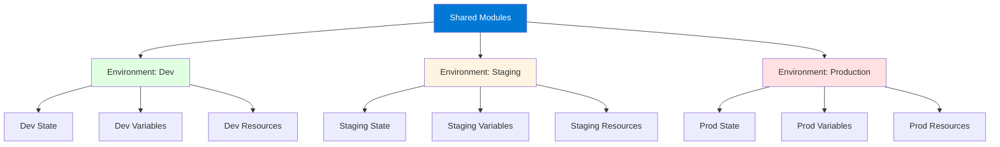

# Module 16: Terraform Advanced Patterns

## Table of Contents
- [16.1 Multi-Environment Management](#161-multi-environment-management)
- [16.2 Multi-Region Deployments](#162-multi-region-deployments)
- [16.3 Infrastructure Patterns](#163-infrastructure-patterns)
- [Quick Reference](#quick-reference)
- [Common Pitfalls](#common-pitfalls)
- [Best Practices](#best-practices)
- [Further Reading](#further-reading)

---

## 16.1 Multi-Environment Management

### Understanding Multi-Environment Management

Multi-environment management is a critical pattern for organizations managing infrastructure across development, staging, and production environments. This pattern ensures consistent infrastructure across environments while allowing environment-specific configurations. Effective multi-environment management reduces errors, speeds up deployments, and ensures production readiness.

Multi-environment management involves: **consistent infrastructure** (same code, different values), **environment isolation** (separate state, separate resources), **promotion workflow** (dev → staging → prod), **configuration management** (environment-specific variables), and **state management** (separate state per environment). Understanding multi-environment patterns helps you build scalable, maintainable infrastructure.

Common approaches include: **directory-based** (separate directories per environment), **workspace-based** (Terraform workspaces), **Terraform Cloud workspaces** (cloud-managed workspaces), and **module-based** (reusable modules with environment parameters). Each approach has trade-offs in complexity, isolation, and maintainability. Choosing the right approach depends on team size, complexity, and requirements.

#### Multi-Environment Architecture



### Directory-Based Pattern

Directory-based pattern uses separate directories for each environment. This provides maximum isolation and clarity but requires code duplication or careful module usage.

**Structure**: Each environment has its own directory with complete Terraform configuration. Shared code is in modules directory. Environments are completely isolated.

**Benefits**: Clear separation, easy to understand, maximum isolation, different backends per environment, easy to customize per environment.

**Drawbacks**: Code duplication if not using modules, more directories to manage, changes must be applied to each environment.

Directory structure:
```
terraform/
├── modules/
│   ├── network/
│   ├── compute/
│   └── database/
├── environments/
│   ├── dev/
│   │   ├── main.tf
│   │   ├── variables.tf
│   │   ├── outputs.tf
│   │   ├── terraform.tfvars
│   │   └── backend.tf
│   ├── staging/
│   │   ├── main.tf
│   │   ├── variables.tf
│   │   ├── outputs.tf
│   │   ├── terraform.tfvars
│   │   └── backend.tf
│   └── prod/
│       ├── main.tf
│       ├── variables.tf
│       ├── outputs.tf
│       ├── terraform.tfvars
│       └── backend.tf
```

Example environment configuration:
```hcl
# environments/dev/main.tf
module "network" {
  source = "../../modules/network"
  
  environment = "dev"
  cidr_block  = "10.1.0.0/16"
}

module "compute" {
  source = "../../modules/compute"
  
  vpc_id        = module.network.vpc_id
  subnet_ids    = module.network.private_subnet_ids
  instance_type = var.instance_type
  instance_count = var.instance_count
}

# environments/dev/terraform.tfvars
instance_type  = "t3.micro"
instance_count = 1
enable_monitoring = false

# environments/prod/terraform.tfvars
instance_type  = "t3.large"
instance_count = 3
enable_monitoring = true
```

### Workspace-Based Pattern

Workspace-based pattern uses Terraform workspaces to manage multiple environments with the same configuration directory. This reduces code duplication but requires careful variable management.

**Structure**: Single configuration directory, multiple workspaces (dev, staging, prod). Workspace name determines environment. Variables change based on workspace.

**Benefits**: Single codebase, easy to maintain, quick environment switching, less duplication.

**Drawbacks**: Shared configuration, must handle environment differences in code, risk of applying to wrong environment.

Workspace pattern:
```hcl
# main.tf (shared across environments)
locals {
  environment = terraform.workspace
  
  environment_config = {
    dev = {
      instance_type  = "t3.micro"
      instance_count  = 1
      enable_monitoring = false
    }
    staging = {
      instance_type  = "t3.small"
      instance_count = 2
      enable_monitoring = true
    }
    prod = {
      instance_type  = "t3.large"
      instance_count = 3
      enable_monitoring = true
    }
  }
  
  config = local.environment_config[local.environment]
}

resource "aws_instance" "web" {
  count         = local.config.instance_count
  instance_type = local.config.instance_type
  
  tags = {
    Environment = local.environment
  }
}
```

### Terraform Cloud Workspaces

Terraform Cloud workspaces provide managed multi-environment management with additional features like remote execution, policy enforcement, and team collaboration.

**Benefits**: Remote execution, state management, team collaboration, policy enforcement, cost estimation, VCS integration.

**Structure**: Each environment is a Terraform Cloud workspace. Workspaces can be VCS-driven or CLI-driven. Variables managed in Terraform Cloud.

Terraform Cloud configuration:
```hcl
# backend.tf
terraform {
  cloud {
    organization = "my-org"
    workspaces {
      name = "production"  # Different workspace per environment
    }
  }
}
```

### Variable Management Across Environments

Effective variable management is crucial for multi-environment setups:

**Environment-Specific Variables**: Use `.tfvars` files per environment. Store environment-specific values. Never commit sensitive values.

**Variable Files**: `dev.tfvars`, `staging.tfvars`, `prod.tfvars`. Load appropriate file per environment. Use `-var-file` flag.

**Variable Validation**: Validate variables to prevent errors. Use variable validation blocks. Ensure required variables are set.

**Sensitive Variables**: Use secret management for sensitive values. Never commit secrets. Use environment variables or secret stores.

Variable management:
```hcl
# variables.tf
variable "instance_type" {
  description = "EC2 instance type"
  type        = string
  validation {
    condition     = can(regex("^t3\\.[a-z]+$", var.instance_type))
    error_message = "Instance type must be t3 family."
  }
}

variable "instance_count" {
  description = "Number of instances"
  type        = number
  default     = 1
}

variable "db_password" {
  description = "Database password"
  type        = string
  sensitive   = true
}

# dev.tfvars
instance_type  = "t3.micro"
instance_count = 1

# prod.tfvars
instance_type  = "t3.large"
instance_count = 3
# db_password from secret store
```

### Promotion Workflows

Promotion workflows ensure changes flow safely from dev → staging → prod:

**Workflow Steps**: 
1. Develop and test in dev
2. Promote to staging after validation
3. Promote to production after staging validation
4. Monitor each environment

**Automation**: Use CI/CD pipelines for promotion. Require approvals for production. Run tests at each stage.

**Validation**: Validate changes in each environment. Run tests before promotion. Review changes carefully.

Promotion example:
```bash
# Dev environment
cd environments/dev
terraform init
terraform plan
terraform apply

# After validation, promote to staging
cd ../staging
terraform init
terraform plan  # Review changes
terraform apply

# After staging validation, promote to prod
cd ../prod
terraform init
terraform plan  # Review carefully
# Require approval
terraform apply
```

---

## 16.2 Multi-Region Deployments

### Understanding Multi-Region Deployments

Multi-region deployments provision infrastructure across multiple geographic regions for high availability, disaster recovery, and performance. This pattern is essential for global applications and compliance requirements.

Multi-region deployments provide: **high availability** (survive region failures), **disaster recovery** (backup regions), **performance** (lower latency for users), **compliance** (data residency requirements), and **scalability** (distribute load). Understanding multi-region patterns helps you build resilient, global infrastructure.

**Challenges**: Managing multiple regions increases complexity. State management becomes more complex. Costs increase with multiple regions. Network connectivity between regions must be considered. Data replication and consistency are concerns.

### Provider Aliases

Provider aliases enable using multiple provider instances (e.g., different regions) in the same configuration:

**Alias Configuration**: Define multiple provider instances with aliases. Each alias represents a different region or account. Resources specify which provider to use.

**Benefits**: Single configuration for multiple regions. Consistent infrastructure across regions. Easy to add new regions.

Provider aliases example:
```hcl
# Primary region
provider "aws" {
  alias  = "us_east"
  region = "us-east-1"
}

# Secondary region
provider "aws" {
  alias  = "us_west"
  region = "us-west-2"
}

# European region
provider "aws" {
  alias  = "eu_west"
  region = "eu-west-1"
}

# Resources in each region
module "app_us_east" {
  source = "./modules/application"
  providers = {
    aws = aws.us_east
  }
  region = "us-east-1"
}

module "app_us_west" {
  source = "./modules/application"
  providers = {
    aws = aws.us_west
  }
  region = "us-west-2"
}

module "app_eu_west" {
  source = "./modules/application"
  providers = {
    aws = aws.eu_west
  }
  region = "eu-west-1"
}
```

### Multi-Region Patterns

Common multi-region patterns:

**Active-Active**: All regions active, serving traffic. High availability, load distribution. Requires data replication.

**Active-Passive**: Primary region active, secondary standby. Lower cost, simpler. Requires failover procedures.

**Regional Isolation**: Each region independent. Data residency compliance. Regional disaster recovery.

**Global Distribution**: Resources in all regions. Lowest latency. Highest cost and complexity.

Multi-region pattern example:
```hcl
# VPC in each region
module "vpc_us_east" {
  source = "./modules/vpc"
  providers = {
    aws = aws.us_east
  }
  cidr_block = "10.1.0.0/16"
  region     = "us-east-1"
}

module "vpc_us_west" {
  source = "./modules/vpc"
  providers = {
    aws = aws.us_west
  }
  cidr_block = "10.2.0.0/16"
  region     = "us-west-2"
}

# Application in each region
module "app_us_east" {
  source = "./modules/application"
  providers = {
    aws = aws.us_east
  }
  vpc_id = module.vpc_us_east.vpc_id
  region = "us-east-1"
}

module "app_us_west" {
  source = "./modules/application"
  providers = {
    aws = aws.us_west
  }
  vpc_id = module.vpc_us_west.vpc_id
  region = "us-west-2"
}

# Global load balancer (Route53, CloudFront, etc.)
resource "aws_route53_record" "global" {
  zone_id = var.route53_zone_id
  name    = "app.example.com"
  type    = "A"

  alias {
    name    = aws_cloudfront_distribution.global.domain_name
    zone_id = aws_cloudfront_distribution.global.hosted_zone_id
  }
}
```

### Cross-Region Connectivity

Multi-region deployments often require connectivity between regions:

**VPC Peering**: Connect VPCs in different regions. Enables private communication. Requires peering configuration.

**Transit Gateway**: Centralized connectivity. Connects multiple VPCs and regions. Simplifies network management.

**VPN Connections**: Site-to-site VPN between regions. Secure connectivity. Higher latency than peering.

**Direct Connect**: Dedicated network connection. Lower latency, higher bandwidth. Higher cost.

Cross-region connectivity example:
```hcl
# VPC peering between regions
resource "aws_vpc_peering_connection" "us_east_us_west" {
  provider    = aws.us_east
  vpc_id      = module.vpc_us_east.vpc_id
  peer_vpc_id = module.vpc_us_west.vpc_id
  peer_region = "us-west-2"
  
  auto_accept = false
}

# Accept peering in other region
resource "aws_vpc_peering_connection_accepter" "us_west" {
  provider                  = aws.us_west
  vpc_peering_connection_id = aws_vpc_peering_connection.us_east_us_west.id
  auto_accept               = true
}
```

---

## 16.3 Infrastructure Patterns

### VPC Patterns

VPC patterns create secure, scalable network infrastructure:

**Public/Private Subnets**: Public subnets for internet-facing resources. Private subnets for internal resources. NAT gateways for outbound internet.

**Multi-AZ Deployment**: Resources across availability zones. High availability. Automatic failover.

**Network Segmentation**: Separate subnets for different tiers (web, app, database). Security groups for access control.

**VPC Endpoints**: Private connectivity to AWS services. No internet gateway needed. Improved security.

VPC pattern example:
```hcl
module "vpc" {
  source = "./modules/vpc"
  
  cidr_block           = var.vpc_cidr
  enable_dns_hostnames = true
  enable_dns_support   = true
  
  public_subnets = [
    { cidr = "10.0.1.0/24", az = "us-west-2a" },
    { cidr = "10.0.2.0/24", az = "us-west-2b" }
  ]
  
  private_subnets = [
    { cidr = "10.0.11.0/24", az = "us-west-2a" },
    { cidr = "10.0.12.0/24", az = "us-west-2b" }
  ]
  
  database_subnets = [
    { cidr = "10.0.21.0/24", az = "us-west-2a" },
    { cidr = "10.0.22.0/24", az = "us-west-2b" }
  ]
  
  enable_nat_gateway = true
  single_nat_gateway = false  # One per AZ for HA
}
```

### Security Patterns

Security patterns implement defense-in-depth:

**Security Groups**: Least privilege access. Separate security groups per tier. Restrictive inbound, permissive outbound.

**Network ACLs**: Additional layer of security. Subnet-level filtering. Stateless rules.

**Encryption**: Encrypt data at rest and in transit. Use KMS for key management. Enable encryption by default.

**IAM Roles**: Use IAM roles, not access keys. Least privilege permissions. Regular permission reviews.

**Secrets Management**: Use secret management services. Never hard-code secrets. Rotate credentials regularly.

Security pattern example:
```hcl
# Security groups with least privilege
resource "aws_security_group" "web" {
  name        = "web-sg"
  description = "Security group for web tier"
  vpc_id      = module.vpc.vpc_id

  ingress {
    from_port   = 80
    to_port     = 80
    protocol    = "tcp"
    cidr_blocks = ["0.0.0.0/0"]
  }

  ingress {
    from_port   = 443
    to_port     = 443
    protocol    = "tcp"
    cidr_blocks = ["0.0.0.0/0"]
  }

  egress {
    from_port   = 0
    to_port     = 0
    protocol    = "-1"
    cidr_blocks = ["0.0.0.0/0"]
  }
}

resource "aws_security_group" "app" {
  name        = "app-sg"
  description = "Security group for app tier"
  vpc_id      = module.vpc.vpc_id

  ingress {
    from_port       = 8080
    to_port         = 8080
    protocol        = "tcp"
    security_groups = [aws_security_group.web.id]  # Only from web tier
  }

  egress {
    from_port   = 0
    to_port     = 0
    protocol    = "-1"
    cidr_blocks = ["0.0.0.0/0"]
  }
}
```

### Comprehensive Infrastructure Pattern

Complete infrastructure pattern combining all components:

```hcl
# Network layer
module "vpc" {
  source = "./modules/vpc"
  
  cidr_block = var.vpc_cidr
  environment = var.environment
}

# Security layer
module "security" {
  source = "./modules/security"
  
  vpc_id = module.vpc.vpc_id
  environment = var.environment
}

# Compute layer
module "compute" {
  source = "./modules/compute"
  
  vpc_id             = module.vpc.vpc_id
  subnet_ids         = module.vpc.private_subnet_ids
  security_group_ids = module.security.app_security_group_ids
  
  instance_type  = var.instance_type
  instance_count = var.instance_count
  key_name       = var.key_name
}

# Database layer
module "database" {
  source = "./modules/database"
  
  vpc_id             = module.vpc.vpc_id
  subnet_ids         = module.vpc.database_subnet_ids
  security_group_ids = module.security.db_security_group_ids
  
  engine         = var.db_engine
  instance_class = var.db_instance_class
  database_name  = var.database_name
  username       = var.db_username
  password       = var.db_password  # From secret store
}

# Storage layer
module "storage" {
  source = "./modules/storage"
  
  bucket_name       = "${var.project}-${var.environment}"
  enable_versioning = var.environment == "prod"
  enable_encryption  = true
  kms_key_id        = module.security.kms_key_id
}

# Monitoring layer
module "monitoring" {
  source = "./modules/monitoring"
  
  environment = var.environment
  vpc_id      = module.vpc.vpc_id
}
```

---

## Quick Reference

### Multi-Environment
- **Directory-based**: Separate dirs per environment
- **Workspace-based**: Terraform workspaces
- **Terraform Cloud**: Cloud workspaces

### Multi-Region
- **Provider aliases**: Multiple provider instances
- **Active-Active**: All regions active
- **Active-Passive**: Primary + standby

### Patterns
- **VPC**: Network infrastructure
- **Security**: Defense-in-depth
- **Compute**: Application servers
- **Database**: Data storage
- **Storage**: Object storage

---

## Common Pitfalls

### Pitfall 1: Code Duplication Across Environments
**Problem**: Copying code to each environment, maintenance nightmare
**Solution**: Use modules for shared code
**Prevention**: Design with modules from start

### Pitfall 2: Applying to Wrong Environment
**Problem**: Accidentally applying to production
**Solution**: Use different directories, require confirmation
**Prevention**: Clear naming, approval gates

### Pitfall 3: Inconsistent Configurations
**Problem**: Environments drift apart
**Solution**: Use same modules, validate differences
**Prevention**: Regular reviews, automated testing

---

## Best Practices

1. **Use Modules**: Reusable infrastructure code
2. **Separate Environments**: Clear isolation
3. **Version Control**: All configs in Git
4. **Test in Dev**: Always test first
5. **Promote Carefully**: Dev → Staging → Prod
6. **Document Differences**: Explain environment variations
7. **Automate Promotion**: Use CI/CD pipelines
8. **Monitor All Environments**: Track all deployments
9. **Backup State**: Regular state backups
10. **Review Changes**: Code review for all changes

---

## Further Reading

### Official Documentation
- [Terraform Workspaces](https://www.terraform.io/docs/state/workspaces.html)
- [Terraform Cloud Workspaces](https://www.terraform.io/cloud-docs/workspaces)

### Related Topics
- Workspaces (Module 7)
- Modules (Module 6)
- Best Practices (Module 12)

---

*This module covers Terraform advanced patterns in detail. Understanding these patterns helps you implement complex, production-ready infrastructure that follows best practices for multi-environment and multi-region deployments, with comprehensive security and networking patterns.*
