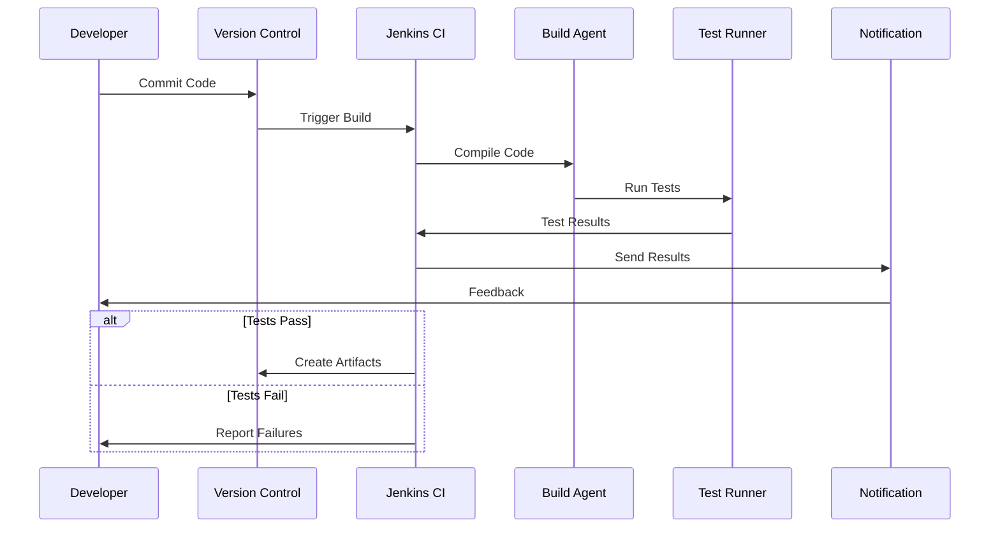
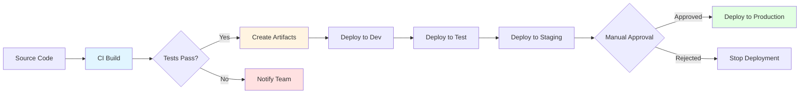
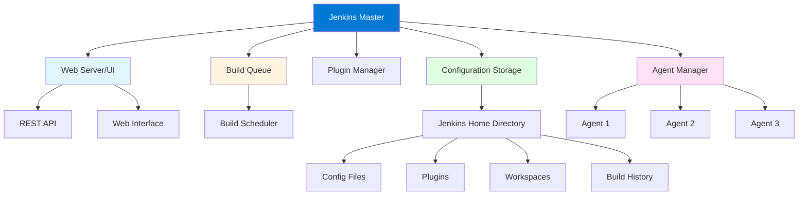
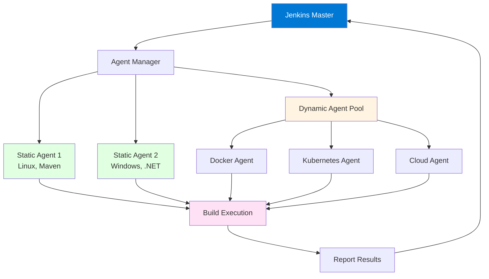
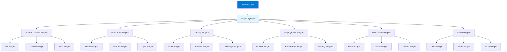

# Module 1: Introduction to Jenkins

## 1.1 What is Jenkins?

### Continuous Integration (CI) Concepts

Continuous Integration (CI) is a software development practice where developers frequently integrate their code changes into a shared repository, and automated builds and tests are run to detect integration errors as quickly as possible. The primary goal of CI is to catch bugs early, reduce integration problems, and provide rapid feedback to developers about the quality of their code. In a CI environment, every code commit triggers an automated build process that compiles the code, runs tests, and performs various quality checks.

The fundamental principle of CI is that integration should happen frequently—ideally, every time a developer commits code. This frequent integration means that problems are discovered quickly, when they're easiest to fix, rather than accumulating and causing major issues later. CI requires a robust automated build system that can compile code, run tests, and provide feedback quickly. The build process should be fast enough that developers get feedback within minutes of committing code, allowing them to fix issues immediately while the context is still fresh in their minds.

CI practices have evolved to include not just compilation and basic testing, but also code analysis, security scanning, dependency checking, and other quality gates. Modern CI systems like Jenkins can run these checks in parallel, providing comprehensive feedback quickly. The CI process creates artifacts that are ready for deployment, ensuring that the code that passes CI is in a deployable state. This foundation makes it possible to implement continuous delivery and deployment practices.

#### Continuous Integration Flow



### Continuous Delivery (CD) Concepts

Continuous Delivery (CD) extends CI by ensuring that code is always in a deployable state and can be released to production at any time with minimal manual intervention. The key difference between CI and CD is that CD includes the deployment process, automatically deploying code to staging or pre-production environments after successful CI. CD requires that the entire process from code commit to deployment be automated, reliable, and repeatable.

In a CD pipeline, code that passes CI is automatically deployed to one or more environments, typically starting with development, then test, staging, and finally production. Each environment deployment may require manual approval, especially for production, but the deployment process itself is automated. This automation ensures consistency across environments and reduces the risk of human error during deployment. CD pipelines also typically include automated testing in each environment to verify that deployments are successful.

The goal of CD is to make releases routine, low-risk events that can be performed on demand. By automating deployments and ensuring code is always deployable, teams can release software more frequently, respond to market demands faster, and reduce the stress and risk associated with manual deployments. CD doesn't mean that every change goes to production automatically; it means that the process is automated and code is always ready for production release when the business decides to deploy it.

#### Continuous Delivery Pipeline Flow



### Jenkins History and Evolution

Jenkins was originally created by Kohsuke Kawaguchi in 2004 as a project called Hudson while working at Sun Microsystems. Hudson was an open-source continuous integration server that quickly gained popularity in the Java development community. In 2011, after Oracle acquired Sun Microsystems, a dispute arose over the project's governance, leading to a fork of the project. The community chose to fork Hudson and rename it to Jenkins, while Oracle continued to develop Hudson separately. Jenkins quickly became the dominant fork and is now the most widely used CI/CD tool in the industry.

Since its inception, Jenkins has evolved significantly. Initially focused on Java projects, Jenkins now supports virtually every programming language and technology stack. The introduction of Jenkins Pipeline in 2016 marked a major milestone, enabling "Pipeline as Code" where build and deployment processes are defined in code files stored in version control. This shift made Jenkins pipelines versionable, reviewable, and testable, aligning with modern DevOps practices.

Jenkins has continued to evolve with features like Blue Ocean (a modern UI), Jenkins X (for cloud-native applications), and extensive plugin ecosystem. The Jenkins community is one of the largest and most active in open-source software, with thousands of plugins available and millions of users worldwide. Jenkins remains the most popular CI/CD tool despite competition from newer tools, largely due to its flexibility, extensibility, and strong community support.

### Jenkins vs. Other CI/CD Tools

Jenkins competes with various CI/CD tools, each with its own strengths and weaknesses. GitLab CI/CD is integrated into GitLab and provides a seamless experience for teams using GitLab. GitHub Actions is tightly integrated with GitHub and provides native CI/CD capabilities. Azure DevOps Pipelines is Microsoft's cloud-based CI/CD solution with deep Azure integration. CircleCI and Travis CI are cloud-hosted CI/CD services that require minimal setup. Each tool has different characteristics that make it suitable for different scenarios.

Jenkins's primary advantages include its open-source nature, extensive plugin ecosystem, flexibility, and ability to run on-premises or in the cloud. Jenkins can be customized extensively through plugins and can integrate with virtually any tool or service. However, Jenkins can be complex to set up and maintain, especially for teams new to CI/CD. Cloud-hosted alternatives often provide easier setup and maintenance but may offer less flexibility and customization.

#### Comparison Table: Jenkins vs. Other CI/CD Tools

| Feature | Jenkins | GitLab CI/CD | GitHub Actions | Azure Pipelines | CircleCI |
|---------|---------|-------------|----------------|-----------------|----------|
| **Deployment** | On-premises or cloud | Cloud or self-hosted | Cloud | Cloud | Cloud |
| **Setup Complexity** | High | Medium | Low | Low | Low |
| **Plugin Ecosystem** | Extensive | Limited | Limited | Moderate | Limited |
| **Cost** | Free (self-hosted) | Free tier available | Free for public repos | Free tier available | Free tier available |
| **Flexibility** | Very High | High | Medium | High | Medium |
| **Learning Curve** | Steep | Moderate | Low | Moderate | Low |
| **Community** | Very Large | Large | Very Large | Large | Medium |
| **Best For** | Complex, customizable needs | GitLab users | GitHub users | Azure users | Simple cloud CI |

### Key Benefits and Use Cases

Jenkins provides numerous benefits that make it an attractive choice for CI/CD automation. One of the primary advantages is its open-source nature, which means it's free to use and can be customized to meet specific needs. Jenkins's extensive plugin ecosystem provides thousands of plugins that extend functionality for virtually any use case. Jenkins can run on-premises, giving organizations complete control over their CI/CD infrastructure, or in the cloud for easier management.

Jenkins excels in several key use cases. For organizations with complex build requirements or unique toolchains, Jenkins's flexibility and extensibility make it ideal. For teams that need to integrate with many different tools and services, Jenkins's plugin ecosystem provides ready-made integrations. For organizations with strict security or compliance requirements, Jenkins's ability to run on-premises provides control over data and infrastructure. For teams that want to customize their CI/CD processes extensively, Jenkins provides the flexibility to implement any workflow.

Jenkins is particularly valuable for organizations that need to support multiple programming languages, build tools, and deployment targets. Its plugin ecosystem ensures that teams can find plugins for their specific needs, and if a plugin doesn't exist, teams can create custom plugins. Jenkins's ability to run distributed builds across multiple agents makes it scalable for large organizations with many projects and builds.

---

## 1.2 Jenkins Architecture

### Master Node Architecture

The Jenkins master node is the central control unit that manages the entire Jenkins system. It coordinates all build activities, manages agent nodes, schedules builds, and serves the web UI. The master node contains several key components: the Jenkins web server, which provides the user interface and REST API; the build queue, which manages pending builds; the executor, which can run builds directly on the master (though this is not recommended for production); and the plugin manager, which handles plugin installation and updates.

The master node stores all configuration, build history, and artifacts. It maintains the Jenkins home directory (typically `~/.jenkins` or `/var/jenkins_home`), which contains configuration files, plugins, workspace data, and build logs. The master node communicates with agent nodes to distribute build workloads. In a typical production setup, the master node should not run builds directly; instead, it should delegate all build execution to agent nodes to avoid performance issues and resource contention.

The master node architecture is designed to be stateless where possible, with state stored in the Jenkins home directory. This design allows for easier backup, restore, and migration. However, the master node is a single point of failure in a standard Jenkins setup, which is why high-availability configurations use multiple master nodes with shared storage or Jenkins controllers in Jenkins 2.x terminology.

#### Jenkins Master Node Architecture



### Agent/Worker Node Architecture

Jenkins agents (also called workers or slaves in older versions) are machines that execute build jobs on behalf of the master node. Agents connect to the master node and wait for build instructions. When the master schedules a build, it sends the build instructions to an available agent that matches the build requirements (such as having specific tools installed or being on a specific operating system). The agent executes the build, reports progress back to the master, and sends build artifacts back when the build completes.

Agents can be static (permanently configured machines) or dynamic (provisioned on-demand, such as Docker containers or cloud instances). Static agents are always available and are suitable for builds that need specific hardware or software configurations. Dynamic agents are created when needed and destroyed after builds complete, making them cost-effective for cloud environments. Agents can run on various operating systems (Linux, Windows, macOS) and can have different capabilities (different tools, different resource allocations).

The agent architecture allows Jenkins to scale horizontally by adding more agents as build load increases. Agents can be distributed across different data centers, cloud regions, or even different cloud providers, providing geographic distribution and redundancy. The master node manages agent lifecycle, monitors agent health, and automatically removes unhealthy agents from the available pool.

#### Jenkins Agent Architecture



### Distributed Builds

Distributed builds are a core feature of Jenkins that allows builds to run on agent nodes instead of the master node. This distribution provides several benefits: it allows Jenkins to scale to handle many concurrent builds, it enables builds to run on different operating systems and architectures, it isolates build environments, and it prevents build workloads from impacting the master node's performance. Distributed builds are essential for production Jenkins installations.

The distributed build process works as follows: when a build is triggered, the master node checks the build requirements (such as which agent label is needed) and finds an available agent that matches those requirements. The master sends the build instructions to the agent, including which source code to check out, which build steps to execute, and where to send artifacts. The agent executes the build, streaming console output back to the master in real-time. When the build completes, the agent sends build artifacts and test results back to the master.

Distributed builds can be configured with various strategies for agent selection. The master can use labels to match builds to agents with specific capabilities, use node affinity to prefer certain agents, or use load balancing to distribute builds evenly across agents. This flexibility allows organizations to optimize their build infrastructure for their specific needs.

### Jenkins Components

Jenkins consists of several key components that work together to provide CI/CD functionality. The web server component provides the user interface and REST API that users and external systems interact with. The build executor component manages the execution of builds, either on the master node or by delegating to agents. The plugin manager component handles plugin installation, updates, and lifecycle management. The configuration system stores and manages all Jenkins configuration, including job definitions, system settings, and credentials.

The workspace manager component manages the file system areas where builds execute. Each job gets its own workspace directory where source code is checked out and builds are executed. The artifact manager component handles storage and retrieval of build artifacts. The notification system sends notifications about build status through various channels (email, Slack, etc.). The security system manages authentication and authorization, controlling who can access Jenkins and what they can do.

These components are designed to work together seamlessly, but they can also be extended and customized through plugins. Understanding these components helps administrators configure Jenkins effectively and troubleshoot issues when they arise.

### Jenkins Plugins Ecosystem

Jenkins's plugin ecosystem is one of its greatest strengths. With over 1,800 plugins available, Jenkins can integrate with virtually any tool, service, or technology. Plugins extend Jenkins functionality in areas such as source control (Git, SVN, Mercurial), build tools (Maven, Gradle, npm), testing frameworks (JUnit, TestNG, pytest), deployment targets (Docker, Kubernetes, cloud services), and notifications (email, Slack, Teams).

The plugin ecosystem is maintained by the Jenkins community, with plugins developed by both the Jenkins project and third-party contributors. Plugins are distributed through the Jenkins Update Center, which provides a centralized repository for plugin discovery and installation. The plugin system is designed to be extensible, allowing developers to create custom plugins for specific needs.

Plugins can be categorized into several types: build steps (that execute during builds), publishers (that publish results or artifacts), triggers (that trigger builds), notifiers (that send notifications), and wrappers (that modify the build environment). Understanding the plugin ecosystem helps teams find the right plugins for their needs and understand how to extend Jenkins functionality.

#### Jenkins Plugin Ecosystem Overview



---

## 1.3 Getting Started with Jenkins

### Jenkins Installation Options

Jenkins can be installed in various ways depending on your environment and requirements. The most common installation methods include: standalone installation using the Jenkins WAR file, which can be run with `java -jar jenkins.war`; installation as a service on Linux using systemd or on Windows as a Windows service; Docker installation using the official Jenkins Docker image; Kubernetes installation using Helm charts or Kubernetes manifests; and cloud installations on AWS, Azure, or GCP using managed services or virtual machines.

Each installation method has its advantages. Standalone installation is the simplest and is good for learning and development. Service installation provides better integration with the operating system and automatic startup. Docker installation provides isolation and easy deployment. Kubernetes installation provides scalability and high availability. Cloud installations provide managed infrastructure and easy scaling. The choice of installation method depends on your infrastructure, requirements, and expertise.

For production environments, service installation or containerized installation (Docker/Kubernetes) is typically recommended. These methods provide better process management, automatic restarts, and easier maintenance. For development and learning, standalone installation is often sufficient and provides the quickest way to get started.

### Installing Jenkins on Different Platforms

Installing Jenkins on Linux typically involves downloading the Jenkins repository package, installing it using the package manager (apt for Debian/Ubuntu, yum for RHEL/CentOS), and starting the Jenkins service. The installation process sets up Jenkins to run as a service, creates the jenkins user, and configures Jenkins to start automatically on boot. After installation, you access Jenkins through a web browser, typically on port 8080.

Installing Jenkins on Windows involves downloading the Jenkins Windows installer, running the installer, and following the setup wizard. The installer sets up Jenkins as a Windows service and configures it to start automatically. Windows installation is similar to Linux installation in terms of the initial setup process, but Windows-specific considerations include file path handling, service account configuration, and integration with Windows authentication.

Installing Jenkins on macOS can be done using Homebrew (`brew install jenkins`), which installs Jenkins as a service that can be managed using `brew services`. Alternatively, Jenkins can be run using the WAR file directly. macOS installation is typically straightforward, but considerations include Java version compatibility and file permissions.

Docker installation involves pulling the official Jenkins image (`docker pull jenkins/jenkins:lts`) and running a container with appropriate volume mounts for persistent storage. Docker installation provides isolation and makes it easy to run multiple Jenkins instances or to move Jenkins between environments. Kubernetes installation uses Helm charts or Kubernetes manifests to deploy Jenkins in a Kubernetes cluster, providing scalability and high availability.

### Initial Jenkins Setup

The initial Jenkins setup begins when you first access Jenkins after installation. You'll be prompted to unlock Jenkins by entering an initial administrator password, which is displayed in the Jenkins log file or on the setup screen. After unlocking Jenkins, you'll be guided through the setup wizard, which includes installing recommended plugins or selecting specific plugins to install.

The setup wizard installs essential plugins that provide core functionality like Git integration, pipeline support, and build tools. You can choose to install the suggested plugins (recommended for beginners) or select plugins manually (for advanced users who know what they need). After plugin installation, you'll create the first administrator user account, which will be used to log into Jenkins and perform administrative tasks.

The setup wizard also configures the Jenkins URL, which is used for webhooks and notifications. This URL should be accessible from your version control system and other tools that need to communicate with Jenkins. After completing the setup wizard, Jenkins is ready to use, and you can start creating jobs and pipelines.

### Jenkins Dashboard Overview

The Jenkins dashboard is the main interface you see when you log into Jenkins. It provides an overview of your Jenkins instance, including a list of jobs, build status, and system information. The dashboard is organized into several sections: the main navigation menu on the left, the job list in the center, and system information and build queue on the right.

The main navigation menu provides access to different areas of Jenkins: "New Item" for creating jobs, "People" for user management, "Build History" for viewing all builds, "Manage Jenkins" for system configuration, and "My Views" for custom job views. The job list shows all jobs in the current view, with information about the last build status, last build time, and build health indicators.

The dashboard also shows the build executor status, indicating how many builds are currently running and how many executors are available. The build queue shows pending builds that are waiting for an available executor. Understanding the dashboard layout helps you navigate Jenkins efficiently and find the information you need quickly.

### Basic Navigation

Navigating Jenkins involves understanding the main areas and how to move between them. The top navigation bar provides quick access to frequently used features like creating new items, viewing build history, and accessing user settings. The left sidebar provides access to different views and job folders. Clicking on a job name takes you to the job's detail page, where you can see build history, configure the job, and trigger builds.

The job detail page shows information about the job, including build history, workspace contents, and job configuration. From the job detail page, you can trigger a build, view build logs, configure the job, and delete the job. The build detail page shows information about a specific build, including console output, test results, artifacts, and build parameters.

Understanding basic navigation is essential for using Jenkins effectively. The interface is designed to be intuitive, with most actions accessible through context menus or buttons. As you become more familiar with Jenkins, you'll develop navigation patterns that work best for your workflow.

---

## Quick Reference

### Jenkins Concepts
- **CI**: Continuous Integration
- **CD**: Continuous Delivery/Deployment
- **Pipeline**: Automated build and deployment process
- **Job**: Build configuration
- **Agent**: Build executor

### Common Commands
```bash
# Start Jenkins (standalone)
java -jar jenkins.war

# Start Jenkins (Docker)
docker run -p 8080:8080 jenkins/jenkins:lts

# Jenkins URL
http://localhost:8080
```

---

## Common Pitfalls

### Pitfall 1: Not Understanding CI/CD Concepts
**Problem**: Confusion about CI vs CD, improper pipeline design
**Solution**: Study CI/CD fundamentals first
**Prevention**: Understand concepts before implementation

### Pitfall 2: Over-Complicating Initial Setup
**Problem**: Too many plugins, complex configuration
**Solution**: Start simple, add complexity gradually
**Prevention**: Install only essential plugins initially

### Pitfall 3: Not Securing Jenkins
**Problem**: Security vulnerabilities, unauthorized access
**Solution**: Configure authentication, use security best practices
**Prevention**: Secure Jenkins from the start

---

## Best Practices

1. **Start Simple**: Begin with basic jobs, add complexity gradually
2. **Use Pipelines**: Prefer Pipeline jobs over freestyle
3. **Version Control**: Store pipeline code in Git
4. **Use Plugins Wisely**: Install only needed plugins
5. **Secure Jenkins**: Configure authentication and authorization
6. **Monitor Performance**: Track build times and resource usage
7. **Backup Configuration**: Regular backups of Jenkins data
8. **Document Pipelines**: Clear comments and documentation
9. **Use Agents**: Scale with build agents
10. **Follow CI/CD Principles**: Frequent integration, automated testing

---

## Further Reading

### Official Documentation
- [Jenkins Documentation](https://www.jenkins.io/doc/)
- [Getting Started](https://www.jenkins.io/doc/book/getting-started/)
- [Pipeline Tutorial](https://www.jenkins.io/doc/pipeline/tour/hello-world/)

### Related Topics
- Installation and Configuration (Module 2)
- Jobs and Builds (Module 3)
- Pipeline Declarative (Module 4)

---

*This module provides a comprehensive introduction to Jenkins, covering its purpose, architecture, and getting started. Understanding these fundamentals is essential for effectively using Jenkins for CI/CD automation.*

