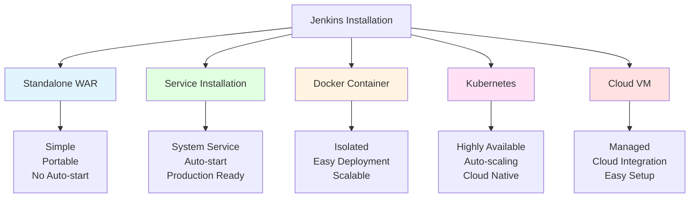
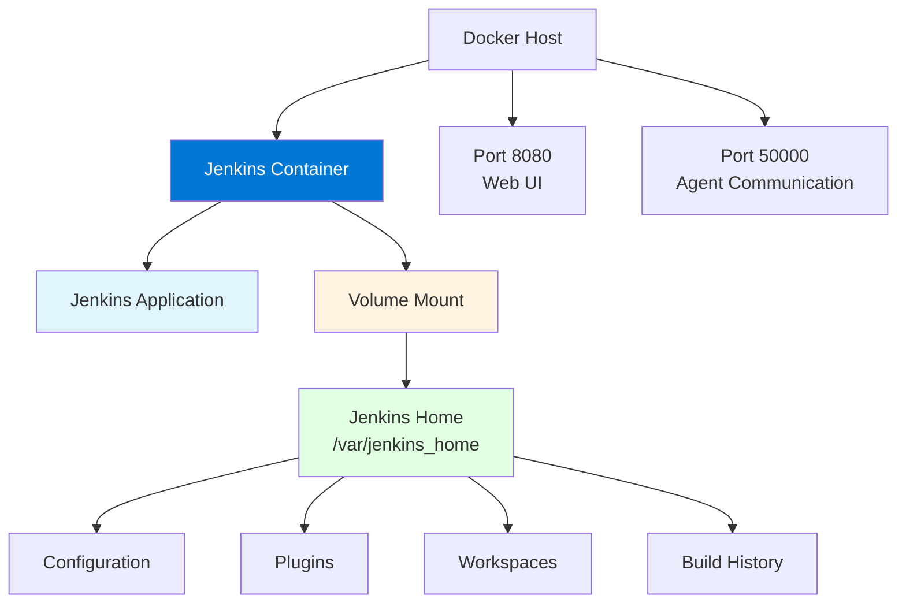
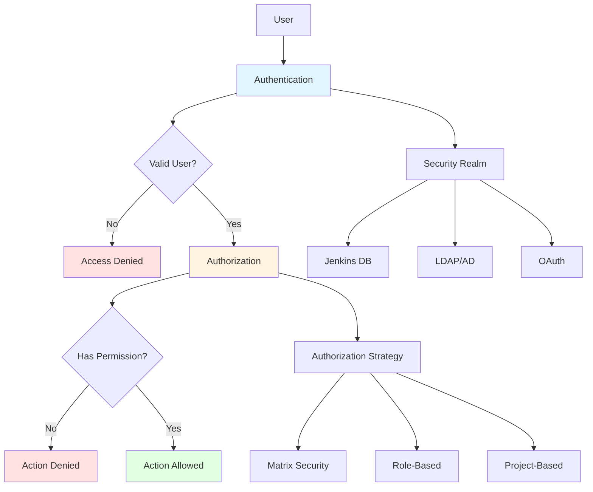
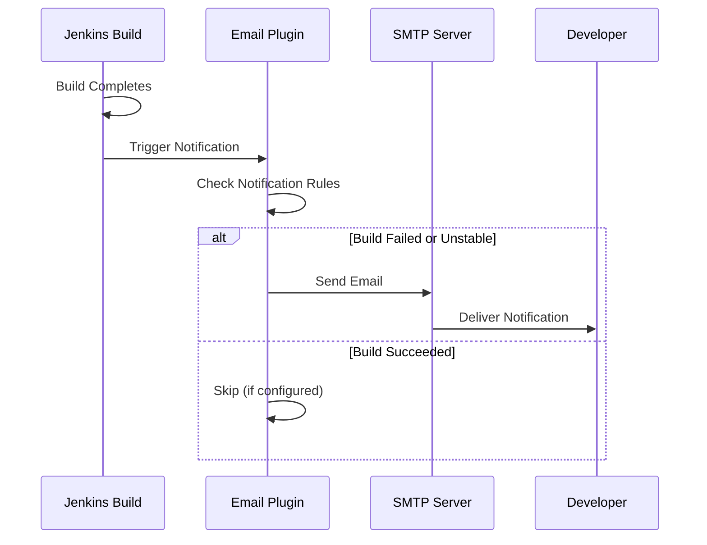

# Module 2: Jenkins Installation and Configuration

## 2.1 Installation Methods

### Standalone Installation

Standalone installation of Jenkins involves downloading the Jenkins WAR (Web Application Archive) file and running it directly using Java. This is the simplest installation method and is ideal for learning, development, or quick testing. To install Jenkins standalone, you download the latest WAR file from the Jenkins website, ensure you have Java installed (Java 8 or Java 11 LTS recommended), and run the command `java -jar jenkins.war`. Jenkins will start and be accessible on port 8080 by default.

The standalone installation is portable and doesn't require system-level configuration, making it easy to run multiple Jenkins instances or to move Jenkins between machines. However, standalone installation doesn't provide automatic startup on system boot, and the Jenkins process will stop if the terminal session is closed (unless run in the background or using a process manager). For production use, service installation or containerized installation is typically preferred.

Standalone installation is useful for development environments, testing new Jenkins versions, or running Jenkins in environments where you don't have administrative privileges to install services. The WAR file can be run with custom options, such as specifying a different port (`--httpPort=9090`), changing the Jenkins home directory (`--jenkinsHome=/custom/path`), or enabling HTTPS.

#### Jenkins Installation Methods Comparison



### Docker Installation

Docker installation of Jenkins involves running Jenkins in a Docker container using the official Jenkins Docker image. This method provides isolation, easy deployment, and the ability to run multiple Jenkins instances. To install Jenkins using Docker, you pull the official image (`docker pull jenkins/jenkins:lts`) and run a container with volume mounts for persistent storage.

Docker installation provides several advantages: containers are isolated from the host system, making it easier to manage dependencies and avoid conflicts; containers can be easily moved between environments; multiple Jenkins instances can run on the same host without interference; and container orchestration tools like Docker Compose or Kubernetes can manage Jenkins lifecycle. Docker installation is well-suited for cloud environments and modern infrastructure practices.

The Docker installation requires mounting a volume for the Jenkins home directory to persist data across container restarts. A typical Docker run command looks like: `docker run -p 8080:8080 -p 50000:50000 -v jenkins_home:/var/jenkins_home jenkins/jenkins:lts`. The volume mount ensures that Jenkins configuration, plugins, and build history are preserved even if the container is recreated.

#### Docker Installation Architecture



### Kubernetes Installation

Kubernetes installation of Jenkins involves deploying Jenkins in a Kubernetes cluster using Helm charts or Kubernetes manifests. This method provides high availability, automatic scaling, and integration with Kubernetes-native features. Kubernetes installation is ideal for cloud-native environments and organizations using Kubernetes for container orchestration.

Kubernetes installation typically uses Helm, a package manager for Kubernetes, to deploy Jenkins. The Jenkins Helm chart handles creating the necessary Kubernetes resources: deployments for the Jenkins master, services for networking, persistent volume claims for storage, and ingress for external access. The Helm chart can be customized to configure Jenkins settings, resource limits, and high-availability options.

Kubernetes installation provides several benefits: automatic pod restarts if Jenkins crashes, horizontal scaling by running multiple Jenkins pods, integration with Kubernetes secrets for credential management, and the ability to use Kubernetes agents for builds. Kubernetes installation is more complex than other methods but provides the best scalability and reliability for large-scale deployments.

### Cloud Installations (AWS, Azure, GCP)

Cloud installations of Jenkins involve deploying Jenkins on cloud virtual machines or using managed services. Each cloud provider offers different options: AWS provides EC2 instances where you can install Jenkins, Azure provides Azure VMs, and GCP provides Compute Engine instances. Alternatively, you can use container services like AWS ECS, Azure Container Instances, or GCP Cloud Run.

Cloud installations provide managed infrastructure, automatic backups (if configured), easy scaling, and integration with cloud services. Cloud installations are ideal for organizations that want to avoid managing physical infrastructure and prefer cloud-based solutions. However, cloud installations require cloud accounts and may incur ongoing costs.

Each cloud provider has specific considerations: AWS installations can integrate with IAM for authentication, Azure installations can integrate with Azure AD, and GCP installations can integrate with Google Cloud IAM. Understanding cloud-specific features helps you configure Jenkins optimally for your cloud environment.

#### Cloud Installation Options

| Cloud Provider | VM Option | Container Option | Managed Service | Key Features |
|---------------|-----------|------------------|-----------------|--------------|
| **AWS** | EC2 | ECS, EKS | None | IAM integration, S3 storage |
| **Azure** | Azure VM | ACI, AKS | None | Azure AD integration, Azure Storage |
| **GCP** | Compute Engine | Cloud Run, GKE | None | Google Cloud IAM, Cloud Storage |

### Installation Best Practices

Installation best practices ensure that Jenkins is set up correctly, securely, and maintainably. Key practices include: using the LTS (Long Term Support) version for production, which provides stability and long-term support; configuring proper resource limits (CPU and memory) to prevent Jenkins from consuming excessive resources; setting up persistent storage for the Jenkins home directory to preserve data; configuring automatic backups to protect against data loss; and using service installation or containerized installation for production environments.

Security best practices during installation include: running Jenkins with a dedicated user account (not root), configuring firewall rules to restrict access, enabling HTTPS for secure communication, and setting up proper authentication and authorization from the start. Performance best practices include: allocating sufficient resources (at least 2GB RAM for small instances, more for larger installations), using SSD storage for better I/O performance, and configuring the Java heap size appropriately.

Maintenance best practices include: keeping Jenkins and plugins updated regularly, monitoring disk space usage (build artifacts can consume significant space), setting up log rotation, and documenting your installation configuration. Following these best practices helps ensure a stable, secure, and maintainable Jenkins installation.

---

## 2.2 Initial Configuration

### First-Time Setup

The first-time setup of Jenkins begins when you access Jenkins after installation. You'll be prompted to unlock Jenkins by entering an initial administrator password. This password is displayed in the Jenkins log file (typically at `/var/jenkins_home/secrets/initialAdminPassword` for service installations or in the container logs for Docker installations). The initial password is a security measure to ensure that only someone with access to the Jenkins server can complete the setup.

After unlocking Jenkins, you'll be guided through the setup wizard. The first step is choosing whether to install suggested plugins or select plugins manually. The suggested plugins option installs a curated set of plugins that provide essential functionality for most use cases, including Git integration, pipeline support, and build tools. The custom option allows you to select specific plugins, which is useful if you know exactly what you need or want to minimize the initial plugin set.

After plugin installation, you'll create the first administrator user account. This account will have full administrative privileges and will be used to manage Jenkins. You should use a strong password and store the credentials securely. The setup wizard also configures the Jenkins URL, which should be the publicly accessible URL that Jenkins will use for webhooks and notifications. This URL is important for integrations with version control systems and other tools.

### Plugin Installation

Plugin installation is a crucial part of Jenkins setup, as plugins extend Jenkins functionality. During initial setup, you can install suggested plugins or select plugins manually. After initial setup, you can install additional plugins through the Jenkins UI by going to "Manage Jenkins" > "Manage Plugins" > "Available" tab, searching for plugins, selecting them, and clicking "Install without restart" or "Download now and install after restart".

Plugins can be categorized by function: source control plugins (Git, SVN), build tool plugins (Maven, Gradle), testing plugins (JUnit, TestNG), deployment plugins (Docker, Kubernetes), notification plugins (Email, Slack), and many others. When selecting plugins, consider your technology stack and requirements. It's better to install plugins as needed rather than installing everything upfront, as too many plugins can slow down Jenkins and create maintenance overhead.

Plugin management includes keeping plugins updated, as updates often include bug fixes and security patches. You can update plugins through the "Manage Plugins" > "Updates" tab. However, be cautious with updates in production environments, as plugin updates can sometimes introduce breaking changes. It's a good practice to test plugin updates in a development environment first.

### User Management

User management in Jenkins controls who can access Jenkins and what they can do. Jenkins supports several authentication methods: Jenkins' own user database, LDAP/Active Directory integration, GitHub OAuth, and others. During initial setup, you create the first administrator user. After that, you can create additional users through "Manage Jenkins" > "Manage Users" > "Create User".

User management involves creating user accounts, assigning roles and permissions, and managing user access. Jenkins uses an authorization strategy to control what users can do. Common authorization strategies include: "Logged-in users can do anything" (not recommended for production), "Matrix-based security" (fine-grained permissions), and "Role-Based Strategy" (role-based access control using the Role-Based Authorization Strategy plugin).

Best practices for user management include: using external authentication (LDAP/AD) for enterprise environments to avoid managing user accounts separately, implementing the principle of least privilege (granting only necessary permissions), regularly reviewing user access, and disabling or removing accounts for users who no longer need access. Proper user management is essential for Jenkins security.

### Security Configuration

Security configuration in Jenkins involves setting up authentication, authorization, and other security measures. Authentication determines who can log into Jenkins, while authorization determines what logged-in users can do. Security configuration is accessed through "Manage Jenkins" > "Configure Global Security".

Key security settings include: enabling security (which should always be enabled in production), configuring the security realm (authentication method), configuring the authorization strategy (permission model), setting up CSRF protection (to prevent cross-site request forgery attacks), and configuring agent security (to secure communication between master and agents).

Additional security measures include: configuring HTTPS for secure communication, setting up API tokens for programmatic access (instead of using passwords), enabling audit logging to track security-relevant events, and regularly updating Jenkins and plugins to get security patches. Security configuration should be done early in the Jenkins setup process and reviewed regularly.

#### Jenkins Security Architecture



### System Configuration

System configuration in Jenkins involves setting up global settings that apply to all jobs and the Jenkins system itself. System configuration is accessed through "Manage Jenkins" > "Configure System". Key configuration areas include: system message (displayed on the Jenkins dashboard), number of executors (how many builds can run simultaneously on the master), quiet period (delay before starting builds), SCM checkout retry count, and global properties (environment variables available to all builds).

Tool configuration involves setting up global installations of build tools like JDK, Maven, Gradle, Git, Docker, and others. These tools are configured globally but can be used by individual jobs. Tool configuration allows you to specify multiple versions of the same tool, and jobs can select which version to use. This is useful for supporting multiple projects that require different tool versions.

Email configuration sets up SMTP settings for email notifications. Jenkins can send email notifications about build status, and proper email configuration ensures these notifications are delivered. Email configuration includes SMTP server settings, authentication credentials, and email templates. System configuration should be done after initial setup and reviewed periodically as requirements change.

---

## 2.3 Jenkins Configuration

### Global Tool Configuration

Global tool configuration in Jenkins allows you to define installations of various tools that can be used by jobs. These tools include: JDK (Java Development Kit) for Java builds, build tools like Maven, Gradle, Ant, and build tools for other languages like Node.js, Python, Go, and .NET. Tool configuration is accessed through "Manage Jenkins" > "Global Tool Configuration".

When configuring tools, you can specify: the tool name (used to reference the tool in jobs), the installation path (for tools already installed on the system), or automatic installation (where Jenkins downloads and installs the tool automatically). Automatic installation is convenient but requires internet access and may be slower than using pre-installed tools.

Tool configuration allows you to define multiple versions of the same tool. For example, you can configure both Java 8 and Java 11, and jobs can select which version to use. This flexibility is essential for organizations that need to support multiple projects with different requirements. Tool configuration should be done early in Jenkins setup and updated as new tool versions are needed.

### JDK Configuration

JDK (Java Development Kit) configuration is essential since Jenkins itself runs on Java, and many builds require Java. You can configure multiple JDK installations, allowing different jobs to use different Java versions. JDK configuration includes specifying the JDK name (for reference in jobs), the JAVA_HOME path (where Java is installed), or enabling automatic installation from adoptium.net or other sources.

For production environments, it's recommended to use pre-installed JDK versions rather than automatic installation, as this provides more control and faster builds. You should configure at least the LTS (Long Term Support) versions of Java that your projects require. Common versions include Java 8, Java 11, and Java 17, which are LTS versions with long-term support.

JDK configuration also includes setting the default JDK that Jenkins itself uses. This is configured separately from build tool JDKs and affects Jenkins's own Java runtime. The JDK used by Jenkins should be a stable, supported version. Jenkins typically works well with Java 8, Java 11, or Java 17 LTS versions.

### Build Tools Configuration (Maven, Gradle, npm)

Build tools configuration allows you to set up Maven, Gradle, npm, and other build tools that jobs will use. For Maven, you configure the Maven installation name and path (or enable automatic installation). Maven configuration is important for Java projects that use Maven for dependency management and building. You can configure multiple Maven versions to support different projects.

Gradle configuration is similar to Maven configuration. Gradle is another popular build tool for Java projects and is also used for other languages. Gradle configuration includes specifying the Gradle installation path or enabling automatic installation. Like Maven, you can configure multiple Gradle versions.

npm (Node Package Manager) configuration is important for Node.js projects. npm is typically installed as part of Node.js, so Node.js configuration includes npm. You configure Node.js installations, and npm is available automatically. Node.js configuration is essential for JavaScript/TypeScript projects, and you may need multiple Node.js versions to support different projects.

#### Build Tools Configuration Example

```groovy
// Example: Configuring tools in Jenkinsfile
pipeline {
    agent any
    tools {
        maven 'Maven-3.8.6'
        jdk 'JDK-11'
        nodejs 'NodeJS-18'
    }
    stages {
        stage('Build') {
            steps {
                sh 'mvn clean package'
                sh 'npm install'
            }
        }
    }
}
```

### Version Control Configuration

Version control configuration in Jenkins involves setting up connections to version control systems like Git, SVN, Mercurial, and others. While individual jobs configure their own repositories, global version control configuration can set defaults and shared credentials. Git configuration includes setting up Git installations (if Git is not in the system PATH) and configuring Git global settings.

Version control credentials are managed separately through the Jenkins credential system. You can configure credentials for accessing private repositories, and these credentials can be shared across multiple jobs. Credential configuration includes: username/password combinations, SSH keys for Git, and OAuth tokens for services like GitHub.

Version control configuration also includes setting up webhook endpoints for triggering builds automatically when code is pushed. Webhook configuration requires the Jenkins URL to be correctly configured so that version control systems can reach Jenkins. Proper version control configuration ensures that jobs can check out code reliably and that builds are triggered automatically.

### Email Notification Setup

Email notification setup configures Jenkins to send email notifications about build status. Email configuration is done in "Manage Jenkins" > "Configure System" under the "E-mail Notification" section. Configuration includes: SMTP server address, SMTP port (typically 25, 465 for SSL, or 587 for TLS), SMTP authentication (username and password if required), and the "From" email address.

Email notifications can be sent for various events: build failures, build successes after failures (fixed builds), unstable builds, and always (for every build). Email notifications help teams stay informed about build status without constantly checking Jenkins. However, too many email notifications can lead to notification fatigue, so it's important to configure notifications appropriately.

Email configuration can also include custom email templates that format notifications in a specific way. Advanced email configuration includes: using different SMTP servers for different purposes, configuring email plugins for richer notifications, and setting up email distribution lists. Email notification setup should be tested after configuration to ensure emails are being delivered correctly.

#### Email Notification Flow



---

## 2.4 Jenkins Security

### Security Realms

Security realms in Jenkins determine how users authenticate to Jenkins. Jenkins supports several security realm types: "Jenkins' own user database" (users managed within Jenkins), "LDAP" (Lightweight Directory Access Protocol for enterprise directories), "Active Directory" (Microsoft's directory service), "Unix user/group database" (for Unix systems), "GitHub OAuth" (authentication via GitHub), and "Delegation to servlet container" (using container authentication).

The choice of security realm depends on your organization's infrastructure. For small teams or development environments, Jenkins' own user database may be sufficient. For enterprise environments, LDAP or Active Directory integration is typically preferred, as it allows users to use their existing corporate credentials and provides centralized user management. GitHub OAuth is useful for open-source projects or teams that primarily use GitHub.

Security realm configuration is done in "Manage Jenkins" > "Configure Global Security" under the "Security Realm" section. The configuration varies by realm type: LDAP configuration requires LDAP server details and search bases, Active Directory configuration requires domain information, and GitHub OAuth requires OAuth application credentials. Proper security realm configuration is essential for Jenkins security and user experience.

### Authorization Strategies

Authorization strategies in Jenkins determine what authenticated users can do. Jenkins provides several authorization strategy options: "Anyone can do anything" (no security, not recommended), "Legacy mode" (backward compatibility), "Logged-in users can do anything" (any authenticated user has full access), "Matrix-based security" (fine-grained permissions matrix), "Project-based Matrix Authorization Strategy" (permissions per project), and "Role-Based Strategy" (role-based access control via plugin).

Matrix-based security provides a grid where you can grant or deny specific permissions to users or groups. Permissions include: overall (administrative permissions), credentials (managing credentials), job (creating, configuring, building jobs), run (running builds), view (viewing jobs), and SCM (source control permissions). Matrix-based security provides fine-grained control but can become complex with many users.

Role-Based Strategy (via the Role-Based Authorization Strategy plugin) provides a more manageable approach for larger organizations. It allows you to define roles (such as Developer, Tester, Administrator) and assign permissions to roles, then assign users to roles. This approach is more scalable and easier to maintain than matrix-based security for organizations with many users and complex permission requirements.

#### Authorization Strategy Comparison

| Strategy | Complexity | Scalability | Best For |
|----------|-----------|-------------|----------|
| **Anyone can do anything** | None | N/A | Development only |
| **Logged-in users can do anything** | Low | Low | Small teams |
| **Matrix-based security** | High | Medium | Fine-grained control |
| **Project-based Matrix** | High | High | Multi-project organizations |
| **Role-Based Strategy** | Medium | High | Large organizations |

### User Permissions

User permissions in Jenkins control what individual users can do. Permissions are granted through the authorization strategy configuration. Common permission categories include: overall permissions (administrative access), job permissions (creating, configuring, building, deleting jobs), run permissions (starting, stopping, canceling builds), view permissions (viewing jobs and builds), SCM permissions (checking out code), and credentials permissions (managing credentials).

Permission management should follow the principle of least privilege: users should only have the permissions they need to perform their work. Developers typically need permissions to create and build jobs, view build results, and check out code. Administrators need full permissions to manage Jenkins. Testers might only need permissions to view jobs and build results.

Permission configuration can be done at the global level (applying to all jobs) or at the project level (applying to specific jobs or folders). Project-level permissions are useful for multi-tenant scenarios where different teams work on different projects and should not have access to each other's jobs. Understanding permission management helps you configure Jenkins security appropriately for your organization.

### API Tokens

API tokens in Jenkins provide a secure way for programs and scripts to authenticate to Jenkins without using passwords. API tokens are more secure than passwords because they can be revoked individually, have expiration dates, and are scoped to specific users. API tokens are used for REST API calls, command-line tools, and integrations with other systems.

To create an API token, users go to their user profile page, click "Configure", and then "Add new Token". The token is displayed once and should be stored securely. If a token is compromised, it can be revoked without affecting the user's password or other tokens. API tokens should be used instead of passwords for programmatic access to Jenkins.

API tokens are used in various scenarios: CI/CD pipelines that need to trigger Jenkins builds, monitoring tools that query Jenkins status, deployment scripts that interact with Jenkins, and integrations with other DevOps tools. Using API tokens instead of passwords improves security and makes it easier to manage programmatic access.

### Security Best Practices

Security best practices for Jenkins help protect your CI/CD infrastructure from threats. Key practices include: always enabling security (never use "Anyone can do anything"), using strong authentication (LDAP/AD for enterprises, strong passwords for local users), implementing least privilege (granting only necessary permissions), keeping Jenkins and plugins updated (to get security patches), using HTTPS (to encrypt communication), and restricting network access (firewall rules to limit who can access Jenkins).

Additional security practices include: regularly reviewing user access and removing unused accounts, using API tokens instead of passwords for programmatic access, enabling audit logging to track security-relevant events, scanning for vulnerabilities in build dependencies, securing agent communication (using SSH or encrypted JNLP), and backing up Jenkins configuration regularly.

Security should be considered from the beginning of Jenkins setup and reviewed regularly. Security breaches in CI/CD systems can be particularly damaging, as they can provide attackers with access to source code, credentials, and deployment capabilities. Following security best practices helps protect your Jenkins installation and the systems it integrates with.

---

## Quick Reference

### Installation Methods
- **Standalone**: `java -jar jenkins.war`
- **Docker**: `docker run -p 8080:8080 jenkins/jenkins:lts`
- **Kubernetes**: Helm charts or manifests
- **Service**: Systemd (Linux) or Windows Service

### Configuration Files
- `JENKINS_HOME`: Jenkins data directory
- `config.xml`: Main configuration
- `users/`: User accounts
- `jobs/`: Job configurations

---

## Common Pitfalls

### Pitfall 1: Not Setting JENKINS_HOME
**Problem**: Data loss, configuration issues
**Solution**: Set JENKINS_HOME environment variable
**Prevention**: Configure from installation start

### Pitfall 2: Weak Security Configuration
**Problem**: Security vulnerabilities, unauthorized access
**Solution**: Enable security, use strong authentication
**Prevention**: Secure Jenkins immediately after setup

### Pitfall 3: Not Backing Up Configuration
**Problem**: Lost configuration, difficult recovery
**Solution**: Regular backups of JENKINS_HOME
**Prevention**: Automate backup procedures

---

## Best Practices

1. **Set JENKINS_HOME**: Configure data directory properly
2. **Enable Security**: Never use "Anyone can do anything"
3. **Use Strong Authentication**: LDAP/AD for enterprises
4. **Implement Least Privilege**: Grant minimum permissions
5. **Keep Updated**: Regular Jenkins and plugin updates
6. **Use HTTPS**: Encrypt communication
7. **Backup Regularly**: Automated backup procedures
8. **Monitor Performance**: Track resource usage
9. **Document Configuration**: Clear documentation
10. **Test Changes**: Test configuration changes

---

## Further Reading

### Official Documentation
- [Jenkins Installation](https://www.jenkins.io/doc/book/installing/)
- [Jenkins Configuration](https://www.jenkins.io/doc/book/managing/)
- [Security](https://www.jenkins.io/doc/book/security/)

### Related Topics
- Introduction to Jenkins (Module 1)
- Jobs and Builds (Module 3)
- Best Practices (Module 15)

---

*This module covers Jenkins installation and configuration in detail. Proper installation and configuration are essential for a stable, secure, and maintainable Jenkins installation. Understanding these topics helps you set up Jenkins correctly for your environment and requirements.*

