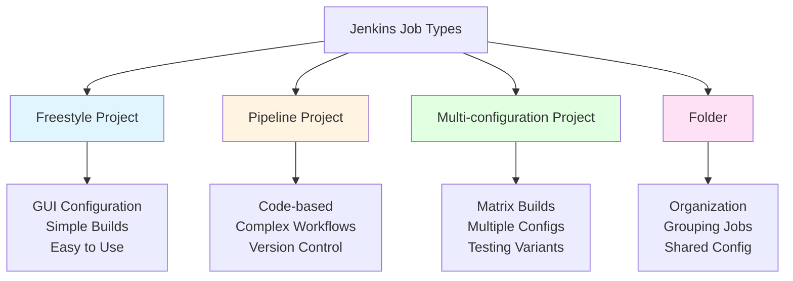
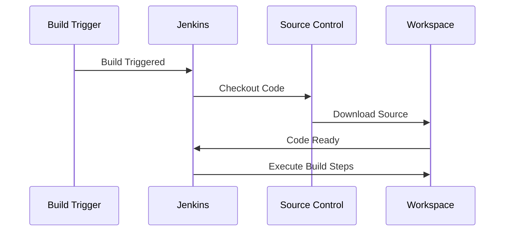
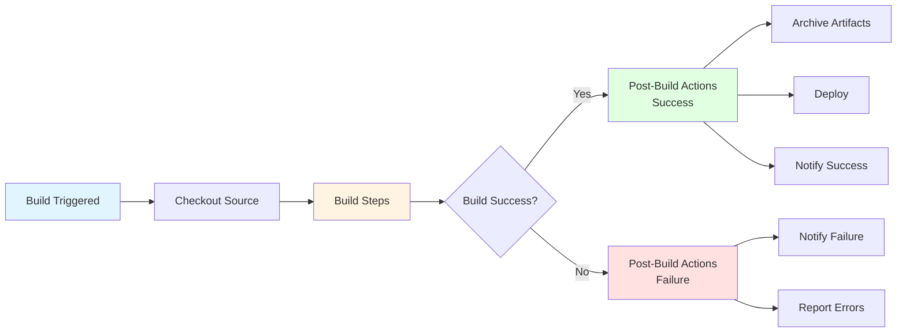
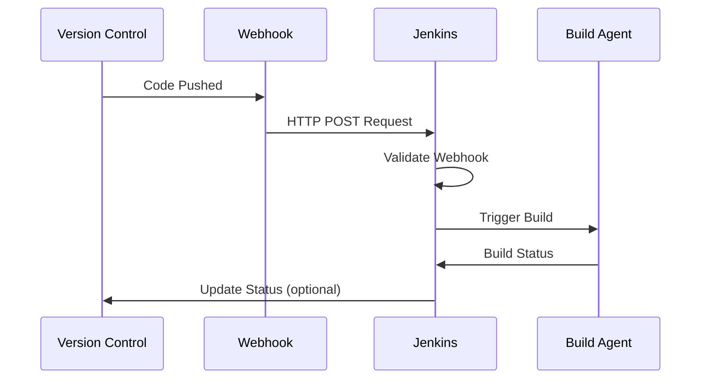

# Module 3: Jenkins Jobs and Builds

## 3.1 Job Types

### Freestyle Projects

Freestyle projects are the traditional Jenkins job type that provides a flexible, GUI-based way to configure builds. Freestyle projects are configured through a web form where you specify source code management, build triggers, build steps, and post-build actions. This job type is intuitive and doesn't require knowledge of any scripting language, making it accessible to users who prefer visual configuration.

Freestyle projects are well-suited for simple build scenarios where the build process is straightforward and doesn't require complex logic. They're ideal for teams getting started with Jenkins or for builds that don't need advanced features like parallel execution or complex conditional logic. However, freestyle projects have limitations: they're harder to version control (configuration is stored in Jenkins, not in code), they don't support complex workflows as easily as pipelines, and they can become difficult to maintain for complex scenarios.

Despite the rise of Pipeline jobs, freestyle projects remain useful for simple builds, one-off tasks, and scenarios where visual configuration is preferred. Many teams use freestyle projects for straightforward builds and pipelines for more complex workflows. Understanding freestyle projects helps you choose the right job type for your needs.

#### Job Types Comparison



### Pipeline Projects

Pipeline projects use Jenkins Pipeline (either Declarative or Scripted) to define builds as code. Pipeline projects store their configuration in a Jenkinsfile that is typically stored in the source code repository alongside the application code. This "Pipeline as Code" approach provides several advantages: pipelines are versioned with your code, pipeline changes go through code review, pipelines can be tested, and pipelines are easier to maintain and share.

Pipeline projects support complex workflows including parallel execution, conditional logic, loops, and integration with external systems. They're the recommended approach for most modern CI/CD scenarios because they provide better maintainability, version control, and flexibility. Pipeline projects can be either Declarative (using a structured syntax) or Scripted (using Groovy for maximum flexibility).

Pipeline projects are ideal for teams practicing DevOps, as they enable infrastructure as code practices for CI/CD. They're also better suited for complex build scenarios that require multiple stages, parallel execution, or integration with multiple systems. Understanding pipeline projects is essential for modern Jenkins usage.

### Multi-Configuration Projects

Multi-configuration projects (also called matrix projects) allow you to run the same build with different combinations of parameters. This is useful for testing applications against multiple configurations, such as different operating systems, different Java versions, different database versions, or different browser versions. Multi-configuration projects automatically create and run builds for each combination of the specified axes.

Multi-configuration projects are particularly useful for testing scenarios where you need to ensure your application works across multiple environments or configurations. For example, you might test a Java application against Java 8, Java 11, and Java 17, or test a web application against Chrome, Firefox, and Safari. Multi-configuration projects automate this testing, running all combinations automatically.

While multi-configuration projects are powerful, they can generate many builds (the product of all axis values), which can consume significant resources. Pipeline projects can also achieve similar results using matrix strategies, which may be more flexible. Understanding multi-configuration projects helps you choose the right approach for matrix builds.

### Folder Organization

Folders in Jenkins provide a way to organize jobs hierarchically, similar to directories in a file system. Folders help manage large numbers of jobs by grouping related jobs together. Folders can contain other folders, creating a tree structure. Folders also support folder-level configuration, such as shared credentials or properties that apply to all jobs in the folder.

Folder organization is essential for large Jenkins installations with many jobs. Good folder organization makes it easier to find jobs, manage permissions, and maintain Jenkins. Common folder organization strategies include: organizing by project or product, organizing by team, organizing by environment (dev, test, prod), or organizing by technology stack.

Folders also support views, which are custom job lists that can filter and organize jobs in specific ways. Views can span multiple folders, providing flexible ways to organize and view jobs. Understanding folder organization helps you structure Jenkins effectively as your number of jobs grows.

### Job Templates

Job templates (via the Job DSL plugin or Configuration as Code plugin) allow you to define job configurations as code and generate jobs from templates. This approach provides several benefits: job configurations are versioned, job creation is automated, job configurations are consistent, and job creation can be part of your infrastructure as code practices.

Job templates are particularly useful for organizations with many similar jobs, as they reduce duplication and ensure consistency. For example, if you have many microservices with similar build processes, you can create a template and generate jobs for each service. Templates can be parameterized, allowing customization while maintaining consistency.

Job templates complement Pipeline projects: templates can generate Pipeline jobs, and Pipeline jobs can use shared libraries for reusable logic. Understanding job templates helps you scale Jenkins job management and maintain consistency across many jobs.

---

## 3.2 Creating Your First Job

### Job Creation Wizard

The job creation wizard guides you through creating a new Jenkins job. To create a job, you click "New Item" in the Jenkins dashboard, enter a job name, select the job type (Freestyle project, Pipeline, etc.), and click "OK". The wizard then takes you to the job configuration page, where you configure the job's settings.

The job creation wizard is straightforward, but understanding the options helps you create jobs correctly from the start. The job name should be descriptive and follow naming conventions. The job type selection determines what configuration options are available. After creating the job, you configure it before running the first build.

The job configuration page is organized into sections: General (basic settings), Source Code Management (where to get code), Build Triggers (when to build), Build Environment (environment setup), Build (build steps), and Post-build Actions (what to do after the build). Understanding this structure helps you configure jobs efficiently.

### Source Code Management

Source Code Management (SCM) configuration tells Jenkins where to get the source code for the build. Jenkins supports many SCM systems including Git, SVN, Mercurial, and others. For Git (the most common), you configure the repository URL, credentials for accessing the repository, the branch to build, and additional options like checking out to a subdirectory or using a specific Git tool.

SCM configuration is essential for automated builds, as Jenkins needs to check out code before building it. The SCM configuration also enables Jenkins to detect changes and trigger builds automatically. For Git repositories, you can configure Jenkins to build specific branches, all branches, or branches matching patterns. You can also configure Jenkins to check out code from pull requests.

SCM credentials are managed separately in Jenkins's credential system. You create credentials (username/password, SSH keys, or tokens) and then reference them in job configuration. This separation allows credentials to be shared across multiple jobs and managed centrally. Understanding SCM configuration is fundamental to using Jenkins effectively.

#### Source Code Management Flow



### Build Triggers

Build triggers determine when Jenkins should start a build. Common trigger types include: "Build periodically" (on a schedule, like nightly builds), "Poll SCM" (checking the repository periodically for changes), "Build after other projects are built" (triggering when other jobs complete), "GitHub hook trigger" (triggering when code is pushed to GitHub), and "Generic webhook trigger" (triggering from external systems).

Build triggers are essential for automation, as they enable Jenkins to start builds automatically without manual intervention. The choice of trigger depends on your workflow: webhook triggers provide the fastest feedback (builds start immediately when code is pushed), polling triggers are simpler to set up but have a delay, and scheduled triggers are useful for periodic tasks like nightly builds or reports.

Webhook triggers are generally preferred for CI scenarios, as they provide immediate feedback. However, webhooks require network configuration (Jenkins must be accessible from the version control system) and proper webhook configuration in the version control system. Understanding build triggers helps you configure automated builds appropriately.

### Build Steps

Build steps are the actions that Jenkins performs during a build. Build steps vary by job type: freestyle projects support various build step types (shell scripts, batch scripts, Maven goals, etc.), while pipeline projects use pipeline steps. Common build steps include: executing shell commands, running Maven goals, running Gradle tasks, executing npm scripts, running tests, and building Docker images.

Build steps are executed sequentially, and if any step fails, the build typically fails (unless configured otherwise). Build steps can be conditional, executing only under certain conditions. Build steps can also access build parameters, environment variables, and workspace files. Understanding build steps helps you create effective build processes.

For freestyle projects, build steps are added through the job configuration UI. For pipeline projects, build steps are defined in the Jenkinsfile using pipeline syntax. Pipeline steps provide more flexibility and can include complex logic, loops, and parallel execution. Understanding both approaches helps you choose the right method for your needs.

### Post-Build Actions

Post-build actions are performed after the build completes, regardless of whether the build succeeded or failed. Common post-build actions include: publishing test results (JUnit, TestNG), publishing code coverage reports, archiving artifacts, sending email notifications, triggering other builds, and deploying applications. Post-build actions help you complete the build process and notify stakeholders.

Post-build actions can be conditional, executing only if the build succeeds, fails, is unstable, or always. This flexibility allows you to configure different actions for different outcomes. For example, you might deploy only on successful builds, send failure notifications only when builds fail, and always archive artifacts.

Post-build actions are essential for complete CI/CD workflows, as they handle the results of builds and integrate builds with other systems. Understanding post-build actions helps you create comprehensive build processes that provide value beyond just compiling code.

#### Build Process Flow



---

## 3.3 Build Configuration

### Build Parameters

Build parameters allow you to make builds configurable by accepting input when builds are triggered. Parameters can be of various types: string (text input), choice (dropdown selection), boolean (checkbox), file (file upload), password (hidden input), and others. Parameters are useful for builds that need different configurations, such as deploying to different environments or building different versions.

Parameters are defined in the job configuration and are available as environment variables during the build. In freestyle projects, you enable "This project is parameterized" and add parameters. In pipeline projects, you use the `parameters` directive. Parameters can have default values, and they can be required or optional.

Parameters enable flexible builds that can be customized for different scenarios without creating separate jobs. For example, a deployment job might have a parameter for the target environment (dev, test, prod), allowing the same job to deploy to different environments. Understanding build parameters helps you create flexible, reusable jobs.

#### Build Parameters Example

```groovy
// Example: Parameterized Pipeline
pipeline {
    agent any
    parameters {
        choice(name: 'ENVIRONMENT', choices: ['dev', 'test', 'prod'], description: 'Target environment')
        string(name: 'VERSION', defaultValue: '1.0.0', description: 'Application version')
        booleanParam(name: 'RUN_TESTS', defaultValue: true, description: 'Run tests')
    }
    stages {
        stage('Build') {
            steps {
                echo "Building version ${params.VERSION} for ${params.ENVIRONMENT}"
                sh 'mvn clean package'
            }
        }
        stage('Test') {
            when {
                expression { params.RUN_TESTS == true }
            }
            steps {
                sh 'mvn test'
            }
        }
        stage('Deploy') {
            steps {
                echo "Deploying to ${params.ENVIRONMENT}"
                // Deployment steps
            }
        }
    }
}
```

### Build Environment

Build environment configuration sets up the environment in which builds execute. Environment configuration includes: setting environment variables, configuring build tools, setting up workspace cleanup, and configuring build wrappers. Environment variables can be set globally, per job, or per build, and they're available to all build steps.

Build environment can include: tool installations (JDK, Maven, etc.), environment variables (custom variables or from files), credentials (for accessing external systems), and workspace settings (cleanup policies, custom workspace paths). Environment configuration ensures that builds have the resources and settings they need to execute successfully.

Build wrappers modify the build environment, such as adding timestamps, setting timeouts, or providing additional tools. Wrappers are useful for adding functionality to builds without modifying build steps. Understanding build environment configuration helps you set up builds correctly and troubleshoot environment-related issues.

### Build Steps

Build steps (covered in section 3.2) are the core actions of a build. In freestyle projects, you can add multiple build steps, and they execute sequentially. Build steps can be of various types depending on installed plugins: shell scripts, batch scripts, PowerShell scripts, Maven goals, Gradle tasks, Ant targets, and many others.

Build steps can access the workspace (where source code is checked out), build parameters, environment variables, and build history. Build steps can also interact with Jenkins itself through Jenkins APIs or CLI. Understanding build steps helps you create effective build processes that accomplish your goals.

For complex builds, you might have many build steps. It's important to organize build steps logically and document what each step does. Build steps should be idempotent where possible (producing the same result when run multiple times), which helps with build reliability and troubleshooting.

### Build Wrappers

Build wrappers modify the build environment or add functionality around build execution. Common build wrappers include: "Timestamper" (adds timestamps to console output), "Timeout" (aborts builds that run too long), "Credentials Binding" (injects credentials as environment variables), "AnsiColor" (adds color to console output), and "Build Name and Description Setter" (dynamically sets build name).

Build wrappers are applied to all build steps and can modify the environment or add functionality without changing individual build steps. This makes wrappers useful for adding cross-cutting concerns to builds. For example, the Timestamper wrapper adds timestamps to all console output, making it easier to see when things happen during long builds.

Build wrappers are configured in the job configuration under "Build Environment". Multiple wrappers can be applied, and they're executed in order. Understanding build wrappers helps you add useful functionality to builds without modifying build steps.

### Build Publishers

Build publishers are post-build actions that publish build results, artifacts, or notifications. Common publishers include: "Publish JUnit test result report" (publishes test results for display in Jenkins), "Publish HTML reports" (publishes HTML reports), "Archive the artifacts" (saves build outputs), "E-mail Notification" (sends email about build status), and "Publish to Docker Hub" (pushes Docker images).

Publishers make build results visible and accessible. Test result publishers make test results visible in Jenkins, allowing you to see test trends and failures. Artifact publishers save build outputs for later use or deployment. Notification publishers inform stakeholders about build status.

Publishers are essential for getting value from builds beyond just compiling code. They make build results accessible, enable downstream processes (like deployment), and keep teams informed. Understanding build publishers helps you create complete build processes that provide visibility and enable automation.

---

## 3.4 Build Triggers

### Poll SCM

Poll SCM (Source Control Management) is a build trigger that periodically checks the repository for changes and triggers a build if changes are detected. Poll SCM uses a cron-like syntax to specify when to check (for example, `H/15 * * * *` checks every 15 minutes). Poll SCM is simple to configure and doesn't require network configuration, but it has a delay (builds start only when the polling interval detects changes).

Poll SCM is useful when webhooks aren't available or when you want builds to run on a schedule regardless of code changes. However, polling is less efficient than webhooks (it checks even when there are no changes) and provides slower feedback (there's a delay between code push and build start). For most CI scenarios, webhooks are preferred over polling.

Poll SCM configuration includes the polling schedule (cron syntax) and can be configured to poll specific branches or all branches. Understanding poll SCM helps you choose the right trigger mechanism for your scenario.

#### Build Trigger Comparison

| Trigger Type | Speed | Setup Complexity | Best For |
|-------------|-------|------------------|----------|
| **Webhook** | Immediate | Medium | CI scenarios |
| **Poll SCM** | Delayed (poll interval) | Low | When webhooks unavailable |
| **Scheduled** | On schedule | Low | Periodic tasks |
| **Upstream** | After upstream completes | Low | Dependent builds |

### Build Periodically

Build periodically triggers builds on a schedule using cron syntax, regardless of code changes. This is useful for periodic tasks like nightly builds, weekly reports, scheduled deployments, or maintenance tasks. Build periodically ensures that builds run at specific times, which is useful for tasks that need to run regularly.

Build periodically uses cron syntax to specify the schedule. For example, `0 2 * * *` runs at 2 AM every day, and `0 0 * * 0` runs at midnight every Sunday. Jenkins also supports special syntax like `H` (hash) to distribute builds across time to avoid all builds running at once.

Build periodically is different from poll SCM: build periodically runs on a schedule regardless of changes, while poll SCM checks for changes on a schedule. Understanding the difference helps you choose the right trigger for your needs.

### Build After Other Projects

Build after other projects triggers a build when other specified jobs complete. This is useful for creating build pipelines where one job depends on another. For example, you might have a build job that compiles code and a test job that runs tests, and you want the test job to run only after the build job succeeds.

Build after other projects can be configured to trigger on various conditions: when the upstream build is stable (successful and not unstable), when the upstream build succeeds (even if unstable), when the upstream build completes (regardless of result), or only if the upstream build is stable or better. This flexibility allows you to create complex build dependencies.

Build dependencies help organize builds into pipelines and ensure that builds run in the correct order. However, for complex pipelines, Jenkins Pipeline is generally preferred, as it provides better visualization, error handling, and flexibility. Understanding build dependencies helps you create effective build workflows.

### GitHub Webhooks

GitHub webhooks trigger builds immediately when code is pushed to GitHub. Webhooks provide the fastest feedback, as builds start within seconds of code being pushed. Webhook configuration requires: configuring the webhook in GitHub (pointing to Jenkins), ensuring Jenkins is accessible from GitHub, and configuring Jenkins to accept webhook triggers.

GitHub webhook configuration in Jenkins involves: installing the GitHub plugin, configuring GitHub server settings, and enabling "GitHub hook trigger for GITScm polling" in job configuration. GitHub webhooks can trigger builds on pushes, pull requests, or other GitHub events. Webhooks are the preferred trigger mechanism for CI scenarios, as they provide immediate feedback.

Webhook configuration requires network setup (Jenkins must be accessible from GitHub), which can be challenging in some environments. However, the benefits of immediate feedback usually outweigh the setup complexity. Understanding GitHub webhooks helps you configure efficient CI workflows.

### Generic Webhooks

Generic webhooks allow any external system to trigger Jenkins builds by sending HTTP requests. This is useful for integrating Jenkins with systems that don't have specific Jenkins plugins, such as custom applications, monitoring systems, or other CI/CD tools. Generic webhooks are configured using the Generic Webhook Trigger plugin.

Generic webhook configuration includes: defining the webhook URL endpoint, specifying which parameters to accept, and configuring how to trigger builds based on webhook content. Generic webhooks can extract data from the webhook payload and use it in builds, making them very flexible.

Generic webhooks enable Jenkins to integrate with virtually any system that can send HTTP requests. This flexibility makes Jenkins a central hub for automation, receiving triggers from various sources and orchestrating builds and deployments. Understanding generic webhooks helps you integrate Jenkins with diverse systems.

#### Webhook Trigger Flow



---

## Quick Reference

### Job Types
- **Freestyle**: Traditional job type
- **Pipeline**: Pipeline as Code
- **Multibranch Pipeline**: Automatic branch detection
- **Maven Project**: Maven-specific job

### Build Triggers
- **Poll SCM**: Check repository periodically
- **Webhook**: HTTP POST from VCS
- **Build after other projects**: Dependency triggers
- **Schedule**: Cron-based scheduling

---

## Common Pitfalls

### Pitfall 1: Using Freestyle Instead of Pipeline
**Problem**: Hard to version control, less maintainable
**Solution**: Use Pipeline jobs for modern workflows
**Prevention**: Prefer Pipeline from the start

### Pitfall 2: Not Configuring Build Triggers
**Problem**: Manual builds, missed integrations
**Solution**: Configure appropriate triggers
**Prevention**: Set up triggers during job creation

### Pitfall 3: Not Cleaning Workspace
**Problem**: Build failures due to leftover files
**Solution**: Use "Clean before checkout" option
**Prevention**: Configure workspace cleanup

---

## Best Practices

1. **Use Pipeline Jobs**: Prefer Pipeline over freestyle
2. **Version Control Pipelines**: Store in Git
3. **Configure Triggers**: Automate build triggering
4. **Clean Workspace**: Remove old files before builds
5. **Archive Artifacts**: Save build outputs
6. **Set Build Timeout**: Prevent hanging builds
7. **Use Build Parameters**: Make jobs flexible
8. **Monitor Build History**: Track build trends
9. **Document Jobs**: Clear descriptions
10. **Test Builds**: Verify builds work

---

## Further Reading

### Official Documentation
- [Creating Jobs](https://www.jenkins.io/doc/book/pipeline/jenkinsfile/)
- [Build Triggers](https://www.jenkins.io/doc/book/pipeline/syntax/#triggers)
- [Build Steps](https://www.jenkins.io/doc/pipeline/steps/)

### Related Topics
- Pipeline Declarative (Module 4)
- Pipeline Scripted (Module 5)
- CI/CD Patterns (Module 16)

---

*This module covers Jenkins jobs and builds in detail. Understanding job types, build configuration, and build triggers is essential for using Jenkins effectively. These concepts form the foundation for creating automated build processes.*

