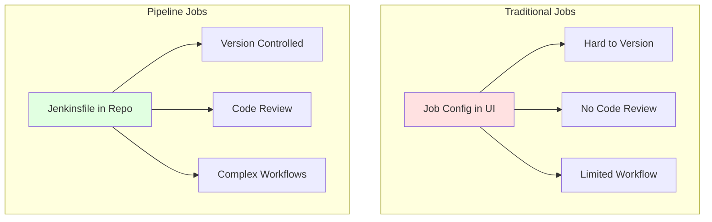
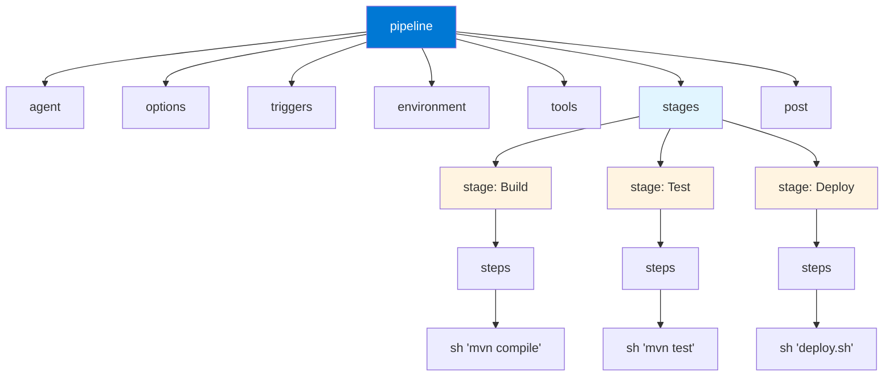
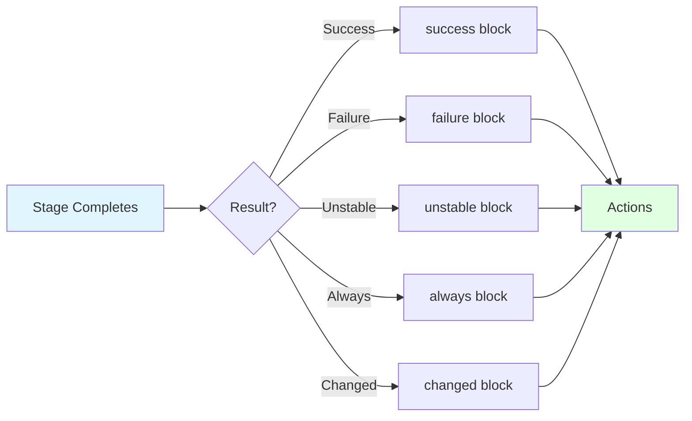
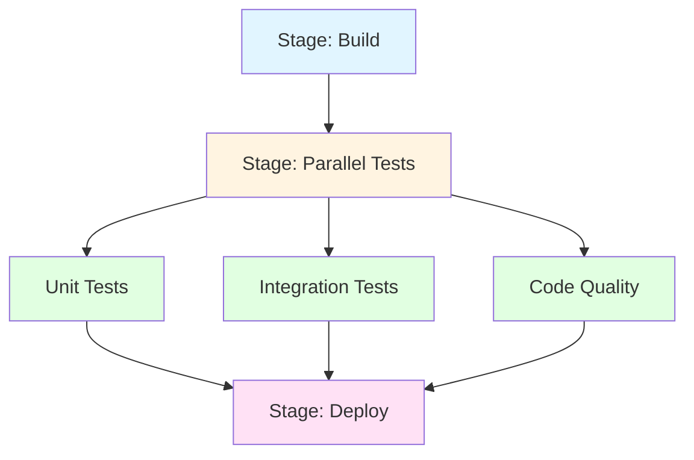

# Module 4: Jenkins Pipeline (Declarative)

## 4.1 Pipeline Concepts

### What are Pipelines?

Jenkins Pipeline is a suite of plugins that supports implementing and integrating continuous delivery pipelines into Jenkins. A pipeline is an automated expression of your process for getting software from version control to your users. Pipelines are defined using a Jenkinsfile, which is a text file that contains the pipeline definition and is typically stored in your source code repository alongside your application code.

Pipelines provide several key advantages over traditional Jenkins jobs: pipelines are defined as code, which means they can be versioned, reviewed, and tested like any other code; pipelines support complex workflows including parallel execution, loops, and conditional logic; pipelines provide better visualization of the build process; and pipelines enable "Pipeline as Code" practices that align with modern DevOps methodologies.

A pipeline consists of stages, which represent distinct parts of the process (such as Build, Test, Deploy), and steps, which are the individual tasks within stages. Pipelines can be either Declarative (using a structured syntax) or Scripted (using Groovy for maximum flexibility). Understanding pipelines is essential for modern Jenkins usage, as they represent the recommended approach for most CI/CD scenarios.

#### Pipeline vs. Traditional Jobs



### Pipeline as Code

Pipeline as Code is the practice of defining CI/CD pipelines in code files (Jenkinsfiles) that are stored in version control alongside application code. This approach provides several benefits: pipelines are versioned with your code, ensuring that pipeline changes are tracked and can be rolled back; pipeline changes go through the same code review process as code changes, improving quality and knowledge sharing; pipelines can be tested and validated before being used; and pipelines are easier to maintain and share across projects.

Pipeline as Code aligns with Infrastructure as Code practices and modern DevOps methodologies. It enables teams to treat their CI/CD processes as first-class citizens in their development workflow, applying the same practices (version control, code review, testing) to pipelines that they apply to application code. This consistency improves quality and makes pipelines more maintainable.

Jenkinsfiles can be written in either Declarative Pipeline syntax (structured, easier to learn) or Scripted Pipeline syntax (Groovy-based, more flexible). Both approaches support Pipeline as Code, but Declarative Pipeline is generally recommended for most use cases due to its simplicity and built-in best practices. Understanding Pipeline as Code helps you implement modern CI/CD practices.

### Declarative vs. Scripted

Declarative and Scripted pipelines are two different syntaxes for defining Jenkins pipelines. Declarative Pipeline uses a structured syntax that's easier to learn and read, with built-in best practices and validation. Scripted Pipeline uses Groovy syntax, providing maximum flexibility but requiring Groovy knowledge.

Declarative Pipeline is recommended for most use cases because it's simpler, has better error messages, and includes built-in features like parallel execution and post actions. Declarative Pipeline syntax is more restrictive, which helps prevent common mistakes and enforces good practices. However, Declarative Pipeline has limitations for very complex scenarios.

Scripted Pipeline provides complete flexibility using Groovy, allowing you to implement any logic you need. Scripted Pipeline is more powerful but also more complex, requiring Groovy knowledge and making it easier to write code that's hard to maintain. Scripted Pipeline is useful for complex scenarios that can't be expressed in Declarative syntax.

#### Comparison Table: Declarative vs. Scripted Pipeline

| Feature | Declarative Pipeline | Scripted Pipeline |
|---------|---------------------|-------------------|
| **Syntax** | Structured, YAML-like | Groovy code |
| **Learning Curve** | Low | High (requires Groovy) |
| **Flexibility** | Moderate | Very High |
| **Error Messages** | Clear | Groovy errors |
| **Validation** | Built-in | Manual |
| **Best For** | Most use cases | Complex scenarios |
| **Recommended** | Yes | When needed |

### Pipeline Benefits

Pipelines provide numerous benefits over traditional Jenkins jobs. Code-based definition means pipelines are versioned, reviewable, and testable. Complex workflows are supported, including parallel execution, conditional logic, and loops. Better visualization shows the pipeline flow and makes it easy to see where builds are in the process. Integration with Jenkins features like agents, tools, and notifications is seamless.

Pipelines enable modern DevOps practices like Infrastructure as Code for CI/CD. They support advanced features like matrix builds, parallel stages, and conditional execution. Pipelines provide better error handling and recovery options. They're also more maintainable, as pipeline code can be organized, documented, and reused through shared libraries.

Understanding pipeline benefits helps you appreciate why pipelines are the recommended approach for Jenkins. While traditional jobs are still useful for simple scenarios, pipelines provide the foundation for modern, scalable CI/CD practices.

### Pipeline Structure

Pipeline structure consists of several key elements: the `pipeline` block (the outer block that defines the pipeline), the `agent` directive (specifies where the pipeline runs), the `stages` block (contains one or more stage definitions), the `stage` blocks (define distinct parts of the process), and the `steps` blocks (contain the actual work to be done).

Additional pipeline elements include: `post` actions (executed after stages complete), `environment` variables (available to all steps), `tools` (tool installations), `options` (pipeline-level options), and `triggers` (when to run the pipeline). Understanding pipeline structure helps you read and write pipelines effectively.

Pipeline structure is hierarchical: the pipeline contains stages, stages contain steps, and various directives apply at different levels. This structure provides organization and makes pipelines easier to understand and maintain. Understanding the structure is essential for creating effective pipelines.

#### Pipeline Structure Diagram



---

## 4.2 Declarative Pipeline Syntax

### Pipeline Block

The `pipeline` block is the outer block that defines the entire pipeline. It's required for all Declarative Pipelines and contains all other pipeline elements. The pipeline block syntax is:

```groovy
pipeline {
    // Pipeline configuration
}
```

The pipeline block must be the top-level element in a Jenkinsfile. It contains directives like `agent`, `stages`, `post`, and others. The pipeline block provides the structure and context for the entire pipeline definition. Understanding the pipeline block is fundamental to writing Declarative Pipelines.

### Agent Declaration

The `agent` directive specifies where the pipeline runs. The agent can be: `any` (run on any available agent), `none` (no agent, used for stage-level agents), a specific agent label, or a Docker container. The agent declaration is required in the pipeline block (unless using `agent none` and specifying agents at the stage level).

Agent configuration examples:
- `agent any` - Run on any available agent
- `agent { label 'linux' }` - Run on an agent with the 'linux' label
- `agent { docker { image 'maven:3.8.6' } }` - Run in a Docker container

The agent determines where build steps execute and what tools are available. Understanding agent declaration helps you control where pipelines run and ensure they have the necessary resources.

#### Agent Types Comparison

| Agent Type | Syntax | Use Case |
|-----------|--------|----------|
| **any** | `agent any` | Run on any available agent |
| **label** | `agent { label 'linux' }` | Run on specific agent type |
| **none** | `agent none` | No default agent (stage-level) |
| **docker** | `agent { docker { image '...' } }` | Run in Docker container |
| **kubernetes** | `agent { kubernetes { ... } }` | Run in Kubernetes pod |

### Stages and Steps

Stages represent distinct parts of your pipeline process, such as Build, Test, and Deploy. Each stage contains a `steps` block that defines the work to be done. Stages provide organization and visualization, making it easy to see where builds are in the process. Steps are the individual tasks within stages, such as running shell commands, building with Maven, or deploying applications.

Stage syntax:
```groovy
stage('Build') {
    steps {
        sh 'mvn clean package'
    }
}
```

Stages execute sequentially by default, but can be configured to run in parallel. Steps within a stage execute sequentially. If any step fails, the stage fails, and subsequent stages typically don't execute (unless configured otherwise). Understanding stages and steps helps you organize pipeline logic effectively.

### Post Actions

Post actions are executed after stages complete, regardless of whether stages succeeded or failed. Post actions are useful for cleanup, notifications, and reporting. Common post action conditions include: `always` (always execute), `success` (execute only on success), `failure` (execute only on failure), `unstable` (execute when build is unstable), and `changed` (execute when build status changes).

Post action syntax:
```groovy
post {
    always {
        echo 'This always runs'
    }
    success {
        echo 'Build succeeded!'
    }
    failure {
        echo 'Build failed!'
        mail to: 'team@example.com',
             subject: "Build Failed: ${env.JOB_NAME}",
             body: "Build ${env.BUILD_NUMBER} failed."
    }
}
```

Post actions can be defined at the pipeline level (executing after all stages) or at the stage level (executing after individual stages). Understanding post actions helps you create pipelines that handle all scenarios appropriately.

#### Post Actions Flow



### Pipeline Directives

Pipeline directives configure pipeline behavior at various levels. Common directives include: `agent` (where to run), `options` (pipeline options like timeouts, retries), `environment` (environment variables), `parameters` (build parameters), `triggers` (when to run), `tools` (tool installations), and `post` (post actions).

Directives can be defined at the pipeline level (applying to the entire pipeline) or at the stage level (applying to specific stages). Some directives can only be used at the pipeline level, while others can be used at both levels. Understanding directives helps you configure pipelines effectively.

Directive examples:
- `options { timeout(time: 1, unit: 'HOURS') }` - Set pipeline timeout
- `environment { BUILD_NUMBER = "${env.BUILD_NUMBER}" }` - Set environment variables
- `triggers { cron('H */4 * * *') }` - Schedule pipeline
- `tools { maven 'Maven-3.8.6' }` - Install tools

---

## 4.3 Pipeline Stages

### Stage Definition

Stages are the building blocks of pipelines, representing distinct phases of your process. Each stage has a name (displayed in the pipeline visualization) and contains steps that perform work. Stages provide organization and make it easy to see where builds are in the process. Stage names should be descriptive and reflect what the stage does.

Stage syntax is straightforward:
```groovy
stage('Stage Name') {
    steps {
        // Steps to execute
    }
}
```

Stages can also include other elements like `agent` (to run on a specific agent), `environment` (stage-specific environment variables), `when` (conditional execution), `tools` (stage-specific tools), and `post` (stage-specific post actions). Understanding stage definition helps you organize pipeline logic effectively.

### Parallel Stages

Parallel stages allow multiple stages to run simultaneously, reducing overall pipeline duration. Parallel execution is useful when stages are independent and don't depend on each other. For example, you might run tests for different components in parallel, or build for different platforms simultaneously.

Parallel stage syntax:
```groovy
stage('Parallel Tests') {
    parallel {
        stage('Unit Tests') {
            steps {
                sh 'mvn test'
            }
        }
        stage('Integration Tests') {
            steps {
                sh 'mvn verify'
            }
        }
    }
}
```

Parallel stages can significantly reduce pipeline duration when you have independent work that can run concurrently. However, parallel stages consume more resources (agents, CPU, memory), so they should be used judiciously. Understanding parallel stages helps you optimize pipeline performance.

#### Parallel Stages Execution



### Stage Conditions

Stage conditions (using the `when` directive) allow stages to execute only under certain conditions. This is useful for conditional execution based on branch names, environment variables, build parameters, or other factors. Conditional stages make pipelines more flexible and efficient by skipping unnecessary work.

When directive examples:
```groovy
stage('Deploy to Production') {
    when {
        branch 'main'
        environment name: 'DEPLOY_PROD', value: 'true'
    }
    steps {
        sh 'deploy.sh production'
    }
}
```

Common when conditions include: `branch` (branch name matching), `environment` (environment variable values), `expression` (Groovy expressions), `not` (negation), `allOf` (all conditions true), and `anyOf` (any condition true). Understanding stage conditions helps you create flexible pipelines that adapt to different scenarios.

### Stage Environment

Stage environment allows you to set environment variables that are available only within a specific stage. This is useful for stage-specific configuration or for overriding pipeline-level environment variables. Stage environment variables take precedence over pipeline-level variables.

Stage environment syntax:
```groovy
stage('Build') {
    environment {
        BUILD_TYPE = 'release'
        VERSION = "${env.BUILD_NUMBER}"
    }
    steps {
        sh "mvn clean package -Dbuild.type=${BUILD_TYPE}"
    }
}
```

Stage environment is useful when different stages need different configurations or when you want to override global settings for specific stages. Understanding stage environment helps you configure stages appropriately.

### Stage Tools

Stage tools allow you to specify tool installations that are available only within a specific stage. This is useful when different stages need different tool versions or when you want to minimize tool installations. Stage tools are configured similarly to pipeline-level tools but apply only to the stage.

Stage tools syntax:
```groovy
stage('Build') {
    tools {
        maven 'Maven-3.8.6'
        jdk 'JDK-11'
    }
    steps {
        sh 'mvn clean package'
    }
}
```

Stage tools are useful for multi-language projects where different stages need different tools, or for testing against multiple tool versions. Understanding stage tools helps you configure stages with the right tools without affecting other stages.

---

## 4.4 Pipeline Steps

### Built-in Steps

Jenkins Pipeline provides many built-in steps that perform common tasks. These steps are available in all pipelines without requiring additional plugins. Common built-in steps include: `sh` (execute shell commands), `bat` (execute Windows batch commands), `powershell` (execute PowerShell commands), `echo` (print messages), `error` (fail the build), `timeout` (set timeouts), and `retry` (retry steps).

Built-in steps are documented in the Jenkins Pipeline documentation and are the foundation of pipeline functionality. Understanding built-in steps helps you write effective pipelines. Steps can be combined and chained to create complex workflows. Most steps support common options like error handling and timeouts.

### sh, bat, powershell Steps

The `sh`, `bat`, and `powershell` steps execute shell commands on the agent. `sh` is for Unix/Linux shells, `bat` is for Windows batch scripts, and `powershell` is for PowerShell scripts. These steps are the most commonly used steps in pipelines, as they execute the actual build, test, and deployment commands.

Example usage:
```groovy
steps {
    sh 'mvn clean package'
    sh '''
        echo "Building application"
        npm install
        npm run build
    '''
    bat 'build.bat'
    powershell 'Deploy.ps1'
}
```

These steps can return output, set return codes, and handle errors. They support various options like `returnStdout` (return command output), `returnStatus` (return exit code), and `script` (command to execute). Understanding these steps is essential for writing pipelines.

### File Operations

File operations in pipelines include steps for working with files: `readFile` (read file contents), `writeFile` (write file contents), `fileExists` (check if file exists), `deleteDir` (delete directory), `dir` (change directory), and `archiveArtifacts` (archive build outputs). These steps enable pipelines to manipulate files and directories.

File operation examples:
```groovy
steps {
    def config = readFile 'config.properties'
    writeFile file: 'output.txt', text: 'Build completed'
    if (fileExists('target/app.jar')) {
        archiveArtifacts 'target/*.jar'
    }
}
```

File operations are essential for build processes that need to read configuration, generate files, or archive artifacts. Understanding file operations helps you create pipelines that handle files effectively.

### Archive and Publish Steps

Archive and publish steps save build outputs and make them available for download or use in other jobs. `archiveArtifacts` saves files from the workspace, `publishHTML` publishes HTML reports, `publishTestResults` publishes test results, and various other publish steps make build outputs visible and accessible.

Archive example:
```groovy
steps {
    sh 'mvn clean package'
    archiveArtifacts 'target/*.jar'
    publishTestResults testResultsPattern: 'target/surefire-reports/*.xml'
}
```

Archive and publish steps make build results accessible and enable downstream processes. They're essential for complete CI/CD workflows. Understanding these steps helps you create pipelines that provide value beyond just building code.

### Custom Steps

Custom steps are provided by plugins and extend pipeline functionality. Many plugins provide custom steps for their specific functionality. For example, the Docker plugin provides `docker.build` and `docker.withRegistry` steps, the Kubernetes plugin provides Kubernetes-specific steps, and the Git plugin provides Git operations.

Custom steps are documented in plugin documentation and are available when the corresponding plugin is installed. Understanding which plugins provide which steps helps you extend pipeline functionality. Custom steps can be combined with built-in steps to create powerful workflows.

Example custom steps:
```groovy
steps {
    docker.build('myapp:latest', '.')
    kubernetesDeploy(configFile: 'k8s.yaml')
    git branch: 'main', url: 'https://github.com/user/repo.git'
}
```

---

## Quick Reference

### Declarative Pipeline Structure
```groovy
pipeline {
    agent any
    stages {
        stage('Build') {
            steps {
                sh 'make'
            }
        }
    }
    post {
        always {
            echo 'Build complete'
        }
    }
}
```

### Key Directives
- `agent`: Where to run
- `stages`: Build steps
- `steps`: Commands to execute
- `post`: Actions after stages

---

## Common Pitfalls

### Pitfall 1: Mixing Declarative and Scripted
**Problem**: Syntax errors, confusion
**Solution**: Use script block for scripted code
**Prevention**: Understand syntax differences

### Pitfall 2: Not Using Stages
**Problem**: Hard to read, difficult debugging
**Solution**: Organize steps into stages
**Prevention**: Use stages from the start

### Pitfall 3: Not Handling Failures
**Problem**: Unclear error messages, no cleanup
**Solution**: Use post blocks for error handling
**Prevention**: Always include post blocks

---

## Best Practices

1. **Use Declarative Syntax**: Prefer over scripted when possible
2. **Organize with Stages**: Clear stage structure
3. **Handle Errors**: Use post blocks
4. **Use Parallel Execution**: Speed up pipelines
5. **Store in Git**: Version control pipelines
6. **Document Steps**: Clear comments
7. **Test Locally**: Validate before committing
8. **Use Shared Libraries**: Reuse common code
9. **Set Timeouts**: Prevent hanging builds
10. **Clean Workspace**: Remove old files

---

## Further Reading

### Official Documentation
- [Declarative Pipeline](https://www.jenkins.io/doc/book/pipeline/syntax/)
- [Pipeline Steps](https://www.jenkins.io/doc/pipeline/steps/)
- [Pipeline Examples](https://www.jenkins.io/doc/pipeline/examples/)

### Related Topics
- Pipeline Scripted (Module 5)
- Shared Libraries (Module 6)
- CI/CD Patterns (Module 16)

---

*This module covers Declarative Pipeline syntax in detail. Understanding Declarative Pipeline is essential for modern Jenkins usage, as it provides the recommended approach for most CI/CD scenarios. The structured syntax makes pipelines easier to write, read, and maintain.*

