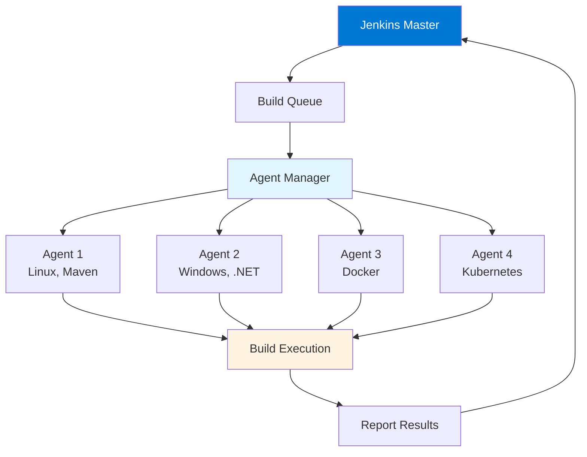
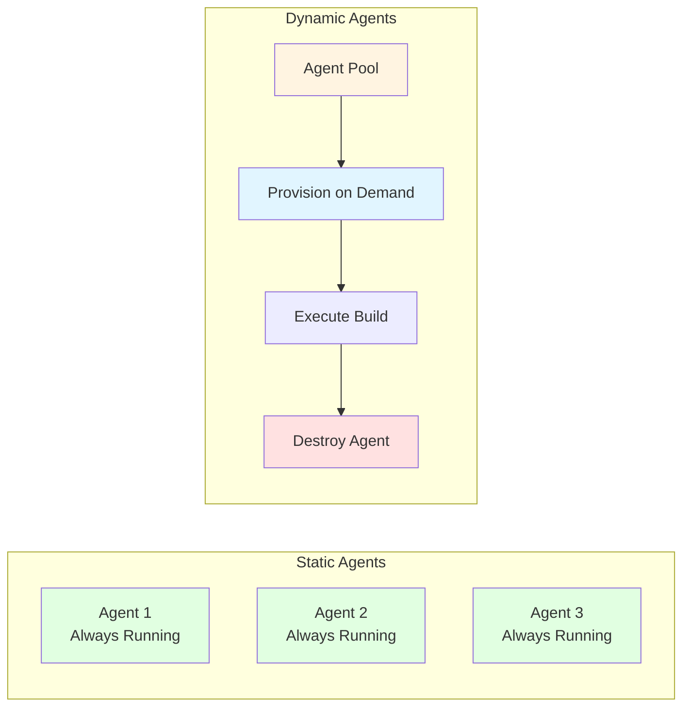
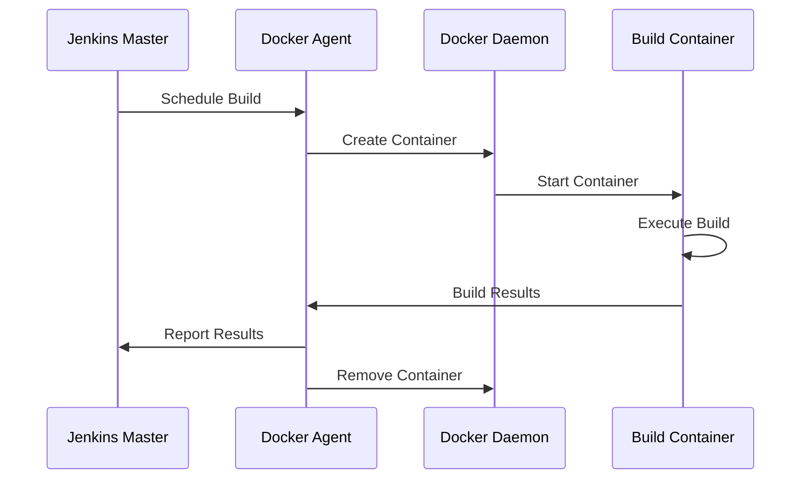

# Module 7: Jenkins Agents and Distributed Builds

## 7.1 Agent Concepts

### Master vs. Agent

The Jenkins master node coordinates all build activities, manages agent nodes, schedules builds, and serves the web UI. The master should not run builds directly in production environments, as this can impact master performance and create resource contention. Instead, builds should run on agent nodes, which are separate machines that execute builds on behalf of the master.

Agents (also called workers or slaves in older versions) are machines that connect to the master and execute build jobs. Agents pull work from the master, execute builds in their workspaces, and report results back to the master. This distributed architecture allows Jenkins to scale horizontally by adding more agents as build load increases.

The separation between master and agents provides several benefits: the master can focus on coordination rather than execution, builds can run on different operating systems and architectures, build workloads are isolated from the master, and the system can scale by adding agents. Understanding the master-agent relationship is fundamental to using Jenkins effectively.

#### Master-Agent Architecture

### Agent Types

Jenkins supports several agent types: static agents (permanently configured machines), dynamic agents (provisioned on-demand), Docker agents (containers), Kubernetes agents (pods), and cloud agents (AWS, Azure, GCP instances). Each agent type has different characteristics and use cases.

Static agents are always available and are suitable for builds that need specific hardware or software configurations. Dynamic agents are created when needed and destroyed after builds complete, making them cost-effective for cloud environments. Docker agents provide isolation and consistency. Kubernetes agents integrate with Kubernetes clusters. Cloud agents leverage cloud provider services.

The choice of agent type depends on your infrastructure, requirements, and cost considerations. Understanding agent types helps you choose the right approach for your environment.

#### Agent Types Comparison

| Agent Type | Availability | Setup | Cost | Best For |
|-----------|-------------|-------|------|----------|
| **Static** | Always on | Manual | Fixed | Specific configs |
| **Dynamic** | On-demand | Automated | Variable | Cloud environments |
| **Docker** | On-demand | Automated | Low | Isolation, consistency |
| **Kubernetes** | On-demand | Automated | Variable | K8s environments |
| **Cloud** | On-demand | Automated | Pay-per-use | Cloud-native |

### Agent Connection Methods

Agents connect to the master using different methods: SSH (for Linux/Unix agents), JNLP/Java Web Start (for agents that can't use SSH), Windows service (for Windows agents), and cloud plugins (for cloud-based agents). The connection method determines how agents are set up and managed.

SSH connection is the most common for Linux agents and provides secure, encrypted communication. JNLP connection is used when SSH isn't available or for agents behind firewalls. Windows service connection integrates with Windows service management. Cloud plugin connections are managed by cloud-specific plugins.

Understanding connection methods helps you set up agents correctly for your environment and security requirements.

### Agent Labels

Agent labels are tags that identify agent capabilities, such as operating system, installed tools, or location. Labels allow you to route builds to appropriate agents. For example, you might label agents as "linux", "windows", "docker", or "maven" to indicate their capabilities.

Labels are used in pipeline `agent` declarations or job configurations to specify which agents can run builds. Jenkins selects an available agent that matches the specified label. Labels enable flexible agent selection and help ensure builds run on agents with the right capabilities.

Label examples:
- `agent { label 'linux && maven' }` - Run on Linux agents with Maven
- `agent { label 'windows && dotnet' }` - Run on Windows agents with .NET

Understanding agent labels helps you route builds to appropriate agents and manage agent capabilities effectively.

### Agent Use Cases

Agents are used for various purposes: running builds on different operating systems (Linux, Windows, macOS), running builds with different tool versions (Java 8, Java 11, Maven 3.6, Maven 3.8), isolating build environments (preventing builds from interfering with each other), scaling build capacity (adding agents to handle more builds), and running builds in specific locations (on-premises, cloud, different regions).

Understanding agent use cases helps you design your agent infrastructure to meet your needs. Different use cases may require different agent types or configurations.

---

## 7.2 Agent Configuration

### Static Agents

Static agents are permanently configured machines that are always available. They're set up once and remain connected to the master. Static agents are suitable for builds that need specific hardware, software, or configurations that don't change frequently. Setting up static agents involves: installing the agent software, configuring connection to the master, and labeling the agent appropriately.

Static agent setup typically involves: downloading the agent JAR file, running the agent with connection parameters, and configuring the agent to start automatically (as a service or using a process manager). Static agents provide predictable performance and are easier to troubleshoot than dynamic agents.

Static agents are ideal for: builds that need specific hardware, builds that need to access on-premises resources, builds that need consistent environments, and scenarios where agent startup time is a concern. Understanding static agents helps you set up reliable, predictable build infrastructure.

### Dynamic Agents

Dynamic agents are provisioned on-demand when builds need them and are destroyed after builds complete. Dynamic agents are typically used with cloud providers or container orchestration systems. They provide cost savings (you only pay for agents when they're running) and automatic scaling (agents are created as needed).

Dynamic agent configuration involves: setting up the cloud provider or orchestration system, configuring agent templates (defining what agents look like), and configuring Jenkins to provision agents automatically. Dynamic agents require more initial setup but provide better resource utilization and cost efficiency.

Dynamic agents are ideal for: cloud environments, variable build loads, cost optimization, and scenarios where agent configuration can be standardized. Understanding dynamic agents helps you implement scalable, cost-effective build infrastructure.

#### Static vs. Dynamic Agents

### Cloud Agents

Cloud agents are dynamic agents provisioned in cloud environments like AWS, Azure, or GCP. Cloud agents leverage cloud provider services to create virtual machines or containers on-demand. Cloud agents provide: automatic scaling, cost efficiency (pay only for what you use), and integration with cloud services.

Cloud agent configuration involves: setting up cloud provider credentials, configuring agent templates (AMI images, instance types, etc.), and configuring Jenkins cloud plugins. Cloud agents are ideal for organizations using cloud infrastructure and wanting to leverage cloud scalability and cost models.

Understanding cloud agents helps you implement scalable build infrastructure in cloud environments.

### Agent Configuration

Agent configuration includes: connection settings (how the agent connects to the master), resource settings (CPU, memory, disk), tool installations (what tools are available on the agent), labels (agent capabilities), and environment variables (agent-specific settings). Proper agent configuration ensures agents can execute builds successfully.

Agent configuration is done when setting up agents and can be updated as needed. Configuration should match the requirements of builds that will run on the agent. Understanding agent configuration helps you set up agents correctly and troubleshoot agent issues.

### Agent Management

Agent management involves: monitoring agent status and health, adding and removing agents, updating agent configurations, troubleshooting agent issues, and managing agent resources. Effective agent management ensures that your build infrastructure is reliable and efficient.

Agent management should include: regular monitoring of agent health, proactive maintenance, capacity planning, and documentation of agent configurations. Understanding agent management helps you maintain effective build infrastructure.

---

## 7.3 Agent Types

### SSH Agents

SSH agents connect to the master using SSH, providing secure, encrypted communication. SSH agents are the most common type for Linux/Unix agents. SSH agent setup involves: configuring SSH keys for passwordless authentication, setting up the agent user account, and configuring the agent to connect automatically.

SSH agents provide: secure communication, easy setup for Linux environments, and integration with existing SSH infrastructure. SSH agents are ideal for Linux/Unix build environments and organizations with existing SSH infrastructure.

### JNLP Agents

JNLP (Java Network Launch Protocol) agents connect using Java Web Start technology. JNLP agents are useful when SSH isn't available or for agents behind firewalls. JNLP agent setup involves: downloading the agent JAR file, running it with connection parameters, and configuring it to connect to the master.

JNLP agents provide: flexibility in connection methods, support for various network configurations, and cross-platform support. However, JNLP is being deprecated in favor of more modern connection methods. Understanding JNLP agents helps you work with existing JNLP setups or migrate away from them.

### Docker Agents

Docker agents run builds in Docker containers, providing isolation and consistency. Docker agents can be static (containers that stay running) or dynamic (containers created for each build). Docker agent configuration involves: setting up Docker on agents, configuring Docker images to use, and configuring Jenkins to use Docker agents.

Docker agents provide: environment consistency, isolation between builds, easy cleanup, and support for multiple environments. Docker agents are ideal for containerized build environments and scenarios where build isolation is important.

#### Docker Agent Flow

### Kubernetes Agents

Kubernetes agents run builds in Kubernetes pods, providing cloud-native agent management. Kubernetes agents are dynamic, created on-demand and destroyed after builds. Kubernetes agent configuration involves: setting up Kubernetes cluster access, configuring pod templates, and configuring the Kubernetes plugin.

Kubernetes agents provide: automatic scaling, resource efficiency, integration with Kubernetes infrastructure, and support for complex agent configurations. Kubernetes agents are ideal for organizations using Kubernetes and wanting cloud-native build infrastructure.

### Cloud Agents (AWS, Azure)

Cloud agents are provisioned in cloud environments using cloud provider services. AWS agents use EC2 instances, Azure agents use Azure VMs, and GCP agents use Compute Engine instances. Cloud agent configuration involves: setting up cloud provider credentials, configuring agent templates, and configuring cloud plugins.

Cloud agents provide: automatic scaling, cost efficiency, integration with cloud services, and geographic distribution. Cloud agents are ideal for cloud-native organizations and scenarios where dynamic scaling is important.

---

## 7.4 Agent Management

### Adding Agents

Adding agents involves: setting up the agent machine or container, installing agent software, configuring connection to the master, labeling the agent, and verifying the agent works. The process varies by agent type: static agents require manual setup, while dynamic agents are configured through cloud plugins or orchestration systems.

Adding agents should follow a consistent process to ensure agents are configured correctly and can execute builds successfully. Documentation of the agent setup process helps with consistency and troubleshooting.

### Removing Agents

Removing agents involves: stopping builds on the agent, disconnecting the agent from the master, and decommissioning the agent machine or container. For static agents, this involves stopping the agent process and removing the agent configuration. For dynamic agents, this typically happens automatically when agents are no longer needed.

Removing agents should be done carefully to avoid interrupting running builds. Understanding how to remove agents helps you manage agent lifecycle effectively.

### Agent Monitoring

Agent monitoring involves: checking agent status (online, offline, disconnected), monitoring agent resource usage (CPU, memory, disk), tracking agent utilization (how often agents are used), and identifying agent issues. Monitoring helps ensure agents are healthy and available when needed.

Agent monitoring can be done through the Jenkins UI, through monitoring tools, or through Jenkins APIs. Regular monitoring helps identify issues early and ensures build infrastructure is reliable.

### Agent Troubleshooting

Agent troubleshooting involves: diagnosing connection issues, resolving resource problems, fixing tool installation issues, and addressing performance problems. Common agent issues include: connection failures, resource exhaustion, tool version mismatches, and network problems.

Troubleshooting agents requires understanding agent configuration, connection methods, and common issues. Effective troubleshooting helps maintain reliable build infrastructure.

### Agent Best Practices

Agent best practices include: using agents for all builds (not running builds on master), labeling agents appropriately, monitoring agent health, keeping agents updated, securing agent communication, and documenting agent configurations. Following best practices ensures reliable, efficient build infrastructure.

---

## Quick Reference

### Agent Types
- **Permanent**: Always-on agents
- **Temporary**: Ephemeral agents (Docker, Kubernetes)
- **Cloud**: Cloud-based agents (AWS, Azure)

### Agent Connection Methods
- **SSH**: Secure shell connection
- **JNLP**: Java Network Launch Protocol
- **Docker**: Container-based agents
- **Kubernetes**: Pod-based agents

---

## Common Pitfalls

### Pitfall 1: Running Builds on Master
**Problem**: Master overload, performance issues
**Solution**: Always use agents for builds
**Prevention**: Configure agents from the start

### Pitfall 2: Not Labeling Agents
**Problem**: Builds on wrong agents, resource conflicts
**Solution**: Use descriptive labels
**Prevention**: Label agents appropriately

### Pitfall 3: Inadequate Agent Resources
**Problem**: Build failures, slow builds
**Solution**: Provision adequate resources
**Prevention**: Monitor agent resource usage

---

## Best Practices

1. **Use Agents for Builds**: Never run builds on master
2. **Label Agents**: Descriptive labels for selection
3. **Monitor Agent Health**: Track agent status
4. **Scale Appropriately**: Right number of agents
5. **Secure Communication**: SSH or encrypted JNLP
6. **Keep Agents Updated**: Regular updates
7. **Document Configuration**: Clear documentation
8. **Use Cloud Agents**: For dynamic scaling
9. **Clean Agents**: Regular cleanup procedures
10. **Monitor Performance**: Track build times

---

## Further Reading

### Official Documentation
- [Agents](https://www.jenkins.io/doc/book/using/using-agents/)
- [Distributed Builds](https://www.jenkins.io/doc/book/scaling/distributed-builds/)
- [Kubernetes Agents](https://plugins.jenkins.io/kubernetes/)

### Related Topics
- Installation and Configuration (Module 2)
- Plugins (Module 8)
- Best Practices (Module 15)

---

*This module covers Jenkins agents and distributed builds in detail. Understanding agents is essential for scaling Jenkins and running builds effectively. Agents enable Jenkins to handle many concurrent builds and support diverse build requirements.*

