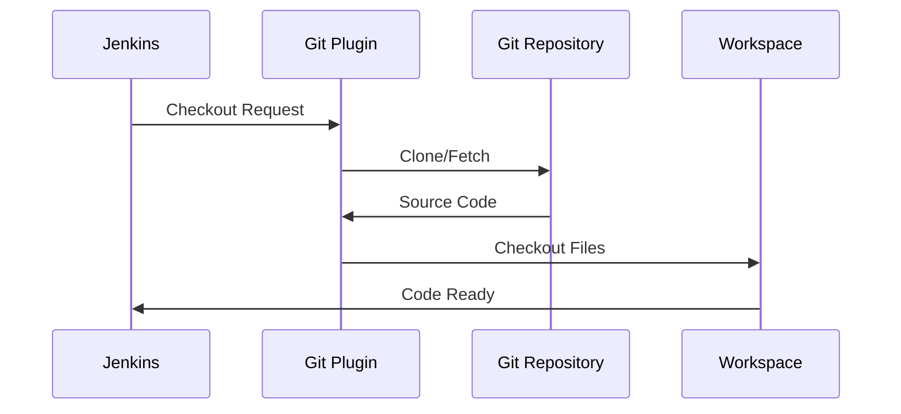

# Module 9: Jenkins Integration with Version Control

## 9.1 Git Integration

### Git Plugin Configuration

The Git plugin is the foundation of Git integration in Jenkins. Configuration involves: setting up Git installations (if Git is not in PATH), configuring global Git settings, and setting up Git credentials. Git plugin configuration is done in "Manage Jenkins" > "Global Tool Configuration" for Git installations and in "Manage Jenkins" > "Manage Credentials" for Git credentials.

Git plugin configuration ensures that Jenkins can check out code from Git repositories. Proper configuration includes: specifying Git executable paths, configuring Git global settings (user name, email), and setting up credentials for private repositories. Understanding Git plugin configuration helps you set up Git integration correctly.

#### Git Integration Flow

### Git Credentials

Git credentials are required for accessing private repositories. Jenkins supports several credential types: username/password, SSH keys, and personal access tokens. Credentials are managed centrally in "Manage Jenkins" > "Manage Credentials" and can be shared across multiple jobs.

Git credential configuration includes: creating credentials with appropriate scopes, testing credentials, and using credentials in jobs. Credentials should be stored securely and rotated regularly. Understanding Git credentials helps you access private repositories securely.

### Git Branches

Git branch configuration in Jenkins jobs specifies which branches to build. You can configure: specific branches (like 'main' or 'develop'), branch patterns (like 'feature/*'), or all branches. Branch configuration enables multi-branch pipelines and allows different branches to trigger different builds.

Branch configuration examples:
- `*/main` - Build only main branch
- `feature/*` - Build all feature branches
- `*/main, */develop` - Build main and develop branches

Understanding Git branch configuration helps you set up builds for the right branches.

### Git Webhooks

Git webhooks trigger Jenkins builds automatically when code is pushed. Webhook configuration involves: configuring the webhook in your Git hosting service (GitHub, GitLab, etc.) to point to Jenkins, ensuring Jenkins is accessible from the Git service, and enabling webhook triggers in Jenkins jobs.

Webhook configuration provides immediate build triggers, which is essential for CI. However, webhooks require network configuration and proper security setup. Understanding Git webhooks helps you set up automated builds.

### Git Best Practices

Git integration best practices include: using webhooks for CI (faster than polling), securing credentials properly, using branch patterns appropriately, cleaning workspaces between builds, and using shallow clones for large repositories. Following best practices ensures reliable Git integration.

---

## 9.2 GitHub Integration

### GitHub Plugin

The GitHub plugin extends Git plugin functionality with GitHub-specific features. It provides: GitHub authentication (OAuth), GitHub webhooks, GitHub pull request integration, GitHub status updates, and GitHub organization folder support. The GitHub plugin makes Jenkins integration with GitHub seamless.

GitHub plugin configuration includes: setting up GitHub server connections, configuring OAuth applications, and enabling GitHub-specific features in jobs. Understanding the GitHub plugin helps you integrate Jenkins with GitHub effectively.

### GitHub Authentication

GitHub authentication uses OAuth to authenticate with GitHub, allowing Jenkins to access GitHub resources on behalf of users. OAuth configuration involves: creating a GitHub OAuth application, configuring OAuth credentials in Jenkins, and authorizing Jenkins to access GitHub.

GitHub authentication provides secure access to GitHub resources and enables features like pull request integration and status updates. Understanding GitHub authentication helps you set up secure GitHub integration.

### GitHub Webhooks

GitHub webhooks trigger Jenkins builds when events occur in GitHub repositories. Webhook configuration involves: setting up webhooks in GitHub repositories, configuring Jenkins to accept webhooks, and enabling webhook triggers in jobs. GitHub webhooks provide immediate build triggers for pushes and pull requests.

GitHub webhook configuration is essential for CI with GitHub. Understanding GitHub webhooks helps you set up automated builds with GitHub.

### GitHub Pull Requests

GitHub pull request integration allows Jenkins to build and test pull requests automatically. Configuration involves: enabling pull request triggers, configuring which pull requests to build, and setting up status updates. Pull request integration helps maintain code quality by testing changes before merging.

Pull request integration provides: automatic testing of proposed changes, status updates on pull requests, and blocking merges if builds fail. Understanding GitHub pull request integration helps you implement effective code review workflows.

### GitHub Status Updates

GitHub status updates post build status to GitHub, making build results visible in pull requests and commits. Status updates help developers see build results without leaving GitHub. Configuration involves: enabling status updates in GitHub plugin settings and ensuring proper GitHub authentication.

Status updates provide visibility into build status directly in GitHub. Understanding GitHub status updates helps you provide better feedback to developers.

---

## 9.3 Azure DevOps Integration

### Azure DevOps Plugin

The Azure DevOps plugin integrates Jenkins with Azure DevOps (formerly Visual Studio Team Services). It provides: Azure Repos integration, Azure Pipelines integration, work item integration, and Azure DevOps authentication. The plugin enables Jenkins to work with Azure DevOps repositories and services.

Azure DevOps plugin configuration includes: setting up Azure DevOps server connections, configuring authentication, and enabling Azure DevOps features in jobs. Understanding the Azure DevOps plugin helps you integrate Jenkins with Azure DevOps.

### Service Connections

Service connections in Azure DevOps provide secure access to external services. For Jenkins integration, service connections enable Azure DevOps to trigger Jenkins builds or Jenkins to access Azure DevOps resources. Service connection configuration involves: creating service connections in Azure DevOps and configuring Jenkins to use them.

Service connections provide secure integration between Jenkins and Azure DevOps. Understanding service connections helps you set up secure integrations.

### Azure Repos Integration

Azure Repos integration allows Jenkins to check out code from Azure Repos (Git or TFVC). Configuration is similar to Git integration but uses Azure DevOps authentication. Azure Repos integration enables Jenkins to build code stored in Azure Repos.

Azure Repos integration provides access to code in Azure DevOps. Understanding Azure Repos integration helps you use Jenkins with Azure DevOps repositories.

### Pull Request Integration

Azure DevOps pull request integration allows Jenkins to build and test pull requests. Configuration involves: setting up pull request triggers and configuring build policies. Pull request integration helps maintain code quality in Azure DevOps workflows.

### Best Practices

Azure DevOps integration best practices include: using service connections for authentication, configuring appropriate build policies, using webhooks for triggers, and following Azure DevOps security practices. Following best practices ensures secure and effective integration.

---

## 9.4 Bitbucket Integration

### Bitbucket Plugin

The Bitbucket plugin integrates Jenkins with Bitbucket (Cloud or Server). It provides: Bitbucket authentication, Bitbucket webhooks, Bitbucket pull request integration, and Bitbucket status updates. The plugin enables seamless integration between Jenkins and Bitbucket.

Bitbucket plugin configuration includes: setting up Bitbucket server connections, configuring authentication, and enabling Bitbucket features in jobs. Understanding the Bitbucket plugin helps you integrate Jenkins with Bitbucket.

### Bitbucket Authentication

Bitbucket authentication uses OAuth or app passwords to authenticate with Bitbucket. Configuration involves: creating Bitbucket OAuth applications or app passwords, configuring credentials in Jenkins, and authorizing Jenkins to access Bitbucket. Authentication enables secure access to Bitbucket resources.

### Bitbucket Webhooks

Bitbucket webhooks trigger Jenkins builds when events occur in Bitbucket repositories. Webhook configuration involves: setting up webhooks in Bitbucket, configuring Jenkins to accept webhooks, and enabling webhook triggers in jobs. Webhooks provide immediate build triggers for Bitbucket.

### Bitbucket Pull Requests

Bitbucket pull request integration allows Jenkins to build and test pull requests. Configuration involves: enabling pull request triggers and configuring which pull requests to build. Pull request integration helps maintain code quality in Bitbucket workflows.

### Integration Patterns

Bitbucket integration patterns include: using webhooks for CI, integrating pull request builds, using status updates, and following Bitbucket best practices. Understanding integration patterns helps you implement effective Jenkins-Bitbucket workflows.

---

## Quick Reference

### VCS Integration Methods
- **Webhooks**: HTTP POST triggers
- **Poll SCM**: Periodic repository checks
- **GitHub/GitLab Integration**: Native integrations

### Common VCS Plugins
- **Git Plugin**: Git support
- **GitHub Plugin**: GitHub integration
- **GitLab Plugin**: GitLab integration
- **Bitbucket Plugin**: Bitbucket integration

---

## Common Pitfalls

### Pitfall 1: Not Configuring Webhooks
**Problem**: Delayed builds, missed triggers
**Solution**: Configure webhooks properly
**Prevention**: Set up webhooks during job creation

### Pitfall 2: Polling Too Frequently
**Problem**: High load, unnecessary builds
**Solution**: Use webhooks instead of polling
**Prevention**: Prefer webhooks over polling

### Pitfall 3: Not Handling Credentials
**Problem**: Authentication failures
**Solution**: Configure credentials properly
**Prevention**: Use credential management

---

## Best Practices

1. **Use Webhooks**: Prefer over polling
2. **Configure Credentials**: Secure authentication
3. **Use Branch Strategies**: Appropriate branching
4. **Handle Pull Requests**: PR build integration
5. **Set Status Updates**: VCS status integration
6. **Monitor Triggers**: Track build triggers
7. **Test Integration**: Verify webhooks work
8. **Document Configuration**: Clear documentation
9. **Use Multibranch Pipelines**: Automatic branch detection
10. **Secure Webhooks**: Validate webhook requests

---

## Further Reading

### Official Documentation
- [Git Plugin](https://plugins.jenkins.io/git/)
- [GitHub Plugin](https://plugins.jenkins.io/github/)
- [Webhooks](https://www.jenkins.io/doc/book/pipeline/syntax/#triggers)

### Related Topics
- Jobs and Builds (Module 3)
- Pipeline Declarative (Module 4)
- CI/CD Patterns (Module 16)

---

*This module covers Jenkins integration with version control systems. Version control integration is essential for CI/CD, and understanding these integrations helps you set up automated builds effectively.*

