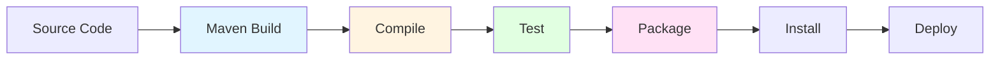

# Module 10: Jenkins Build Tools Integration

## 10.1 Maven Integration

### Maven Installation

Maven integration in Jenkins requires Maven to be installed and configured. Maven can be installed: globally on the system, per-agent, or automatically by Jenkins. Installation configuration is done in "Manage Jenkins" > "Global Tool Configuration" > "Maven". You can configure multiple Maven versions, allowing different jobs to use different versions.

Maven installation configuration includes: specifying Maven name (for reference in jobs), Maven installation path (for pre-installed Maven), or enabling automatic installation from Apache Maven. Automatic installation downloads and installs Maven automatically, which is convenient but requires internet access and may be slower.

For production environments, pre-installed Maven is typically preferred for better control and faster builds. You should configure at least the Maven versions that your projects require. Understanding Maven installation helps you set up Maven builds correctly.

#### Maven Build Flow

### Maven Job Configuration

Maven job configuration in Jenkins involves: selecting Maven project type (or using Maven steps in pipelines), specifying Maven installation to use, configuring Maven goals and options, setting up Maven settings, and configuring Maven build steps. Maven jobs can be freestyle projects with Maven build steps or Pipeline projects using Maven steps.

Maven job configuration examples:
- Freestyle: Add "Invoke top-level Maven targets" build step
- Pipeline: Use `sh 'mvn clean package'` or Maven step

Maven configuration also includes: Maven settings file (for repository configuration), Maven options (JVM options, Maven options), and Maven properties. Understanding Maven job configuration helps you create effective Maven builds.

### Maven Goals and Phases

Maven goals and phases define what Maven does during a build. Common goals include: `clean` (clean build directory), `compile` (compile source code), `test` (run tests), `package` (create JAR/WAR), `install` (install to local repository), and `deploy` (deploy to remote repository). Goals can be combined, and Maven executes them in order.

Maven phases are sequences of goals: `validate`, `compile`, `test`, `package`, `verify`, `install`, `deploy`. Running a phase executes all previous phases. Understanding Maven goals and phases helps you configure Maven builds correctly.

Example Maven commands:
- `mvn clean package` - Clean and package
- `mvn clean test` - Clean and test
- `mvn clean install` - Clean, build, test, and install

### Maven Dependencies

Maven dependency management handles project dependencies automatically. Maven downloads dependencies from repositories (Maven Central, corporate repositories, etc.) and manages dependency versions. Jenkins Maven integration works with Maven's dependency management automatically.

Maven dependency configuration is done in `pom.xml` files, not in Jenkins. However, Jenkins can publish Maven artifacts to repositories and can use Maven repositories for dependency resolution. Understanding Maven dependencies helps you work with Maven projects in Jenkins.

### Maven Best Practices

Maven best practices in Jenkins include: using Maven wrapper (mvnw) for consistent Maven versions, configuring Maven settings appropriately, using Maven profiles for different environments, publishing Maven artifacts, and using Maven dependency analysis. Following best practices ensures effective Maven builds.

---

## 10.2 Gradle Integration

### Gradle Installation

Gradle integration requires Gradle to be installed and configured, similar to Maven. Gradle installation is configured in "Manage Jenkins" > "Global Tool Configuration" > "Gradle". You can configure multiple Gradle versions, and jobs can select which version to use.

Gradle installation can be: pre-installed on agents, automatically installed by Jenkins, or using Gradle wrapper (recommended). The Gradle wrapper ensures consistent Gradle versions across environments and is the recommended approach for most projects.

Understanding Gradle installation helps you set up Gradle builds correctly.

### Gradle Job Configuration

Gradle job configuration involves: selecting Gradle project type or using Gradle steps in pipelines, specifying Gradle installation, configuring Gradle tasks, and setting up Gradle options. Gradle jobs can use the Gradle plugin or execute Gradle commands directly.

Gradle configuration examples:
- Freestyle: Add "Invoke Gradle script" build step
- Pipeline: Use `sh './gradlew build'` or Gradle step

Gradle configuration includes: Gradle tasks to execute, Gradle options, and Gradle properties. Understanding Gradle job configuration helps you create effective Gradle builds.

### Gradle Tasks

Gradle tasks are the units of work in Gradle builds. Common tasks include: `clean` (clean build directory), `build` (compile, test, package), `test` (run tests), `jar` (create JAR), `war` (create WAR), and custom tasks defined in `build.gradle`. Tasks can depend on other tasks, and Gradle executes them in dependency order.

Gradle task examples:
- `./gradlew clean build` - Clean and build
- `./gradlew test` - Run tests
- `./gradlew publish` - Publish artifacts

Understanding Gradle tasks helps you configure Gradle builds correctly.

### Gradle Dependencies

Gradle dependency management is similar to Maven but uses different syntax. Dependencies are defined in `build.gradle` files, and Gradle downloads them from repositories. Jenkins Gradle integration works with Gradle's dependency management automatically.

Gradle dependency configuration is done in `build.gradle` files. Jenkins can publish Gradle artifacts and can work with Gradle repositories. Understanding Gradle dependencies helps you work with Gradle projects in Jenkins.

### Gradle Best Practices

Gradle best practices include: using Gradle wrapper for consistent versions, organizing build scripts well, using Gradle daemon for performance, caching dependencies, and using Gradle build scans for analysis. Following best practices ensures effective Gradle builds.

---

## 10.3 Node.js/npm Integration

### Node.js Installation

Node.js integration requires Node.js to be installed and configured. Node.js installation is configured in "Manage Jenkins" > "Global Tool Configuration" > "NodeJS". You can configure multiple Node.js versions, allowing different jobs to use different versions.

Node.js installation can be: pre-installed on agents, automatically installed by Jenkins, or using version managers (nvm). Automatic installation downloads Node.js from nodejs.org, which is convenient but requires internet access.

Understanding Node.js installation helps you set up Node.js builds correctly.

### npm Job Configuration

npm job configuration involves: using Node.js in pipelines or freestyle jobs, specifying Node.js version, configuring npm commands, and setting up npm scripts. npm is included with Node.js, so Node.js installation provides npm automatically.

npm configuration examples:
- Pipeline: Use `sh 'npm install'` and `sh 'npm run build'`
- Freestyle: Add "Execute shell" steps with npm commands

npm configuration includes: npm commands to execute, npm options, and npm scripts defined in `package.json`. Understanding npm job configuration helps you create effective Node.js builds.

### Package Management

npm package management handles Node.js dependencies automatically. Dependencies are defined in `package.json`, and npm downloads them from the npm registry. Jenkins npm integration works with npm's package management automatically.

Package management includes: installing dependencies (`npm install`), updating dependencies (`npm update`), and managing package versions. Understanding package management helps you work with Node.js projects in Jenkins.

### npm Scripts

npm scripts are commands defined in `package.json` that can be executed with `npm run <script>`. Common scripts include: `build`, `test`, `start`, `lint`, and custom scripts. npm scripts provide a standard way to define project commands.

npm script examples:
- `npm run build` - Run build script
- `npm run test` - Run test script
- `npm run lint` - Run linting script

Understanding npm scripts helps you configure Node.js builds effectively.

### Node.js Best Practices

Node.js best practices include: using Node.js version managers for consistency, using npm scripts for standard commands, managing dependencies carefully, using `.npmrc` for configuration, and caching `node_modules` for performance. Following best practices ensures effective Node.js builds.

---

## 10.4 .NET Integration

### .NET SDK Installation

.NET integration requires the .NET SDK to be installed and configured. .NET SDK installation is configured in "Manage Jenkins" > "Global Tool Configuration" > ".NET SDK" (if using a .NET plugin) or by installing .NET SDK on agents directly.

.NET SDK installation can be: pre-installed on Windows agents, installed via installer, or using package managers. .NET Core/.NET 5+ can run on Linux, macOS, and Windows, providing flexibility in agent selection.

Understanding .NET SDK installation helps you set up .NET builds correctly.

### MSBuild Configuration

MSBuild is the build engine for .NET projects. MSBuild configuration in Jenkins involves: specifying MSBuild executable path, configuring MSBuild projects and solutions, setting MSBuild properties, and configuring build targets. MSBuild is typically located in the .NET SDK installation directory.

MSBuild configuration examples:
- `msbuild Solution.sln /t:Build /p:Configuration=Release`
- `dotnet build Solution.sln -c Release`

Understanding MSBuild configuration helps you create effective .NET builds.

### NuGet Package Management

NuGet is the package manager for .NET. NuGet integration involves: restoring NuGet packages, managing NuGet feeds, and publishing NuGet packages. NuGet package restoration is typically done automatically by MSBuild or `dotnet restore`.

NuGet configuration includes: NuGet.config files, package sources, and credentials for private feeds. Understanding NuGet package management helps you work with .NET projects in Jenkins.

### .NET Testing

.NET testing in Jenkins involves: running unit tests with test frameworks (xUnit, NUnit, MSTest), publishing test results, and generating code coverage. .NET testing can be done with `dotnet test` or MSBuild test targets.

.NET testing configuration includes: test project configuration, test result publishing, and test reporting. Understanding .NET testing helps you implement effective testing in .NET builds.

### .NET Best Practices

.NET best practices include: using .NET SDK for modern projects, configuring NuGet appropriately, using test frameworks effectively, publishing test results, and following .NET build best practices. Following best practices ensures effective .NET builds.

---

## Quick Reference

### Build Tools
- **Maven**: Java projects
- **Gradle**: Java/Kotlin projects
- **npm/yarn**: Node.js projects
- **MSBuild**: .NET projects
- **Make**: C/C++ projects

### Integration Methods
- **Tool Installation**: Install tools on agents
- **Wrapper Scripts**: Use tool wrappers
- **Docker Images**: Containerized builds

---

## Common Pitfalls

### Pitfall 1: Not Installing Tools on Agents
**Problem**: Build failures, tool not found
**Solution**: Install tools on agents
**Prevention**: Configure tool installation

### Pitfall 2: Version Mismatches
**Problem**: Build failures, inconsistent results
**Solution**: Pin tool versions
**Prevention**: Use tool version managers

### Pitfall 3: Not Caching Dependencies
**Problem**: Slow builds, network usage
**Solution**: Cache build dependencies
**Prevention**: Configure dependency caching

---

## Best Practices

1. **Install Tools Properly**: Use tool installers
2. **Pin Versions**: Consistent tool versions
3. **Cache Dependencies**: Speed up builds
4. **Use Wrappers**: Tool wrappers (Maven Wrapper, Gradle Wrapper)
5. **Containerize Builds**: Docker for consistency
6. **Monitor Build Times**: Track performance
7. **Document Tool Versions**: Clear documentation
8. **Test Builds**: Verify builds work
9. **Clean Builds**: Remove old artifacts
10. **Parallel Execution**: Speed up builds

---

## Further Reading

### Official Documentation
- [Tool Installation](https://www.jenkins.io/doc/book/managing/tools/)
- [Build Tools](https://www.jenkins.io/doc/pipeline/steps/)
- [Docker Builds](https://www.jenkins.io/doc/book/pipeline/docker/)

### Related Topics
- Jobs and Builds (Module 3)
- Agents and Distributed Builds (Module 7)
- Testing and Quality (Module 11)

---

*This module covers Jenkins integration with common build tools. Understanding build tool integration helps you configure builds effectively for different technology stacks.*

