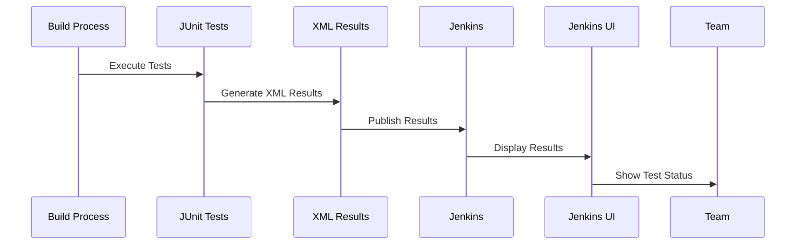
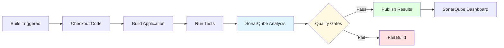
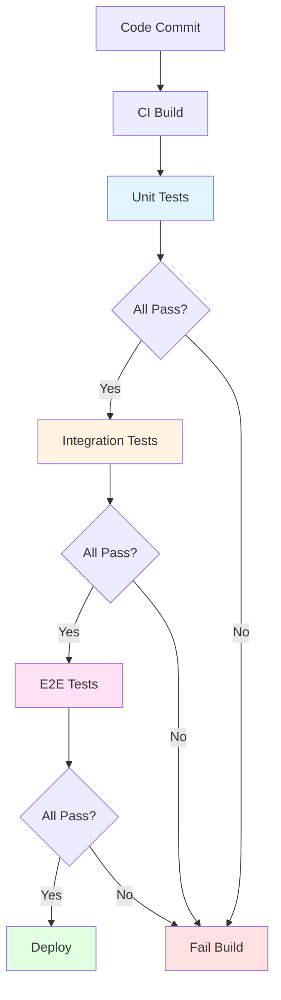

# Module 11: Jenkins Testing and Quality

## 11.1 Unit Testing

### JUnit Integration

JUnit is the most popular testing framework for Java, and Jenkins provides excellent integration with JUnit through the JUnit plugin. JUnit integration allows Jenkins to collect test results, display them in the Jenkins UI, track test trends over time, and provide detailed test reports. When JUnit tests run as part of a build, test results are published to Jenkins, making them visible to the team.

JUnit integration works by publishing JUnit XML test result files that Jenkins can parse and display. The JUnit plugin collects these XML files, aggregates test results, and provides visualization including: test result summaries, individual test details, test execution history, and test trend charts. Failed tests are highlighted, making it easy to identify issues quickly.

Configuration involves: running JUnit tests as part of the build (typically through Maven, Gradle, or Ant), configuring the build to publish JUnit test results (specifying the XML file location pattern), and viewing results in the Jenkins UI. The JUnit plugin automatically detects and publishes test results when XML files are found in the specified pattern.

#### JUnit Test Result Flow

### TestNG Integration

TestNG is another popular Java testing framework that provides more advanced features than JUnit, including test groups, dependencies, and parallel execution. Jenkins integrates with TestNG through the TestNG Results plugin, which works similarly to JUnit integration but handles TestNG-specific features.

TestNG integration provides: test result visualization, test group organization, test dependency tracking, and parallel test execution results. The TestNG plugin parses TestNG XML output files and displays results in a format that highlights TestNG features like test groups and dependencies.

Configuration is similar to JUnit: run TestNG tests during the build, configure the TestNG Results plugin to publish test results, and view results in Jenkins. TestNG integration helps teams using TestNG take advantage of its advanced features while maintaining visibility in Jenkins.

### Test Result Publishing

Test result publishing makes test outcomes visible in Jenkins, providing teams with visibility into test execution and results. Publishing is done through plugins like JUnit, TestNG, or generic test result publishers. Published results include: test counts (total, passed, failed, skipped), test execution times, test details (which tests passed or failed), and test history (trends over time).

Test result publishing should be configured in post-build actions or pipeline post blocks. The publisher needs to know where to find test result files (typically XML files generated by test frameworks). Once published, test results appear in build summaries, job pages, and test result pages.

Effective test result publishing provides: immediate visibility into test outcomes, historical trends showing test health over time, and detailed information for debugging failures. Understanding test result publishing helps teams maintain visibility into test quality.

### Test Reporting

Test reporting in Jenkins goes beyond just publishing test results to include: test trend analysis, test coverage reporting, flaky test detection, and test execution analytics. Test reports help teams understand test health, identify problematic tests, and track testing progress over time.

Test reporting includes: trend charts showing how test counts and outcomes change over time, test duration analysis identifying slow tests, failure analysis showing which tests fail most often, and test coverage reports showing how much code is tested. These reports help teams make data-driven decisions about testing.

Reporting is typically provided through plugins and dashboards. Teams can create custom dashboards that show test metrics and trends. Understanding test reporting helps teams monitor and improve their testing practices.

### Test Best Practices

Test best practices in Jenkins include: running tests as part of every build, publishing test results consistently, maintaining fast test execution (slow tests reduce feedback speed), keeping tests reliable (flaky tests reduce confidence), and tracking test trends to identify issues early.

Best practices also include: organizing tests logically, naming tests descriptively, keeping test results visible, and using test results to gate deployments (preventing deployment if tests fail). Following test best practices helps teams maintain high code quality and catch issues early.

---

## 11.2 Code Quality

### SonarQube Integration

SonarQube is a popular code quality and security analysis platform that integrates with Jenkins through the SonarQube plugin. SonarQube integration allows Jenkins builds to perform code analysis, identify code smells, security vulnerabilities, and bugs, and publish results to SonarQube for detailed analysis and tracking.

SonarQube integration involves: installing and configuring the SonarQube plugin, setting up SonarQube server connection, configuring SonarQube analysis in builds, and viewing results in SonarQube. The integration enables code quality gates that can fail builds if quality thresholds aren't met.

SonarQube provides: code quality metrics (maintainability, reliability, security), code coverage analysis, duplicate code detection, technical debt estimation, and security vulnerability scanning. Understanding SonarQube integration helps teams maintain code quality standards.

#### SonarQube Integration Flow

### Code Coverage Tools

Code coverage tools measure how much of your code is exercised by tests, providing insight into test completeness. Jenkins integrates with various coverage tools: JaCoCo (Java), Cobertura (Java), Istanbul (JavaScript), and others. Coverage plugins publish coverage reports to Jenkins, making coverage visible and trackable.

Coverage integration involves: running tests with coverage instrumentation, generating coverage reports, publishing coverage to Jenkins, and viewing coverage in Jenkins UI. Coverage reports show: line coverage, branch coverage, function coverage, and coverage trends over time.

Coverage metrics help teams: identify untested code, guide test writing efforts, and track coverage improvements. However, high coverage doesn't guarantee code quality, and coverage should be used as one metric among many. Understanding coverage tools helps teams measure and improve test coverage.

### Static Code Analysis

Static code analysis examines code without executing it, identifying potential issues like bugs, security vulnerabilities, code smells, and style violations. Jenkins integrates with various static analysis tools: Checkstyle, PMD, FindBugs, ESLint, and others. Analysis tools scan code and publish results to Jenkins.

Static analysis integration involves: configuring analysis tools, running analysis during builds, publishing analysis results, and viewing findings in Jenkins. Analysis results can be used to: fail builds if critical issues are found, track code quality trends, and guide code improvements.

Static analysis helps teams: catch issues before they reach production, maintain coding standards, and identify technical debt. Understanding static analysis helps teams maintain code quality.

### Code Quality Gates

Code quality gates enforce quality standards by failing builds if quality thresholds aren't met. Quality gates can check: test coverage (minimum coverage percentage), code quality metrics (maintainability ratings), security vulnerabilities (no critical vulnerabilities), and code smells (maximum allowed issues).

Quality gate configuration involves: defining quality criteria, setting thresholds, and configuring gates in builds or pipelines. Quality gates ensure that only code meeting quality standards is deployed, helping maintain code quality over time.

Quality gates should be set appropriately: too strict and they block progress, too lenient and they don't provide value. Understanding quality gates helps teams enforce quality standards effectively.

### Quality Best Practices

Code quality best practices include: integrating quality checks into every build, setting appropriate quality thresholds, tracking quality trends over time, addressing quality issues promptly, and using multiple quality tools (no single tool catches everything).

Best practices also include: not relying solely on automated tools (human review is also important), balancing quality gates with development velocity, and using quality metrics to guide improvements. Following quality best practices helps teams maintain high code quality.

---

## 11.3 Security Scanning

### Security Scanning Tools

Security scanning tools identify security vulnerabilities in code, dependencies, and configurations. Jenkins integrates with various security scanners: OWASP Dependency-Check, Snyk, WhiteSource, Veracode, and others. Security scanners analyze code and dependencies for known vulnerabilities and publish results to Jenkins.

Security scanning integration involves: installing security scanning plugins, configuring scanners, running scans during builds, publishing scan results, and viewing findings in Jenkins. Security scans should run as part of CI to catch vulnerabilities early.

Security scanning helps teams: identify vulnerabilities before deployment, track security posture over time, and comply with security requirements. Understanding security scanning helps teams maintain secure applications.

### Dependency Scanning

Dependency scanning identifies vulnerabilities in third-party dependencies (libraries, packages, frameworks). Dependency scanners check dependencies against vulnerability databases and report known vulnerabilities. Jenkins integrates with dependency scanners through plugins.

Dependency scanning is crucial because: most applications use many dependencies, vulnerabilities in dependencies can affect your application, and new vulnerabilities are discovered regularly. Regular dependency scanning helps teams stay aware of vulnerabilities in their dependencies.

Dependency scanning integration involves: configuring scanners to check dependency manifests (pom.xml, package.json, etc.), running scans during builds, and reviewing findings. Understanding dependency scanning helps teams manage dependency security.

### Vulnerability Scanning

Vulnerability scanning identifies security vulnerabilities in code, configurations, and infrastructure. Jenkins integrates with vulnerability scanners that can check: application code for insecure patterns, container images for known vulnerabilities, infrastructure configurations for security issues, and deployed applications for runtime vulnerabilities.

Vulnerability scanning should be: integrated into CI/CD pipelines, run regularly, and reviewed promptly. Vulnerability findings should be prioritized and addressed based on severity. Understanding vulnerability scanning helps teams maintain secure applications.

### Security Reporting

Security reporting provides visibility into security posture, including: vulnerability counts and severity, security trend analysis, compliance status, and security metrics. Security reports help teams understand security status and track improvements over time.

Security reporting is typically provided through security scanning plugins and can be integrated into dashboards. Reports should be: accessible to security and development teams, actionable (providing guidance on addressing issues), and tracked over time.

Understanding security reporting helps teams maintain visibility into security posture.

### Security Best Practices

Security best practices include: scanning for vulnerabilities in every build, addressing critical vulnerabilities immediately, keeping dependencies updated, following secure coding practices, and integrating security into the development process (not as an afterthought).

Best practices also include: using multiple security tools (no single tool finds everything), prioritizing security findings, and maintaining security awareness. Following security best practices helps teams maintain secure applications.

---

## 11.4 Test Automation

### Automated Test Execution

Automated test execution runs tests automatically as part of CI/CD processes, providing immediate feedback on code quality. Jenkins enables automated test execution by: running tests as part of builds, executing tests in parallel for speed, running tests on appropriate agents, and reporting test results.

Automated test execution should be: fast (providing quick feedback), reliable (avoiding flaky tests), comprehensive (covering important scenarios), and integrated into every build. Effective test automation reduces manual testing effort and provides consistent quality checks.

Test automation patterns include: unit tests (run on every build), integration tests (run on integration builds), end-to-end tests (run on specific builds or schedules), and performance tests (run periodically or on demand). Understanding test automation patterns helps teams implement effective testing strategies.

#### Test Automation Flow

### Test Result Aggregation

Test result aggregation combines test results from multiple test runs, test suites, or test types into unified reports. Aggregation helps teams: understand overall test status, identify patterns across test suites, and track test health comprehensively.

Aggregation can be done: across multiple test types (unit, integration, e2e), across multiple builds (trend analysis), or across multiple projects (portfolio view). Aggregated results provide a comprehensive view of test quality.

Understanding test result aggregation helps teams get a complete picture of test status.

### Test Reporting Dashboards

Test reporting dashboards provide visual summaries of test status, trends, and metrics. Dashboards can show: test execution summaries, test trend charts, failure analysis, coverage metrics, and test health indicators. Dashboards help teams quickly understand test status without drilling into individual builds.

Dashboard configuration involves: selecting widgets that display test information, configuring dashboard layouts, and setting up dashboards for different audiences (team dashboards, executive dashboards). Effective dashboards provide: at-a-glance status, trend visibility, and actionable insights.

Understanding test reporting dashboards helps teams monitor test quality effectively.

### Test Failure Handling

Test failure handling involves: identifying failed tests quickly, providing useful failure information, notifying relevant teams, and preventing deployment of broken code. Effective failure handling ensures that test failures are addressed promptly and don't impact production.

Failure handling strategies include: failing builds immediately on test failures, providing detailed failure reports, sending notifications to relevant teams, and blocking deployments if tests fail. Understanding test failure handling helps teams respond to test failures effectively.

### Test Automation Patterns

Test automation patterns include: test pyramid (many unit tests, fewer integration tests, few e2e tests), test parallelization (running tests in parallel for speed), test data management (managing test data effectively), and test environment management (ensuring consistent test environments).

Understanding test automation patterns helps teams implement effective test automation strategies that provide value while maintaining efficiency.

---

## Quick Reference

### Testing Types
- **Unit Tests**: Fast, isolated tests
- **Integration Tests**: Component interaction tests
- **E2E Tests**: End-to-end application tests
- **Performance Tests**: Load and stress tests

### Quality Tools
- **SonarQube**: Code quality analysis
- **Checkstyle**: Code style checking
- **PMD**: Code analysis
- **Coverage**: Code coverage tools

---

## Common Pitfalls

### Pitfall 1: Not Running Tests
**Problem**: Bugs reach production
**Solution**: Always run tests in pipeline
**Prevention**: Make tests mandatory

### Pitfall 2: Ignoring Test Failures
**Problem**: Broken code in production
**Solution**: Fail builds on test failures
**Prevention**: Enforce test requirements

### Pitfall 3: Slow Test Execution
**Problem**: Long build times, delayed feedback
**Solution**: Parallelize tests, optimize test suite
**Prevention**: Design tests for speed

---

## Best Practices

1. **Run Tests Always**: Every build should run tests
2. **Fail on Failures**: Don't ignore test failures
3. **Parallelize Tests**: Speed up execution
4. **Publish Results**: Make results visible
5. **Track Coverage**: Monitor code coverage
6. **Use Quality Gates**: Enforce quality standards
7. **Optimize Test Suite**: Remove slow/unnecessary tests
8. **Test in Stages**: Unit → Integration → E2E
9. **Monitor Trends**: Track test metrics
10. **Document Tests**: Clear test documentation

---

## Further Reading

### Official Documentation
- [Testing in Pipelines](https://www.jenkins.io/doc/pipeline/tour/tests-and-artifacts/)
- [Test Reporting](https://www.jenkins.io/doc/pipeline/steps/)
- [Quality Gates](https://www.jenkins.io/doc/pipeline/steps/sonar/)

### Related Topics
- Build Tools Integration (Module 10)
- Deployment Automation (Module 12)
- CI/CD Patterns (Module 16)

---

*This module covers Jenkins testing and quality integration in detail. Understanding testing and quality tools helps teams maintain high code quality and catch issues early in the development process.*

