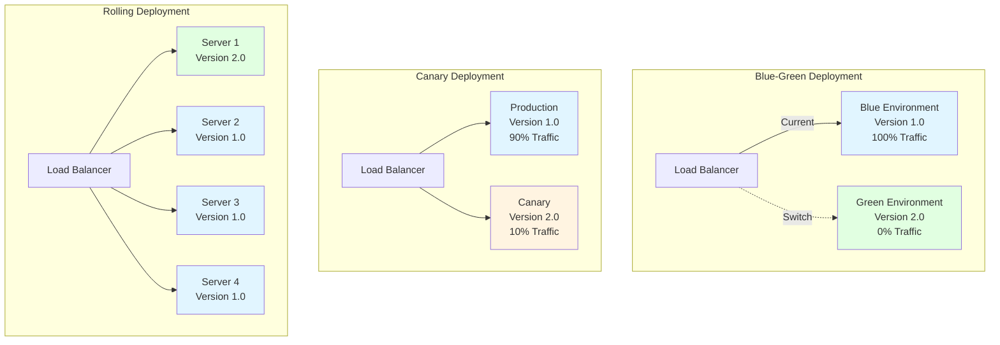
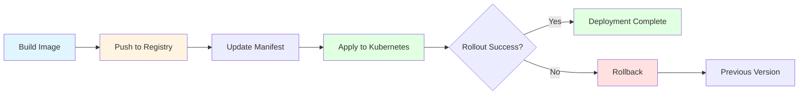
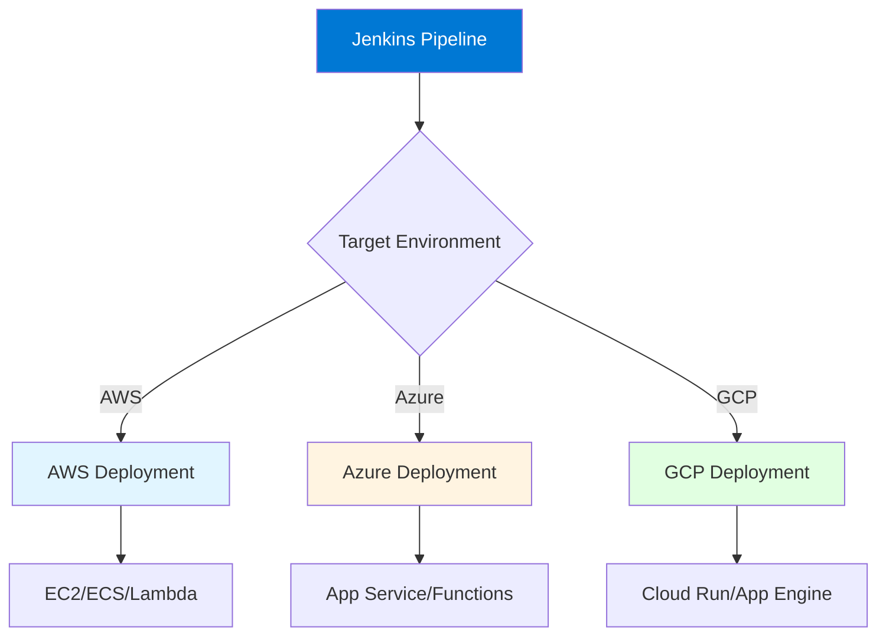

# Module 12: Jenkins Deployment Automation

## 12.1 Deployment Concepts

### Deployment Strategies

Deployment strategies define how applications are rolled out to production or other environments. Common strategies include: blue-green deployment (maintaining two identical environments and switching between them), canary deployment (gradually rolling out to a small subset before full rollout), rolling deployment (updating instances incrementally), and immutable deployment (replacing entire environments with new versions).

Each deployment strategy has different characteristics: blue-green provides zero downtime and instant rollback but requires double resources; canary minimizes risk by limiting initial exposure; rolling maintains availability during deployment but takes longer; immutable ensures consistency but requires complete replacement. Understanding deployment strategies helps you choose the right approach for your applications and risk tolerance.

Jenkins supports all these deployment strategies through pipeline configurations. Strategies can be implemented using Jenkins steps, deployment plugins, or integration with deployment tools. The choice of strategy depends on your application architecture, availability requirements, and risk tolerance.

#### Deployment Strategies Comparison



### Environment Management

Environment management involves organizing and managing deployment targets (development, test, staging, production). Environments should be: clearly defined, consistently configured, appropriately secured, and properly isolated. Environment management ensures that deployments go to the right places with the right configurations.

Environment management in Jenkins can involve: defining environments in pipeline configurations, using environment-specific variables, configuring environment-specific approvals, and managing environment-specific credentials. Proper environment management ensures consistency and reduces deployment errors.

Environment promotion (moving code through environments: dev → test → staging → production) should be automated and controlled. Promotion can be automatic for lower environments and require approvals for production. Understanding environment management helps you organize deployments effectively.

### Deployment Pipelines

Deployment pipelines automate the process of deploying applications through multiple environments. A typical deployment pipeline includes: building the application, running tests, deploying to development, deploying to test (after approval), deploying to staging (after approval), and deploying to production (after approval).

Deployment pipelines should be: automated (reducing manual errors), repeatable (consistent deployments), traceable (showing what was deployed where), and reversible (supporting rollback). Pipelines can be implemented using Jenkins Pipeline, which provides stages for each environment and approval gates between environments.

Deployment pipeline example:
```groovy
pipeline {
    agent any
    stages {
        stage('Build') {
            steps {
                sh 'mvn clean package'
            }
        }
        stage('Deploy to Dev') {
            steps {
                sh 'deploy.sh dev'
            }
        }
        stage('Deploy to Test') {
            when {
                branch 'main'
            }
            steps {
                input message: 'Deploy to Test?'
                sh 'deploy.sh test'
            }
        }
        stage('Deploy to Prod') {
            when {
                branch 'main'
            }
            steps {
                input message: 'Deploy to Production?'
                sh 'deploy.sh prod'
            }
        }
    }
}
```

### Rollback Strategies

Rollback strategies enable reverting to previous versions when deployments fail or cause issues. Rollback should be: fast (minimizing downtime), automated (reducing manual effort), and reliable (ensuring rollback works). Common rollback strategies include: blue-green rollback (switching back to the previous environment), version rollback (redeploying previous version), and database rollback (reverting database changes).

Rollback strategies should be: tested (ensuring rollbacks work), documented (clear procedures), and practiced (team knows how to rollback). Jenkins can automate rollback processes, making them faster and more reliable. Understanding rollback strategies helps you recover from deployment issues quickly.

### Deployment Best Practices

Deployment best practices include: automating deployments (reducing errors), testing deployments (verifying they work), using deployment strategies (minimizing risk), implementing rollback capabilities, monitoring deployments (verifying success), and documenting deployment processes.

Best practices also include: deploying to lower environments first, requiring approvals for production, using feature flags for gradual rollouts, and maintaining deployment runbooks. Following deployment best practices helps ensure reliable, safe deployments.

---

## 12.2 Docker Deployment

### Docker Plugin

The Docker plugin provides Docker integration for Jenkins, enabling builds to create Docker images, push images to registries, and run containers. The Docker plugin supports: building images from Dockerfiles, tagging images, pushing to registries, running containers, and using Docker-based agents.

Docker plugin configuration includes: setting up Docker installations on agents, configuring Docker registries and credentials, and using Docker steps in pipelines. The plugin makes it easy to work with Docker in Jenkins builds and deployments.

Understanding the Docker plugin helps you containerize applications and deploy them using Docker.

### Building Docker Images

Building Docker images in Jenkins involves: creating Dockerfiles in your repositories, using Docker build steps in pipelines, tagging images appropriately, and pushing images to registries. Docker builds should: use multi-stage builds for efficiency, tag images with versions, and cache layers for speed.

Docker build example:
```groovy
stage('Build Docker Image') {
    steps {
        script {
            def image = docker.build("myapp:${env.BUILD_NUMBER}")
            image.push()
            image.push("myapp:latest")
        }
    }
}
```

Building Docker images enables containerized deployments. Understanding Docker image building helps you create deployable container images.

### Pushing to Registries

Pushing Docker images to registries makes them available for deployment. Registries include: Docker Hub, Azure Container Registry, Amazon ECR, Google Container Registry, and private registries. Pushing involves: authenticating to registries, tagging images appropriately, and pushing images.

Registry push configuration includes: setting up registry credentials, configuring registry URLs, and using push steps in pipelines. Understanding registry pushing helps you make images available for deployment.

#### Docker Deployment Flow

```mermaid
sequenceDiagram
    participant Build as Jenkins Build
    participant Docker as Docker Build
    participant Registry as Container Registry
    participant Deploy as Deployment Target
    
    Build->>Docker: Build Image
    Docker->>Build: Image Created
    Build->>Registry: Push Image
    Registry->>Build: Image Stored
    Build->>Deploy: Deploy Image
    Deploy->>Registry: Pull Image
    Deploy->>Deploy: Run Container
    
    style Build fill:#e1f5ff
    style Docker fill:#fff4e1
    style Registry fill:#e1ffe1
    style Deploy fill:#ffe1f5
```

### Docker Deployment

Docker deployment involves: pulling images from registries, running containers with appropriate configurations, managing container lifecycles, and monitoring container health. Jenkins can automate Docker deployments using Docker plugins or deployment tools.

Docker deployment configuration includes: specifying images to deploy, configuring container settings (environment variables, ports, volumes), and managing container updates. Understanding Docker deployment helps you deploy containerized applications.

### Docker Best Practices

Docker best practices include: using multi-stage builds, keeping images small, using specific tags (not just "latest"), scanning images for vulnerabilities, and following Docker security best practices. Following best practices ensures secure, efficient Docker deployments.

---

## 12.3 Kubernetes Deployment

### Kubernetes Plugin

The Kubernetes plugin provides Kubernetes integration for Jenkins, enabling deployments to Kubernetes clusters. The plugin supports: deploying Kubernetes resources, using Kubernetes agents, and managing Kubernetes applications. The plugin makes it easy to deploy to Kubernetes from Jenkins.

Kubernetes plugin configuration includes: setting up Kubernetes cluster access (credentials and cluster URLs), configuring deployment manifests, and using Kubernetes steps in pipelines. Understanding the Kubernetes plugin helps you deploy to Kubernetes.

### Kubernetes Credentials

Kubernetes credentials provide secure access to Kubernetes clusters. Credentials typically include: cluster URLs, authentication tokens or certificates, and namespace information. Credentials are managed in Jenkins's credential system and used by the Kubernetes plugin.

Credential configuration ensures secure access to Kubernetes clusters. Understanding Kubernetes credentials helps you set up secure Kubernetes deployments.

### Deployment Manifests

Kubernetes deployment manifests define how applications are deployed to Kubernetes. Manifests can be: stored in source control, templated for different environments, and applied using kubectl or Kubernetes plugins. Manifests define deployments, services, ingress, and other Kubernetes resources.

Manifest management involves: versioning manifests with code, using templates for environment-specific values, and validating manifests before applying. Understanding deployment manifests helps you deploy applications to Kubernetes effectively.

### Kubernetes Deployment

Kubernetes deployment from Jenkins involves: applying deployment manifests, updating deployments, rolling out new versions, and managing deployment lifecycles. Jenkins can automate these processes, making Kubernetes deployments part of CI/CD pipelines.

Deployment processes can include: validating manifests, applying resources, waiting for rollout, verifying deployment success, and handling rollbacks. Understanding Kubernetes deployment helps you automate Kubernetes operations.

#### Kubernetes Deployment Flow



### Kubernetes Best Practices

Kubernetes best practices include: using deployment resources (not pods directly), implementing health checks, using configmaps and secrets appropriately, implementing resource limits, and following Kubernetes security best practices. Following best practices ensures reliable Kubernetes deployments.

---

## 12.4 Cloud Deployments

### AWS Deployment

AWS deployment from Jenkins involves deploying applications to AWS services like EC2, ECS, Lambda, or Elastic Beanstalk. AWS deployment can use: AWS CLI, AWS plugins, or AWS SDKs. Deployment processes vary by service but typically involve: building applications, creating deployment packages, and deploying to AWS services.

AWS deployment configuration includes: setting up AWS credentials, configuring AWS services, and using AWS deployment steps in pipelines. AWS deployments can leverage: CloudFormation for infrastructure, CodeDeploy for application deployment, and other AWS services.

Understanding AWS deployment helps you deploy to AWS from Jenkins.

### Azure Deployment

Azure deployment from Jenkins involves deploying to Azure services like App Service, Azure Functions, or Azure Container Instances. Azure deployment uses: Azure CLI, Azure plugins, or Azure SDKs. Deployment processes include: building applications, creating deployment packages, and deploying to Azure services.

Azure deployment configuration includes: setting up Azure service principals, configuring Azure services, and using Azure deployment steps. Azure deployments can use: ARM templates for infrastructure, Azure DevOps for deployment, and other Azure services.

Understanding Azure deployment helps you deploy to Azure from Jenkins.

### GCP Deployment

GCP deployment from Jenkins involves deploying to GCP services like Cloud Run, App Engine, or Compute Engine. GCP deployment uses: gcloud CLI, GCP plugins, or GCP SDKs. Deployment processes include: building applications, creating deployment packages, and deploying to GCP services.

GCP deployment configuration includes: setting up GCP service accounts, configuring GCP services, and using GCP deployment steps. GCP deployments can use: Deployment Manager for infrastructure, Cloud Build for builds, and other GCP services.

Understanding GCP deployment helps you deploy to GCP from Jenkins.

### Cloud-Specific Plugins

Cloud-specific plugins provide integrations with cloud providers: AWS plugins, Azure plugins, and GCP plugins. These plugins provide: cloud service management, deployment automation, and cloud resource management. Plugins make it easier to work with cloud services from Jenkins.

Plugin configuration varies by provider but typically includes: setting up cloud credentials, configuring cloud services, and using cloud-specific steps in pipelines. Understanding cloud plugins helps you leverage cloud services effectively.

#### Multi-Cloud Deployment Architecture



### Cloud Deployment Patterns

Cloud deployment patterns include: infrastructure as code (deploying infrastructure with applications), blue-green in cloud (using cloud features for blue-green), serverless deployment (deploying to serverless platforms), and multi-region deployment (deploying to multiple regions). Understanding patterns helps you deploy effectively to cloud platforms.

---

## Quick Reference

### Deployment Strategies
- **Blue-Green**: Instant switchover
- **Canary**: Gradual rollout
- **Rolling**: Incremental updates
- **Recreate**: Stop and replace

### Deployment Targets
- **Containers**: Docker, Kubernetes
- **Cloud**: AWS, Azure, GCP
- **Traditional**: VMs, bare metal
- **Serverless**: Lambda, Functions

---

## Common Pitfalls

### Pitfall 1: Manual Deployment Steps
**Problem**: Human error, inconsistency
**Solution**: Fully automate deployments
**Prevention**: Eliminate manual steps

### Pitfall 2: No Rollback Plan
**Problem**: Difficult recovery from failures
**Solution**: Implement automated rollback
**Prevention**: Test rollback procedures

### Pitfall 3: Not Testing Deployments
**Problem**: Broken deployments in production
**Solution**: Test in staging first
**Prevention**: Deploy to staging before production

---

## Best Practices

1. **Automate Everything**: No manual deployment steps
2. **Use Deployment Strategies**: Blue-green, canary, etc.
3. **Test Deployments**: Verify in staging
4. **Implement Rollback**: Quick recovery capability
5. **Monitor Deployments**: Track deployment health
6. **Use Infrastructure as Code**: Version control infrastructure
7. **Document Processes**: Clear deployment documentation
8. **Version Artifacts**: Tag all deployments
9. **Secure Deployments**: Use secure credentials
10. **Review Regularly**: Optimize deployment processes

---

## Further Reading

### Official Documentation
- [Deployment Plugins](https://plugins.jenkins.io/tag/deployment/)
- [Kubernetes Deployment](https://plugins.jenkins.io/kubernetes/)
- [Docker Deployment](https://www.jenkins.io/doc/book/pipeline/docker/)

### Related Topics
- Testing and Quality (Module 11)
- CI/CD Patterns (Module 16)
- Best Practices (Module 15)

---

*This module covers Jenkins deployment automation in detail. Understanding deployment automation helps you implement reliable, automated deployment processes that reduce errors and improve deployment speed.*

