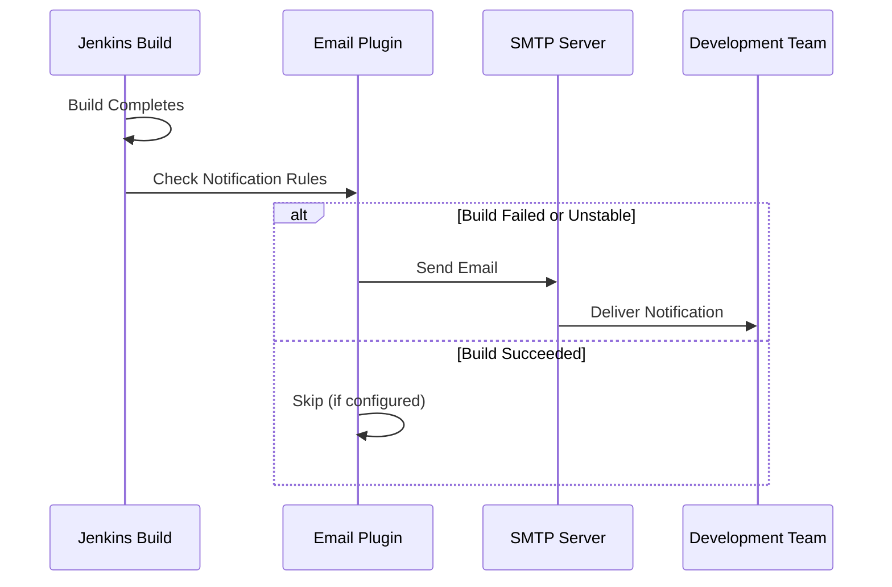
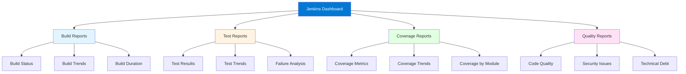

# Module 13: Jenkins Notifications and Reporting

## 13.1 Email Notifications

### Email Configuration

Email notifications keep teams informed about build status without requiring constant Jenkins monitoring. Email configuration is done in "Manage Jenkins" > "Configure System" under "E-mail Notification". Configuration includes: SMTP server address, SMTP port (25, 465 for SSL, 587 for TLS), SMTP authentication (if required), and the "From" email address.

Email configuration should be tested after setup to ensure emails are delivered correctly. Configuration can be done globally (for all jobs) or per-job (for job-specific settings). Global email configuration provides defaults, while job-specific configuration allows customization per job.

Understanding email configuration helps you set up reliable email notifications that keep teams informed about build status. Email notifications are essential for teams that need to know about build failures or successes without constantly checking Jenkins.

#### Email Notification Flow

### Email Templates

Email templates customize the format and content of email notifications. Templates can include: build information (job name, build number, status), build results (test results, coverage), build artifacts, and links to build details. Templates make emails more informative and useful.

Email template configuration varies by plugin but typically involves: selecting template types, customizing template content, and configuring template variables. Templates can be customized per job or globally. Understanding email templates helps you create informative email notifications.

### Notification Triggers

Notification triggers determine when emails are sent. Common triggers include: always (every build), failure (only on failures), success after failure (when builds are fixed), unstable (when builds are unstable), and changed (when build status changes). Trigger configuration determines how often teams receive emails.

Trigger configuration should balance information needs with notification fatigue. Too many emails can cause teams to ignore notifications, while too few can mean important information is missed. Understanding notification triggers helps you configure appropriate notification frequency.

### Email Best Practices

Email notification best practices include: sending emails only when necessary (avoiding notification fatigue), including useful information (build details, links, next steps), using clear subject lines, and testing email delivery. Best practices also include: configuring appropriate recipients (not everyone needs every email), using email distribution lists for teams, and customizing emails for different audiences.

Following email best practices ensures that notifications are useful and don't become noise. Understanding email best practices helps you configure effective email notifications.

### Advanced Email Settings

Advanced email settings include: email content customization, attachment configuration, HTML vs. plain text formatting, and email routing rules. Advanced settings allow fine-grained control over email notifications, enabling customization for different scenarios and audiences.

Advanced email configuration can be complex but provides flexibility for organizations with specific notification requirements. Understanding advanced email settings helps you customize notifications to meet your needs.

---

## 13.2 Slack Integration

### Slack Plugin

The Slack plugin integrates Jenkins with Slack, enabling Jenkins to send notifications to Slack channels. The plugin provides: build status notifications, custom messages, rich formatting, and integration with Slack workflows. Slack integration makes build notifications accessible in team communication channels.

Slack plugin configuration includes: setting up Slack workspace connection, configuring webhook URLs or API tokens, selecting channels for notifications, and customizing notification content. Configuration is done in job settings or globally, and notifications can be customized per job.

Understanding the Slack plugin helps you integrate Jenkins with Slack for team communication.

### Slack Webhooks

Slack webhooks provide a simple way to send messages to Slack channels. Webhook configuration involves: creating incoming webhooks in Slack, configuring webhook URLs in Jenkins, and sending messages from Jenkins builds. Webhooks are simpler than the full Slack API but provide less functionality.

Slack webhook configuration is straightforward: create a webhook in Slack (which provides a URL), configure the URL in Jenkins, and use webhook steps in pipelines or post-build actions. Understanding Slack webhooks helps you send notifications to Slack.

### Slack Notifications

Slack notifications from Jenkins can include: build status, build details, test results, deployment status, and custom messages. Notifications can be sent to: specific channels, user mentions, or Slack threads. Slack notifications keep teams informed without requiring them to check Jenkins.

Notification configuration includes: selecting what to notify about (builds, deployments, etc.), configuring notification content, and selecting notification channels. Understanding Slack notifications helps you keep teams informed through Slack.

### Slack Channels

Slack channel configuration determines which channels receive notifications. Channels can be: project-specific (each project has its own channel), team-specific (channels for different teams), or environment-specific (channels for different environments). Channel configuration helps organize notifications and ensure they reach the right audiences.

Channel management involves: creating appropriate channels, configuring Jenkins to use them, and managing channel membership. Understanding Slack channel configuration helps you organize notifications effectively.

### Slack Best Practices

Slack integration best practices include: using appropriate channels (not spamming general channels), including useful information in notifications, using Slack formatting (markdown, attachments), and configuring notification frequency appropriately. Best practices also include: using Slack threads for related notifications, mentioning relevant users when builds fail, and customizing notifications for different scenarios.

Following Slack best practices ensures that notifications are useful and don't clutter Slack channels. Understanding Slack best practices helps you configure effective Slack integrations.

---

## 13.3 Microsoft Teams Integration

### Teams Plugin

The Microsoft Teams plugin integrates Jenkins with Microsoft Teams, enabling Jenkins to send notifications to Teams channels. The plugin provides: build status notifications, rich cards with build information, and integration with Teams workflows. Teams integration makes build notifications accessible in Microsoft Teams.

Teams plugin configuration includes: setting up Teams webhook URLs, configuring notification channels, and customizing notification content. Configuration is similar to Slack integration but uses Teams-specific formatting and features.

Understanding the Teams plugin helps you integrate Jenkins with Microsoft Teams.

### Teams Webhooks

Teams webhooks provide a way to send messages to Teams channels. Webhook configuration involves: creating incoming webhooks in Teams, configuring webhook URLs in Jenkins, and sending messages from Jenkins builds. Teams webhooks use Office 365 Connector Cards for rich formatting.

Teams webhook configuration is straightforward and similar to Slack webhooks. Understanding Teams webhooks helps you send notifications to Teams.

### Teams Notifications

Teams notifications can include: build status, build details, test results, deployment status, and custom messages. Teams supports rich cards that can display: build information, test results, links, and action buttons. Teams notifications provide rich, interactive notifications.

Notification configuration includes: selecting notification types, configuring notification content, and formatting notifications using Teams cards. Understanding Teams notifications helps you create effective Teams integrations.

### Teams Channels

Teams channel configuration determines which channels receive notifications. Teams channels can be organized similarly to Slack channels: by project, team, or environment. Channel configuration helps ensure notifications reach the right audiences in Teams.

Understanding Teams channel configuration helps you organize Teams notifications effectively.

### Teams Integration Patterns

Teams integration patterns include: using Teams cards for rich notifications, organizing notifications by channel, using Teams connectors for automation, and integrating with Teams workflows. Understanding Teams integration patterns helps you implement effective Teams integrations.

---

## 13.4 Reporting

### Build Reports

Build reports provide summaries of build execution, including: build status, build duration, test results, code coverage, and build artifacts. Reports can be viewed: per build, aggregated across builds, or as trends over time. Build reports help teams understand build health and identify issues.

Report generation can be automatic (generated by plugins) or custom (created using reporting plugins). Reports are typically accessible through the Jenkins UI and can be included in dashboards. Understanding build reports helps teams monitor build health.

### Test Reports

Test reports provide detailed information about test execution, including: which tests passed or failed, test execution times, test trends, and test coverage. Test reports are generated by test result publishing plugins (JUnit, TestNG, etc.) and provide visibility into test quality.

Test reports help teams: understand test status, identify problematic tests, track test trends, and make data-driven decisions about testing. Understanding test reports helps teams maintain test quality.

### Coverage Reports

Coverage reports show code coverage metrics, including: line coverage, branch coverage, function coverage, and coverage trends. Coverage reports are generated by coverage plugins (JaCoCo, Cobertura, etc.) and help teams understand how much code is tested.

Coverage reports help teams: identify untested code, guide test writing efforts, and track coverage improvements. However, coverage should be used as one metric among many, as high coverage doesn't guarantee code quality. Understanding coverage reports helps teams measure test coverage.

#### Reporting Dashboard Example

### Custom Reports

Custom reports can be created using reporting plugins or by generating HTML reports that are published to Jenkins. Custom reports provide: project-specific information, aggregated data across projects, and custom visualizations. Custom reports help teams understand project-specific metrics and trends.

Custom report creation involves: generating report data (from builds, tests, or other sources), formatting reports (HTML, PDF, etc.), and publishing reports to Jenkins. Understanding custom reports helps teams create project-specific reporting.

### Report Dashboards

Report dashboards aggregate multiple reports into unified views, providing: comprehensive status overviews, trend analysis, and actionable insights. Dashboards can be customized for different audiences: team dashboards (detailed technical information), executive dashboards (high-level metrics), and project dashboards (project-specific information).

Dashboard configuration involves: selecting widgets that display reports, organizing dashboard layouts, and configuring dashboard permissions. Effective dashboards provide: at-a-glance status, trend visibility, and actionable insights.

Understanding report dashboards helps teams create effective reporting that provides value to different audiences.

---

## Quick Reference

### Notification Channels
- **Email**: Traditional notifications
- **Slack**: Team communication
- **Teams**: Microsoft Teams
- **Webhooks**: Custom integrations

### Reporting Plugins
- **Test Results**: JUnit, TestNG
- **Coverage**: Code coverage reports
- **Performance**: Build performance metrics
- **Custom**: Project-specific reports

---

## Common Pitfalls

### Pitfall 1: Too Many Notifications
**Problem**: Notification fatigue, ignored alerts
**Solution**: Configure notification filters
**Prevention**: Only notify on important events

### Pitfall 2: Not Publishing Reports
**Problem**: Lack of visibility, missed issues
**Solution**: Publish all relevant reports
**Prevention**: Configure report publishing

### Pitfall 3: Poor Report Organization
**Problem**: Hard to find information
**Solution**: Organize reports logically
**Prevention**: Use dashboards and views

---

## Best Practices

1. **Configure Notifications**: Appropriate channels
2. **Filter Notifications**: Only important events
3. **Publish Reports**: Make results visible
4. **Use Dashboards**: Aggregate information
5. **Customize for Audience**: Different views for different roles
6. **Monitor Trends**: Track metrics over time
7. **Archive Reports**: Keep historical data
8. **Document Configuration**: Clear documentation
9. **Test Notifications**: Verify notifications work
10. **Review Regularly**: Optimize notification settings

---

## Further Reading

### Official Documentation
- [Notifications](https://www.jenkins.io/doc/book/pipeline/syntax/#post)
- [Reporting Plugins](https://plugins.jenkins.io/tag/reporting/)
- [Slack Plugin](https://plugins.jenkins.io/slack/)

### Related Topics
- Testing and Quality (Module 11)
- Best Practices (Module 15)
- Troubleshooting (Module 17)

---

*This module covers Jenkins notifications and reporting in detail. Understanding notifications and reporting helps teams stay informed about build status and maintain visibility into CI/CD processes.*

