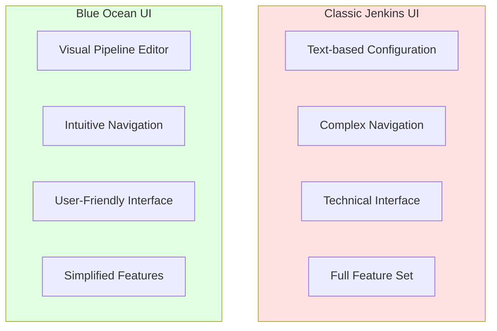
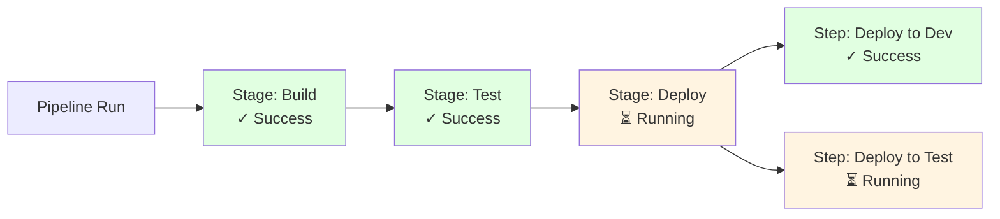

# Module 14: Jenkins Blue Ocean

## 14.1 Blue Ocean Overview

### What is Blue Ocean?

Blue Ocean is a modern user interface for Jenkins that provides an intuitive, visual way to create, visualize, and troubleshoot CI/CD pipelines. Blue Ocean reimagines the Jenkins user experience, making it more accessible to users who may find the classic Jenkins UI complex. Blue Ocean provides: a visual pipeline editor, pipeline visualization, better pipeline organization, and improved user experience.

Blue Ocean was designed to address common Jenkins UI challenges: complexity, difficulty in understanding pipeline flow, and steep learning curve. Blue Ocean provides a more intuitive interface that makes Jenkins more accessible while maintaining all the power and flexibility of Jenkins. However, Blue Ocean development has slowed, and some features may not be as actively maintained as the classic UI.

Blue Ocean is installed as a plugin and provides an alternative UI that can be accessed alongside the classic Jenkins UI. Users can switch between Blue Ocean and classic UI as needed. Understanding Blue Ocean helps you provide a better user experience for Jenkins users.

#### Blue Ocean vs. Classic UI

### Blue Ocean Features

Blue Ocean provides several key features: visual pipeline editor (creating pipelines through a graphical interface), pipeline visualization (seeing pipeline flow and status visually), pipeline activity (viewing all pipeline runs), pipeline branches (managing multiple branches), and pipeline favorites (quick access to frequently used pipelines).

Blue Ocean features are designed to make Jenkins more accessible and easier to use. The visual interface helps users understand pipeline flow, and the pipeline editor makes it easier to create pipelines without writing code. However, Blue Ocean has limitations and may not support all Jenkins features.

Understanding Blue Ocean features helps you decide when to use Blue Ocean vs. the classic UI.

### Blue Ocean vs. Classic UI

Blue Ocean and Classic UI serve different needs: Blue Ocean provides a modern, intuitive interface that's easier for new users, while Classic UI provides comprehensive access to all Jenkins features. Blue Ocean is better for: pipeline visualization, simple pipeline creation, and user-friendly interfaces. Classic UI is better for: advanced configuration, plugin management, and accessing all Jenkins features.

The choice between Blue Ocean and Classic UI depends on: user needs, feature requirements, and preferences. Many teams use both: Blue Ocean for pipeline visualization and Classic UI for administration and advanced features. Understanding the differences helps you choose the right interface.

#### Comparison Table: Blue Ocean vs. Classic UI

| Feature | Blue Ocean | Classic UI |
|---------|-----------|------------|
| **User Experience** | Modern, intuitive | Traditional, comprehensive |
| **Pipeline Creation** | Visual editor | Code-based |
| **Pipeline Visualization** | Excellent | Basic |
| **Feature Support** | Limited | Complete |
| **Learning Curve** | Low | Medium-High |
| **Best For** | Pipeline visualization | Full Jenkins access |

### Blue Ocean Installation

Blue Ocean installation is done through the plugin manager: "Manage Jenkins" > "Manage Plugins" > "Available" > search for "Blue Ocean" > install. Blue Ocean requires the Pipeline plugin (usually already installed) and works with Pipeline projects. After installation, Blue Ocean is accessible through a link in the Jenkins UI or directly via URL.

Blue Ocean installation is straightforward, but it's important to understand that Blue Ocean works primarily with Pipeline projects. Freestyle projects and other job types may have limited support in Blue Ocean. Understanding Blue Ocean installation helps you set up Blue Ocean correctly.

### Blue Ocean Navigation

Blue Ocean navigation is organized around pipelines: the main view shows pipelines (organized by folders or projects), clicking a pipeline shows pipeline activity (all runs), and clicking a run shows pipeline details (stage-by-stage execution). Navigation is designed to be intuitive and focused on pipeline workflows.

Blue Ocean navigation is different from Classic UI navigation, which is organized around jobs and system administration. Understanding Blue Ocean navigation helps you use Blue Ocean effectively.

---

## 14.2 Blue Ocean Pipelines

### Pipeline Visualization

Blue Ocean provides excellent pipeline visualization, showing pipeline stages and steps visually with their status (running, passed, failed, skipped). Visualization makes it easy to see: where a pipeline is in execution, which stages have completed, which stages are running, and which stages have failed. This visual feedback is much clearer than text-based console output.

Pipeline visualization includes: stage status indicators (colors show pass/fail), step details (clicking stages shows steps), log viewing (console output for steps), and artifact browsing (viewing build artifacts). Visualization helps users understand pipeline execution and troubleshoot issues.

Understanding pipeline visualization helps you take advantage of Blue Ocean's strengths.

#### Blue Ocean Pipeline Visualization

### Pipeline Editor

Blue Ocean's visual pipeline editor allows you to create pipelines through a graphical interface without writing code. The editor provides: a visual representation of pipeline stages, forms for configuring stages and steps, and validation to catch errors. The editor makes pipeline creation more accessible to users who aren't comfortable writing code.

Pipeline editor features include: adding stages and steps visually, configuring step parameters through forms, reordering stages by dragging, and validating pipeline syntax. The editor generates Pipeline code (Jenkinsfile) that can be stored in your repository.

The pipeline editor is useful for simple pipelines but has limitations for complex scenarios. Understanding the pipeline editor helps you create pipelines visually when appropriate.

### Pipeline Runs

Blue Ocean's pipeline runs view shows all executions of a pipeline, making it easy to see: build history, recent runs, run status, and run details. The runs view provides: quick access to recent runs, filtering and searching capabilities, and comparison between runs. This view helps you track pipeline execution over time.

Pipeline runs view is organized chronologically, with the most recent runs at the top. Each run shows: status, duration, trigger (what caused the run), and quick access to run details. Understanding the pipeline runs view helps you track pipeline execution.

### Pipeline Branches

Blue Ocean's pipeline branches view shows all branches that have pipelines, making it easy to manage multi-branch pipelines. The branches view shows: branch names, branch status, recent runs per branch, and branch-specific pipeline configurations. This view is essential for teams using multi-branch pipelines.

Branch management in Blue Ocean includes: viewing branch-specific pipelines, running pipelines on specific branches, and comparing branches. Understanding pipeline branches helps you manage multi-branch workflows effectively.

### Blue Ocean Best Practices

Blue Ocean best practices include: using Blue Ocean for pipeline visualization, using Classic UI for administration, creating pipelines in Blue Ocean for simple scenarios, and using code for complex pipelines. Best practices also include: understanding Blue Ocean limitations, using Blue Ocean alongside Classic UI, and training users on Blue Ocean features.

Following Blue Ocean best practices helps you leverage Blue Ocean's strengths while maintaining access to all Jenkins features through Classic UI when needed.

---

## 14.3 Blue Ocean Features

### Visual Pipeline Editor

The visual pipeline editor (covered in 14.2) is one of Blue Ocean's key features. It provides a graphical way to create pipelines, making Jenkins more accessible. The editor is useful for: simple pipelines, learning pipeline concepts, and quick pipeline creation. However, for complex pipelines, writing code is often more flexible.

The visual editor generates Pipeline code that can be edited manually if needed. Understanding the visual editor helps you create pipelines visually when appropriate and switch to code when needed.

### Pipeline Activity

Pipeline activity view shows all pipeline executions in a timeline, making it easy to see: when pipelines ran, which pipelines succeeded or failed, and pipeline execution patterns. The activity view provides: visual timeline of executions, filtering capabilities, and quick access to run details.

Pipeline activity helps teams understand: pipeline execution frequency, success rates, and execution patterns. Understanding pipeline activity helps you monitor pipeline health.

### Pipeline Details

Pipeline details view shows comprehensive information about a specific pipeline run, including: stage-by-stage execution, step details, console output, artifacts, and test results. The details view provides everything needed to understand what happened during a pipeline run.

Pipeline details help with: troubleshooting failures, understanding execution flow, and reviewing pipeline results. Understanding pipeline details helps you work with pipeline runs effectively.

### Personalization

Blue Ocean supports personalization, allowing users to customize their Blue Ocean experience. Personalization includes: favorite pipelines (quick access to frequently used pipelines), custom views, and user preferences. Personalization makes Blue Ocean more useful for individual users.

Understanding personalization helps you customize Blue Ocean for your workflow.

### Blue Ocean Limitations

Blue Ocean has limitations: it primarily works with Pipeline projects (limited support for freestyle projects), it doesn't support all Jenkins features (some advanced features require Classic UI), and development has slowed (some features may not be actively maintained). Understanding limitations helps you use Blue Ocean appropriately and switch to Classic UI when needed.

Limitations mean that Blue Ocean is best used alongside Classic UI rather than as a complete replacement. Teams typically use Blue Ocean for pipeline visualization and Classic UI for administration and advanced features.

---

## Quick Reference

### Blue Ocean Features
- **Pipeline Visualization**: Visual pipeline representation
- **Branch Management**: Automatic branch detection
- **Pull Request Integration**: PR build support
- **Modern UI**: Intuitive interface

### Accessing Blue Ocean
- **URL**: `http://jenkins-url/blue`
- **Installation**: Blue Ocean plugin
- **Requirements**: Pipeline projects

---

## Common Pitfalls

### Pitfall 1: Expecting Full Feature Parity
**Problem**: Some features missing in Blue Ocean
**Solution**: Use Classic UI for advanced features
**Prevention**: Understand Blue Ocean limitations

### Pitfall 2: Not Using Pipeline Projects
**Problem**: Limited Blue Ocean functionality
**Solution**: Use Pipeline projects
**Prevention**: Prefer Pipeline from the start

### Pitfall 3: Ignoring Classic UI
**Problem**: Missing advanced features
**Solution**: Use both UIs as needed
**Prevention**: Understand when to use each

---

## Best Practices

1. **Use for Pipelines**: Best for Pipeline projects
2. **Combine with Classic UI**: Use both as needed
3. **Leverage Visualization**: Use for pipeline visualization
4. **Use Branch Management**: Automatic branch detection
5. **Integrate PR Builds**: Pull request support
6. **Customize Views**: Personalize experience
7. **Train Users**: Help team learn Blue Ocean
8. **Monitor Performance**: Track UI performance
9. **Provide Feedback**: Report issues
10. **Stay Updated**: Keep plugin updated

---

## Further Reading

### Official Documentation
- [Blue Ocean](https://www.jenkins.io/doc/book/blueocean/)
- [Getting Started](https://www.jenkins.io/doc/book/blueocean/getting-started/)
- [Pipeline Editor](https://www.jenkins.io/doc/book/blueocean/pipeline-editor/)

### Related Topics
- Pipeline Declarative (Module 4)
- Integration with Version Control (Module 9)
- Best Practices (Module 15)

---

*This module covers Jenkins Blue Ocean in detail. Blue Ocean provides a modern, intuitive interface for Jenkins, making it more accessible while maintaining Jenkins's power and flexibility. Understanding Blue Ocean helps you provide a better user experience.*

