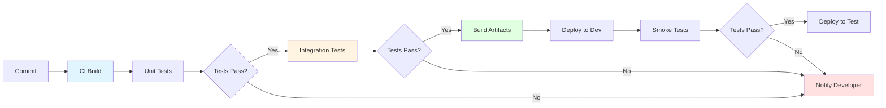
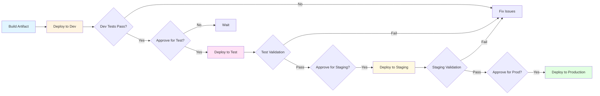
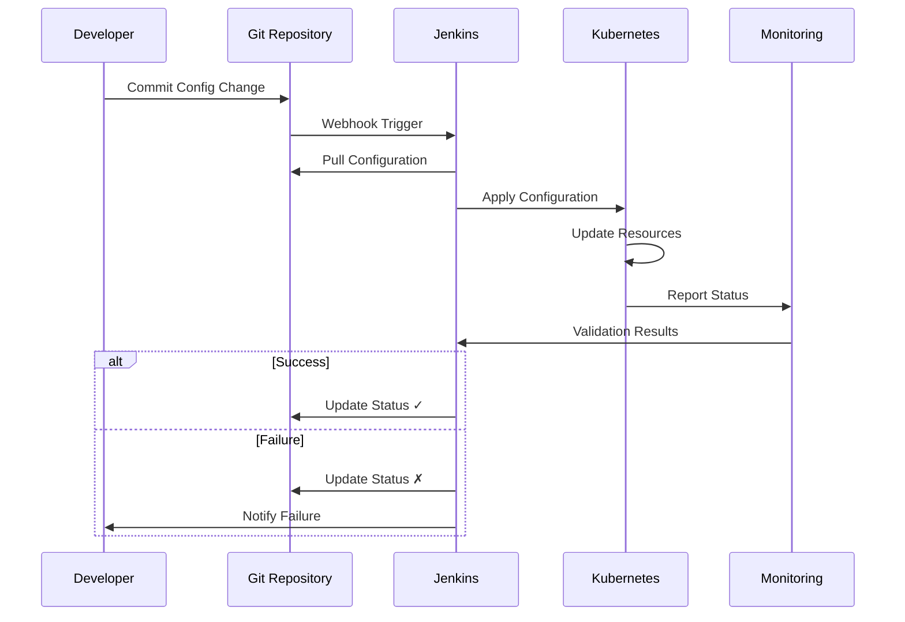

# Module 16: Jenkins CI/CD Patterns

## 16.1 CI/CD Patterns

### Build Patterns

Build patterns define how applications are built in CI/CD pipelines. Common patterns include: incremental builds (building only what changed), full builds (building everything from scratch), matrix builds (building with different configurations), and parallel builds (building components in parallel). Each pattern has trade-offs between speed and reliability.

Incremental builds are faster but may miss dependencies between components. Full builds are slower but more reliable. Matrix builds enable testing against multiple configurations. Parallel builds reduce overall build time when components are independent. Understanding build patterns helps you choose the right approach for your projects.

Build pattern implementation example:
```groovy
pipeline {
    agent any
    stages {
        stage('Build Components') {
            parallel {
                stage('Build API') {
                    steps {
                        sh 'cd api && ./build.sh'
                    }
                }
                stage('Build Web') {
                    steps {
                        sh 'cd web && ./build.sh'
                    }
                }
                stage('Build Mobile') {
                    steps {
                        sh 'cd mobile && ./build.sh'
                    }
                }
            }
        }
    }
}
```

#### CI/CD Pipeline Pattern



### Test Patterns

Test patterns define how tests are organized and executed in CI/CD. Common patterns include: test pyramid (many unit tests, fewer integration tests, few E2E tests), test parallelization (running tests in parallel), test sharding (distributing tests across agents), and test prioritization (running critical tests first). Test patterns help optimize test execution.

The test pyramid emphasizes: fast, focused unit tests for most coverage; integration tests for component interactions; and E2E tests for critical user journeys. This pattern provides good coverage while maintaining fast feedback. Understanding test patterns helps you design effective test strategies.

### Deploy Patterns

Deploy patterns define how applications are deployed. Common patterns include: blue-green deployment (switching between two environments), canary deployment (gradual rollout to subset), rolling deployment (incremental updates), and feature flags (enabling features progressively). Each pattern manages deployment risk differently.

Deploy pattern selection depends on: application architecture, availability requirements, risk tolerance, and rollback needs. Blue-green provides instant rollback but requires double resources. Canary minimizes risk through gradual rollout. Understanding deploy patterns helps you choose appropriate deployment strategies.

### Multi-Branch Patterns

Multi-branch patterns handle different branches differently. Common patterns include: main branch (production-ready code, deploys to production), develop branch (integration branch, deploys to dev/test), feature branches (feature development, CI only), and release branches (release preparation, deploys to staging). Multi-branch patterns help organize development workflows.

Multi-branch pipeline configuration:
```groovy
pipeline {
    agent any
    stages {
        stage('Build') {
            steps {
                sh 'mvn clean package'
            }
        }
        stage('Deploy to Dev') {
            when {
                branch 'develop'
            }
            steps {
                sh 'deploy.sh dev'
            }
        }
        stage('Deploy to Staging') {
            when {
                branch 'release/*'
            }
            steps {
                sh 'deploy.sh staging'
            }
        }
        stage('Deploy to Production') {
            when {
                branch 'main'
            }
            steps {
                input message: 'Deploy to production?'
                sh 'deploy.sh production'
            }
        }
    }
}
```

### Feature Branch Patterns

Feature branch patterns manage feature development. Common patterns include: short-lived feature branches (merged quickly), long-lived feature branches (larger features), feature toggles (disabling incomplete features), and pull request builds (building PRs for validation). Feature branch patterns help teams work on features safely.

Feature branch best practices include: keeping branches short-lived, building all branches, testing branches before merging, and cleaning up merged branches. Understanding feature branch patterns helps teams manage parallel feature development.

---

## 16.2 Multi-Environment Pipelines

### Environment Promotion

Environment promotion moves code through environments progressively: development → test → staging → production. Each environment serves a purpose: development for rapid iteration, test for QA validation, staging for production-like testing, and production for users. Promotion should be: automated (reducing errors), controlled (with approvals), and traceable (knowing what's deployed where).

Environment promotion pipeline:
```groovy
pipeline {
    agent any
    stages {
        stage('Build') {
            steps {
                sh 'mvn clean package'
            }
        }
        stage('Deploy to Dev') {
            steps {
                sh 'deploy.sh dev'
            }
        }
        stage('Deploy to Test') {
            steps {
                input message: 'Promote to Test?'
                sh 'deploy.sh test'
            }
        }
        stage('Deploy to Staging') {
            steps {
                input message: 'Promote to Staging?'
                sh 'deploy.sh staging'
            }
        }
        stage('Deploy to Production') {
            steps {
                input message: 'Promote to Production?', submitter: 'release-managers'
                sh 'deploy.sh production'
            }
        }
    }
}
```

#### Environment Promotion Flow



### Environment-Specific Configs

Environment-specific configurations handle differences between environments. Configuration management patterns include: configuration files per environment, environment variables, configuration management tools (Ansible, Chef), and secret management (Vault, cloud secrets). Proper configuration management ensures consistency while allowing environment-specific customization.

Configuration management example:
```groovy
pipeline {
    agent any
    parameters {
        choice(name: 'ENVIRONMENT', choices: ['dev', 'test', 'staging', 'prod'])
    }
    environment {
        CONFIG_FILE = "config-${params.ENVIRONMENT}.properties"
    }
    stages {
        stage('Deploy') {
            steps {
                sh "deploy.sh ${params.ENVIRONMENT} ${CONFIG_FILE}"
            }
        }
    }
}
```

### Approval Gates

Approval gates require manual approval before proceeding to sensitive stages like production deployment. Gates provide: human oversight for critical operations, compliance with change management processes, and risk management. Gates should be: clearly defined, assigned to appropriate approvers, and documented.

Approval gate implementation:
```groovy
stage('Deploy to Production') {
    steps {
        input message: 'Deploy to production?',
              submitter: 'release-managers,ops-team',
              parameters: [
                  string(name: 'APPROVER_NAME', description: 'Your name'),
                  text(name: 'REASON', description: 'Reason for deployment')
              ]
        echo "Approved by: ${APPROVER_NAME}"
        sh 'deploy.sh production'
    }
}
```

### Environment Management

Environment management involves: creating and maintaining environments, ensuring environment consistency, managing environment lifecycles, and monitoring environment health. Good environment management ensures reliable deployments and reduces environment-related issues.

Environment management practices include: using infrastructure as code, maintaining environment parity (keeping environments similar), automating environment setup, and regularly validating environments. Understanding environment management helps you maintain reliable deployment targets.

### Multi-Environment Best Practices

Multi-environment best practices include: automating promotions, implementing approval gates for production, using environment-specific configurations, testing in production-like environments (staging), and maintaining environment documentation. Best practices also include: keeping environments consistent, monitoring all environments, and implementing rollback capabilities.

Following multi-environment best practices helps you implement safe, reliable deployments across environments.

---

## 16.3 GitOps with Jenkins

### GitOps Concepts

GitOps is an operational framework that uses Git as the single source of truth for infrastructure and application configuration. In GitOps, desired state is declared in Git, and automation ensures actual state matches desired state. Changes are made through Git commits, providing: version control, audit trails, and rollback capabilities.

GitOps principles include: declarative configuration (desired state in Git), version control (all changes in Git), automated synchronization (tools ensure actual matches desired), and continuous reconciliation (monitoring and correcting drift). GitOps provides a robust operational model that aligns with modern DevOps practices.

Jenkins can implement GitOps by: monitoring Git repositories for changes, applying configurations when changes are detected, and validating that actual state matches desired state. Understanding GitOps concepts helps you implement infrastructure and application management through Git.

### GitOps Workflows

GitOps workflows define how changes flow through Git to production. Common workflows include: pull request workflow (changes reviewed before merging), promotion workflow (promoting between environments through Git), and automated sync workflow (continuous synchronization). Workflows should match team processes and provide appropriate controls.

GitOps workflow example:
1. Developer creates pull request with configuration changes
2. CI validates configuration (syntax, compliance, tests)
3. Team reviews and approves pull request
4. PR is merged to main branch
5. GitOps automation detects change and applies it
6. System validates actual state matches desired state

Understanding GitOps workflows helps you implement controlled, auditable deployments.

#### GitOps Workflow Diagram



### Infrastructure as Code

Infrastructure as Code (IaC) defines infrastructure in code files that can be versioned, reviewed, and automated. IaC tools include: Terraform, CloudFormation, ARM templates, Ansible, and Pulumi. IaC enables: repeatable infrastructure provisioning, version-controlled infrastructure, and infrastructure testing.

Jenkins integrates with IaC tools to: validate infrastructure code, provision infrastructure, and manage infrastructure lifecycles. IaC integration enables complete automation from infrastructure to application deployment.

IaC pipeline example:
```groovy
pipeline {
    agent any
    stages {
        stage('Validate') {
            steps {
                sh 'terraform validate'
            }
        }
        stage('Plan') {
            steps {
                sh 'terraform plan -out=tfplan'
            }
        }
        stage('Apply') {
            when {
                branch 'main'
            }
            steps {
                input message: 'Apply infrastructure changes?'
                sh 'terraform apply tfplan'
            }
        }
    }
}
```

### GitOps Patterns

GitOps patterns include: declarative infrastructure (infrastructure defined in code), application deployment (applications deployed through Git), configuration management (configurations in Git), and policy as code (policies enforced through code). Patterns provide proven approaches to GitOps implementation.

GitOps patterns help teams: maintain consistency, ensure auditability, enable automation, and implement best practices. Understanding GitOps patterns helps you implement effective GitOps workflows.

### GitOps Best Practices

GitOps best practices include: keeping all configuration in Git, using pull requests for changes, implementing automated validation, maintaining environment branches or directories, and monitoring actual vs. desired state. Best practices also include: implementing rollback procedures, testing changes before production, and documenting GitOps processes.

Following GitOps best practices helps you implement reliable, auditable infrastructure and application management.

---

## Quick Reference

### CI/CD Patterns
- **Build Once, Deploy Many**: Single artifact, multiple environments
- **Pipeline as Code**: Version-controlled pipelines
- **Infrastructure as Code**: Version-controlled infrastructure
- **GitOps**: Git as source of truth

### Deployment Patterns
- **Blue-Green**: Zero-downtime deployment
- **Canary**: Gradual rollout
- **Feature Flags**: Gradual feature rollout

---

## Common Pitfalls

### Pitfall 1: Not Following Patterns
**Problem**: Inconsistent workflows, technical debt
**Solution**: Use established patterns
**Prevention**: Study and apply patterns

### Pitfall 2: Over-Engineering
**Problem**: Unnecessary complexity
**Solution**: Start simple, add complexity gradually
**Prevention**: Evaluate pattern necessity

### Pitfall 3: Not Adapting Patterns
**Problem**: Patterns don't fit use case
**Solution**: Adapt patterns to your needs
**Prevention**: Understand pattern principles

---

## Best Practices

1. **Follow Patterns**: Use established CI/CD patterns
2. **Start Simple**: Add complexity gradually
3. **Version Control**: Store all code in Git
4. **Automate Everything**: No manual steps
5. **Test Thoroughly**: Comprehensive testing
6. **Monitor Deployments**: Track deployment health
7. **Document Patterns**: Clear documentation
8. **Review Regularly**: Optimize workflows
9. **Share Knowledge**: Team understanding
10. **Adapt as Needed**: Customize for your needs

---

## Further Reading

### Official Documentation
- [Pipeline Patterns](https://www.jenkins.io/doc/pipeline/examples/)
- [CI/CD Best Practices](https://www.jenkins.io/doc/book/pipeline/pipeline-best-practices/)
- [GitOps](https://www.gitops.tech/)

### Related Topics
- Pipeline Declarative (Module 4)
- Deployment Automation (Module 12)
- Advanced Topics (Module 18)

---

*This module covers Jenkins CI/CD patterns in detail. Understanding patterns helps you implement effective, reliable CI/CD workflows that follow proven practices and avoid common pitfalls.*

