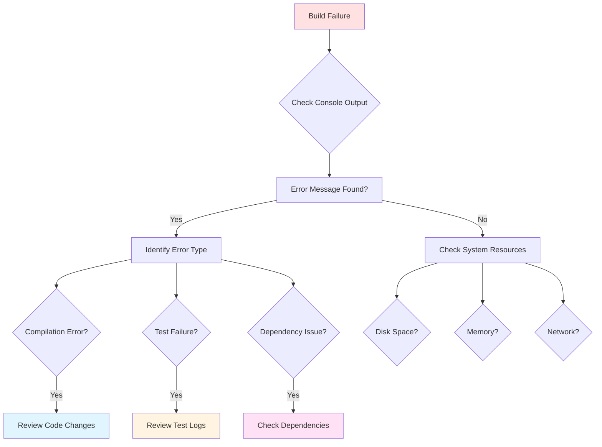
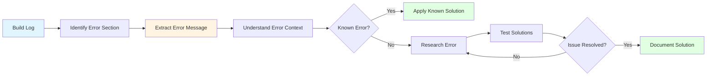
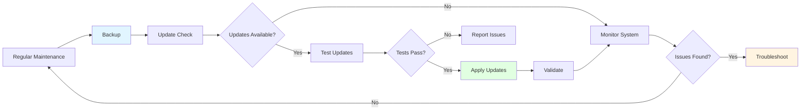

# Module 17: Jenkins Troubleshooting

## 17.1 Common Issues

### Build Failures

Build failures are the most common Jenkins issues. Common causes include: compilation errors (code doesn't compile), test failures (tests fail), dependency issues (missing or incompatible dependencies), environment issues (incorrect environment configuration), and resource issues (insufficient memory or disk space). Troubleshooting build failures requires: examining console output, reviewing recent changes, checking environment configuration, and reproducing issues locally.

Build failure troubleshooting steps:
1. Check console output for error messages
2. Identify what changed (code, dependencies, configuration)
3. Check environment configuration (paths, versions, variables)
4. Verify dependencies are available
5. Try reproducing locally
6. Check resource availability (disk space, memory)

Understanding build failure troubleshooting helps you resolve issues quickly and maintain build reliability.

#### Build Failure Troubleshooting Flow



### Agent Connection Issues

Agent connection issues prevent builds from running. Common causes include: network issues (firewall, connectivity), incorrect agent configuration (wrong ports, URLs), authentication problems (credential issues), and agent startup failures (Java issues, resource problems). Troubleshooting agent connections requires: checking network connectivity, verifying agent configuration, reviewing agent logs, and testing connections.

Agent connection troubleshooting steps:
1. Check agent status in Jenkins UI
2. Verify network connectivity (ping, telnet)
3. Check agent logs for errors
4. Verify agent configuration (URLs, ports, credentials)
5. Test agent connection manually
6. Check firewall rules

Understanding agent connection troubleshooting helps you maintain reliable build infrastructure.

### Plugin Conflicts

Plugin conflicts occur when plugins are incompatible with each other or with Jenkins. Symptoms include: Jenkins startup failures, plugin functionality issues, unexpected errors, and performance problems. Troubleshooting plugin conflicts requires: identifying problematic plugins, checking plugin compatibility, reviewing plugin documentation, and testing with minimal plugin sets.

Plugin conflict troubleshooting steps:
1. Check Jenkins logs for plugin errors
2. Review recently installed or updated plugins
3. Check plugin compatibility matrix
4. Disable suspected plugins one at a time
5. Test with minimal plugin set
6. Update or rollback plugins as needed

Understanding plugin conflict troubleshooting helps you maintain stable Jenkins installations.

### Performance Issues

Performance issues affect Jenkins responsiveness and build speed. Common causes include: insufficient resources (CPU, memory, disk), too many plugins, large build logs, inefficient pipelines, and database issues. Troubleshooting performance requires: monitoring resource usage, profiling Jenkins, analyzing slow operations, and optimizing configurations.

Performance troubleshooting steps:
1. Monitor system resources (CPU, memory, disk I/O)
2. Check Jenkins metrics and performance data
3. Identify slow operations (builds, page loads)
4. Review Jenkins configuration (heap size, executors)
5. Analyze plugin performance
6. Optimize pipelines and builds

Understanding performance troubleshooting helps you maintain responsive Jenkins installations.

### Configuration Problems

Configuration problems cause various issues. Common problems include: incorrect tool paths, missing credentials, wrong plugin settings, and misconfigured security. Troubleshooting configuration requires: reviewing configuration files, checking Jenkins UI settings, validating configurations, and comparing with working configurations.

Configuration troubleshooting steps:
1. Review relevant configuration sections
2. Check for typos or incorrect values
3. Validate configuration against documentation
4. Compare with known working configurations
5. Test configuration changes incrementally
6. Review Jenkins logs for configuration errors

Understanding configuration troubleshooting helps you resolve configuration issues efficiently.

---

## 17.2 Debugging Techniques

### Build Logs

Build logs are the primary source of build information. Logs contain: console output from build steps, error messages, warnings, and execution details. Effective log analysis requires: reading logs carefully, searching for error keywords, identifying error patterns, and understanding log context.

Log analysis techniques:
- Search for "ERROR", "FAIL", "Exception" keywords
- Check timestamps to identify when issues occurred
- Look for stack traces for detailed error information
- Check environment variables and paths
- Review the last successful build to identify changes

Understanding build log analysis helps you diagnose issues quickly.

#### Build Log Analysis



### System Logs

System logs provide information about Jenkins system operations. Logs include: Jenkins startup logs, plugin logs, security logs, and system events. System logs are located: in `$JENKINS_HOME/logs/` (for standard installations) or in system log directories (for service installations).

System log analysis:
- Check Jenkins startup log for initialization errors
- Review plugin logs for plugin-specific issues
- Check security logs for authentication/authorization issues
- Monitor system logs for resource issues

Understanding system log analysis helps you troubleshoot system-level issues.

### Pipeline Debugging

Pipeline debugging identifies issues in pipeline execution. Debugging techniques include: adding echo statements (printing debugging information), using try-catch blocks (handling errors gracefully), running pipeline snippets (testing small sections), and using pipeline replay (re-running with modifications).

Pipeline debugging example:
```groovy
pipeline {
    agent any
    stages {
        stage('Debug') {
            steps {
                script {
                    echo "Environment variables:"
                    sh 'printenv | sort'
                    
                    echo "Current directory:"
                    sh 'pwd'
                    
                    echo "Directory contents:"
                    sh 'ls -la'
                    
                    try {
                        sh 'possibly-failing-command.sh'
                    } catch (Exception e) {
                        echo "Error occurred: ${e.message}"
                        echo "Continuing with alternative approach"
                    }
                }
            }
        }
    }
}
```

Understanding pipeline debugging helps you identify and fix pipeline issues.

### Agent Debugging

Agent debugging identifies issues with agent execution. Debugging includes: checking agent logs, verifying agent configuration, testing agent connectivity, and monitoring agent resources. Agent logs are typically in: `$JENKINS_HOME/agents/` on the master or agent-specific log locations.

Agent debugging steps:
1. Check agent connection status
2. Review agent logs for errors
3. Verify agent configuration (labels, executors, tools)
4. Test network connectivity
5. Check agent resources (disk space, memory)
6. Verify tool installations on agent

Understanding agent debugging helps you troubleshoot agent-specific issues.

### Plugin Debugging

Plugin debugging identifies plugin-specific issues. Debugging includes: checking plugin logs, reviewing plugin documentation, testing plugin functionality, and verifying plugin configuration. Plugin issues can affect: plugin functionality, Jenkins performance, or system stability.

Plugin debugging steps:
1. Check Jenkins logs for plugin errors
2. Review plugin documentation
3. Verify plugin configuration
4. Test plugin functionality
5. Check plugin compatibility
6. Update or rollback plugin if needed

Understanding plugin debugging helps you troubleshoot plugin issues effectively.

---

## 17.3 Maintenance

### Backup and Restore

Backup and restore procedures protect Jenkins data and enable recovery. Backups should include: Jenkins home directory (configuration, jobs, plugins), build history, credentials, and plugin configurations. Backup strategies include: file system backups, plugin-based backups (ThinBackup plugin), and version control (Configuration as Code).

Backup best practices:
- Schedule regular backups (daily or more frequently)
- Test restore procedures regularly
- Store backups off-site or in cloud storage
- Include all critical Jenkins data
- Document backup and restore procedures

Restore procedures involve: stopping Jenkins, restoring Jenkins home directory, and starting Jenkins. Testing restore procedures ensures you can recover from failures.

Understanding backup and restore helps you protect Jenkins installations and recover from failures.

### Jenkins Updates

Jenkins updates provide: bug fixes, security patches, new features, and performance improvements. Update process involves: checking for updates, reviewing release notes, testing updates in non-production, backing up before updating, and performing updates during maintenance windows.

Update best practices:
- Keep Jenkins updated (especially for security patches)
- Review release notes before updating
- Test updates in development environment first
- Backup before updating
- Schedule updates during maintenance windows
- Have rollback plan ready

Understanding Jenkins updates helps you keep Jenkins current while maintaining stability.

### Plugin Updates

Plugin updates are managed through "Manage Plugins" > "Updates". Update considerations include: compatibility with Jenkins version, breaking changes, dependencies on other plugins, and impact on existing jobs. Plugin updates should be: tested before production, applied during maintenance windows, and documented.

Plugin update best practices:
- Review update notes before updating
- Test updates in development first
- Update dependencies together
- Have rollback plan
- Update regularly for security patches

Understanding plugin updates helps you keep plugins current while avoiding issues.

### Data Migration

Data migration moves Jenkins data between instances. Migration scenarios include: moving to new server, upgrading infrastructure, consolidating Jenkins instances, and disaster recovery. Migration involves: backing up source Jenkins, preparing target Jenkins, copying data, and validating migration.

Migration steps:
1. Backup source Jenkins
2. Install Jenkins on target (same version)
3. Stop both Jenkins instances
4. Copy Jenkins home directory to target
5. Start target Jenkins
6. Validate jobs and configuration
7. Update URLs and references

Understanding data migration helps you move Jenkins installations safely.

#### Jenkins Maintenance Cycle



### Maintenance Best Practices

Maintenance best practices include: scheduling regular maintenance, performing backups before changes, testing changes in development, documenting maintenance procedures, monitoring Jenkins health, and keeping Jenkins and plugins updated. Regular maintenance prevents issues and ensures reliable operation.

Maintenance checklist:
- Weekly: Check disk space, review failed builds
- Monthly: Review and clean old builds, check plugin updates
- Quarterly: Review user access, optimize performance
- Annually: Review Jenkins configuration, plan upgrades

Following maintenance best practices helps you maintain healthy Jenkins installations.

---

## Quick Reference

### Common Issues
- **Build Failures**: Check logs, verify configuration
- **Agent Connection**: Verify network, credentials
- **Plugin Errors**: Check compatibility, update plugins
- **Performance**: Monitor resources, optimize

### Troubleshooting Commands
```bash
# Check Jenkins logs
tail -f /var/log/jenkins/jenkins.log

# Check disk space
df -h

# Check Jenkins process
ps aux | grep jenkins
```

---

## Common Pitfalls

### Pitfall 1: Not Checking Logs
**Problem**: Difficult to diagnose issues
**Solution**: Always check logs first
**Prevention**: Understand log locations

### Pitfall 2: Not Backing Up Before Changes
**Problem**: Difficult to rollback
**Solution**: Backup before making changes
**Prevention**: Automate backup procedures

### Pitfall 3: Ignoring Warnings
**Problem**: Issues escalate to failures
**Solution**: Address warnings promptly
**Prevention**: Monitor for warnings

---

## Best Practices

1. **Check Logs First**: Start with log analysis
2. **Backup Before Changes**: Safe change procedures
3. **Document Issues**: Track problem resolution
4. **Monitor Health**: Proactive monitoring
5. **Test Changes**: Validate before production
6. **Keep Updated**: Regular updates
7. **Review Regularly**: Maintenance procedures
8. **Train Team**: Troubleshooting skills
9. **Use Tools**: Diagnostic tools
10. **Learn from Issues**: Improve processes

---

## Further Reading

### Official Documentation
- [Troubleshooting](https://www.jenkins.io/doc/book/troubleshooting/)
- [System Logs](https://www.jenkins.io/doc/book/system-administration/viewing-logs/)
- [Performance Tuning](https://www.jenkins.io/doc/book/system-administration/performance-tuning/)

### Related Topics
- Installation and Configuration (Module 2)
- Best Practices (Module 15)
- Advanced Topics (Module 18)

---

*This module covers Jenkins troubleshooting and maintenance in detail. Understanding troubleshooting techniques and maintenance procedures helps you maintain reliable Jenkins installations and resolve issues efficiently.*

