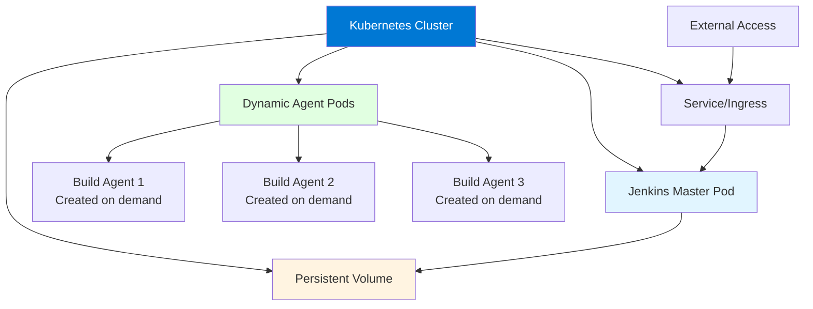
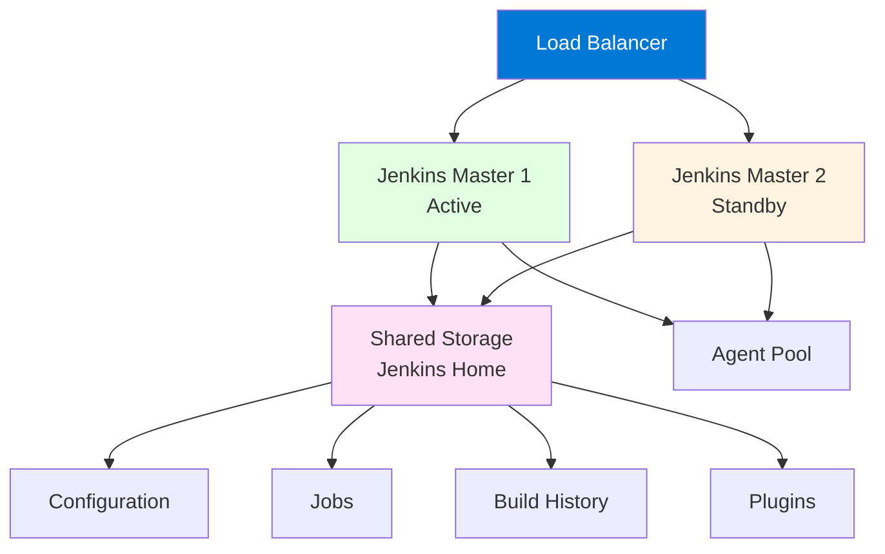

# Module 18: Jenkins Advanced Topics

## 18.1 Jenkins on Kubernetes

### Jenkins on K8s

Running Jenkins on Kubernetes provides: scalability (automatic scaling), high availability (pod restarts), resource efficiency (dynamic agents), and cloud-native integration. Jenkins on Kubernetes can be deployed using: Helm charts (package manager), Kubernetes manifests (YAML files), or operators (automated management). This deployment model is ideal for cloud-native organizations.

Jenkins on Kubernetes architecture includes: Jenkins master pod (running Jenkins controller), persistent volumes (for Jenkins home), services (for network access), and dynamic agent pods (created on-demand for builds). This architecture provides a scalable, resilient Jenkins deployment.

Kubernetes deployment example using Helm:
```bash
# Add Jenkins Helm repository
helm repo add jenkins https://charts.jenkins.io
helm repo update

# Install Jenkins
helm install jenkins jenkins/jenkins \
  --set controller.serviceType=LoadBalancer \
  --set persistence.enabled=true \
  --set persistence.size=20Gi
```

Understanding Jenkins on Kubernetes helps you deploy Jenkins in cloud-native environments.

#### Jenkins on Kubernetes Architecture



### Dynamic Agents

Dynamic agents in Kubernetes are pods created on-demand for builds and destroyed after completion. Dynamic agents provide: resource efficiency (no idle agents), isolation (each build in its own pod), flexibility (different pod configurations per build), and scalability (unlimited agent capacity). Dynamic agents are configured using the Kubernetes plugin.

Pod template configuration example:
```groovy
pipeline {
    agent {
        kubernetes {
            yaml '''
apiVersion: v1
kind: Pod
metadata:
  labels:
    jenkins: agent
spec:
  containers:
  - name: maven
    image: maven:3.8.6-jdk-11
    command:
    - cat
    tty: true
  - name: docker
    image: docker:latest
    command:
    - cat
    tty: true
    volumeMounts:
    - name: docker-sock
      mountPath: /var/run/docker.sock
  volumes:
  - name: docker-sock
    hostPath:
      path: /var/run/docker.sock
'''
        }
    }
    stages {
        stage('Build') {
            steps {
                container('maven') {
                    sh 'mvn clean package'
                }
            }
        }
        stage('Docker Build') {
            steps {
                container('docker') {
                    sh 'docker build -t myapp .'
                }
            }
        }
    }
}
```

Understanding dynamic agents helps you leverage Kubernetes for scalable build infrastructure.

### Helm Charts

Helm charts provide packaged Kubernetes deployments for Jenkins. The official Jenkins Helm chart includes: pre-configured Jenkins deployment, persistent storage, service configuration, and customization options. Helm simplifies Jenkins deployment on Kubernetes by providing a tested, configurable package.

Helm chart customization:
```yaml
# values.yaml
controller:
  image: jenkins/jenkins
  tag: lts
  serviceType: LoadBalancer
  resources:
    requests:
      cpu: "500m"
      memory: "1Gi"
    limits:
      cpu: "2000m"
      memory: "4Gi"
  installPlugins:
    - kubernetes:latest
    - workflow-aggregator:latest
    - git:latest
persistence:
  enabled: true
  size: 20Gi
  storageClass: standard
```

Understanding Helm charts helps you deploy Jenkins on Kubernetes efficiently.

### Kubernetes Plugins

Kubernetes plugins for Jenkins include: Kubernetes plugin (dynamic agent management), Kubernetes CLI plugin (kubectl commands), and Kubernetes Continuous Deploy plugin (deployment automation). These plugins enable Jenkins to work seamlessly with Kubernetes.

The Kubernetes plugin provides: dynamic pod creation, pod template configuration, multi-container pods, and resource management. Understanding Kubernetes plugins helps you integrate Jenkins with Kubernetes effectively.

### K8s Best Practices

Kubernetes best practices for Jenkins include: using persistent volumes for Jenkins home, configuring resource requests and limits, implementing high availability, using namespace isolation, implementing security policies, and monitoring Jenkins pods. Best practices also include: using dynamic agents for builds, configuring appropriate storage, and implementing backup procedures.

Following Kubernetes best practices ensures reliable, scalable Jenkins deployments on Kubernetes.

---

## 18.2 Jenkins as Code

### Configuration as Code Plugin

The Configuration as Code (JCasC) plugin enables Jenkins configuration through YAML files stored in version control. JCasC provides: version-controlled configuration, reproducible Jenkins setups, automated configuration, and configuration validation. JCasC makes Jenkins configuration manageable and auditable.

JCasC configuration example:
```yaml
jenkins:
  systemMessage: "Jenkins configured automatically by JCasC"
  numExecutors: 2
  mode: NORMAL
  scmCheckoutRetryCount: 2
  
  securityRealm:
    local:
      allowsSignup: false
      users:
        - id: admin
          password: ${JENKINS_ADMIN_PASSWORD}
  
  authorizationStrategy:
    globalMatrix:
      permissions:
        - "Overall/Administer:admin"
        - "Overall/Read:authenticated"
  
  clouds:
    - kubernetes:
        name: "kubernetes"
        serverUrl: "https://kubernetes.default"
        namespace: "jenkins"
        jenkinsUrl: "http://jenkins:8080"

unclassified:
  location:
    url: "https://jenkins.example.com"
  
credentials:
  system:
    domainCredentials:
      - credentials:
          - usernamePassword:
              scope: GLOBAL
              id: "github-credentials"
              username: "jenkins-bot"
              password: "${GITHUB_TOKEN}"
```

Understanding JCasC helps you manage Jenkins configuration as code.

### Job DSL Plugin

The Job DSL plugin enables job creation through Groovy scripts. Job DSL provides: programmatic job creation, job templates, consistent job configuration, and automation. Job DSL is useful for organizations with many similar jobs.

Job DSL example:
```groovy
// Create multiple jobs from a template
def services = ['api', 'web', 'mobile']

services.each { service ->
    pipelineJob("${service}-build") {
        definition {
            cpsScm {
                scm {
                    git {
                        remote {
                            url("https://github.com/company/${service}.git")
                            credentials('github-credentials')
                        }
                        branch('main')
                    }
                }
                scriptPath('Jenkinsfile')
            }
        }
        triggers {
            githubPush()
        }
    }
}
```

Understanding Job DSL helps you automate job creation.

### Pipeline as Code

Pipeline as Code (covered in Module 4) stores pipeline definitions in Jenkinsfiles in version control. This approach provides: version control, code review, testing, and consistency. Pipeline as Code is fundamental to modern Jenkins usage.

### Infrastructure as Code

Infrastructure as Code (IaC) for Jenkins includes: using Terraform/CloudFormation for Jenkins infrastructure, using Configuration as Code for Jenkins config, using Job DSL for job creation, and using pipeline libraries for reusable logic. IaC enables complete automation of Jenkins infrastructure and configuration.

### Best Practices

Jenkins as Code best practices include: storing all configuration in version control, using Configuration as Code plugin, automating job creation with Job DSL, testing configuration changes, and documenting configuration. Best practices ensure that Jenkins configuration is manageable, auditable, and reproducible.

---

## 18.3 High Availability

### HA Concepts

High availability (HA) ensures Jenkins remains available even when failures occur. HA concepts include: redundancy (multiple instances), failover (automatic switching), load balancing (distributing load), and data consistency (shared state). HA is essential for critical Jenkins installations.

Jenkins HA challenges include: Jenkins's stateful nature (Jenkins home contains all state), master-agent architecture (master is single point of failure), and plugin compatibility (not all plugins support HA). HA solutions must address these challenges.

Understanding HA concepts helps you design resilient Jenkins installations.

### Master Redundancy

Master redundancy provides multiple Jenkins masters for resilience. Approaches include: active-passive (primary master with backup), active-active (multiple active masters), and CloudBees Jenkins Operations Center (commercial solution). Master redundancy is complex because Jenkins state must be shared or synchronized.

Active-passive setup uses: shared storage for Jenkins home, load balancer directing traffic to active master, and automatic failover when primary fails. Active-active is more complex, requiring state synchronization.

Understanding master redundancy helps you implement resilient Jenkins architectures.

#### High Availability Architecture



### Load Balancing

Load balancing distributes requests across multiple Jenkins masters. Load balancing provides: improved performance, better resource utilization, and failover capability. Load balancers can be: hardware appliances, software load balancers (HAProxy, Nginx), or cloud load balancers (AWS ELB, Azure Load Balancer).

Load balancer configuration must handle: session affinity (routing users to same master), health checks (detecting master failures), and SSL termination (handling HTTPS). Understanding load balancing helps you distribute Jenkins load effectively.

### HA Patterns

HA patterns for Jenkins include: shared filesystem pattern (multiple masters sharing Jenkins home), distributed pattern (separate masters with centralized management), and cloud-native pattern (Kubernetes-based with pod management). Each pattern has trade-offs in complexity, cost, and reliability.

Understanding HA patterns helps you choose appropriate HA approaches for your requirements.

### HA Best Practices

HA best practices include: using shared storage for Jenkins home, implementing health checks and monitoring, testing failover procedures regularly, maintaining identical master configurations, implementing backup procedures, and documenting HA architecture. Best practices ensure that HA implementations work when needed.

---

## 18.4 Jenkins X

### Jenkins X Overview

Jenkins X is a cloud-native CI/CD platform built on Kubernetes that provides: automated CI/CD for Kubernetes applications, GitOps workflows, preview environments, and Tekton-based pipelines. Jenkins X is designed for cloud-native development and provides an opinionated, automated approach to CI/CD.

Jenkins X differs from Jenkins: Jenkins X is Kubernetes-native, uses Tekton for pipelines, provides automated environments, and focuses on cloud-native applications. Jenkins X is a separate project, not a version of Jenkins.

Understanding Jenkins X helps you evaluate it for cloud-native development.

### Jenkins X Features

Jenkins X features include: automated CI/CD (pipelines created automatically), GitOps (configuration in Git), preview environments (temporary environments for pull requests), promotion (automated promotion between environments), and addons (integrated tools). Features provide an integrated platform for cloud-native development.

Understanding Jenkins X features helps you understand its capabilities.

### Jenkins X vs. Jenkins

Jenkins X and Jenkins serve different needs: Jenkins is flexible and supports any workflow, while Jenkins X is opinionated and focused on Kubernetes. Jenkins X is better for: cloud-native applications, Kubernetes deployments, and teams wanting automation. Jenkins is better for: diverse workloads, flexibility, and non-Kubernetes scenarios.

The choice depends on: infrastructure (Kubernetes or not), requirements (flexibility vs. automation), and team preferences. Understanding the differences helps you choose the right tool.

#### Comparison: Jenkins vs. Jenkins X

| Feature | Jenkins | Jenkins X |
|---------|---------|-----------|
| **Target** | Any CI/CD workflow | Cloud-native, Kubernetes |
| **Flexibility** | Very high | Moderate (opinionated) |
| **Pipeline Tech** | Jenkins Pipeline | Tekton |
| **Setup Complexity** | Medium | Low (automated) |
| **Best For** | Diverse workloads | Kubernetes apps |

### Jenkins X Use Cases

Jenkins X use cases include: Kubernetes-native applications, microservices development, cloud-native development, and teams wanting automated CI/CD. Jenkins X is ideal when: using Kubernetes, wanting automation over flexibility, and following cloud-native practices.

Understanding Jenkins X use cases helps you determine if it fits your needs.

### Getting Started with Jenkins X

Getting started with Jenkins X involves: installing Jenkins X CLI, creating/connecting Kubernetes cluster, installing Jenkins X, creating applications, and using automated pipelines. Jenkins X provides quickstarts for common application types.

Getting started example:
```bash
# Install Jenkins X CLI
curl -L https://github.com/jenkins-x/jx/releases/download/v3.2.0/jx-linux-amd64.tar.gz | tar xzv
sudo mv jx /usr/local/bin

# Create cluster and install Jenkins X
jx admin create

# Create application
jx create project quickstart --filter spring

# Application gets automated pipelines
```

Understanding how to get started helps you evaluate Jenkins X for your projects.

---

## Quick Reference

### Advanced Topics
- **Kubernetes**: Container orchestration deployment
- **Jenkins as Code**: Infrastructure as Code
- **High Availability**: Redundant Jenkins instances
- **Jenkins X**: Cloud-native CI/CD

### Kubernetes Deployment
```yaml
# Deploy Jenkins to Kubernetes
apiVersion: apps/v1
kind: Deployment
metadata:
  name: jenkins
spec:
  replicas: 1
  template:
    spec:
      containers:
      - name: jenkins
        image: jenkins/jenkins:lts
```

---

## Common Pitfalls

### Pitfall 1: Over-Engineering HA
**Problem**: Unnecessary complexity, cost
**Solution**: Evaluate HA requirements
**Prevention**: Start simple, add HA when needed

### Pitfall 2: Not Understanding Jenkins X
**Problem**: Wrong tool for use case
**Solution**: Understand Jenkins X purpose
**Prevention**: Evaluate requirements first

### Pitfall 3: Complex Kubernetes Setup
**Problem**: Difficult to maintain
**Solution**: Use Helm charts, simplify
**Prevention**: Use managed solutions when possible

---

## Best Practices

1. **Evaluate Requirements**: Understand needs first
2. **Start Simple**: Add complexity gradually
3. **Use Managed Solutions**: When available
4. **Document Architecture**: Clear documentation
5. **Test Thoroughly**: Validate advanced setups
6. **Monitor Performance**: Track metrics
7. **Plan for Scale**: Design for growth
8. **Secure Properly**: Advanced security
9. **Backup Regularly**: Protect data
10. **Review Regularly**: Optimize configuration

---

## Further Reading

### Official Documentation
- [Kubernetes Plugin](https://plugins.jenkins.io/kubernetes/)
- [Jenkins as Code](https://www.jenkins.io/doc/book/managing/jenkins-as-code/)
- [Jenkins X](https://jenkins-x.io/)

### Related Topics
- Installation and Configuration (Module 2)
- Agents and Distributed Builds (Module 7)
- Best Practices (Module 15)

---

*This module covers advanced Jenkins topics including Kubernetes deployment, Jenkins as Code, high availability, and Jenkins X. Understanding these advanced topics helps you implement sophisticated Jenkins deployments that meet enterprise requirements.*

