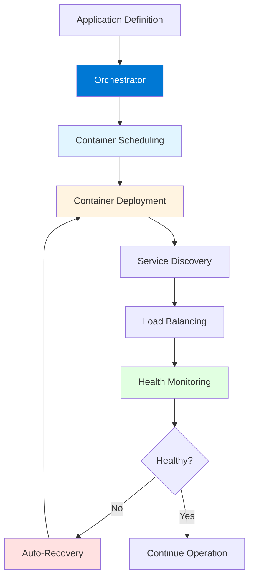
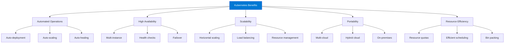
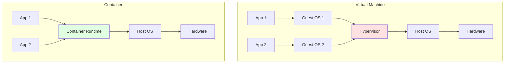
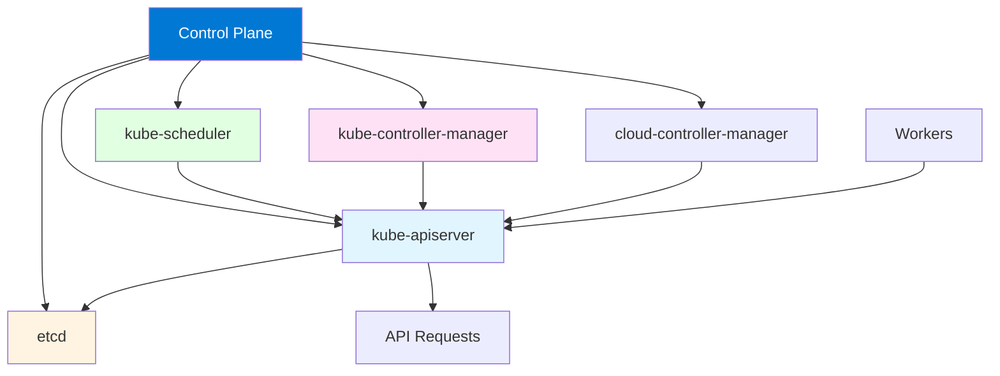
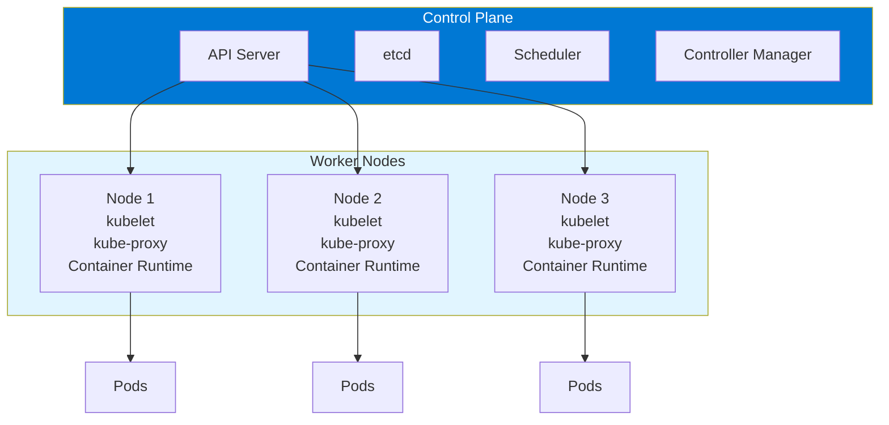

# Module 1: Introduction to Kubernetes

## 1.1 What is Kubernetes?

### Container Orchestration Concepts

Container orchestration is the automated management of containerized applications, including their deployment, scaling, networking, and lifecycle management. As applications grow from single containers to complex microservices architectures with hundreds or thousands of containers, manual management becomes impossible. Container orchestration platforms like Kubernetes automate these tasks, ensuring applications run reliably, scale efficiently, and recover from failures automatically.

The core challenges that orchestration solves include: service discovery (how containers find each other), load balancing (distributing traffic across multiple instances), health monitoring (detecting and recovering from failures), resource management (allocating CPU, memory, and storage), and rolling updates (updating applications without downtime). Orchestration platforms provide declarative configuration, where you describe the desired state of your application, and the platform ensures the actual state matches the desired state.

Kubernetes, originally developed by Google based on their internal Borg system, has become the de facto standard for container orchestration. It provides a comprehensive platform for managing containerized applications across clusters of machines, handling everything from basic deployment to complex multi-cloud scenarios. Understanding container orchestration concepts is fundamental to working with Kubernetes effectively.

#### Container Orchestration Flow



### Kubernetes History and Evolution

Kubernetes was originally developed by Google engineers who had experience with their internal container orchestration system called Borg. Google open-sourced Kubernetes in 2014, donating it to the Cloud Native Computing Foundation (CNCF) in 2015. Since then, Kubernetes has grown into one of the most successful open-source projects, with contributions from thousands of developers and adoption by organizations worldwide.

The name "Kubernetes" comes from Greek, meaning "helmsman" or "pilot," reflecting its role in steering containerized applications. The project is often abbreviated as "K8s" (K followed by 8 letters followed by s). Kubernetes has evolved through many versions, with each release adding new features, improving stability, and enhancing security. Major milestones include the introduction of Custom Resource Definitions (CRDs), the Operator pattern, service mesh integration, and improved multi-cloud support.

Kubernetes's evolution has been driven by the needs of the cloud-native community, resulting in features like Helm for package management, operators for complex application management, and extensive integration with cloud providers. The project's governance through CNCF ensures it remains vendor-neutral while benefiting from contributions across the industry. Understanding Kubernetes's history helps appreciate its design decisions and current capabilities.

### Kubernetes vs. Other Orchestration Tools

Kubernetes competes with several container orchestration platforms, each with different strengths. Docker Swarm is simpler but less feature-rich, making it suitable for smaller deployments. Apache Mesos provides a more general resource management framework but requires more configuration. Amazon ECS is tightly integrated with AWS but lacks portability. Each tool serves different use cases, but Kubernetes has emerged as the industry standard due to its comprehensive feature set, strong community, and broad ecosystem.

Kubernetes's advantages include: extensive feature set covering all orchestration needs, strong community support and ecosystem, vendor-neutral design enabling multi-cloud deployments, active development with regular releases, and certification programs (CKA, CKAD) for professionals. However, Kubernetes also has a steeper learning curve compared to simpler tools, which is why understanding the alternatives helps in choosing the right platform.

#### Comparison Table: Container Orchestration Tools

| Feature | Kubernetes | Docker Swarm | Apache Mesos | Amazon ECS |
|---------|-----------|-------------|--------------|------------|
| **Complexity** | High | Low | High | Medium |
| **Features** | Comprehensive | Basic | Extensive | AWS-focused |
| **Portability** | High (multi-cloud) | Medium | High | Low (AWS only) |
| **Community** | Very Large | Large | Medium | AWS-managed |
| **Learning Curve** | Steep | Gentle | Steep | Moderate |
| **Best For** | Production, complex apps | Simple deployments | Large-scale, diverse workloads | AWS-native apps |
| **Industry Adoption** | Very High | Moderate | Declining | AWS users |

### Key Benefits and Use Cases

Kubernetes provides numerous benefits that make it valuable for organizations. **Automated deployment and scaling** means applications can be deployed and scaled up or down automatically based on demand, without manual intervention. **Self-healing** capabilities automatically restart failed containers, replace unhealthy containers, and kill containers that don't respond to health checks. **Service discovery and load balancing** automatically expose containers using DNS names or IP addresses and distribute traffic across healthy containers.

**Storage orchestration** automatically mounts storage systems (local storage, cloud storage, network storage) as needed. **Automated rollouts and rollbacks** allow you to describe the desired state, and Kubernetes changes the actual state at a controlled rate, with automatic rollback if something goes wrong. **Secret and configuration management** lets you store and manage sensitive information separately from application code.

Kubernetes use cases include: microservices architectures (managing many small, independent services), cloud-native applications (applications designed for cloud environments), multi-cloud deployments (running applications across different cloud providers), hybrid cloud (combining on-premises and cloud resources), and DevOps automation (automating deployment and operations). Understanding these benefits and use cases helps you identify when Kubernetes is the right choice for your projects.

#### Kubernetes Benefits Overview



### Kubernetes Ecosystem

The Kubernetes ecosystem consists of tools, projects, and services that extend and complement Kubernetes. The ecosystem includes: **Helm** (package manager for Kubernetes), **Prometheus** (monitoring and alerting), **Grafana** (visualization dashboards), **Istio** (service mesh), **ArgoCD** (GitOps continuous delivery), **Fluentd** (log aggregation), and many others. These tools integrate with Kubernetes to provide complete solutions for running production applications.

The CNCF (Cloud Native Computing Foundation) hosts many of these projects, creating a cohesive ecosystem. The ecosystem also includes cloud provider services (EKS, AKS, GKE), managed Kubernetes offerings, and commercial distributions. Understanding the Kubernetes ecosystem helps you choose the right tools for your needs and leverage the full power of the cloud-native stack.

---

## 1.2 Container Fundamentals

### Container Concepts

Containers are lightweight, portable units that package applications with their dependencies, enabling consistent execution across different environments. Unlike virtual machines that virtualize hardware, containers virtualize the operating system, sharing the host OS kernel while providing isolated user spaces. This makes containers more efficient than VMs, using less memory and starting faster.

Containers provide: **isolation** (applications run in isolated environments), **portability** (containers run the same way across different platforms), **efficiency** (shared kernel reduces resource usage), **scalability** (easy to create and destroy containers), and **consistency** (same container runs the same way everywhere). Understanding container concepts is essential for Kubernetes, as Kubernetes orchestrates containers.

Container technology has evolved from early chroot implementations to modern container runtimes like containerd and CRI-O. The Open Container Initiative (OCI) has standardized container formats and runtimes, ensuring interoperability. Kubernetes uses the Container Runtime Interface (CRI) to work with different container runtimes, providing flexibility in choosing container technologies.

#### Container vs. Virtual Machine



### Docker Basics

Docker is the most popular container platform and is often used with Kubernetes. Docker provides tools for building, shipping, and running containers. Key Docker concepts include: **Dockerfile** (instructions for building container images), **Docker image** (read-only template for creating containers), **Docker container** (running instance of an image), **Docker registry** (repository for storing images), and **Docker Compose** (tool for defining multi-container applications).

Docker commands are fundamental for working with containers: `docker build` creates images from Dockerfiles, `docker run` starts containers from images, `docker ps` lists running containers, `docker images` lists available images, and `docker push/pull` uploads/downloads images to/from registries. While Kubernetes can work with any container runtime, Docker knowledge is valuable as many examples and tutorials use Docker.

Understanding Docker basics helps you work with containers before deploying them to Kubernetes. However, it's important to note that Kubernetes uses containerd (which Docker also uses) or CRI-O as the container runtime, not Docker directly in newer Kubernetes versions.

### Container Images

Container images are read-only templates used to create containers. Images are built from Dockerfiles, which contain instructions for creating the image. Images are organized in layers, with each instruction in a Dockerfile creating a new layer. This layering enables efficient storage and sharing, as common layers can be reused across multiple images.

Images are typically stored in registries like Docker Hub, Google Container Registry, or private registries. Images are identified by tags (like `nginx:1.21` or `myapp:v1.0.0`), with `latest` being the default tag. Best practices include: using specific tags (not just `latest`), keeping images small, using multi-stage builds, and scanning images for vulnerabilities.

Kubernetes pulls images from registries when creating containers. Understanding container images helps you build and manage the artifacts that Kubernetes deploys.

### Container Registries

Container registries are repositories for storing and distributing container images. Public registries like Docker Hub provide access to thousands of pre-built images. Private registries allow organizations to store proprietary images securely. Cloud providers offer managed registries (ECR, ACR, GCR) that integrate with their Kubernetes services.

Registry concepts include: **repositories** (collections of related images), **tags** (versions or variants of images), **authentication** (credentials for accessing private registries), and **vulnerability scanning** (checking images for security issues). Kubernetes uses image pull secrets to authenticate with private registries.

Understanding container registries helps you manage the images that Kubernetes uses, ensuring proper access control and security.

### Container Lifecycle

Container lifecycle includes: **creation** (building images, pulling from registries), **running** (executing containers), **stopping** (graceful shutdown), **removal** (deleting containers), and **restarting** (recreating containers). Kubernetes manages container lifecycles automatically, ensuring containers are running when needed and replaced when they fail.

Lifecycle management involves: **health checks** (determining if containers are healthy), **restart policies** (when to restart containers), **resource limits** (preventing containers from consuming too many resources), and **cleanup** (removing stopped containers). Understanding container lifecycle helps you configure Kubernetes to manage containers effectively.

---

## 1.3 Kubernetes Architecture

### Control Plane Components

The Kubernetes control plane is the brain of the cluster, making global decisions about the cluster and responding to cluster events. Control plane components include: **kube-apiserver** (the front-end for the Kubernetes API, handling all API requests), **etcd** (consistent and highly-available key-value store used as Kubernetes' backing store), **kube-scheduler** (watches for newly created Pods with no assigned node and selects a node for them to run on), **kube-controller-manager** (runs controller processes that regulate the state of the cluster), and **cloud-controller-manager** (runs controllers that interact with the underlying cloud providers).

The control plane can run on a single machine (for development) or across multiple machines (for high availability in production). In production, control plane components are typically replicated for redundancy. Understanding control plane components helps you understand how Kubernetes makes decisions and manages the cluster.

#### Kubernetes Control Plane Architecture



### Node Components

Node components run on every node and maintain running pods and provide the Kubernetes runtime environment. Node components include: **kubelet** (agent that runs on each node, ensuring containers are running in a Pod), **kube-proxy** (network proxy that maintains network rules on nodes, enabling Kubernetes service abstraction), and **container runtime** (software responsible for running containers, like containerd or CRI-O).

Nodes are the worker machines in Kubernetes, where containers actually run. Each node must have kubelet, kube-proxy, and a container runtime installed. The kubelet communicates with the control plane to receive instructions and report node status. Understanding node components helps you understand how Kubernetes executes workloads.

### Cluster Architecture

A Kubernetes cluster consists of one or more control plane nodes and one or more worker nodes. The control plane manages the cluster, while worker nodes run the application workloads. Clusters can range from single-node (for development) to thousands of nodes (for large-scale production deployments).

Cluster architecture considerations include: **high availability** (multiple control plane nodes for redundancy), **networking** (how nodes communicate), **storage** (persistent storage for applications), and **security** (authentication, authorization, network policies). Understanding cluster architecture helps you design and deploy Kubernetes clusters that meet your requirements.

#### Kubernetes Cluster Architecture



### API Server

The kube-apiserver is the front-end of the Kubernetes control plane and the only component that communicates with etcd. It exposes the Kubernetes API, which is used by all components (kubectl, kubelet, controllers, etc.) to interact with the cluster. The API server validates and processes API requests, updates etcd, and notifies other components of changes.

The API server provides: **authentication** (verifying user identity), **authorization** (checking permissions), **admission control** (validating and mutating requests), and **API versioning** (supporting multiple API versions). Understanding the API server helps you understand how Kubernetes processes requests and maintains cluster state.

### etcd

etcd is a distributed, consistent key-value store used as Kubernetes' backing store for all cluster data. etcd stores: cluster state, configuration data, and metadata. etcd is critical to Kubernetes operation - if etcd fails, the cluster cannot function properly. For production clusters, etcd should be run in a highly available configuration with multiple etcd instances.

etcd provides: **consistency** (all nodes see the same data), **availability** (tolerates node failures), **partition tolerance** (works despite network partitions), and **watch functionality** (notifying components of changes). Understanding etcd helps you understand how Kubernetes maintains cluster state and why etcd backup and high availability are critical.

---

## 1.4 Getting Started with Kubernetes

### Kubernetes Installation Options

Kubernetes can be installed in various ways depending on your environment and requirements. Installation options include: **managed services** (EKS, AKS, GKE - easiest, cloud-provider managed), **kubeadm** (tool for creating production-ready clusters), **minikube** (local development cluster), **kind** (Kubernetes in Docker), **k3s/k3d** (lightweight Kubernetes), and **custom installations** (manual setup for specific requirements).

For learning and development, minikube or kind are excellent choices as they run on a single machine. For production, managed services provide the easiest path, while kubeadm offers more control. The choice depends on your needs: development vs. production, cloud vs. on-premises, and control vs. convenience.

Understanding installation options helps you choose the right approach for your use case.

#### Kubernetes Installation Options Comparison

| Option | Complexity | Best For | Cloud/On-Prem |
|-------|-----------|----------|---------------|
| **Managed Services** | Low | Production | Cloud |
| **kubeadm** | Medium | Production, control | Both |
| **minikube** | Low | Development | Local |
| **kind** | Low | Development, CI/CD | Local |
| **k3s** | Low | Edge, IoT | Both |
| **Custom** | High | Special requirements | Both |

### Minikube Setup

Minikube is a tool that runs a single-node Kubernetes cluster on your local machine, perfect for learning and development. Minikube runs Kubernetes in a VM, container, or on bare metal. Setup involves: installing minikube, installing a hypervisor (VirtualBox, Hyper-V, etc.), and starting minikube.

Minikube setup steps:
```bash
# Install minikube (example for Linux)
curl -LO https://storage.googleapis.com/minikube/releases/latest/minikube-linux-amd64
sudo install minikube-linux-amd64 /usr/local/bin/minikube

# Start minikube
minikube start

# Verify installation
kubectl get nodes
```

Minikube provides a local Kubernetes environment without needing cloud resources. Understanding minikube helps you get started with Kubernetes quickly.

### kubectl Installation

kubectl is the command-line tool for interacting with Kubernetes clusters. kubectl is essential for all Kubernetes operations. Installation varies by platform but is straightforward.

kubectl installation examples:
```bash
# Linux
curl -LO "https://dl.k8s.io/release/$(curl -L -s https://dl.k8s.io/release/stable.txt)/bin/linux/amd64/kubectl"
sudo install -o root -g root -m 0755 kubectl /usr/local/bin/kubectl

# macOS
brew install kubectl

# Windows
# Download from Kubernetes releases or use Chocolatey
choco install kubernetes-cli
```

kubectl is the primary tool for Kubernetes administration and development. Understanding kubectl installation helps you get started with Kubernetes operations.

### Basic kubectl Commands

Basic kubectl commands are essential for working with Kubernetes. Key commands include: `kubectl get` (list resources), `kubectl describe` (detailed information about resources), `kubectl create` (create resources), `kubectl apply` (apply configuration files), `kubectl delete` (delete resources), `kubectl logs` (view container logs), and `kubectl exec` (execute commands in containers).

Command examples:
```bash
# List all pods
kubectl get pods

# Get detailed pod information
kubectl describe pod <pod-name>

# Create a deployment
kubectl create deployment nginx --image=nginx

# Apply a YAML file
kubectl apply -f deployment.yaml

# View logs
kubectl logs <pod-name>

# Execute command in pod
kubectl exec -it <pod-name> -- /bin/bash
```

Understanding basic kubectl commands is fundamental to working with Kubernetes.

### Cluster Access and Configuration

Cluster access involves configuring kubectl to connect to your Kubernetes cluster. Configuration is stored in `~/.kube/config` and includes: cluster information, authentication credentials, and context settings. You can have multiple clusters configured and switch between them using contexts.

Configuration management:
```bash
# View current context
kubectl config current-context

# List all contexts
kubectl config get-contexts

# Switch context
kubectl config use-context <context-name>

# View configuration
kubectl config view
```

For managed services, cluster access is typically configured automatically when you install cloud provider CLIs. Understanding cluster access and configuration helps you manage multiple Kubernetes clusters effectively.

---

## Quick Reference

### Kubernetes Components
- **Control Plane**: API Server, etcd, Scheduler, Controller Manager
- **Nodes**: kubelet, kube-proxy, Container Runtime
- **Add-ons**: DNS, Dashboard, Monitoring

### Common Commands
```bash
# Get cluster info
kubectl cluster-info

# Get nodes
kubectl get nodes

# Get all resources
kubectl get all

# Describe resource
kubectl describe <resource> <name>
```

---

## Common Pitfalls

### Pitfall 1: Not Understanding Pod Lifecycle
**Problem**: Confusion about Pod states and transitions
**Solution**: Study Pod lifecycle phases
**Prevention**: Practice with simple Pods first

### Pitfall 2: Overlooking Resource Limits
**Problem**: Resource exhaustion, poor performance
**Solution**: Always set resource requests and limits
**Prevention**: Use resource quotas

### Pitfall 3: Ignoring Cluster Architecture
**Problem**: Difficulty troubleshooting issues
**Solution**: Understand control plane and node components
**Prevention**: Study architecture documentation

---

## Best Practices

1. **Start with Managed Services**: EKS, AKS, GKE for beginners
2. **Understand Core Concepts**: Pods, Services, Deployments first
3. **Use Declarative Configuration**: YAML files, not imperative commands
4. **Set Resource Limits**: Prevent resource exhaustion
5. **Use Namespaces**: Organize resources
6. **Implement Health Checks**: Liveness and readiness probes
7. **Version Control Configs**: Store YAML in Git
8. **Monitor Cluster Health**: Use monitoring tools
9. **Follow Security Best Practices**: RBAC, network policies
10. **Document Configurations**: Clear comments and documentation

---

## Further Reading

### Official Documentation
- [Kubernetes Documentation](https://kubernetes.io/docs/)
- [Kubernetes Concepts](https://kubernetes.io/docs/concepts/)
- [Getting Started](https://kubernetes.io/docs/setup/)

### Related Topics
- Core Concepts (Module 2)
- Workloads (Module 6)
- Security (Module 8)

---

*This module provides a comprehensive introduction to Kubernetes, covering its purpose, architecture, and getting started. Understanding these fundamentals is essential for effectively using Kubernetes for container orchestration.*

