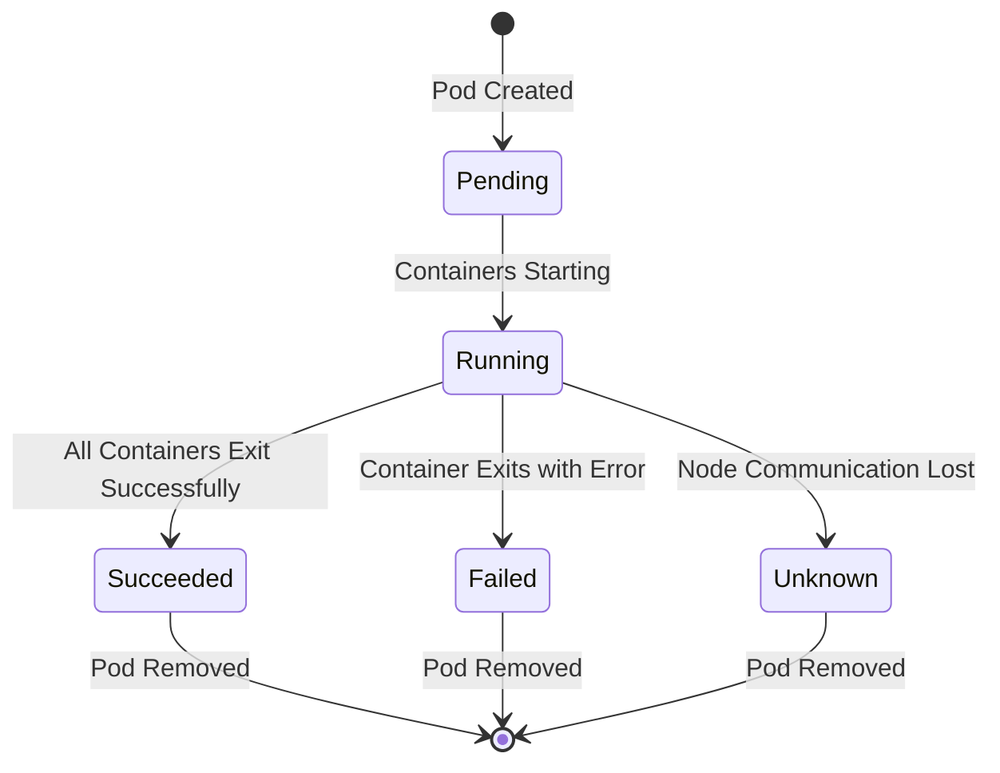
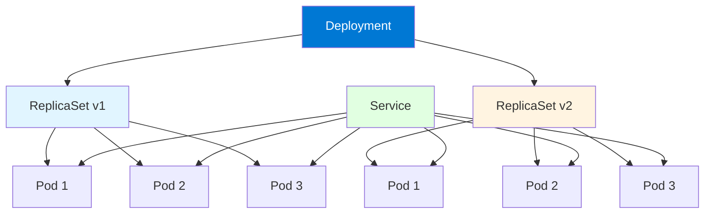
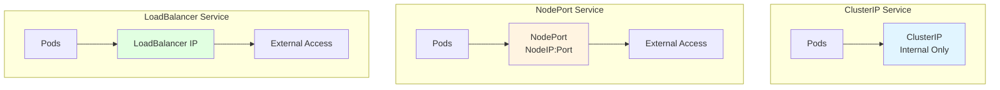
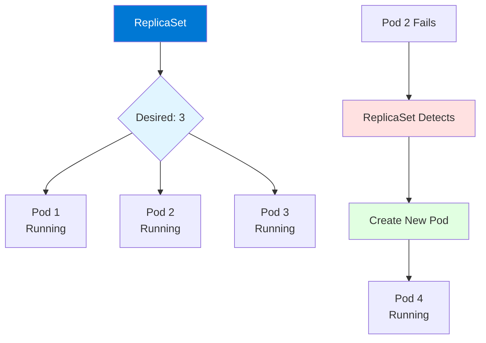

# Module 2: Kubernetes Core Concepts

## 2.1 Pods

### What are Pods?

Pods are the smallest deployable units of computing in Kubernetes. A Pod represents a single instance of a running process in your cluster and can contain one or more containers. Pods are ephemeral - they are created, assigned to a node, run until completion or termination, and are then removed. Pods provide a shared execution environment for their containers, including shared storage, networking, and specifications for how to run the containers.

The key concept is that containers in a Pod share the same network namespace, meaning they can communicate with each other using `localhost` and share the same IP address. They also share storage volumes, allowing them to share files. This design enables tightly coupled containers to work together efficiently. Understanding Pods is fundamental to Kubernetes, as all workloads run in Pods.

Pods are typically created and managed by higher-level controllers like Deployments, StatefulSets, or Jobs, rather than being created directly. However, understanding Pods directly is important for debugging, understanding how Kubernetes works, and for certain use cases like one-off tasks or debugging.

#### Pod Lifecycle



### Pod Specifications

Pod specifications define what containers to run, how to run them, and what resources they need. A Pod spec includes: **containers** (list of containers to run), **volumes** (storage to mount), **restart policy** (when to restart containers), **resource requests and limits** (CPU and memory requirements), **environment variables** (configuration for containers), and **probes** (health checks).

Example Pod specification:
```yaml
apiVersion: v1
kind: Pod
metadata:
  name: nginx-pod
  labels:
    app: nginx
spec:
  containers:
  - name: nginx
    image: nginx:1.21
    ports:
    - containerPort: 80
    resources:
      requests:
        memory: "64Mi"
        cpu: "250m"
      limits:
        memory: "128Mi"
        cpu: "500m"
    env:
    - name: ENV_VAR
      value: "example"
    livenessProbe:
      httpGet:
        path: /
        port: 80
      initialDelaySeconds: 30
      periodSeconds: 10
  restartPolicy: Always
```

Understanding Pod specifications helps you define how your applications should run in Kubernetes.

### Pod Lifecycle

Pod lifecycle includes several phases: **Pending** (Pod has been accepted but containers haven't been created), **Running** (Pod is bound to a node and all containers are running), **Succeeded** (all containers have terminated successfully), **Failed** (at least one container terminated in failure), and **Unknown** (Pod state cannot be determined, typically due to node communication issues).

During the lifecycle, Pods go through container states: **Waiting** (container is waiting to start), **Running** (container is executing), and **Terminated** (container completed execution). Understanding Pod lifecycle helps you debug issues and understand when Pods are ready to serve traffic.

### Multi-Container Pods

Multi-container Pods contain multiple containers that work together. Common patterns include: **sidecar containers** (helper containers that extend main container functionality), **adapter containers** (transform output from main container), and **ambassador containers** (proxy network traffic). Containers in a Pod share the same network and storage, enabling tight integration.

Example multi-container Pod:
```yaml
apiVersion: v1
kind: Pod
metadata:
  name: web-app
spec:
  containers:
  - name: app
    image: myapp:latest
    ports:
    - containerPort: 8080
  - name: log-collector
    image: fluentd:latest
    volumeMounts:
    - name: logs
      mountPath: /var/log
  volumes:
  - name: logs
    emptyDir: {}
```

Understanding multi-container Pods helps you implement patterns like sidecars for logging, monitoring, or service mesh proxies.

### Pod Networking

Pod networking provides each Pod with its own IP address from the cluster's Pod network CIDR. Pods can communicate with each other using these IP addresses. All containers in a Pod share the same network namespace, so they share the same IP and can communicate via localhost. Pod networking is handled by the CNI (Container Network Interface) plugin configured in the cluster.

Pod networking characteristics: each Pod gets a unique IP, Pods can communicate without NAT, containers in a Pod share network namespace, and Pod IPs are routable within the cluster. Understanding Pod networking helps you configure services and understand how Pods communicate.

---

## 2.2 Deployments

### Deployment Concepts

Deployments are higher-level abstractions that manage Pods and ReplicaSets. Deployments provide declarative updates for Pods and ReplicaSets, allowing you to describe the desired state and have Kubernetes maintain that state. Deployments handle: creating and updating Pods, rolling out updates, rolling back to previous versions, and scaling the number of Pod replicas.

Deployments are the recommended way to manage stateless applications in Kubernetes. They provide: **declarative updates** (describe desired state), **rollout management** (controlled updates), **rollback capability** (revert to previous versions), **scaling** (increase or decrease replicas), and **self-healing** (replace failed Pods). Understanding Deployments is essential for running applications in Kubernetes.

#### Deployment Architecture



### Creating Deployments

Deployments are created using YAML manifests or kubectl commands. A Deployment specification includes: **replicas** (number of Pod instances), **selector** (how to identify Pods managed by this Deployment), **template** (Pod template for creating Pods), and **strategy** (update strategy).

Example Deployment:
```yaml
apiVersion: apps/v1
kind: Deployment
metadata:
  name: nginx-deployment
  labels:
    app: nginx
spec:
  replicas: 3
  selector:
    matchLabels:
      app: nginx
  template:
    metadata:
      labels:
        app: nginx
    spec:
      containers:
      - name: nginx
        image: nginx:1.21
        ports:
        - containerPort: 80
        resources:
          requests:
            memory: "64Mi"
            cpu: "250m"
          limits:
            memory: "128Mi"
            cpu: "500m"
```

Creating Deployments using kubectl:
```bash
kubectl create deployment nginx --image=nginx:1.21
kubectl apply -f deployment.yaml
```

Understanding Deployment creation helps you deploy applications to Kubernetes.

### Deployment Strategies (Rolling, Recreate, Canary)

Deployment strategies define how updates are rolled out. **Rolling update** (default) gradually replaces old Pods with new ones, ensuring zero downtime. **Recreate** terminates all old Pods before creating new ones, causing brief downtime but ensuring all Pods run the same version. **Canary** deploys new version to a subset of Pods first, allowing testing before full rollout.

Strategy configuration:
```yaml
spec:
  strategy:
    type: RollingUpdate
    rollingUpdate:
      maxSurge: 1
      maxUnavailable: 0
```

Understanding deployment strategies helps you choose the right update approach for your applications.

### Scaling Deployments

Scaling Deployments changes the number of Pod replicas. Scaling can be: **manual** (using kubectl scale), **automatic** (using Horizontal Pod Autoscaler), or **declarative** (updating replica count in YAML). Scaling is one of Kubernetes's key features, allowing applications to handle varying loads.

Scaling commands:
```bash
# Scale to 5 replicas
kubectl scale deployment nginx-deployment --replicas=5

# Scale based on CPU usage (HPA)
kubectl autoscale deployment nginx-deployment --min=2 --max=10 --cpu-percent=80
```

Understanding scaling helps you manage application capacity effectively.

### Updating Deployments

Updating Deployments changes the Pod template, triggering a rollout. Updates can change: container images, environment variables, resource limits, or any other Pod specification. Kubernetes performs rolling updates by default, gradually replacing old Pods with new ones.

Update methods:
```bash
# Update image
kubectl set image deployment/nginx-deployment nginx=nginx:1.22

# Update using YAML
kubectl apply -f deployment.yaml

# Rollout status
kubectl rollout status deployment/nginx-deployment
```

Understanding Deployment updates helps you manage application changes safely.

---

## 2.3 Services

### Service Types (ClusterIP, NodePort, LoadBalancer, ExternalName)

Services provide stable network endpoints for Pods, which are ephemeral. Service types define how Services are exposed: **ClusterIP** (default, internal cluster IP, accessible only within cluster), **NodePort** (exposes Service on each Node's IP at a static port, accessible from outside cluster), **LoadBalancer** (creates external load balancer, typically cloud-provider managed), and **ExternalName** (maps Service to external DNS name).

Service type selection depends on access requirements: ClusterIP for internal access, NodePort for external access without cloud load balancer, LoadBalancer for cloud environments with external access, and ExternalName for external services.

#### Service Types Comparison



### Service Discovery

Service discovery allows Pods to find and communicate with Services. Kubernetes provides DNS-based service discovery: Services get DNS names in the format `<service-name>.<namespace>.svc.cluster.local`. Pods can resolve these names to Service IPs, enabling service-to-service communication without hardcoding IPs.

Service discovery works automatically: when a Pod tries to connect to a Service name, Kubernetes DNS resolves it to the Service's ClusterIP, which then load-balances to Pod endpoints. Understanding service discovery helps you build microservices that can find each other dynamically.

### Service Endpoints

Service endpoints are the Pod IPs that a Service routes traffic to. Kubernetes automatically creates Endpoints objects that track which Pods match a Service's selector. When Pods are created or deleted, endpoints are updated automatically. Endpoints enable Services to route traffic to healthy Pods.

Viewing endpoints:
```bash
kubectl get endpoints <service-name>
kubectl describe service <service-name>
```

Understanding endpoints helps you debug Service connectivity issues.

### Headless Services

Headless Services are Services without a ClusterIP (ClusterIP: None). They return individual Pod IPs directly, rather than load-balancing. Headless Services are useful for: StatefulSets (where each Pod needs a stable identity), service discovery (getting all Pod IPs), and direct Pod access.

Headless Service example:
```yaml
apiVersion: v1
kind: Service
metadata:
  name: headless-service
spec:
  clusterIP: None
  selector:
    app: myapp
  ports:
  - port: 80
```

Understanding headless Services helps you implement StatefulSets and direct Pod access patterns.

### Service Selectors

Service selectors define which Pods are part of a Service. Selectors use labels to match Pods. Only Pods with matching labels are included as Service endpoints. Selectors enable Services to dynamically discover Pods as they are created or deleted.

Selector example:
```yaml
spec:
  selector:
    app: nginx
    version: "1.21"
```

This selector matches Pods with both `app=nginx` and `version=1.21` labels. Understanding selectors helps you configure Services correctly.

---

## 2.4 ReplicaSets and ReplicationControllers

### ReplicaSet Concepts

ReplicaSets ensure a specified number of Pod replicas are running at any given time. ReplicaSets maintain the desired number of Pods by creating or deleting Pods as needed. ReplicaSets are typically managed by Deployments, which provide declarative updates and other features on top of ReplicaSets.

ReplicaSets provide: **replica management** (maintaining desired count), **Pod selection** (using label selectors), **scaling** (increasing or decreasing replicas), and **self-healing** (replacing failed Pods). Understanding ReplicaSets helps you understand how Deployments work under the hood.

#### ReplicaSet Architecture



### ReplicaSet vs. ReplicationController

ReplicaSets are the recommended replacement for ReplicationControllers. The main difference is that ReplicaSets support set-based label selectors (matching labels with `in`, `notin`, `exists`), while ReplicationControllers only support equality-based selectors. ReplicaSets are more flexible and are used by Deployments.

ReplicationControllers are still supported but deprecated in favor of ReplicaSets. For new deployments, always use ReplicaSets (typically through Deployments). Understanding the difference helps you choose the right resource.

### Pod Templates

Pod templates define the Pod specification that ReplicaSets use to create new Pods. Pod templates include container images, resource requirements, environment variables, and other Pod settings. When ReplicaSets need to create new Pods, they use the Pod template.

Pod templates in ReplicaSets:
```yaml
spec:
  replicas: 3
  selector:
    matchLabels:
      app: nginx
  template:
    metadata:
      labels:
        app: nginx
    spec:
      containers:
      - name: nginx
        image: nginx:1.21
```

Understanding Pod templates helps you configure ReplicaSets and Deployments.

### Scaling with ReplicaSets

Scaling ReplicaSets changes the desired replica count. Kubernetes then creates or deletes Pods to match the desired count. Scaling can be done manually or automatically (with HPA).

Scaling commands:
```bash
# Scale ReplicaSet
kubectl scale rs <replicaset-name> --replicas=5

# Scale Deployment (which manages ReplicaSet)
kubectl scale deployment <deployment-name> --replicas=5
```

Understanding scaling helps you manage application capacity.

### ReplicaSet Management

ReplicaSet management involves: creating ReplicaSets (typically through Deployments), viewing ReplicaSet status, scaling ReplicaSets, and deleting ReplicaSets. ReplicaSets are usually managed indirectly through Deployments, which provide additional features like rolling updates.

Management commands:
```bash
# List ReplicaSets
kubectl get rs

# Describe ReplicaSet
kubectl describe rs <replicaset-name>

# Delete ReplicaSet
kubectl delete rs <replicaset-name>
```

Understanding ReplicaSet management helps you work with Kubernetes workloads effectively.

---

## Quick Reference

### Core Resources
- **Pod**: Smallest deployable unit
- **Deployment**: Manages ReplicaSets and Pods
- **Service**: Stable network endpoint
- **ReplicaSet**: Ensures Pod replicas

### Common Commands
```bash
# Get Pods
kubectl get pods

# Get Deployments
kubectl get deployments

# Get Services
kubectl get svc

# Describe resource
kubectl describe pod <name>
```

---

## Common Pitfalls

### Pitfall 1: Creating Pods Directly
**Problem**: Pods not managed, no self-healing
**Solution**: Use Deployments or other controllers
**Prevention**: Always use controllers

### Pitfall 2: Not Using Services
**Problem**: Pod IPs change, connectivity issues
**Solution**: Always use Services for Pod access
**Prevention**: Understand Service abstraction

### Pitfall 3: Wrong Selector Labels
**Problem**: Services can't find Pods
**Solution**: Match Service selectors to Pod labels
**Prevention**: Use consistent labeling strategy

---

## Best Practices

1. **Use Deployments**: Don't create Pods directly
2. **Label Resources**: Consistent labeling strategy
3. **Use Services**: For Pod access and load balancing
4. **Set Resource Limits**: CPU and memory requests/limits
5. **Configure Health Checks**: Liveness and readiness probes
6. **Use Namespaces**: Organize resources logically
7. **Version Control**: Store YAML in Git
8. **Document Configs**: Clear comments
9. **Test Locally**: Minikube or kind for testing
10. **Monitor Resources**: Track Pod and Service health

---

## Further Reading

### Official Documentation
- [Pods](https://kubernetes.io/docs/concepts/workloads/pods/)
- [Deployments](https://kubernetes.io/docs/concepts/workloads/controllers/deployment/)
- [Services](https://kubernetes.io/docs/concepts/services-networking/service/)

### Related Topics
- Workloads (Module 6)
- Networking (Module 4)
- Configuration Management (Module 12)

---

*This module covers Kubernetes core concepts including Pods, Deployments, Services, and ReplicaSets. Understanding these concepts is fundamental to working with Kubernetes, as they form the building blocks for all Kubernetes workloads.*

