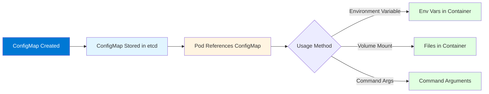
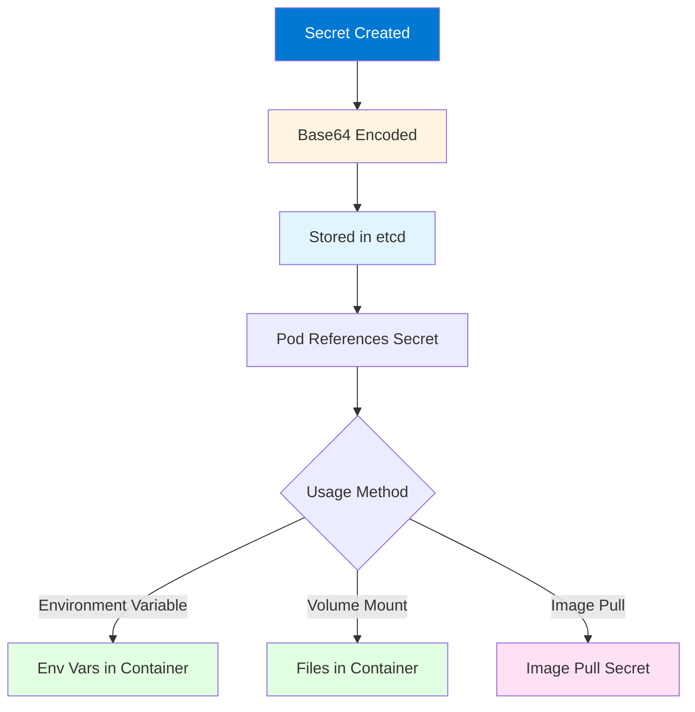

# Module 3: Kubernetes Configuration and Secrets

## 3.1 ConfigMaps

### ConfigMap Concepts

ConfigMaps are Kubernetes objects that store configuration data in key-value pairs. ConfigMaps allow you to decouple configuration from container images, making applications more portable and easier to configure for different environments. ConfigMaps can store configuration files, command-line arguments, environment variables, or any other configuration data that your application needs.

ConfigMaps provide several benefits: **separation of concerns** (configuration separate from code), **environment-specific configuration** (different ConfigMaps for dev, test, prod), **dynamic updates** (some ConfigMaps can be updated without recreating Pods), and **reusability** (same ConfigMap can be used by multiple Pods). Understanding ConfigMaps is essential for configuring applications in Kubernetes.

ConfigMaps are not encrypted and should not store sensitive data like passwords or API keys - use Secrets for that. ConfigMaps are stored in etcd, so they should not contain large amounts of data (limit is typically 1MB per ConfigMap). Understanding ConfigMap concepts helps you manage application configuration effectively.

#### ConfigMap Usage Flow



### Creating ConfigMaps

ConfigMaps can be created in several ways: **from literal values** (key-value pairs), **from files** (entire files or directories), **from YAML manifests** (declarative approach), or **from environment files**. The creation method depends on your needs and preferences.

Creating ConfigMaps examples:
```bash
# From literal values
kubectl create configmap my-config --from-literal=key1=value1 --from-literal=key2=value2

# From file
kubectl create configmap my-config --from-file=config.properties

# From directory
kubectl create configmap my-config --from-file=./config-dir/

# From YAML
kubectl apply -f configmap.yaml
```

YAML example:
```yaml
apiVersion: v1
kind: ConfigMap
metadata:
  name: app-config
  namespace: default
data:
  database_url: "postgresql://localhost:5432/mydb"
  log_level: "info"
  config.properties: |
    server.port=8080
    server.host=0.0.0.0
```

Understanding ConfigMap creation helps you manage configuration data.

### Using ConfigMaps in Pods

ConfigMaps can be used in Pods in several ways: **as environment variables** (individual keys or entire ConfigMap), **as volume mounts** (files in the container filesystem), or **as command-line arguments** (passed to container commands). The usage method depends on how your application consumes configuration.

Using ConfigMap as environment variables:
```yaml
apiVersion: v1
kind: Pod
metadata:
  name: my-pod
spec:
  containers:
  - name: app
    image: myapp:latest
    env:
    - name: DATABASE_URL
      valueFrom:
        configMapKeyRef:
          name: app-config
          key: database_url
    - name: LOG_LEVEL
      valueFrom:
        configMapKeyRef:
          name: app-config
          key: log_level
    envFrom:
    - configMapRef:
        name: app-config
```

Using ConfigMap as volume:
```yaml
spec:
  containers:
  - name: app
    image: myapp:latest
    volumeMounts:
    - name: config-volume
      mountPath: /etc/config
  volumes:
  - name: config-volume
    configMap:
      name: app-config
```

Understanding ConfigMap usage helps you configure applications effectively.

### ConfigMap Data Types

ConfigMap data can be stored as: **key-value pairs** (simple string values), **file contents** (entire files stored as values), or **binary data** (using the `binaryData` field). The data type affects how the ConfigMap is used in Pods.

Data type examples:
```yaml
apiVersion: v1
kind: ConfigMap
metadata:
  name: mixed-config
data:
  # Simple key-value
  app_name: "myapp"
  # File content
  nginx.conf: |
    server {
        listen 80;
        server_name example.com;
    }
binaryData:
  # Binary data (base64 encoded)
  binary_file: <base64-encoded-data>
```

Understanding ConfigMap data types helps you store configuration appropriately.

### ConfigMap Best Practices

ConfigMap best practices include: **not storing secrets** (use Secrets instead), **keeping ConfigMaps small** (under 1MB), **using descriptive names** (indicating purpose), **organizing by environment** (separate ConfigMaps for dev/test/prod), **versioning ConfigMaps** (using labels or names), and **documenting ConfigMaps** (using annotations).

Best practices also include: **immutable ConfigMaps** (setting `immutable: true` for stability), **validating data** (ensuring correct format), and **backing up ConfigMaps** (including in backup procedures). Following best practices ensures effective ConfigMap management.

---

## 3.2 Secrets

### Secret Concepts

Secrets are Kubernetes objects that store sensitive data like passwords, API keys, TLS certificates, and other confidential information. Secrets are similar to ConfigMaps but are designed for sensitive data. Secrets are base64-encoded (not encrypted) by default, so they provide basic obfuscation but not strong security.

Secrets provide: **sensitive data storage** (passwords, keys, certificates), **decoupling from images** (secrets separate from container images), **type-specific handling** (different types for different use cases), and **access control** (RBAC can restrict Secret access). Understanding Secrets is essential for managing sensitive data in Kubernetes.

Important security note: Secrets are base64-encoded, not encrypted. Anyone with access to etcd or API server can decode them. For production, consider: encrypting etcd at rest, using external secret management (Vault, AWS Secrets Manager), and restricting Secret access with RBAC.

#### Secret Management Flow



### Secret Types

Kubernetes provides several built-in Secret types: **Opaque** (generic secret, default), **kubernetes.io/tls** (TLS certificates), **kubernetes.io/dockerconfigjson** (Docker registry credentials), **kubernetes.io/basic-auth** (basic authentication), and **kubernetes.io/ssh-auth** (SSH keys). Each type has specific use cases and validation.

Secret type examples:
```yaml
# Opaque (generic)
apiVersion: v1
kind: Secret
metadata:
  name: my-secret
type: Opaque
data:
  username: YWRtaW4=  # base64 encoded
  password: cGFzc3dvcmQ=

# TLS Secret
apiVersion: v1
kind: Secret
metadata:
  name: tls-secret
type: kubernetes.io/tls
data:
  tls.crt: <base64-cert>
  tls.key: <base64-key>
```

Understanding Secret types helps you use the right Secret for your needs.

### Creating Secrets

Secrets can be created: **from literal values**, **from files**, **from YAML manifests**, or **using kubectl**. Secrets should be created carefully to avoid exposing sensitive data in command history or logs.

Creating Secrets examples:
```bash
# From literal (values are base64-encoded automatically)
kubectl create secret generic my-secret --from-literal=username=admin --from-literal=password=secret

# From file
kubectl create secret generic my-secret --from-file=username.txt --from-file=password.txt

# TLS Secret
kubectl create secret tls tls-secret --cert=cert.pem --key=key.pem

# Docker registry secret
kubectl create secret docker-registry regcred --docker-server=<registry> --docker-username=<user> --docker-password=<pass>
```

YAML example (note: values must be base64-encoded):
```yaml
apiVersion: v1
kind: Secret
metadata:
  name: my-secret
type: Opaque
data:
  username: YWRtaW4=  # echo -n 'admin' | base64
  password: cGFzc3dvcmQ=  # echo -n 'password' | base64
```

Understanding Secret creation helps you manage sensitive data.

### Using Secrets in Pods

Secrets can be used in Pods similarly to ConfigMaps: **as environment variables**, **as volume mounts**, or **as image pull secrets**. Using Secrets as volumes is often preferred for files like TLS certificates.

Using Secret as environment variables:
```yaml
apiVersion: v1
kind: Pod
metadata:
  name: my-pod
spec:
  containers:
  - name: app
    image: myapp:latest
    env:
    - name: DB_PASSWORD
      valueFrom:
        secretKeyRef:
          name: my-secret
          key: password
```

Using Secret as volume:
```yaml
spec:
  containers:
  - name: app
    image: myapp:latest
    volumeMounts:
    - name: secret-volume
      mountPath: /etc/secret
      readOnly: true
  volumes:
  - name: secret-volume
    secret:
      secretName: my-secret
```

Understanding Secret usage helps you securely provide sensitive data to applications.

### Secret Management Best Practices

Secret management best practices include: **not committing Secrets to version control** (use external secret management), **rotating Secrets regularly** (changing passwords/keys periodically), **using RBAC** (restricting Secret access), **encrypting etcd at rest** (protecting Secrets in storage), **using external secret management** (Vault, AWS Secrets Manager), and **auditing Secret access** (logging who accesses Secrets).

Best practices also include: **using specific Secret types** (TLS, dockerconfigjson), **limiting Secret scope** (namespace-level when possible), **using image pull secrets** (for private registries), and **monitoring Secret usage** (detecting unauthorized access). Following best practices ensures secure Secret management.

---

## 3.3 Environment Variables

### Setting Environment Variables

Environment variables provide configuration to containers at runtime. Environment variables can be set: **directly in Pod spec** (static values), **from ConfigMaps** (configuration data), **from Secrets** (sensitive data), or **from other sources** (field references, resource values). Environment variables are a common way to configure applications.

Setting environment variables directly:
```yaml
apiVersion: v1
kind: Pod
metadata:
  name: my-pod
spec:
  containers:
  - name: app
    image: myapp:latest
    env:
    - name: ENV_VAR
      value: "static-value"
    - name: NODE_NAME
      valueFrom:
        fieldRef:
          fieldPath: spec.nodeName
    - name: POD_IP
      valueFrom:
        fieldRef:
          fieldPath: status.podIP
```

Understanding environment variable setting helps you configure applications.

### ConfigMap as Environment Variables

ConfigMaps can be used as environment variables in two ways: **individual keys** (selecting specific keys) or **entire ConfigMap** (all keys as environment variables). Using individual keys provides more control, while using the entire ConfigMap is convenient when you want all configuration.

ConfigMap as individual environment variables:
```yaml
env:
- name: DATABASE_URL
  valueFrom:
    configMapKeyRef:
      name: app-config
      key: database_url
```

ConfigMap as all environment variables:
```yaml
envFrom:
- configMapRef:
    name: app-config
```

Understanding ConfigMap usage as environment variables helps you configure applications flexibly.

### Secrets as Environment Variables

Secrets can be used as environment variables similarly to ConfigMaps. This is useful for providing sensitive data like passwords or API keys to applications. However, be cautious as environment variables may be visible in process lists and logs.

Secret as environment variable:
```yaml
env:
- name: DB_PASSWORD
  valueFrom:
    secretKeyRef:
      name: db-secret
      key: password
```

Secret as all environment variables:
```yaml
envFrom:
- secretRef:
    name: db-secret
```

Understanding Secret usage as environment variables helps you securely provide sensitive data.

### Environment Variable Precedence

Environment variable precedence determines which value is used when multiple sources define the same variable. Precedence order (highest to lowest): **directly set values**, **ConfigMap/Secret individual keys**, **ConfigMap/Secret entire objects**, **container image defaults**. Understanding precedence helps you predict which values applications will receive.

### Best Practices

Environment variable best practices include: **using ConfigMaps for non-sensitive data**, **using Secrets for sensitive data**, **avoiding hardcoded values** (use ConfigMaps/Secrets), **documenting required variables** (in application documentation), **using descriptive names** (clear purpose), and **validating values** (ensuring correct format).

Best practices also include: **limiting Secret usage as env vars** (consider volume mounts for files), **using field references** (for Pod/Node information), and **organizing variables** (grouping related variables). Following best practices ensures effective environment variable management.

---

## Quick Reference

### ConfigMap Commands
```bash
# Create from literal
kubectl create configmap my-config --from-literal=key=value

# Create from file
kubectl create configmap my-config --from-file=config.properties

# Get ConfigMap
kubectl get configmap my-config -o yaml
```

### Secret Commands
```bash
# Create from literal
kubectl create secret generic my-secret --from-literal=key=value

# Create from file
kubectl create secret generic my-secret --from-file=secret.txt

# Get Secret (base64 encoded)
kubectl get secret my-secret -o yaml
```

---

## Common Pitfalls

### Pitfall 1: Storing Sensitive Data in ConfigMaps
**Problem**: ConfigMaps are not encrypted, visible to all users
**Solution**: Always use Secrets for sensitive data
**Prevention**: Review ConfigMap contents before creation

### Pitfall 2: Not Rotating Secrets
**Problem**: Compromised secrets remain valid
**Solution**: Implement secret rotation policies
**Prevention**: Use secret management tools

### Pitfall 3: Large ConfigMaps/Secrets
**Problem**: Exceeds size limits, performance issues
**Solution**: Split into multiple resources, use external storage
**Prevention**: Monitor resource sizes

---

## Best Practices

1. **Use Secrets for Sensitive Data**: Never store secrets in ConfigMaps
2. **Rotate Secrets Regularly**: Implement rotation policies
3. **Limit Secret Size**: Keep under 1MB per resource
4. **Use Immutable ConfigMaps**: For performance
5. **Mount as Volumes**: For file-based configuration
6. **Use Environment Variables**: For simple key-value pairs
7. **Document Required Config**: Clear documentation
8. **Validate Configuration**: Test before deployment
9. **Use Namespace Isolation**: Separate by environment
10. **Monitor Usage**: Track ConfigMap/Secret usage

---

## Further Reading

### Official Documentation
- [ConfigMaps](https://kubernetes.io/docs/concepts/configuration/configmap/)
- [Secrets](https://kubernetes.io/docs/concepts/configuration/secret/)
- [Managing Secrets](https://kubernetes.io/docs/tasks/configmap-secret/)

### Related Topics
- Pods (Module 2)
- Security (Module 8)
- Configuration Management (Module 12)

---

*This module covers Kubernetes configuration and secrets management. Understanding ConfigMaps and Secrets is essential for configuring applications in Kubernetes while maintaining security and portability.*

