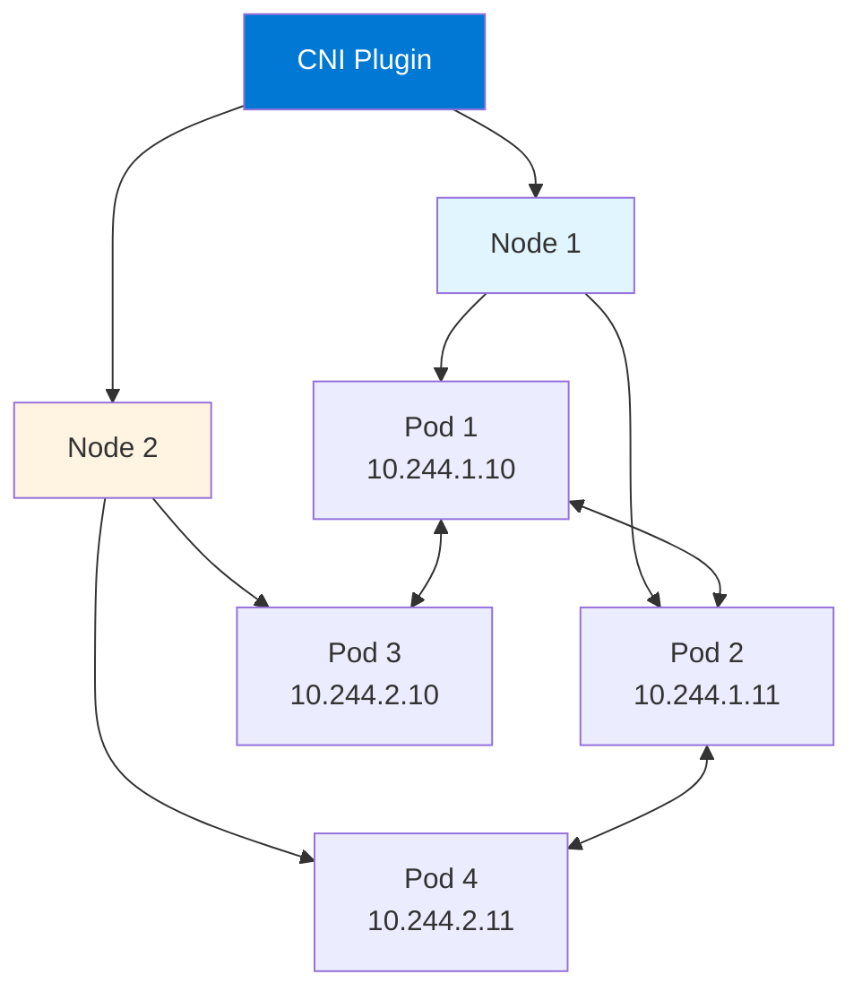
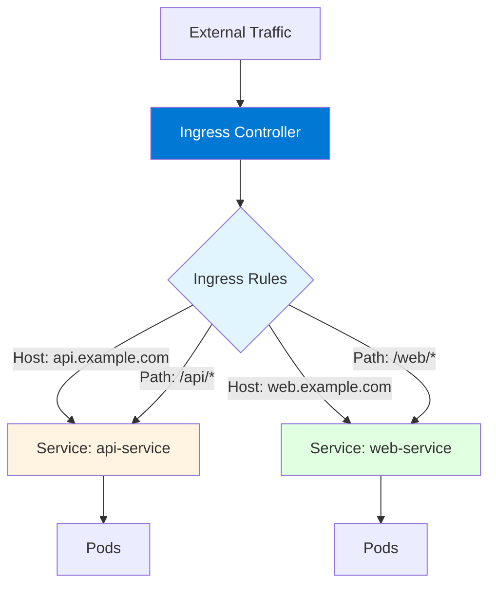
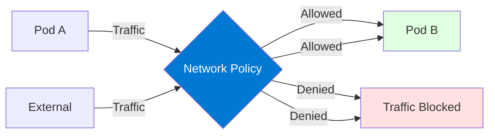

# Module 4: Kubernetes Networking

## 4.1 Kubernetes Networking Model

### Pod Networking

Pod networking provides each Pod with its own unique IP address from the cluster's Pod network CIDR range. All containers in a Pod share the same network namespace, meaning they share the same IP address and can communicate via localhost. Pods can communicate with each other directly using their IP addresses without Network Address Translation (NAT).

Key Pod networking principles: **every Pod gets its own IP** (no IP sharing between Pods), **Pods can communicate without NAT** (direct communication), **containers in a Pod share network** (same IP, can use localhost), and **Pod IPs are routable** (within the cluster). Understanding Pod networking is fundamental to understanding Kubernetes networking.

The Pod network is implemented by CNI (Container Network Interface) plugins, which handle IP assignment, routing, and network policies. Different CNI plugins provide different features and capabilities. Understanding Pod networking helps you configure and troubleshoot network connectivity.

#### Pod Networking Architecture



### Service Networking

Service networking provides stable network endpoints for Pods, which are ephemeral. Services use virtual IPs (ClusterIPs) that remain constant even as Pods are created and destroyed. Services load-balance traffic across Pod endpoints using iptables or IPVS rules configured by kube-proxy.

Service networking characteristics: **stable IPs** (Services have persistent ClusterIPs), **load balancing** (traffic distributed across Pods), **service discovery** (DNS names for Services), and **abstraction** (clients don't need to know Pod IPs). Understanding Service networking helps you expose applications reliably.

### Cluster Networking

Cluster networking connects all nodes and Pods in the cluster. Cluster networking requirements include: **all Pods can communicate** (without NAT), **all nodes can communicate with Pods**, **Pod IPs are unique** (across the entire cluster), and **containers see their own IP** (same as Pod IP). These requirements ensure consistent networking behavior.

Cluster networking is implemented through: **CNI plugins** (Pod networking), **kube-proxy** (Service networking), **network policies** (traffic filtering), and **ingress controllers** (external access). Understanding cluster networking helps you design and troubleshoot network architectures.

### Network Policies

Network Policies are Kubernetes resources that control traffic flow between Pods. Network Policies act as firewalls, allowing or denying traffic based on Pod selectors, namespaces, and port/protocol rules. Network Policies provide network-level security and isolation.

Network Policy example:
```yaml
apiVersion: networking.k8s.io/v1
kind: NetworkPolicy
metadata:
  name: allow-app
spec:
  podSelector:
    matchLabels:
      app: myapp
  policyTypes:
  - Ingress
  - Egress
  ingress:
  - from:
    - podSelector:
        matchLabels:
          app: frontend
    ports:
    - protocol: TCP
      port: 8080
  egress:
  - to:
    - podSelector:
        matchLabels:
          app: database
    ports:
    - protocol: TCP
      port: 5432
```

Understanding Network Policies helps you implement network security.

### CNI (Container Network Interface)

CNI (Container Network Interface) is a specification for network plugins that Kubernetes uses to configure Pod networking. CNI plugins handle: **IP address assignment** (assigning IPs to Pods), **routing configuration** (ensuring Pods can communicate), and **network policy enforcement** (implementing NetworkPolicy rules).

Popular CNI plugins include: **Calico** (policy-driven networking), **Flannel** (simple overlay network), **Weave** (encrypted networking), **Cilium** (eBPF-based), and **Antrea** (VMware). Each plugin has different features, performance characteristics, and capabilities. Understanding CNI helps you choose and configure network plugins.

---

## 4.2 Ingress

### Ingress Concepts

Ingress is a Kubernetes resource that provides HTTP/HTTPS routing to Services based on hostnames, paths, or other HTTP attributes. Ingress acts as an entry point for external traffic, providing features like SSL/TLS termination, name-based virtual hosting, and path-based routing. Ingress requires an Ingress Controller to function.

Ingress provides: **external access** (exposing Services outside the cluster), **routing rules** (hostname and path-based routing), **SSL/TLS termination** (HTTPS support), **load balancing** (distributing traffic), and **name-based virtual hosting** (multiple domains). Understanding Ingress helps you expose applications to external users.

#### Ingress Architecture



### Ingress Controllers

Ingress Controllers are implementations that watch for Ingress resources and configure load balancers or reverse proxies accordingly. Kubernetes doesn't provide a default Ingress Controller - you must install one. Popular Ingress Controllers include: **NGINX Ingress Controller** (most popular), **Traefik** (modern, feature-rich), **HAProxy** (high performance), **Istio Gateway** (service mesh), and cloud-provider controllers (ALB, Application Gateway).

Installing NGINX Ingress Controller:
```bash
kubectl apply -f https://raw.githubusercontent.com/kubernetes/ingress-nginx/controller-v1.8.1/deploy/static/provider/cloud/deploy.yaml
```

Understanding Ingress Controllers helps you choose and configure ingress solutions.

### Ingress Rules

Ingress rules define how traffic is routed. Rules can specify: **hostnames** (routing based on domain names), **paths** (routing based on URL paths), **backends** (target Services), and **TLS** (SSL/TLS configuration). Rules are evaluated in order, with the first matching rule taking precedence.

Ingress example:
```yaml
apiVersion: networking.k8s.io/v1
kind: Ingress
metadata:
  name: example-ingress
  annotations:
    nginx.ingress.kubernetes.io/rewrite-target: /
spec:
  tls:
  - hosts:
    - api.example.com
    secretName: tls-secret
  rules:
  - host: api.example.com
    http:
      paths:
      - path: /api
        pathType: Prefix
        backend:
          service:
            name: api-service
            port:
              number: 80
  - host: web.example.com
    http:
      paths:
      - path: /
        pathType: Prefix
        backend:
          service:
            name: web-service
            port:
              number: 80
```

Understanding Ingress rules helps you configure routing effectively.

### TLS/SSL Termination

Ingress supports TLS/SSL termination, allowing HTTPS traffic to be handled at the Ingress level. TLS configuration requires: **TLS certificates** (stored in Secrets), **TLS secrets** (referenced in Ingress spec), and **certificate management** (manual or automated with cert-manager).

TLS configuration:
```yaml
spec:
  tls:
  - hosts:
    - api.example.com
    secretName: tls-secret
```

Creating TLS Secret:
```bash
kubectl create secret tls tls-secret --cert=cert.pem --key=key.pem
```

Understanding TLS termination helps you secure external access.

### Ingress Annotations

Ingress annotations provide additional configuration for Ingress Controllers. Annotations are controller-specific and enable features like: **rewrite rules** (URL rewriting), **rate limiting** (traffic limiting), **authentication** (basic auth, OAuth), **CORS** (cross-origin resource sharing), and **custom headers** (adding/modifying headers).

Common NGINX Ingress annotations:
```yaml
metadata:
  annotations:
    nginx.ingress.kubernetes.io/rewrite-target: /
    nginx.ingress.kubernetes.io/rate-limit: "100"
    nginx.ingress.kubernetes.io/enable-cors: "true"
    cert-manager.io/cluster-issuer: "letsencrypt-prod"
```

Understanding annotations helps you configure advanced Ingress features.

---

## 4.3 Network Policies

### Network Policy Concepts

Network Policies are Kubernetes resources that define how Pods are allowed to communicate with each other and with other network endpoints. Network Policies act as firewalls, controlling traffic flow based on Pod selectors, namespaces, IP blocks, and port/protocol rules. Network Policies provide network-level security and micro-segmentation.

Network Policy capabilities: **ingress rules** (controlling incoming traffic), **egress rules** (controlling outgoing traffic), **pod selectors** (selecting Pods to apply policies), **namespace selectors** (allowing/denying traffic from namespaces), and **IP blocks** (allowing/denying specific IP ranges). Understanding Network Policies helps you implement network security.

#### Network Policy Flow



### Policy Rules

Network Policy rules define what traffic is allowed. Rules can specify: **from** (ingress sources), **to** (egress destinations), **ports** (allowed ports and protocols), and **podSelector** (which Pods the policy applies to). Rules are evaluated, and if no policy matches, the default behavior depends on the CNI plugin (typically allow all or deny all).

Policy rule example:
```yaml
apiVersion: networking.k8s.io/v1
kind: NetworkPolicy
metadata:
  name: allow-frontend
spec:
  podSelector:
    matchLabels:
      app: frontend
  policyTypes:
  - Ingress
  - Egress
  ingress:
  - from:
    - namespaceSelector:
        matchLabels:
          name: ingress
    ports:
    - protocol: TCP
      port: 80
  egress:
  - to:
    - podSelector:
        matchLabels:
          app: backend
    ports:
    - protocol: TCP
      port: 8080
```

Understanding policy rules helps you define network security policies.

### Policy Selectors

Policy selectors identify which Pods a Network Policy applies to and which Pods can communicate. Selectors include: **podSelector** (selecting Pods by labels), **namespaceSelector** (selecting Pods in namespaces), and **ipBlock** (selecting IP ranges). Selectors use label matching, similar to Service selectors.

Selector examples:
```yaml
# Pod selector
podSelector:
  matchLabels:
    app: backend

# Namespace selector
namespaceSelector:
  matchLabels:
    name: production

# IP block
ipBlock:
  cidr: 10.0.0.0/8
  except:
  - 10.0.1.0/24
```

Understanding selectors helps you target Network Policies correctly.

### Default Policies

Default Network Policies define behavior when no policy matches. Behavior depends on the CNI plugin: **allow all** (default in some plugins, traffic allowed if no policy), **deny all** (default in some plugins, traffic denied if no policy), or **explicit policies required** (must define policies for all traffic). Understanding default policies helps you design network security.

Implementing default deny:
```yaml
apiVersion: networking.k8s.io/v1
kind: NetworkPolicy
metadata:
  name: default-deny-all
spec:
  podSelector: {}
  policyTypes:
  - Ingress
  - Egress
```

This policy applies to all Pods and denies all traffic, requiring explicit policies to allow traffic.

### Network Policy Best Practices

Network Policy best practices include: **starting with default deny** (most secure), **using labels effectively** (organizing Pods for policies), **testing policies** (verifying traffic flows), **documenting policies** (explaining why policies exist), **using namespaces** (isolating environments), and **monitoring policy effects** (ensuring policies don't break applications).

Best practices also include: **gradual rollout** (applying policies incrementally), **using policy tools** (visualizing and managing policies), and **reviewing policies regularly** (ensuring they remain appropriate). Following best practices ensures effective network security.

---

## 4.4 DNS in Kubernetes

### CoreDNS

CoreDNS is the default DNS server in Kubernetes, replacing kube-dns. CoreDNS provides DNS resolution for Services and Pods, enabling service discovery through DNS names. CoreDNS is deployed as a Deployment in the kube-system namespace and is configured through a ConfigMap.

CoreDNS configuration:
```yaml
apiVersion: v1
kind: ConfigMap
metadata:
  name: coredns
  namespace: kube-system
data:
  Corefile: |
    .:53 {
        errors
        health
        ready
        kubernetes cluster.local in-addr.arpa ip6.arpa {
            pods insecure
            fallthrough in-addr.arpa ip6.arpa
        }
        prometheus :9153
        forward . /etc/resolv.conf
        cache 30
        loop
        reload
        loadbalance
    }
```

Understanding CoreDNS helps you configure and troubleshoot DNS.

### Service DNS

Services automatically get DNS names in the format `<service-name>.<namespace>.svc.cluster.local`. Short names like `<service-name>` resolve within the same namespace, while `<service-name>.<namespace>` works across namespaces. DNS resolution enables service discovery without hardcoding IPs.

DNS examples:
- `my-service` (same namespace)
- `my-service.default` (explicit namespace)
- `my-service.default.svc.cluster.local` (fully qualified)

Understanding Service DNS helps you implement service discovery.

### Pod DNS

Pods can have DNS names in the format `<pod-ip>.<namespace>.pod.cluster.local`, but this is less commonly used. Pods typically use Service DNS names for discovery. Understanding Pod DNS helps you understand all DNS capabilities.

### DNS Policies

DNS policies control DNS resolution behavior. Policies include: **Default** (inherits DNS from node), **ClusterFirst** (uses cluster DNS, falls back to node DNS), **ClusterFirstWithHostNet** (for hostNetwork Pods), and **None** (no DNS, must specify DNS config). Understanding DNS policies helps you configure Pod DNS behavior.

### DNS Troubleshooting

DNS troubleshooting involves: **checking CoreDNS Pods** (ensuring they're running), **testing DNS resolution** (using nslookup or dig), **checking DNS configuration** (CoreDNS ConfigMap), **verifying Service DNS** (ensuring Services have correct labels), and **checking network connectivity** (ensuring Pods can reach CoreDNS).

Troubleshooting commands:
```bash
# Check CoreDNS Pods
kubectl get pods -n kube-system -l k8s-app=kube-dns

# Test DNS from Pod
kubectl run -it --rm debug --image=busybox --restart=Never -- nslookup kubernetes.default

# Check CoreDNS logs
kubectl logs -n kube-system -l k8s-app=kube-dns
```

Understanding DNS troubleshooting helps you resolve DNS issues.

---

## Quick Reference

### Service Types
- `ClusterIP` - Internal only (default)
- `NodePort` - Expose on node ports
- `LoadBalancer` - Cloud load balancer
- `ExternalName` - External DNS name

### Common Networking Commands
```bash
# Get Services
kubectl get svc

# Port forward
kubectl port-forward pod/name 8080:80

# Test DNS
kubectl run -it --rm debug --image=busybox -- nslookup service-name
```

---

## Common Pitfalls

### Pitfall 1: Wrong Service Type
**Problem**: Service not accessible as expected
**Solution**: Choose appropriate service type
**Prevention**: Understand service types

### Pitfall 2: DNS Resolution Issues
**Problem**: Services not resolving correctly
**Solution**: Check CoreDNS, verify service labels
**Prevention**: Test DNS resolution

### Pitfall 3: Network Policy Too Restrictive
**Problem**: Legitimate traffic blocked
**Solution**: Review and adjust network policies
**Prevention**: Test policies before production

---

## Best Practices

1. **Use ClusterIP by Default**: Only expose when needed
2. **Implement Network Policies**: Control traffic flow
3. **Use Ingress for HTTP/HTTPS**: Better than NodePort
4. **Test DNS Resolution**: Verify service discovery
5. **Monitor Network Traffic**: Track connectivity
6. **Document Network Architecture**: Clear diagrams
7. **Use Service Selectors**: Correct label matching
8. **Configure Health Checks**: Ensure service health
9. **Use LoadBalancer Sparingly**: Cost consideration
10. **Review Network Policies**: Regular audits

---

## Further Reading

### Official Documentation
- [Kubernetes Networking](https://kubernetes.io/docs/concepts/services-networking/)
- [Services](https://kubernetes.io/docs/concepts/services-networking/service/)
- [Ingress](https://kubernetes.io/docs/concepts/services-networking/ingress/)

### Related Topics
- Pods (Module 2)
- Security (Module 8)
- Troubleshooting (Module 17)

---

*This module covers Kubernetes networking in detail. Understanding networking is essential for deploying and managing applications in Kubernetes, as it enables Pod communication, service discovery, and external access.*

