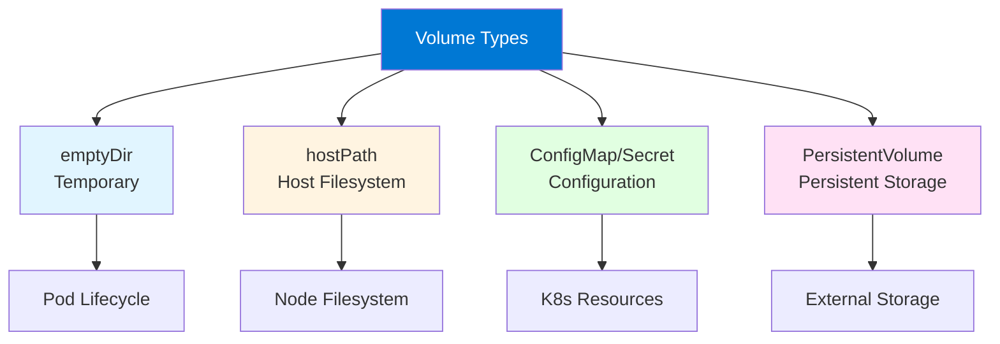
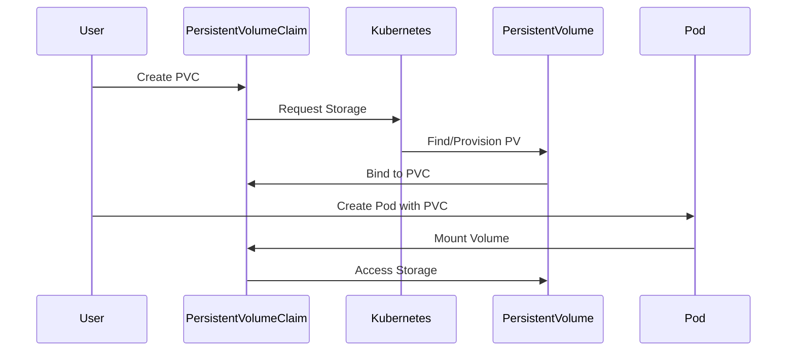

# Module 5: Kubernetes Storage

## 5.1 Storage Concepts

### Volumes

Volumes in Kubernetes provide storage that persists beyond container lifecycles. Unlike container filesystems (which are ephemeral), volumes allow data to survive container restarts and be shared between containers in a Pod. Kubernetes supports many volume types: **emptyDir** (temporary storage, deleted when Pod is removed), **hostPath** (mounts host filesystem), **configMap/Secret** (mounts ConfigMaps/Secrets as files), **persistentVolumeClaim** (persistent storage), and many others.

Volumes are defined in Pod specifications and mounted into containers at specified paths. Volumes enable: **data persistence** (surviving container restarts), **data sharing** (between containers in a Pod), **configuration injection** (ConfigMaps/Secrets as files), and **external storage** (connecting to storage systems). Understanding volumes is fundamental to working with storage in Kubernetes.

#### Volume Types Comparison



### Persistent Volumes (PV)

Persistent Volumes (PVs) are cluster-level storage resources provisioned by administrators or dynamically by StorageClasses. PVs are independent of Pod lifecycles and can be used by multiple Pods (depending on access mode). PVs abstract storage implementation details, allowing Pods to use storage without knowing the underlying storage system.

PV characteristics: **cluster-scoped** (available cluster-wide), **lifecycle independent of Pods** (persist beyond Pod deletion), **storage abstraction** (hides storage implementation), **access modes** (ReadWriteOnce, ReadOnlyMany, ReadWriteMany), and **reclaim policies** (Retain, Delete, Recycle). Understanding PVs helps you provision persistent storage.

### Persistent Volume Claims (PVC)

Persistent Volume Claims (PVCs) are requests for storage by users. PVCs specify storage requirements (size, access mode, storage class), and Kubernetes binds them to available PVs that match the requirements. PVCs are namespace-scoped and are used by Pods to request storage.

PVC workflow: **user creates PVC** (specifying requirements), **Kubernetes finds matching PV** (or provisions new one), **PVC bound to PV** (one-to-one relationship), **Pod uses PVC** (mounting it as a volume), **PVC persists** (survives Pod deletion). Understanding PVCs helps you request and use persistent storage.

#### PV/PVC Binding Flow



### Storage Classes

Storage Classes enable dynamic provisioning of PVs. When a PVC references a StorageClass, Kubernetes automatically provisions a PV that matches the requirements. Storage Classes define: **provisioner** (storage system plugin), **parameters** (storage-specific settings), **reclaim policy** (what happens when PVC is deleted), and **volume binding mode** (immediate or wait-for-first-consumer).

Storage Class example:
```yaml
apiVersion: storage.k8s.io/v1
kind: StorageClass
metadata:
  name: fast-ssd
provisioner: kubernetes.io/aws-ebs
parameters:
  type: gp3
  fsType: ext4
reclaimPolicy: Delete
volumeBindingMode: Immediate
```

Understanding Storage Classes helps you enable dynamic storage provisioning.

### Volume Types

Kubernetes supports many volume types for different use cases: **emptyDir** (temporary storage), **hostPath** (host filesystem), **nfs** (NFS shares), **awsElasticBlockStore** (AWS EBS), **azureDisk** (Azure disks), **gcePersistentDisk** (GCE persistent disks), **configMap/Secret** (configuration), **persistentVolumeClaim** (persistent storage), and many others.

Volume type selection depends on: **persistence needs** (temporary vs. persistent), **access patterns** (single Pod vs. multiple Pods), **storage backend** (cloud vs. on-premises), and **performance requirements** (SSD vs. HDD). Understanding volume types helps you choose appropriate storage.

---

## 5.2 Persistent Volumes

### PV Lifecycle

PV lifecycle includes: **Available** (PV exists but not bound), **Bound** (PV bound to a PVC), **Released** (PVC deleted but PV not reclaimed), **Failed** (PV failed automatic reclamation). Understanding PV lifecycle helps you manage storage resources.

Lifecycle management involves: **provisioning** (creating PVs), **binding** (matching PVs to PVCs), **using** (Pods using PVs), **releasing** (PVC deletion), and **reclaiming** (cleaning up PVs based on reclaim policy). Understanding lifecycle helps you troubleshoot storage issues.

### PV Access Modes

PV access modes define how volumes can be mounted: **ReadWriteOnce (RWO)** (can be mounted as read-write by a single node), **ReadOnlyMany (ROX)** (can be mounted read-only by many nodes), **ReadWriteMany (RWX)** (can be mounted as read-write by many nodes). Access mode determines how many Pods can use a volume simultaneously.

Access mode selection depends on: **use case** (single Pod vs. multiple Pods), **storage backend** (some backends support RWX, others don't), and **application requirements** (read-only vs. read-write). Understanding access modes helps you configure storage correctly.

#### PV Access Modes

| Access Mode | Abbreviation | Description | Use Case |
|------------|--------------|-------------|----------|
| **ReadWriteOnce** | RWO | Single node read-write | Database, single Pod apps |
| **ReadOnlyMany** | ROX | Multiple nodes read-only | Configuration, shared read data |
| **ReadWriteMany** | RWX | Multiple nodes read-write | Shared filesystems, NFS |

### PV Reclaim Policies

PV reclaim policies define what happens when a PVC is deleted: **Retain** (PV is kept, manual cleanup required), **Delete** (PV is automatically deleted), **Recycle** (deprecated, data scrubbed and PV made available). Reclaim policy selection depends on data importance and storage backend capabilities.

Reclaim policy example:
```yaml
apiVersion: v1
kind: PersistentVolume
metadata:
  name: pv-example
spec:
  capacity:
    storage: 10Gi
  accessModes:
  - ReadWriteOnce
  persistentVolumeReclaimPolicy: Retain
  storageClassName: manual
  hostPath:
    path: /data/pv-example
```

Understanding reclaim policies helps you manage storage lifecycle.

### Static Provisioning

Static provisioning involves administrators manually creating PVs. Administrators provision storage, create PV objects, and users create PVCs that bind to these PVs. Static provisioning provides control but requires manual management.

Static PV example:
```yaml
apiVersion: v1
kind: PersistentVolume
metadata:
  name: pv-static
spec:
  capacity:
    storage: 20Gi
  accessModes:
  - ReadWriteOnce
  persistentVolumeReclaimPolicy: Retain
  storageClassName: manual
  nfs:
    server: nfs-server.example.com
    path: /exports/data
```

Understanding static provisioning helps you manage storage manually.

### Dynamic Provisioning

Dynamic provisioning automatically creates PVs when PVCs are created. Storage Classes enable dynamic provisioning by defining provisioners and parameters. When a PVC references a StorageClass, Kubernetes automatically provisions a matching PV. Dynamic provisioning is preferred for most use cases as it automates storage management.

Dynamic provisioning workflow: **user creates PVC with StorageClass**, **Kubernetes calls provisioner**, **provisioner creates storage**, **Kubernetes creates PV**, **PVC binds to PV**. Understanding dynamic provisioning helps you automate storage management.

---

## 5.3 Persistent Volume Claims

### PVC Concepts

PVCs are requests for storage by users. PVCs are namespace-scoped and specify: **storage size** (how much storage needed), **access mode** (RWO, ROX, RWX), **storage class** (which StorageClass to use), and **selector** (optional, to bind to specific PVs). Kubernetes binds PVCs to matching PVs automatically.

PVC example:
```yaml
apiVersion: v1
kind: PersistentVolumeClaim
metadata:
  name: my-pvc
spec:
  accessModes:
  - ReadWriteOnce
  resources:
    requests:
      storage: 10Gi
  storageClassName: fast-ssd
```

Understanding PVCs helps you request storage for applications.

### PVC Binding

PVC binding matches PVCs to PVs. Binding occurs when: **PVC created** (with requirements), **Kubernetes finds matching PV** (or provisions one), **PVC bound to PV** (one-to-one relationship), **binding is exclusive** (one PVC per PV). Understanding binding helps you troubleshoot storage allocation.

### PVC Usage in Pods

PVCs are used in Pods by referencing them in volume specifications. Pods mount PVCs as volumes, providing persistent storage. Multiple Pods can use the same PVC if the access mode allows it (RWX or ROX).

Using PVC in Pod:
```yaml
apiVersion: v1
kind: Pod
metadata:
  name: my-pod
spec:
  containers:
  - name: app
    image: myapp:latest
    volumeMounts:
    - name: storage
      mountPath: /data
  volumes:
  - name: storage
    persistentVolumeClaim:
      claimName: my-pvc
```

Understanding PVC usage helps you provide persistent storage to applications.

### PVC Expansion

PVC expansion allows increasing PVC size after creation. Expansion requires: **StorageClass with allowVolumeExpansion: true**, **storage backend support** (not all backends support expansion), and **PVC in use** (can expand while in use). Expansion is useful for growing applications.

Expanding PVC:
```bash
# Edit PVC to increase size
kubectl patch pvc my-pvc -p '{"spec":{"resources":{"requests":{"storage":"20Gi"}}}}'

# Check expansion status
kubectl get pvc my-pvc
```

Understanding PVC expansion helps you manage growing storage needs.

### PVC Management

PVC management involves: **creating PVCs** (requesting storage), **monitoring PVCs** (checking status and usage), **expanding PVCs** (increasing size), **deleting PVCs** (releasing storage), and **troubleshooting** (resolving binding or mounting issues). Understanding PVC management helps you effectively use persistent storage.

---

## 5.4 Storage Classes

### Storage Class Concepts

Storage Classes enable dynamic provisioning and define storage characteristics. Storage Classes specify: **provisioner** (which plugin provisions storage), **parameters** (storage-specific settings), **reclaim policy** (Retain or Delete), **volume binding mode** (Immediate or WaitForFirstConsumer), and **allow volume expansion** (whether PVCs can be expanded).

Storage Class provides: **dynamic provisioning** (automatic PV creation), **storage abstraction** (hiding implementation details), **default storage** (can be marked as default), and **storage policies** (defining storage characteristics). Understanding Storage Classes helps you configure storage provisioning.

### Provisioners

Provisioners are storage system plugins that create and manage storage. Common provisioners include: **kubernetes.io/aws-ebs** (AWS EBS), **kubernetes.io/azure-disk** (Azure disks), **kubernetes.io/gce-pd** (GCE persistent disks), **kubernetes.io/cinder** (OpenStack Cinder), **kubernetes.io/vsphere-volume** (vSphere), and **kubernetes.io/no-provisioner** (manual provisioning).

Provisioner selection depends on: **cloud provider** (AWS, Azure, GCP), **on-premises storage** (NFS, Ceph, etc.), and **storage type** (block, file, object). Understanding provisioners helps you choose appropriate storage backends.

### Storage Class Parameters

Storage Class parameters are provisioner-specific settings that control storage provisioning. Parameters vary by provisioner but commonly include: **type** (storage type, e.g., gp3, io1), **zone** (availability zone), **fsType** (filesystem type), **iops** (IOPS for performance), and **encrypted** (encryption settings).

Parameters example:
```yaml
apiVersion: storage.k8s.io/v1
kind: StorageClass
metadata:
  name: fast-ssd
provisioner: kubernetes.io/aws-ebs
parameters:
  type: gp3
  iops: "3000"
  throughput: "125"
  fsType: ext4
  encrypted: "true"
```

Understanding parameters helps you configure storage appropriately.

### Default Storage Classes

Default Storage Classes are automatically used when PVCs don't specify a StorageClass. Only one StorageClass can be marked as default per cluster. Default Storage Classes simplify PVC creation by users who don't need specific storage characteristics.

Marking StorageClass as default:
```yaml
apiVersion: storage.k8s.io/v1
kind: StorageClass
metadata:
  name: standard
  annotations:
    storageclass.kubernetes.io/is-default-class: "true"
```

Understanding default Storage Classes helps you configure cluster defaults.

### Storage Class Best Practices

Storage Class best practices include: **defining multiple classes** (for different use cases), **setting appropriate defaults** (for common use cases), **documenting classes** (explaining when to use each), **testing provisioning** (ensuring classes work), and **monitoring usage** (tracking storage consumption).

Best practices also include: **using appropriate reclaim policies** (Delete for dev, Retain for prod), **configuring expansion** (enabling where supported), and **reviewing parameters** (ensuring optimal settings). Following best practices ensures effective storage management.

---

## Quick Reference

### Storage Commands
```bash
# Create PVC
kubectl create -f pvc.yaml

# Get PVs/PVCs
kubectl get pv
kubectl get pvc

# Describe storage
kubectl describe pvc my-pvc
```

### Access Modes
- `ReadWriteOnce` - Single node read-write
- `ReadOnlyMany` - Multiple nodes read-only
- `ReadWriteMany` - Multiple nodes read-write

---

## Common Pitfalls

### Pitfall 1: Wrong Access Mode
**Problem**: Pods can't access storage as expected
**Solution**: Choose correct access mode
**Prevention**: Understand access mode requirements

### Pitfall 2: Storage Not Released
**Problem**: PVCs not deleted, storage not freed
**Solution**: Check reclaim policy, delete PVCs
**Prevention**: Understand reclaim policies

### Pitfall 3: Storage Class Not Set
**Problem**: Using wrong storage type
**Solution**: Specify StorageClass in PVC
**Prevention**: Configure default StorageClass

---

## Best Practices

1. **Use StorageClasses**: For dynamic provisioning
2. **Set Appropriate Access Modes**: Match use case
3. **Configure Reclaim Policies**: Retain for production
4. **Monitor Storage Usage**: Track consumption
5. **Backup Persistent Data**: Regular backups
6. **Test Storage Performance**: Verify meets requirements
7. **Document Storage Requirements**: Clear specifications
8. **Use Volume Snapshots**: For data protection
9. **Review Storage Costs**: Optimize usage
10. **Clean Up Unused PVCs**: Free resources

---

## Further Reading

### Official Documentation
- [Kubernetes Storage](https://kubernetes.io/docs/concepts/storage/)
- [Persistent Volumes](https://kubernetes.io/docs/concepts/storage/persistent-volumes/)
- [Storage Classes](https://kubernetes.io/docs/concepts/storage/storage-classes/)

### Related Topics
- Pods (Module 2)
- Workloads (Module 6)
- Resource Management (Module 10)

---

*This module covers Kubernetes storage in detail. Understanding storage is essential for applications that need persistent data, as it enables data to survive Pod restarts and be shared between Pods.*

