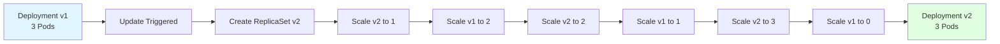
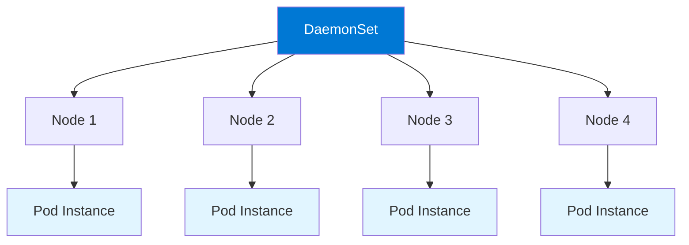
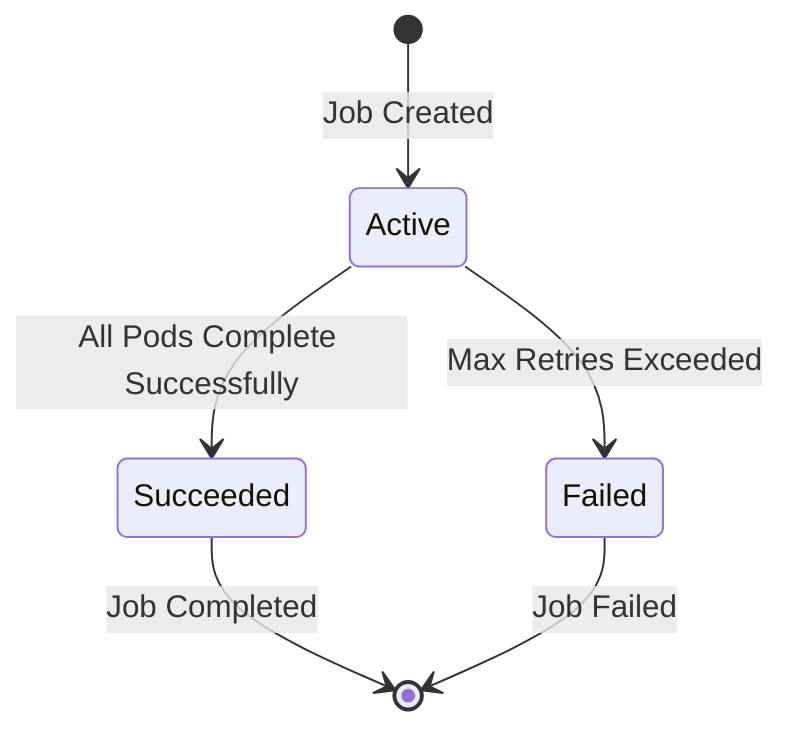

# Module 6: Kubernetes Workloads

## 6.1 Deployments

### Deployment Strategies

Deployment strategies define how updates are rolled out. Kubernetes Deployments support: **RollingUpdate** (default, gradually replaces old Pods with new ones), **Recreate** (terminates all old Pods before creating new ones). RollingUpdate provides zero downtime, while Recreate causes brief downtime but ensures all Pods run the same version.

Strategy configuration:
```yaml
spec:
  strategy:
    type: RollingUpdate
    rollingUpdate:
      maxSurge: 1
      maxUnavailable: 0
```

Understanding deployment strategies helps you choose the right update approach.

### Rolling Updates

Rolling updates gradually replace old Pods with new ones, ensuring zero downtime. Rolling updates are controlled by: **maxSurge** (maximum Pods that can be created above desired count), **maxUnavailable** (maximum Pods that can be unavailable during update), and **progressDeadlineSeconds** (timeout for update progress).

Rolling update process: **new ReplicaSet created**, **Pods gradually replaced**, **old ReplicaSet scaled down**, **update completes when all Pods are new**. Understanding rolling updates helps you deploy changes safely.

#### Rolling Update Flow



### Rollback Operations

Rollback reverts a Deployment to a previous version. Kubernetes maintains rollout history, allowing rollback to any previous ReplicaSet. Rollback is useful when updates cause issues.

Rollback commands:
```bash
# View rollout history
kubectl rollout history deployment/my-deployment

# Rollback to previous version
kubectl rollout undo deployment/my-deployment

# Rollback to specific revision
kubectl rollout undo deployment/my-deployment --to-revision=2
```

Understanding rollback helps you recover from failed updates.

### Deployment Scaling

Deployment scaling changes the number of Pod replicas. Scaling can be: **manual** (kubectl scale), **automatic** (Horizontal Pod Autoscaler), or **declarative** (updating replica count). Scaling is essential for handling varying loads.

Scaling commands:
```bash
# Scale to 5 replicas
kubectl scale deployment/my-deployment --replicas=5

# Auto-scale based on CPU
kubectl autoscale deployment/my-deployment --min=2 --max=10 --cpu-percent=80
```

Understanding scaling helps you manage application capacity.

### Deployment Health Checks

Deployment health checks use probes to determine Pod health: **liveness probes** (determine if Pod should be restarted), **readiness probes** (determine if Pod can receive traffic), **startup probes** (determine if Pod has started). Health checks ensure only healthy Pods serve traffic.

Probe example:
```yaml
spec:
  containers:
  - name: app
    image: myapp:latest
    livenessProbe:
      httpGet:
        path: /health
        port: 8080
      initialDelaySeconds: 30
      periodSeconds: 10
    readinessProbe:
      httpGet:
        path: /ready
        port: 8080
      initialDelaySeconds: 5
      periodSeconds: 5
```

Understanding health checks helps you ensure application reliability.

---

## 6.2 StatefulSets

### StatefulSet Concepts

StatefulSets manage stateful applications that require stable network identities and persistent storage. StatefulSets provide: **stable Pod identities** (Pod names and hostnames), **ordered deployment** (Pods created in order), **ordered scaling** (Pods scaled in order), **stable storage** (each Pod gets its own PersistentVolume), and **ordered termination** (Pods terminated in reverse order).

StatefulSets are ideal for: **databases** (MySQL, PostgreSQL), **message queues** (RabbitMQ, Kafka), **distributed systems** (Elasticsearch, Cassandra), and **applications requiring stable identities**. Understanding StatefulSets helps you deploy stateful applications.

#### StatefulSet vs. Deployment

| Feature | Deployment | StatefulSet |
|---------|-----------|-------------|
| **Pod Identity** | Random | Stable (ordinal) |
| **Storage** | Shared or none | Per-Pod PV |
| **Scaling** | Any order | Ordered |
| **Networking** | Service load balancing | Stable network IDs |
| **Use Case** | Stateless apps | Stateful apps |

### StatefulSet vs. Deployment

StatefulSets differ from Deployments in several ways: **Pod naming** (StatefulSets use stable names like `app-0`, `app-1`), **storage** (each Pod gets its own PersistentVolume), **networking** (stable network identities), **scaling** (ordered, not parallel), and **updates** (ordered rolling updates). Understanding differences helps you choose the right workload type.

### StatefulSet Patterns

StatefulSet patterns include: **headless Service** (for stable network identities), **PersistentVolumeClaims** (for per-Pod storage), **init containers** (for initialization), and **ordered operations** (deployment, scaling, updates). Understanding patterns helps you implement StatefulSets correctly.

StatefulSet example:
```yaml
apiVersion: apps/v1
kind: StatefulSet
metadata:
  name: web
spec:
  serviceName: "web"
  replicas: 3
  selector:
    matchLabels:
      app: nginx
  template:
    metadata:
      labels:
        app: nginx
    spec:
      containers:
      - name: nginx
        image: nginx:1.21
        volumeMounts:
        - name: www
          mountPath: /usr/share/nginx/html
  volumeClaimTemplates:
  - metadata:
      name: www
    spec:
      accessModes: [ "ReadWriteOnce" ]
      resources:
        requests:
          storage: 1Gi
```

### Ordered Deployment

StatefulSets deploy Pods in order (0, 1, 2, ...), waiting for each Pod to be ready before starting the next. This ensures dependencies are met and provides predictable deployment behavior. Ordered deployment is essential for applications where Pod order matters.

### Persistent Storage in StatefulSets

StatefulSets use `volumeClaimTemplates` to create a PersistentVolumeClaim for each Pod. Each Pod gets its own storage, providing data isolation and persistence. Storage is created with Pod names, ensuring stable storage identities.

Understanding persistent storage in StatefulSets helps you deploy stateful applications with data persistence.

---

## 6.3 DaemonSets

### DaemonSet Concepts

DaemonSets ensure that a copy of a Pod runs on all (or selected) nodes in the cluster. DaemonSets are useful for: **node-level services** (logging agents, monitoring agents), **network plugins** (CNI plugins), **storage daemons** (storage system daemons), and **node maintenance** (system updates, security agents).

DaemonSet characteristics: **one Pod per node** (typically), **node selection** (can target specific nodes), **automatic scheduling** (Pods created on new nodes), and **node affinity** (ensures Pods run on appropriate nodes). Understanding DaemonSets helps you deploy node-level services.

#### DaemonSet Architecture



### DaemonSet Use Cases

DaemonSet use cases include: **logging** (Fluentd, Logstash), **monitoring** (node exporters, metrics agents), **networking** (CNI plugins, network proxies), **storage** (storage daemons), and **security** (security scanners, compliance agents). Understanding use cases helps you identify when to use DaemonSets.

### Node Selectors

Node selectors allow DaemonSets to target specific nodes. Selectors use node labels to match nodes. This enables running DaemonSets on subsets of nodes (e.g., only worker nodes, only nodes with specific hardware).

Node selector example:
```yaml
spec:
  template:
    spec:
      nodeSelector:
        node-type: worker
```

Understanding node selectors helps you target DaemonSets appropriately.

### Taints and Tolerations

Taints and tolerations control Pod scheduling. Nodes can be tainted to repel Pods, and Pods can have tolerations to allow scheduling on tainted nodes. DaemonSets often use tolerations to run on all nodes, including master nodes.

Toleration example:
```yaml
spec:
  template:
    spec:
      tolerations:
      - key: node-role.kubernetes.io/master
        operator: Exists
        effect: NoSchedule
```

Understanding taints and tolerations helps you control DaemonSet placement.

### DaemonSet Management

DaemonSet management involves: **creating DaemonSets** (defining Pod templates), **updating DaemonSets** (rolling updates), **scaling** (not applicable, one per node), **deleting DaemonSets** (removing Pods from nodes), and **monitoring** (ensuring Pods run on all nodes). Understanding management helps you operate DaemonSets effectively.

---

## 6.4 Jobs and CronJobs

### Job Concepts

Jobs create one or more Pods and ensure a specified number complete successfully. Jobs are useful for: **batch processing** (data processing, ETL), **one-time tasks** (database migrations, backups), **parallel processing** (distributed computations), and **work queues** (processing items from queues).

Job characteristics: **completion tracking** (tracks successful completions), **retry logic** (retries failed Pods), **parallel execution** (can run multiple Pods), and **cleanup** (Pods cleaned up after completion). Understanding Jobs helps you run batch workloads.

#### Job Lifecycle



### Job Types (Non-parallel, Parallel, Fixed completion count)

Job types define execution behavior: **Non-parallel** (one Pod at a time, completes when one Pod succeeds), **Parallel with fixed completions** (multiple Pods, completes when N Pods succeed), **Parallel with work queue** (multiple Pods, processes items from queue). Job type selection depends on workload characteristics.

Job type examples:
```yaml
# Non-parallel
apiVersion: batch/v1
kind: Job
metadata:
  name: job-example
spec:
  completions: 1
  parallelism: 1
  template:
    spec:
      containers:
      - name: worker
        image: worker:latest
      restartPolicy: Never

# Parallel with fixed completions
spec:
  completions: 5
  parallelism: 2

# Parallel with work queue
spec:
  parallelism: 3
  completions: null
```

Understanding job types helps you configure Jobs correctly.

### CronJob Concepts

CronJobs create Jobs on a schedule using cron syntax. CronJobs are useful for: **scheduled tasks** (backups, reports), **periodic maintenance** (cleanup, updates), **data synchronization** (ETL, imports), and **monitoring** (health checks, alerts).

CronJob characteristics: **cron schedule** (time-based scheduling), **Job creation** (creates Jobs on schedule), **concurrency policy** (Allow, Forbid, Replace), **history limits** (number of completed/failed Jobs to keep), and **suspend** (pause scheduling). Understanding CronJobs helps you schedule recurring tasks.

### CronJob Scheduling

CronJob scheduling uses cron syntax: `minute hour day month weekday`. Examples: `0 2 * * *` (2 AM daily), `0 */6 * * *` (every 6 hours), `0 0 1 * *` (first day of month). Cron syntax provides flexible scheduling.

CronJob example:
```yaml
apiVersion: batch/v1
kind: CronJob
metadata:
  name: backup-job
spec:
  schedule: "0 2 * * *"
  jobTemplate:
    spec:
      template:
        spec:
          containers:
          - name: backup
            image: backup:latest
          restartPolicy: OnFailure
  successfulJobsHistoryLimit: 3
  failedJobsHistoryLimit: 1
```

Understanding scheduling helps you configure CronJobs appropriately.

### Job and CronJob Management

Job and CronJob management involves: **creating Jobs/CronJobs** (defining workloads), **monitoring execution** (checking status), **viewing logs** (debugging execution), **deleting Jobs/CronJobs** (cleanup), and **troubleshooting** (resolving failures). Understanding management helps you operate batch workloads effectively.

---

## Quick Reference

### Workload Types
- `Deployment` - Stateless applications
- `StatefulSet` - Stateful applications
- `DaemonSet` - One Pod per node
- `Job` - One-time tasks
- `CronJob` - Scheduled tasks

### Common Commands
```bash
# Get workloads
kubectl get deployments
kubectl get statefulsets
kubectl get daemonsets
kubectl get jobs

# Scale deployment
kubectl scale deployment my-app --replicas=3

# Rollout history
kubectl rollout history deployment/my-app
```

---

## Common Pitfalls

### Pitfall 1: Using Deployment for Stateful Apps
**Problem**: Data loss, identity issues
**Solution**: Use StatefulSet for stateful applications
**Prevention**: Understand workload types

### Pitfall 2: Not Setting Resource Limits
**Problem**: Resource exhaustion, poor performance
**Solution**: Always set requests and limits
**Prevention**: Use resource quotas

### Pitfall 3: Wrong Update Strategy
**Problem**: Downtime or deployment issues
**Solution**: Choose appropriate strategy
**Prevention**: Test update strategies

---

## Best Practices

1. **Choose Right Workload Type**: Match application needs
2. **Set Resource Requests/Limits**: Prevent exhaustion
3. **Configure Health Checks**: Liveness and readiness probes
4. **Use Rolling Updates**: Zero downtime deployments
5. **Test Rollback Procedures**: Verify recovery
6. **Monitor Workload Health**: Track status
7. **Use Labels Selectors**: Correct matching
8. **Document Workload Requirements**: Clear specs
9. **Review Update Strategies**: Appropriate approach
10. **Clean Up Completed Jobs**: Resource management

---

## Further Reading

### Official Documentation
- [Deployments](https://kubernetes.io/docs/concepts/workloads/controllers/deployment/)
- [StatefulSets](https://kubernetes.io/docs/concepts/workloads/controllers/statefulset/)
- [DaemonSets](https://kubernetes.io/docs/concepts/workloads/controllers/daemonset/)
- [Jobs](https://kubernetes.io/docs/concepts/workloads/controllers/job/)

### Related Topics
- Pods (Module 2)
- Scheduling (Module 7)
- Resource Management (Module 10)

---

*This module covers Kubernetes workloads including Deployments, StatefulSets, DaemonSets, and Jobs. Understanding these workloads helps you deploy different types of applications in Kubernetes.*

