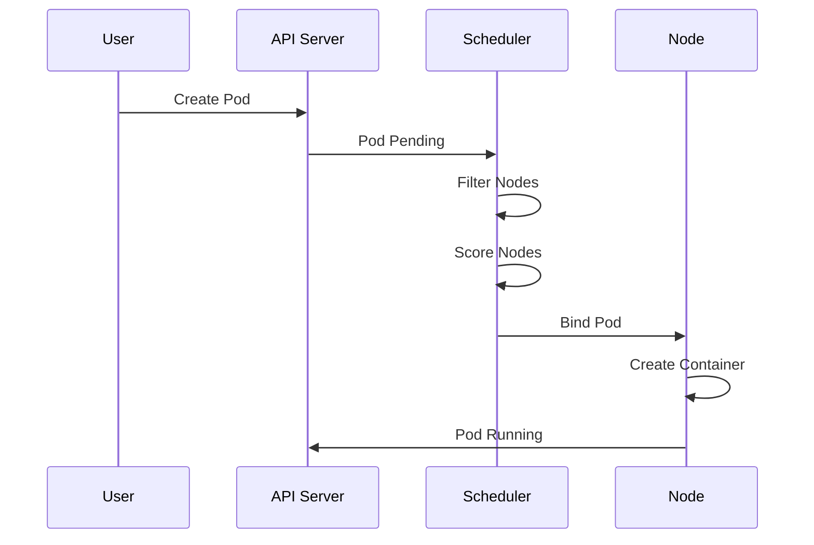

# Module 7: Kubernetes Scheduling

## 7.1 Pod Scheduling

### Scheduler Concepts

The Kubernetes scheduler is a control plane component that assigns Pods to nodes. The scheduler watches for newly created Pods with no assigned node and selects a node for them based on resource requirements, constraints, and policies. The scheduler's goal is to find a suitable node that meets Pod requirements while optimizing cluster resource utilization.

Scheduling process: **filtering** (finding nodes that meet requirements), **scoring** (ranking nodes by preference), **binding** (assigning Pod to selected node). The scheduler considers: **resource requests/limits** (CPU, memory), **node selectors** (label matching), **affinity/anti-affinity** (placement preferences), **taints/tolerations** (node restrictions), and **pod disruption budgets** (availability constraints). Understanding the scheduler helps you control Pod placement.

#### Pod Scheduling Flow



### Scheduling Process

The scheduling process involves multiple steps: **Pod creation** (user creates Pod), **scheduler watches** (scheduler detects pending Pod), **filtering phase** (removes unsuitable nodes), **scoring phase** (ranks remaining nodes), **binding** (assigns Pod to best node), **kubelet creates** (node creates container). Understanding the process helps you troubleshoot scheduling issues.

### Node Selection

Node selection uses multiple criteria: **resource availability** (CPU, memory available), **node conditions** (Ready, MemoryPressure, DiskPressure), **taints/tolerations** (node restrictions), **node selectors** (label matching), **affinity rules** (preference matching), and **pod anti-affinity** (avoidance rules). Understanding node selection helps you control where Pods run.

### Pod Affinity and Anti-Affinity

Pod affinity and anti-affinity control Pod placement relative to other Pods. **Affinity** (prefer running with certain Pods), **anti-affinity** (prefer not running with certain Pods). Affinity can be: **required** (hard requirement) or **preferred** (soft preference). Understanding affinity helps you optimize Pod placement.

Affinity example:
```yaml
spec:
  affinity:
    podAffinity:
      requiredDuringSchedulingIgnoredDuringExecution:
      - labelSelector:
          matchExpressions:
          - key: app
            operator: In
            values:
            - cache
        topologyKey: kubernetes.io/hostname
    podAntiAffinity:
      preferredDuringSchedulingIgnoredDuringExecution:
      - weight: 100
        podAffinityTerm:
          labelSelector:
            matchExpressions:
            - key: app
              operator: In
              values:
              - web
          topologyKey: kubernetes.io/hostname
```

### Taints and Tolerations

Taints mark nodes to repel Pods, and tolerations allow Pods to schedule on tainted nodes. Taints have effects: **NoSchedule** (don't schedule new Pods), **PreferNoSchedule** (try not to schedule), **NoExecute** (evict existing Pods). Taints and tolerations enable node specialization and Pod isolation.

Taint example:
```bash
# Taint a node
kubectl taint nodes node1 key=value:NoSchedule

# Remove taint
kubectl taint nodes node1 key=value:NoSchedule-
```

Toleration example:
```yaml
spec:
  tolerations:
  - key: "key"
    operator: "Equal"
    value: "value"
    effect: "NoSchedule"
```

Understanding taints and tolerations helps you control Pod placement.

---

## 7.2 Node Affinity

### Node Affinity Rules

Node affinity rules specify Pod placement preferences based on node labels. Rules can be: **required** (hard requirement) or **preferred** (soft preference). Node affinity provides more flexibility than node selectors.

Node affinity example:
```yaml
spec:
  affinity:
    nodeAffinity:
      requiredDuringSchedulingIgnoredDuringExecution:
        nodeSelectorTerms:
        - matchExpressions:
          - key: node-type
            operator: In
            values:
            - compute
      preferredDuringSchedulingIgnoredDuringExecution:
      - weight: 100
        preference:
          matchExpressions:
          - key: zone
            operator: In
            values:
            - us-west-1a
```

Understanding node affinity rules helps you control Pod placement.

### Required vs. Preferred

Required affinity is a hard requirement - Pods won't schedule if no nodes match. Preferred affinity is a soft preference - scheduler tries to match but will schedule elsewhere if needed. Understanding the difference helps you configure appropriate constraints.

### Node Selector Terms

Node selector terms define matching criteria using expressions: **In** (value in list), **NotIn** (value not in list), **Exists** (key exists), **DoesNotExist** (key doesn't exist), **Gt** (greater than), **Lt** (less than). Understanding selector terms helps you define precise matching rules.

### Affinity Expressions

Affinity expressions combine multiple conditions using operators. Expressions can use: **matchExpressions** (label matching), **matchFields** (node field matching), and **operators** (In, NotIn, Exists, DoesNotExist, Gt, Lt). Understanding expressions helps you create complex affinity rules.

### Affinity Best Practices

Affinity best practices include: **using preferred when possible** (more flexible), **combining with taints** (fine-grained control), **documenting rules** (explaining why), **testing placement** (verifying behavior), and **monitoring effects** (ensuring rules work). Following best practices ensures effective affinity configuration.

---

## 7.3 Pod Affinity and Anti-Affinity

### Pod Affinity Concepts

Pod affinity controls Pod placement relative to other Pods. Affinity can specify: **which Pods to co-locate with** (using label selectors), **topology domains** (hostname, zone, region), and **preference strength** (required vs. preferred). Understanding pod affinity helps you optimize Pod placement.

### Pod Anti-Affinity

Pod anti-affinity prevents Pods from running together. Anti-affinity is useful for: **high availability** (spreading Pods across nodes), **resource isolation** (preventing resource contention), and **fault tolerance** (avoiding correlated failures). Understanding anti-affinity helps you improve application resilience.

Anti-affinity example:
```yaml
spec:
  affinity:
    podAntiAffinity:
      requiredDuringSchedulingIgnoredDuringExecution:
      - labelSelector:
          matchExpressions:
          - key: app
            operator: In
            values:
            - web
        topologyKey: kubernetes.io/hostname
```

This ensures web Pods don't run on the same node.

### Topology Keys

Topology keys define the domain for affinity rules. Common keys: **kubernetes.io/hostname** (same node), **topology.kubernetes.io/zone** (same zone), **topology.kubernetes.io/region** (same region). Topology keys determine the scope of affinity rules.

### Affinity Rules

Affinity rules combine selectors, topology, and preferences. Rules specify: **label selectors** (which Pods to match), **topology keys** (which domains to consider), **required/preferred** (hard vs. soft), and **weights** (for preferred rules). Understanding rules helps you configure affinity correctly.

### Use Cases

Affinity use cases include: **co-locating related Pods** (improving communication), **spreading Pods for HA** (improving availability), **isolating workloads** (preventing interference), **optimizing performance** (placing Pods near data), and **cost optimization** (using specific node types). Understanding use cases helps you apply affinity appropriately.

---

## 7.4 Taints and Tolerations

### Taint Concepts

Taints mark nodes to repel Pods. Taints have three components: **key** (identifier), **value** (optional), **effect** (NoSchedule, PreferNoSchedule, NoExecute). Taints enable node specialization and Pod isolation.

Taint effects: **NoSchedule** (don't schedule new Pods, existing Pods continue), **PreferNoSchedule** (try not to schedule, but allow if needed), **NoExecute** (evict existing Pods that don't tolerate). Understanding taint effects helps you control node behavior.

### Taint Effects

Taint effects determine behavior: **NoSchedule** (hard restriction for new Pods), **PreferNoSchedule** (soft restriction), **NoExecute** (eviction of existing Pods). Effect selection depends on requirements.

### Toleration Matching

Tolerations match taints using: **key** (must match taint key), **operator** (Equal or Exists), **value** (must match if operator is Equal), **effect** (must match taint effect). Understanding matching helps you configure tolerations correctly.

Toleration examples:
```yaml
# Exact match
tolerations:
- key: "key1"
  operator: "Equal"
  value: "value1"
  effect: "NoSchedule"

# Match any value
tolerations:
- key: "key1"
  operator: "Exists"
  effect: "NoSchedule"

# Match any effect
tolerations:
- key: "key1"
  operator: "Exists"
```

### Use Cases

Taint and toleration use cases: **dedicated nodes** (reserving nodes for specific workloads), **node maintenance** (draining nodes), **hardware specialization** (GPU nodes, high-memory nodes), **cost optimization** (spot instances), and **security isolation** (isolated workloads). Understanding use cases helps you apply taints appropriately.

### Best Practices

Taint and toleration best practices: **documenting taints** (explaining purpose), **using appropriate effects** (matching requirements), **testing tolerations** (verifying behavior), **monitoring placement** (ensuring correct scheduling), and **reviewing regularly** (ensuring taints remain appropriate). Following best practices ensures effective node management.

---

## Quick Reference

### Scheduling Concepts
- **Node Selectors** - Simple label matching
- **Affinity** - Preferred placement
- **Anti-Affinity** - Avoid placement
- **Taints** - Node restrictions
- **Tolerations** - Pod exceptions

### Common Commands
```bash
# Get nodes
kubectl get nodes

# Label node
kubectl label nodes node1 disktype=ssd

# Taint node
kubectl taint nodes node1 key=value:NoSchedule

# Describe node
kubectl describe node node1
```

---

## Common Pitfalls

### Pitfall 1: Overly Restrictive Affinity
**Problem**: Pods can't be scheduled
**Solution**: Use preferred affinity, relax requirements
**Prevention**: Test scheduling constraints

### Pitfall 2: Forgetting Tolerations
**Problem**: Pods can't schedule on tainted nodes
**Solution**: Add appropriate tolerations
**Prevention**: Document taint/toleration requirements

### Pitfall 3: Resource Requests Too High
**Problem**: Pods can't find suitable nodes
**Solution**: Review and adjust resource requests
**Prevention**: Monitor cluster capacity

---

## Best Practices

1. **Use Node Selectors**: For simple requirements
2. **Prefer Soft Affinity**: More flexible scheduling
3. **Document Taints**: Explain purpose
4. **Test Scheduling**: Verify constraints work
5. **Monitor Pending Pods**: Identify scheduling issues
6. **Balance Cluster**: Distribute workloads
7. **Use Pod Disruption Budgets**: Ensure availability
8. **Review Affinity Rules**: Regular audits
9. **Optimize Resource Requests**: Accurate sizing
10. **Document Scheduling Requirements**: Clear specs

---

## Further Reading

### Official Documentation
- [Kubernetes Scheduling](https://kubernetes.io/docs/concepts/scheduling-eviction/)
- [Assigning Pods to Nodes](https://kubernetes.io/docs/concepts/scheduling-eviction/assign-pod-node/)
- [Taints and Tolerations](https://kubernetes.io/docs/concepts/scheduling-eviction/taint-and-toleration/)

### Related Topics
- Pods (Module 2)
- Workloads (Module 6)
- Resource Management (Module 10)

---

*This module covers Kubernetes scheduling including Pod scheduling, node affinity, pod affinity, and taints/tolerations. Understanding scheduling helps you control where Pods run and optimize cluster resource utilization.*

