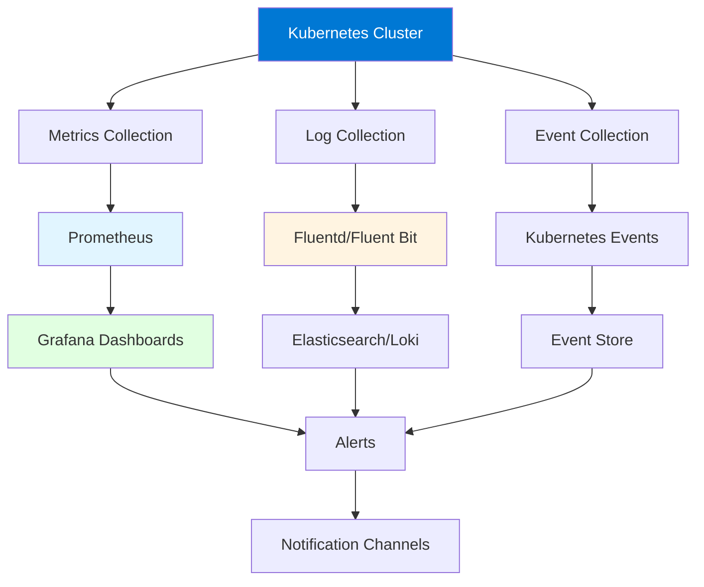
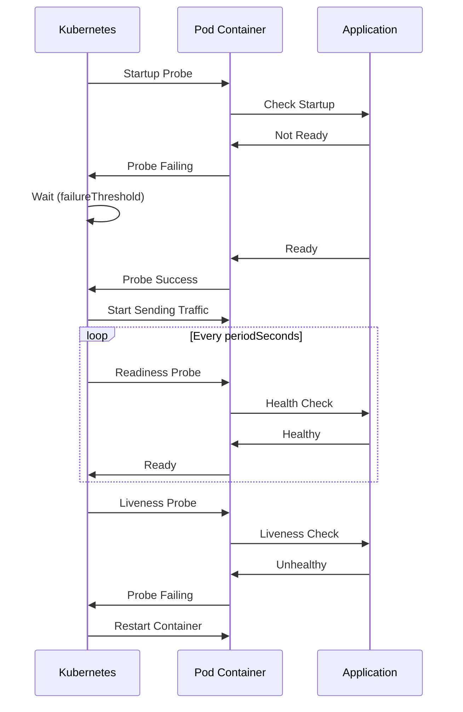
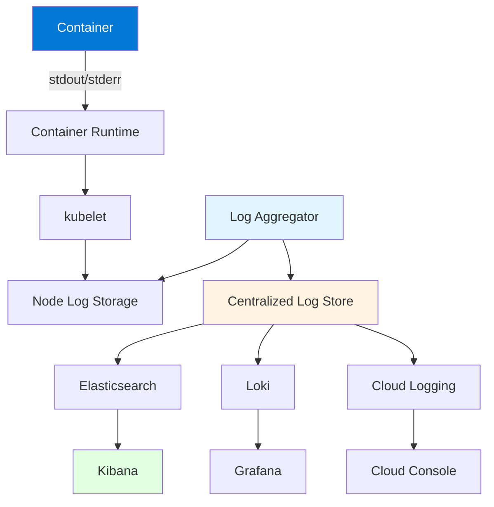
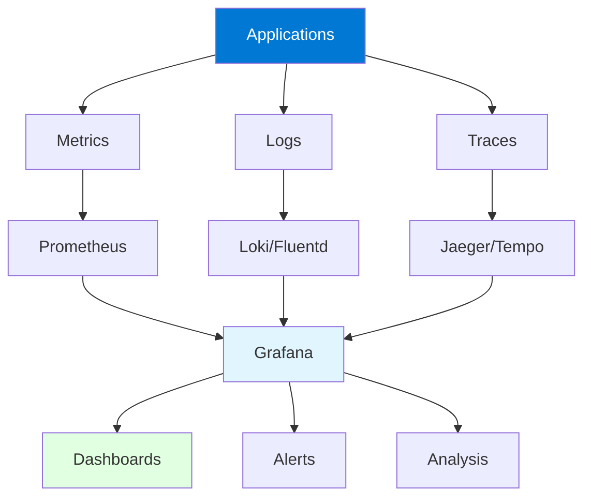

# Module 9: Kubernetes Monitoring and Logging

## Table of Contents
- [9.1 Monitoring Concepts](#91-monitoring-concepts)
- [9.2 Health Checks](#92-health-checks)
- [9.3 Logging](#93-logging)
- [9.4 Observability](#94-observability)
- [Quick Reference](#quick-reference)
- [Common Pitfalls](#common-pitfalls)
- [Best Practices](#best-practices)
- [Further Reading](#further-reading)

---

## 9.1 Monitoring Concepts

### Why Monitoring Matters

Monitoring in Kubernetes is essential for maintaining healthy clusters and applications. Without proper monitoring, you're operating blind - you won't know when resources are exhausted, applications are failing, or performance is degrading. Monitoring provides the visibility needed to proactively manage infrastructure and respond quickly to issues before they impact users.

Kubernetes monitoring is complex because it involves multiple layers: **infrastructure monitoring** (nodes, network, storage), **cluster monitoring** (control plane components, API server, etcd), **application monitoring** (Pods, containers, services), and **business metrics** (user-facing metrics, business KPIs). Each layer requires different tools and approaches, but together they provide comprehensive visibility into your Kubernetes environment.

Effective monitoring enables: **proactive issue detection** (catch problems before users notice), **capacity planning** (understand resource needs and plan scaling), **performance optimization** (identify bottlenecks and optimize), **cost management** (track resource usage and costs), and **compliance** (meet SLA requirements, audit trails). Understanding monitoring concepts helps you build effective observability strategies.

#### Monitoring Architecture



### Key Monitoring Areas

Monitoring in Kubernetes covers several critical areas:

**Cluster Health**: Monitor control plane components (API server, etcd, scheduler, controller manager) for availability and performance. Monitor node health (CPU, memory, disk, network). Track cluster-level metrics like API request rates, error rates, and latency. Cluster health issues affect all workloads.

**Resource Usage**: Track CPU, memory, disk, and network utilization across nodes and Pods. Monitor resource requests vs. limits. Identify resource constraints and bottlenecks. Resource monitoring helps with capacity planning and optimization.

**Application Metrics**: Monitor application-specific metrics like request rates, error rates, response times, and business metrics. Application metrics provide insight into user experience and application health. These metrics are application-specific and require instrumentation.

**Pod Status**: Track Pod states (Pending, Running, Succeeded, Failed, Unknown). Monitor Pod restarts, crashes, and scheduling failures. Pod status indicates application health and cluster capacity. Failed Pods indicate problems that need attention.

**Events**: Kubernetes events provide a timeline of cluster activities. Events include Pod creation, scheduling decisions, image pulls, and errors. Events help understand what happened and when. Event monitoring provides context for troubleshooting.

### Monitoring Tools

Popular Kubernetes monitoring tools:

**Prometheus**: Industry-standard metrics collection and alerting. Pulls metrics from applications and infrastructure. Stores time-series data. Provides PromQL query language. Integrates with Grafana for visualization.

**Grafana**: Visualization and dashboarding platform. Connects to Prometheus and other data sources. Creates beautiful dashboards. Supports alerting and annotations. Widely used in Kubernetes environments.

**Datadog**: Commercial monitoring platform. Provides comprehensive Kubernetes monitoring. Includes APM, logs, and infrastructure monitoring. Easy to set up but requires subscription.

**New Relic**: Application performance monitoring. Provides Kubernetes monitoring, APM, and infrastructure monitoring. Good for application-focused monitoring.

**ELK Stack**: Elasticsearch, Logstash, Kibana for log aggregation and analysis. Powerful for log analysis. Can be complex to set up and maintain.

### Metrics Types

Kubernetes metrics fall into several categories:

**Counter Metrics**: Incrementing values (request count, error count). Always increase, never decrease. Useful for rates and totals.

**Gauge Metrics**: Values that go up and down (CPU usage, memory usage, active connections). Current state at a point in time.

**Histogram Metrics**: Distribution of measurements (request latency, response size). Provides percentiles and distributions.

**Summary Metrics**: Similar to histograms but calculated on client side. Provides quantiles and counts.

Understanding metric types helps you choose appropriate metrics and interpret them correctly.

---

## 9.2 Health Checks

### Understanding Health Checks

Health checks are mechanisms Kubernetes uses to determine if Pods are functioning correctly. Health checks enable Kubernetes to automatically detect and recover from failures, ensuring applications remain available and responsive. Without health checks, Kubernetes might continue sending traffic to unhealthy Pods, leading to poor user experience.

Kubernetes provides three types of probes: **liveness probes** (determine if Pod should be restarted), **readiness probes** (determine if Pod can receive traffic), and **startup probes** (determine if Pod has started successfully). Each probe type serves a different purpose and should be configured appropriately for your application's behavior.

Health checks are critical for: **automatic recovery** (restart failed containers), **traffic management** (only route to healthy Pods), **graceful startup** (wait for application to be ready), **zero-downtime deployments** (ensure new Pods are ready before removing old ones), and **resilience** (handle transient failures automatically). Understanding health checks helps you build resilient applications.

#### Health Check Flow



### Liveness Probes

Liveness probes determine if a container is running properly. If a liveness probe fails, Kubernetes restarts the container. Liveness probes detect deadlocks, infinite loops, or other conditions where the container is running but the application is not functioning.

**When to Use**: Use liveness probes when your application can get into a broken state that requires a restart. Examples: deadlocked applications, applications that stop responding, applications with memory leaks causing unresponsiveness.

**Configuration**: Set appropriate `initialDelaySeconds` to allow application startup. Use reasonable `periodSeconds` (not too frequent). Set `failureThreshold` based on how long you're willing to wait before restarting.

Liveness probe example:
```yaml
apiVersion: v1
kind: Pod
metadata:
  name: web-app
spec:
  containers:
  - name: app
    image: myapp:latest
    livenessProbe:
      httpGet:
        path: /healthz
        port: 8080
        httpHeaders:
        - name: Custom-Header
          value: Awesome
      initialDelaySeconds: 30  # Wait 30s before first check
      periodSeconds: 10         # Check every 10s
      timeoutSeconds: 5         # Timeout after 5s
      successThreshold: 1       # 1 success = healthy
      failureThreshold: 3       # 3 failures = restart
```

### Readiness Probes

Readiness probes determine if a container is ready to accept traffic. If a readiness probe fails, Kubernetes removes the Pod from Service endpoints. Readiness probes are different from liveness - a Pod can be alive but not ready (e.g., still loading data, warming up caches).

**When to Use**: Use readiness probes when your application needs time to become ready to serve traffic. Examples: applications loading configuration, applications warming up caches, applications waiting for dependencies.

**Configuration**: Readiness probes typically have shorter `initialDelaySeconds` than liveness probes. Use frequent checks (`periodSeconds: 5`) to quickly detect when Pods become ready. This enables faster traffic routing during deployments.

Readiness probe example:
```yaml
readinessProbe:
  httpGet:
    path: /ready
    port: 8080
  initialDelaySeconds: 5   # Check soon after start
  periodSeconds: 5          # Check frequently
  timeoutSeconds: 3
  successThreshold: 1
  failureThreshold: 3       # Remove from service after 3 failures
```

### Startup Probes

Startup probes determine if a container has started. Startup probes are useful for applications that take a long time to start. Once a startup probe succeeds, liveness and readiness probes take over.

**When to Use**: Use startup probes for slow-starting applications. Examples: applications with long initialization, applications loading large datasets, applications with complex startup sequences.

**Configuration**: Startup probes typically have longer `failureThreshold` to allow sufficient time for startup. Once startup succeeds, the probe is disabled and liveness/readiness probes handle ongoing health checks.

Startup probe example:
```yaml
startupProbe:
  httpGet:
    path: /startup
    port: 8080
  initialDelaySeconds: 10
  periodSeconds: 10
  failureThreshold: 30  # Allow up to 5 minutes for startup
  successThreshold: 1
```

### Probe Types

Kubernetes supports three probe mechanisms:

**HTTP GET**: Sends HTTP GET request to specified path and port. Considers probe successful if response code is between 200-399. Most common for web applications.

**TCP Socket**: Attempts to open TCP connection to specified port. Considers probe successful if connection succeeds. Useful for non-HTTP applications.

**Exec**: Executes command in container. Considers probe successful if command exits with code 0. Most flexible but least efficient.

Probe type examples:
```yaml
# HTTP GET probe
livenessProbe:
  httpGet:
    path: /health
    port: 8080
    scheme: HTTP  # or HTTPS

# TCP Socket probe
livenessProbe:
  tcpSocket:
    port: 3306

# Exec probe
livenessProbe:
  exec:
    command:
    - /bin/sh
    - -c
    - "pg_isready -U postgres"
```

### Health Check Best Practices

Best practices for health checks:

1. **Always Use Readiness Probes**: Essential for proper traffic routing
2. **Use Liveness Probes Carefully**: Only when restart helps
3. **Set Appropriate Delays**: Allow time for application startup
4. **Use Startup Probes**: For slow-starting applications
5. **Keep Probes Lightweight**: Don't impact application performance
6. **Test Probe Endpoints**: Ensure endpoints work correctly
7. **Monitor Probe Failures**: Track probe success rates
8. **Tune Thresholds**: Balance responsiveness vs. false positives
9. **Use HTTP When Possible**: More efficient than exec
10. **Document Probe Logic**: Explain what probes check

---

## 9.3 Logging

### Container Logging Fundamentals

Container logging in Kubernetes captures application output for debugging, auditing, and monitoring. Unlike traditional applications that write to log files, containers write to stdout and stderr, which Kubernetes collects and makes available through the API. This approach provides consistency but requires applications to be designed for containerized logging.

Kubernetes logging architecture involves: **container runtime** (collects stdout/stderr), **kubelet** (aggregates logs from containers), **log storage** (node-level storage, typically rotated), and **log aggregation** (centralized collection for analysis). Understanding this architecture helps you implement effective logging strategies.

Effective logging enables: **debugging** (identify and fix issues), **auditing** (track who did what, when), **monitoring** (detect problems and trends), **compliance** (meet regulatory requirements), and **troubleshooting** (understand system behavior). Understanding logging helps you maintain operational visibility.

#### Logging Architecture



### Logging Strategies

Different logging strategies serve different needs:

**Node-Level Logging**: Logs stored on each node, accessible via `kubectl logs`. Simple but doesn't scale. Logs are lost if node fails. Suitable for development and small clusters.

**Centralized Logging**: Logs aggregated to central store (Elasticsearch, Loki, cloud logging). Provides search, analysis, and long-term storage. Scales to large clusters. Requires log aggregation infrastructure.

**Sidecar Logging**: Dedicated sidecar container in Pod handles log collection and shipping. Provides flexibility and isolation. Each Pod has its own log collector. Useful for complex logging requirements.

**Application-Level Logging**: Applications directly ship logs to external systems. Bypasses Kubernetes logging. Provides most control but requires application changes. Useful for specialized logging needs.

### Viewing Logs

Kubernetes provides several ways to view logs:

**kubectl logs**: Basic log viewing command. Shows logs from containers. Supports following logs, previous container instances, and specific containers in multi-container Pods.

**Log Aggregation Tools**: Tools like Kibana, Grafana, or cloud consoles provide advanced log viewing. Support search, filtering, and visualization. Better for production use.

Viewing logs examples:
```bash
# View current logs
kubectl logs web-pod

# View logs from specific container
kubectl logs web-pod -c app-container

# View logs from previous instance (after crash)
kubectl logs web-pod --previous

# Follow logs (like tail -f)
kubectl logs -f web-pod

# View logs from all Pods with label
kubectl logs -l app=web

# View logs with timestamps
kubectl logs web-pod --timestamps

# View last N lines
kubectl logs web-pod --tail=100

# View logs since specific time
kubectl logs web-pod --since=1h
```

### Log Aggregation

Centralized log aggregation provides:

**Search and Analysis**: Search across all logs, filter by time, source, or content. Analyze trends and patterns. Query logs with powerful query languages.

**Long-Term Storage**: Store logs for compliance and analysis. Retain logs per regulatory requirements. Archive old logs cost-effectively.

**Alerting**: Alert on log patterns (errors, warnings, specific events). Integrate with notification systems. Enable proactive issue detection.

**Visualization**: Create dashboards showing log trends. Visualize error rates, patterns, and distributions. Share insights with team.

### Logging Best Practices

Best practices for logging:

1. **Write to stdout/stderr**: Don't write to files in containers
2. **Structured Logging**: Use JSON or structured formats
3. **Appropriate Log Levels**: Use INFO, WARN, ERROR appropriately
4. **Include Context**: Add timestamps, request IDs, user IDs
5. **Avoid Sensitive Data**: Don't log passwords, tokens, PII
6. **Centralize Logs**: Use log aggregation for production
7. **Set Retention**: Configure log retention policies
8. **Monitor Log Volume**: Watch for excessive logging
9. **Use Sidecars When Needed**: For complex logging requirements
10. **Test Log Collection**: Ensure logs are being collected

---

## 9.4 Observability

### Observability Concepts

Observability is the ability to understand a system's internal state from its external outputs. In Kubernetes, observability combines metrics, logs, and traces to provide comprehensive system understanding. Unlike monitoring (which tells you something is wrong), observability helps you understand why something is wrong.

The three pillars of observability are: **metrics** (numerical measurements over time), **logs** (discrete events with timestamps), and **traces** (request flows through distributed systems). Each pillar provides different insights, and together they enable complete system understanding.

Observability enables: **faster troubleshooting** (understand root causes quickly), **performance optimization** (identify bottlenecks), **capacity planning** (understand resource needs), **user experience** (track application performance from user perspective), and **business insights** (connect technical metrics to business outcomes). Understanding observability helps you build comprehensive monitoring strategies.

#### Observability Stack



### Metrics

Metrics are numerical measurements collected over time:

**Types**: Counter (incrementing), Gauge (current value), Histogram (distribution), Summary (client-calculated quantiles). Metrics provide quantitative insight into system behavior.

**Collection**: Prometheus is the standard for Kubernetes metrics. Collects metrics via pull model. Stores time-series data. Provides PromQL for querying.

**Use Cases**: Track resource usage, monitor application performance, measure business metrics, set up alerts, capacity planning.

### Logs

Logs are discrete events with timestamps:

**Characteristics**: Immutable, append-only, structured or unstructured. Logs provide qualitative insight into what happened.

**Collection**: Collected from container stdout/stderr. Aggregated by tools like Fluentd, Fluent Bit, or Loki. Stored in systems like Elasticsearch or Loki.

**Use Cases**: Debugging, auditing, compliance, understanding user behavior, troubleshooting.

### Traces

Traces show request flows through distributed systems:

**Purpose**: Understand how requests flow through microservices. Identify bottlenecks and latency issues. Debug distributed system problems.

**Tools**: Jaeger, Zipkin, Tempo. Instrument applications to generate traces. Collect and visualize trace data.

**Use Cases**: Performance optimization, debugging distributed systems, understanding service dependencies, latency analysis.

### Observability Stack

Complete observability stack typically includes:

**Metrics**: Prometheus (collection) + Grafana (visualization)
**Logs**: Loki/Fluentd (collection) + Grafana (visualization)
**Traces**: Jaeger/Tempo (collection) + Grafana (visualization)
**Alerts**: Alertmanager (alerting) + notification channels
**Dashboards**: Grafana (unified visualization)

This stack provides comprehensive observability for Kubernetes clusters.

---

## Quick Reference

### Health Check Commands
```bash
# View Pod events
kubectl describe pod <pod-name>

# Check Pod status
kubectl get pods

# View container logs
kubectl logs <pod-name>
```

### Monitoring Commands
```bash
# View node metrics
kubectl top nodes

# View Pod metrics
kubectl top pods

# View resource usage
kubectl top pods --all-namespaces
```

### Log Commands
```bash
# View logs
kubectl logs <pod-name>

# Follow logs
kubectl logs -f <pod-name>

# Previous instance
kubectl logs <pod-name> --previous
```

---

## Common Pitfalls

### Pitfall 1: Missing Readiness Probes
**Problem**: Traffic sent to Pods before they're ready, causing errors
**Solution**: Always configure readiness probes
**Prevention**: Include readiness probes in all Pod specs

### Pitfall 2: Aggressive Liveness Probes
**Problem**: Pods restarted unnecessarily, causing disruption
**Solution**: Set appropriate delays and thresholds
**Prevention**: Test probe behavior, monitor restart rates

### Pitfall 3: No Log Aggregation
**Problem**: Logs lost when Pods/containers are deleted
**Solution**: Implement centralized log aggregation
**Prevention**: Set up log collection early

### Pitfall 4: Excessive Logging
**Problem**: High log volume, performance impact, storage costs
**Solution**: Use appropriate log levels, filter logs
**Prevention**: Monitor log volume, set retention policies

---

## Best Practices

1. **Configure All Three Probes**: Startup, readiness, and liveness
2. **Set Appropriate Delays**: Allow time for application startup
3. **Keep Probes Lightweight**: Don't impact performance
4. **Centralize Logs**: Use log aggregation for production
5. **Use Structured Logging**: JSON or structured formats
6. **Monitor Metrics**: Track key performance indicators
7. **Set Up Alerts**: Alert on critical issues
8. **Create Dashboards**: Visualize important metrics
9. **Test Observability**: Ensure tools work correctly
10. **Document Monitoring**: Explain what's monitored and why

---

## Further Reading

### Official Documentation
- [Kubernetes Monitoring](https://kubernetes.io/docs/tasks/debug/debug-cluster/resource-metrics-pipeline/)
- [Health Checks](https://kubernetes.io/docs/tasks/configure-pod-container/configure-liveness-readiness-startup-probes/)

### Monitoring Tools
- [Prometheus](https://prometheus.io/)
- [Grafana](https://grafana.com/)
- [Loki](https://grafana.com/oss/loki/)

### Related Topics
- Resource Management (Module 10)
- Troubleshooting (Module 17)

---

*This module covers Kubernetes monitoring and logging in detail. Understanding these concepts helps you maintain visibility into cluster and application health, enabling proactive management and quick issue resolution.*
