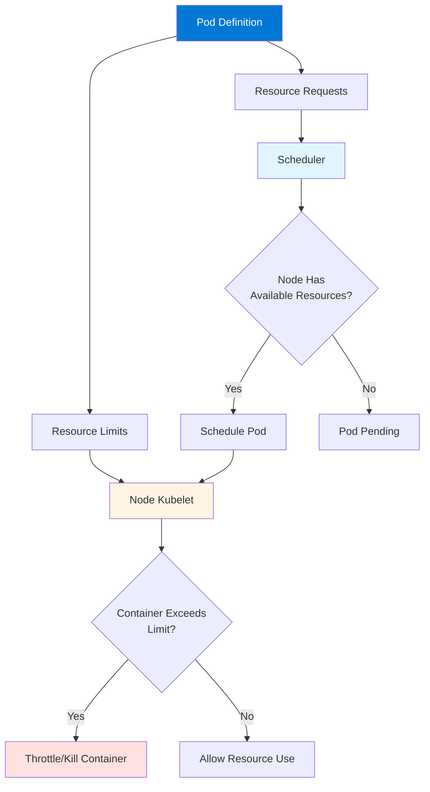
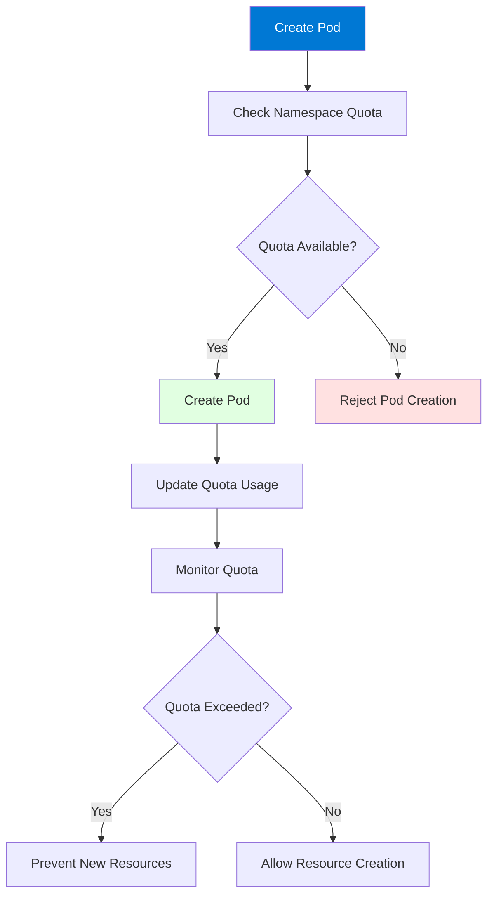
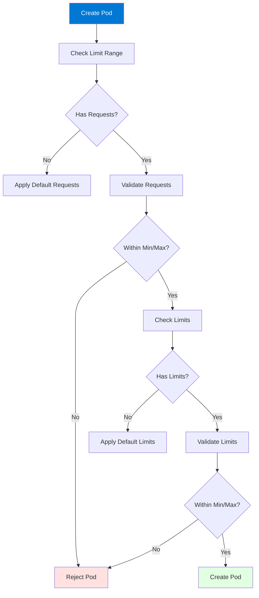
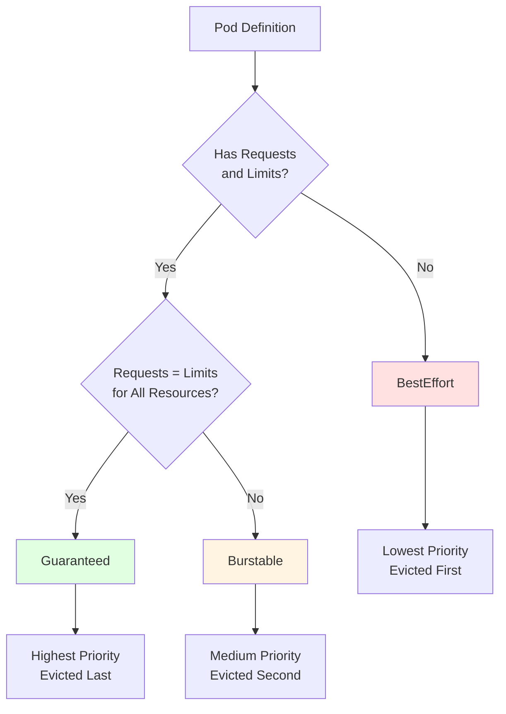

# Module 10: Kubernetes Resource Management

## Table of Contents
- [10.1 Resource Requests and Limits](#101-resource-requests-and-limits)
- [10.2 Resource Quotas](#102-resource-quotas)
- [10.3 Limit Ranges](#103-limit-ranges)
- [10.4 Quality of Service (QoS)](#104-quality-of-service-qos)
- [Quick Reference](#quick-reference)
- [Common Pitfalls](#common-pitfalls)
- [Best Practices](#best-practices)
- [Further Reading](#further-reading)

---

## 10.1 Resource Requests and Limits

### Understanding Resource Management

Resource management is fundamental to Kubernetes operations, ensuring that containers have the resources they need while preventing any single container from consuming all cluster resources. Kubernetes uses resource requests and limits to control CPU and memory allocation, enabling efficient cluster utilization and preventing resource exhaustion.

Resource requests specify the minimum resources a container needs, which Kubernetes uses for scheduling decisions. The scheduler ensures that nodes have sufficient resources before placing Pods. Resource limits specify the maximum resources a container can use, preventing containers from consuming excessive resources and affecting other workloads. Understanding resource requests and limits is essential for maintaining cluster stability and performance.

Effective resource management provides: **efficient scheduling** (Pods placed on nodes with available resources), **resource protection** (preventing resource starvation), **cost optimization** (right-sizing resources), **predictable performance** (guaranteed resources for critical workloads), and **cluster stability** (preventing resource exhaustion). Understanding resource management helps you optimize cluster utilization and ensure application performance.

#### Resource Management Flow



### Resource Requests

Resource requests specify the minimum resources guaranteed to a container. The scheduler uses requests to determine which node can accommodate a Pod. Requests are reserved for the container, ensuring it has the resources it needs.

**CPU Requests**: Specified in cores (1 = 1 core) or millicores (1000m = 1 core). CPU is compressible - if a container requests CPU but doesn't use it, it can be allocated to other containers. However, the requested amount is guaranteed.

**Memory Requests**: Specified in bytes, with common units: Ki (kibibytes), Mi (mebibytes), Gi (gibibytes). Memory is incompressible - once allocated, it cannot be taken away. Memory requests should be set based on actual needs.

**Scheduling Impact**: Pods are only scheduled on nodes that have sufficient available resources (total node capacity minus sum of all Pod requests). If no node has available resources, Pods remain in Pending state.

Resource requests example:
```yaml
apiVersion: v1
kind: Pod
metadata:
  name: resource-example
spec:
  containers:
  - name: app
    image: nginx:latest
    resources:
      requests:
        cpu: "250m"      # 0.25 cores
        memory: "128Mi"  # 128 mebibytes
      limits:
        cpu: "500m"      # 0.5 cores
        memory: "256Mi"  # 256 mebibytes
```

### Resource Limits

Resource limits specify the maximum resources a container can use. Limits prevent containers from consuming excessive resources and affecting other workloads.

**CPU Limits**: When a container exceeds CPU limit, it's throttled (CPU time is reduced). CPU throttling doesn't kill the container but reduces its performance. Containers can burst above requests up to limits.

**Memory Limits**: When a container exceeds memory limit, it's terminated (OOMKilled). Memory limits are hard limits - exceeding them results in container termination. Memory limits should be set higher than requests to allow for bursts.

**Enforcement**: Kubelet enforces limits on the node. CPU throttling happens gradually, while memory limits result in immediate termination if exceeded.

**Best Practices**: Set limits higher than requests to allow bursts. Monitor actual usage to right-size limits. Don't set limits too low, causing unnecessary throttling or OOM kills.

Resource limits example:
```yaml
resources:
  requests:
    cpu: "100m"
    memory: "128Mi"
  limits:
    cpu: "500m"    # 5x request for CPU bursts
    memory: "256Mi" # 2x request for memory bursts
```

### CPU Units

CPU is measured in cores or millicores:

**Cores**: `1` = 1 CPU core, `2` = 2 CPU cores. Used for whole cores.

**Millicores**: `1000m` = 1 core, `500m` = 0.5 cores, `100m` = 0.1 cores. Used for fractional cores.

**Examples**: `250m` = quarter core, `500m` = half core, `1500m` = 1.5 cores.

CPU is compressible, meaning unused CPU can be allocated to other containers. However, requested CPU is guaranteed.

### Memory Units

Memory is measured in bytes with standard units:

**Binary Units** (recommended): `Ki` (kibibyte = 1024 bytes), `Mi` (mebibyte = 1024 KiB), `Gi` (gibibyte = 1024 MiB), `Ti` (tebibyte = 1024 GiB).

**Decimal Units**: `k` (kilobyte = 1000 bytes), `M` (megabyte = 1000 KB), `G` (gigabyte = 1000 MB), `T` (terabyte = 1000 GB).

**Best Practice**: Use binary units (Ki, Mi, Gi) as they match how memory is actually allocated.

Memory examples:
```yaml
memory: "64Mi"    # 64 mebibytes
memory: "1Gi"     # 1 gibibyte
memory: "512Mi"   # 512 mebibytes
```

### Resource Monitoring

Monitoring resource usage helps right-size requests and limits:

**kubectl top**: Shows current resource usage for nodes and Pods. Useful for understanding actual usage vs. requests/limits.

**Prometheus**: Collects detailed resource metrics. Enables historical analysis and trend identification.

**Cloud Provider Tools**: Cloud providers offer resource monitoring tools. Integrated with cloud infrastructure.

Monitoring commands:
```bash
# Node resource usage
kubectl top nodes

# Pod resource usage
kubectl top pods
kubectl top pods --all-namespaces

# Specific Pod
kubectl top pod <pod-name>

# Resource usage with labels
kubectl top pods -l app=myapp
```

---

## 10.2 Resource Quotas

### Understanding Resource Quotas

Resource quotas limit resource consumption per namespace, preventing any single namespace from consuming all cluster resources. Quotas are essential for multi-tenant clusters where multiple teams or projects share resources.

Resource quotas provide: **resource protection** (preventing resource exhaustion), **multi-tenancy** (isolating resource usage), **cost control** (limiting resource consumption), **fairness** (ensuring all teams get resources), and **planning** (predictable resource allocation). Understanding resource quotas helps you manage shared clusters effectively.

Quotas can limit: **compute resources** (CPU, memory requests and limits), **storage resources** (persistent volume claims, storage size), **object counts** (Pods, Services, ConfigMaps, Secrets, etc.), and **extended resources** (GPU, custom resources). Quotas are enforced at namespace level, providing isolation between namespaces.

#### Resource Quota Enforcement



### Compute Resource Quotas

Compute resource quotas limit CPU and memory consumption:

**Requests Quotas**: Limit total resource requests in namespace. Prevents over-requesting resources. Ensures resources are available for other namespaces.

**Limits Quotas**: Limit total resource limits in namespace. Prevents setting excessive limits. Controls maximum resource consumption.

**Best Practices**: Set quotas based on namespace needs. Monitor quota usage. Adjust quotas as needs change. Use separate quotas for different environments.

Compute quota example:
```yaml
apiVersion: v1
kind: ResourceQuota
metadata:
  name: compute-quota
  namespace: production
spec:
  hard:
    requests.cpu: "10"        # 10 CPU cores total requests
    requests.memory: 20Gi     # 20 GiB total memory requests
    limits.cpu: "20"          # 20 CPU cores total limits
    limits.memory: 40Gi       # 40 GiB total memory limits
```

### Storage Resource Quotas

Storage quotas limit storage consumption:

**Persistent Volume Claims**: Limit number of PVCs in namespace. Prevents creating too many volumes.

**Storage Size**: Limit total storage size. Prevents excessive storage consumption. Can be per storage class.

Storage quota example:
```yaml
apiVersion: v1
kind: ResourceQuota
metadata:
  name: storage-quota
  namespace: production
spec:
  hard:
    persistentvolumeclaims: "10"           # Max 10 PVCs
    requests.storage: "100Gi"              # 100 GiB total storage
    requests.storage.storageclass.standard: "50Gi"  # Per storage class
```

### Object Count Quotas

Object count quotas limit the number of Kubernetes objects:

**Pod Quotas**: Limit number of Pods. Prevents creating too many Pods.

**Service Quotas**: Limit number of Services. Prevents service proliferation.

**ConfigMap/Secret Quotas**: Limit configuration objects. Prevents excessive configuration.

Object count quota example:
```yaml
apiVersion: v1
kind: ResourceQuota
metadata:
  name: object-count-quota
  namespace: production
spec:
  hard:
    pods: "50"
    services: "10"
    configmaps: "20"
    secrets: "20"
    persistentvolumeclaims: "10"
```

### Quota Management

Managing quotas effectively:

**Creating Quotas**: Create quotas when creating namespaces. Set appropriate limits based on needs.

**Monitoring Quotas**: Regularly check quota usage. Use `kubectl describe resourcequota` to see usage.

**Adjusting Quotas**: Increase quotas as needs grow. Decrease quotas to free resources. Coordinate with teams.

**Quota Best Practices**: Set quotas from the start, monitor usage regularly, adjust based on actual needs, document quota decisions, and communicate quota limits to teams.

Quota management commands:
```bash
# Create quota
kubectl create quota compute-quota --hard=cpu=10,memory=20Gi

# List quotas
kubectl get resourcequota

# Describe quota (shows usage)
kubectl describe resourcequota compute-quota

# Edit quota
kubectl edit resourcequota compute-quota

# Delete quota
kubectl delete resourcequota compute-quota
```

---

## 10.3 Limit Ranges

### Understanding Limit Ranges

Limit Ranges set default, minimum, and maximum resource values for Pods and containers in a namespace. They ensure consistent resource allocation and prevent misconfigurations.

Limit Ranges provide: **default values** (when requests/limits not specified), **minimum constraints** (required minimums), **maximum constraints** (allowed maximums), **consistency** (standard resource allocation), and **protection** (preventing resource abuse). Understanding Limit Ranges helps you enforce resource policies.

Limit Ranges can set constraints for: **containers** (per-container resources), **Pods** (per-Pod resources), **PersistentVolumeClaims** (storage resources). Limit Ranges are namespace-scoped, allowing different policies per namespace.

#### Limit Range Enforcement



### Default Values

Default values are applied when Pods don't specify requests or limits:

**Default Requests**: Applied when containers don't specify requests. Ensures all containers have requests for scheduling.

**Default Limits**: Applied when containers don't specify limits. Prevents unlimited resource consumption.

**Use Cases**: Ensure all Pods have resource constraints, enforce minimum resource allocation, and provide sensible defaults for teams.

Default values example:
```yaml
apiVersion: v1
kind: LimitRange
metadata:
  name: default-limits
  namespace: production
spec:
  limits:
  - default:
      cpu: "500m"
      memory: "512Mi"
    defaultRequest:
      cpu: "250m"
      memory: "256Mi"
    type: Container
```

### Minimum Constraints

Minimum constraints enforce required minimums:

**Minimum Requests**: Containers must request at least this amount. Prevents under-provisioning.

**Minimum Limits**: Containers must have limits at least this high. Ensures minimum resource availability.

**Use Cases**: Prevent resource starvation, ensure minimum performance, and enforce resource policies.

Minimum constraints example:
```yaml
apiVersion: v1
kind: LimitRange
metadata:
  name: min-limits
  namespace: production
spec:
  limits:
  - min:
      cpu: "100m"
      memory: "128Mi"
    type: Container
```

### Maximum Constraints

Maximum constraints enforce allowed maximums:

**Maximum Requests**: Containers cannot request more than this. Prevents over-requesting.

**Maximum Limits**: Containers cannot have limits higher than this. Prevents excessive resource consumption.

**Use Cases**: Prevent resource hoarding, ensure fair resource distribution, and control costs.

Maximum constraints example:
```yaml
apiVersion: v1
kind: LimitRange
metadata:
  name: max-limits
  namespace: production
spec:
  limits:
  - max:
      cpu: "2"
      memory: "4Gi"
    type: Container
```

### Complete Limit Range Example

Complete Limit Range with all constraints:

```yaml
apiVersion: v1
kind: LimitRange
metadata:
  name: resource-limits
  namespace: production
spec:
  limits:
  # Container limits
  - default:
      cpu: "500m"
      memory: "512Mi"
    defaultRequest:
      cpu: "250m"
      memory: "256Mi"
    min:
      cpu: "100m"
      memory: "128Mi"
    max:
      cpu: "2"
      memory: "4Gi"
    type: Container
  
  # Pod limits (total for all containers)
  - max:
      cpu: "4"
      memory: "8Gi"
    type: Pod
  
  # PVC limits
  - min:
      storage: "1Gi"
    max:
      storage: "10Gi"
    type: PersistentVolumeClaim
```

---

## 10.4 Quality of Service (QoS)

### Understanding QoS Classes

Quality of Service (QoS) classes determine Pod priority during resource contention. Kubernetes assigns QoS classes based on resource requests and limits, affecting eviction order and resource guarantees.

QoS classes provide: **eviction priority** (which Pods are evicted first), **resource guarantees** (which Pods get guaranteed resources), **performance predictability** (consistent resource availability), and **cost optimization** (protecting important workloads). Understanding QoS helps you protect critical workloads.

Kubernetes has three QoS classes: **Guaranteed** (highest priority), **Burstable** (medium priority), **BestEffort** (lowest priority). QoS class is determined automatically based on resource configuration.

#### QoS Class Determination



### Guaranteed QoS

Guaranteed QoS provides the highest priority and best resource guarantees:

**Requirements**: All containers must have requests and limits, and requests must equal limits for all resources (CPU and memory).

**Benefits**: Highest priority during eviction, guaranteed resources, best performance predictability, protected from resource pressure.

**Use Cases**: Critical production workloads, databases, stateful applications, applications requiring consistent performance.

Guaranteed QoS example:
```yaml
apiVersion: v1
kind: Pod
metadata:
  name: guaranteed-pod
spec:
  containers:
  - name: app
    image: nginx:latest
    resources:
      requests:
        cpu: "500m"
        memory: "512Mi"
      limits:
        cpu: "500m"    # Must equal request
        memory: "512Mi" # Must equal request
```

### Burstable QoS

Burstable QoS provides medium priority with some guarantees:

**Requirements**: At least one container has requests or limits, but requests don't equal limits for all resources.

**Benefits**: Can burst above requests up to limits, has minimum guaranteed resources (requests), medium eviction priority.

**Use Cases**: Most applications, workloads with variable resource needs, applications that can benefit from bursts.

Burstable QoS example:
```yaml
apiVersion: v1
kind: Pod
metadata:
  name: burstable-pod
spec:
  containers:
  - name: app
    image: nginx:latest
    resources:
      requests:
        cpu: "250m"
        memory: "256Mi"
      limits:
        cpu: "500m"    # Can burst above request
        memory: "512Mi" # Can burst above request
```

### BestEffort QoS

BestEffort QoS provides lowest priority with no guarantees:

**Requirements**: No containers have requests or limits.

**Benefits**: Can use available resources, no resource reservations, flexible resource usage.

**Drawbacks**: Lowest eviction priority (evicted first), no resource guarantees, unpredictable performance.

**Use Cases**: Non-critical workloads, batch jobs, development environments, workloads that can tolerate interruptions.

BestEffort QoS example:
```yaml
apiVersion: v1
kind: Pod
metadata:
  name: besteffort-pod
spec:
  containers:
  - name: app
    image: nginx:latest
    # No resources specified = BestEffort
```

### QoS and Eviction

QoS affects eviction order during resource pressure:

**Eviction Order**: BestEffort Pods evicted first, then Burstable Pods, then Guaranteed Pods last.

**Eviction Triggers**: Node memory pressure, disk pressure, or other resource constraints.

**Protection**: Guaranteed Pods are protected from eviction unless node is under severe pressure.

Understanding QoS and eviction helps you protect critical workloads by assigning them Guaranteed QoS.

---

## Quick Reference

### Resource Units
- **CPU**: `1` = 1 core, `1000m` = 1 core, `250m` = 0.25 cores
- **Memory**: `Ki` (1024 bytes), `Mi` (1024 KiB), `Gi` (1024 MiB)

### QoS Classes
- **Guaranteed**: requests = limits (all resources)
- **Burstable**: has requests/limits but not equal
- **BestEffort**: no requests/limits

### Commands
```bash
# Check resource usage
kubectl top nodes
kubectl top pods

# Check quotas
kubectl get resourcequota
kubectl describe resourcequota

# Check limit ranges
kubectl get limitrange
kubectl describe limitrange
```

---

## Common Pitfalls

### Pitfall 1: No Resource Requests
**Problem**: Pods cannot be scheduled, unpredictable performance
**Solution**: Always set resource requests
**Prevention**: Use Limit Ranges for defaults

### Pitfall 2: Requests Equal Limits
**Problem**: No room for bursts, wasted resources
**Solution**: Set limits higher than requests
**Prevention**: Understand application resource patterns

### Pitfall 3: Over-Requesting Resources
**Problem**: Poor cluster utilization, scheduling failures
**Solution**: Right-size requests based on actual usage
**Prevention**: Monitor and adjust regularly

---

## Best Practices

1. **Always Set Requests**: Ensure schedulability
2. **Set Appropriate Limits**: Allow bursts without waste
3. **Use Quotas**: Prevent resource exhaustion
4. **Use Limit Ranges**: Enforce defaults and constraints
5. **Monitor Usage**: Right-size based on actual usage
6. **Use Guaranteed QoS**: For critical workloads
7. **Review Regularly**: Adjust as needs change
8. **Document Policies**: Explain resource decisions
9. **Test Resource Changes**: Verify before production
10. **Balance Performance and Cost**: Optimize resource allocation

---

## Further Reading

### Official Documentation
- [Kubernetes Resource Management](https://kubernetes.io/docs/concepts/configuration/manage-resources-containers/)
- [Resource Quotas](https://kubernetes.io/docs/concepts/policy/resource-quotas/)

### Related Topics
- Monitoring and Logging (Module 9)
- Namespaces (Module 11)
- Troubleshooting (Module 17)

---

*This module covers Kubernetes resource management in detail. Understanding resource requests, limits, quotas, and QoS helps you optimize cluster utilization, ensure application performance, and prevent resource exhaustion.*
