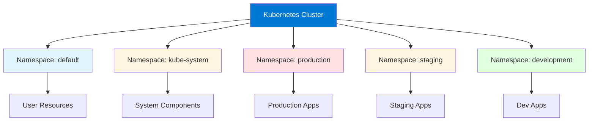
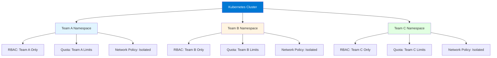

# Module 11: Kubernetes Namespaces

## Table of Contents
- [11.1 Namespace Concepts](#111-namespace-concepts)
- [11.2 Working with Namespaces](#112-working-with-namespaces)
- [11.3 Multi-Tenancy](#113-multi-tenancy)
- [Quick Reference](#quick-reference)
- [Common Pitfalls](#common-pitfalls)
- [Best Practices](#best-practices)
- [Further Reading](#further-reading)

---

## 11.1 Namespace Concepts

### Understanding Namespaces

Namespaces provide virtual clusters within a physical Kubernetes cluster, enabling resource organization, access control, and multi-tenancy. Namespaces are a fundamental Kubernetes concept that allows you to partition cluster resources logically without requiring separate physical clusters.

Namespaces provide: **resource isolation** (separating resources logically), **access control** (namespace-level RBAC), **resource quotas** (per-namespace limits), **name scoping** (same resource names in different namespaces), **multi-tenancy** (multiple teams/projects sharing cluster), and **organization** (grouping related resources). Understanding namespaces helps you organize and manage cluster resources effectively.

Namespaces are particularly valuable in multi-tenant environments where multiple teams, projects, or applications share a single cluster. They provide logical boundaries that help prevent conflicts, enable resource management, and simplify access control. While namespaces provide logical separation, they don't provide strong isolation (network policies provide network isolation, RBAC provides access isolation).

#### Namespace Organization



### What Namespaces Provide

Namespaces provide several key capabilities:

**Resource Scoping**: Resources belong to a namespace (most resources are namespaced). Resources in different namespaces are isolated. Same resource names can exist in different namespaces.

**Access Control**: RBAC can be scoped to namespaces. Users can have different permissions in different namespaces. Enables fine-grained access control.

**Resource Quotas**: Quotas are namespace-scoped. Different namespaces can have different quotas. Enables resource management per namespace.

**Network Policies**: Network Policies are namespace-scoped. Can isolate network traffic by namespace. Enables network segmentation.

**Organization**: Group related resources together. Organize by team, project, or environment. Simplifies resource management.

### Default Namespaces

Kubernetes creates several default namespaces:

**default**: Default namespace for resources that don't specify a namespace. Most user resources go here if not specified. Should be used sparingly in production.

**kube-system**: System components namespace. Contains system Pods (kube-proxy, CoreDNS, etc.). Should not be modified by users.

**kube-public**: Publicly accessible namespace. Contains cluster information. Rarely used.

**kube-node-lease**: Node heartbeats namespace. Used for node lease objects. System-managed.

Understanding default namespaces helps you organize custom namespaces appropriately and avoid conflicts with system components.

### Namespace vs. Cluster

Understanding namespace scope helps you use namespaces effectively:

**Namespaced Resources**: Most resources are namespaced (Pods, Services, Deployments, ConfigMaps, Secrets). Belong to a specific namespace. Isolated within namespace.

**Cluster-Scoped Resources**: Some resources are cluster-scoped (Nodes, PersistentVolumes, ClusterRoles, Namespaces themselves). Not bound to namespaces. Accessible cluster-wide.

**Resource Access**: Namespaced resources are isolated by namespace. Cluster-scoped resources are shared. Understanding scope helps you design resource access.

### Namespace Benefits

Namespaces provide numerous benefits:

**Organization**: Group related resources together. Easier to find and manage resources. Clear resource ownership.

**Isolation**: Logical separation of resources. Prevents naming conflicts. Enables different configurations per namespace.

**Access Control**: Namespace-level RBAC. Different teams can have different permissions. Fine-grained access control.

**Resource Management**: Per-namespace quotas and limits. Control resource consumption. Enable fair resource distribution.

**Multi-Tenancy**: Multiple teams can share cluster. Isolated workspaces. Reduced infrastructure costs.

---

## 11.2 Working with Namespaces

### Creating Namespaces

Creating namespaces is straightforward and can be done imperatively or declaratively:

**Imperative Creation**: Use `kubectl create namespace` for quick creation. Simple and fast. Good for one-off namespaces.

**Declarative Creation**: Use YAML files for version-controlled creation. Better for production. Enables configuration management.

**Namespace Configuration**: Namespaces can have labels and annotations. Labels for organization and selection. Annotations for metadata.

Creating namespaces:
```bash
# Imperative creation
kubectl create namespace production
kubectl create namespace staging
kubectl create namespace development

# Declarative creation
kubectl apply -f namespace.yaml
```

Namespace YAML:
```yaml
apiVersion: v1
kind: Namespace
metadata:
  name: production
  labels:
    environment: production
    team: platform
  annotations:
    description: "Production environment namespace"
```

### Listing Namespaces

Listing namespaces shows all available namespaces:

**Basic Listing**: `kubectl get namespaces` shows all namespaces. Includes default and system namespaces.

**Filtered Listing**: Filter by labels. Show only specific namespaces. Useful for organization.

**Detailed Information**: `kubectl describe namespace` shows detailed information including resource quotas and limits.

Listing commands:
```bash
# List all namespaces
kubectl get namespaces
kubectl get ns  # Short form

# List with labels
kubectl get namespaces --show-labels

# Filter by label
kubectl get namespaces -l environment=production

# Describe namespace
kubectl describe namespace production

# Get namespace YAML
kubectl get namespace production -o yaml
```

### Switching Namespaces

Switching namespaces changes the default namespace for kubectl commands:

**Context Switching**: `kubectl config set-context` changes default namespace. Affects all subsequent kubectl commands.

**Namespace Flag**: Use `-n` or `--namespace` flag to specify namespace per command. Doesn't change default.

**Current Context**: `kubectl config view` shows current context and namespace.

Switching namespaces:
```bash
# Switch default namespace
kubectl config set-context --current --namespace=production

# Check current namespace
kubectl config view --minify | grep namespace

# Use namespace flag (doesn't change default)
kubectl get pods -n production
kubectl get pods --namespace=staging

# List resources in namespace
kubectl get all -n production
```

### Deleting Namespaces

Deleting namespaces removes the namespace and all resources in it:

**Cascade Deletion**: Deleting namespace deletes all resources in namespace. Cannot be undone. Use with caution.

**Deletion Process**: Namespace enters "Terminating" state. Resources are deleted. Namespace is removed when empty.

**Preventing Deletion**: Finalizers can prevent namespace deletion. Remove finalizers if namespace is stuck.

Deleting namespaces:
```bash
# Delete namespace (deletes all resources)
kubectl delete namespace production

# Delete with confirmation
kubectl delete namespace production --wait=false

# Force delete if stuck
kubectl get namespace production -o json | \
  jq '.spec.finalizers = []' | \
  kubectl replace --raw /api/v1/namespaces/production/finalize -f -
```

### Namespace Configuration

Namespaces can be configured with labels, annotations, and resource quotas:

**Labels**: Organize and select namespaces. Use for filtering and organization.

**Annotations**: Store metadata. Useful for documentation and tooling.

**Resource Quotas**: Limit resources per namespace. Prevent resource exhaustion.

**Limit Ranges**: Set default resource constraints. Ensure consistent resource allocation.

Namespace configuration example:
```yaml
apiVersion: v1
kind: Namespace
metadata:
  name: production
  labels:
    environment: production
    team: platform
    cost-center: engineering
  annotations:
    description: "Production environment for platform team"
    contact: "platform-team@example.com"
```

---

## 11.3 Multi-Tenancy

### Understanding Multi-Tenancy

Multi-tenancy enables multiple teams, projects, or applications to share a single Kubernetes cluster while maintaining isolation and control. This approach reduces infrastructure costs, simplifies management, and enables resource sharing while providing necessary isolation.

Multi-tenancy provides: **cost efficiency** (shared infrastructure), **resource utilization** (better cluster usage), **simplified management** (single cluster to manage), **isolation** (logical separation), and **flexibility** (different configurations per tenant). Understanding multi-tenancy helps you design shared cluster architectures.

Multi-tenancy challenges include: **resource management** (preventing resource exhaustion), **access control** (isolating tenant access), **network isolation** (preventing cross-tenant communication), **security** (protecting tenant data), and **compliance** (meeting regulatory requirements). Addressing these challenges requires careful planning and configuration.

#### Multi-Tenancy Architecture



### Multi-Tenancy Patterns

Common multi-tenancy patterns:

**Namespace per Team**: Each team gets its own namespace. Simple and clear. Good for small to medium organizations.

**Namespace per Environment**: Separate namespaces for dev, staging, prod. Clear environment separation. Common pattern.

**Namespace per Application**: Each application gets its own namespace. Good for large applications. Clear ownership.

**Namespace per Project**: Each project gets its own namespace. Good for project-based organizations. Flexible.

**Hybrid Patterns**: Combination of patterns. Namespace per team and environment. Most flexible but more complex.

Multi-tenancy pattern example:
```
Cluster
├── Namespace: team-a-dev
├── Namespace: team-a-staging
├── Namespace: team-a-prod
├── Namespace: team-b-dev
├── Namespace: team-b-staging
└── Namespace: team-b-prod
```

### Resource Quotas for Multi-Tenancy

Resource quotas are essential for multi-tenancy:

**Per-Namespace Quotas**: Set quotas for each namespace. Prevents any tenant from consuming all resources.

**Fair Distribution**: Allocate resources fairly. Based on needs and priorities. Adjust as needs change.

**Monitoring**: Monitor quota usage. Identify tenants using excessive resources. Plan capacity.

**Quota Management**: Review and adjust quotas regularly. Increase for growing tenants. Decrease for shrinking tenants.

Quota example for multi-tenancy:
```yaml
# Team A quota
apiVersion: v1
kind: ResourceQuota
metadata:
  name: team-a-quota
  namespace: team-a
spec:
  hard:
    requests.cpu: "10"
    requests.memory: 20Gi
    limits.cpu: "20"
    limits.memory: 40Gi
    pods: "50"

# Team B quota
apiVersion: v1
kind: ResourceQuota
metadata:
  name: team-b-quota
  namespace: team-b
spec:
  hard:
    requests.cpu: "5"
    requests.memory: 10Gi
    limits.cpu: "10"
    limits.memory: 20Gi
    pods: "25"
```

### RBAC for Multi-Tenancy

RBAC provides access control for multi-tenancy:

**Namespace-Scoped Roles**: Create roles per namespace. Grant permissions only within namespace. Isolate tenant access.

**Team-Specific Permissions**: Different permissions per team. Based on team needs. Enforce least privilege.

**Cross-Namespace Access**: Restrict cross-namespace access. Use Network Policies for network isolation. RBAC for API access.

RBAC example for multi-tenancy:
```yaml
# Role for Team A
apiVersion: rbac.authorization.k8s.io/v1
kind: Role
metadata:
  namespace: team-a
  name: team-a-role
rules:
- apiGroups: [""]
  resources: ["pods", "services", "configmaps"]
  verbs: ["get", "list", "create", "update", "delete"]
---
# RoleBinding for Team A
apiVersion: rbac.authorization.k8s.io/v1
kind: RoleBinding
metadata:
  name: team-a-binding
  namespace: team-a
subjects:
- kind: Group
  name: team-a
  apiGroup: rbac.authorization.k8s.io
roleRef:
  kind: Role
  name: team-a-role
  apiGroup: rbac.authorization.k8s.io
```

### Network Isolation for Multi-Tenancy

Network Policies provide network isolation:

**Default Deny**: Implement default deny policies. Block all traffic by default. Explicitly allow necessary traffic.

**Namespace Isolation**: Prevent cross-namespace communication. Allow only within namespace. Use Network Policies.

**Inter-Namespace Communication**: If needed, explicitly allow. Use Network Policy rules. Document allowed communication.

Network isolation example:
```yaml
# Default deny for Team A
apiVersion: networking.k8s.io/v1
kind: NetworkPolicy
metadata:
  name: default-deny
  namespace: team-a
spec:
  podSelector: {}
  policyTypes:
  - Ingress
  - Egress

# Allow internal communication
apiVersion: networking.k8s.io/v1
kind: NetworkPolicy
metadata:
  name: allow-internal
  namespace: team-a
spec:
  podSelector: {}
  ingress:
  - from:
    - podSelector: {}  # Allow from Pods in same namespace
  egress:
  - to:
    - podSelector: {}  # Allow to Pods in same namespace
```

### Multi-Tenancy Best Practices

Best practices for multi-tenancy:

1. **Use Namespaces**: Separate tenants into namespaces
2. **Set Resource Quotas**: Prevent resource exhaustion
3. **Implement RBAC**: Control access per namespace
4. **Use Network Policies**: Isolate network traffic
5. **Monitor Usage**: Track resource consumption
6. **Document Policies**: Explain multi-tenancy setup
7. **Regular Reviews**: Review access and quotas
8. **Naming Conventions**: Consistent namespace naming
9. **Limit Cluster Admin**: Restrict cluster-admin access
10. **Test Isolation**: Verify tenant isolation works

---

## Quick Reference

### Namespace Commands
```bash
# Create
kubectl create namespace <name>

# List
kubectl get namespaces

# Switch
kubectl config set-context --current --namespace=<name>

# Delete
kubectl delete namespace <name>

# Describe
kubectl describe namespace <name>
```

### Common Patterns
- **Environment-based**: dev, staging, prod
- **Team-based**: team-a, team-b
- **Application-based**: app-1, app-2
- **Project-based**: project-x, project-y

---

## Common Pitfalls

### Pitfall 1: Using Default Namespace
**Problem**: All resources in default, poor organization
**Solution**: Create and use dedicated namespaces
**Prevention**: Always specify namespace

### Pitfall 2: No Resource Quotas
**Problem**: One tenant consumes all resources
**Solution**: Set quotas for all namespaces
**Prevention**: Create quotas with namespaces

### Pitfall 3: Weak RBAC
**Problem**: Tenants can access other namespaces
**Solution**: Implement namespace-scoped RBAC
**Prevention**: Use Roles, not ClusterRoles

---

## Best Practices

1. **Create Dedicated Namespaces**: Don't use default
2. **Use Consistent Naming**: Follow conventions
3. **Set Resource Quotas**: Prevent exhaustion
4. **Implement RBAC**: Control access
5. **Use Network Policies**: Isolate traffic
6. **Label Namespaces**: For organization
7. **Document Purpose**: Explain namespace usage
8. **Monitor Usage**: Track resource consumption
9. **Regular Cleanup**: Remove unused namespaces
10. **Test Isolation**: Verify multi-tenancy works

---

## Further Reading

### Official Documentation
- [Kubernetes Namespaces](https://kubernetes.io/docs/concepts/overview/working-with-objects/namespaces/)
- [Multi-Tenancy](https://kubernetes.io/docs/concepts/security/multi-tenancy/)

### Related Topics
- Resource Management (Module 10)
- RBAC and Security (Module 8)
- Network Policies (Module 4)

---

*This module covers Kubernetes namespaces in detail. Understanding namespaces helps you organize cluster resources, implement multi-tenancy, and manage access control effectively.*
