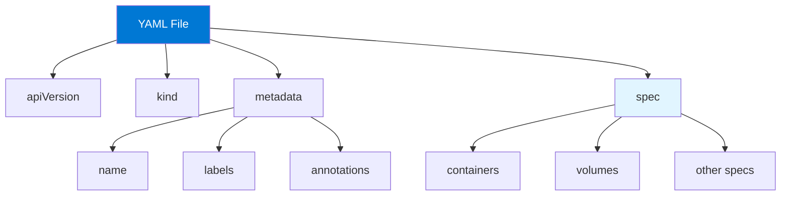

# Module 12: Kubernetes Configuration Management

## Table of Contents
- [12.1 YAML Fundamentals](#121-yaml-fundamentals)
- [12.2 kubectl Commands](#122-kubectl-commands)
- [12.3 Imperative vs. Declarative](#123-imperative-vs-declarative)
- [12.4 Configuration Best Practices](#124-configuration-best-practices)
- [Quick Reference](#quick-reference)
- [Common Pitfalls](#common-pitfalls)
- [Best Practices](#best-practices)
- [Further Reading](#further-reading)

---

## 12.1 YAML Fundamentals

### Understanding YAML

YAML (YAML Ain't Markup Language) is Kubernetes' primary configuration format. YAML is human-readable, supports complex data structures, and is widely used in configuration management. Understanding YAML syntax is essential for working with Kubernetes, as virtually all Kubernetes resources are defined in YAML.

YAML provides: **human readability** (easy to read and write), **hierarchical structure** (nested data), **data types** (strings, numbers, booleans, lists, maps), **comments** (documentation), and **multi-line strings** (complex text). YAML's simplicity makes it ideal for configuration files, though its reliance on indentation can be error-prone if not careful.

Kubernetes YAML files typically contain: **apiVersion** (Kubernetes API version), **kind** (resource type), **metadata** (name, labels, annotations), and **spec** (desired state). Understanding YAML structure helps you create and modify Kubernetes configurations correctly.

#### YAML Structure



### YAML Syntax Basics

YAML syntax rules:

**Indentation**: Uses spaces (not tabs) for indentation. Indentation indicates hierarchy. Consistent indentation is critical.

**Key-Value Pairs**: `key: value` format. Colon followed by space. Values can be strings, numbers, booleans, or complex structures.

**Lists**: Items prefixed with `-`. Can be inline `[item1, item2]` or block format. Lists can contain simple values or complex objects.

**Maps**: Key-value pairs. Can be nested. Represented as indented key-value pairs.

**Strings**: Can be quoted or unquoted. Use quotes for special characters. Multi-line strings use `|` or `>`.

YAML syntax examples:
```yaml
# Key-value pairs
name: my-app
version: "1.0.0"
enabled: true

# Lists
tags:
  - web
  - frontend
  - production

# Inline list
tags: [web, frontend, production]

# Maps
metadata:
  name: my-app
  labels:
    app: myapp
    env: prod

# Multi-line strings
description: |
  This is a multi-line
  string that preserves
  line breaks

# Folded strings
description: >
  This is a folded string
  that converts line breaks
  to spaces
```

### Kubernetes YAML Structure

Kubernetes YAML files follow a consistent structure:

**apiVersion**: Specifies the Kubernetes API version. Different resource types use different API versions. Examples: `v1`, `apps/v1`, `networking.k8s.io/v1`.

**kind**: Specifies the resource type. Examples: `Pod`, `Deployment`, `Service`, `ConfigMap`.

**metadata**: Contains resource metadata. Includes: `name` (required), `namespace` (optional), `labels` (optional), `annotations` (optional).

**spec**: Contains resource specification. Defines desired state. Structure varies by resource type.

**status**: Contains current state (read-only, set by Kubernetes). Not specified in YAML files.

Kubernetes YAML example:
```yaml
apiVersion: v1
kind: Pod
metadata:
  name: my-pod
  namespace: default
  labels:
    app: myapp
    environment: production
  annotations:
    description: "My application pod"
spec:
  containers:
  - name: app
    image: nginx:1.21
    ports:
    - containerPort: 80
```

### YAML Best Practices

YAML best practices for Kubernetes:

**Consistent Indentation**: Use 2 spaces (standard). Don't mix tabs and spaces. Use editor that shows whitespace.

**Meaningful Names**: Use descriptive resource names. Follow naming conventions. Include environment or purpose.

**Labels**: Use labels consistently. Follow label conventions. Enable resource selection.

**Comments**: Add comments for complex configurations. Explain non-obvious decisions. Document purpose.

**Validation**: Validate YAML before applying. Use `kubectl apply --dry-run`. Check syntax errors.

**Organization**: Organize YAML files logically. Group related resources. Use consistent file naming.

---

## 12.2 kubectl Commands

### Essential kubectl Commands

kubectl is the primary tool for interacting with Kubernetes clusters. Understanding kubectl commands is essential for Kubernetes operations.

**get**: Lists resources. Shows current state. Supports filtering and formatting.

**describe**: Shows detailed resource information. Includes events and status. Useful for troubleshooting.

**create**: Creates resources imperatively. Quick for testing. Not recommended for production.

**apply**: Applies declarative configurations. Idempotent. Recommended approach.

**delete**: Deletes resources. Can delete by name or file. Supports cascading deletion.

**logs**: Views container logs. Essential for debugging. Supports following and filtering.

**exec**: Executes commands in containers. Useful for debugging. Enables interactive shells.

**port-forward**: Forwards local ports to Pod ports. Enables local testing. Useful for development.

Essential commands:
```bash
# Get resources
kubectl get pods
kubectl get pods -n production
kubectl get pods -l app=myapp

# Describe resource
kubectl describe pod my-pod

# Create resource
kubectl create deployment my-app --image=nginx

# Apply configuration
kubectl apply -f deployment.yaml

# Delete resource
kubectl delete pod my-pod
kubectl delete -f deployment.yaml

# View logs
kubectl logs my-pod
kubectl logs -f my-pod

# Execute command
kubectl exec -it my-pod -- /bin/bash

# Port forward
kubectl port-forward my-pod 8080:80
```

### Advanced kubectl Commands

Advanced kubectl commands for complex operations:

**patch**: Updates resources partially. Useful for quick changes. Supports JSON and YAML patches.

**edit**: Opens resource in editor. Makes interactive edits. Saves changes automatically.

**scale**: Scales Deployments and ReplicaSets. Quick scaling. Supports replicas specification.

**rollout**: Manages Deployments. History, status, undo. Useful for rollbacks.

**drain**: Safely evicts Pods from node. Prepares node for maintenance. Respects PodDisruptionBudgets.

**taint**: Marks nodes as unschedulable. Prevents Pod scheduling. Useful for dedicated nodes.

Advanced commands:
```bash
# Patch resource
kubectl patch deployment my-app -p '{"spec":{"replicas":3}}'

# Edit resource
kubectl edit deployment my-app

# Scale deployment
kubectl scale deployment my-app --replicas=5

# Rollout management
kubectl rollout status deployment my-app
kubectl rollout history deployment my-app
kubectl rollout undo deployment my-app

# Node management
kubectl drain node-1 --ignore-daemonsets
kubectl taint nodes node-1 dedicated=special:NoSchedule
```

### kubectl Output Formatting

kubectl supports various output formats:

**Default**: Human-readable table format. Good for quick viewing.

**YAML**: YAML format. Useful for saving configurations. Preserves all fields.

**JSON**: JSON format. Machine-readable. Good for scripting.

**Custom Columns**: Define custom columns. Show specific fields. Useful for custom views.

**Wide**: Shows more columns. Includes node assignment. More detailed view.

Output formatting:
```bash
# YAML output
kubectl get pod my-pod -o yaml

# JSON output
kubectl get pod my-pod -o json

# Custom columns
kubectl get pods -o custom-columns=NAME:.metadata.name,STATUS:.status.phase,NODE:.spec.nodeName

# Wide output
kubectl get pods -o wide

# Save to file
kubectl get deployment my-app -o yaml > deployment.yaml
```

---

## 12.3 Imperative vs. Declarative

### Imperative Approach

Imperative approach uses commands to create and modify resources:

**Commands**: `kubectl create`, `kubectl run`, `kubectl expose`. Direct resource creation. Quick and simple.

**Characteristics**: Direct commands, immediate changes, no version control, hard to reproduce, good for learning and testing.

**Use Cases**: Quick testing, one-off resources, learning Kubernetes, troubleshooting.

Imperative examples:
```bash
# Create deployment
kubectl create deployment my-app --image=nginx:1.21 --replicas=3

# Create service
kubectl expose deployment my-app --port=80 --type=LoadBalancer

# Create namespace
kubectl create namespace production

# Run Pod
kubectl run my-pod --image=nginx --restart=Never
```

### Declarative Approach

Declarative approach uses YAML files to define desired state:

**Commands**: `kubectl apply -f file.yaml`. Applies configurations from files. Idempotent operations.

**Characteristics**: YAML files, version controlled, reproducible, auditable, recommended for production.

**Benefits**: Version control, code review, reproducibility, auditability, GitOps workflows.

Declarative example:
```yaml
# deployment.yaml
apiVersion: apps/v1
kind: Deployment
metadata:
  name: my-app
spec:
  replicas: 3
  selector:
    matchLabels:
      app: myapp
  template:
    metadata:
      labels:
        app: myapp
    spec:
      containers:
      - name: app
        image: nginx:1.21
```

Apply declaratively:
```bash
kubectl apply -f deployment.yaml
```

### When to Use Each Approach

Choosing the right approach:

**Use Imperative When**: Learning Kubernetes, quick testing, one-off resources, troubleshooting, interactive exploration.

**Use Declarative When**: Production deployments, version control needed, reproducibility required, team collaboration, GitOps workflows.

**Best Practice**: Use declarative for all production work. Use imperative only for learning and quick tests.

### Declarative Best Practices

Best practices for declarative approach:

1. **Store in Git**: Version control all YAML files
2. **Use Meaningful Names**: Clear, descriptive file names
3. **Organize Files**: Group related resources
4. **Validate Before Apply**: Use `--dry-run` flag
5. **Review Changes**: Code review for all changes
6. **Document Configurations**: Explain complex setups
7. **Use Templates**: Kustomize or Helm for variations
8. **Test Changes**: Test in dev before production
9. **Keep It Simple**: Avoid unnecessary complexity
10. **Follow Conventions**: Use standard patterns

---

## 12.4 Configuration Best Practices

### File Organization

Organizing YAML files effectively:

**Directory Structure**: Organize by resource type, application, or environment. Use consistent structure. Makes files easy to find.

**Naming Conventions**: Use descriptive file names. Include resource type and name. Follow team conventions.

**Single vs. Multiple Files**: Single file for simple apps, multiple files for complex apps. Balance simplicity and organization.

File organization example:
```
k8s/
├── base/
│   ├── deployment.yaml
│   ├── service.yaml
│   └── configmap.yaml
├── overlays/
│   ├── dev/
│   ├── staging/
│   └── prod/
└── README.md
```

### Labels and Annotations

Effective use of labels and annotations:

**Labels**: For selection and organization. Use consistently. Follow label conventions. Enable resource queries.

**Annotations**: For metadata and tooling. Don't use for selection. Store non-identifying information.

**Best Practices**: Use standard labels, document label meanings, use annotations for tooling, keep labels simple.

Labels and annotations example:
```yaml
metadata:
  labels:
    app: myapp
    version: "1.0.0"
    environment: production
    team: platform
  annotations:
    description: "Main application deployment"
    contact: "platform-team@example.com"
    deployment.kubernetes.io/revision: "1"
```

### Configuration Validation

Validating configurations before applying:

**Dry Run**: `kubectl apply --dry-run=client` validates without applying. Catches errors early.

**YAML Validation**: Check YAML syntax. Use YAML validators. Check indentation.

**Schema Validation**: Validate against Kubernetes schemas. Use kubeval or similar tools.

**Best Practices**: Always validate before applying, use CI/CD for validation, fix errors before deployment.

Validation commands:
```bash
# Dry run
kubectl apply -f deployment.yaml --dry-run=client

# Validate YAML syntax
yamllint deployment.yaml

# Validate Kubernetes schema
kubeval deployment.yaml
```

### Configuration Management Tools

Tools for managing Kubernetes configurations:

**Kustomize**: Built into kubectl. Manages configuration variations. Overlays for environments.

**Helm**: Package manager for Kubernetes. Templates and values. Version management.

**Jsonnet**: Configuration language. Generates YAML. Complex configurations.

**cdk8s**: Code-based configuration. TypeScript, Python, Java. Programmatic configuration.

Choose tools based on: complexity, team preferences, requirements, and existing tooling.

---

## Quick Reference

### YAML Basics
- **Indentation**: 2 spaces (not tabs)
- **Key-Value**: `key: value`
- **Lists**: `- item` or `[item1, item2]`
- **Comments**: `# comment`

### kubectl Commands
```bash
kubectl get <resource>
kubectl describe <resource> <name>
kubectl apply -f <file>
kubectl delete -f <file>
kubectl logs <pod>
kubectl exec -it <pod> -- <command>
```

### Best Practices
- Use declarative approach
- Store in version control
- Validate before applying
- Use meaningful names
- Apply labels consistently

---

## Common Pitfalls

### Pitfall 1: YAML Indentation Errors
**Problem**: Incorrect indentation causes parsing errors
**Solution**: Use 2 spaces, editor with YAML support
**Prevention**: Validate YAML before applying

### Pitfall 2: Using Imperative in Production
**Problem**: Changes not tracked, hard to reproduce
**Solution**: Always use declarative YAML files
**Prevention**: Establish team practices

### Pitfall 3: No Validation
**Problem**: Errors discovered after applying
**Solution**: Always use --dry-run
**Prevention**: Integrate validation in CI/CD

---

## Best Practices

1. **Use Declarative YAML**: For all production work
2. **Version Control**: Store all configs in Git
3. **Validate Configurations**: Before applying
4. **Use Meaningful Names**: Clear and descriptive
5. **Apply Labels Consistently**: Enable selection
6. **Organize Files**: Logical structure
7. **Document Configurations**: Explain complex setups
8. **Review Changes**: Code review process
9. **Test Changes**: In dev first
10. **Use Tools**: Kustomize or Helm for complex configs

---

## Further Reading

### Official Documentation
- [Kubernetes YAML](https://kubernetes.io/docs/concepts/overview/working-with-objects/kubernetes-objects/)
- [kubectl Reference](https://kubernetes.io/docs/reference/kubectl/)

### Tools
- [Kustomize](https://kustomize.io/)
- [Helm](https://helm.sh/)

### Related Topics
- Core Concepts (Module 2)
- Workloads (Module 6)
- Best Practices (Module 18)

---

*This module covers Kubernetes configuration management in detail. Understanding YAML, kubectl commands, and configuration approaches helps you maintain consistent, reproducible cluster configurations effectively.*
