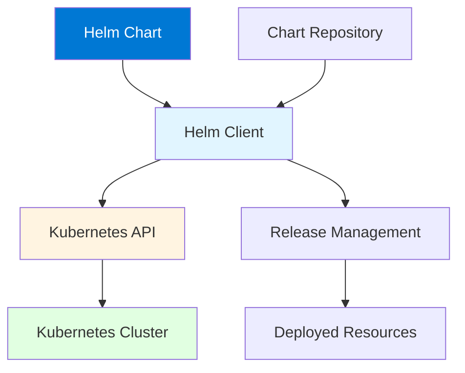

# Module 13: Helm Package Manager

## Table of Contents
- [13.1 Helm Basics](#131-helm-basics)
- [13.2 Helm Charts](#132-helm-charts)
- [13.3 Using Helm](#133-using-helm)
- [Quick Reference](#quick-reference)
- [Common Pitfalls](#common-pitfalls)
- [Best Practices](#best-practices)
- [Further Reading](#further-reading)

---

## 13.1 Helm Basics

### What is Helm?

Helm is the package manager for Kubernetes, often described as "apt/yum/homebrew for Kubernetes." Helm simplifies the deployment and management of Kubernetes applications by packaging them into reusable units called Charts. Helm provides templating, versioning, dependency management, and rollback capabilities that make Kubernetes application management significantly easier.

Helm addresses the complexity of managing Kubernetes applications, which often require multiple YAML files for Deployments, Services, ConfigMaps, Secrets, and other resources. Without Helm, deploying applications requires manually creating and managing these files, making it difficult to deploy the same application across different environments or share applications between teams. Helm packages all these resources together with configuration values, making deployments reproducible and manageable.

Helm provides: **templating** (reusable Kubernetes resource templates with variables), **versioning** (Chart versions for tracking changes), **dependency management** (Charts can depend on other Charts), **rollback** (reverting to previous Chart versions), **repository management** (sharing Charts through repositories), and **release management** (tracking deployed Chart instances). Understanding Helm basics helps you leverage Kubernetes application management effectively.

#### Helm Architecture



### Helm Components

Helm consists of several key components:

**Helm Client**: Command-line tool for working with Charts. Installs Charts, manages releases, interacts with repositories. Runs on your local machine or in CI/CD.

**Charts**: Packages of Kubernetes resources with templating. Contain templates, default values, and metadata. Stored in repositories or locally.

**Releases**: Instances of Charts deployed to clusters. Each release has a unique name. Tracks Chart version and configuration.

**Repositories**: Collections of Charts. Can be public (Artifact Hub) or private. Enable Chart sharing and discovery.

**Tiller** (Helm 2 only): Server-side component that managed releases. Removed in Helm 3, which uses direct API access.

### Installing Helm

Helm installation is straightforward:

**Linux/macOS**: Download binary or use package manager. Add to PATH. Verify installation.

**Windows**: Download binary or use package manager. Add to PATH. Verify installation.

**Verification**: Run `helm version` to verify installation. Should show Helm 3.x (Helm 2 is deprecated).

Installation commands:
```bash
# Linux/macOS - Using script
curl https://raw.githubusercontent.com/helm/helm/main/scripts/get-helm-3 | bash

# macOS - Using Homebrew
brew install helm

# Windows - Using Chocolatey
choco install kubernetes-helm

# Verify installation
helm version

# Check Helm repositories
helm repo list
```

### Helm 2 vs. Helm 3

Understanding Helm versions:

**Helm 2**: Required Tiller (server-side component). More complex security model. Being phased out.

**Helm 3**: No Tiller, direct API access. Simpler and more secure. Current version. Recommended for all new deployments.

**Migration**: Helm 2 Charts work with Helm 3. Migration tools available. Plan migration from Helm 2 to Helm 3.

**Best Practice**: Use Helm 3 for all new deployments. Migrate existing Helm 2 deployments to Helm 3.

---

## 13.2 Helm Charts

### Understanding Charts

Charts are Helm packages containing Kubernetes resource templates. Charts package all resources needed for an application deployment, making it easy to deploy, version, and share applications.

Charts provide: **packaging** (all resources in one package), **templating** (parameterized configurations), **versioning** (Chart versions for tracking), **dependencies** (other Charts as dependencies), **documentation** (README and values descriptions), and **testing** (Chart testing capabilities). Understanding Charts helps you create and use Helm effectively.

### Chart Structure

Charts follow a standard directory structure:

**Chart.yaml**: Chart metadata (name, version, description, dependencies). Required file. Defines Chart identity.

**values.yaml**: Default configuration values. Used for templating. Can be overridden.

**templates/**: Kubernetes resource templates. Go templating language. Rendered to YAML.

**charts/**: Chart dependencies. Downloaded Charts. Managed by Helm.

**templates/_helpers.tpl**: Template helper functions. Reusable template logic. Shared across templates.

Chart structure:
```
mychart/
├── Chart.yaml          # Chart metadata
├── values.yaml         # Default values
├── charts/             # Dependencies (downloaded)
├── templates/          # Kubernetes templates
│   ├── deployment.yaml
│   ├── service.yaml
│   ├── configmap.yaml
│   ├── ingress.yaml
│   └── _helpers.tpl    # Helper functions
└── README.md           # Documentation
```

### Chart.yaml

Chart.yaml defines Chart metadata:

**Required Fields**: `apiVersion` (Chart API version), `name` (Chart name), `version` (Chart version).

**Optional Fields**: `description`, `appVersion` (application version), `home`, `sources`, `maintainers`, `dependencies`, `keywords`, `type`.

**Versioning**: Use semantic versioning (major.minor.patch). Increment appropriately for changes.

Chart.yaml example:
```yaml
apiVersion: v2
name: myapp
description: My application Helm chart
type: application
version: 1.0.0
appVersion: "1.0"
home: https://example.com
sources:
  - https://github.com/example/myapp
maintainers:
  - name: Team Name
    email: team@example.com
keywords:
  - web
  - application
dependencies:
  - name: postgresql
    version: "10.x.x"
    repository: "https://charts.bitnami.com/bitnami"
    condition: postgresql.enabled
```

### values.yaml

values.yaml contains default configuration values:

**Purpose**: Provides default values for templates. Can be overridden during installation. Documents configurable options.

**Structure**: YAML format with nested values. Organized logically. Well-documented.

**Best Practices**: Provide sensible defaults, document all values, organize by category, use descriptive names.

values.yaml example:
```yaml
# Application configuration
replicaCount: 3

image:
  repository: nginx
  pullPolicy: IfNotPresent
  tag: "1.21"

service:
  type: ClusterIP
  port: 80

ingress:
  enabled: false
  className: "nginx"
  annotations: {}
  hosts:
    - host: chart-example.local
      paths:
        - path: /
          pathType: Prefix
  tls: []

resources:
  limits:
    cpu: 500m
    memory: 512Mi
  requests:
    cpu: 250m
    memory: 256Mi

autoscaling:
  enabled: false
  minReplicas: 1
  maxReplicas: 10
  targetCPUUtilizationPercentage: 80
```

### Templates

Templates use Go templating to generate Kubernetes resources:

**Templating Syntax**: `{{ .Values.key }}` for values, `{{ .Release.Name }}` for release info, `{{ .Chart.Name }}` for Chart info.

**Control Structures**: `{{ if }}`, `{{ range }}`, `{{ with }}` for conditional logic.

**Functions**: Helm provides many template functions. String manipulation, math, date/time, etc.

**Best Practices**: Keep templates simple, use helpers for complex logic, validate template output, test templates.

Template example:
```yaml
apiVersion: apps/v1
kind: Deployment
metadata:
  name: {{ include "mychart.fullname" . }}
  labels:
    {{- include "mychart.labels" . | nindent 4 }}
spec:
  replicas: {{ .Values.replicaCount }}
  selector:
    matchLabels:
      {{- include "mychart.selectorLabels" . | nindent 6 }}
  template:
    metadata:
      labels:
        {{- include "mychart.selectorLabels" . | nindent 8 }}
    spec:
      containers:
      - name: {{ .Chart.Name }}
        image: "{{ .Values.image.repository }}:{{ .Values.image.tag }}"
        imagePullPolicy: {{ .Values.image.pullPolicy }}
        ports:
        - containerPort: 80
        resources:
          {{- toYaml .Values.resources | nindent 10 }}
```

### Template Helpers

Helper functions in `_helpers.tpl` provide reusable template logic:

**Purpose**: Avoid template duplication. Centralize common logic. Improve maintainability.

**Common Helpers**: Full name generation, label generation, selector generation, value lookups.

**Usage**: `{{ include "helper.name" . }}` to use helpers in templates.

Helper example:
```yaml
{{/*
Common labels
*/}}
{{- define "mychart.labels" -}}
app.kubernetes.io/name: {{ include "mychart.name" . }}
app.kubernetes.io/instance: {{ .Release.Name }}
app.kubernetes.io/version: {{ .Chart.AppVersion | quote }}
app.kubernetes.io/managed-by: {{ .Release.Service }}
{{- end -}}

{{/*
Selector labels
*/}}
{{- define "mychart.selectorLabels" -}}
app.kubernetes.io/name: {{ include "mychart.name" . }}
app.kubernetes.io/instance: {{ .Release.Name }}
{{- end -}}

{{/*
Full name
*/}}
{{- define "mychart.fullname" -}}
{{- printf "%s-%s" .Release.Name .Chart.Name | trunc 63 | trimSuffix "-" }}
{{- end -}}
```

---

## 13.3 Using Helm

### Essential Helm Commands

Essential Helm commands for daily operations:

**helm install**: Installs a Chart as a release. Creates Kubernetes resources. Tracks release.

**helm upgrade**: Upgrades an existing release. Updates to new Chart version or values. Maintains release history.

**helm uninstall**: Uninstalls a release. Removes all resources created by Chart. Can be undone with rollback (if history kept).

**helm list**: Lists installed releases. Shows release names, namespaces, revisions, status.

**helm status**: Shows release status. Displays resources, values, notes.

**helm rollback**: Rolls back to previous release version. Reverts changes. Useful for quick recovery.

Essential commands:
```bash
# Install Chart
helm install my-release bitnami/nginx

# Install with values file
helm install my-release ./mychart -f values.yaml

# Upgrade release
helm upgrade my-release bitnami/nginx

# Upgrade with values
helm upgrade my-release ./mychart -f values.yaml

# List releases
helm list
helm list -A  # All namespaces

# Show release status
helm status my-release

# Uninstall release
helm uninstall my-release

# Rollback release
helm rollback my-release 1  # Rollback to revision 1
```

### Repository Management

Helm repositories store and share Charts:

**Adding Repositories**: `helm repo add` adds repository. Makes Charts available for installation.

**Updating Repositories**: `helm repo update` updates repository index. Fetches latest Chart versions.

**Listing Repositories**: `helm repo list` shows configured repositories.

**Removing Repositories**: `helm repo remove` removes repository. Doesn't affect installed releases.

Repository commands:
```bash
# Add repository
helm repo add bitnami https://charts.bitnami.com/bitnami
helm repo add stable https://charts.helm.sh/stable

# Update repositories
helm repo update

# List repositories
helm repo list

# Remove repository
helm repo remove bitnami

# Search Charts
helm search repo nginx
helm search repo bitnami/nginx

# Show Chart information
helm show chart bitnami/nginx
helm show values bitnami/nginx
```

### Installing Charts

Installing Charts creates releases:

**From Repository**: Install from public or private repository. Specify Chart name and repository.

**From Local Directory**: Install from local Chart directory. Useful for development.

**With Values**: Override default values. Use `-f` for values file, `--set` for individual values.

**Dry Run**: Use `--dry-run` to test installation without applying. Validates Chart and shows what would be created.

Installation examples:
```bash
# Install from repository
helm install my-nginx bitnami/nginx

# Install with namespace
helm install my-nginx bitnami/nginx -n production

# Install with values file
helm install my-nginx bitnami/nginx -f custom-values.yaml

# Install with set values
helm install my-nginx bitnami/nginx \
  --set service.type=LoadBalancer \
  --set replicaCount=3

# Install from local Chart
helm install my-app ./mychart

# Dry run (test without installing)
helm install my-nginx bitnami/nginx --dry-run --debug
```

### Upgrading Releases

Upgrading releases updates deployed Charts:

**Chart Upgrade**: Upgrade to new Chart version. Brings new features and fixes.

**Values Upgrade**: Upgrade with new values. Changes configuration without changing Chart version.

**Rollback Capability**: Helm keeps release history. Can rollback if upgrade fails.

**Best Practices**: Test upgrades in dev first, review changes, backup before upgrades, monitor after upgrades.

Upgrade examples:
```bash
# Upgrade to new Chart version
helm upgrade my-nginx bitnami/nginx

# Upgrade with new values
helm upgrade my-nginx bitnami/nginx -f new-values.yaml

# Upgrade with set values
helm upgrade my-nginx bitnami/nginx \
  --set replicaCount=5

# Check upgrade history
helm history my-nginx

# Rollback if needed
helm rollback my-nginx
```

### Release Management

Managing Helm releases:

**Release Names**: Each release has unique name. Choose meaningful names. Follow naming conventions.

**Release History**: Helm tracks release history. Shows all revisions. Enables rollback.

**Release Status**: Check release status regularly. Monitor for issues. Verify deployments.

**Release Cleanup**: Clean up old releases. Remove unused releases. Manage release history.

Release management:
```bash
# List releases
helm list
helm list -A  # All namespaces
helm list -n production  # Specific namespace

# Show release details
helm status my-nginx
helm get manifest my-nginx  # Show rendered templates
helm get values my-nginx  # Show values used

# Show release history
helm history my-nginx

# Rollback release
helm rollback my-nginx 1  # To revision 1
helm rollback my-nginx  # To previous revision

# Uninstall release
helm uninstall my-nginx
helm uninstall my-nginx --keep-history  # Keep history
```

---

## Quick Reference

### Essential Commands
```bash
# Install
helm install <release> <chart>

# Upgrade
helm upgrade <release> <chart>

# List
helm list

# Uninstall
helm uninstall <release>

# Rollback
helm rollback <release>
```

### Chart Structure
- `Chart.yaml` - Metadata
- `values.yaml` - Default values
- `templates/` - Kubernetes templates
- `charts/` - Dependencies

---

## Common Pitfalls

### Pitfall 1: Not Versioning Charts
**Problem**: Cannot track changes, hard to rollback
**Solution**: Use semantic versioning for Charts
**Prevention**: Increment version with each change

### Pitfall 2: Hard-Coding Values
**Problem**: Cannot customize deployments
**Solution**: Use values.yaml for all configurable values
**Prevention**: Template all variable values

### Pitfall 3: No Testing
**Problem**: Broken Charts deployed to production
**Solution**: Test Charts before deployment
**Prevention**: Use helm test and dry-run

---

## Best Practices

1. **Version Charts**: Use semantic versioning
2. **Use Values**: Template all configurable values
3. **Test Charts**: Validate before deployment
4. **Document Values**: Explain all values
5. **Use Helpers**: Avoid template duplication
6. **Review Changes**: Code review for Chart changes
7. **Monitor Releases**: Track release status
8. **Keep History**: Enable release history
9. **Organize Charts**: Logical Chart structure
10. **Share Charts**: Use repositories for sharing

---

## Further Reading

### Official Documentation
- [Helm Documentation](https://helm.sh/docs/)
- [Chart Best Practices](https://helm.sh/docs/chart_best_practices/)

### Related Topics
- Kubernetes Workloads (Module 6)
- Configuration Management (Module 12)
- CI/CD Integration (Module 15)

---

*This module covers Helm package manager in detail. Understanding Helm helps you simplify Kubernetes application deployment, versioning, and management through reusable Charts and templating capabilities.*
