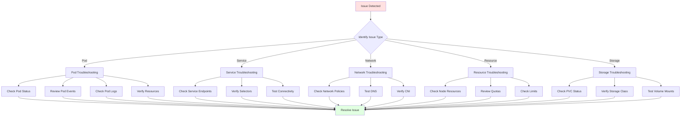

# Module 17: Kubernetes Troubleshooting

## Table of Contents
- [17.1 Common Issues](#171-common-issues)
- [17.2 Debugging Techniques](#172-debugging-techniques)
- [17.3 Performance Tuning](#173-performance-tuning)
- [Quick Reference](#quick-reference)
- [Common Pitfalls](#common-pitfalls)
- [Best Practices](#best-practices)
- [Further Reading](#further-reading)

---

## 17.1 Common Issues

### Understanding Kubernetes Troubleshooting

Kubernetes troubleshooting is a critical skill for maintaining healthy clusters and resolving issues quickly. Kubernetes's complexity, with multiple components working together, means that problems can manifest in various ways and have multiple potential causes. Effective troubleshooting requires systematic approaches, knowledge of Kubernetes internals, and familiarity with debugging tools.

Common issue categories include: **Pod issues** (not starting, crashing, not ready), **Service issues** (not accessible, wrong endpoints), **Network issues** (connectivity problems, DNS failures), **Resource issues** (scheduling failures, evictions), **Storage issues** (mount failures, volume problems), **Authentication/Authorization issues** (RBAC, service accounts), and **Cluster issues** (API server, etcd, node problems). Understanding these categories helps you systematically diagnose problems.

Effective troubleshooting involves: **systematic diagnosis** (checking components in order), **log analysis** (reviewing logs from multiple sources), **resource inspection** (examining resource states), **event analysis** (understanding what happened), **network debugging** (testing connectivity), and **performance analysis** (identifying bottlenecks). Developing troubleshooting skills helps you maintain reliable Kubernetes clusters.

#### Troubleshooting Workflow



### Pod Not Starting

Pod startup failures are among the most common Kubernetes issues. Pods can fail to start for various reasons, and identifying the root cause requires systematic investigation.

**Symptoms**: Pod stuck in `Pending` state, `ImagePullBackOff`, `CrashLoopBackOff`, `ErrImagePull`, `CreateContainerConfigError`, or `Init:Error`. Each state indicates a different type of problem.

**Common Causes**:
- **Insufficient Resources**: Cluster doesn't have enough CPU, memory, or storage
- **Image Pull Errors**: Cannot pull container image (wrong name, authentication, registry unavailable)
- **Application Crashes**: Container starts but immediately crashes
- **Configuration Errors**: Incorrect Pod specification, missing ConfigMaps/Secrets
- **Node Issues**: Node problems preventing Pod scheduling
- **Volume Mount Failures**: Storage volumes cannot be mounted

**Troubleshooting Steps**:
1. **Check Pod Status**: `kubectl get pods` shows current state
2. **Describe Pod**: `kubectl describe pod <pod-name>` provides detailed information
3. **Review Events**: `kubectl get events` shows what happened
4. **Check Logs**: `kubectl logs <pod-name>` shows container output
5. **Verify Resources**: Check if cluster has available resources
6. **Check Image**: Verify image name and accessibility
7. **Review Configuration**: Check Pod spec for errors

Troubleshooting commands:
```bash
# Check Pod status
kubectl get pods
kubectl get pods -o wide  # Shows node assignment

# Detailed Pod information
kubectl describe pod <pod-name>

# Check Pod events
kubectl get events --field-selector involvedObject.name=<pod-name> --sort-by='.lastTimestamp'

# View Pod logs
kubectl logs <pod-name>
kubectl logs <pod-name> --previous  # Previous container instance

# Check resource availability
kubectl top nodes
kubectl describe nodes

# Check image pull secrets
kubectl get secrets
kubectl describe pod <pod-name> | grep -i image
```

**Common Solutions**:
- **Pending State**: Add more nodes, increase resource quotas, check node selectors/affinity
- **ImagePullBackOff**: Fix image name, configure image pull secrets, check registry access
- **CrashLoopBackOff**: Fix application code, check startup commands, review logs
- **CreateContainerConfigError**: Fix ConfigMap/Secret references, verify volumes

### Service Not Accessible

Service connectivity issues prevent applications from communicating, breaking application functionality.

**Symptoms**: Cannot connect to Service, timeouts, connection refused, wrong endpoints, DNS resolution failures.

**Common Causes**:
- **Selector Mismatch**: Service selector doesn't match Pod labels
- **No Endpoints**: No Pods match Service selector
- **Network Policies**: Network policies blocking traffic
- **Port Mismatch**: Service port doesn't match container port
- **DNS Issues**: CoreDNS not working, wrong service name
- **Node Issues**: Network problems on nodes

**Troubleshooting Steps**:
1. **Check Service**: `kubectl get svc` shows Service status
2. **Check Endpoints**: `kubectl get endpoints` shows Pod IPs
3. **Verify Selectors**: Ensure Service selector matches Pod labels
4. **Test Connectivity**: Use `kubectl exec` to test from Pod
5. **Check Network Policies**: Review policies that might block traffic
6. **Test DNS**: Verify DNS resolution works
7. **Review Service Type**: Check if Service type is appropriate

Troubleshooting commands:
```bash
# Check Service
kubectl get svc <service-name>
kubectl describe svc <service-name>

# Check Endpoints
kubectl get endpoints <service-name>
kubectl get endpoints <service-name> -o yaml

# Verify Pod labels match Service selector
kubectl get pods --show-labels
kubectl get svc <service-name> -o jsonpath='{.spec.selector}'

# Test connectivity from Pod
kubectl run test --image=busybox -it --rm -- wget -O- <service-name>:<port>

# Check Network Policies
kubectl get networkpolicies
kubectl describe networkpolicy <policy-name>

# Test DNS
kubectl run test --image=busybox -it --rm -- nslookup <service-name>

# Check CoreDNS
kubectl get pods -n kube-system -l k8s-app=kube-dns
kubectl logs -n kube-system -l k8s-app=kube-dns
```

**Common Solutions**:
- **No Endpoints**: Fix Pod labels to match Service selector, ensure Pods are running
- **Selector Mismatch**: Update Service selector or Pod labels
- **Network Policy Blocking**: Update or remove Network Policies
- **DNS Issues**: Check CoreDNS, verify service names
- **Port Issues**: Verify Service and container ports match

### Image Pull Errors

Image pull errors prevent containers from starting, blocking application deployment.

**Symptoms**: `ImagePullBackOff`, `ErrImagePull`, `ImagePullError`, Pod stuck in `Pending`.

**Common Causes**:
- **Wrong Image Name**: Image name or tag incorrect
- **Authentication Failure**: Cannot authenticate with registry
- **Registry Unavailable**: Registry down or unreachable
- **Network Issues**: Cannot reach registry
- **Image Doesn't Exist**: Image not found in registry
- **Pull Policy**: Image pull policy preventing pull

**Troubleshooting Steps**:
1. **Check Error Message**: `kubectl describe pod` shows specific error
2. **Verify Image Name**: Check image name and tag are correct
3. **Test Image Pull**: Try pulling image manually
4. **Check Image Pull Secrets**: Verify secrets are configured
5. **Test Registry Access**: Verify network connectivity to registry
6. **Check Pull Policy**: Review image pull policy settings

Troubleshooting commands:
```bash
# Check Pod for image pull errors
kubectl describe pod <pod-name> | grep -i image

# Check image pull secrets
kubectl get secrets
kubectl describe pod <pod-name> | grep -i secret

# Test image pull manually
docker pull <image-name>
# Or on node
crictl pull <image-name>

# Check image pull secrets in Pod spec
kubectl get pod <pod-name> -o yaml | grep -A 5 imagePullSecrets

# Verify registry access
kubectl run test --image=busybox -it --rm -- wget -O- <registry-url>
```

**Common Solutions**:
- **Authentication**: Create and configure image pull secrets
- **Wrong Image**: Fix image name or tag
- **Registry Access**: Fix network connectivity, check firewall rules
- **Pull Policy**: Set appropriate image pull policy (Always, IfNotPresent, Never)

### Resource Constraints

Resource constraints prevent Pods from being scheduled or cause Pods to be evicted.

**Symptoms**: Pods stuck in `Pending`, `FailedScheduling` events, Pod evictions, `OutOfMemory` errors.

**Common Causes**:
- **Insufficient CPU**: Not enough CPU available in cluster
- **Insufficient Memory**: Not enough memory available
- **Storage Issues**: Not enough disk space
- **Node Capacity**: Nodes at capacity
- **Quota Limits**: Resource quotas limiting resources
- **Requests Too High**: Pod requests exceed available resources

**Troubleshooting Steps**:
1. **Check Node Resources**: `kubectl top nodes` shows resource usage
2. **Check Pod Resources**: `kubectl top pods` shows Pod resource usage
3. **Review Scheduling Events**: `kubectl describe pod` shows why Pod wasn't scheduled
4. **Check Quotas**: Review resource quotas in namespace
5. **Review Requests/Limits**: Check if Pod requests are reasonable
6. **Check Node Capacity**: Verify nodes have available resources

Troubleshooting commands:
```bash
# Check node resources
kubectl top nodes
kubectl describe nodes

# Check Pod resources
kubectl top pods
kubectl top pods --all-namespaces

# Check why Pod wasn't scheduled
kubectl describe pod <pod-name> | grep -A 10 Events

# Check resource quotas
kubectl get resourcequota
kubectl describe resourcequota <quota-name>

# Check Pod requests and limits
kubectl get pod <pod-name> -o yaml | grep -A 10 resources

# Check node capacity
kubectl describe node <node-name> | grep -A 5 "Allocated resources"
```

**Common Solutions**:
- **Add Nodes**: Scale cluster to add capacity
- **Adjust Requests**: Reduce Pod resource requests
- **Increase Quotas**: Raise resource quota limits
- **Clean Up**: Remove unused Pods and resources
- **Optimize Resources**: Right-size Pod resource requests/limits

### Network Issues

Network problems prevent Pods from communicating, breaking application functionality.

**Symptoms**: Pods cannot reach each other, DNS failures, timeouts, connection refused.

**Common Causes**:
- **CNI Plugin Issues**: Container network interface plugin problems
- **Network Policies**: Policies blocking traffic
- **DNS Problems**: CoreDNS not working
- **Service Issues**: Service configuration problems
- **Node Network**: Network problems on nodes
- **Firewall Rules**: Firewall blocking traffic

**Troubleshooting Steps**:
1. **Test Connectivity**: Use `kubectl exec` to test from Pod
2. **Check Network Policies**: Review policies that might block traffic
3. **Test DNS**: Verify DNS resolution works
4. **Check CNI**: Verify CNI plugin is running
5. **Review Service**: Check Service configuration
6. **Check Node Network**: Verify node network connectivity

Troubleshooting commands:
```bash
# Test connectivity between Pods
kubectl run test1 --image=busybox -it --rm -- wget -O- <pod-ip>:<port>
kubectl run test2 --image=busybox -it --rm -- ping <pod-ip>

# Check Network Policies
kubectl get networkpolicies --all-namespaces
kubectl describe networkpolicy <policy-name>

# Test DNS
kubectl run test --image=busybox -it --rm -- nslookup <service-name>
kubectl run test --image=busybox -it --rm -- nslookup kubernetes.default

# Check CoreDNS
kubectl get pods -n kube-system -l k8s-app=kube-dns
kubectl logs -n kube-system -l k8s-app=kube-dns

# Check CNI plugin
kubectl get pods -n kube-system | grep -i cni
kubectl logs -n kube-system <cni-pod>

# Check Service endpoints
kubectl get endpoints <service-name>
```

**Common Solutions**:
- **CNI Issues**: Restart CNI pods, check CNI configuration
- **Network Policies**: Update or remove blocking policies
- **DNS Issues**: Restart CoreDNS, check DNS configuration
- **Service Issues**: Fix Service selectors or configuration
- **Network Configuration**: Fix node network settings

---

## 17.2 Debugging Techniques

### kubectl describe

`kubectl describe` provides detailed information about resources, including events and current state.

**Usage**: `kubectl describe <resource-type> <resource-name>` shows comprehensive resource information including: resource specification, current status, events, conditions, and related resources.

**Key Information**: Events show what happened, conditions show resource state, status shows current state, and related resources show dependencies.

Describe examples:
```bash
# Describe Pod (most common)
kubectl describe pod <pod-name>

# Describe Service
kubectl describe svc <service-name>

# Describe Node
kubectl describe node <node-name>

# Describe Deployment
kubectl describe deployment <deployment-name>

# Describe with namespace
kubectl describe pod <pod-name> -n <namespace>

# Describe all Pods
kubectl describe pods
```

### kubectl logs

`kubectl logs` views container logs, essential for understanding application behavior.

**Usage**: `kubectl logs <pod-name>` shows container stdout/stderr. Supports multiple options for filtering and formatting.

**Key Options**: `--previous` for crashed containers, `-c` for specific container, `-f` for following logs, `--tail` for last N lines, `--since` for time-based filtering.

Log commands:
```bash
# Current logs
kubectl logs <pod-name>

# Previous container instance (after crash)
kubectl logs <pod-name> --previous

# Specific container in multi-container Pod
kubectl logs <pod-name> -c <container-name>

# Follow logs (like tail -f)
kubectl logs -f <pod-name>

# Last N lines
kubectl logs --tail=100 <pod-name>

# Logs since specific time
kubectl logs --since=1h <pod-name>
kubectl logs --since=2024-01-01T00:00:00Z <pod-name>

# Logs from all Pods with label
kubectl logs -l app=myapp

# Logs with timestamps
kubectl logs --timestamps <pod-name>

# Logs from specific container in init container Pod
kubectl logs <pod-name> -c <init-container-name>
```

### kubectl exec

`kubectl exec` executes commands in running containers, enabling interactive debugging.

**Usage**: `kubectl exec <pod-name> -- <command>` executes command in container. `-it` flags enable interactive terminal.

**Use Cases**: Debugging application issues, testing connectivity, inspecting file system, checking environment variables, testing commands.

Exec examples:
```bash
# Interactive shell
kubectl exec -it <pod-name> -- /bin/bash
kubectl exec -it <pod-name> -- /bin/sh

# Single command
kubectl exec <pod-name> -- ls -la
kubectl exec <pod-name> -- env
kubectl exec <pod-name> -- ps aux

# Specific container
kubectl exec <pod-name> -c <container-name> -- /bin/bash

# Execute in init container
kubectl exec <pod-name> -c <init-container-name> -- <command>

# Test connectivity
kubectl exec <pod-name> -- wget -O- <service>:<port>
kubectl exec <pod-name> -- curl <service>:<port>
kubectl exec <pod-name> -- ping <host>
```

### Events

Kubernetes events provide a timeline of what happened in the cluster.

**Usage**: `kubectl get events` shows cluster events. Events include: resource creation, scheduling decisions, image pulls, container starts, errors, and warnings.

**Key Information**: Event type (Normal, Warning), reason (what happened), message (details), involved object (which resource), timestamp (when it happened).

Event commands:
```bash
# All events
kubectl get events --all-namespaces

# Events sorted by time
kubectl get events --sort-by='.lastTimestamp'

# Events in namespace
kubectl get events -n <namespace>

# Events for specific resource
kubectl get events --field-selector involvedObject.name=<pod-name>

# Recent events
kubectl get events --sort-by='.lastTimestamp' | tail -20

# Watch events
kubectl get events --watch

# Events with specific type
kubectl get events --field-selector type=Warning
```

### Debugging Tools

Additional tools for Kubernetes debugging:

**Debug Containers**: Run temporary containers for testing and debugging. Useful for network testing, DNS testing, and connectivity checks.

**Port Forwarding**: Forward local ports to Pod ports for local testing. Enables testing services without exposing them publicly.

**kubectl proxy**: Proxy to Kubernetes API server. Enables API access and testing.

**Copy Files**: Copy files to/from Pods for debugging and configuration.

Debugging tools:
```bash
# Run debug container
kubectl run debug --image=busybox -it --rm -- sh
kubectl run debug --image=nicolaka/netshoot -it --rm -- bash

# Port forwarding
kubectl port-forward <pod-name> 8080:80
kubectl port-forward svc/<service-name> 8080:80

# API proxy
kubectl proxy
# Then access API at http://localhost:8001

# Copy files
kubectl cp <pod-name>:/path/to/file ./local-file
kubectl cp ./local-file <pod-name>:/path/to/file

# Debug Pod (Kubernetes 1.23+)
kubectl debug <pod-name> -it --image=busybox
```

---

## 17.3 Performance Tuning

### Resource Optimization

Optimizing resource usage improves cluster efficiency and prevents issues.

**Requests and Limits**: Set appropriate CPU and memory requests/limits. Requests reserve resources, limits prevent overuse. Right-sizing improves scheduling and prevents evictions.

**Horizontal Pod Autoscaling**: Use HPA to automatically scale Pods based on metrics. Ensures adequate capacity without over-provisioning.

**Vertical Pod Autoscaling**: Use VPA to automatically adjust resource requests/limits. Learns from actual usage patterns.

**Resource Monitoring**: Monitor resource usage to identify optimization opportunities. Use `kubectl top`, Prometheus, or cloud provider tools.

Resource optimization:
```bash
# Check resource usage
kubectl top nodes
kubectl top pods
kubectl top pods --all-namespaces

# Check resource requests/limits
kubectl describe pod <pod-name> | grep -A 10 resources

# Set appropriate requests/limits
# In Pod spec:
resources:
  requests:
    cpu: "100m"
    memory: "128Mi"
  limits:
    cpu: "500m"
    memory: "512Mi"
```

### Scheduling Optimization

Optimizing scheduling improves Pod placement and cluster utilization.

**Node Affinity**: Use node affinity to place Pods on specific nodes. Useful for hardware requirements, zones, or node types.

**Pod Affinity/Anti-Affinity**: Use affinity to co-locate or separate Pods. Improves performance or availability.

**Taints and Tolerations**: Use taints to dedicate nodes for specific workloads. Prevents unwanted Pods from scheduling.

**Priority Classes**: Use priority classes to prioritize important Pods. Ensures critical Pods schedule first.

Scheduling optimization:
```yaml
# Node affinity example
spec:
  affinity:
    nodeAffinity:
      requiredDuringSchedulingIgnoredDuringExecution:
        nodeSelectorTerms:
        - matchExpressions:
          - key: node-type
            operator: In
            values:
            - compute-optimized

# Pod anti-affinity example
spec:
  affinity:
    podAntiAffinity:
      preferredDuringSchedulingIgnoredDuringExecution:
      - weight: 100
        podAffinityTerm:
          labelSelector:
            matchExpressions:
            - key: app
              operator: In
              values:
              - myapp
          topologyKey: kubernetes.io/hostname
```

### Network Optimization

Optimizing network improves application performance and reduces latency.

**Service Types**: Choose appropriate Service type (ClusterIP, NodePort, LoadBalancer). ClusterIP is most efficient for internal traffic.

**Headless Services**: Use headless Services when you need direct Pod access. Bypasses Service proxy for better performance.

**Network Policies**: Implement Network Policies for security without blocking necessary traffic. Balance security and performance.

**CNI Selection**: Choose CNI plugin based on performance requirements. Some CNIs are faster than others.

Network optimization:
```yaml
# Headless Service for direct Pod access
apiVersion: v1
kind: Service
metadata:
  name: myapp
spec:
  clusterIP: None  # Headless
  selector:
    app: myapp
  ports:
  - port: 80
```

### Storage Optimization

Optimizing storage improves performance and reduces costs.

**Storage Classes**: Choose appropriate storage class based on performance needs. SSD for high performance, HDD for cost savings.

**Access Modes**: Use correct access mode (RWO, ROX, RWX). RWO is most performant.

**Volume Expansion**: Enable volume expansion for growing storage needs. Avoids recreating volumes.

**Storage Monitoring**: Monitor storage usage to prevent issues. Set up alerts for high usage.

Storage optimization:
```yaml
# High-performance storage class
apiVersion: storage.k8s.io/v1
kind: StorageClass
metadata:
  name: fast-ssd
provisioner: kubernetes.io/aws-ebs
parameters:
  type: gp3
  iops: "3000"
  throughput: "125"
volumeBindingMode: WaitForFirstConsumer
```

### Performance Monitoring

Monitoring performance helps identify bottlenecks and optimization opportunities.

**Tools**: Prometheus (metrics), Grafana (visualization), kubectl top (resource usage), Kubernetes Dashboard (overview).

**Key Metrics**: CPU usage, memory usage, network throughput, storage I/O, Pod startup time, request latency.

**Alerts**: Set up alerts for performance issues. Monitor resource usage, slow operations, and errors.

Performance monitoring:
```bash
# Resource usage
kubectl top nodes
kubectl top pods

# Prometheus queries
# CPU usage
rate(container_cpu_usage_seconds_total[5m])

# Memory usage
container_memory_working_set_bytes

# Network throughput
rate(container_network_receive_bytes_total[5m])
```

---

## Quick Reference

### Common Commands
```bash
# Pod troubleshooting
kubectl describe pod <pod-name>
kubectl logs <pod-name>
kubectl exec -it <pod-name> -- /bin/bash

# Service troubleshooting
kubectl get svc
kubectl get endpoints
kubectl describe svc <service-name>

# Resource checking
kubectl top nodes
kubectl top pods
kubectl describe nodes

# Events
kubectl get events --sort-by='.lastTimestamp'
```

### Common Issues
- **Pod Pending**: Check resources, node selectors, taints
- **ImagePullBackOff**: Fix image name, check pull secrets
- **CrashLoopBackOff**: Check logs, fix application
- **Service Not Working**: Check endpoints, selectors, Network Policies
- **DNS Issues**: Check CoreDNS, test resolution

---

## Common Pitfalls

### Pitfall 1: Not Checking Events
**Problem**: Missing important information about what happened
**Solution**: Always check events with `kubectl get events`
**Prevention**: Make events part of troubleshooting routine

### Pitfall 2: Ignoring Resource Limits
**Problem**: Pods evicted or not scheduled due to resource constraints
**Solution**: Set appropriate resource requests and limits
**Prevention**: Review resource usage regularly

### Pitfall 3: Not Testing Network Policies
**Problem**: Network Policies blocking legitimate traffic
**Solution**: Test policies thoroughly, use allow-by-default
**Prevention**: Document and test all Network Policies

### Pitfall 4: Skipping Logs
**Problem**: Missing application errors and warnings
**Solution**: Always check logs when troubleshooting
**Prevention**: Set up log aggregation and monitoring

---

## Best Practices

1. **Check Events First**: Events show what happened
2. **Review Logs**: Application logs contain error details
3. **Use describe**: Provides comprehensive resource information
4. **Test Connectivity**: Verify network from Pod perspective
5. **Monitor Resources**: Track resource usage proactively
6. **Document Solutions**: Share troubleshooting knowledge
7. **Use Debug Tools**: Leverage debugging containers and tools
8. **Systematic Approach**: Follow troubleshooting workflow
9. **Check Dependencies**: Verify all dependencies are working
10. **Regular Monitoring**: Prevent issues before they occur

---

## Further Reading

### Official Documentation
- [Kubernetes Troubleshooting](https://kubernetes.io/docs/tasks/debug/)
- [Debugging Applications](https://kubernetes.io/docs/tasks/debug/debug-application/)

### Tools
- [kubectl Cheat Sheet](https://kubernetes.io/docs/reference/kubectl/cheatsheet/)
- [kubectl Debug](https://kubernetes.io/docs/tasks/debug/debug-application/debug-running-pod/)

### Related Topics
- Monitoring and Logging (Module 9)
- Resource Management (Module 10)
- Security Best Practices (Module 18)

---

*This module covers Kubernetes troubleshooting in detail. Understanding troubleshooting techniques helps you maintain healthy Kubernetes clusters and resolve issues quickly and efficiently.*
