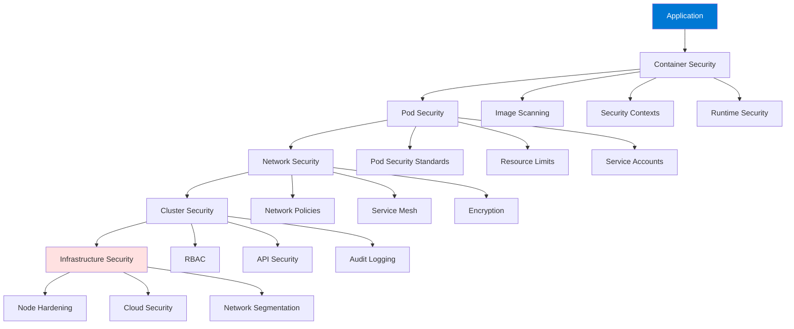
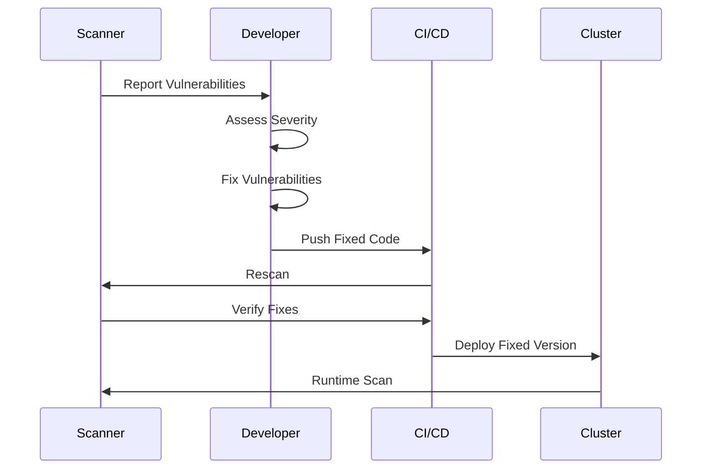

# Module 18: Kubernetes Security Best Practices

## Table of Contents
- [18.1 Security Fundamentals](#181-security-fundamentals)
- [18.2 Pod Security](#182-pod-security)
- [18.3 Cluster Security](#183-cluster-security)
- [Quick Reference](#quick-reference)
- [Common Pitfalls](#common-pitfalls)
- [Best Practices](#best-practices)
- [Further Reading](#further-reading)

---

## 18.1 Security Fundamentals

### Understanding Kubernetes Security

Kubernetes security is critical for protecting clusters, applications, and data from threats. Kubernetes's complexity and the dynamic nature of containerized applications create multiple attack surfaces that must be secured. Effective security requires a defense-in-depth approach with multiple security layers working together.

Kubernetes security encompasses: **infrastructure security** (cloud security, network security, node hardening), **cluster security** (API server security, etcd encryption, RBAC), **container security** (image scanning, security contexts, runtime security), **application security** (code security, dependency management, secrets), **network security** (Network Policies, service mesh, encryption), and **compliance** (regulatory requirements, audit logging). Understanding security fundamentals helps you build secure Kubernetes deployments.

Security threats in Kubernetes include: **unauthorized access** (compromised credentials, weak authentication), **container escapes** (breaking out of containers), **network attacks** (man-in-the-middle, denial of service), **data breaches** (exposed secrets, unencrypted data), **malicious images** (vulnerable or malicious container images), and **misconfiguration** (insecure defaults, overly permissive settings). Understanding threats helps you implement appropriate defenses.

#### Defense in Depth Architecture



### Defense in Depth

Defense in depth uses multiple security layers so that if one layer fails, others provide protection. This approach is essential for Kubernetes because of its complexity and the dynamic nature of containerized applications.

**Security Layers**:
1. **Infrastructure Security**: Cloud security groups, network firewalls, node hardening, OS security
2. **Cluster Security**: API server authentication/authorization, etcd encryption, RBAC, admission controllers
3. **Container Security**: Image scanning, security contexts, runtime security, minimal base images
4. **Application Security**: Secure coding practices, dependency management, input validation
5. **Network Security**: Network Policies, service mesh with mTLS, encryption in transit
6. **Monitoring and Detection**: Security monitoring, anomaly detection, audit logging

Each layer provides protection, and together they create comprehensive security. Understanding defense in depth helps you implement effective security strategies.

### Least Privilege

Least privilege means granting minimum necessary permissions. This principle applies to all Kubernetes security aspects.

**RBAC**: Use specific Roles with minimum permissions, not cluster-admin. Grant permissions only for required resources and operations. Regularly review and audit permissions.

**Service Accounts**: Use dedicated service accounts per application. Don't use default service account. Grant only necessary permissions to service accounts.

**Pod Security**: Run containers as non-root users. Drop unnecessary Linux capabilities. Use read-only root filesystem when possible. Restrict volume types.

**Network Policies**: Implement default deny policies. Allow only necessary traffic. Restrict both ingress and egress.

**Resource Access**: Limit access to ConfigMaps, Secrets, and other resources. Use RBAC to restrict who can read/write resources.

Least privilege example:
```yaml
# Service account with minimal permissions
apiVersion: v1
kind: ServiceAccount
metadata:
  name: myapp
---
apiVersion: rbac.authorization.k8s.io/v1
kind: Role
metadata:
  name: myapp-role
rules:
- apiGroups: [""]
  resources: ["configmaps"]
  verbs: ["get", "list"]
  resourceNames: ["myapp-config"]  # Only specific ConfigMap
---
apiVersion: rbac.authorization.k8s.io/v1
kind: RoleBinding
metadata:
  name: myapp-binding
subjects:
- kind: ServiceAccount
  name: myapp
roleRef:
  kind: Role
  name: myapp-role
  apiGroup: rbac.authorization.k8s.io
```

### Security Scanning

Regular security scanning identifies vulnerabilities before they're exploited.

**Image Scanning**: Scan container images for known vulnerabilities. Use tools like Trivy, Clair, or cloud provider scanning. Scan images before deployment and regularly after deployment.

**Dependency Scanning**: Check application dependencies for vulnerabilities. Use tools like Snyk, OWASP Dependency-Check. Integrate into CI/CD pipelines.

**Configuration Scanning**: Validate Kubernetes configurations for security issues. Use tools like kubeval, conftest, Polaris. Check for insecure settings, missing security contexts, overly permissive policies.

**Runtime Scanning**: Monitor running containers for security issues. Detect anomalous behavior, unauthorized processes, and security violations.

Security scanning example:
```bash
# Image scanning with Trivy
trivy image nginx:latest

# Configuration scanning with Polaris
polaris audit --audit-path ./manifests

# Dependency scanning with Snyk
snyk test

# Kubernetes config scanning with checkov
checkov -d ./k8s --framework kubernetes
```

### Vulnerability Management

Effective vulnerability management process:

**Detection**: Regular scanning of images, dependencies, and configurations. Automated scanning in CI/CD pipelines. Scheduled scans of running systems.

**Assessment**: Evaluate vulnerability severity (Critical, High, Medium, Low). Consider exploitability and impact. Prioritize based on risk.

**Remediation**: Patch or update vulnerable components. Replace vulnerable images. Update dependencies. Apply security patches.

**Verification**: Rescan after fixes to verify vulnerabilities are resolved. Test fixes to ensure they don't break functionality.

**Documentation**: Document vulnerabilities found and fixes applied. Track remediation progress. Maintain security records.

Vulnerability management workflow:


### Security Policies

Enforce security policies automatically to prevent insecure configurations.

**Pod Security Standards**: Enforce Pod security standards (Privileged, Baseline, Restricted). Use Pod Security Admission (PSA) or Pod Security Policies (deprecated). Prevent insecure Pod configurations.

**Network Policies**: Implement Network Policies to control traffic. Default deny policies with explicit allows. Restrict both ingress and egress.

**RBAC Policies**: Enforce RBAC policies for access control. Regular audits of permissions. Automated permission reviews.

**Image Policies**: Restrict allowed container registries. Require image signing. Block vulnerable images. Use admission controllers to enforce policies.

Security policy example:
```yaml
# Pod Security Admission
apiVersion: v1
kind: Namespace
metadata:
  name: production
  labels:
    pod-security.kubernetes.io/enforce: restricted
    pod-security.kubernetes.io/audit: restricted
    pod-security.kubernetes.io/warn: restricted
```

---

## 18.2 Pod Security

### Security Contexts

Security contexts define security settings for Pods and containers. Proper security contexts significantly reduce attack surface.

**Pod Security Context**: Applies to all containers in Pod. Defines: runAsUser, runAsGroup, fsGroup, supplementalGroups, seccompProfile, and SELinux options.

**Container Security Context**: Applies to specific container. Defines: allowPrivilegeEscalation, capabilities, readOnlyRootFilesystem, and runAsNonRoot.

**Best Practices**: Run as non-root user, drop all capabilities and add only needed, use read-only root filesystem when possible, enable seccomp, use appropriate UIDs/GIDs.

Security context example:
```yaml
apiVersion: v1
kind: Pod
metadata:
  name: secure-pod
spec:
  securityContext:
    runAsNonRoot: true
    runAsUser: 1000
    runAsGroup: 3000
    fsGroup: 2000
    seccompProfile:
      type: RuntimeDefault
  containers:
  - name: app
    image: myapp:latest
    securityContext:
      allowPrivilegeEscalation: false
      capabilities:
        drop:
        - ALL
        add:
        - NET_BIND_SERVICE  # Only if needed
      readOnlyRootFilesystem: true
    volumeMounts:
    - name: tmp
      mountPath: /tmp
    - name: var-cache
      mountPath: /var/cache
  volumes:
  - name: tmp
    emptyDir: {}
  - name: var-cache
    emptyDir: {}
```

### Pod Security Standards

Pod Security Standards provide three predefined security levels:

**Privileged**: Unrestricted policy, provides widest range of capabilities. Not recommended for production. Useful for system workloads.

**Baseline**: Minimally restrictive policy. Prevents known privilege escalations. Allows common container use cases. Good starting point.

**Restricted**: Highly restrictive policy. Follows current Pod hardening best practices. Requires significant configuration. Best for security-sensitive workloads.

Pod Security Standards enforcement:
```yaml
# Namespace with Restricted policy
apiVersion: v1
kind: Namespace
metadata:
  name: secure-apps
  labels:
    pod-security.kubernetes.io/enforce: restricted
    pod-security.kubernetes.io/audit: restricted
    pod-security.kubernetes.io/warn: restricted
```

### Network Policies

Network Policies control traffic flow between Pods, providing network-level security.

**Default Deny**: Implement default deny policies, then explicitly allow necessary traffic. More secure than allow-all.

**Ingress Rules**: Control incoming traffic to Pods. Specify allowed sources (Pods, namespaces, IP blocks) and ports.

**Egress Rules**: Control outgoing traffic from Pods. Specify allowed destinations and ports.

**Namespace Isolation**: Use Network Policies to isolate namespaces. Prevent cross-namespace communication unless explicitly allowed.

Network Policy examples:
```yaml
# Default deny all
apiVersion: networking.k8s.io/v1
kind: NetworkPolicy
metadata:
  name: default-deny-all
spec:
  podSelector: {}
  policyTypes:
  - Ingress
  - Egress

# Allow specific traffic
apiVersion: networking.k8s.io/v1
kind: NetworkPolicy
metadata:
  name: allow-frontend-to-backend
spec:
  podSelector:
    matchLabels:
      app: backend
  policyTypes:
  - Ingress
  ingress:
  - from:
    - podSelector:
        matchLabels:
          app: frontend
    ports:
    - protocol: TCP
      port: 8080
```

### Secrets Management

Secure secrets management is critical for protecting sensitive data.

**External Secret Management**: Use external secret management (HashiCorp Vault, AWS Secrets Manager, Azure Key Vault). More secure than Kubernetes Secrets. Provides rotation, auditing, and fine-grained access control.

**etcd Encryption**: Enable etcd encryption at rest. Protects Secrets even if etcd is compromised. Required for sensitive data.

**Secret Rotation**: Rotate secrets regularly. Automate rotation when possible. Update applications to use new secrets.

**RBAC for Secrets**: Use RBAC to restrict Secret access. Only grant access to necessary Secrets. Use specific Secret names, not wildcards.

**Never Commit Secrets**: Never commit secrets to Git. Use secret management tools. Use environment variables or secret injection.

Secrets management example:
```yaml
# Use external secret operator
apiVersion: external-secrets.io/v1beta1
kind: ExternalSecret
metadata:
  name: db-credentials
spec:
  secretStoreRef:
    name: vault-backend
    kind: SecretStore
  target:
    name: db-secret
    creationPolicy: Owner
  data:
  - secretKey: password
    remoteRef:
      key: secret/database
      property: password
```

### Image Security

Container image security prevents vulnerable or malicious images from being deployed.

**Image Scanning**: Scan all images for vulnerabilities before deployment. Use automated scanning in CI/CD. Block deployment of vulnerable images.

**Minimal Base Images**: Use minimal base images (Alpine, Distroless). Smaller attack surface. Fewer vulnerabilities. Faster deployments.

**Image Signing**: Sign images to verify authenticity. Use Cosign, Notary, or cloud provider signing. Verify signatures before deployment.

**Private Registries**: Use private registries for production images. Control access to images. Enable vulnerability scanning in registry.

**Image Policies**: Use admission controllers to enforce image policies. Require specific registries. Block unsigned images. Prevent vulnerable images.

Image security example:
```yaml
# OPA Gatekeeper policy for image registry
apiVersion: templates.gatekeeper.sh/v1beta1
kind: ConstraintTemplate
metadata:
  name: k8srequiredregistry
spec:
  crd:
    spec:
      names:
        kind: K8sRequiredRegistry
      validation:
        openAPIV3Schema:
          type: object
          properties:
            registries:
              type: array
              items:
                type: string
---
apiVersion: constraints.gatekeeper.sh/v1beta1
kind: K8sRequiredRegistry
metadata:
  name: must-use-approved-registry
spec:
  match:
    kinds:
      - apiGroups: [""]
        kinds: ["Pod"]
  parameters:
    registries:
    - "myregistry.io"
    - "gcr.io/myproject"
```

---

## 18.3 Cluster Security

### API Server Security

The API server is the entry point to Kubernetes clusters and must be secured.

**Authentication**: Enable strong authentication methods. Use client certificates, OIDC, or service account tokens. Disable anonymous access. Use multi-factor authentication for admin access.

**Authorization**: Use RBAC for fine-grained access control. Implement least privilege. Regularly audit permissions. Use admission controllers for additional checks.

**Audit Logging**: Enable comprehensive audit logging. Log all API requests. Monitor for suspicious activity. Retain logs for compliance.

**TLS**: Use TLS for all API server communication. Use strong cipher suites. Rotate certificates regularly. Monitor certificate expiration.

**Network Security**: Restrict network access to API server. Use private endpoints. Implement firewall rules. Use VPN or bastion hosts for access.

API server security configuration:
```yaml
# API server flags
--authorization-mode=Node,RBAC
--audit-log-path=/var/log/audit.log
--audit-log-maxage=30
--audit-log-maxbackup=10
--audit-log-maxsize=100
--enable-admission-plugins=NodeRestriction,PodSecurityPolicy
--disable-admission-plugins=AlwaysAdmit
--tls-cert-file=/etc/kubernetes/pki/apiserver.crt
--tls-private-key-file=/etc/kubernetes/pki/apiserver.key
```

### etcd Security

etcd stores all cluster data and must be protected.

**TLS Encryption**: Enable TLS for etcd communication. Encrypt traffic between etcd and API server. Use strong certificates.

**Encryption at Rest**: Enable etcd encryption at rest. Protects data if etcd is compromised. Required for sensitive data.

**Access Control**: Restrict access to etcd. Use network policies. Limit who can access etcd directly.

**Backups**: Regularly backup etcd data. Test restore procedures. Store backups securely.

**Monitoring**: Monitor etcd performance and health. Alert on issues. Track etcd metrics.

etcd encryption configuration:
```yaml
# Encryption configuration
apiVersion: apiserver.config.k8s.io/v1
kind: EncryptionConfiguration
resources:
- resources:
  - secrets
  providers:
  - aescbc:
      keys:
      - name: key1
        secret: <base64-encoded-secret>
  - identity: {}  # Fallback
```

### Node Security

Securing worker nodes protects the cluster foundation.

**OS Hardening**: Keep nodes updated with security patches. Use hardened OS images. Disable unnecessary services. Configure firewall rules.

**Container Runtime Security**: Use secure container runtime. Enable runtime security features. Monitor runtime behavior.

**Read-Only Root Filesystem**: Use read-only root filesystem for kubelet and container runtime. Mount writable directories as tmpfs.

**Kernel Security Modules**: Enable AppArmor or SELinux. Configure profiles for containers. Restrict container capabilities.

**Node Access**: Restrict SSH access to nodes. Use bastion hosts or VPN. Implement key-based authentication. Disable root login.

Node security checklist:
- [ ] Keep OS updated
- [ ] Use hardened OS images
- [ ] Enable AppArmor/SELinux
- [ ] Restrict SSH access
- [ ] Configure firewall
- [ ] Monitor node activity
- [ ] Use read-only root filesystem
- [ ] Enable audit logging

### Network Security

Network security protects cluster communication.

**Network Policies**: Implement Network Policies for traffic control. Default deny with explicit allows. Isolate namespaces.

**Service Mesh**: Use service mesh (Istio, Linkerd) for mTLS. Encrypts all service-to-service communication. Provides additional security features.

**Network Segmentation**: Segment network by namespace or application. Use separate subnets. Implement network isolation.

**Private Subnets**: Use private subnets for nodes. Limit public access. Use NAT gateways for outbound internet.

**Encryption**: Encrypt traffic in transit. Use TLS for all communication. Enable mTLS in service mesh.

Network security example:
```yaml
# Service mesh mTLS policy (Istio)
apiVersion: security.istio.io/v1beta1
kind: PeerAuthentication
metadata:
  name: default
spec:
  mtls:
    mode: STRICT  # Require mTLS for all traffic
```

### Audit Logging

Comprehensive audit logging provides security visibility and compliance.

**Audit Policy**: Define what to audit. Log metadata, request/response, or both. Balance security and performance.

**Log Storage**: Store audit logs securely. Use external log aggregation. Retain logs per compliance requirements.

**Log Analysis**: Analyze logs for security issues. Detect suspicious activity. Generate alerts.

**Compliance**: Meet regulatory requirements. Provide audit trails. Demonstrate security controls.

Audit policy example:
```yaml
apiVersion: audit.k8s.io/v1
kind: Policy
rules:
# Log all requests to secrets
- level: RequestResponse
  resources:
  - group: ""
    resources: ["secrets"]
  
# Log metadata for other resources
- level: Metadata
  resources:
  - group: ""
    resources: ["*"]
  
# Don't log health checks
- level: None
  nonResourceURLs:
  - "/healthz*"
  - "/readyz*"
```

---

## Quick Reference

### Security Checklist
- [ ] Enable RBAC
- [ ] Configure Network Policies
- [ ] Enable Pod Security Standards
- [ ] Encrypt etcd at rest
- [ ] Enable audit logging
- [ ] Scan images regularly
- [ ] Use least privilege
- [ ] Rotate secrets
- [ ] Harden nodes
- [ ] Monitor security

### Security Commands
```bash
# Check RBAC
kubectl get roles,rolebindings
kubectl get clusterroles,clusterrolebindings

# Check Network Policies
kubectl get networkpolicies

# Check Pod security
kubectl get pods -o yaml | grep securityContext

# Check secrets
kubectl get secrets
kubectl describe secret <secret-name>
```

---

## Common Pitfalls

### Pitfall 1: Using Default Service Account
**Problem**: Default service account has excessive permissions
**Solution**: Create dedicated service accounts with minimal permissions
**Prevention**: Always use custom service accounts

### Pitfall 2: Running as Root
**Problem**: Containers running as root have excessive privileges
**Solution**: Run containers as non-root users
**Prevention**: Set runAsNonRoot in security context

### Pitfall 3: No Network Policies
**Problem**: All Pods can communicate, increasing attack surface
**Solution**: Implement Network Policies with default deny
**Prevention**: Include Network Policies in all deployments

### Pitfall 4: Exposed Secrets
**Problem**: Secrets in etcd not encrypted, visible in logs
**Solution**: Enable etcd encryption, use external secret management
**Prevention**: Always encrypt sensitive data

---

## Best Practices

1. **Defense in Depth**: Multiple security layers
2. **Least Privilege**: Minimum necessary permissions
3. **Regular Scanning**: Scan images and dependencies
4. **Network Policies**: Control traffic flow
5. **Encryption**: Encrypt data at rest and in transit
6. **Audit Logging**: Comprehensive audit trails
7. **Update Regularly**: Keep cluster and images updated
8. **Monitor Security**: Detect and respond to threats
9. **Document Policies**: Document security requirements
10. **Train Team**: Security awareness and training

---

## Further Reading

### Official Documentation
- [Kubernetes Security](https://kubernetes.io/docs/concepts/security/)
- [Pod Security Standards](https://kubernetes.io/docs/concepts/security/pod-security-standards/)

### Security Tools
- [Trivy](https://github.com/aquasecurity/trivy)
- [Falco](https://falco.org/)
- [OPA Gatekeeper](https://open-policy-agent.github.io/gatekeeper/)

### Related Topics
- Security (Module 8)
- Monitoring and Logging (Module 9)
- Troubleshooting (Module 17)

---

*This module covers Kubernetes security best practices in detail. Understanding and implementing these security practices helps you protect Kubernetes clusters, applications, and data from threats, ensuring secure and compliant deployments.*
